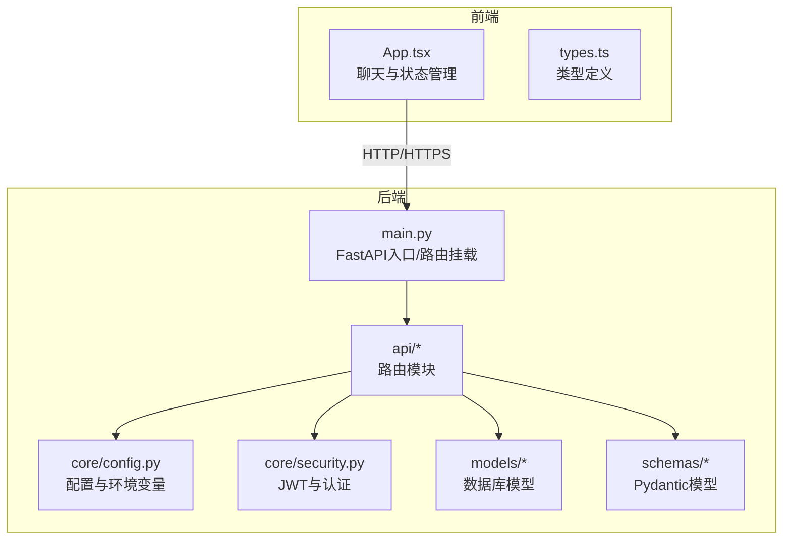
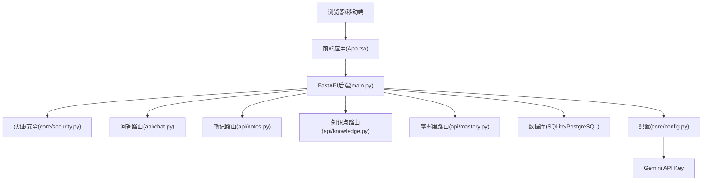
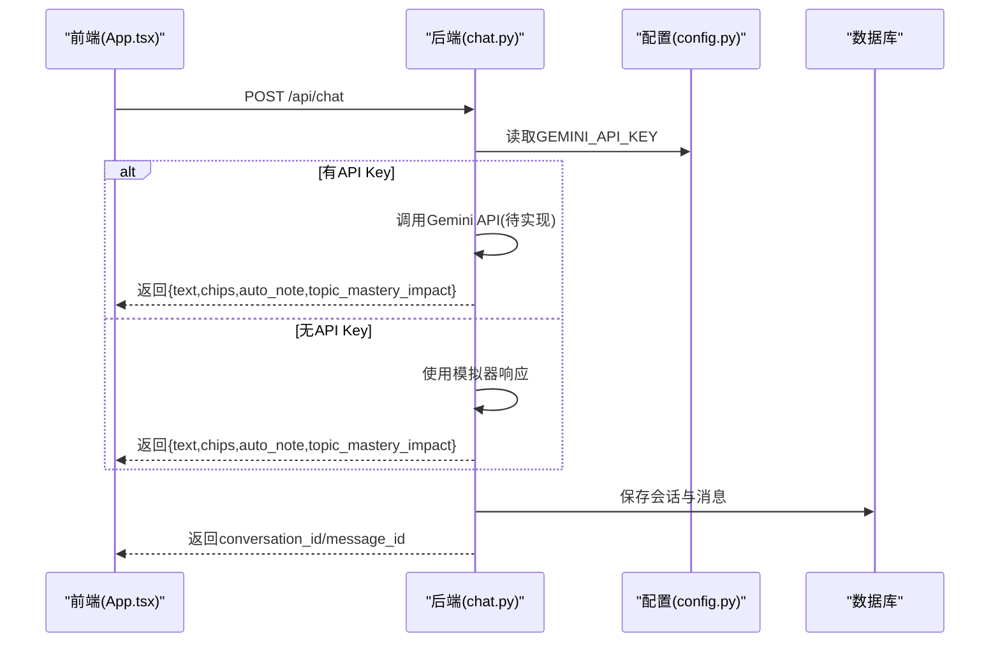
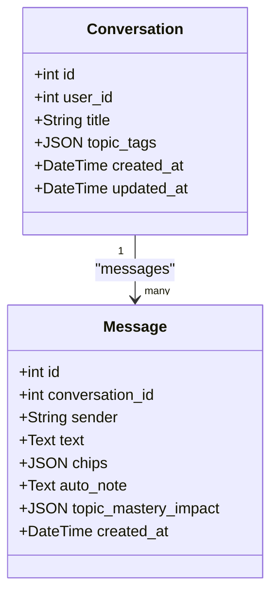
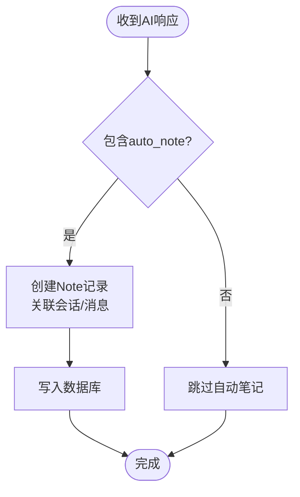
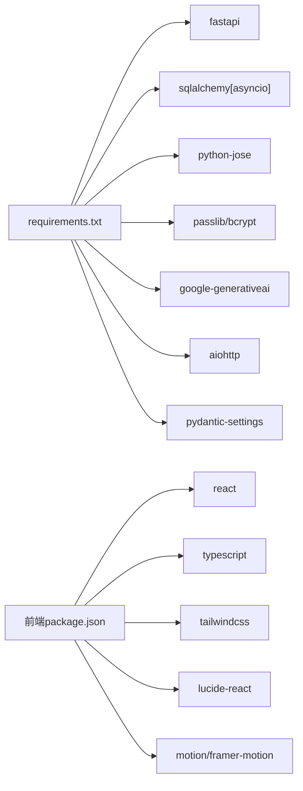

# AI集成系统

<cite>
**本文引用的文件**
- [backend/app/main.py](file://backend/app/main.py)
- [backend/app/api/chat.py](file://backend/app/api/chat.py)
- [backend/app/api/knowledge.py](file://backend/app/api/knowledge.py)
- [backend/app/api/notes.py](file://backend/app/api/notes.py)
- [backend/app/api/mastery.py](file://backend/app/api/mastery.py)
- [backend/app/core/config.py](file://backend/app/core/config.py)
- [backend/app/core/security.py](file://backend/app/core/security.py)
- [backend/app/models/conversation.py](file://backend/app/models/conversation.py)
- [backend/app/models/note.py](file://backend/app/models/note.py)
- [backend/app/models/knowledge.py](file://backend/app/models/knowledge.py)
- [backend/app/schemas/conversation.py](file://backend/app/schemas/conversation.py)
- [backend/app/schemas/knowledge.py](file://backend/app/schemas/knowledge.py)
- [backend/requirements.txt](file://backend/requirements.txt)
- [front/src/App.tsx](file://front/src/App.tsx)
- [front/src/types.ts](file://front/src/types.ts)
- [PROJECT_OVERVIEW.md](file://PROJECT_OVERVIEW.md)
- [backend/README.md](file://backend/README.md)
</cite>

## 目录
1. [引言](#引言)
2. [项目结构](#项目结构)
3. [核心组件](#核心组件)
4. [架构总览](#架构总览)
5. [详细组件分析](#详细组件分析)
6. [依赖分析](#依赖分析)
7. [性能考虑](#性能考虑)
8. [故障排查指南](#故障排查指南)
9. [结论](#结论)
10. [附录](#附录)

## 引言
本文件面向Quickly AI集成系统，围绕Google Gemini API的集成实现、智能问答架构、自动笔记生成、质量控制机制、API接口规范与集成示例，以及模型选择、参数调优与成本控制等实践建议进行全面技术文档化。当前系统采用FastAPI后端与React前端，后端已预留Gemini API集成能力并通过“模拟器模式”提供即时反馈，便于开发与演示。

## 项目结构
后端采用分层架构：入口应用、路由模块、核心配置与安全、数据库模型与Pydantic Schema，以及异步SQLAlchemy ORM。前端采用React + TypeScript，通过REST API与后端交互。

图表来源
- [backend/app/main.py:1-66](file://backend/app/main.py#L1-L66)
- [backend/app/core/config.py:1-45](file://backend/app/core/config.py#L1-L45)
- [backend/app/core/security.py:1-80](file://backend/app/core/security.py#L1-L80)

章节来源
- [PROJECT_OVERVIEW.md:1-200](file://PROJECT_OVERVIEW.md#L1-L200)
- [backend/README.md:1-75](file://backend/README.md#L1-L75)

## 核心组件
- 应用入口与路由挂载：FastAPI应用初始化、CORS中间件、路由注册与健康检查。
- 认证与安全：JWT令牌签发与校验、OAuth2密码流、用户依赖注入。
- 问答与会话：消息与会话模型、聊天API、模拟器响应与自动笔记生成。
- 知识点与掌握度：知识点模型与API、用户掌握度聚合与测验结果更新。
- 笔记管理：笔记CRUD、搜索与分页。
- 配置与依赖：环境变量、数据库URL、Redis/Celery预留、Gemini API Key。

章节来源
- [backend/app/main.py:1-66](file://backend/app/main.py#L1-L66)
- [backend/app/core/security.py:1-80](file://backend/app/core/security.py#L1-L80)
- [backend/app/api/chat.py:1-252](file://backend/app/api/chat.py#L1-L252)
- [backend/app/api/knowledge.py:1-69](file://backend/app/api/knowledge.py#L1-L69)
- [backend/app/api/mastery.py:1-140](file://backend/app/api/mastery.py#L1-L140)
- [backend/app/api/notes.py:1-133](file://backend/app/api/notes.py#L1-L133)
- [backend/app/core/config.py:1-45](file://backend/app/core/config.py#L1-L45)
- [backend/requirements.txt:1-37](file://backend/requirements.txt#L1-L37)

## 架构总览
系统采用前后端分离，前端负责UI与交互，后端提供REST API与业务逻辑。Gemini集成通过配置开关实现“模拟器模式”与“真实AI模式”的无缝切换，便于开发与生产部署。

图表来源
- [backend/app/main.py:26-50](file://backend/app/main.py#L26-L50)
- [backend/app/core/config.py:32-33](file://backend/app/core/config.py#L32-L33)
- [backend/app/api/chat.py:78-150](file://backend/app/api/chat.py#L78-L150)

## 详细组件分析

### Google Gemini API集成实现
- 集成位置与开关：后端通过配置读取GEMINI_API_KEY，状态端点返回当前模式（模拟器或gemini）。
- 模拟器模式：当前聊天API返回预设模板与关键词匹配的响应，包含知识点标签、自动笔记与掌握度影响。
- 真实模式接入：后端已引入google-generativeai与aiohttp依赖，可在chat路由中替换为真实调用，实现上下文拼接、流式/非流式响应与错误处理。

图表来源
- [backend/app/api/chat.py:78-150](file://backend/app/api/chat.py#L78-L150)
- [backend/app/core/config.py:32-33](file://backend/app/core/config.py#L32-L33)
- [backend/app/main.py:58-65](file://backend/app/main.py#L58-L65)

章节来源
- [backend/app/main.py:58-65](file://backend/app/main.py#L58-L65)
- [backend/app/api/chat.py:24-68](file://backend/app/api/chat.py#L24-L68)
- [backend/requirements.txt:21-23](file://backend/requirements.txt#L21-L23)

### 智能问答系统架构设计
- 消息处理：用户消息与AI消息均持久化，AI消息包含chips（知识点标签）、auto_note（自动笔记内容）、topic_mastery_impact（掌握度影响）。
- 上下文管理：会话表记录用户与消息的关联，支持按会话检索消息历史。
- 会话状态维护：会话标题、话题标签、时间戳自动维护；消息按创建时间排序返回。

图表来源
- [backend/app/models/conversation.py:11-54](file://backend/app/models/conversation.py#L11-L54)

章节来源
- [backend/app/api/chat.py:85-150](file://backend/app/api/chat.py#L85-L150)
- [backend/app/models/conversation.py:11-54](file://backend/app/models/conversation.py#L11-L54)
- [backend/app/schemas/conversation.py:11-73](file://backend/app/schemas/conversation.py#L11-L73)

### 自动笔记生成功能
- 触发条件：当AI响应包含auto_note字段时，后端自动创建笔记记录，关联到会话与消息。
- 结构化存储：笔记包含topic、content、来源会话与消息ID、是否自动生成标记。
- 关联关系：通过外键将笔记与用户、会话、消息建立关联，便于后续检索与导出。

图表来源
- [backend/app/api/chat.py:125-136](file://backend/app/api/chat.py#L125-L136)
- [backend/app/models/note.py:11-35](file://backend/app/models/note.py#L11-L35)

章节来源
- [backend/app/api/chat.py:125-136](file://backend/app/api/chat.py#L125-L136)
- [backend/app/models/note.py:11-35](file://backend/app/models/note.py#L11-L35)

### AI响应的质量控制机制
- 内容过滤与安全检查：当前未实现专门的过滤器，建议在Gemini调用前对用户输入与上下文进行敏感词与合规性检查；对模型输出进行二次校验与摘要化处理。
- 性能优化：启用Redis缓存热点会话与知识点向量；对长上下文进行截断与摘要；并发请求限流与重试策略。
- 错误恢复：捕获网络异常与API限流错误，回退至模拟器响应并提示用户；记录错误日志与追踪ID以便排障。

章节来源
- [backend/app/api/chat.py:110-113](file://backend/app/api/chat.py#L110-L113)
- [backend/app/core/config.py:26-37](file://backend/app/core/config.py#L26-L37)

### API接口规范与集成示例
- 健康检查与模式检测
  - GET /api/status：返回服务状态与当前模式（simulator/gemini）及API Key存在性。
- 认证
  - POST /api/auth/login：登录获取JWT。
  - GET /api/auth/me：获取当前用户信息。
- 问答
  - POST /api/chat/chat：发送问题，返回AI文本、chips、auto_note、topic_mastery_impact、conversation_id、message_id。
  - GET /api/chat/conversations：获取会话历史。
  - GET /api/chat/conversations/{conversation_id}/messages：获取指定会话的消息列表。
- 笔记
  - GET /api/notes/?search=&skip=&limit=：分页检索笔记，支持关键词搜索。
  - GET /api/notes/{id}：获取单条笔记。
  - POST /api/notes/：创建笔记。
  - PUT /api/notes/{id}：更新笔记。
  - DELETE /api/notes/{id}：删除笔记。
- 知识点
  - GET /api/knowledge/?category=：获取知识点列表。
  - GET /api/knowledge/{kp_id}：获取单个知识点。
  - POST /api/knowledge/：创建知识点。
- 掌握度
  - GET /api/mastery/overview：获取掌握度概览。
  - GET /api/mastery/：获取所有掌握度记录。
  - POST /api/mastery/quiz/{knowledge_point_id}：提交测验结果并更新掌握度。

章节来源
- [backend/app/main.py:52-65](file://backend/app/main.py#L52-L65)
- [backend/README.md:41-66](file://backend/README.md#L41-L66)
- [backend/app/api/chat.py:78-252](file://backend/app/api/chat.py#L78-L252)
- [backend/app/api/notes.py:20-133](file://backend/app/api/notes.py#L20-L133)
- [backend/app/api/knowledge.py:20-69](file://backend/app/api/knowledge.py#L20-L69)
- [backend/app/api/mastery.py:20-140](file://backend/app/api/mastery.py#L20-L140)

### 前端集成示例
- 前端通过fetch调用后端API，动态渲染聊天消息、自动笔记与掌握度分数。
- 预设问题与快捷操作提升交互效率；文件上传上下文模拟器占位。
- 动态提示下一步学习建议，基于掌握度最低项生成个性化路径。

章节来源
- [front/src/App.tsx:155-245](file://front/src/App.tsx#L155-L245)
- [front/src/types.ts:1-29](file://front/src/types.ts#L1-L29)

## 依赖分析
- 后端依赖：FastAPI、SQLAlchemy异步、JWT、bcrypt、google-generativeai、aiohttp、pydantic-settings等。
- 前端依赖：React、TypeScript、Vite、Tailwind CSS、Lucide图标、Motion动画等。
- 配置耦合：Gemini API Key通过环境变量注入，决定运行模式；数据库URL支持SQLite与PostgreSQL切换。

图表来源
- [backend/requirements.txt:1-37](file://backend/requirements.txt#L1-L37)

章节来源
- [backend/requirements.txt:1-37](file://backend/requirements.txt#L1-L37)
- [PROJECT_OVERVIEW.md:60-75](file://PROJECT_OVERVIEW.md#L60-L75)

## 性能考虑
- 数据库性能：合理索引（用户ID、会话ID、时间戳）；分页查询限制；异步ORM减少阻塞。
- 缓存策略：Redis缓存热门会话、知识点向量与用户偏好；LRU淘汰与TTL控制。
- 并发与限流：对Gemini API调用实施速率限制与指数退避；请求池大小与超时配置。
- 日志与监控：结构化日志、链路追踪ID、错误率与延迟指标上报。

## 故障排查指南
- API不可用或模式异常
  - 检查 /api/status 是否返回期望模式；确认 .env 中GEMINI_API_KEY是否配置。
- 认证失败
  - 确认JWT签名密钥、过期时间与OAuth2令牌格式；检查用户是否存在。
- 数据库连接问题
  - 检查DATABASE_URL与驱动；SQLite文件权限；PostgreSQL连接串与账号权限。
- Gemini调用失败
  - 检查API Key有效性、配额与频率限制；网络代理与超时设置；日志中错误码与重试策略。

章节来源
- [backend/app/main.py:58-65](file://backend/app/main.py#L58-L65)
- [backend/app/core/security.py:54-80](file://backend/app/core/security.py#L54-L80)
- [backend/app/core/config.py:24-25](file://backend/app/core/config.py#L24-L25)

## 结论
Quickly AI集成系统已完成基础框架与模拟器问答能力，具备良好的扩展性。通过引入Gemini API、完善质量控制与性能优化策略，可实现从问答到自动笔记、从知识点到掌握度的闭环学习体验。建议优先落地真实AI调用、接入缓存与限流、补充内容过滤与安全检查，并持续优化模型参数与成本控制。

## 附录
- 环境变量与配置要点
  - 后端：DEBUG、SECRET_KEY、DATABASE_URL、REDIS_URL、CORS_ORIGINS、GEMINI_API_KEY、CELERY_BROKER_URL、CELERY_RESULT_BACKEND。
  - 前端：VITE_API_BASE_URL。
- 开发与部署建议
  - 开发：SQLite + 本地Redis；生产：PostgreSQL + Redis集群 + Celery队列。
  - 安全：生产环境务必更换默认密钥；启用HTTPS与CORS白名单。
  - 成本：按调用次数与上下文字节计费，建议开启缓存与上下文截断策略。

章节来源
- [PROJECT_OVERVIEW.md:164-186](file://PROJECT_OVERVIEW.md#L164-L186)
- [backend/app/core/config.py:10-45](file://backend/app/core/config.py#L10-L45)