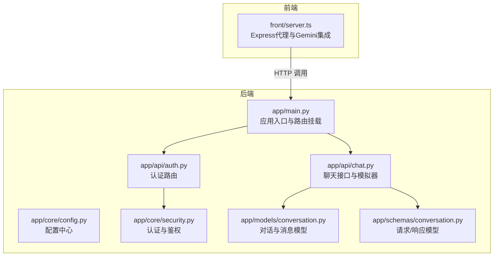
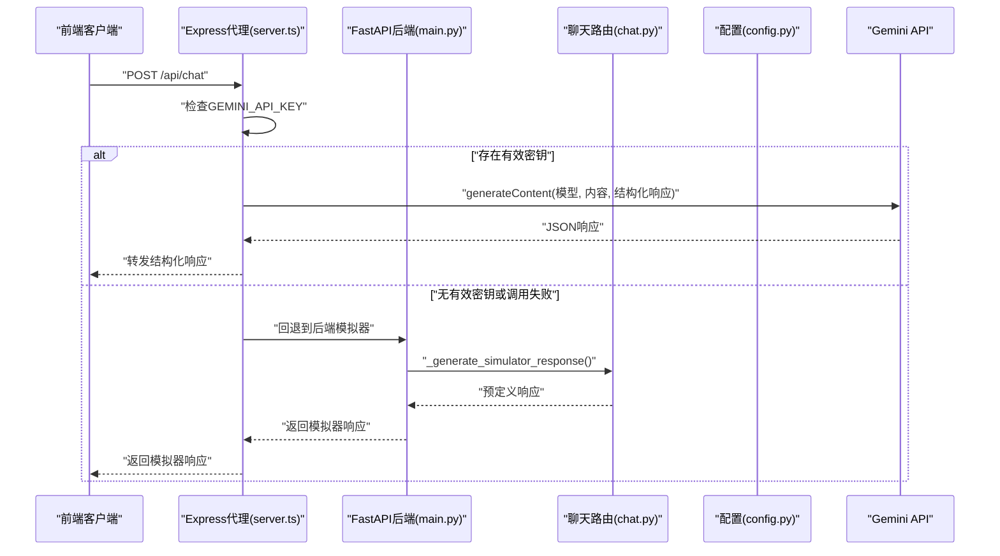
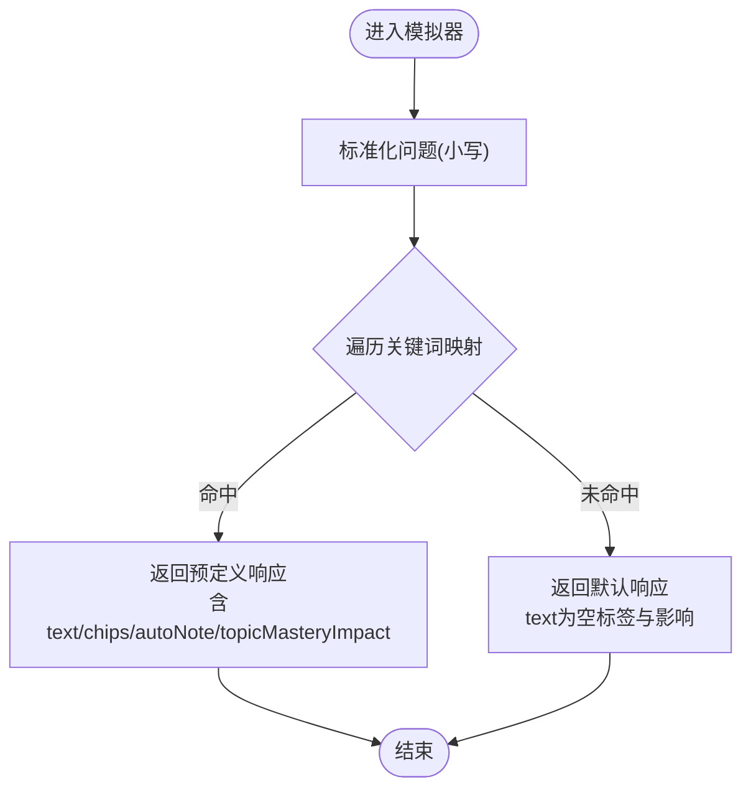
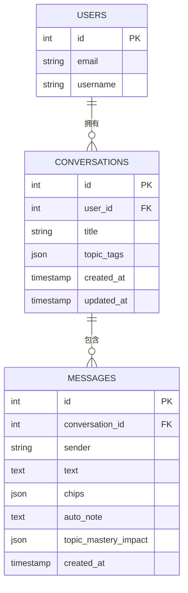
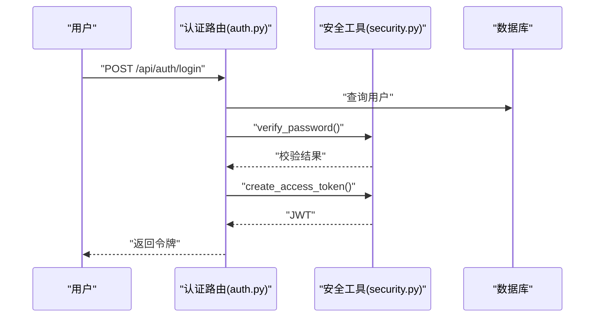
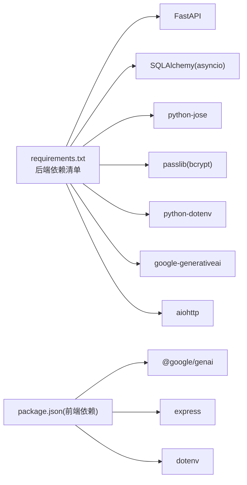

# Gemini API集成

<cite>
**本文引用的文件**
- [backend/app/main.py](file://backend/app/main.py)
- [backend/app/core/config.py](file://backend/app/core/config.py)
- [backend/app/api/chat.py](file://backend/app/api/chat.py)
- [backend/app/schemas/conversation.py](file://backend/app/schemas/conversation.py)
- [backend/app/models/conversation.py](file://backend/app/models/conversation.py)
- [backend/app/core/security.py](file://backend/app/core/security.py)
- [backend/app/api/auth.py](file://backend/app/api/auth.py)
- [backend/README.md](file://backend/README.md)
- [backend/requirements.txt](file://backend/requirements.txt)
- [front/server.ts](file://front/server.ts)
- [front/README.md](file://front/README.md)
</cite>

## 目录
1. [引言](#引言)
2. [项目结构](#项目结构)
3. [核心组件](#核心组件)
4. [架构总览](#架构总览)
5. [详细组件分析](#详细组件分析)
6. [依赖关系分析](#依赖关系分析)
7. [性能考量](#性能考量)
8. [故障排查指南](#故障排查指南)
9. [结论](#结论)
10. [附录](#附录)

## 引言
本文件面向“Gemini API集成”的技术文档，系统阐述后端与前端如何协同实现Google Gemini API的接入与模拟器模式。内容涵盖：
- API密钥配置与运行模式识别
- 请求格式与响应结构定义
- 响应处理机制与模拟器模式实现
- 安全考虑（密钥管理、速率限制、错误处理）
- 完整集成示例与配置指南
- 性能优化与成本控制策略

## 项目结构
后端采用FastAPI框架，按功能模块组织路由；前端使用Express作为代理服务，负责初始化Gemini客户端、构建请求与解析响应，并在失败时回退至模拟器。

图表来源
- [backend/app/main.py:1-66](file://backend/app/main.py#L1-L66)
- [backend/app/api/chat.py:1-252](file://backend/app/api/chat.py#L1-L252)
- [backend/app/models/conversation.py:1-54](file://backend/app/models/conversation.py#L1-L54)
- [backend/app/schemas/conversation.py:1-73](file://backend/app/schemas/conversation.py#L1-L73)
- [backend/app/core/security.py:1-80](file://backend/app/core/security.py#L1-L80)
- [backend/app/api/auth.py:1-99](file://backend/app/api/auth.py#L1-L99)
- [front/server.ts:1-261](file://front/server.ts#L1-L261)

章节来源
- [backend/app/main.py:1-66](file://backend/app/main.py#L1-L66)
- [backend/README.md:1-75](file://backend/README.md#L1-L75)

## 核心组件
- 配置中心：集中管理应用配置，包括Gemini API密钥、CORS、数据库、Redis等。
- 聊天接口：提供会话管理与AI响应生成，内置模拟器模式与关键词匹配算法。
- 认证与安全：基于JWT的用户认证流程与密码哈希。
- 前端代理：初始化Gemini客户端、构造请求、解析响应并回退模拟器。
- 数据模型与序列化：定义对话、消息、聊天请求/响应的数据结构。

章节来源
- [backend/app/core/config.py:10-45](file://backend/app/core/config.py#L10-L45)
- [backend/app/api/chat.py:24-184](file://backend/app/api/chat.py#L24-L184)
- [backend/app/core/security.py:54-80](file://backend/app/core/security.py#L54-L80)
- [front/server.ts:18-40](file://front/server.ts#L18-L40)
- [backend/app/schemas/conversation.py:58-73](file://backend/app/schemas/conversation.py#L58-L73)

## 架构总览
下图展示从前端到后端再到Gemini API的整体调用链路，以及模拟器模式的回退路径。

图表来源
- [front/server.ts:18-40](file://front/server.ts#L18-L40)
- [front/server.ts:196-256](file://front/server.ts#L196-L256)
- [backend/app/main.py:62-65](file://backend/app/main.py#L62-L65)
- [backend/app/api/chat.py:153-173](file://backend/app/api/chat.py#L153-L173)

## 详细组件分析

### 配置与运行模式
- 配置项：GEMINI_API_KEY为空字符串时，系统进入模拟器模式；后端状态接口会返回当前模式与密钥可用性。
- 密钥来源：后端读取环境变量；前端同样读取环境变量初始化客户端。
- 模式切换：后端根据密钥是否存在动态决定调用路径。

章节来源
- [backend/app/core/config.py:32-34](file://backend/app/core/config.py#L32-L34)
- [backend/app/main.py:62-65](file://backend/app/main.py#L62-L65)
- [front/server.ts:18-40](file://front/server.ts#L18-L40)

### 请求格式与响应结构
- 请求体：聊天接口接收问题文本与可选会话ID。
- 响应体：包含AI回复文本、知识标签、自动生成笔记、主题掌握度影响、下一次建议、会话与消息ID。
- 前端结构化响应：前端在成功时要求Gemini返回符合schema的JSON对象，包含text、chips、autoNote、topicMasteryImpact、nextSuggestion等字段。

章节来源
- [backend/app/schemas/conversation.py:58-73](file://backend/app/schemas/conversation.py#L58-L73)
- [backend/app/api/chat.py:78-150](file://backend/app/api/chat.py#L78-L150)
- [front/server.ts:207-242](file://front/server.ts#L207-L242)

### 模拟器模式实现
- 预定义响应映射：针对特定关键词（如“逻辑回归”、“梯度下降”、“正则化”）提供结构化响应。
- 关键词匹配算法：对输入问题进行大小写无关的子串匹配，命中即返回对应响应。
- 默认响应策略：未命中关键词时返回通用提示文本，同时清空知识标签与掌握度影响。
- 主题掌握度影响：根据响应中的知识标签累加各主题分数，上限100。

图表来源
- [backend/app/api/chat.py:153-173](file://backend/app/api/chat.py#L153-L173)
- [backend/app/api/chat.py:176-183](file://backend/app/api/chat.py#L176-L183)

章节来源
- [backend/app/api/chat.py:24-68](file://backend/app/api/chat.py#L24-L68)
- [backend/app/api/chat.py:153-183](file://backend/app/api/chat.py#L153-L183)

### 数据持久化与会话管理
- 会话与消息模型：支持对话标题、话题标签、消息发送方、文本、AI元数据（知识标签、自动笔记、掌握度影响）。
- 会话历史查询：按用户过滤并按更新时间倒序返回最近会话。
- 消息查询：按会话ID与用户权限过滤，按创建时间正序返回消息。

图表来源
- [backend/app/models/conversation.py:11-54](file://backend/app/models/conversation.py#L11-L54)

章节来源
- [backend/app/models/conversation.py:11-54](file://backend/app/models/conversation.py#L11-L54)
- [backend/app/api/chat.py:220-251](file://backend/app/api/chat.py#L220-L251)

### 认证与安全
- JWT令牌：登录成功后签发包含用户标识的访问令牌，默认算法与过期时间由配置提供。
- 当前用户：通过OAuth2 Bearer方案从请求头提取令牌并解析验证。
- 密码哈希：使用bcrypt进行密码哈希与校验。
- CORS：允许指定来源跨域访问，便于前后端联调。

图表来源
- [backend/app/api/auth.py:52-86](file://backend/app/api/auth.py#L52-L86)
- [backend/app/core/security.py:23-42](file://backend/app/core/security.py#L23-L42)
- [backend/app/core/security.py:54-80](file://backend/app/core/security.py#L54-L80)

章节来源
- [backend/app/api/auth.py:1-99](file://backend/app/api/auth.py#L1-L99)
- [backend/app/core/security.py:1-80](file://backend/app/core/security.py#L1-L80)

### 前端代理与Gemini集成
- 客户端初始化：仅当环境变量存在且非占位符时才初始化Gemini客户端。
- 结构化响应：调用generateContent时指定responseMimeType为JSON，并定义responseSchema，确保Gemini返回符合预期的结构化数据。
- 错误回退：调用失败时优雅降级为模拟器响应，避免中断用户体验。

章节来源
- [front/server.ts:18-40](file://front/server.ts#L18-L40)
- [front/server.ts:207-242](file://front/server.ts#L207-L242)
- [front/server.ts:251-255](file://front/server.ts#L251-L255)

## 依赖关系分析
- 后端依赖：FastAPI、SQLAlchemy异步、JWT、bcrypt、dotenv、google-generativeai、aiohttp等。
- 前端依赖：@google/genai、dotenv、express等。
- 关键耦合点：前端代理与后端聊天接口的协作；后端模拟器与Gemini API的可替换性。

图表来源
- [backend/requirements.txt:1-37](file://backend/requirements.txt#L1-L37)

章节来源
- [backend/requirements.txt:1-37](file://backend/requirements.txt#L1-L37)
- [front/README.md:16-20](file://front/README.md#L16-L20)

## 性能考量
- 模型选择与成本控制
  - 使用轻量模型（如gemini-3.5-flash）进行日常问答，降低token消耗与延迟。
  - 对需要更强推理能力的任务，评估更高阶模型的成本与收益。
- 结构化响应与解析
  - 前端明确responseSchema可减少后处理开销，提高稳定性。
  - 后端模拟器避免网络调用，显著降低延迟与成本。
- 缓存与重试
  - 在网关层引入缓存（如Redis）缓存热点问题的答案，减少重复调用。
  - 对外部API调用增加指数退避重试，避免雪崩效应。
- 并发与限流
  - 对聊天接口实施基于令牌的速率限制，防止滥用。
  - 合理设置队列与并发数，避免瞬时高峰导致资源耗尽。
- 日志与监控
  - 记录请求耗时、成功率、错误类型，建立告警阈值。
  - 统计token用量与费用，定期审计成本构成。

## 故障排查指南
- 无有效API密钥
  - 现象：后端状态接口返回模拟器模式；前端日志提示“未找到有效密钥”。
  - 处理：在环境变量中设置GEMINI_API_KEY，重启服务。
- Gemini调用失败
  - 现象：前端捕获异常并回退模拟器响应。
  - 处理：检查网络连通性、配额与频率限制；查看后端日志定位具体错误。
- 响应格式不符
  - 现象：前端解析失败或字段缺失。
  - 处理：确认responseSchema与后端模拟器返回字段一致；确保Gemini返回JSON。
- 认证失败
  - 现象：401未授权。
  - 处理：确认令牌有效、未过期；检查CORS配置是否允许前端域名。

章节来源
- [backend/app/main.py:62-65](file://backend/app/main.py#L62-L65)
- [front/server.ts:251-255](file://front/server.ts#L251-L255)
- [backend/app/core/security.py:59-78](file://backend/app/core/security.py#L59-L78)

## 结论
本项目通过“前端代理 + 后端模拟器”的双轨设计，实现了Gemini API的平滑集成与可控回退。在具备有效密钥时，前端直接调用Gemini并返回结构化响应；在密钥缺失或调用失败时，后端模拟器保障系统可用性。该方案兼顾了安全性、可维护性与成本控制，适合快速迭代与生产部署。

## 附录

### API集成示例与配置指南
- 后端启动
  - 创建虚拟环境并安装依赖
  - 复制并编辑环境变量文件
  - 启动Uvicorn服务
- 前端启动
  - 安装依赖
  - 在本地环境文件中设置GEMINI_API_KEY
  - 启动开发服务器
- 调用示例
  - 登录获取JWT
  - 调用聊天接口，携带Authorization: Bearer <token>
  - 若启用Gemini，将收到结构化响应；否则返回模拟器响应

章节来源
- [backend/README.md:24-40](file://backend/README.md#L24-L40)
- [front/README.md:16-20](file://front/README.md#L16-L20)