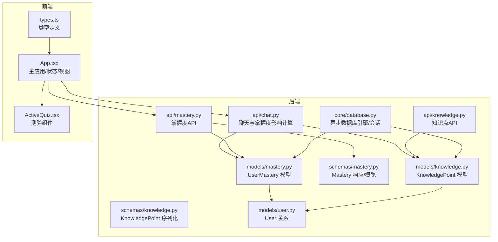
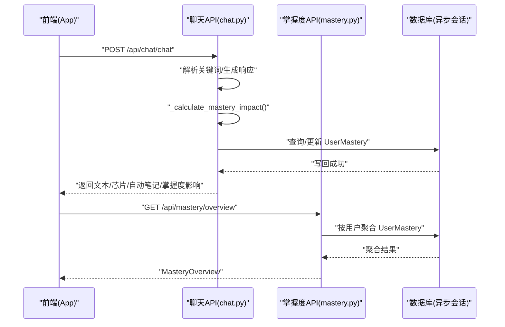
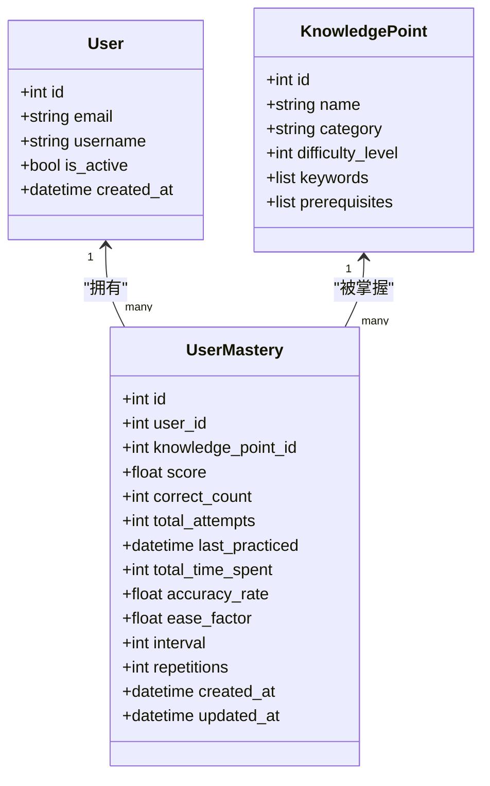
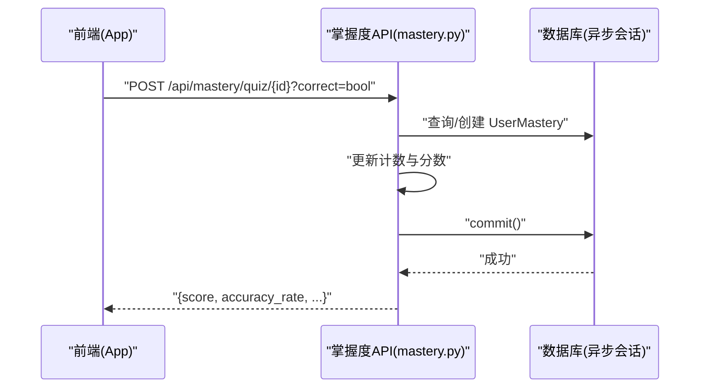
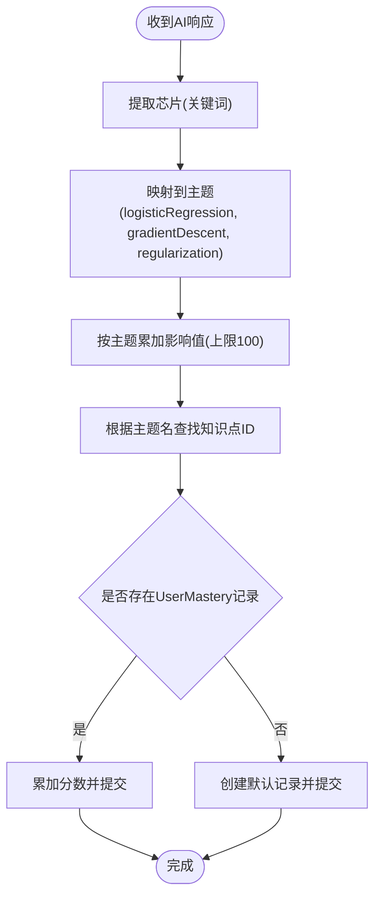
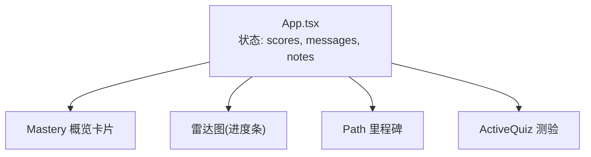
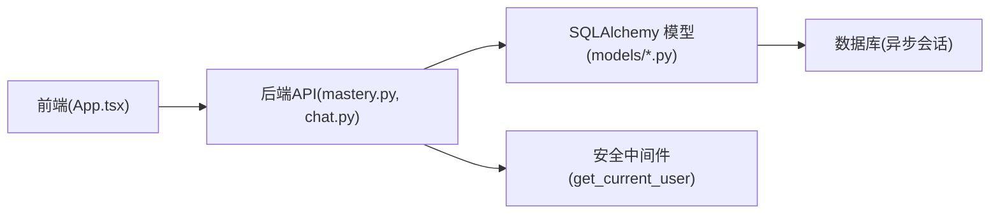

# 掌握度分数追踪

<cite>
**本文引用的文件**
- [backend/app/models/mastery.py](file://backend/app/models/mastery.py)
- [backend/app/schemas/mastery.py](file://backend/app/schemas/mastery.py)
- [backend/app/api/mastery.py](file://backend/app/api/mastery.py)
- [backend/app/models/knowledge.py](file://backend/app/models/knowledge.py)
- [backend/app/schemas/knowledge.py](file://backend/app/schemas/knowledge.py)
- [backend/app/api/knowledge.py](file://backend/app/api/knowledge.py)
- [backend/app/api/chat.py](file://backend/app/api/chat.py)
- [backend/app/models/user.py](file://backend/app/models/user.py)
- [backend/app/core/database.py](file://backend/app/core/database.py)
- [backend/README.md](file://backend/README.md)
- [front/src/App.tsx](file://front/src/App.tsx)
- [front/src/types.ts](file://front/src/types.ts)
- [front/src/components/ActiveQuiz.tsx](file://front/src/components/ActiveQuiz.tsx)
</cite>

## 目录
1. [引言](#引言)
2. [项目结构](#项目结构)
3. [核心组件](#核心组件)
4. [架构总览](#架构总览)
5. [详细组件分析](#详细组件分析)
6. [依赖关系分析](#依赖关系分析)
7. [性能考虑](#性能考虑)
8. [故障排查指南](#故障排查指南)
9. [结论](#结论)
10. [附录](#附录)

## 引言
本文件面向“掌握度分数追踪系统”，围绕以下目标展开：  
- 解释AI响应对学习掌握度的影响计算，涵盖知识点识别、分数增量与累积机制  
- 说明主题掌握度映射关系，包括关键词到知识点的对应表与分数分配策略  
- 文档化UserMastery模型的设计，包括分数更新逻辑与持久化机制  
- 提供掌握度分数的可视化展示与统计分析思路  
- 给出学习进度跟踪与个性化推荐的实现思路  

该系统采用前后端分离架构：后端基于FastAPI+SQLAlchemy异步数据库访问，前端使用React+TypeScript构建交互界面。掌握度数据贯穿聊天问答、测验提交、知识图谱等环节。

## 项目结构
后端采用按功能分层组织：models（ORM模型）、schemas（Pydantic序列化）、api（路由与业务流程）、core（配置与数据库会话管理）。前端采用组件化结构，包含主应用、侧边栏、右侧面板、笔记箱、测验组件等。

图表来源
- [backend/app/models/mastery.py:11-44](file://backend/app/models/mastery.py#L11-L44)
- [backend/app/schemas/mastery.py:10-53](file://backend/app/schemas/mastery.py#L10-L53)
- [backend/app/api/mastery.py:17-140](file://backend/app/api/mastery.py#L17-L140)
- [backend/app/models/knowledge.py:10-32](file://backend/app/models/knowledge.py#L10-L32)
- [backend/app/schemas/knowledge.py:10-35](file://backend/app/schemas/knowledge.py#L10-L35)
- [backend/app/api/knowledge.py:17-69](file://backend/app/api/knowledge.py#L17-L69)
- [backend/app/api/chat.py:24-252](file://backend/app/api/chat.py#L24-L252)
- [backend/app/models/user.py:11-39](file://backend/app/models/user.py#L11-L39)
- [backend/app/core/database.py:10-46](file://backend/app/core/database.py#L10-L46)
- [front/src/App.tsx:1-840](file://front/src/App.tsx#L1-L840)
- [front/src/types.ts:1-29](file://front/src/types.ts#L1-L29)
- [front/src/components/ActiveQuiz.tsx](file://front/src/components/ActiveQuiz.tsx)

章节来源
- [backend/README.md:1-75](file://backend/README.md#L1-L75)
- [backend/app/core/database.py:10-46](file://backend/app/core/database.py#L10-L46)

## 核心组件
- UserMastery模型：记录用户对知识点的掌握分数、答题统计、SM-2间隔记忆参数、时间戳等，支持按用户与知识点维度聚合与查询。
- Mastery序列化：定义创建、更新、响应与概览（按主题聚合）的数据结构。
- KnowledgePoint模型：描述知识点名称、类别、难度、关键词、前置知识等元数据。
- 掌握度API：提供概览、列表、单点查询、测验提交等接口。
- 聊天API：解析AI响应中的关键词，计算对三大主题（逻辑回归、梯度下降、正则化）的掌握度影响，并更新UserMastery。
- 数据库会话：统一的异步引擎与会话工厂，支持SQLite/PostgreSQL等。

章节来源
- [backend/app/models/mastery.py:11-44](file://backend/app/models/mastery.py#L11-L44)
- [backend/app/schemas/mastery.py:10-53](file://backend/app/schemas/mastery.py#L10-L53)
- [backend/app/models/knowledge.py:10-32](file://backend/app/models/knowledge.py#L10-L32)
- [backend/app/api/mastery.py:17-140](file://backend/app/api/mastery.py#L17-L140)
- [backend/app/api/chat.py:24-252](file://backend/app/api/chat.py#L24-L252)
- [backend/app/core/database.py:10-46](file://backend/app/core/database.py#L10-L46)

## 架构总览
系统围绕“知识-掌握度-交互”闭环工作：  
- 知识点由KnowledgePoint建模，支持关键词与前置关系  
- 用户与掌握度通过UserMastery关联，记录分数与统计  
- 聊天过程中，AI响应的关键词映射到主题，计算影响并写回掌握度  
- 测验提交直接更新掌握度分数  
- 前端负责展示掌握度概览、雷达图、学习路径与测验入口

图表来源
- [backend/app/api/chat.py:78-151](file://backend/app/api/chat.py#L78-L151)
- [backend/app/api/chat.py:176-218](file://backend/app/api/chat.py#L176-L218)
- [backend/app/api/mastery.py:20-61](file://backend/app/api/mastery.py#L20-L61)

## 详细组件分析

### UserMastery 模型与持久化
- 字段设计
  - 标识与外键：用户ID、知识点ID
  - 掌握度与统计：分数、正确次数、总尝试次数、准确率
  - 时间与行为：最后练习时间、总学习时长
  - 记忆算法参数：SM-2易学因子、间隔、重复次数
  - 时间戳：创建与更新
- 关系：与User、KnowledgePoint双向关联，支持级联删除与更新
- 持久化：通过异步会话提交事务，确保一致性

图表来源
- [backend/app/models/user.py:11-39](file://backend/app/models/user.py#L11-L39)
- [backend/app/models/knowledge.py:10-32](file://backend/app/models/knowledge.py#L10-L32)
- [backend/app/models/mastery.py:11-44](file://backend/app/models/mastery.py#L11-L44)

章节来源
- [backend/app/models/mastery.py:11-44](file://backend/app/models/mastery.py#L11-L44)
- [backend/app/models/user.py:34-39](file://backend/app/models/user.py#L34-L39)
- [backend/app/models/knowledge.py:26-27](file://backend/app/models/knowledge.py#L26-L27)

### 掌握度API：概览、列表与测验
- 概览接口：按用户聚合UserMastery，将知识点ID映射到三大主题，计算平均分与整体均值
- 列表接口：返回当前用户的全部掌握度记录
- 单点查询：按知识点ID返回指定记录
- 测验提交：根据正确与否增加/减少分数，更新准确率与最后练习时间

图表来源
- [backend/app/api/mastery.py:94-139](file://backend/app/api/mastery.py#L94-L139)

章节来源
- [backend/app/api/mastery.py:20-61](file://backend/app/api/mastery.py#L20-L61)
- [backend/app/api/mastery.py:63-92](file://backend/app/api/mastery.py#L63-L92)
- [backend/app/api/mastery.py:94-139](file://backend/app/api/mastery.py#L94-L139)

### AI响应对掌握度的影响计算
- 关键词匹配：聊天API内置模拟响应字典，包含文本、芯片（关键词）与自动笔记
- 主题映射：通过关键词到主题的映射表，计算对三大主题的掌握度影响
- 影响累加：将影响值按主题累加，上限100
- 写回策略：根据主题名查找对应的知识点ID，若存在则累加分数，否则创建默认记录

图表来源
- [backend/app/api/chat.py:24-68](file://backend/app/api/chat.py#L24-L68)
- [backend/app/api/chat.py:70-76](file://backend/app/api/chat.py#L70-L76)
- [backend/app/api/chat.py:176-184](file://backend/app/api/chat.py#L176-L184)
- [backend/app/api/chat.py:186-218](file://backend/app/api/chat.py#L186-L218)

章节来源
- [backend/app/api/chat.py:153-184](file://backend/app/api/chat.py#L153-L184)
- [backend/app/api/chat.py:186-218](file://backend/app/api/chat.py#L186-L218)

### 主题掌握度映射关系与分数分配策略
- 映射表：关键词到主题的权重矩阵，用于量化AI响应对三大主题的影响
- 分配策略：将影响值按主题累加，上限100；同时支持按知识点ID的简化映射（概览接口）
- 建议扩展：引入向量相似度或规则引擎，动态调整权重与阈值

章节来源
- [backend/app/api/chat.py:70-76](file://backend/app/api/chat.py#L70-L76)
- [backend/app/api/mastery.py:44-50](file://backend/app/api/mastery.py#L44-L50)

### 知识点模型与知识图谱
- 字段：名称、描述、类别、难度、关键词、嵌入、前置知识、时间戳
- 用途：支撑关键词检索、相似度搜索、学习路径规划
- 扩展：可结合向量嵌入实现语义检索与推荐

章节来源
- [backend/app/models/knowledge.py:10-32](file://backend/app/models/knowledge.py#L10-L32)
- [backend/app/schemas/knowledge.py:10-35](file://backend/app/schemas/knowledge.py#L10-L35)
- [backend/app/api/knowledge.py:20-69](file://backend/app/api/knowledge.py#L20-L69)

### 前端可视化与交互
- 掌握度概览：三大主题卡片与雷达图（进度条）展示
- 学习路径：里程碑式学习路径，标注解锁状态
- 测验中心：按主题发起测验，完成后按得分提升掌握度
- 实时更新：聊天接口返回的掌握度影响在前端即时反映

图表来源
- [front/src/App.tsx:579-673](file://front/src/App.tsx#L579-L673)
- [front/src/App.tsx:749-800](file://front/src/App.tsx#L749-L800)
- [front/src/components/ActiveQuiz.tsx](file://front/src/components/ActiveQuiz.tsx)
- [front/src/types.ts:10-14](file://front/src/types.ts#L10-L14)

章节来源
- [front/src/App.tsx:579-673](file://front/src/App.tsx#L579-L673)
- [front/src/App.tsx:749-800](file://front/src/App.tsx#L749-L800)
- [front/src/types.ts:10-14](file://front/src/types.ts#L10-L14)

## 依赖关系分析
- 后端依赖：FastAPI、SQLAlchemy异步引擎、Pydantic序列化、安全中间件
- 数据库：统一异步会话工厂，支持SQLite/PostgreSQL
- 前端依赖：React、Lucide图标、Motion动画、类型定义

图表来源
- [backend/app/api/mastery.py:17-140](file://backend/app/api/mastery.py#L17-L140)
- [backend/app/api/chat.py:24-252](file://backend/app/api/chat.py#L24-L252)
- [backend/app/core/database.py:39-46](file://backend/app/core/database.py#L39-L46)

章节来源
- [backend/README.md:67-75](file://backend/README.md#L67-L75)
- [backend/app/core/database.py:10-46](file://backend/app/core/database.py#L10-L46)

## 性能考虑
- 异步I/O：使用SQLAlchemy异步引擎与会话，降低阻塞
- 会话池：针对非SQLite场景启用连接池参数，提升并发
- 查询优化：聚合查询尽量使用原生SQL或聚合函数，避免全表扫描
- 前端渲染：卡片与雷达图采用受控组件，避免不必要的重渲染
- 缓存策略：可引入Redis缓存掌握度概览与热门知识点，降低数据库压力

## 故障排查指南
- 掌握度未更新
  - 检查聊天响应是否包含芯片与主题影响字段
  - 确认映射表中关键词是否命中
  - 核对UserMastery记录是否创建/更新成功
- 概览显示默认值
  - 确认用户是否有掌握度记录
  - 检查知识点ID到主题的映射逻辑
- 数据库连接异常
  - 检查DATABASE_URL与DEBUG配置
  - 非SQLite场景确认连接池参数

章节来源
- [backend/app/api/chat.py:153-184](file://backend/app/api/chat.py#L153-L184)
- [backend/app/api/mastery.py:31-38](file://backend/app/api/mastery.py#L31-L38)
- [backend/app/core/database.py:16-30](file://backend/app/core/database.py#L16-L30)

## 结论
本系统通过“关键词→主题→掌握度”的链路，实现了AI驱动的掌握度追踪与反馈闭环。UserMastery模型提供了稳定的分数与统计维度，配合聊天与测验两条主要输入通道，前端以卡片与雷达图直观呈现学习进展。后续可在映射策略、知识图谱与推荐系统方面进一步增强，以实现更精准的个性化学习路径。

## 附录
- API端点参考
  - 掌握度概览：GET /api/mastery/overview
  - 掌握度列表：GET /api/mastery/
  - 单点查询：GET /api/mastery/{knowledge_point_id}
  - 提交测验：POST /api/mastery/quiz/{knowledge_point_id}?correct=bool
  - 聊天问答：POST /api/chat/chat
- 数据模型要点
  - UserMastery：分数、统计、时间、记忆参数
  - KnowledgePoint：名称、类别、关键词、难度、前置
  - User：与笔记、对话、掌握度、复习任务、设置的关系

章节来源
- [backend/README.md:41-66](file://backend/README.md#L41-L66)
- [backend/app/models/mastery.py:11-44](file://backend/app/models/mastery.py#L11-L44)
- [backend/app/models/knowledge.py:10-32](file://backend/app/models/knowledge.py#L10-L32)
- [backend/app/models/user.py:34-39](file://backend/app/models/user.py#L34-L39)