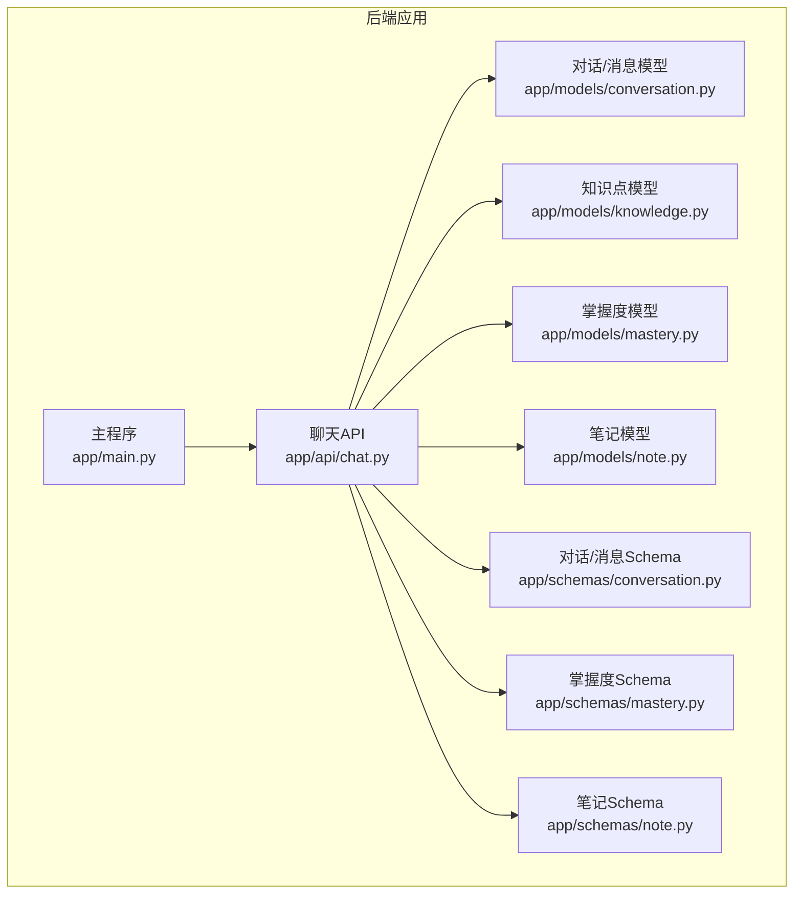
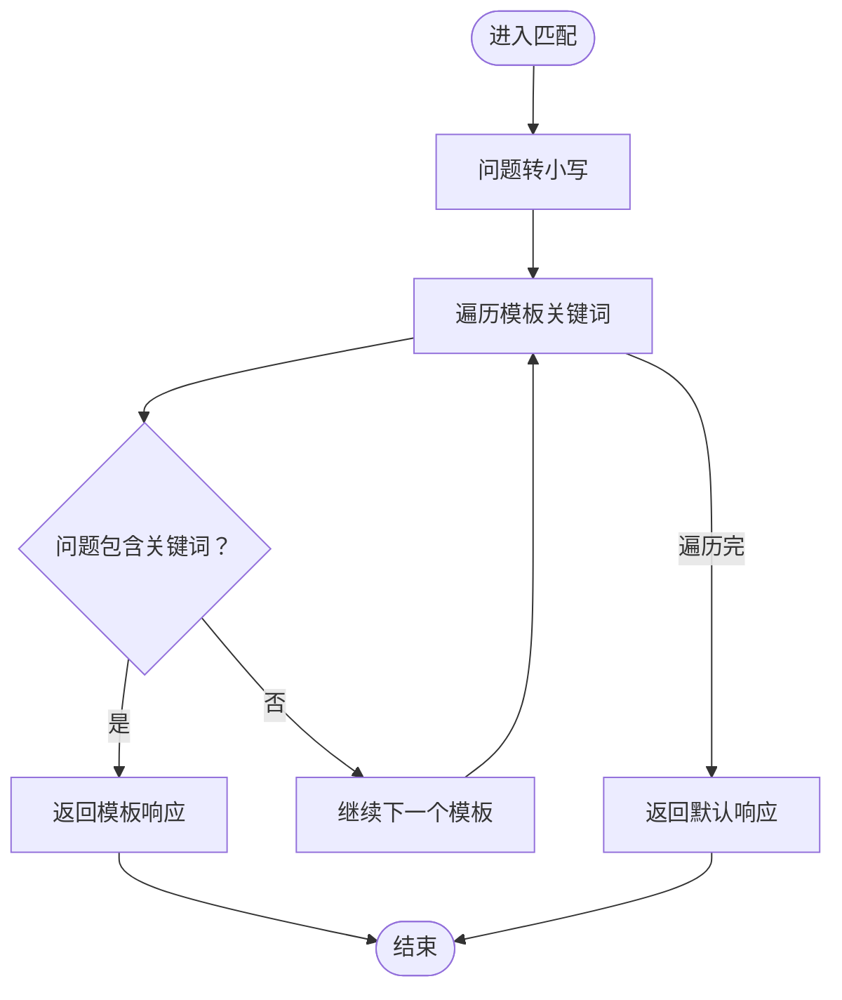
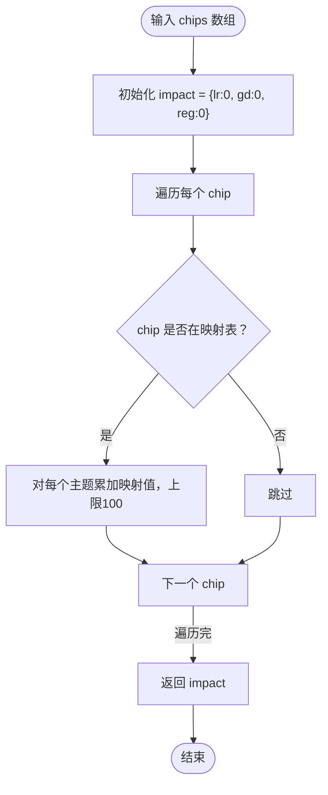
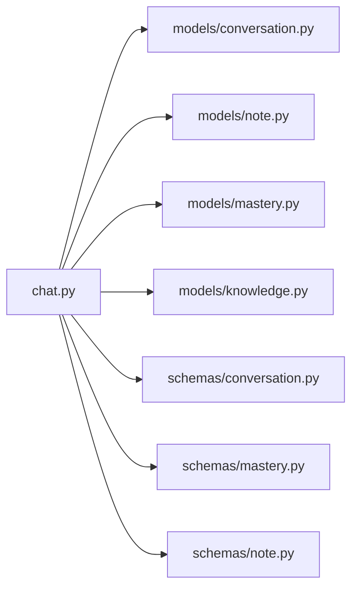

# AI响应生成

<cite>
**本文引用的文件**
- [chat.py](file://backend/app/api/chat.py)
- [conversation.py](file://backend/app/models/conversation.py)
- [conversation.py](file://backend/app/schemas/conversation.py)
- [knowledge.py](file://backend/app/models/knowledge.py)
- [mastery.py](file://backend/app/models/mastery.py)
- [mastery.py](file://backend/app/schemas/mastery.py)
- [note.py](file://backend/app/models/note.py)
- [note.py](file://backend/app/schemas/note.py)
- [main.py](file://backend/app/main.py)
- [README.md](file://backend/README.md)
</cite>

## 目录
1. [引言](#引言)
2. [项目结构](#项目结构)
3. [核心组件](#核心组件)
4. [架构总览](#架构总览)
5. [详细组件分析](#详细组件分析)
6. [依赖分析](#依赖分析)
7. [性能考虑](#性能考虑)
8. [故障排除指南](#故障排除指南)
9. [结论](#结论)
10. [附录](#附录)

## 引言
本文件面向“AI响应生成功能”，聚焦于模拟器模式下的响应机制实现，包括关键词匹配算法、预定义响应模板、响应数据结构（text、chips、auto_note、topic_mastery_impact）、主题掌握度影响计算逻辑（TOPIC_MASTERY_IMPACT 映射表与分数累积机制）、默认响应与错误恢复策略，以及响应质量评估与改进建议。文档同时给出与数据库模型、API 路由、主程序入口的关联说明，帮助开发者快速理解与扩展该功能。

## 项目结构
后端采用 FastAPI + SQLAlchemy 架构，AI 响应生成位于聊天 API 中，结合对话、消息、知识点、掌握度、笔记等模型完成端到端流程。主程序负责路由挂载与启动生命周期管理。



图表来源
- [main.py:10](file://backend/app/main.py#L10)
- [chat.py:11-22](file://backend/app/api/chat.py#L11-L22)
- [conversation.py:11-54](file://backend/app/models/conversation.py#L11-L54)
- [knowledge.py:10-32](file://backend/app/models/knowledge.py#L10-L32)
- [mastery.py:11-44](file://backend/app/models/mastery.py#L11-L44)
- [note.py:11-35](file://backend/app/models/note.py#L11-L35)
- [conversation.py:11-73](file://backend/app/schemas/conversation.py#L11-L73)
- [mastery.py:10-53](file://backend/app/schemas/mastery.py#L10-L53)
- [note.py:10-40](file://backend/app/schemas/note.py#L10-L40)

章节来源
- [main.py:10-50](file://backend/app/main.py#L10-L50)
- [README.md:41-66](file://backend/README.md#L41-L66)

## 核心组件
- 聊天API（/api/chat/chat）：接收问题，生成AI响应（模拟器模式），保存对话与消息，可选自动生成笔记，并更新掌握度分数。
- 预定义响应模板（SIMULATOR_RESPONSES）：基于关键词命中返回固定文本、标签（chips）、自动笔记（auto_note）与掌握度影响（topic_mastery_impact）。
- 关键词匹配算法：对输入问题进行大小写无关的子串匹配，优先匹配到的模板即返回。
- 主题掌握度影响计算（TOPIC_MASTERY_IMPACT）：根据chips中的关键词累加各主题的影响分值，上限100。
- 默认响应与错误恢复：未匹配时返回兜底文本，未找到会话或权限不足时抛出HTTP异常；掌握度更新失败时忽略不影响主流程。
- 数据模型与Schema：对话、消息、知识点、掌握度、笔记的字段与约束，确保响应元数据持久化与查询一致性。

章节来源
- [chat.py:24-68](file://backend/app/api/chat.py#L24-L68)
- [chat.py:153-173](file://backend/app/api/chat.py#L153-L173)
- [chat.py:176-183](file://backend/app/api/chat.py#L176-L183)
- [conversation.py:33-54](file://backend/app/models/conversation.py#L33-L54)
- [conversation.py:21-47](file://backend/app/models/conversation.py#L21-L47)
- [conversation.py:36-42](file://backend/app/models/conversation.py#L36-L42)
- [conversation.py:64-73](file://backend/app/schemas/conversation.py#L64-L73)
- [knowledge.py:10-32](file://backend/app/models/knowledge.py#L10-L32)
- [mastery.py:11-44](file://backend/app/models/mastery.py#L11-L44)
- [note.py:11-35](file://backend/app/models/note.py#L11-L35)

## 架构总览
下图展示一次聊天请求从API到数据库的完整调用链，包括关键词匹配、响应生成、消息落库、自动生成笔记、掌握度更新等步骤。

```mermaid
sequenceDiagram
participant Client as "客户端"
participant API as "聊天API<br/>chat.py"
participant DB as "数据库<br/>SQLAlchemy"
participant Conv as "对话/消息模型<br/>conversation.py"
participant Note as "笔记模型<br/>note.py"
participant Mast as "掌握度模型<br/>mastery.py"
Client->>API : "POST /api/chat/chat"
API->>Conv : "查找/创建会话"
API->>API : "_generate_simulator_response(question)"
API->>API : "_calculate_mastery_impact(chips)"
API->>Conv : "保存用户消息"
API->>Conv : "保存AI消息含chips/auto_note/topic_mastery_impact"
alt "auto_note存在"
API->>Note : "创建自动笔记"
end
alt "topic_mastery_impact存在"
API->>Mast : "_update_mastery_scores(user_id, impact)"
end
API-->>Client : "ChatResponse"
```

图表来源
- [chat.py:78-150](file://backend/app/api/chat.py#L78-L150)
- [chat.py:153-183](file://backend/app/api/chat.py#L153-L183)
- [conversation.py:11-54](file://backend/app/models/conversation.py#L11-L54)
- [note.py:11-35](file://backend/app/models/note.py#L11-L35)
- [mastery.py:186-218](file://backend/app/api/chat.py#L186-L218)

## 详细组件分析

### 响应数据结构
- 字段定义
  - text：AI回复正文，支持Markdown格式与数学公式渲染。
  - chips：知识标签数组，用于标注主题与关键词，作为掌握度影响计算的输入。
  - auto_note：自动生成的摘要式笔记内容，可选。
  - topic_mastery_impact：主题掌握度影响映射，包含logisticRegression、gradientDescent、regularization三类主题的增量分数。
- Schema约束
  - ChatResponse 对外返回上述字段，其中 auto_note 与 topic_mastery_impact 为可选。
  - MessageResponse 在消息层面对应存储这些字段，chips 与 topic_mastery_impact 以JSON形式持久化。
- 典型来源
  - 预定义模板返回的结构即遵循此数据模型。
  - 默认响应返回空 chips 与空影响映射，便于上层兼容处理。

章节来源
- [conversation.py:36-47](file://backend/app/models/conversation.py#L36-L47)
- [conversation.py:64-73](file://backend/app/schemas/conversation.py#L64-L73)
- [chat.py:24-68](file://backend/app/api/chat.py#L24-L68)
- [chat.py:153-173](file://backend/app/api/chat.py#L153-L173)

### 关键词匹配算法
- 匹配策略
  - 输入问题先转为小写，再逐条检查是否包含模板关键词（大小写无关）。
  - 匹配到的第一个模板即返回其预定义响应。
- 时间复杂度
  - 设模板数量为N，平均关键词长度为K，问题长度为M，则最坏O(N*(M+K))；实践中N较小，可接受。
- 边界与健壮性
  - 若无匹配，返回默认兜底响应，避免空响应。
  - 关键词命中顺序即优先级，建议按常见度与覆盖度排序。



图表来源
- [chat.py:153-173](file://backend/app/api/chat.py#L153-L173)

章节来源
- [chat.py:153-173](file://backend/app/api/chat.py#L153-L173)

### 预定义响应模板
- 结构
  - 键：关键词（大小写无关）
  - 值：包含text、chips、auto_note的字典
- 示例主题
  - 逻辑回归、梯度下降、正则化等
- 使用场景
  - 在模拟器模式下，直接返回模板内容，便于演示与测试。
  - 为后续接入真实大模型提供一致的数据接口。

章节来源
- [chat.py:24-68](file://backend/app/api/chat.py#L24-L68)

### 主题掌握度影响计算
- 映射表（TOPIC_MASTERY_IMPACT）
  - 以关键词为键，映射到三类主题的分数增量。
- 计算流程
  - 遍历响应的chips，若存在于映射表中，则将其对应主题的增量累加至结果。
  - 每个主题分数上限为100。
- 影响范围
  - 仅当响应包含可识别的chips时生效；否则返回空影响映射。



图表来源
- [chat.py:70-75](file://backend/app/api/chat.py#L70-L75)
- [chat.py:176-183](file://backend/app/api/chat.py#L176-L183)

章节来源
- [chat.py:70-75](file://backend/app/api/chat.py#L70-L75)
- [chat.py:176-183](file://backend/app/api/chat.py#L176-L183)

### 掌握度分数累积与更新
- 更新入口
  - _update_mastery_scores 接收用户ID与影响映射，按主题累加分数。
- 知识点映射
  - 将主题名称映射到知识点名称（如 logistic-regression → logistic regression），以便定位具体知识点记录。
- 记录管理
  - 若不存在对应记录则创建新记录；存在则累加分数，上限100。
- 与Quiz的差异
  - 本处为“响应触发”的被动更新；Quiz为“答题正确/错误”的主动更新，规则不同（+5/-2）。

章节来源
- [chat.py:186-218](file://backend/app/api/chat.py#L186-L218)
- [mastery.py:11-44](file://backend/app/models/mastery.py#L11-L44)
- [knowledge.py:10-32](file://backend/app/models/knowledge.py#L10-L32)

### 自动笔记生成与回放
- 触发条件
  - 当响应包含 auto_note 时，自动创建一条笔记，关联到当前消息与会话。
- 字段来源
  - topic 来自 chips 的首个元素（若为空则使用默认标题）。
  - is_auto_generated 标记为True，便于前端区分。
- 查询与回放
  - 通过会话ID查询消息列表，消息中携带 chips 与 auto_note，便于前端展示与复习。

章节来源
- [chat.py:125-136](file://backend/app/api/chat.py#L125-L136)
- [conversation.py:36-47](file://backend/app/models/conversation.py#L36-L47)
- [note.py:11-35](file://backend/app/models/note.py#L11-L35)

### 默认响应与错误恢复策略
- 默认响应
  - 未匹配任何模板时，返回包含原始问题的兜底文本，chips 与影响映射为空。
- 错误处理
  - 会话不存在或无权限：返回404。
  - 掌握度更新失败：忽略并继续返回响应（不影响主流程）。
- 建议
  - 在生产环境可替换为真实大模型调用，保持相同响应结构以降低前端改造成本。

章节来源
- [chat.py:167-173](file://backend/app/api/chat.py#L167-L173)
- [chat.py:94-95](file://backend/app/api/chat.py#L94-L95)

## 依赖分析
- 组件耦合
  - 聊天API依赖对话、消息、笔记、掌握度、知识点模型与Schema。
  - 掌握度更新依赖知识点名称映射，间接耦合知识库。
- 外部依赖
  - FastAPI、SQLAlchemy、异步数据库连接。
- 循环依赖
  - 未发现循环导入；模块间通过API路由与模型Schema解耦。



图表来源
- [chat.py:11-22](file://backend/app/api/chat.py#L11-L22)
- [conversation.py:11-54](file://backend/app/models/conversation.py#L11-L54)
- [note.py:11-35](file://backend/app/models/note.py#L11-L35)
- [mastery.py:11-44](file://backend/app/models/mastery.py#L11-L44)
- [knowledge.py:10-32](file://backend/app/models/knowledge.py#L10-L32)
- [conversation.py:11-73](file://backend/app/schemas/conversation.py#L11-L73)
- [mastery.py:10-53](file://backend/app/schemas/mastery.py#L10-L53)
- [note.py:10-40](file://backend/app/schemas/note.py#L10-L40)

章节来源
- [chat.py:11-22](file://backend/app/api/chat.py#L11-L22)

## 性能考虑
- 关键词匹配
  - 模板数量有限时，线性扫描即可满足交互延迟要求；若模板增多，可考虑建立倒排索引或前缀树加速匹配。
- 掌握度更新
  - 单次响应最多三次数据库查询（会话、消息、掌握度），并发场景建议使用事务与连接池优化。
- 序列化与I/O
  - JSON字段（chips、topic_mastery_impact、auto_note）序列化开销低；注意避免在高频路径重复序列化。
- 扩展建议
  - 引入缓存（如Redis）存放常用模板与映射表，减少数据库与Python字典查找成本。
  - 将默认响应与模板加载逻辑异步化，避免阻塞主请求线程。

## 故障排除指南
- 问题：未返回预期响应
  - 检查问题中是否包含模板关键词（大小写无关）。
  - 确认模板是否已添加到SIMULATOR_RESPONSES。
- 问题：auto_note未生成
  - 确认响应返回了auto_note字段；检查消息保存逻辑与笔记创建逻辑。
- 问题：topic_mastery_impact为空
  - 确认chips是否包含映射表中的关键词；检查映射表键名与chip是否一致。
- 问题：掌握度分数未变化
  - 确认影响映射存在且非空；检查知识点名称映射是否正确；确认用户已有掌握度记录或被创建。
- 问题：会话不存在
  - 确认传入的conversation_id是否属于当前用户；检查权限校验与会话查询逻辑。
- 问题：API状态显示为simulator
  - 确认后端未配置Gemini API密钥；若需真实大模型，请设置相应环境变量并重启服务。

章节来源
- [chat.py:167-173](file://backend/app/api/chat.py#L167-L173)
- [chat.py:125-136](file://backend/app/api/chat.py#L125-L136)
- [chat.py:176-183](file://backend/app/api/chat.py#L176-L183)
- [chat.py:186-218](file://backend/app/api/chat.py#L186-L218)
- [chat.py:94-95](file://backend/app/api/chat.py#L94-L95)
- [main.py:58-65](file://backend/app/main.py#L58-L65)

## 结论
本功能以“关键词匹配 + 预定义模板”为核心，在模拟器模式下实现了稳定的AI响应生成与掌握度反馈闭环。响应数据结构清晰、扩展点明确，便于后续接入真实大模型。通过合理的默认响应与错误恢复策略，保证了用户体验的连续性。建议在模板规模扩大后引入索引与缓存，进一步提升性能与可维护性。

## 附录
- API端点参考
  - POST /api/chat/chat：发送问题并获取AI回答（返回text、chips、auto_note、topic_mastery_impact）。
  - GET /api/chat/conversations：获取会话历史。
  - GET /api/chat/conversations/{id}/messages：获取指定会话的消息列表。
- 主题映射参考
  - logisticRegression ↔ logistic-regression
  - gradientDescent ↔ gradient-descent
  - regularization ↔ regularization

章节来源
- [README.md:48-66](file://backend/README.md#L48-L66)
- [chat.py:188-192](file://backend/app/api/chat.py#L188-L192)