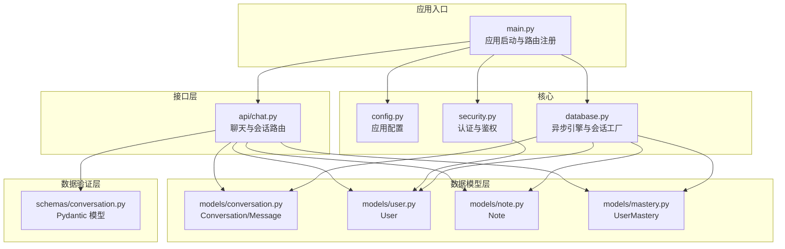
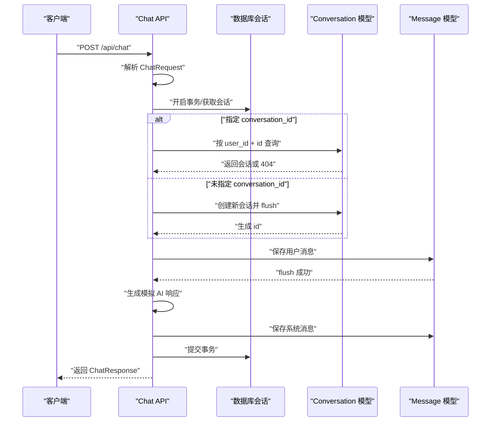
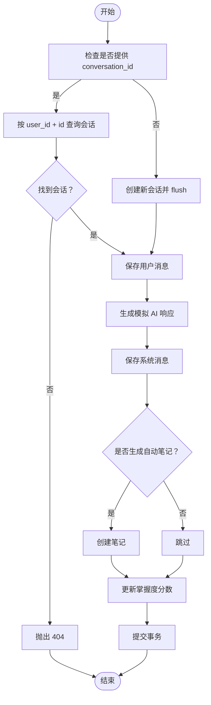
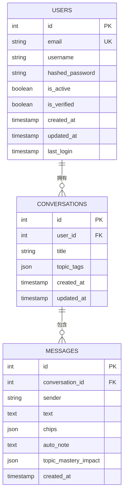
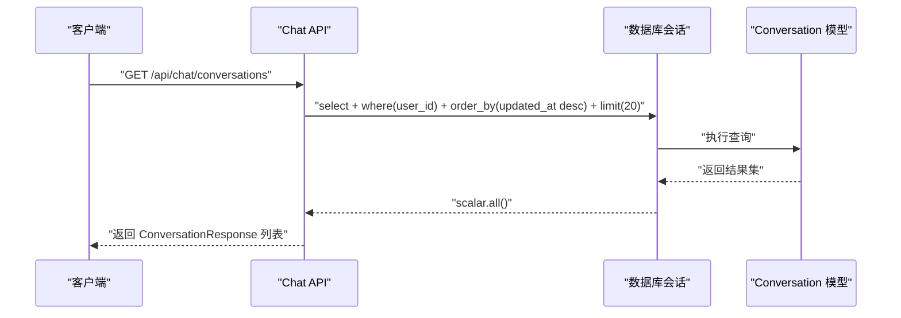
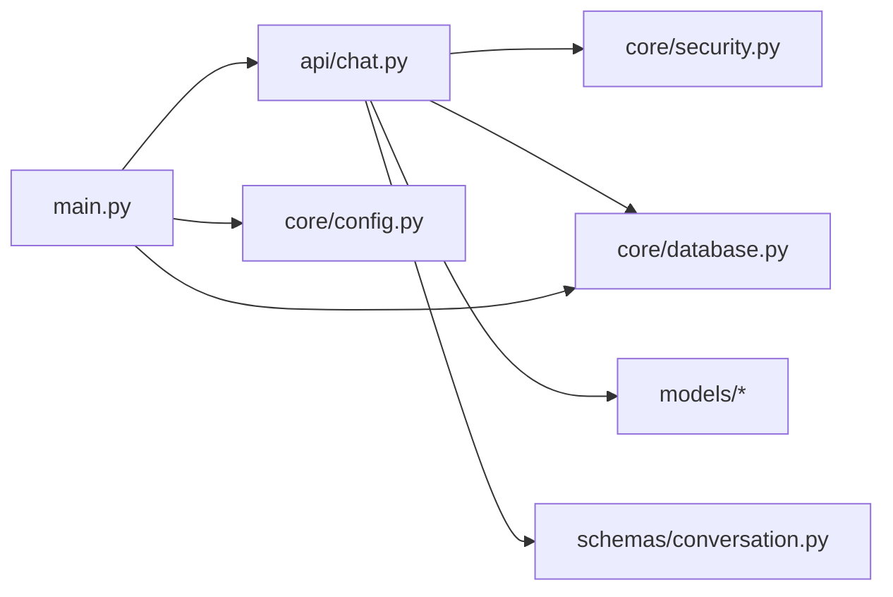

# 会话管理

<cite>
**本文引用的文件**
- [backend/app/models/conversation.py](file://backend/app/models/conversation.py)
- [backend/app/schemas/conversation.py](file://backend/app/schemas/conversation.py)
- [backend/app/api/chat.py](file://backend/app/api/chat.py)
- [backend/app/core/database.py](file://backend/app/core/database.py)
- [backend/app/main.py](file://backend/app/main.py)
- [backend/app/models/user.py](file://backend/app/models/user.py)
- [backend/app/models/note.py](file://backend/app/models/note.py)
- [backend/app/models/mastery.py](file://backend/app/models/mastery.py)
- [backend/app/core/security.py](file://backend/app/core/security.py)
- [backend/app/core/config.py](file://backend/app/core/config.py)
</cite>

## 目录
1. [引言](#引言)
2. [项目结构](#项目结构)
3. [核心组件](#核心组件)
4. [架构总览](#架构总览)
5. [详细组件分析](#详细组件分析)
6. [依赖分析](#依赖分析)
7. [性能考虑](#性能考虑)
8. [故障排查指南](#故障排查指南)
9. [结论](#结论)
10. [附录](#附录)

## 引言
本文件面向“会话管理系统”的技术文档，聚焦以下目标：
- 会话创建流程：从用户消息接收后会话初始化、会话ID生成与持久化机制
- 会话状态管理：会话激活、休眠与销毁策略
- 会话数据结构设计：Conversation模型字段、关系映射与生命周期管理
- 会话查询与检索：按用户过滤、时间排序与分页查询
- 会话清理与垃圾回收策略

本系统基于 FastAPI + SQLAlchemy Async 异步数据库访问，采用 Pydantic 数据校验与序列化，结合 JWT 认证中间件保障安全。

## 项目结构
后端采用分层组织方式：
- models 层：定义数据库实体与关系
- schemas 层：定义请求/响应数据结构
- api 层：定义路由与业务流程
- core 层：配置、数据库连接与安全工具
- main.py：应用入口与路由注册

图表来源
- [backend/app/main.py:15-66](file://backend/app/main.py#L15-L66)
- [backend/app/core/config.py:10-45](file://backend/app/core/config.py#L10-L45)
- [backend/app/core/security.py:54-80](file://backend/app/core/security.py#L54-L80)
- [backend/app/core/database.py:32-46](file://backend/app/core/database.py#L32-L46)
- [backend/app/api/chat.py:78-252](file://backend/app/api/chat.py#L78-L252)
- [backend/app/models/conversation.py:11-54](file://backend/app/models/conversation.py#L11-L54)
- [backend/app/models/user.py:11-39](file://backend/app/models/user.py#L11-L39)
- [backend/app/models/note.py:11-35](file://backend/app/models/note.py#L11-L35)
- [backend/app/models/mastery.py:11-44](file://backend/app/models/mastery.py#L11-L44)
- [backend/app/schemas/conversation.py:11-73](file://backend/app/schemas/conversation.py#L11-L73)

章节来源
- [backend/app/main.py:15-66](file://backend/app/main.py#L15-L66)
- [backend/app/core/config.py:10-45](file://backend/app/core/config.py#L10-L45)
- [backend/app/core/database.py:15-46](file://backend/app/core/database.py#L15-L46)

## 核心组件
- Conversation/Message 模型：承载会话与消息的数据结构，含外键关系、JSON 扩展字段与时间戳
- Chat API：负责会话创建、消息保存、AI 响应模拟、自动笔记与掌握度更新
- 数据库会话管理：异步 Session 工厂与连接池配置
- 认证中间件：JWT 解析与当前用户注入
- Pydantic Schema：输入校验与输出序列化

章节来源
- [backend/app/models/conversation.py:11-54](file://backend/app/models/conversation.py#L11-L54)
- [backend/app/schemas/conversation.py:11-73](file://backend/app/schemas/conversation.py#L11-L73)
- [backend/app/api/chat.py:78-252](file://backend/app/api/chat.py#L78-L252)
- [backend/app/core/database.py:32-46](file://backend/app/core/database.py#L32-L46)
- [backend/app/core/security.py:54-80](file://backend/app/core/security.py#L54-L80)

## 架构总览
下图展示会话创建与查询的关键交互路径，包括用户认证、会话初始化、消息持久化与返回响应。

图表来源
- [backend/app/api/chat.py:78-151](file://backend/app/api/chat.py#L78-L151)
- [backend/app/models/conversation.py:11-31](file://backend/app/models/conversation.py#L11-L31)
- [backend/app/models/conversation.py:33-54](file://backend/app/models/conversation.py#L33-L54)

## 详细组件分析

### 会话创建流程
- 用户消息接收后，若请求携带 conversation_id，则先校验该会话是否属于当前用户；否则创建新的会话记录并立即 flush 获取自增 id
- 保存用户消息与系统消息（AI 响应），随后根据需要自动创建笔记并更新掌握度分数
- 提交事务后返回 ChatResponse，其中包含会话与消息 ID

图表来源
- [backend/app/api/chat.py:78-151](file://backend/app/api/chat.py#L78-L151)
- [backend/app/models/conversation.py:11-31](file://backend/app/models/conversation.py#L11-L31)
- [backend/app/models/conversation.py:33-54](file://backend/app/models/conversation.py#L33-L54)

章节来源
- [backend/app/api/chat.py:78-151](file://backend/app/api/chat.py#L78-L151)

### 会话状态管理
- 激活：每次发送消息即激活会话，更新 updated_at 时间戳
- 休眠：系统未显式实现会话休眠策略；可扩展为基于 idle 超时的后台任务
- 销毁：删除会话会级联删除其消息；可通过软删除或审计日志实现更严格的销毁策略

章节来源
- [backend/app/models/conversation.py:24-26](file://backend/app/models/conversation.py#L24-L26)
- [backend/app/models/conversation.py:30](file://backend/app/models/conversation.py#L30)

### 会话数据结构设计
- Conversation 字段
  - 主键与外键：id、user_id
  - 内容：title（可空）
  - 元数据：topic_tags（JSON，默认列表）
  - 时间戳：created_at、updated_at
  - 关系：与 User 的一对多、与 Message 的一对多（级联删除）
- Message 字段
  - 主键与外键：id、conversation_id
  - 内容：sender（"user"/"system"）、text
  - AI 响应元信息：chips（JSON）、auto_note（可空）、topic_mastery_impact（可空）
  - 时间戳：created_at
  - 关系：与 Conversation 的多对一

图表来源
- [backend/app/models/user.py:11-39](file://backend/app/models/user.py#L11-L39)
- [backend/app/models/conversation.py:11-31](file://backend/app/models/conversation.py#L11-L31)
- [backend/app/models/conversation.py:33-54](file://backend/app/models/conversation.py#L33-L54)

章节来源
- [backend/app/models/conversation.py:11-54](file://backend/app/models/conversation.py#L11-L54)

### 会话查询与检索
- 按用户过滤：通过当前用户 id 过滤会话
- 时间排序：按 updated_at 降序排列
- 分页查询：限制返回条数（示例为 20 条）

图表来源
- [backend/app/api/chat.py:220-233](file://backend/app/api/chat.py#L220-L233)

章节来源
- [backend/app/api/chat.py:220-233](file://backend/app/api/chat.py#L220-L233)

### 会话清理与垃圾回收
- 数据库层面：删除会话将级联删除其消息；如需保留审计信息，可引入软删除字段与定期归档任务
- 应用层面：当前未实现会话休眠/清理策略；建议通过定时任务扫描长时间未更新的会话并标记/清理
- 连接与会话：使用异步 Session 工厂，expire_on_commit=False，确保事务结束后连接可复用；生产环境建议启用连接池预检与超时设置

章节来源
- [backend/app/core/database.py:32-46](file://backend/app/core/database.py#L32-L46)
- [backend/app/models/conversation.py:30](file://backend/app/models/conversation.py#L30)

## 依赖分析
- Chat API 依赖
  - 认证：get_current_user 注入当前用户
  - 数据库：get_db 提供 AsyncSession
  - 模型：Conversation、Message、User、Note、UserMastery、KnowledgePoint
  - Schema：ChatRequest、ChatResponse、ConversationResponse、MessageResponse
- 安全与配置
  - JWT 解码与令牌校验
  - 数据库连接池与方言适配
  - CORS 中间件与 API 前缀

图表来源
- [backend/app/api/chat.py:10-20](file://backend/app/api/chat.py#L10-L20)
- [backend/app/core/security.py:54-80](file://backend/app/core/security.py#L54-L80)
- [backend/app/core/database.py:32-46](file://backend/app/core/database.py#L32-L46)
- [backend/app/main.py:42-50](file://backend/app/main.py#L42-L50)

章节来源
- [backend/app/api/chat.py:10-20](file://backend/app/api/chat.py#L10-L20)
- [backend/app/core/security.py:54-80](file://backend/app/core/security.py#L54-L80)
- [backend/app/core/database.py:15-46](file://backend/app/core/database.py#L15-L46)
- [backend/app/main.py:42-50](file://backend/app/main.py#L42-L50)

## 性能考虑
- 异步 I/O：使用 SQLAlchemy Async 与异步 Session，降低阻塞
- 连接池：非 SQLite 场景启用 pool_pre_ping、pool_size 与 max_overflow，提升并发稳定性
- 查询优化：按用户过滤 + 时间排序 + 限制数量，避免全表扫描
- 序列化：Pydantic from_attributes 与响应模型减少重复转换开销
- 建议：对高频查询建立索引（如 conversations.user_id、messages.conversation_id、messages.created_at）

## 故障排查指南
- 404 会话不存在：当提供 conversation_id 但不属于当前用户或不存在时触发
- 认证失败：JWT 解码失败或用户不存在将抛出 401
- 数据一致性：flush 与 commit 的使用确保消息与会话写入顺序正确
- 数据库连接：确认 DATABASE_URL 配置与连接池参数匹配运行环境

章节来源
- [backend/app/api/chat.py:94-96](file://backend/app/api/chat.py#L94-L96)
- [backend/app/core/security.py:59-79](file://backend/app/core/security.py#L59-L79)
- [backend/app/core/database.py:32-46](file://backend/app/core/database.py#L32-L46)

## 结论
本会话管理模块以简洁清晰的模型与路由实现了完整的对话生命周期管理：从会话创建、消息持久化到查询与响应返回。通过异步数据库与 Pydantic 校验，系统具备良好的扩展性与可维护性。后续可在会话休眠/清理、软删除与审计、以及连接池与查询优化方面进一步增强。

## 附录
- 关键实现位置参考
  - 会话创建与消息保存：[backend/app/api/chat.py:78-151](file://backend/app/api/chat.py#L78-L151)
  - 会话查询与分页：[backend/app/api/chat.py:220-233](file://backend/app/api/chat.py#L220-L233)
  - 会话消息查询：[backend/app/api/chat.py:235-252](file://backend/app/api/chat.py#L235-L252)
  - 模型定义：[backend/app/models/conversation.py:11-54](file://backend/app/models/conversation.py#L11-L54)
  - Schema 定义：[backend/app/schemas/conversation.py:11-73](file://backend/app/schemas/conversation.py#L11-L73)
  - 数据库会话工厂：[backend/app/core/database.py:32-46](file://backend/app/core/database.py#L32-L46)
  - 应用入口与路由注册：[backend/app/main.py:42-50](file://backend/app/main.py#L42-L50)