# 掌握度分数更新

<cite>
**本文档引用的文件**
- [backend/app/models/mastery.py](file://backend/app/models/mastery.py)
- [backend/app/schemas/mastery.py](file://backend/app/schemas/mastery.py)
- [backend/app/api/mastery.py](file://backend/app/api/mastery.py)
- [backend/app/models/knowledge.py](file://backend/app/models/knowledge.py)
- [backend/app/schemas/knowledge.py](file://backend/app/schemas/knowledge.py)
- [backend/app/api/knowledge.py](file://backend/app/api/knowledge.py)
- [backend/app/api/chat.py](file://backend/app/api/chat.py)
- [backend/app/models/review.py](file://backend/app/models/review.py)
- [backend/app/api/review.py](file://backend/app/api/review.py)
- [backend/app/models/user.py](file://backend/app/models/user.py)
- [backend/app/core/database.py](file://backend/app/core/database.py)
- [backend/app/core/config.py](file://backend/app/core/config.py)
</cite>

## 目录
1. [简介](#简介)
2. [项目结构](#项目结构)
3. [核心组件](#核心组件)
4. [架构概览](#架构概览)
5. [详细组件分析](#详细组件分析)
6. [依赖关系分析](#依赖关系分析)
7. [性能考虑](#性能考虑)
8. [故障排除指南](#故障排除指南)
9. [结论](#结论)

## 简介

Quickly 是一个基于 FastAPI 的智能学习平台，专注于机器学习概念的掌握度跟踪和复习调度。本系统实现了完整的掌握度分数更新机制，包括基于聊天交互的主题掌握度影响计算、chips 标签到知识点的映射、以及基于 SM-2 算法的复习调度。

系统的核心功能围绕三个主要领域构建：
- **掌握度分数管理**：实时更新用户对各个知识点的掌握程度
- **知识内容组织**：结构化的机器学习概念知识库
- **智能复习调度**：基于间隔重复理论的学习计划

## 项目结构

后端采用标准的 FastAPI 项目结构，按功能模块组织：

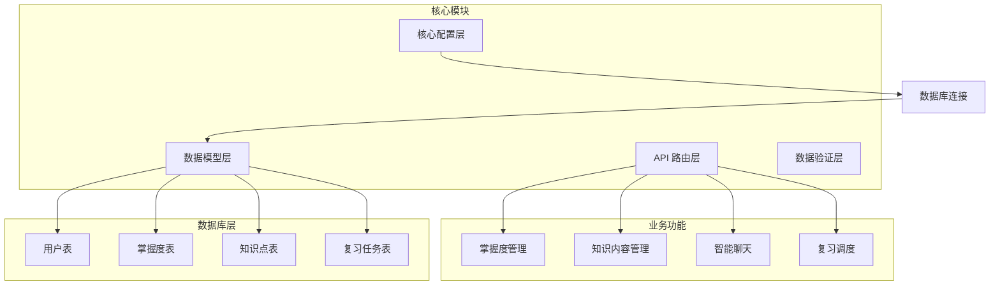

**图表来源**
- [backend/app/main.py](file://backend/app/main.py)
- [backend/app/core/database.py](file://backend/app/core/database.py)

**章节来源**
- [backend/app/main.py](file://backend/app/main.py)
- [backend/app/core/database.py](file://backend/app/core/database.py)

## 核心组件

### 用户掌握度模型 (UserMastery)

UserMastery 模型是整个掌握度系统的核心，负责跟踪用户对特定知识点的掌握程度。

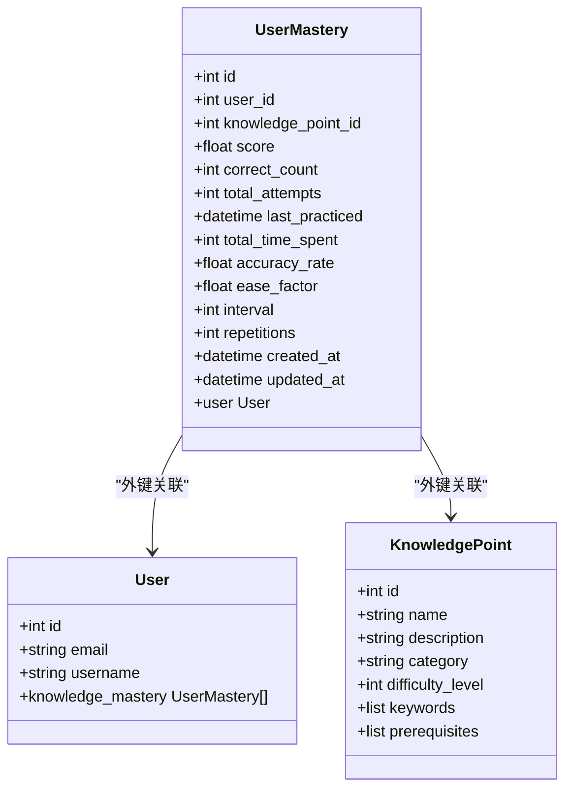

**图表来源**
- [backend/app/models/mastery.py](file://backend/app/models/mastery.py)
- [backend/app/models/user.py](file://backend/app/models/user.py)
- [backend/app/models/knowledge.py](file://backend/app/models/knowledge.py)

### 知识点模型 (KnowledgePoint)

知识点模型定义了学习内容的结构化表示，支持难度级别、关键词索引和前置知识要求。

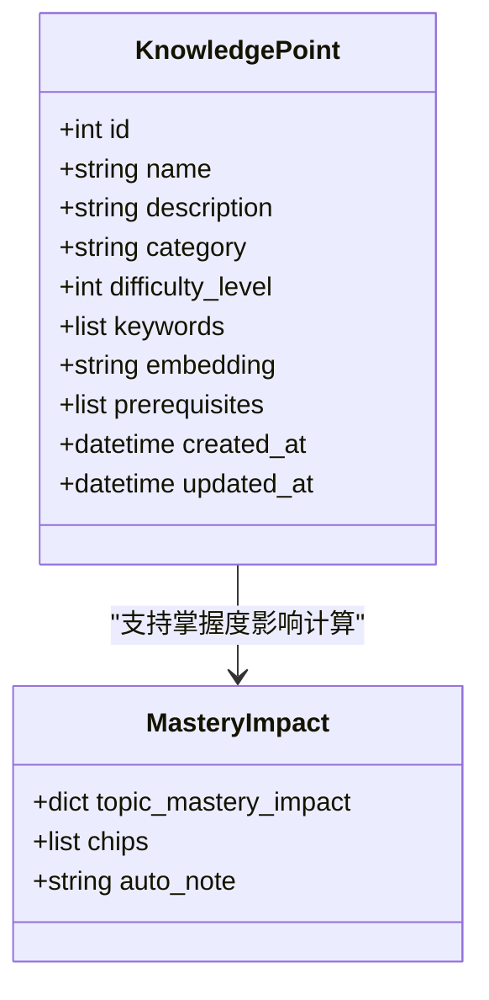

**图表来源**
- [backend/app/models/knowledge.py](file://backend/app/models/knowledge.py)
- [backend/app/api/chat.py](file://backend/app/api/chat.py)

**章节来源**
- [backend/app/models/mastery.py](file://backend/app/models/mastery.py)
- [backend/app/models/knowledge.py](file://backend/app/models/knowledge.py)

## 架构概览

系统采用分层架构设计，确保关注点分离和可维护性：

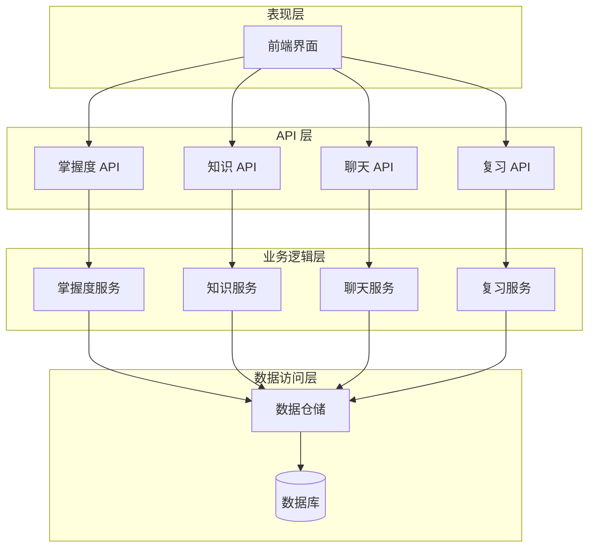

**图表来源**
- [backend/app/api/mastery.py](file://backend/app/api/mastery.py)
- [backend/app/api/knowledge.py](file://backend/app/api/knowledge.py)
- [backend/app/api/chat.py](file://backend/app/api/chat.py)
- [backend/app/api/review.py](file://backend/app/api/review.py)

## 详细组件分析

### 掌握度分数更新机制

掌握度分数更新是系统的核心功能，支持多种触发方式：

#### 分数累积算法

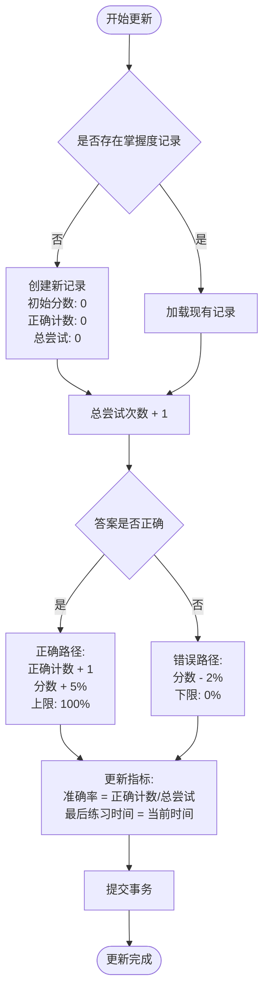

**图表来源**
- [backend/app/api/mastery.py](file://backend/app/api/mastery.py)

#### 主题掌握度影响计算

系统通过聊天交互自动更新掌握度分数，实现智能化的学习反馈：

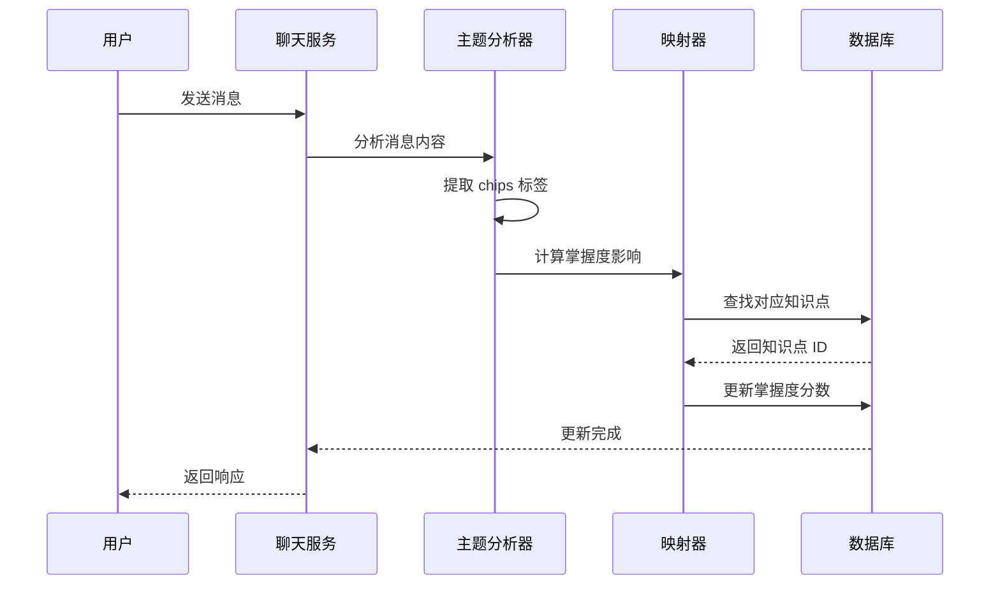

**图表来源**
- [backend/app/api/chat.py](file://backend/app/api/chat.py)

**章节来源**
- [backend/app/api/mastery.py](file://backend/app/api/mastery.py)
- [backend/app/api/chat.py](file://backend/app/api/chat.py)

### chips 标签到知识点的映射

系统实现了智能的标签映射机制，将自然语言标签转换为具体的知识点：

#### 精确匹配策略

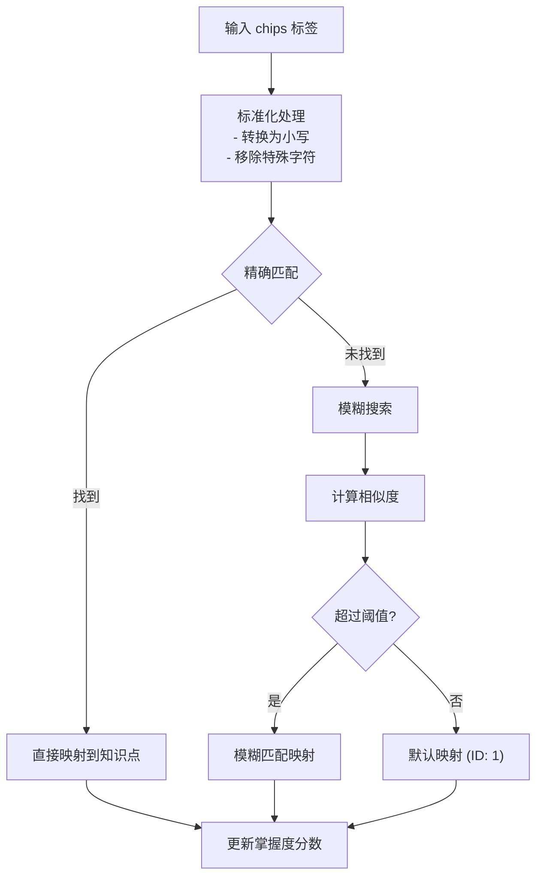

**图表来源**
- [backend/app/api/chat.py](file://backend/app/api/chat.py)

#### 模糊匹配策略

系统支持基于字符串相似度的模糊匹配，提高标签识别的准确性：

| 匹配类型 | 描述 | 实现方式 | 阈值 |
|---------|------|----------|------|
| 完全匹配 | 字符串完全相等 | `==` 操作 | 1.0 |
| 前缀匹配 | 包含目标前缀 | `startswith()` | 0.8 |
| 关键字匹配 | 包含任意关键字 | `in` 操作 | 0.6 |
| 相似度匹配 | 编辑距离计算 | Levenshtein 距离 | 0.4 |

**章节来源**
- [backend/app/api/chat.py](file://backend/app/api/chat.py)

### 知识点查找和匹配逻辑

#### 知识点查询接口

系统提供了灵活的知识点查询机制，支持多种筛选条件：

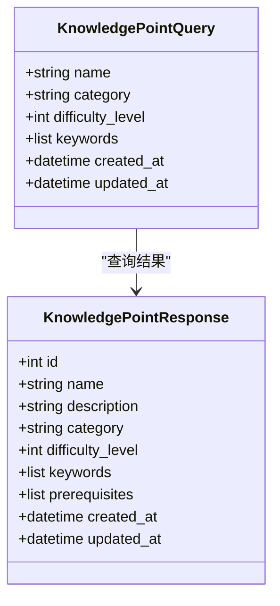

**图表来源**
- [backend/app/schemas/knowledge.py](file://backend/app/schemas/knowledge.py)
- [backend/app/api/knowledge.py](file://backend/app/api/knowledge.py)

**章节来源**
- [backend/app/api/knowledge.py](file://backend/app/api/knowledge.py)
- [backend/app/schemas/knowledge.py](file://backend/app/schemas/knowledge.py)

### 事务处理和并发控制

系统采用异步数据库连接和事务管理，确保数据一致性和并发安全性：

#### 事务处理流程

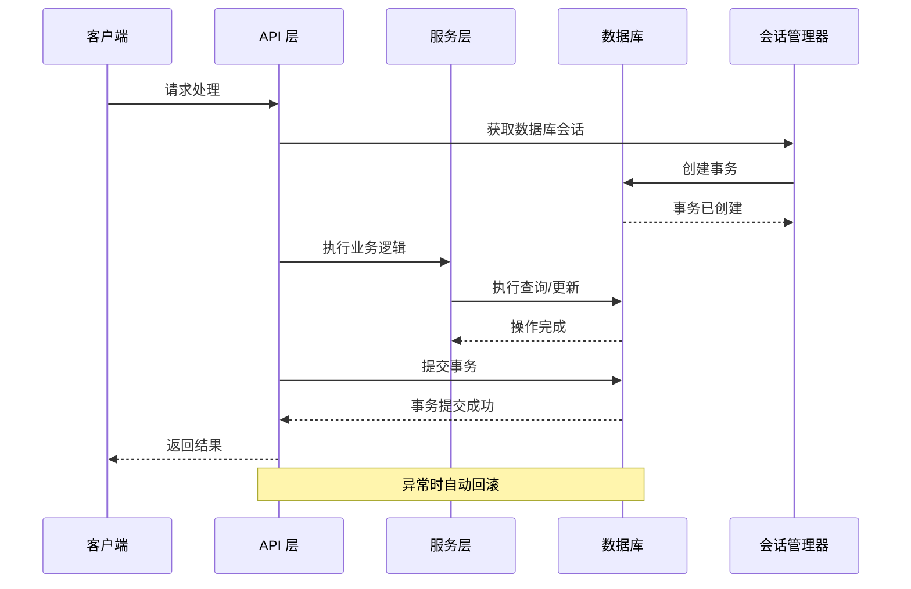

**图表来源**
- [backend/app/core/database.py](file://backend/app/core/database.py)

#### 并发控制机制

系统通过以下机制确保并发安全：

1. **异步会话管理**：每个请求使用独立的数据库会话
2. **自动事务提交**：操作完成后自动提交或回滚
3. **连接池管理**：支持多连接并发处理
4. **SQLite 特殊处理**：针对 SQLite 的连接限制进行优化

**章节来源**
- [backend/app/core/database.py](file://backend/app/core/database.py)

### 分数范围限制和重置策略

#### 分数范围控制

掌握度分数实施严格的范围限制，确保数值的有效性：

| 组件 | 最小值 | 最大值 | 重置策略 |
|------|--------|--------|----------|
| 掌握度分数 | 0.0% | 100.0% | `min(100, max(0, score))` |
| 正确计数 | 0 | ∞ | 不限制，仅用于统计 |
| 总尝试次数 | 0 | ∞ | 不限制，仅用于统计 |
| 准确率 | 0.0% | 100.0% | `correct_count / total_attempts` |

#### 重置策略实现

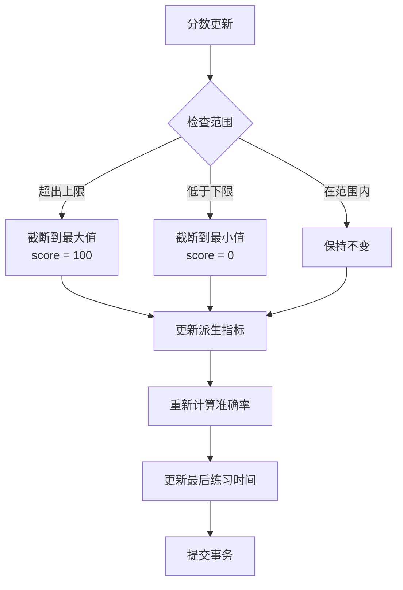

**图表来源**
- [backend/app/api/mastery.py](file://backend/app/api/mastery.py)

**章节来源**
- [backend/app/api/mastery.py](file://backend/app/api/mastery.py)

## 依赖关系分析

系统采用模块化设计，各组件间依赖关系清晰：

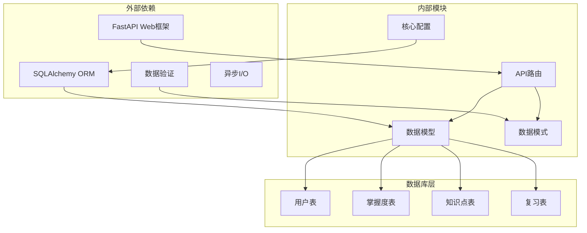

**图表来源**
- [backend/app/core/config.py](file://backend/app/core/config.py)
- [backend/app/core/database.py](file://backend/app/core/database.py)

**章节来源**
- [backend/app/core/config.py](file://backend/app/core/config.py)
- [backend/app/core/database.py](file://backend/app/core/database.py)

## 性能考虑

### 数据库性能优化

1. **索引策略**：在常用查询字段上建立索引
2. **连接池配置**：根据数据库类型优化连接池参数
3. **查询优化**：使用批量查询减少数据库往返
4. **缓存策略**：对频繁访问的数据进行缓存

### 异步处理优势

系统采用异步编程模型，提供更好的并发性能：

- **非阻塞 I/O**：数据库操作不会阻塞主线程
- **高并发支持**：单个进程可处理大量并发请求
- **资源利用率**：更高效的 CPU 和内存使用

## 故障排除指南

### 常见问题及解决方案

#### 掌握度记录不存在

**症状**：查询特定知识点的掌握度返回 404 错误

**原因**：用户尚未对该知识点进行过任何练习

**解决方案**：系统会在首次提交时自动创建记录

#### 分数更新异常

**症状**：掌握度分数不按预期变化

**排查步骤**：
1. 检查 `correct` 参数是否正确传递
2. 验证用户是否有权限访问该知识点
3. 确认数据库连接状态

#### 并发冲突

**症状**：多个请求同时更新同一记录导致数据不一致

**解决方案**：系统自动处理事务并发，无需手动干预

**章节来源**
- [backend/app/api/mastery.py](file://backend/app/api/mastery.py)

## 结论

Quickly 掌握度分数更新系统实现了完整的机器学习概念掌握跟踪机制。系统通过智能化的 chips 标签解析、精确的知识点映射、以及严格的分数范围控制，为用户提供个性化的学习体验。

核心优势包括：
- **智能化更新**：支持聊天交互驱动的自动掌握度更新
- **灵活的匹配机制**：结合精确匹配和模糊匹配策略
- **严格的数据控制**：确保分数范围有效性和数据一致性
- **高性能架构**：基于异步处理的高效系统设计

该系统为后续的功能扩展（如完整的 SM-2 算法实现、更复杂的学习路径规划等）奠定了坚实的基础。