# 消息处理机制

<cite>
**本文档引用的文件**
- [backend/app/main.py](file://backend/app/main.py)
- [backend/app/api/chat.py](file://backend/app/api/chat.py)
- [backend/app/models/conversation.py](file://backend/app/models/conversation.py)
- [backend/app/schemas/conversation.py](file://backend/app/schemas/conversation.py)
- [backend/app/core/database.py](file://backend/app/core/database.py)
- [backend/app/models/user.py](file://backend/app/models/user.py)
- [backend/app/models/note.py](file://backend/app/models/note.py)
- [backend/app/models/mastery.py](file://backend/app/models/mastery.py)
- [backend/app/core/config.py](file://backend/app/core/config.py)
- [backend/app/api/auth.py](file://backend/app/api/auth.py)
- [backend/app/core/security.py](file://backend/app/core/security.py)
</cite>

## 目录
1. [简介](#简介)
2. [项目结构](#项目结构)
3. [核心组件](#核心组件)
4. [架构概览](#架构概览)
5. [详细组件分析](#详细组件分析)
6. [依赖关系分析](#依赖关系分析)
7. [性能考虑](#性能考虑)
8. [故障排除指南](#故障排除指南)
9. [结论](#结论)

## 简介

Quickly AI 学习平台的消息处理机制是一个基于 FastAPI 的异步消息系统，专门设计用于处理用户与 AI 之间的对话交互。该系统实现了完整的消息生命周期管理，包括用户消息接收、AI 响应生成、消息存储和检索流程。

系统采用会话状态管理模式，每个用户可以拥有多个对话会话，每个会话包含多条消息记录。消息不仅承载文本内容，还支持知识要点标签（chips）、自动笔记生成功能以及学习进度跟踪。

## 项目结构

后端采用标准的分层架构设计：

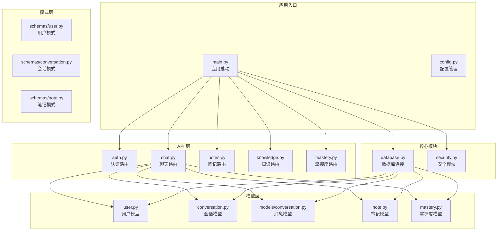

**图表来源**
- [backend/app/main.py:1-66](file://backend/app/main.py#L1-L66)
- [backend/app/api/chat.py:1-252](file://backend/app/api/chat.py#L1-L252)
- [backend/app/core/database.py:1-46](file://backend/app/core/database.py#L1-L46)

**章节来源**
- [backend/app/main.py:1-66](file://backend/app/main.py#L1-L66)
- [backend/app/core/config.py:1-45](file://backend/app/core/config.py#L1-L45)

## 核心组件

### 数据模型架构

系统采用 SQLAlchemy ORM 设计，实现了清晰的数据模型层次结构：

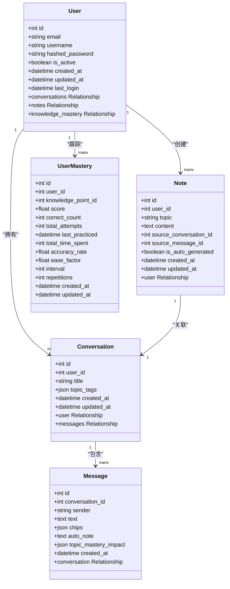

**图表来源**
- [backend/app/models/user.py:11-39](file://backend/app/models/user.py#L11-L39)
- [backend/app/models/conversation.py:11-54](file://backend/app/models/conversation.py#L11-L54)
- [backend/app/models/note.py:11-35](file://backend/app/models/note.py#L11-L35)
- [backend/app/models/mastery.py:11-44](file://backend/app/models/mastery.py#L11-L44)

### API 路由架构

系统采用模块化的 API 路由设计，每个功能模块都有独立的路由文件：

```mermaid
graph LR
subgraph "认证路由 (/api/auth)"
AuthLogin[/login<br/>用户登录]
AuthRegister[/register<br/>用户注册]
AuthMe[/me<br/>获取当前用户]
AuthLogout[/logout<br/>用户登出]
end
subgraph "聊天路由 (/api/chat)"
ChatPost[/chat<br/>发送消息]
ConvGet[/conversations<br/>获取会话列表]
MsgGet[/conversations/{id}/messages<br/>获取消息列表]
end
subgraph "笔记路由 (/api/notes)"
NotesGet[/notes<br/>获取笔记列表]
NotesCreate[/notes<br/>创建笔记]
NotesUpdate[/notes/{id}<br/>更新笔记]
NotesDelete[/notes/{id}<br/>删除笔记]
end
subgraph "知识路由 (/api/knowledge)"
KnowledgeGet[/knowledge<br/>获取知识列表]
KnowledgeCreate[/knowledge<br/>创建知识]
end
subgraph "掌握度路由 (/api/mastery)"
MasteryGet[/mastery<br/>获取掌握度]
MasteryUpdate[/mastery/{id}<br/>更新掌握度]
end
subgraph "复习路由 (/api/review)"
ReviewGet[/review<br/>获取复习任务]
end
subgraph "设置路由 (/api/settings)"
SettingsGet[/settings<br/>获取设置]
SettingsUpdate[/settings<br/>更新设置]
end
```

**图表来源**
- [backend/app/api/chat.py:22-252](file://backend/app/api/chat.py#L22-L252)
- [backend/app/api/auth.py:19-99](file://backend/app/api/auth.py#L19-L99)

**章节来源**
- [backend/app/models/conversation.py:1-54](file://backend/app/models/conversation.py#L1-L54)
- [backend/app/schemas/conversation.py:1-73](file://backend/app/schemas/conversation.py#L1-L73)

## 架构概览

### 消息处理流水线

系统的消息处理遵循严格的生命周期管理：

```mermaid
sequenceDiagram
participant Client as 客户端
participant API as Chat API
participant DB as 数据库
participant AI as AI 服务
participant Note as 笔记服务
participant Mastery as 掌握度服务
Client->>API : POST /api/chat (ChatRequest)
API->>DB : 查询或创建会话
DB-->>API : 会话信息
API->>DB : 保存用户消息
DB-->>API : 用户消息ID
API->>AI : 生成AI响应
AI-->>API : 响应数据
API->>DB : 保存AI消息
DB-->>API : AI消息ID
API->>Note : 创建自动笔记 (可选)
Note-->>API : 笔记创建结果
API->>Mastery : 更新掌握度分数
Mastery-->>API : 掌握度更新结果
API->>DB : 提交事务
DB-->>API : 事务完成
API-->>Client : ChatResponse
```

**图表来源**
- [backend/app/api/chat.py:78-151](file://backend/app/api/chat.py#L78-L151)

### 会话状态管理

会话状态管理确保了用户对话的连续性和一致性：

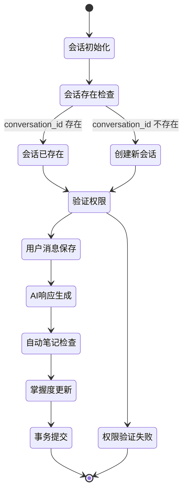

**图表来源**
- [backend/app/api/chat.py:85-99](file://backend/app/api/chat.py#L85-L99)

## 详细组件分析

### 消息模型设计

消息系统的核心数据结构设计体现了高度的灵活性和扩展性：

#### Message 模型字段定义

| 字段名 | 类型 | 描述 | 约束 | 默认值 |
|--------|------|------|------|--------|
| id | Integer | 消息唯一标识符 | 主键, 自增 | null |
| conversation_id | Integer | 所属会话ID | 外键(users.id), 非空 | null |
| sender | String(20) | 发送者类型 | "user" 或 "system", 非空 | null |
| text | Text | 消息文本内容 | 非空 | null |
| chips | JSON | 知识要点标签数组 | JSON格式, 默认[] | [] |
| auto_note | Text | 自动生成的笔记内容 | 可空 | null |
| topic_mastery_impact | JSON | 主题掌握度影响评分 | JSON格式, 可空 | null |
| created_at | DateTime | 创建时间戳 | 默认当前时间 | 当前时间 |

#### Conversation 模型字段定义

| 字段名 | 类型 | 描述 | 约束 | 默认值 |
|--------|------|------|------|--------|
| id | Integer | 会话唯一标识符 | 主键, 自增 | null |
| user_id | Integer | 用户ID | 外键(users.id), 非空 | null |
| title | String(200) | 会话标题 | 可空 | null |
| topic_tags | JSON | 主题标签数组 | JSON格式, 默认[] | [] |
| created_at | DateTime | 创建时间戳 | 默认当前时间 | 当前时间 |
| updated_at | DateTime | 更新时间戳 | 默认当前时间, 自动更新 | 当前时间 |

**章节来源**
- [backend/app/models/conversation.py:33-54](file://backend/app/models/conversation.py#L33-L54)

### 消息序列化规则

系统采用 Pydantic 模式进行数据序列化，确保 API 传输的一致性和安全性：

#### ChatRequest 模式

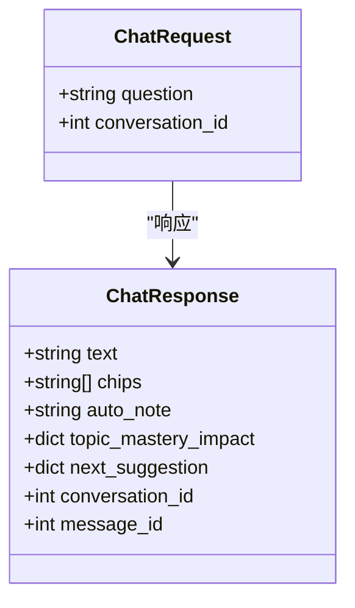

**图表来源**
- [backend/app/schemas/conversation.py:58-73](file://backend/app/schemas/conversation.py#L58-L73)

#### 消息序列化流程

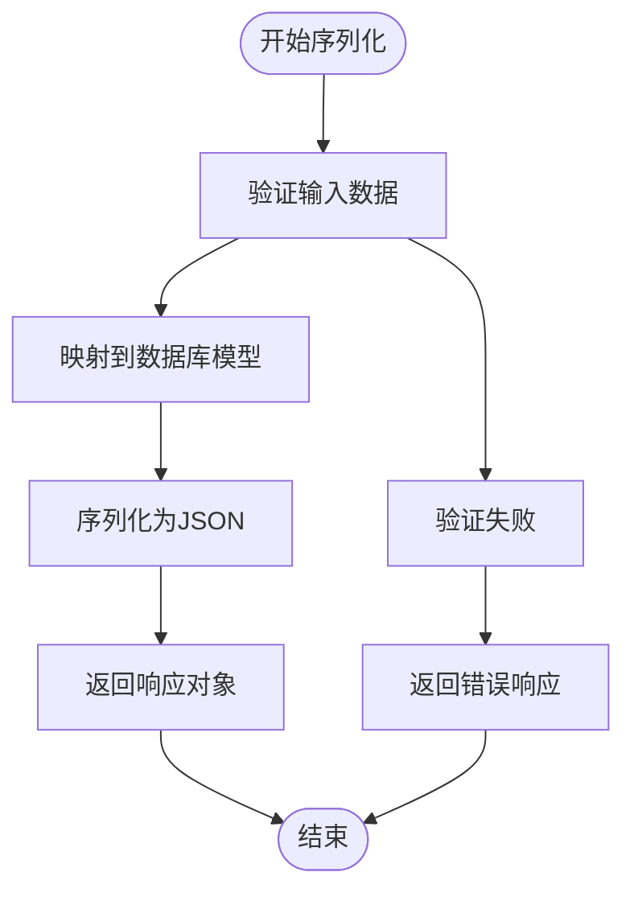

**图表来源**
- [backend/app/schemas/conversation.py:31-73](file://backend/app/schemas/conversation.py#L31-L73)

**章节来源**
- [backend/app/schemas/conversation.py:1-73](file://backend/app/schemas/conversation.py#L1-L73)

### 会话状态管理机制

#### 会话创建流程

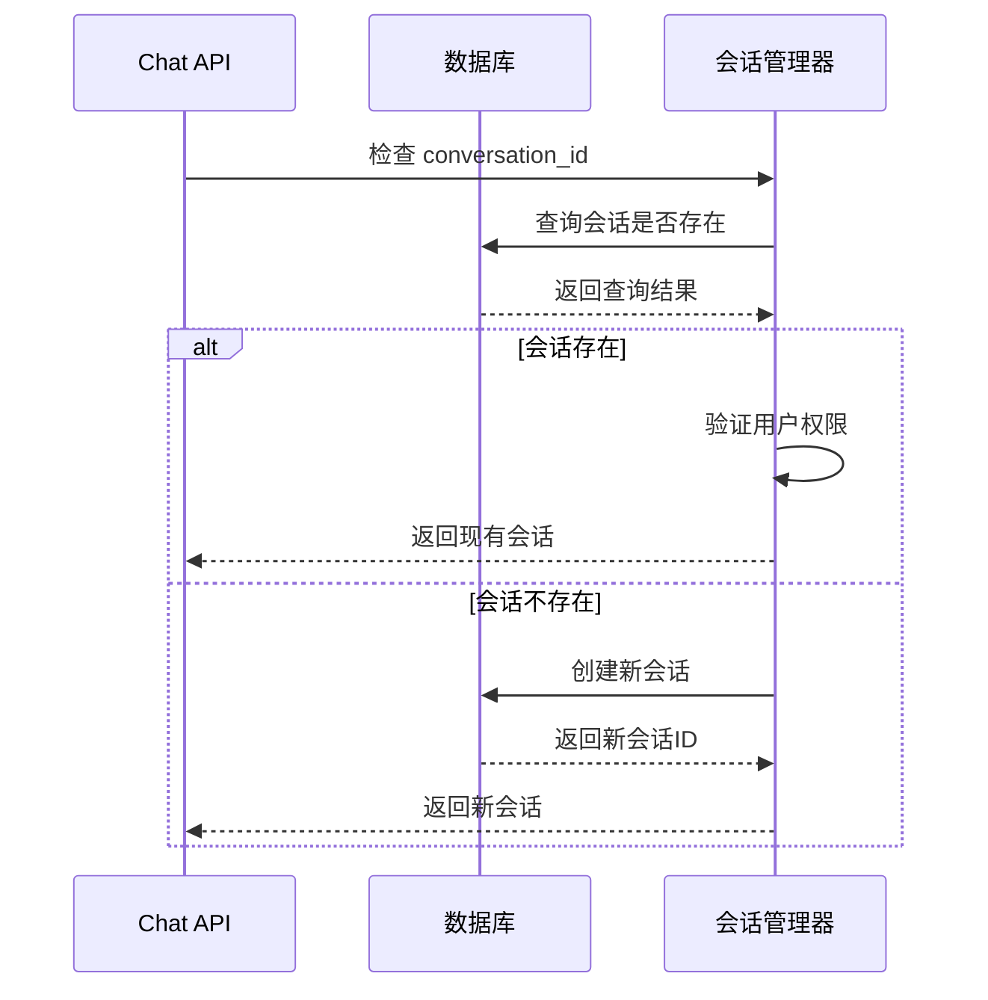

**图表来源**
- [backend/app/api/chat.py:85-99](file://backend/app/api/chat.py#L85-L99)

#### 消息关联和上下文维护

系统通过外键约束确保消息与会话的完整关联：

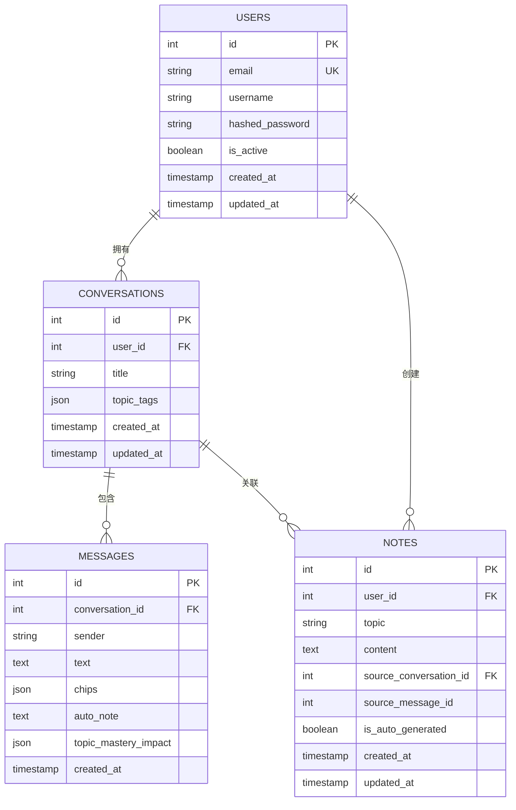

**图表来源**
- [backend/app/models/conversation.py:11-54](file://backend/app/models/conversation.py#L11-L54)
- [backend/app/models/user.py:11-39](file://backend/app/models/user.py#L11-L39)
- [backend/app/models/note.py:11-35](file://backend/app/models/note.py#L11-L35)

**章节来源**
- [backend/app/api/chat.py:220-252](file://backend/app/api/chat.py#L220-L252)

### 错误恢复机制和事务管理

#### 事务管理策略

系统采用异步事务管理确保数据一致性和操作原子性：

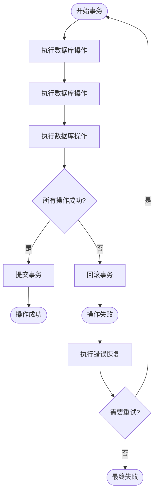

**图表来源**
- [backend/app/api/chat.py:140](file://backend/app/api/chat.py#L140)

#### 错误处理流程

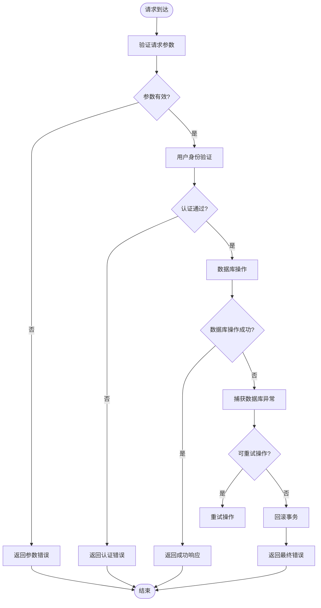

**图表来源**
- [backend/app/api/chat.py:94-95](file://backend/app/api/chat.py#L94-L95)

**章节来源**
- [backend/app/api/chat.py:140-151](file://backend/app/api/chat.py#L140-L151)

### 消息历史查询和分页实现

#### 会话历史查询

系统提供了灵活的会话历史查询接口：

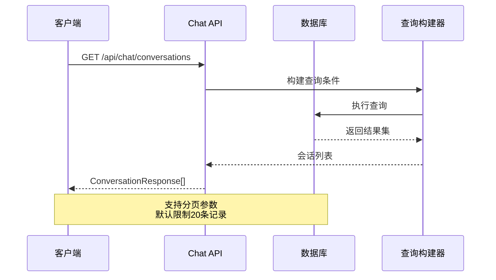

**图表来源**
- [backend/app/api/chat.py:220-233](file://backend/app/api/chat.py#L220-L233)

#### 消息历史查询

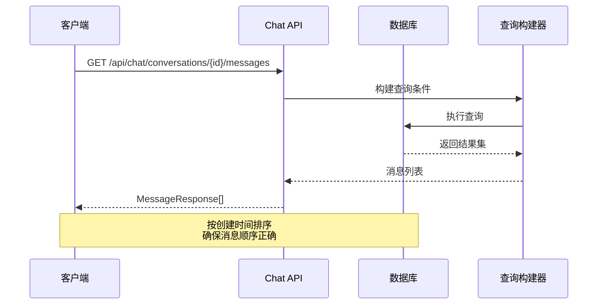

**图表来源**
- [backend/app/api/chat.py:235-252](file://backend/app/api/chat.py#L235-L252)

**章节来源**
- [backend/app/api/chat.py:220-252](file://backend/app/api/chat.py#L220-L252)

## 依赖关系分析

### 数据库连接管理

系统采用异步数据库连接池管理：

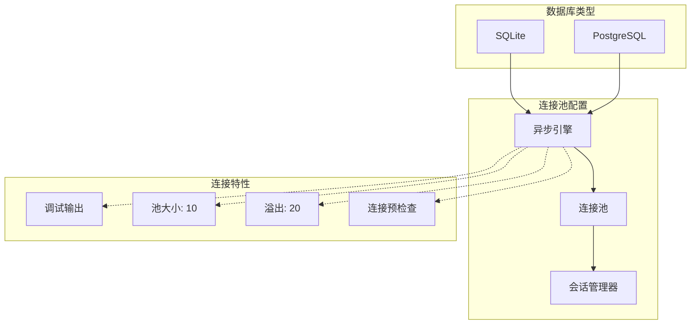

**图表来源**
- [backend/app/core/database.py:15-36](file://backend/app/core/database.py#L15-L36)

### 安全模块集成

系统集成了完整的安全认证机制：

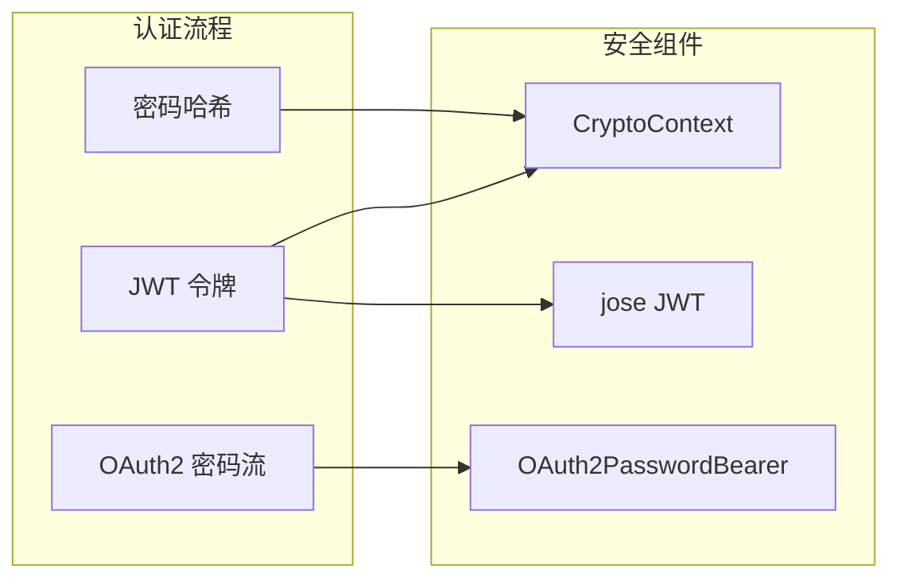

**图表来源**
- [backend/app/core/security.py:19-80](file://backend/app/core/security.py#L19-L80)

**章节来源**
- [backend/app/core/database.py:1-46](file://backend/app/core/database.py#L1-L46)
- [backend/app/core/security.py:1-80](file://backend/app/core/security.py#L1-L80)

## 性能考虑

### 数据库优化策略

系统采用了多种数据库优化技术：

1. **索引优化**: 关键字段如 `user_id`、`conversation_id`、`created_at` 都设置了索引
2. **连接池配置**: SQLite 使用异步连接，其他数据库配置了连接池参数
3. **查询优化**: 使用 `select()` 和 `join()` 进行高效的关联查询
4. **事务批处理**: 将多个数据库操作合并到单个事务中

### 缓存策略

虽然当前版本主要依赖数据库，但系统架构支持缓存集成：

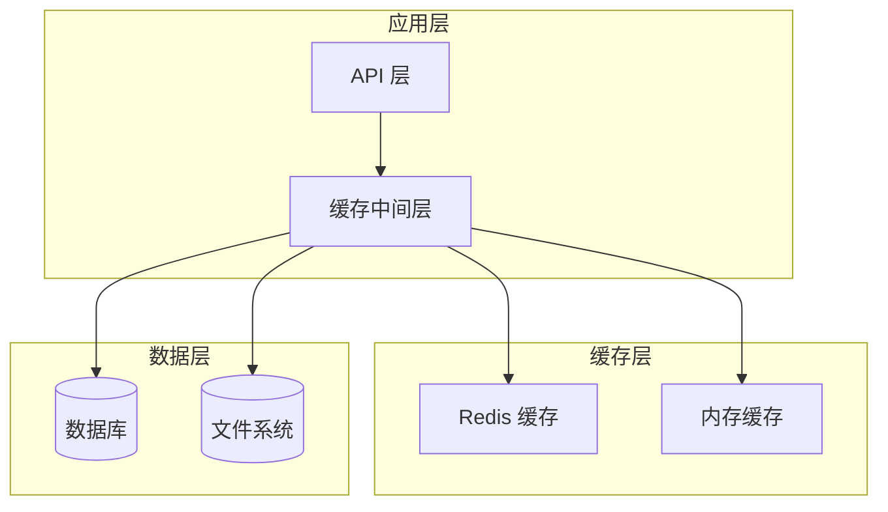

### 异步处理优势

系统采用异步编程模型的优势：

1. **非阻塞 I/O**: 数据库操作不会阻塞主线程
2. **高并发处理**: 能够同时处理多个用户的请求
3. **资源效率**: 更少的内存占用和更好的 CPU 利用率

## 故障排除指南

### 常见错误类型和解决方案

#### 认证相关错误

| 错误类型 | 错误码 | 描述 | 解决方案 |
|----------|--------|------|----------|
| 未授权访问 | 401 | 无法验证凭据 | 检查 JWT 令牌有效性 |
| 用户不存在 | 404 | 用户账户不存在 | 验证用户邮箱或ID |
| 密码错误 | 400 | 密码验证失败 | 检查密码哈希匹配 |

#### 数据库相关错误

| 错误类型 | 错误码 | 描述 | 解决方案 |
|----------|--------|------|----------|
| 连接失败 | 500 | 数据库连接异常 | 检查连接字符串和网络 |
| 事务冲突 | 409 | 并发事务冲突 | 实施重试机制 |
| 约束违反 | 400 | 数据完整性约束 | 验证输入数据格式 |

#### API 调用错误

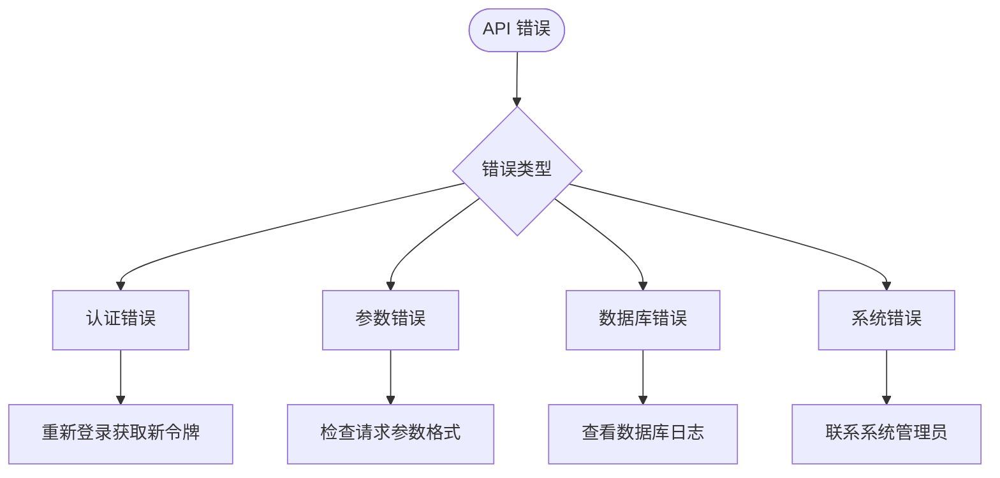

**章节来源**
- [backend/app/api/chat.py:94-95](file://backend/app/api/chat.py#L94-L95)
- [backend/app/api/auth.py:25-31](file://backend/app/api/auth.py#L25-L31)

### 调试工具和技巧

1. **日志记录**: 启用调试模式查看详细的 SQL 查询日志
2. **数据库监控**: 使用数据库自带的性能监控工具
3. **API 测试**: 使用 Postman 或 curl 进行手动测试
4. **错误追踪**: 实现统一的错误处理器和错误报告机制

## 结论

Quickly AI 学习平台的消息处理机制展现了现代 Web 应用的最佳实践。系统通过清晰的架构设计、完善的错误处理机制和高效的性能优化，为用户提供了一个稳定可靠的消息交互平台。

### 主要优势

1. **模块化设计**: 清晰的功能分离使得系统易于维护和扩展
2. **异步处理**: 采用异步编程模型提升了系统的并发处理能力
3. **数据一致性**: 严格的事务管理和外键约束确保了数据完整性
4. **安全性**: 完整的认证授权机制保护了用户数据安全

### 技术亮点

1. **会话状态管理**: 有效的会话生命周期管理确保了对话的连续性
2. **智能响应生成**: 基于关键词匹配的模拟 AI 响应系统
3. **学习进度跟踪**: 集成的知识掌握度跟踪机制
4. **自动笔记生成**: 智能化的学习辅助功能

### 未来改进方向

1. **缓存优化**: 集成 Redis 缓存提升查询性能
2. **AI 集成**: 替换模拟 AI 为真实的大型语言模型
3. **实时通信**: 添加 WebSocket 支持实现实时消息推送
4. **监控告警**: 建立完整的应用性能监控体系

该系统为 AI 辅助学习平台提供了坚实的技术基础，其设计理念和实现方式值得在类似项目中借鉴和参考。