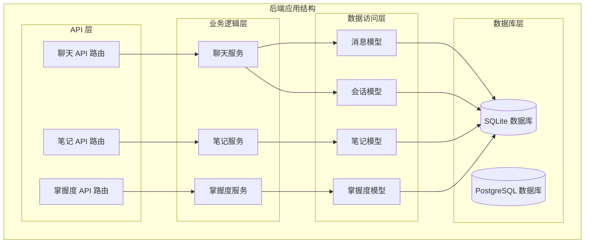
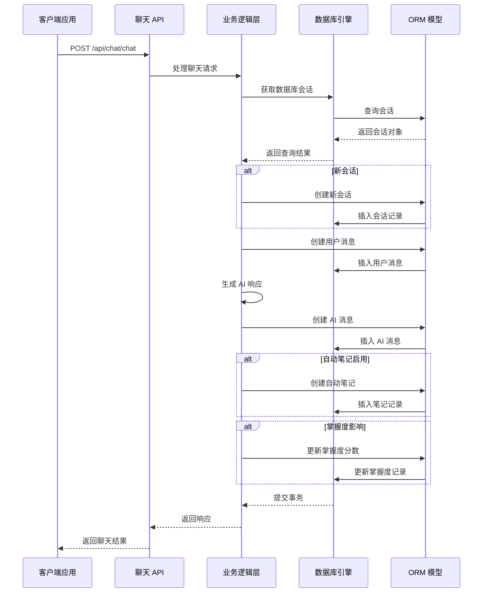
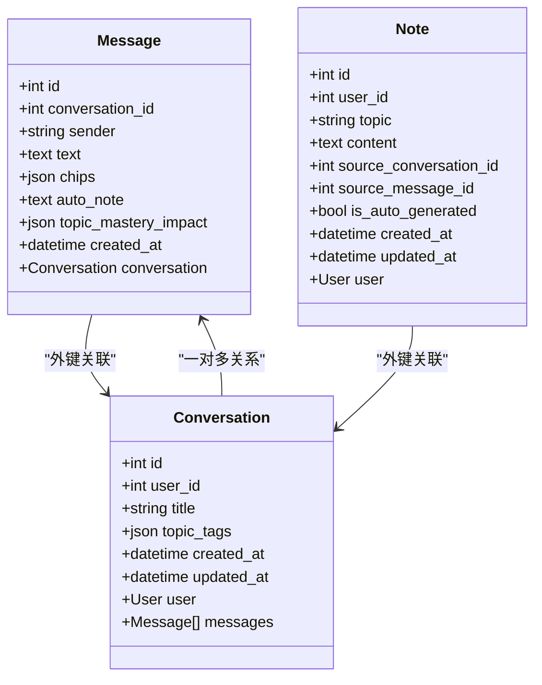
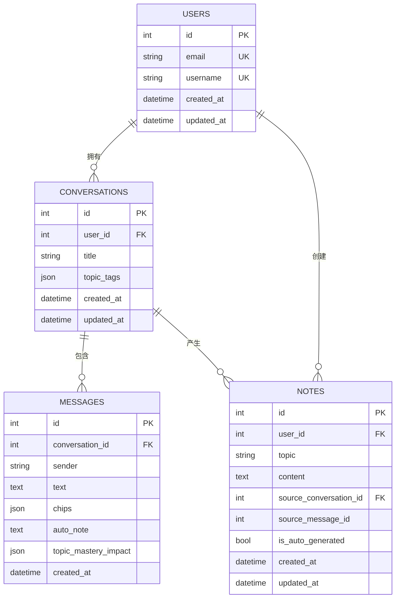
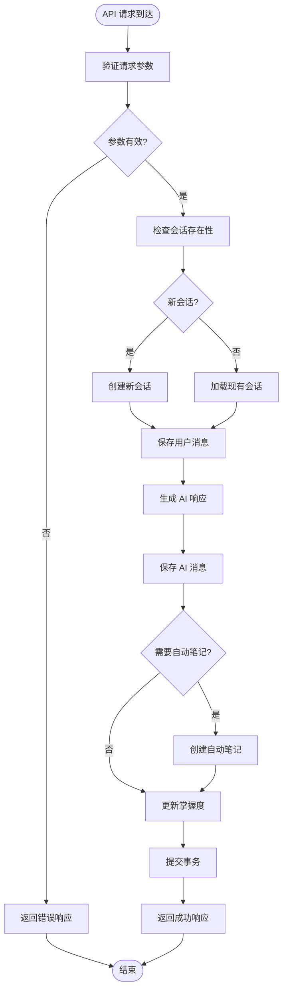
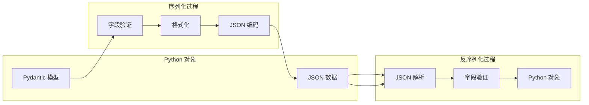
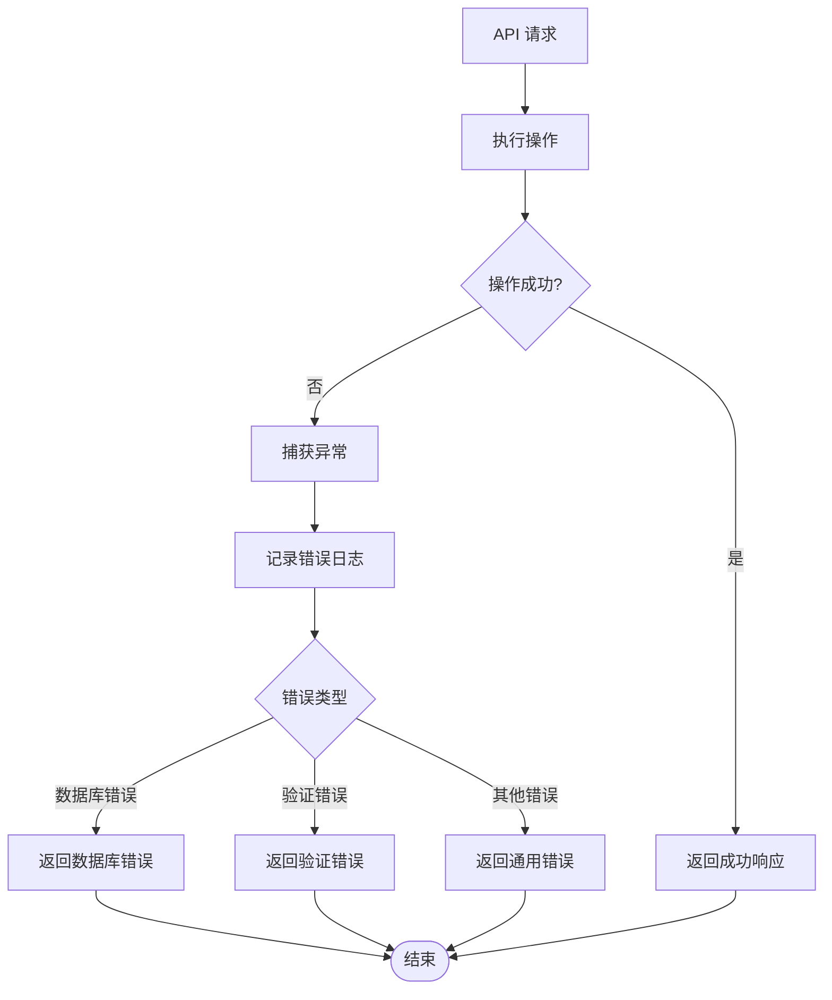

# 消息存储

<cite>
**本文档引用的文件**
- [conversation.py](file://backend/app/models/conversation.py)
- [chat.py](file://backend/app/api/chat.py)
- [database.py](file://backend/app/core/database.py)
- [config.py](file://backend/app/core/config.py)
- [main.py](file://backend/app/main.py)
- [conversation.py](file://backend/app/schemas/conversation.py)
- [note.py](file://backend/app/models/note.py)
- [mastery.py](file://backend/app/models/mastery.py)
- [knowledge.py](file://backend/app/models/knowledge.py)
- [note.py](file://backend/app/schemas/note.py)
- [mastery.py](file://backend/app/schemas/mastery.py)
</cite>

## 目录
1. [简介](#简介)
2. [项目结构](#项目结构)
3. [核心组件](#核心组件)
4. [架构概览](#架构概览)
5. [详细组件分析](#详细组件分析)
6. [消息序列化与反序列化](#消息序列化与反序列化)
7. [性能优化与索引设计](#性能优化与索引设计)
8. [故障排除指南](#故障排除指南)
9. [结论](#结论)

## 简介

Quickly AI 学习平台的消息存储系统是一个基于 SQLAlchemy 和 FastAPI 构建的异步数据库管理系统，专门用于存储和管理用户与 AI 的对话交互。该系统支持用户消息和 AI 响应的持久化存储，提供了完整的消息关系映射、序列化机制以及性能优化策略。

消息存储系统的核心功能包括：
- 异步数据库连接管理
- 消息与会话的关系映射
- 自动笔记生成功能
- 掌握度分数跟踪
- 完整的消息生命周期管理

## 项目结构

消息存储系统位于后端应用的 models 和 schemas 目录中，采用分层架构设计：

**图表来源**
- [main.py:10-50](file://backend/app/main.py#L10-L50)
- [database.py:15-36](file://backend/app/core/database.py#L15-L36)

**章节来源**
- [main.py:10-50](file://backend/app/main.py#L10-L50)
- [database.py:15-36](file://backend/app/core/database.py#L15-L36)

## 核心组件

消息存储系统由以下核心组件构成：

### 消息模型 (Message Model)
消息模型是整个系统的核心数据结构，负责存储单个聊天消息的所有相关信息。

### 会话模型 (Conversation Model)
会话模型管理用户的完整聊天会话历史，包含会话元数据和与消息的关联关系。

### 数据库连接管理
异步数据库引擎配置，支持 SQLite 和 PostgreSQL，提供连接池管理和会话生命周期控制。

### 序列化架构
Pydantic 模型定义，确保 API 请求和响应的数据结构一致性。

**章节来源**
- [conversation.py:33-54](file://backend/app/models/conversation.py#L33-L54)
- [conversation.py:11-31](file://backend/app/models/conversation.py#L11-L31)
- [database.py:15-36](file://backend/app/core/database.py#L15-L36)

## 架构概览

消息存储系统的整体架构采用分层设计，从底层的数据库连接到顶层的 API 接口：

**图表来源**
- [chat.py:78-150](file://backend/app/api/chat.py#L78-L150)
- [database.py:39-45](file://backend/app/core/database.py#L39-L45)

## 详细组件分析

### 消息模型设计

消息模型是消息存储系统的核心数据结构，采用 SQLAlchemy ORM 映射到数据库表：

**图表来源**
- [conversation.py:33-54](file://backend/app/models/conversation.py#L33-L54)
- [conversation.py:11-31](file://backend/app/models/conversation.py#L11-L31)
- [note.py:11-35](file://backend/app/models/note.py#L11-L35)

#### 字段详细说明

**消息模型字段定义**：

| 字段名 | 类型 | 约束 | 描述 |
|--------|------|------|------|
| id | Integer | 主键 | 消息唯一标识符 |
| conversation_id | Integer | 外键 | 关联的会话 ID |
| sender | String(20) | 非空 | 发送者类型："user" 或 "system" |
| text | Text | 非空 | 消息文本内容 |
| chips | JSON | 默认为空数组 | 知识点标签数组 |
| auto_note | Text | 可选 | 自动生成的笔记内容 |
| topic_mastery_impact | JSON | 可选 | 掌握度分数变化 |
| created_at | DateTime | 默认当前时间 | 创建时间戳 |

**章节来源**
- [conversation.py:33-54](file://backend/app/models/conversation.py#L33-L54)

### 会话模型设计

会话模型管理用户的完整聊天历史，提供会话级别的元数据管理：

**会话模型字段定义**：

| 字段名 | 类型 | 约束 | 描述 |
|--------|------|------|------|
| id | Integer | 主键 | 会话唯一标识符 |
| user_id | Integer | 外键 | 关联的用户 ID |
| title | String(200) | 可选 | 会话标题 |
| topic_tags | JSON | 默认为空数组 | 主题标签数组 |
| created_at | DateTime | 默认当前时间 | 创建时间戳 |
| updated_at | DateTime | 默认当前时间 | 更新时间戳 |

**章节来源**
- [conversation.py:11-31](file://backend/app/models/conversation.py#L11-L31)

### 关系映射与级联操作

消息存储系统实现了复杂的关系映射和级联操作：

**图表来源**
- [conversation.py:29-30](file://backend/app/models/conversation.py#L29-L30)
- [conversation.py:53](file://backend/app/models/conversation.py#L53)
- [note.py:23](file://backend/app/models/note.py#L23)

**章节来源**
- [conversation.py:29-30](file://backend/app/models/conversation.py#L29-L30)
- [conversation.py:53](file://backend/app/models/conversation.py#L53)

### API 工作流程

消息存储系统通过 FastAPI 提供完整的 CRUD 操作：

**图表来源**
- [chat.py:78-150](file://backend/app/api/chat.py#L78-L150)

**章节来源**
- [chat.py:78-150](file://backend/app/api/chat.py#L78-L150)

## 消息序列化与反序列化

消息存储系统使用 Pydantic 模型进行数据序列化和反序列化，确保 API 通信的一致性和安全性。

### 请求模型定义

**聊天请求模型**：
- `question`: 用户发送的问题文本
- `conversation_id`: 可选的会话 ID，用于继续之前的对话

**消息创建模型**：
- 继承自基础消息模型，提供简洁的创建接口

### 响应模型定义

**消息响应模型**：
- `id`: 消息唯一标识符
- `conversation_id`: 关联的会话 ID
- `sender`: 发送者类型
- `text`: 消息内容
- `chips`: 知识点标签数组
- `auto_note`: 自动生成的笔记
- `topic_mastery_impact`: 掌握度分数变化
- `created_at`: 创建时间戳

**章节来源**
- [conversation.py:58-73](file://backend/app/schemas/conversation.py#L58-L73)
- [conversation.py:31-43](file://backend/app/schemas/conversation.py#L31-L43)

### JSON 格式转换

系统支持复杂的 JSON 数据结构转换：

**图表来源**
- [conversation.py:41-42](file://backend/app/schemas/conversation.py#L41-L42)
- [conversation.py:54-55](file://backend/app/schemas/conversation.py#L54-L55)

**章节来源**
- [conversation.py:41-42](file://backend/app/schemas/conversation.py#L41-L42)
- [conversation.py:54-55](file://backend/app/schemas/conversation.py#L54-L55)

## 性能优化与索引设计

消息存储系统采用了多项性能优化策略：

### 数据库连接优化

**异步连接池配置**：
- SQLite: 简化的连接配置，适合开发环境
- PostgreSQL: 高级连接池设置，支持并发连接
- 连接池大小: 10-20 个连接
- 连接预检查: 启用连接有效性验证

**章节来源**
- [database.py:16-30](file://backend/app/core/database.py#L16-L30)

### 索引设计策略

**推荐索引配置**：

| 表名 | 字段 | 索引类型 | 用途 |
|------|------|----------|------|
| messages | conversation_id | B-tree | 快速查找会话消息 |
| messages | created_at | B-tree | 时间排序查询 |
| conversations | user_id | B-tree | 用户会话查询 |
| conversations | created_at | B-tree | 会话历史排序 |
| notes | user_id | B-tree | 用户笔记查询 |
| user_mastery | user_id | B-tree | 用户掌握度查询 |

### 查询优化策略

**批量操作优化**：
- 使用 flush() 减少数据库往返
- 批量插入减少事务开销
- 连接池复用提高性能

**章节来源**
- [chat.py:98-108](file://backend/app/api/chat.py#L98-L108)
- [chat.py:122-123](file://backend/app/api/chat.py#L122-L123)

## 故障排除指南

### 常见问题诊断

**数据库连接问题**：
- 检查 DATABASE_URL 配置
- 验证数据库服务状态
- 查看连接池配置是否合理

**消息存储失败**：
- 验证外键约束
- 检查字段长度限制
- 确认 JSON 数据格式正确

**API 响应异常**：
- 检查 Pydantic 模型验证
- 验证序列化配置
- 确认响应模型匹配

### 错误处理机制

系统实现了完善的错误处理机制：

**图表来源**
- [chat.py:94-95](file://backend/app/api/chat.py#L94-L95)

**章节来源**
- [chat.py:94-95](file://backend/app/api/chat.py#L94-L95)

## 结论

Quickly AI 学习平台的消息存储系统是一个设计精良的异步数据库解决方案，具有以下特点：

**架构优势**：
- 清晰的分层设计，职责分离明确
- 异步数据库连接，支持高并发场景
- 完整的关系映射，支持复杂查询

**功能特性**：
- 支持用户消息和 AI 响应的完整存储
- 自动笔记生成功能，提升用户体验
- 掌握度分数跟踪，支持个性化学习
- 完整的序列化机制，确保数据一致性

**性能表现**：
- 优化的连接池配置，支持生产环境需求
- 合理的索引设计，保证查询效率
- 批量操作优化，减少数据库开销

该系统为 AI 学习平台提供了可靠的消息存储基础设施，支持未来的功能扩展和性能优化。