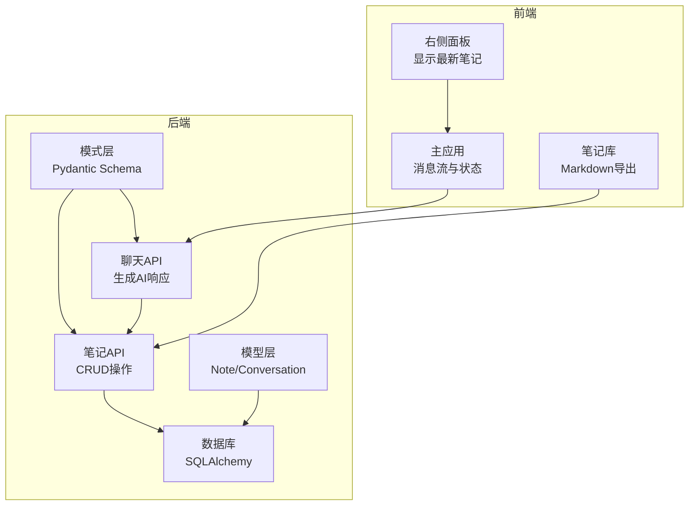
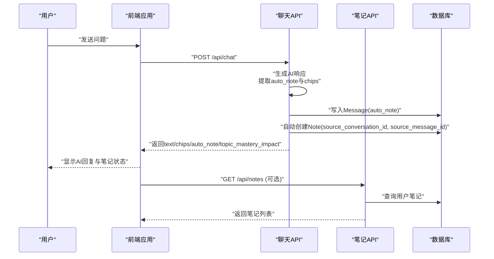
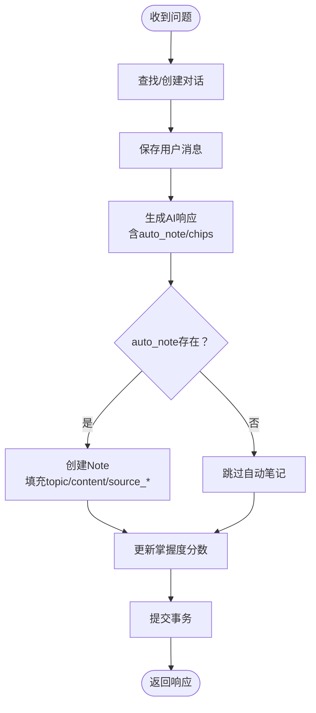
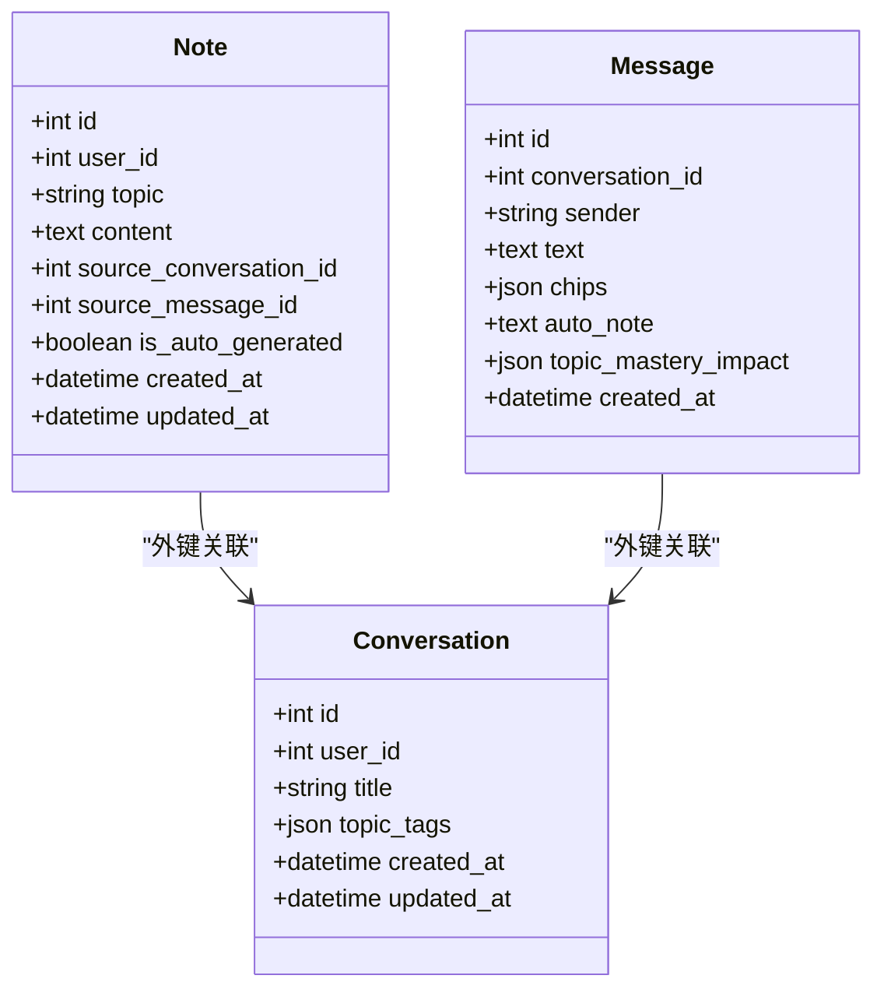
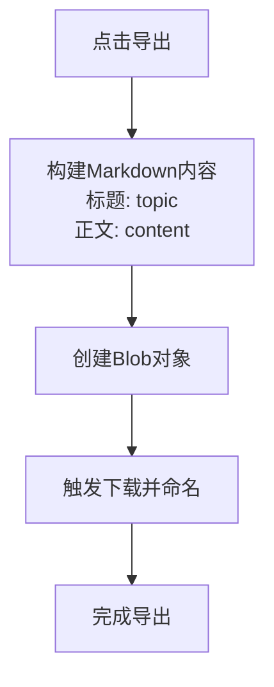
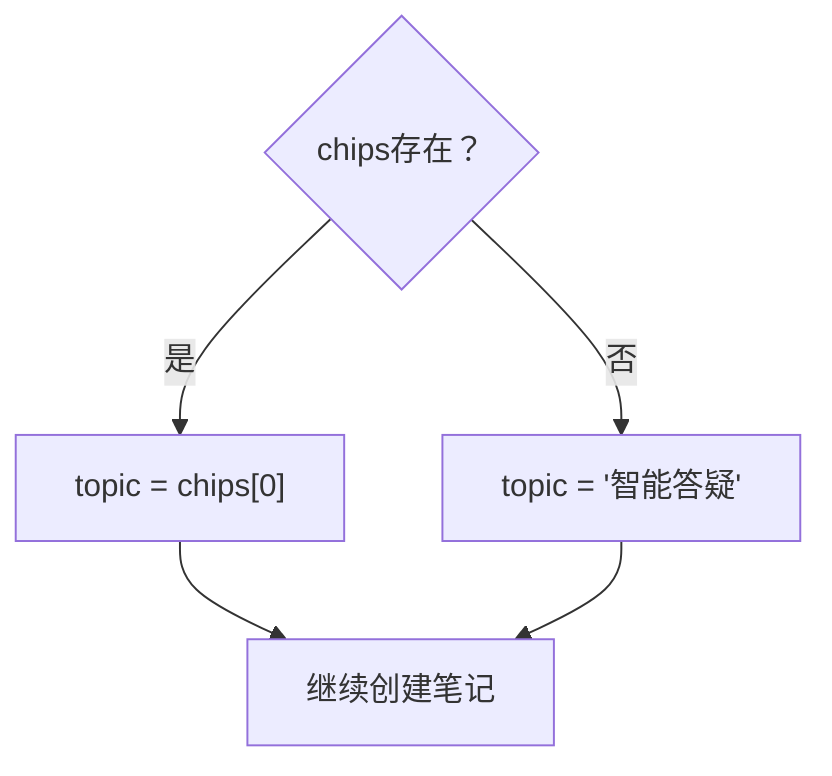
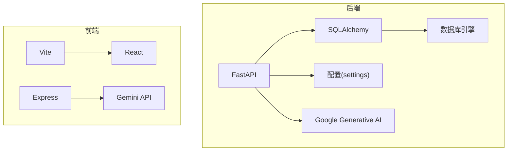

# 自动笔记生成

<cite>
**本文档引用的文件**
- [backend/app/models/note.py](file://backend/app/models/note.py)
- [backend/app/schemas/note.py](file://backend/app/schemas/note.py)
- [backend/app/api/notes.py](file://backend/app/api/notes.py)
- [backend/app/models/conversation.py](file://backend/app/models/conversation.py)
- [backend/app/schemas/conversation.py](file://backend/app/schemas/conversation.py)
- [backend/app/api/chat.py](file://backend/app/api/chat.py)
- [backend/app/api/mastery.py](file://backend/app/api/mastery.py)
- [backend/app/core/database.py](file://backend/app/core/database.py)
- [backend/app/core/config.py](file://backend/app/core/config.py)
- [backend/requirements.txt](file://backend/requirements.txt)
- [front/src/components/RightPanel.tsx](file://front/src/components/RightPanel.tsx)
- [front/src/App.tsx](file://front/src/App.tsx)
- [front/src/components/NotesChest.tsx](file://front/src/components/NotesChest.tsx)
- [front/server.ts](file://front/server.ts)
</cite>

## 目录
1. [简介](#简介)
2. [项目结构](#项目结构)
3. [核心组件](#核心组件)
4. [架构概览](#架构概览)
5. [详细组件分析](#详细组件分析)
6. [依赖关系分析](#依赖关系分析)
7. [性能考虑](#性能考虑)
8. [故障排除指南](#故障排除指南)
9. [结论](#结论)

## 简介
本文件详细说明了Quickly系统中的自动笔记生成功能，包括触发条件、生成逻辑、数据模型设计、内容格式化与存储机制，以及笔记的分类与标签系统。系统通过AI大模型生成的auto_note字段驱动自动笔记的创建，并通过source_conversation_id和source_message_id建立与对话历史的关联，确保用户能够追溯笔记来源。

## 项目结构
自动笔记功能横跨前端与后端，采用前后端分离架构：
- 前端负责用户交互、展示AI响应与自动笔记状态、导出Markdown等
- 后端提供API接口、数据库模型与业务逻辑，包括聊天、笔记管理、掌握度计算等

**图表来源**
- [front/src/components/RightPanel.tsx:70-90](file://front/src/components/RightPanel.tsx#L70-L90)
- [front/src/App.tsx:467-490](file://front/src/App.tsx#L467-L490)
- [front/src/components/NotesChest.tsx:29-50](file://front/src/components/NotesChest.tsx#L29-L50)
- [backend/app/api/chat.py:78-150](file://backend/app/api/chat.py#L78-L150)
- [backend/app/api/notes.py:64-82](file://backend/app/api/notes.py#L64-L82)
- [backend/app/models/note.py:11-35](file://backend/app/models/note.py#L11-L35)
- [backend/app/models/conversation.py:11-54](file://backend/app/models/conversation.py#L11-L54)

**章节来源**
- [backend/app/api/chat.py:78-150](file://backend/app/api/chat.py#L78-L150)
- [backend/app/api/notes.py:64-82](file://backend/app/api/notes.py#L64-L82)
- [backend/app/models/note.py:11-35](file://backend/app/models/note.py#L11-L35)
- [backend/app/models/conversation.py:11-54](file://backend/app/models/conversation.py#L11-L54)
- [front/src/components/RightPanel.tsx:70-90](file://front/src/components/RightPanel.tsx#L70-L90)
- [front/src/App.tsx:467-490](file://front/src/App.tsx#L467-L490)
- [front/src/components/NotesChest.tsx:29-50](file://front/src/components/NotesChest.tsx#L29-L50)

## 核心组件
- Note模型：定义笔记的字段、元数据与关联关系，支持自动笔记标记与来源追踪
- Conversation/Message模型：记录对话历史与AI响应，其中auto_note字段承载自动笔记内容
- Chat API：生成AI响应、计算掌握度影响、自动创建笔记
- Notes API：提供笔记的增删改查接口
- 前端组件：展示最新笔记、状态提示、Markdown导出

**章节来源**
- [backend/app/models/note.py:11-35](file://backend/app/models/note.py#L11-L35)
- [backend/app/models/conversation.py:11-54](file://backend/app/models/conversation.py#L11-L54)
- [backend/app/api/chat.py:78-150](file://backend/app/api/chat.py#L78-L150)
- [backend/app/api/notes.py:64-82](file://backend/app/api/notes.py#L64-L82)
- [front/src/components/RightPanel.tsx:70-90](file://front/src/components/RightPanel.tsx#L70-L90)

## 架构概览
自动笔记生成的端到端流程如下：

**图表来源**
- [backend/app/api/chat.py:78-150](file://backend/app/api/chat.py#L78-L150)
- [backend/app/api/notes.py:64-82](file://backend/app/api/notes.py#L64-L82)
- [backend/app/models/conversation.py:33-54](file://backend/app/models/conversation.py#L33-L54)
- [backend/app/models/note.py:11-35](file://backend/app/models/note.py#L11-L35)

## 详细组件分析

### 触发条件与生成逻辑
- 触发条件：AI响应中包含auto_note字段时触发自动笔记创建
- 生成逻辑：
  - Chat API接收问题，查找或创建对话
  - 保存用户消息后生成AI响应（模拟器模式或调用Gemini）
  - 将auto_note写入Message表
  - 若存在auto_note，则自动创建Note，填充topic、content、source_conversation_id、source_message_id、is_auto_generated
  - 更新掌握度分数

**图表来源**
- [backend/app/api/chat.py:78-150](file://backend/app/api/chat.py#L78-L150)

**章节来源**
- [backend/app/api/chat.py:78-150](file://backend/app/api/chat.py#L78-L150)

### Note模型与自动生成功能
- 字段设计：
  - topic：笔记主题，来源于chips的第一个元素或默认值
  - content：笔记正文，来源于auto_note
  - source_conversation_id：关联来源对话
  - source_message_id：关联来源消息
  - is_auto_generated：标记是否为自动笔记
  - 时间戳：created_at/updated_at
- 关联关系：Note与User、Conversation建立外键关联，便于按用户检索与来源追踪

**图表来源**
- [backend/app/models/note.py:11-35](file://backend/app/models/note.py#L11-L35)
- [backend/app/models/conversation.py:11-54](file://backend/app/models/conversation.py#L11-L54)

**章节来源**
- [backend/app/models/note.py:11-35](file://backend/app/models/note.py#L11-L35)
- [backend/app/models/conversation.py:11-54](file://backend/app/models/conversation.py#L11-L54)

### 数据模型与字段定义
- Note模型字段：
  - 主键与索引：id
  - 用户标识：user_id
  - 内容：topic(长度限制200)、content
  - 元数据：source_conversation_id、source_message_id
  - 状态：is_auto_generated
  - 时间戳：created_at、updated_at
- Message模型字段：
  - 文本内容：text
  - 知识点标签：chips
  - 自动笔记：auto_note
  - 掌握度影响：topic_mastery_impact
- Schema定义：
  - NoteCreate：创建时允许指定source_conversation_id、source_message_id、is_auto_generated
  - NoteResponse：返回包含id、user_id、source_conversation_id、is_auto_generated、created_at、updated_at

**章节来源**
- [backend/app/models/note.py:11-35](file://backend/app/models/note.py#L11-L35)
- [backend/app/schemas/note.py:10-40](file://backend/app/schemas/note.py#L10-L40)
- [backend/app/models/conversation.py:33-54](file://backend/app/models/conversation.py#L33-L54)
- [backend/app/schemas/conversation.py:21-73](file://backend/app/schemas/conversation.py#L21-L73)

### 笔记内容格式化与存储机制
- Markdown支持：前端NotesChest组件提供Markdown导出功能，将笔记标题与内容格式化为Markdown并下载
- 内容清洗：AI响应通过Gemini生成JSON结构，包含text、chips、autoNote等字段；前端渲染时对Markdown语法进行解析与展示
- 存储策略：笔记内容直接存储在content字段，topic字段用于快速检索与分类

**图表来源**
- [front/src/components/NotesChest.tsx:29-50](file://front/src/components/NotesChest.tsx#L29-L50)

**章节来源**
- [front/src/components/NotesChest.tsx:29-50](file://front/src/components/NotesChest.tsx#L29-L50)

### 分类与标签系统（topic字段的智能提取）
- topic提取规则：
  - 优先取自AI响应的chips数组首元素
  - 若chips为空，则使用默认值“智能答疑”
- 标签系统：
  - chips字段作为知识点标签，用于界面展示与掌握度影响计算
  - topic_mastery_impact字段记录各主题掌握度变化，用于复习调度

**图表来源**
- [backend/app/api/chat.py:125-136](file://backend/app/api/chat.py#L125-L136)

**章节来源**
- [backend/app/api/chat.py:125-136](file://backend/app/api/chat.py#L125-L136)
- [backend/app/schemas/conversation.py:31-42](file://backend/app/schemas/conversation.py#L31-L42)

### 前端集成与用户反馈
- 最新笔记展示：右侧面板实时显示最新笔记的topic与content摘要
- 状态提示：AI回复底部显示“笔记已自动保存”状态
- 导出功能：笔记库页面支持一键导出为Markdown文件

**章节来源**
- [front/src/components/RightPanel.tsx:70-90](file://front/src/components/RightPanel.tsx#L70-L90)
- [front/src/App.tsx:467-490](file://front/src/App.tsx#L467-L490)
- [front/src/components/NotesChest.tsx:29-50](file://front/src/components/NotesChest.tsx#L29-L50)

## 依赖关系分析
- 后端依赖：
  - FastAPI：提供API路由与依赖注入
  - SQLAlchemy：ORM模型与数据库连接
  - google-generativeai：调用Gemini生成AI响应
  - Redis/Celery：配置中预留，可用于缓存与异步任务（当前未启用）
- 前端依赖：
  - Vite/React：构建与运行时
  - Express：本地AI服务代理（Gemini）

**图表来源**
- [backend/app/core/config.py:10-45](file://backend/app/core/config.py#L10-L45)
- [backend/requirements.txt:1-36](file://backend/requirements.txt#L1-L36)
- [front/server.ts:1-40](file://front/server.ts#L1-L40)

**章节来源**
- [backend/app/core/config.py:10-45](file://backend/app/core/config.py#L10-L45)
- [backend/requirements.txt:1-36](file://backend/requirements.txt#L1-L36)
- [front/server.ts:1-40](file://front/server.ts#L1-L40)

## 性能考虑
- 数据库连接池：
  - 非SQLite环境启用pool_pre_ping、pool_size=10、max_overflow=20，提升并发性能与连接稳定性
- 异步数据库会话：
  - 使用AsyncSession减少I/O阻塞，提高吞吐量
- 缓存与队列：
  - 配置中预留Redis与Celery，可用于笔记生成任务的异步化与结果缓存（当前未启用）
- 建议优化：
  - 对频繁查询的笔记列表添加索引（如user_id、updated_at）
  - 在AI生成阶段增加超时与重试机制
  - 对大文本内容进行分页或懒加载展示

**章节来源**
- [backend/app/core/database.py:15-36](file://backend/app/core/database.py#L15-L36)
- [backend/app/core/config.py:26-37](file://backend/app/core/config.py#L26-L37)

## 故障排除指南
- Gemini API密钥缺失：
  - 现象：系统切换到模拟器模式，返回预设响应
  - 处理：设置有效的GEMINI_API_KEY或使用模拟器响应
- AI响应为空：
  - 现象：抛出错误并回退到模拟器响应
  - 处理：检查网络与API密钥配置，确认响应格式符合schema
- 笔记未创建：
  - 现象：auto_note为空时不创建笔记
  - 处理：确保AI响应包含auto_note字段
- 掌握度分数异常：
  - 现象：topic_mastery_impact计算累积超过100
  - 处理：在更新时进行上限保护（当前实现已做min(100, ...)）

**章节来源**
- [front/server.ts:20-40](file://front/server.ts#L20-L40)
- [front/server.ts:244-255](file://front/server.ts#L244-L255)
- [backend/app/api/chat.py:153-173](file://backend/app/api/chat.py#L153-L173)
- [backend/app/api/chat.py:176-183](file://backend/app/api/chat.py#L176-L183)
- [backend/app/api/chat.py:186-218](file://backend/app/api/chat.py#L186-L218)

## 结论
自动笔记生成功能通过清晰的触发条件与生成逻辑，实现了从AI响应到笔记存储的完整闭环。Note模型与Conversation/Message模型的关联设计保证了溯源能力，前端提供了友好的展示与导出体验。后续可在缓存与异步任务方面进一步优化，以提升大规模场景下的性能与稳定性。