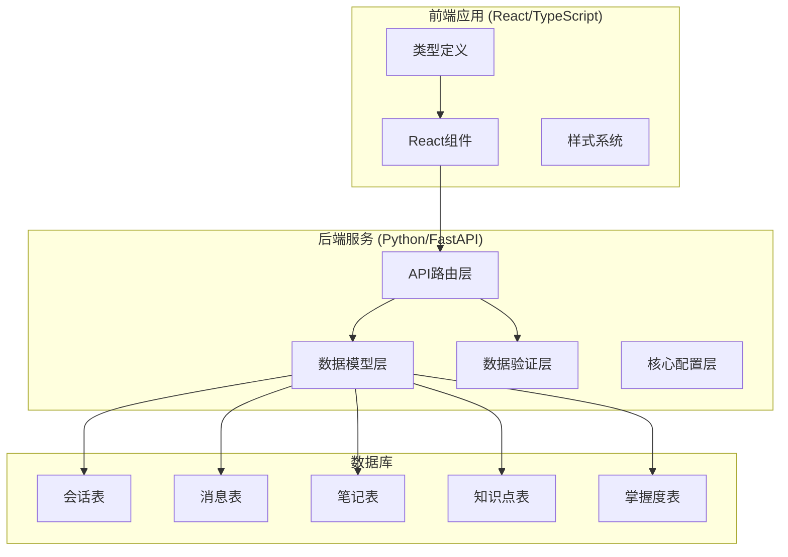
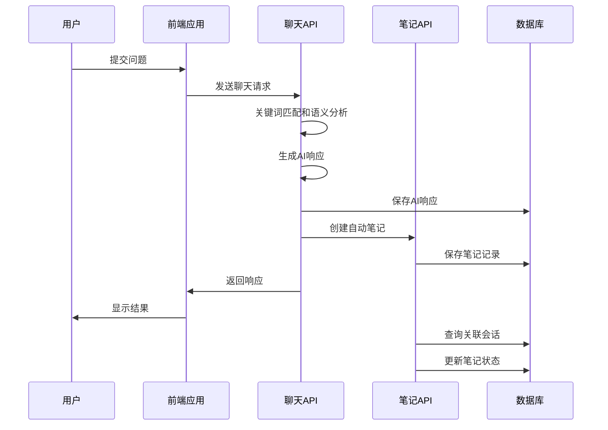
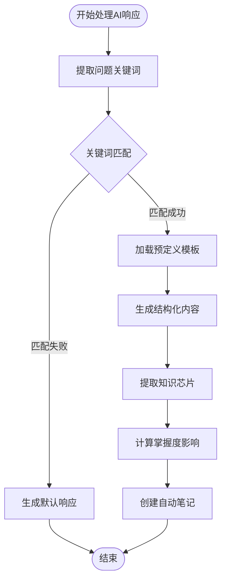
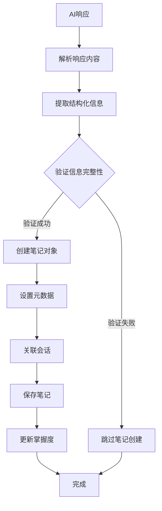
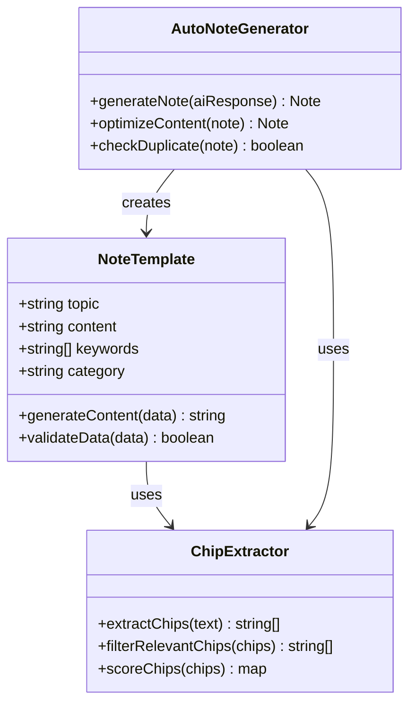
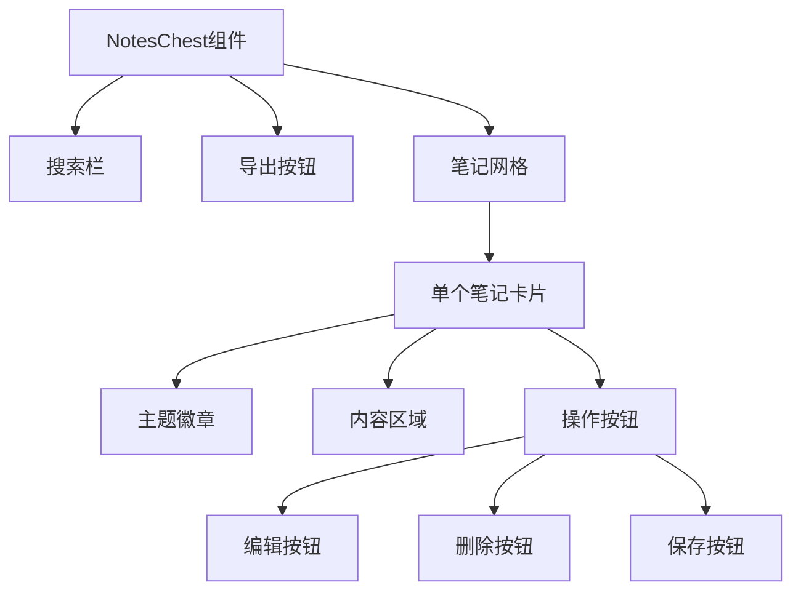
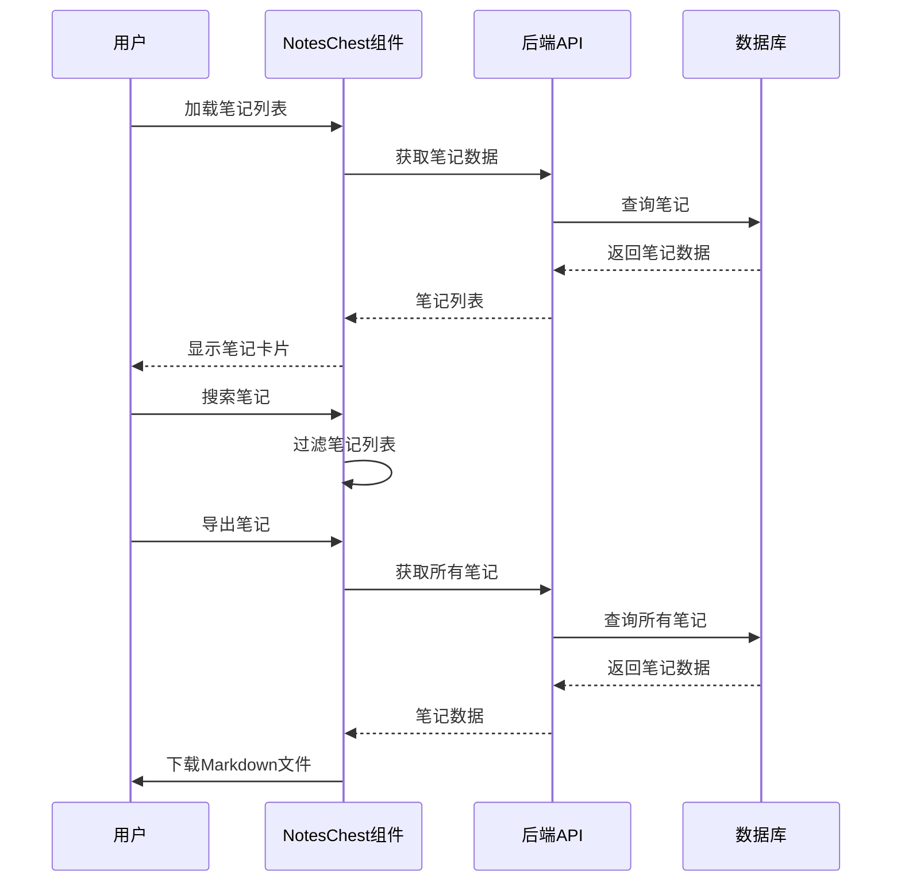
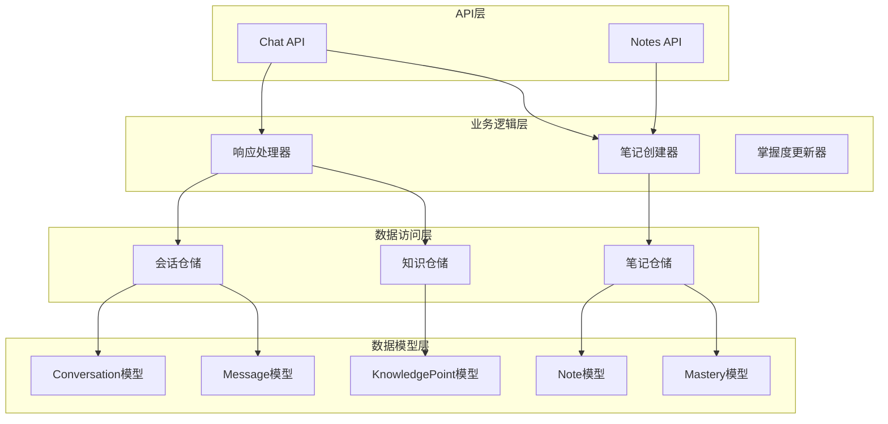

# 自动笔记生成

<cite>
**本文档引用的文件**
- [backend/app/api/chat.py](file://backend/app/api/chat.py)
- [backend/app/api/notes.py](file://backend/app/api/notes.py)
- [backend/app/models/note.py](file://backend/app/models/note.py)
- [backend/app/models/conversation.py](file://backend/app/models/conversation.py)
- [backend/app/models/knowledge.py](file://backend/app/models/knowledge.py)
- [backend/app/models/mastery.py](file://backend/app/models/mastery.py)
- [backend/app/schemas/note.py](file://backend/app/schemas/note.py)
- [backend/app/schemas/conversation.py](file://backend/app/schemas/conversation.py)
- [backend/app/schemas/knowledge.py](file://backend/app/schemas/knowledge.py)
- [front/src/components/NotesChest.tsx](file://front/src/components/NotesChest.tsx)
- [front/src/types.ts](file://front/src/types.ts)
</cite>

## 目录
1. [简介](#简介)
2. [项目结构](#项目结构)
3. [核心组件](#核心组件)
4. [架构概览](#架构概览)
5. [详细组件分析](#详细组件分析)
6. [依赖关系分析](#依赖关系分析)
7. [性能考虑](#性能考虑)
8. [故障排除指南](#故障排除指南)
9. [结论](#结论)

## 简介

自动笔记生成功能是Quickly学习平台的核心特性之一，它能够从AI对话响应中自动提取关键知识点，生成结构化的学习笔记，并与原始会话建立关联关系。该功能通过关键词识别、语义分析和结构化信息抽取算法，为用户提供了智能化的学习辅助工具。

系统采用前后端分离架构，后端基于FastAPI构建RESTful API，前端使用React和TypeScript开发用户界面。自动笔记生成流程涵盖了从AI响应解析到笔记存储的完整生命周期管理。

## 项目结构

Quickly项目采用模块化组织方式，主要分为后端API服务和前端React应用两大部分：

**图表来源**
- [backend/app/api/chat.py:1-252](file://backend/app/api/chat.py#L1-L252)
- [backend/app/models/conversation.py:1-54](file://backend/app/models/conversation.py#L1-L54)
- [backend/app/models/note.py:1-35](file://backend/app/models/note.py#L1-L35)

**章节来源**
- [backend/app/api/chat.py:1-252](file://backend/app/api/chat.py#L1-L252)
- [backend/app/api/notes.py:1-133](file://backend/app/api/notes.py#L1-L133)

## 核心组件

自动笔记生成系统由以下核心组件构成：

### 1. AI响应处理器
负责解析AI对话响应，提取关键词和结构化信息，生成自动笔记内容。

### 2. 笔记创建器
根据AI响应生成的结构化信息创建学习笔记，设置主题和内容。

### 3. 关联关系管理器
维护笔记与原始会话的关联关系，确保学习轨迹的完整性。

### 4. 前端笔记展示组件
提供用户友好的笔记浏览、编辑和导出功能。

**章节来源**
- [backend/app/api/chat.py:78-150](file://backend/app/api/chat.py#L78-L150)
- [backend/app/models/note.py:11-35](file://backend/app/models/note.py#L11-L35)

## 架构概览

自动笔记生成系统采用分层架构设计，实现了清晰的关注点分离：

**图表来源**
- [backend/app/api/chat.py:78-150](file://backend/app/api/chat.py#L78-L150)
- [backend/app/api/notes.py:64-82](file://backend/app/api/notes.py#L64-L82)

系统架构的关键特点：
- **事件驱动**: 基于AI响应触发自动笔记创建
- **异步处理**: 使用异步数据库操作提升性能
- **数据一致性**: 通过事务保证笔记和会话数据的一致性
- **可扩展性**: 模块化设计支持功能扩展

## 详细组件分析

### AI响应处理算法

#### 关键词识别算法
系统采用预定义的关键词匹配策略来识别AI响应中的知识点：

**图表来源**
- [backend/app/api/chat.py:153-173](file://backend/app/api/chat.py#L153-L173)
- [backend/app/api/chat.py:176-183](file://backend/app/api/chat.py#L176-L183)

#### 语义分析机制
系统通过以下方式实现语义分析：

1. **关键词权重计算**: 基于关键词在问题中的出现频率和重要性
2. **上下文理解**: 分析问题的领域和主题范围
3. **模板适配**: 根据识别到的知识点选择合适的响应模板

#### 结构化信息抽取
从AI响应中抽取的结构化信息包括：
- **主题标签 (Topic Tags)**: JSON格式的关键词列表
- **自动笔记内容 (Auto Note)**: 预格式化的学习要点
- **掌握度影响 (Mastery Impact)**: 对各知识点掌握度的影响评分

**章节来源**
- [backend/app/api/chat.py:25-68](file://backend/app/api/chat.py#L25-L68)
- [backend/app/models/conversation.py:44-47](file://backend/app/models/conversation.py#L44-L47)

### 自动笔记创建流程

#### 笔记创建步骤

**图表来源**
- [backend/app/api/chat.py:125-141](file://backend/app/api/chat.py#L125-L141)

#### 主题确定算法
系统采用多层次的主题确定策略：

1. **优先级1**: 使用AI响应中的第一个关键词作为主题
2. **优先级2**: 使用预定义的默认主题
3. **优先级3**: 使用问题的核心概念

#### 关联关系建立
笔记与会话的关联通过以下字段实现：
- `source_conversation_id`: 指向原始会话的外键
- `source_message_id`: 指向AI响应消息的ID

**章节来源**
- [backend/app/api/chat.py:125-136](file://backend/app/api/chat.py#L125-L136)
- [backend/app/models/note.py:23-24](file://backend/app/models/note.py#L23-L24)

### 笔记模板设计

#### 模板结构
系统采用预定义的模板系统来确保笔记内容的一致性和质量：

**图表来源**
- [backend/app/api/chat.py:25-68](file://backend/app/api/chat.py#L25-L68)
- [backend/app/api/chat.py:153-173](file://backend/app/api/chat.py#L153-L173)

#### 内容格式化实现
笔记内容采用统一的格式化标准：
- **标题格式**: 使用Markdown标题语法
- **内容格式**: 支持数学公式、代码片段等
- **链接格式**: 自动识别并格式化相关链接

**章节来源**
- [backend/app/schemas/note.py:16-21](file://backend/app/schemas/note.py#L16-L21)
- [backend/app/models/note.py:18-20](file://backend/app/models/note.py#L18-L20)

### 前端笔记展示组件

#### NotesChest组件功能
前端NotesChest组件提供了完整的笔记管理界面：

**图表来源**
- [front/src/components/NotesChest.tsx:13-181](file://front/src/components/NotesChest.tsx#L13-L181)

#### 用户交互流程

**图表来源**
- [front/src/components/NotesChest.tsx:34-50](file://front/src/components/NotesChest.tsx#L34-L50)

**章节来源**
- [front/src/components/NotesChest.tsx:1-181](file://front/src/components/NotesChest.tsx#L1-L181)
- [front/src/types.ts:16-21](file://front/src/types.ts#L16-L21)

## 依赖关系分析

系统采用清晰的依赖层次结构，确保模块间的松耦合：

**图表来源**
- [backend/app/api/chat.py:1-252](file://backend/app/api/chat.py#L1-L252)
- [backend/app/api/notes.py:1-133](file://backend/app/api/notes.py#L1-L133)

**章节来源**
- [backend/app/models/note.py:34-35](file://backend/app/models/note.py#L34-L35)
- [backend/app/models/conversation.py:28-30](file://backend/app/models/conversation.py#L28-L30)

## 性能考虑

### 数据库优化策略
1. **索引优化**: 在用户ID、创建时间等常用查询字段上建立索引
2. **批量操作**: 支持批量查询和更新操作
3. **连接池管理**: 使用异步连接池提升并发性能

### 缓存策略
1. **响应缓存**: 缓存常见的AI响应模板
2. **查询结果缓存**: 缓存频繁访问的笔记数据
3. **会话状态缓存**: 缓存用户会话状态信息

### 异步处理
系统广泛采用异步编程模式：
- 异步数据库操作避免阻塞
- 并发处理多个用户的请求
- 异步文件下载支持大容量笔记导出

## 故障排除指南

### 常见问题及解决方案

#### 1. 自动笔记未创建
**症状**: 用户收到AI响应但没有对应的笔记
**可能原因**:
- AI响应中缺少自动笔记内容
- 关键词匹配失败
- 数据库写入异常

**解决步骤**:
1. 检查AI响应是否包含`auto_note`字段
2. 验证关键词匹配逻辑
3. 查看数据库日志确认写入状态

#### 2. 笔记关联错误
**症状**: 笔记显示关联到错误的会话
**可能原因**:
- 会话ID传递错误
- 数据库外键约束问题
- 并发访问冲突

**解决步骤**:
1. 验证`source_conversation_id`和`source_message_id`的正确性
2. 检查会话权限验证逻辑
3. 实施并发控制机制

#### 3. 前端显示异常
**症状**: 笔记列表显示不正确或导出失败
**可能原因**:
- 类型定义不匹配
- API响应格式变化
- 文件下载权限问题

**解决步骤**:
1. 检查TypeScript类型定义
2. 验证API响应结构
3. 测试文件下载功能

**章节来源**
- [backend/app/api/chat.py:125-141](file://backend/app/api/chat.py#L125-L141)
- [backend/app/api/notes.py:64-82](file://backend/app/api/notes.py#L64-L82)

## 结论

自动笔记生成功能通过精心设计的算法和架构，为用户提供了智能化的学习辅助体验。系统的核心优势包括：

1. **智能关键词识别**: 基于预定义模板和关键词匹配的AI响应处理
2. **结构化信息抽取**: 统一的数据格式和标准化的内容生成
3. **完整的关联管理**: 笔记与会话的完整关联关系维护
4. **用户友好的界面**: 直观的笔记管理和导出功能

未来可以进一步优化的方向包括：
- 集成更先进的自然语言处理算法
- 实现智能去重和合并机制
- 添加笔记质量评估和推荐功能
- 扩展多模态内容支持（图片、视频等）

该系统为在线学习平台提供了坚实的技术基础，能够有效提升用户的学习效率和知识管理能力。