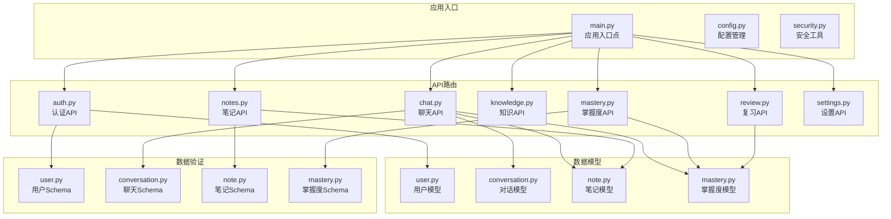
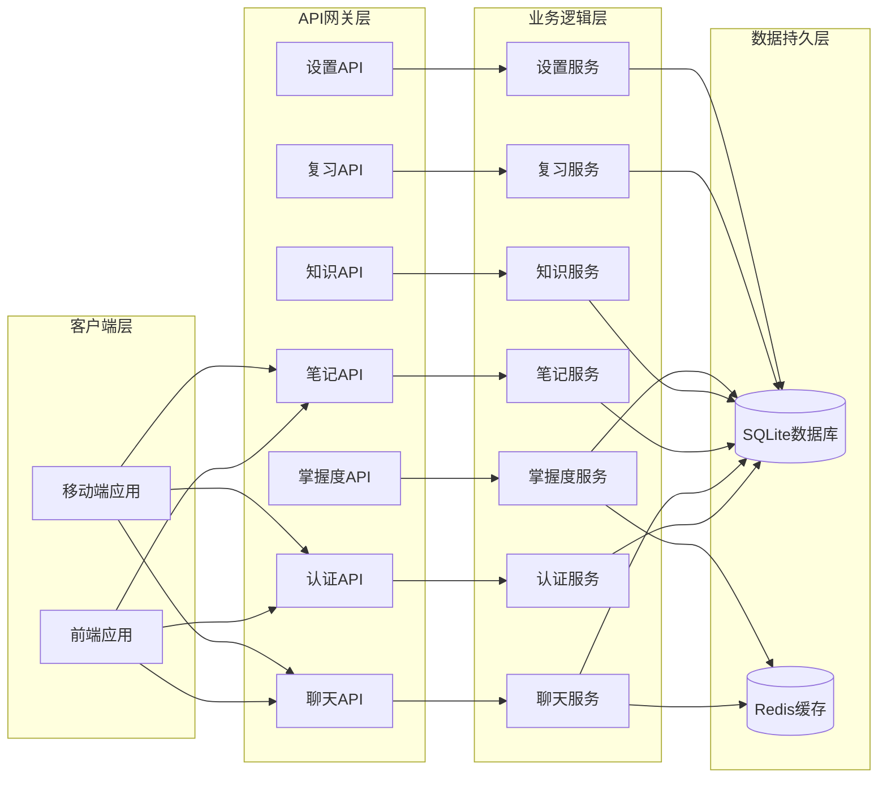
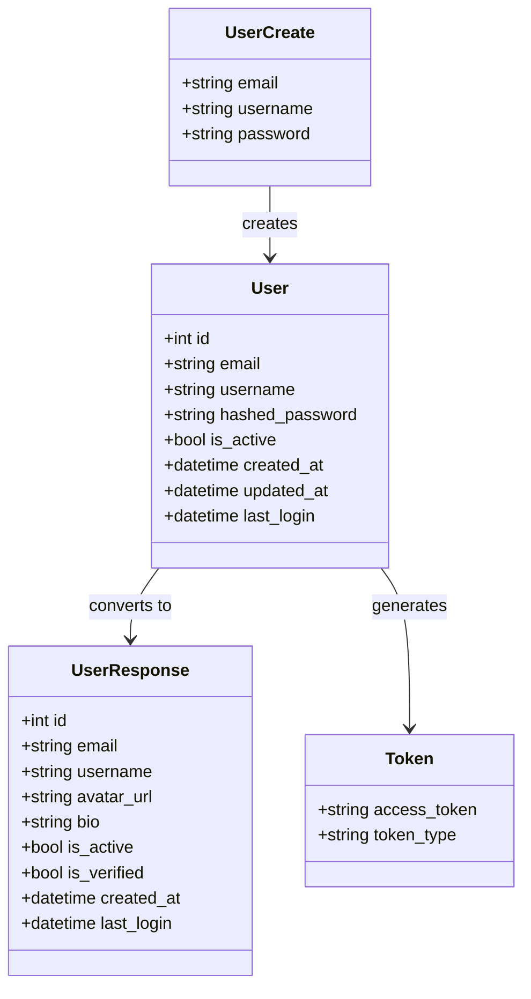
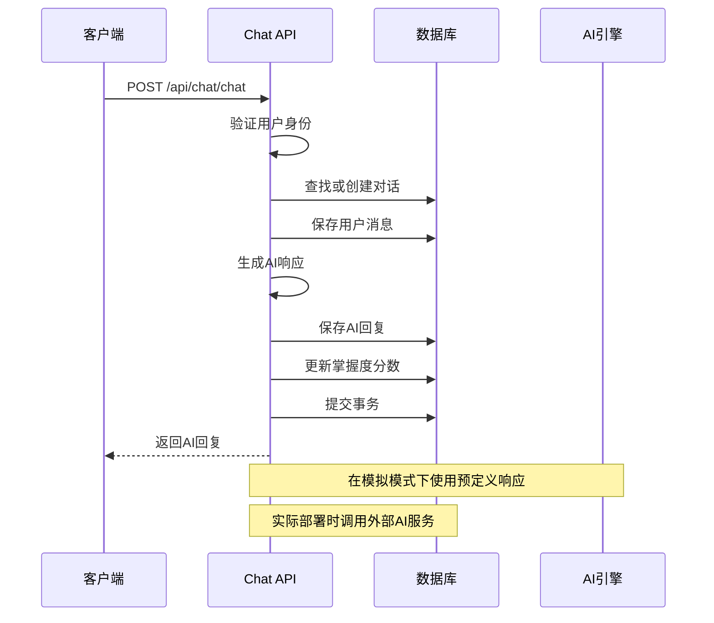
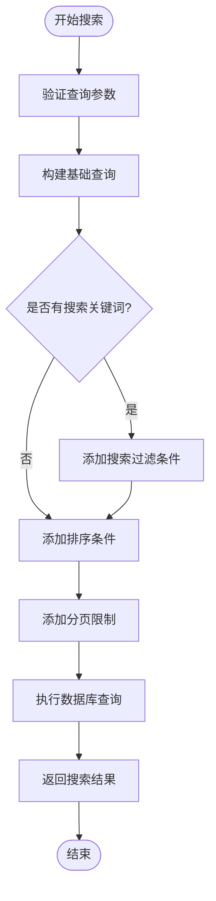
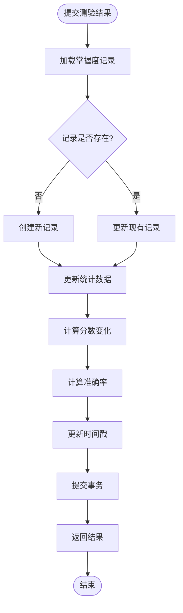
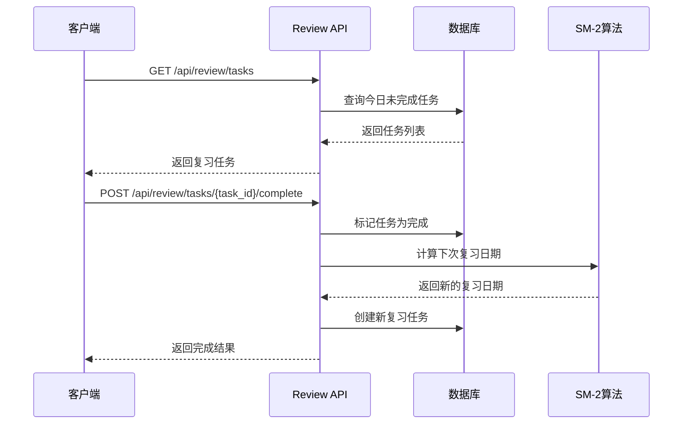
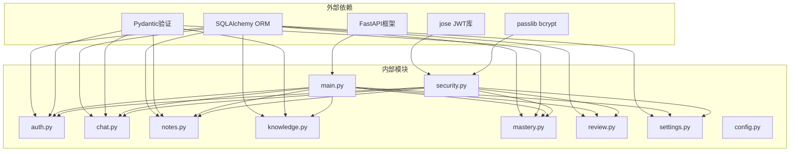

# API接口文档

<cite>
**本文档引用的文件**
- [backend/app/main.py](file://backend/app/main.py)
- [backend/app/api/__init__.py](file://backend/app/api/__init__.py)
- [backend/app/api/auth.py](file://backend/app/api/auth.py)
- [backend/app/api/chat.py](file://backend/app/api/chat.py)
- [backend/app/api/notes.py](file://backend/app/api/notes.py)
- [backend/app/api/knowledge.py](file://backend/app/api/knowledge.py)
- [backend/app/api/mastery.py](file://backend/app/api/mastery.py)
- [backend/app/api/review.py](file://backend/app/api/review.py)
- [backend/app/api/settings.py](file://backend/app/api/settings.py)
- [backend/app/core/config.py](file://backend/app/core/config.py)
- [backend/app/core/security.py](file://backend/app/core/security.py)
- [backend/app/models/user.py](file://backend/app/models/user.py)
- [backend/app/models/conversation.py](file://backend/app/models/conversation.py)
- [backend/app/models/note.py](file://backend/app/models/note.py)
- [backend/app/models/mastery.py](file://backend/app/models/mastery.py)
- [backend/app/schemas/user.py](file://backend/app/schemas/user.py)
- [backend/app/schemas/conversation.py](file://backend/app/schemas/conversation.py)
- [backend/app/schemas/note.py](file://backend/app/schemas/note.py)
- [backend/app/schemas/mastery.py](file://backend/app/schemas/mastery.py)
</cite>

## 目录
1. [简介](#简介)
2. [项目结构](#项目结构)
3. [核心组件](#核心组件)
4. [架构概览](#架构概览)
5. [详细组件分析](#详细组件分析)
6. [依赖关系分析](#依赖关系分析)
7. [性能考虑](#性能考虑)
8. [故障排除指南](#故障排除指南)
9. [结论](#结论)
10. [附录](#附录)

## 简介

Quickly是一个基于FastAPI构建的AI学习平台后端服务，提供了完整的RESTful API接口，支持用户认证、智能问答、笔记管理、知识掌握度跟踪、复习提醒和用户设置等功能。该系统采用异步数据库连接和JWT令牌认证机制，为前端应用提供稳定可靠的服务接口。

## 项目结构

后端采用模块化设计，按照功能领域组织代码结构：

**图表来源**
- [backend/app/main.py:1-66](file://backend/app/main.py#L1-L66)
- [backend/app/api/__init__.py:1-8](file://backend/app/api/__init__.py#L1-L8)

**章节来源**
- [backend/app/main.py:1-66](file://backend/app/main.py#L1-L66)
- [backend/app/api/__init__.py:1-8](file://backend/app/api/__init__.py#L1-L8)

## 核心组件

### 应用配置与启动

应用采用FastAPI框架，支持异步数据库连接和CORS跨域访问。主要配置包括：

- **应用信息**: 名称、版本、描述
- **安全配置**: JWT密钥、过期时间、算法
- **数据库配置**: SQLite数据库连接
- **CORS配置**: 允许的源、方法和头部
- **AI配置**: Gemini API密钥支持

### 认证系统

实现基于JWT的用户认证机制，支持密码哈希存储和令牌验证。

**章节来源**
- [backend/app/main.py:26-31](file://backend/app/main.py#L26-L31)
- [backend/app/core/config.py:10-45](file://backend/app/core/config.py#L10-L45)
- [backend/app/core/security.py:54-80](file://backend/app/core/security.py#L54-L80)

## 架构概览

**图表来源**
- [backend/app/main.py:42-49](file://backend/app/main.py#L42-L49)
- [backend/app/core/config.py:23-37](file://backend/app/core/config.py#L23-L37)

## 详细组件分析

### 认证API (Authentication)

提供用户注册、登录、个人信息查询和登出功能。

#### 接口规范

**用户注册**
- 方法: POST
- 路径: `/api/auth/register`
- 认证: 无需
- 请求体: 用户注册信息
- 响应: 用户信息

**用户登录**
- 方法: POST
- 路径: `/api/auth/login`
- 认证: 无需
- 请求体: OAuth2密码凭证
- 响应: JWT访问令牌

**获取当前用户信息**
- 方法: GET
- 路径: `/api/auth/me`
- 认证: 需要JWT令牌
- 响应: 用户信息

**用户登出**
- 方法: POST
- 路径: `/api/auth/logout`
- 认证: 需要JWT令牌
- 响应: 成功消息

#### 数据模型

**图表来源**
- [backend/app/models/user.py:11-39](file://backend/app/models/user.py#L11-L39)
- [backend/app/schemas/user.py:16-50](file://backend/app/schemas/user.py#L16-L50)

**章节来源**
- [backend/app/api/auth.py:22-99](file://backend/app/api/auth.py#L22-L99)

### 聊天API (Chat)

实现智能问答功能，支持对话历史管理和自动笔记生成功能。

#### 接口规范

**发送消息**
- 方法: POST
- 路径: `/api/chat/chat`
- 认证: 需要JWT令牌
- 请求体: 聊天请求
- 响应: AI回复和相关数据

**获取对话列表**
- 方法: GET
- 路径: `/api/chat/conversations`
- 认证: 需要JWT令牌
- 查询参数: 无
- 响应: 对话历史列表

**获取对话消息**
- 方法: GET
- 路径: `/api/chat/conversations/{conversation_id}/messages`
- 认证: 需要JWT令牌
- 路径参数: conversation_id
- 响应: 消息列表

#### 智能问答流程

**图表来源**
- [backend/app/api/chat.py:78-151](file://backend/app/api/chat.py#L78-L151)

**章节来源**
- [backend/app/api/chat.py:78-252](file://backend/app/api/chat.py#L78-L252)

### 笔记API (Notes)

提供完整的笔记管理系统，支持CRUD操作、搜索功能和分页查询。

#### 接口规范

**获取笔记列表**
- 方法: GET
- 路径: `/api/notes/`
- 认证: 需要JWT令牌
- 查询参数:
  - search: 搜索关键词
  - skip: 跳过数量 (默认0)
  - limit: 限制数量 (默认50, 最大100)
- 响应: 笔记列表

**获取单个笔记**
- 方法: GET
- 路径: `/api/notes/{note_id}`
- 认证: 需要JWT令牌
- 路径参数: note_id
- 响应: 笔记详情

**创建笔记**
- 方法: POST
- 路径: `/api/notes/`
- 认证: 需要JWT令牌
- 请求体: 笔记创建信息
- 响应: 新建笔记

**更新笔记**
- 方法: PUT
- 路径: `/api/notes/{note_id}`
- 认证: 需要JWT令牌
- 路径参数: note_id
- 请求体: 笔记更新信息
- 响应: 更新后的笔记

**删除笔记**
- 方法: DELETE
- 路径: `/api/notes/{note_id}`
- 认证: 需要JWT令牌
- 路径参数: note_id
- 响应: 删除确认

#### 笔记搜索流程

**图表来源**
- [backend/app/api/notes.py:20-42](file://backend/app/api/notes.py#L20-L42)

**章节来源**
- [backend/app/api/notes.py:20-133](file://backend/app/api/notes.py#L20-L133)

### 知识API (Knowledge)

管理知识要点信息，支持分类查询和详情获取。

#### 接口规范

**获取知识要点列表**
- 方法: GET
- 路径: `/api/knowledge/`
- 认证: 需要JWT令牌
- 查询参数: category (可选)
- 响应: 知识要点列表

**获取单个知识要点**
- 方法: GET
- 路径: `/api/knowledge/{kp_id}`
- 认证: 需要JWT令牌
- 路径参数: kp_id
- 响应: 知识要点详情

**创建知识要点**
- 方法: POST
- 路径: `/api/knowledge/`
- 认证: 需要JWT令牌
- 请求体: 知识要点创建信息
- 响应: 新建知识要点

**章节来源**
- [backend/app/api/knowledge.py:20-69](file://backend/app/api/knowledge.py#L20-L69)

### 掌握度API (Mastery)

跟踪用户对知识要点的掌握程度，提供测验功能和进度统计。

#### 接口规范

**获取掌握度概览**
- 方法: GET
- 路径: `/api/mastery/overview`
- 认证: 需要JWT令牌
- 响应: 掌握度概览

**获取所有掌握度记录**
- 方法: GET
- 路径: `/api/mastery/`
- 认证: 需要JWT令牌
- 响应: 掌握度记录列表

**获取特定知识要点的掌握度**
- 方法: GET
- 路径: `/api/mastery/{knowledge_point_id}`
- 认证: 需要JWT令牌
- 路径参数: knowledge_point_id
- 响应: 掌握度详情

**提交测验结果**
- 方法: POST
- 路径: `/api/mastery/quiz/{knowledge_point_id}`
- 认证: 需要JWT令牌
- 路径参数: knowledge_point_id
- 查询参数: correct (布尔值)
- 响应: 更新后的掌握度统计

#### 掌握度计算流程

**图表来源**
- [backend/app/api/mastery.py:94-140](file://backend/app/api/mastery.py#L94-L140)

**章节来源**
- [backend/app/api/mastery.py:20-140](file://backend/app/api/mastery.py#L20-L140)

### 复习API (Review)

基于SM-2间隔重复算法的复习提醒系统。

#### 接口规范

**获取今日复习任务**
- 方法: GET
- 路径: `/api/review/tasks`
- 认证: 需要JWT令牌
- 响应: 复习任务列表

**完成复习任务**
- 方法: POST
- 路径: `/api/review/tasks/{task_id}/complete`
- 认证: 需要JWT令牌
- 路径参数: task_id
- 响应: 复习完成信息和下次复习日期

#### 复习调度流程

**图表来源**
- [backend/app/api/review.py:21-91](file://backend/app/api/review.py#L21-L91)

**章节来源**
- [backend/app/api/review.py:21-91](file://backend/app/api/review.py#L21-L91)

### 设置API (Settings)

管理用户个人设置和偏好配置。

#### 接口规范

**获取用户设置**
- 方法: GET
- 路径: `/api/settings/`
- 认证: 需要JWT令牌
- 响应: 用户设置

**更新用户设置**
- 方法: PUT
- 路径: `/api/settings/`
- 认证: 需要JWT令牌
- 请求体: 设置更新信息
- 响应: 更新后的设置

**章节来源**
- [backend/app/api/settings.py:19-65](file://backend/app/api/settings.py#L19-L65)

## 依赖关系分析

**图表来源**
- [backend/app/main.py:6-12](file://backend/app/main.py#L6-L12)
- [backend/app/core/security.py:7-16](file://backend/app/core/security.py#L7-L16)

**章节来源**
- [backend/app/main.py:6-12](file://backend/app/main.py#L6-L12)
- [backend/app/core/security.py:1-80](file://backend/app/core/security.py#L1-L80)

## 性能考虑

### 数据库优化

- **异步连接**: 使用aiofiles和异步SQLAlchemy减少I/O等待
- **连接池**: 配置适当的连接池大小和超时设置
- **索引优化**: 为常用查询字段建立索引
- **查询优化**: 使用select()和join()优化复杂查询

### 缓存策略

- **Redis集成**: 支持Redis作为缓存层
- **会话缓存**: 缓存用户会话信息
- **查询结果缓存**: 缓存频繁访问的数据

### API性能

- **分页查询**: 默认限制查询结果数量，防止内存溢出
- **批量操作**: 支持批量数据处理
- **压缩传输**: 支持Gzip压缩减少网络传输

## 故障排除指南

### 常见错误类型

**认证相关错误**
- 401 未授权: 无效的JWT令牌或令牌过期
- 403 禁止访问: 用户权限不足
- 400 错误请求: 认证凭据无效

**数据访问错误**
- 404 未找到: 请求的资源不存在
- 409 冲突: 数据库约束冲突
- 500 服务器内部错误: 服务器异常

**验证错误**
- 422 参数验证失败: 请求数据格式不正确
- 字段长度限制: 用户名、密码等字段长度不符合要求

### 调试建议

1. **检查JWT令牌**: 确保令牌有效且未过期
2. **验证请求格式**: 确认JSON格式正确
3. **检查数据库连接**: 验证数据库连接字符串
4. **查看日志**: 分析服务器日志获取详细错误信息

**章节来源**
- [backend/app/api/auth.py:28-73](file://backend/app/api/auth.py#L28-L73)
- [backend/app/api/chat.py:94-95](file://backend/app/api/chat.py#L94-L95)
- [backend/app/api/notes.py:60-61](file://backend/app/api/notes.py#L60-L61)

## 结论

Quickly API提供了一个完整、健壮的RESTful接口集合，涵盖了现代学习平台所需的核心功能。系统采用模块化设计，具有良好的可扩展性和维护性。通过JWT认证、异步数据库操作和合理的错误处理机制，确保了系统的安全性、性能和可靠性。

## 附录

### API版本控制

系统当前版本为1.0.0，采用语义化版本控制：

- **主版本**: 重大API变更
- **次版本**: 新功能添加
- **修订版本**: Bug修复和小改进

### 向后兼容性

- 新增字段时保持向后兼容
- 不破坏现有API行为
- 提供迁移指南

### 安全最佳实践

- 使用HTTPS传输
- JWT令牌过期管理
- 输入数据验证
- SQL注入防护
- XSS防护措施