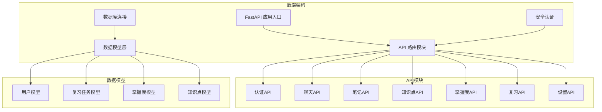
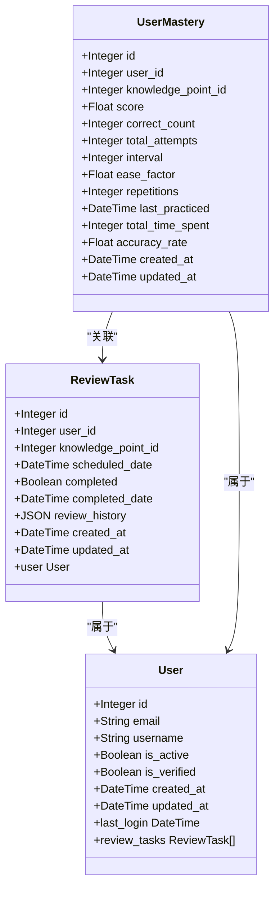
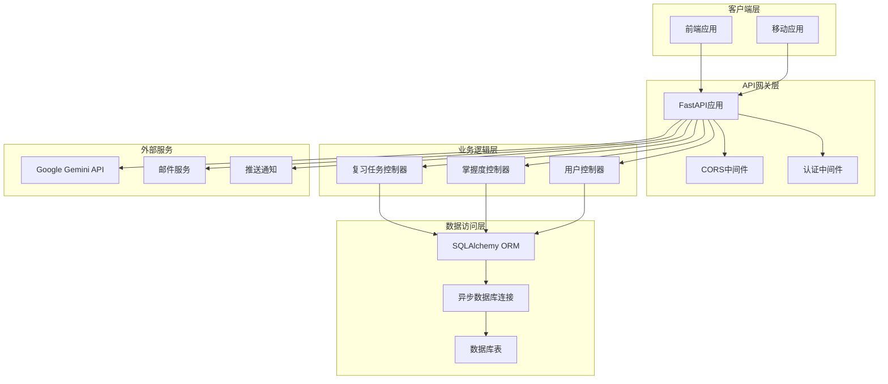
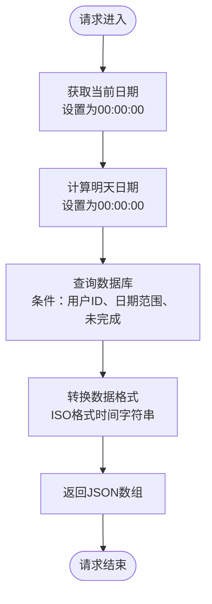
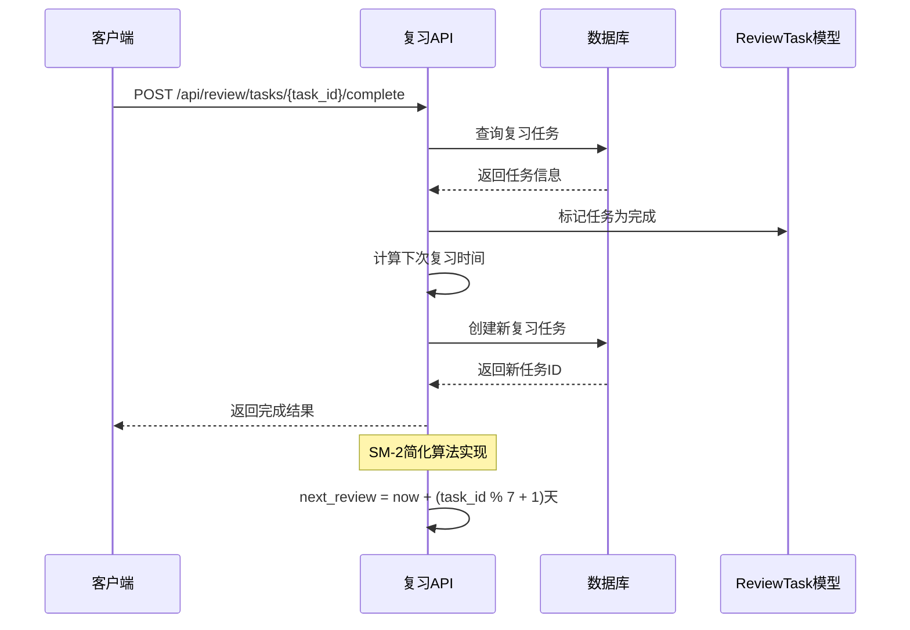
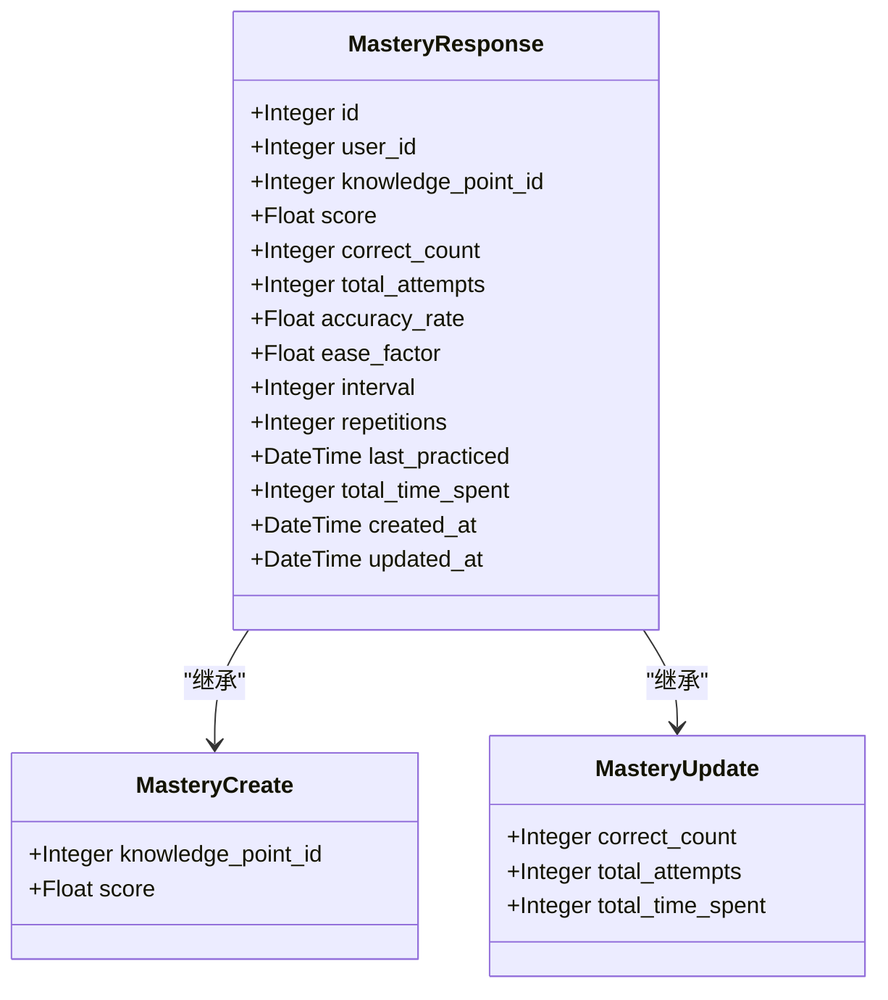
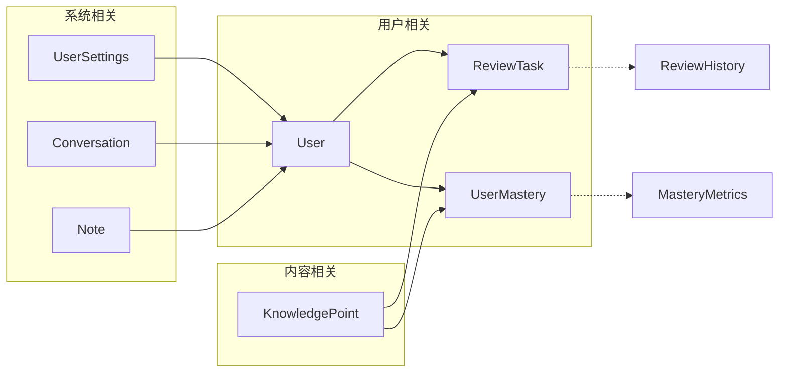

# 复习提醒API接口

<cite>
**本文档引用的文件**
- [backend/app/api/review.py](file://backend/app/api/review.py)
- [backend/app/models/review.py](file://backend/app/models/review.py)
- [backend/app/models/mastery.py](file://backend/app/models/mastery.py)
- [backend/app/models/user.py](file://backend/app/models/user.py)
- [backend/app/schemas/mastery.py](file://backend/app/schemas/mastery.py)
- [backend/app/main.py](file://backend/app/main.py)
- [backend/app/core/database.py](file://backend/app/core/database.py)
- [PROJECT_OVERVIEW.md](file://PROJECT_OVERVIEW.md)
</cite>

## 目录
1. [简介](#简介)
2. [项目结构](#项目结构)
3. [核心组件](#核心组件)
4. [架构概览](#架构概览)
5. [详细组件分析](#详细组件分析)
6. [依赖关系分析](#依赖关系分析)
7. [性能考虑](#性能考虑)
8. [故障排除指南](#故障排除指南)
9. [结论](#结论)

## 简介

Quickly是一个基于AI的学习平台，专注于通过智能复习提醒系统帮助用户高效记忆知识点。本API文档详细介绍了复习提醒系统的RESTful接口，包括复习任务创建、查询、完成和历史记录管理等功能。

复习提醒系统基于艾宾浩斯遗忘曲线和间隔重复理论，结合SM-2算法实现智能化的复习调度。系统支持个性化提醒策略，根据用户的掌握程度动态调整复习间隔时间。

## 项目结构

Quickly项目采用前后端分离架构，后端使用FastAPI框架构建RESTful API服务。

**图表来源**
- [backend/app/main.py:1-66](file://backend/app/main.py#L1-L66)
- [backend/app/api/review.py:1-91](file://backend/app/api/review.py#L1-L91)

**章节来源**
- [PROJECT_OVERVIEW.md:1-200](file://PROJECT_OVERVIEW.md#L1-L200)
- [backend/app/main.py:1-66](file://backend/app/main.py#L1-L66)

## 核心组件

### 复习任务模型

复习任务模型是整个复习系统的核心数据结构，负责存储和管理用户的复习提醒信息。

**图表来源**
- [backend/app/models/review.py:11-35](file://backend/app/models/review.py#L11-L35)
- [backend/app/models/user.py:11-39](file://backend/app/models/user.py#L11-L39)
- [backend/app/models/mastery.py:11-44](file://backend/app/models/mastery.py#L11-L44)

### 复习API路由

复习API模块提供了完整的复习任务管理功能，包括任务查询、完成确认和历史记录管理。

**章节来源**
- [backend/app/api/review.py:1-91](file://backend/app/api/review.py#L1-L91)

## 架构概览

Quickly复习提醒系统采用分层架构设计，确保了代码的可维护性和扩展性。

**图表来源**
- [backend/app/main.py:26-49](file://backend/app/main.py#L26-L49)
- [backend/app/core/database.py:15-36](file://backend/app/core/database.py#L15-L36)

## 详细组件分析

### 复习任务查询接口

#### GET /api/review/tasks

该接口用于获取用户当天需要进行的复习任务列表。

**请求参数**
- 无

**响应数据结构**
- 返回JSON数组，每个元素包含：
  - `id`: 复习任务ID
  - `knowledge_point_id`: 知识点ID
  - `scheduled_date`: 预定复习时间
  - `completed`: 是否已完成

**实现逻辑流程**

**图表来源**
- [backend/app/api/review.py:21-48](file://backend/app/api/review.py#L21-L48)

**章节来源**
- [backend/app/api/review.py:21-48](file://backend/app/api/review.py#L21-L48)

### 复习任务完成接口

#### POST /api/review/tasks/{task_id}/complete

该接口用于标记指定的复习任务为已完成，并根据SM-2算法安排下一次复习。

**路径参数**
- `task_id`: 复习任务ID

**请求参数**
- 无

**响应数据结构**
- `message`: 操作结果消息
- `next_review_date`: 下次复习日期
- `new_task_id`: 新创建的任务ID

**SM-2算法实现**

**图表来源**
- [backend/app/api/review.py:51-90](file://backend/app/api/review.py#L51-L90)

**章节来源**
- [backend/app/api/review.py:51-90](file://backend/app/api/review.py#L51-L90)

### 复习历史记录管理

复习历史记录功能通过JSON字段存储每次复习的结果，支持后续的统计分析和效果评估。

**历史记录数据结构**
- 时间戳：复习完成的时间
- 结果：用户对知识点的掌握程度评估
- 间隔：两次复习之间的天数
- 效率因子：影响复习间隔的调整系数

**章节来源**
- [backend/app/models/review.py:26-27](file://backend/app/models/review.py#L26-L27)

### 掌握度模型集成

掌握度模型为复习系统提供了更精确的算法基础，支持完整的SM-2算法实现。

**图表来源**
- [backend/app/schemas/mastery.py:10-53](file://backend/app/schemas/mastery.py#L10-L53)

**章节来源**
- [backend/app/models/mastery.py:11-44](file://backend/app/models/mastery.py#L11-L44)
- [backend/app/schemas/mastery.py:16-53](file://backend/app/schemas/mastery.py#L16-L53)

## 依赖关系分析

### 数据库模型依赖

复习系统涉及多个数据模型之间的复杂关系，形成了完整的数据依赖网络。

**图表来源**
- [backend/app/models/review.py:16-19](file://backend/app/models/review.py#L16-L19)
- [backend/app/models/user.py:36-38](file://backend/app/models/user.py#L36-L38)

### API路由依赖

后端应用通过主入口文件统一管理所有API路由，实现了清晰的模块化架构。

**章节来源**
- [backend/app/main.py:42-49](file://backend/app/main.py#L42-L49)

## 性能考虑

### 数据库优化

1. **索引优化**
   - 在用户ID和知识点ID上建立复合索引
   - 对scheduled_date字段建立索引以加速查询
   - 对completed状态建立索引以支持快速筛选

2. **查询优化**
   - 使用异步查询避免阻塞
   - 批量操作减少数据库往返次数
   - 合理使用JOIN减少查询复杂度

3. **连接池管理**
   - 配置合适的连接池大小
   - 启用连接预检查机制
   - 支持SQLite和PostgreSQL的不同配置

### 缓存策略

1. **短期缓存**
   - 用户活跃的复习任务可以缓存1-5分钟
   - 掌握度分数可以缓存10-30分钟

2. **持久化缓存**
   - 频繁访问的知识点信息
   - 用户个人化的复习偏好设置

## 故障排除指南

### 常见问题及解决方案

**1. 复习任务查询为空**
- 检查用户认证状态
- 验证当前时间是否在正确的时区
- 确认数据库中是否存在当天的复习任务

**2. 复习任务完成失败**
- 验证task_id的有效性
- 检查用户权限是否匹配
- 确认任务状态是否为未完成

**3. 数据库连接问题**
- 检查DATABASE_URL配置
- 验证数据库服务状态
- 确认连接池配置是否合理

**章节来源**
- [backend/app/api/review.py:65-66](file://backend/app/api/review.py#L65-L66)
- [backend/app/core/database.py:15-36](file://backend/app/core/database.py#L15-L36)

## 结论

Quickly复习提醒API系统为学习者提供了一个完整的智能复习解决方案。系统基于科学的记忆理论，通过SM-2算法实现了个性化的复习调度，能够有效提高学习效率和记忆保持率。

未来的发展方向包括：
1. 完整实现SM-2算法，支持更精确的复习间隔计算
2. 集成机器学习模型预测掌握度变化趋势
3. 建立知识依赖关系图优化复习顺序
4. 实现多设备同步和离线复习功能

通过持续优化算法和用户体验，Quickly将成为学习者最可靠的智能复习伙伴。