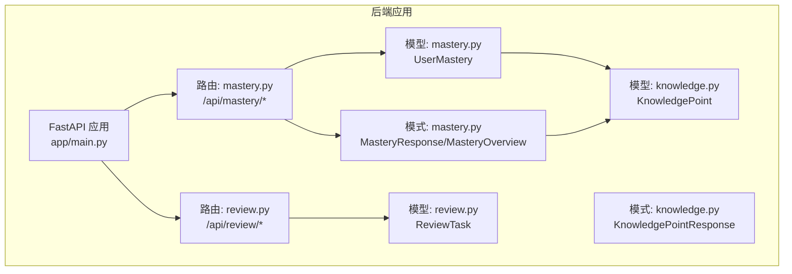
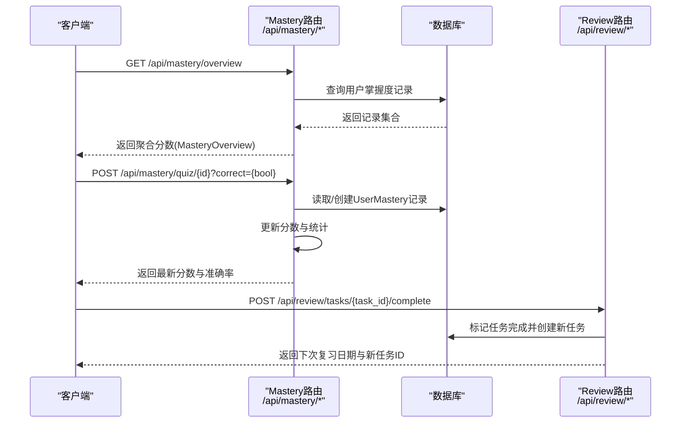
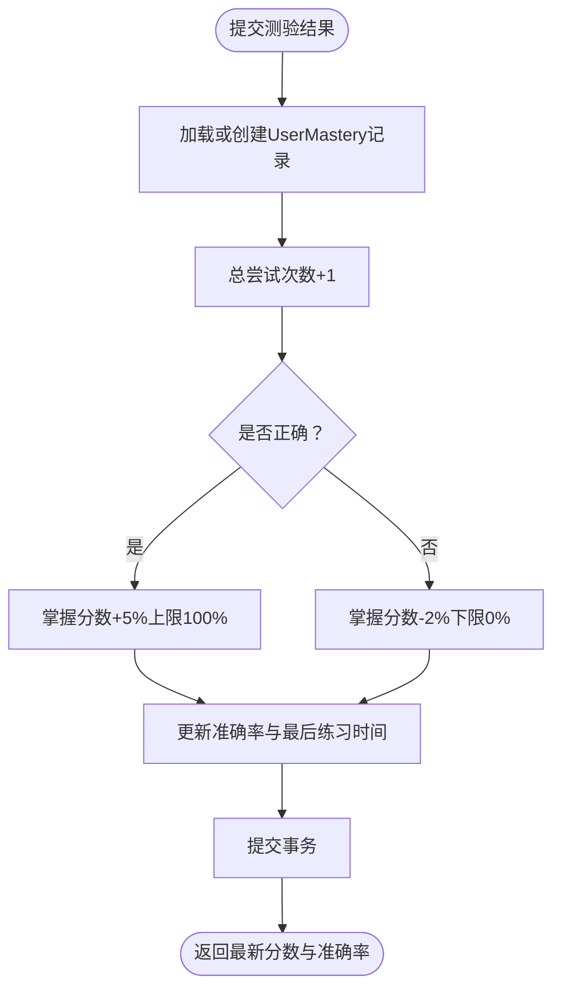
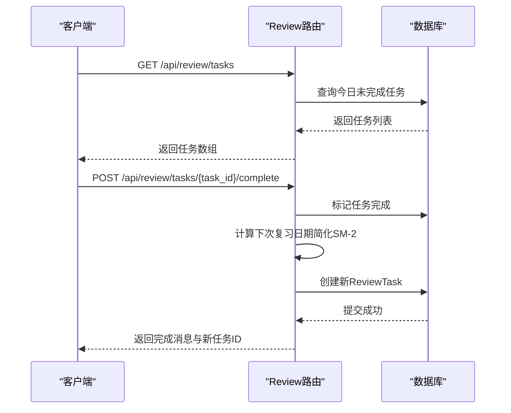
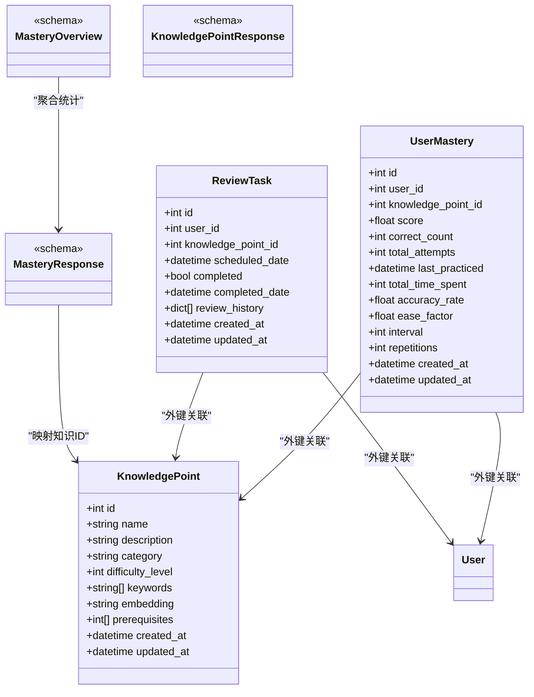

# 掌握度API接口

<cite>
**本文档引用的文件**
- [backend/app/main.py](file://backend/app/main.py)
- [backend/app/api/mastery.py](file://backend/app/api/mastery.py)
- [backend/app/models/mastery.py](file://backend/app/models/mastery.py)
- [backend/app/schemas/mastery.py](file://backend/app/schemas/mastery.py)
- [backend/app/api/review.py](file://backend/app/api/review.py)
- [backend/app/models/review.py](file://backend/app/models/review.py)
- [backend/app/models/knowledge.py](file://backend/app/models/knowledge.py)
- [backend/app/schemas/knowledge.py](file://backend/app/schemas/knowledge.py)
- [backend/README.md](file://backend/README.md)
- [PROJECT_OVERVIEW.md](file://PROJECT_OVERVIEW.md)
</cite>

## 目录
1. [简介](#简介)
2. [项目结构](#项目结构)
3. [核心组件](#核心组件)
4. [架构总览](#架构总览)
5. [详细组件分析](#详细组件分析)
6. [依赖分析](#依赖分析)
7. [性能考虑](#性能考虑)
8. [故障排除指南](#故障排除指南)
9. [结论](#结论)
10. [附录](#附录)

## 简介
本文件为Quickly平台的掌握度API接口提供全面的RESTful API文档，覆盖以下核心接口：
- 掌握度概览接口：聚合用户在不同知识点维度上的掌握分数，便于多维诊断与趋势分析
- 掌握度测验接口：提交测验结果并实时更新掌握度分数与准确率
- 掌握度进度跟踪接口：按知识点维度追踪学习进度、完成度统计与里程碑奖励（通过复习任务与间隔重复机制实现）
- 掌握度预测接口：基于历史数据与SM-2算法的复习调度进行学习效果预测与建议（当前为简化实现）

文档同时说明掌握度模型、评分标准与学习效果评估指标，并提供请求/响应示例与算法实现细节。

## 项目结构
后端采用FastAPI + SQLAlchemy异步ORM，掌握度相关模块位于backend/app目录下，核心文件如下：
- API路由：/api/mastery.py、/api/review.py
- 数据模型：/models/mastery.py、/models/review.py、/models/knowledge.py
- 数据校验：/schemas/mastery.py、/schemas/knowledge.py
- 应用入口：/main.py

图表来源
- [backend/app/main.py:42-49](file://backend/app/main.py#L42-L49)
- [backend/app/api/mastery.py:17](file://backend/app/api/mastery.py#L17)
- [backend/app/api/review.py:18](file://backend/app/api/review.py#L18)
- [backend/app/models/mastery.py:11](file://backend/app/models/mastery.py#L11)
- [backend/app/models/review.py:11](file://backend/app/models/review.py#L11)
- [backend/app/models/knowledge.py:10](file://backend/app/models/knowledge.py#L10)
- [backend/app/schemas/mastery.py:28](file://backend/app/schemas/mastery.py#L28)
- [backend/app/schemas/knowledge.py:24](file://backend/app/schemas/knowledge.py#L24)

章节来源
- [backend/app/main.py:42-49](file://backend/app/main.py#L42-L49)
- [backend/app/api/mastery.py:17](file://backend/app/api/mastery.py#L17)
- [backend/app/api/review.py:18](file://backend/app/api/review.py#L18)

## 核心组件
- 掌握度模型（UserMastery）：记录用户对知识点的掌握分数、答题统计、时间与间隔重复参数等
- 复习任务模型（ReviewTask）：记录用户的复习计划与完成状态，支持基于SM-2的复习调度
- 知识点模型（KnowledgePoint）：描述学习主题与难度、前置条件等元数据
- 掌握度模式（MasteryResponse/MasteryOverview）：用于API响应的数据结构
- 复习任务模式：用于返回复习任务列表与完成后的调度结果

章节来源
- [backend/app/models/mastery.py:11-44](file://backend/app/models/mastery.py#L11-L44)
- [backend/app/models/review.py:11-35](file://backend/app/models/review.py#L11-L35)
- [backend/app/models/knowledge.py:10-32](file://backend/app/models/knowledge.py#L10-L32)
- [backend/app/schemas/mastery.py:28-53](file://backend/app/schemas/mastery.py#L28-L53)
- [backend/app/schemas/knowledge.py:24-35](file://backend/app/schemas/knowledge.py#L24-L35)

## 架构总览
掌握度相关流程涉及以下关键交互：
- 掌握度概览：聚合用户在多个知识点维度的分数，计算平均值
- 掌握度测验：提交正确与否，动态调整掌握分数与准确率
- 复习任务：根据SM-2算法（简化版）安排下次复习时间
- 数据一致性：通过异步数据库事务保证操作原子性

图表来源
- [backend/app/api/mastery.py:20-139](file://backend/app/api/mastery.py#L20-L139)
- [backend/app/api/review.py:21-90](file://backend/app/api/review.py#L21-L90)

## 详细组件分析

### 掌握度概览接口（GET /api/mastery/overview）
- 功能：返回用户在不同知识点维度的聚合分数与平均分
- 输入：无（通过依赖注入获取当前用户）
- 输出：MasteryOverview对象，包含logisticRegression、gradientDescent、regularization与average字段
- 默认行为：若无记录则返回默认分数（用于演示与空态展示）
- 聚合逻辑：按knowledge_point_id映射到不同维度，计算各维度平均分与总体平均

请求示例
- 方法：GET
- 路径：/api/mastery/overview
- 请求头：Authorization: Bearer <token>
- 响应体：见“响应示例”小节

响应示例
- 成功响应（示例）：
{
  "logisticRegression": 82,
  "gradientDescent": 61,
  "regularization": 44,
  "average": 62
}

章节来源
- [backend/app/api/mastery.py:20-60](file://backend/app/api/mastery.py#L20-L60)
- [backend/app/schemas/mastery.py:47-53](file://backend/app/schemas/mastery.py#L47-L53)

### 掌握度详情接口（GET /api/mastery/{knowledge_point_id}）
- 功能：获取指定知识点的掌握度记录
- 输入：路径参数knowledge_point_id
- 输出：MasteryResponse对象
- 错误处理：未找到时返回404

请求示例
- 方法：GET
- 路径：/api/mastery/1
- 请求头：Authorization: Bearer <token>
- 响应体：见“响应示例”小节

章节来源
- [backend/app/api/mastery.py:75-91](file://backend/app/api/mastery.py#L75-L91)
- [backend/app/schemas/mastery.py:28-44](file://backend/app/schemas/mastery.py#L28-L44)

### 掌握度列表接口（GET /api/mastery/）
- 功能：获取当前用户的所有掌握度记录
- 输出：MasteryResponse对象数组

请求示例
- 方法：GET
- 路径：/api/mastery/
- 请求头：Authorization: Bearer <token>
- 响应体：见“响应示例”小节

章节来源
- [backend/app/api/mastery.py:63-72](file://backend/app/api/mastery.py#L63-L72)
- [backend/app/schemas/mastery.py:28-44](file://backend/app/schemas/mastery.py#L28-L44)

### 掌握度测验接口（POST /api/mastery/quiz/{knowledge_point_id}）
- 功能：提交测验结果并更新掌握度
- 输入：查询参数correct（布尔），路径参数knowledge_point_id
- 输出：包含最新分数、准确率、正确次数与总尝试次数的对象
- 更新规则：
  - 正确：分数+5%，上限100%
  - 错误：分数-2%，下限0%
  - 准确率=正确次数/总尝试次数
  - 更新最后练习时间
- 事务：使用异步数据库事务确保原子性

图表来源
- [backend/app/api/mastery.py:94-139](file://backend/app/api/mastery.py#L94-L139)

请求示例
- 方法：POST
- 路径：/api/mastery/quiz/1?correct=true
- 请求头：Authorization: Bearer <token>
- 响应体：见“响应示例”小节

响应示例
- 成功响应（示例）：
{
  "score": 85,
  "accuracy_rate": 0.75,
  "correct_count": 3,
  "total_attempts": 4
}

章节来源
- [backend/app/api/mastery.py:94-139](file://backend/app/api/mastery.py#L94-L139)
- [backend/app/schemas/mastery.py:28-44](file://backend/app/schemas/mastery.py#L28-L44)

### 复习任务接口（GET/POST /api/review/tasks）
- 功能：获取今日到期的复习任务；完成任务并基于SM-2算法（简化版）安排下一次复习
- 输入：
  - GET：无参数
  - POST：路径参数task_id
- 输出：
  - GET：复习任务列表（含id、知识ID、计划日期、完成状态）
  - POST：完成消息、下次复习日期与新任务ID
- 算法（简化）：根据任务ID计算下次复习间隔（1-7天），创建新的ReviewTask

图表来源
- [backend/app/api/review.py:21-90](file://backend/app/api/review.py#L21-L90)
- [backend/app/models/review.py:11-35](file://backend/app/models/review.py#L11-L35)

请求示例
- GET方法：/api/review/tasks
- POST方法：/api/review/tasks/123/complete

响应示例
- GET响应（示例）：
[
  {
    "id": 1,
    "knowledge_point_id": 5,
    "scheduled_date": "2025-04-05T00:00:00Z",
    "completed": false
  }
]
- POST响应（示例）：
{
  "message": "Review completed",
  "next_review_date": "2025-04-08T00:00:00Z",
  "new_task_id": 456
}

章节来源
- [backend/app/api/review.py:21-90](file://backend/app/api/review.py#L21-L90)
- [backend/app/models/review.py:11-35](file://backend/app/models/review.py#L11-L35)

### 知识点接口（GET /api/knowledge/ 与 GET /api/knowledge/{kp_id}）
- 功能：获取所有知识点或指定知识点详情
- 输入：可选category过滤；路径参数kp_id
- 输出：KnowledgePointResponse对象或数组

请求示例
- GET /api/knowledge/?category=机器学习
- GET /api/knowledge/1

响应示例
- GET /api/knowledge/1（示例）：
{
  "id": 1,
  "name": "线性回归",
  "description": "基础回归算法",
  "category": "机器学习",
  "difficulty_level": 2,
  "keywords": ["回归", "线性"],
  "prerequisites": [0],
  "created_at": "2025-01-01T00:00:00Z",
  "updated_at": "2025-01-01T00:00:00Z"
}

章节来源
- [backend/app/api/knowledge.py:20-69](file://backend/app/api/knowledge.py#L20-L69)
- [backend/app/schemas/knowledge.py:24-35](file://backend/app/schemas/knowledge.py#L24-L35)

## 依赖分析
掌握度相关模块之间的依赖关系如下：

图表来源
- [backend/app/models/mastery.py:11-44](file://backend/app/models/mastery.py#L11-L44)
- [backend/app/models/review.py:11-35](file://backend/app/models/review.py#L11-L35)
- [backend/app/models/knowledge.py:10-32](file://backend/app/models/knowledge.py#L10-L32)
- [backend/app/schemas/mastery.py:28-53](file://backend/app/schemas/mastery.py#L28-L53)
- [backend/app/schemas/knowledge.py:24-35](file://backend/app/schemas/knowledge.py#L24-L35)

章节来源
- [backend/app/models/mastery.py:11-44](file://backend/app/models/mastery.py#L11-L44)
- [backend/app/models/review.py:11-35](file://backend/app/models/review.py#L11-L35)
- [backend/app/models/knowledge.py:10-32](file://backend/app/models/knowledge.py#L10-L32)
- [backend/app/schemas/mastery.py:28-53](file://backend/app/schemas/mastery.py#L28-L53)
- [backend/app/schemas/knowledge.py:24-35](file://backend/app/schemas/knowledge.py#L24-L35)

## 性能考虑
- 异步数据库：使用SQLAlchemy异步引擎，减少I/O阻塞
- 事务原子性：测验接口在单次请求内完成读取、更新与提交，避免并发冲突
- 聚合策略：概览接口按维度聚合，避免复杂联表查询
- 复习调度：简化SM-2算法，降低计算开销，后续可引入缓存与批量调度

## 故障排除指南
- 404错误：当查询不存在的掌握度记录或复习任务时返回
  - 排查：确认knowledge_point_id或task_id是否正确
- 权限错误：未登录或Token无效
  - 排查：检查Authorization头中的Bearer Token
- 数据异常：分数越界或统计异常
  - 排查：确认correct参数类型与边界条件（+5%上限、-2%下限）

章节来源
- [backend/app/api/mastery.py:89-91](file://backend/app/api/mastery.py#L89-L91)
- [backend/app/api/review.py:65-66](file://backend/app/api/review.py#L65-L66)

## 结论
Quickly的掌握度API提供了从多维诊断、即时测验反馈到复习调度的完整闭环。当前实现以简化算法与清晰的数据模型为基础，具备良好的扩展性。后续可在以下方面增强：
- 引入机器学习模型进行掌握度预测与个性化推荐
- 完善SM-2算法的完整实现与参数调优
- 建立知识依赖关系图与学习路径规划
- 增加里程碑奖励与成就系统

## 附录

### API端点一览
- GET /api/mastery/overview：获取掌握度概览
- GET /api/mastery/：获取所有掌握度记录
- GET /api/mastery/{knowledge_point_id}：获取指定知识点掌握度
- POST /api/mastery/quiz/{knowledge_point_id}：提交测验结果
- GET /api/review/tasks：获取复习任务
- POST /api/review/tasks/{task_id}/complete：完成复习任务并安排下次复习
- GET /api/knowledge/：获取知识点列表
- GET /api/knowledge/{kp_id}：获取知识点详情

章节来源
- [backend/README.md:58-66](file://backend/README.md#L58-L66)
- [PROJECT_OVERVIEW.md:131-142](file://PROJECT_OVERVIEW.md#L131-L142)