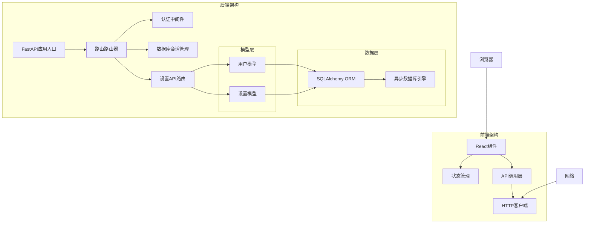
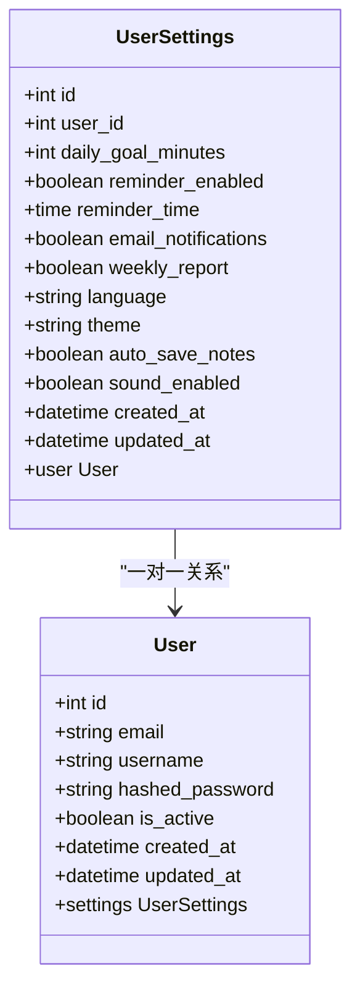
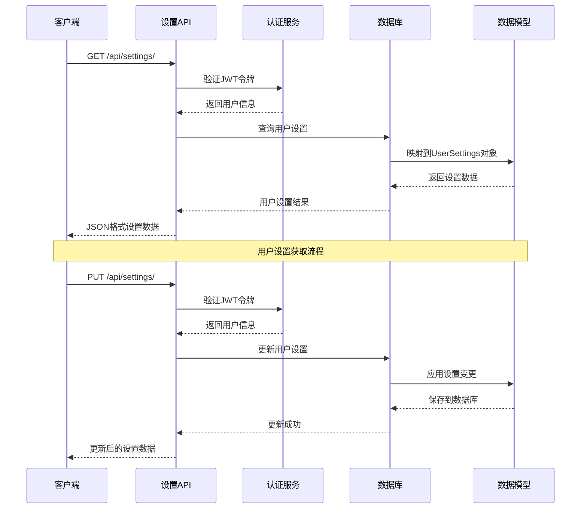
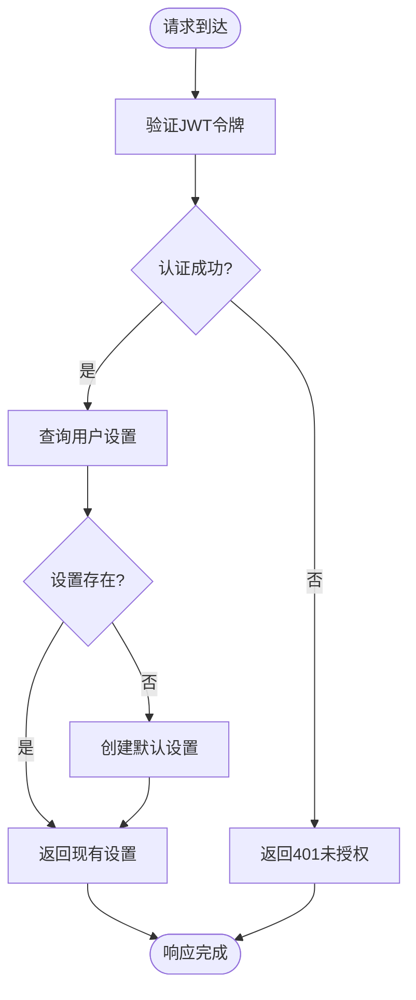
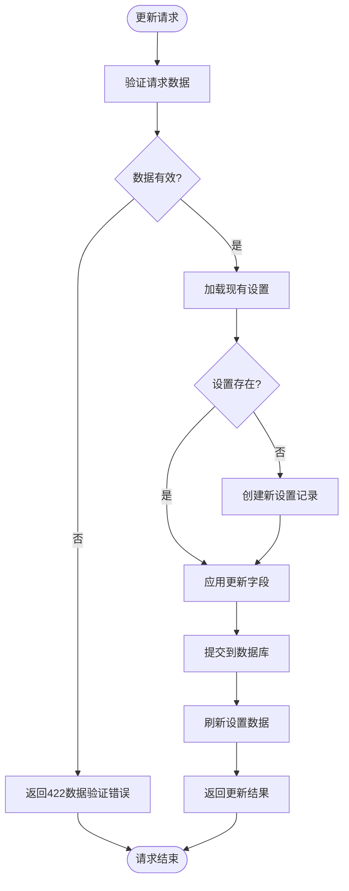
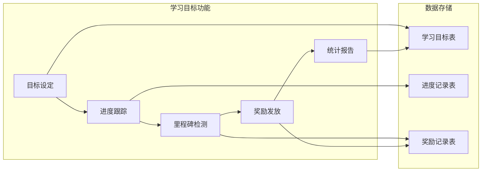
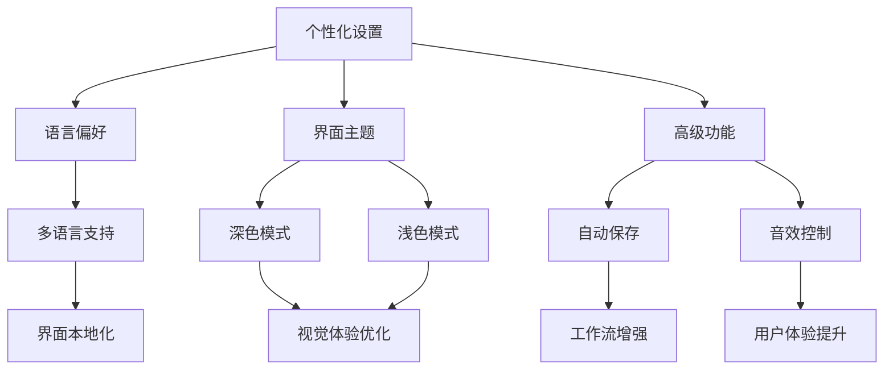
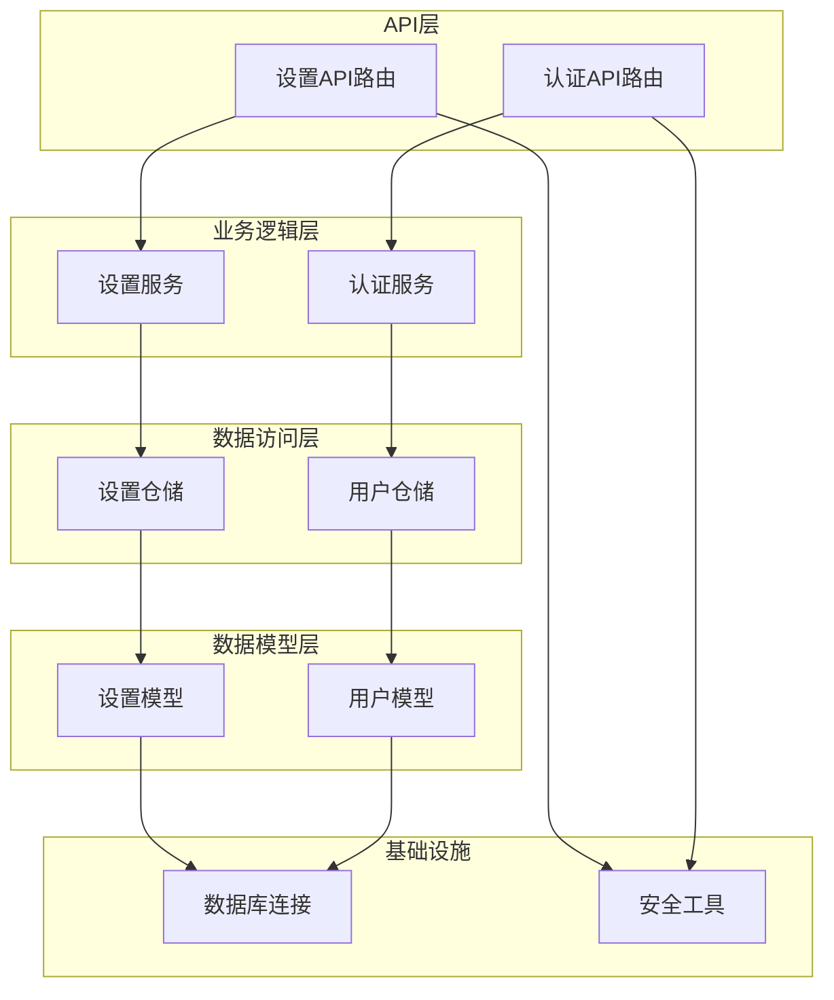

# 用户设置API接口

<cite>
**本文档引用的文件**
- [settings.py](file://backend/app/api/settings.py)
- [settings.py](file://backend/app/models/settings.py)
- [settings.py](file://backend/app/schemas/settings.py)
- [main.py](file://backend/app/main.py)
- [security.py](file://backend/app/core/security.py)
- [database.py](file://backend/app/core/database.py)
- [user.py](file://backend/app/models/user.py)
- [SettingsPage.tsx](file://front/src/components/SettingsPage.tsx)
</cite>

## 目录
1. [简介](#简介)
2. [项目结构](#项目结构)
3. [核心组件](#核心组件)
4. [架构概览](#架构概览)
5. [详细组件分析](#详细组件分析)
6. [依赖关系分析](#依赖关系分析)
7. [性能考虑](#性能考虑)
8. [故障排除指南](#故障排除指南)
9. [结论](#结论)

## 简介

Quickly平台的用户设置API接口提供了完整的用户偏好配置管理功能。该系统支持用户偏好的查询与更新、学习目标设定、通知配置以及界面个性化设置。通过RESTful API设计，用户可以轻松管理自己的学习环境配置。

## 项目结构

Quickly项目采用前后端分离架构，后端使用FastAPI框架构建RESTful API，前端使用React技术栈开发用户界面。

**图表来源**
- [main.py:26-49](file://backend/app/main.py#L26-L49)
- [settings.py:1-65](file://backend/app/api/settings.py#L1-L65)

**章节来源**
- [main.py:1-66](file://backend/app/main.py#L1-L66)
- [settings.py:1-65](file://backend/app/api/settings.py#L1-L65)

## 核心组件

### 设置API路由

设置API模块提供了三个主要接口：
- GET `/api/settings/` - 获取用户设置
- PUT `/api/settings/` - 更新用户设置
- GET `/api/settings/learning-goals` - 学习目标设置（当前未实现）
- GET `/api/settings/personalize` - 个性化设置（当前未实现）

### 数据模型架构

用户设置系统基于以下核心数据模型：

**图表来源**
- [user.py:11-39](file://backend/app/models/user.py#L11-L39)
- [settings.py:11-41](file://backend/app/models/settings.py#L11-L41)

### 验证和序列化

系统使用Pydantic进行数据验证和序列化，确保数据完整性和类型安全。

**章节来源**
- [settings.py:1-65](file://backend/app/api/settings.py#L1-L65)
- [settings.py:1-50](file://backend/app/schemas/settings.py#L1-L50)
- [settings.py:1-41](file://backend/app/models/settings.py#L1-L41)

## 架构概览

Quickly的设置API采用分层架构设计，确保了良好的可维护性和扩展性。

**图表来源**
- [settings.py:19-64](file://backend/app/api/settings.py#L19-L64)
- [security.py:54-79](file://backend/app/core/security.py#L54-L79)

## 详细组件分析

### 设置获取接口

#### 接口规范

**端点**: `GET /api/settings/`

**功能**: 获取当前用户的完整设置配置

**认证要求**: 需要有效的JWT访问令牌

**响应格式**: JSON对象，包含所有用户设置字段

#### 数据流分析

**图表来源**
- [settings.py:19-37](file://backend/app/api/settings.py#L19-L37)

#### 默认值处理

系统在用户首次访问时自动创建默认设置，确保新用户有完整的配置基础。

**章节来源**
- [settings.py:19-37](file://backend/app/api/settings.py#L19-L37)
- [settings.py:17-37](file://backend/app/models/settings.py#L17-L37)

### 设置更新接口

#### 接口规范

**端点**: `PUT /api/settings/`

**功能**: 更新用户的部分或全部设置配置

**认证要求**: 需要有效的JWT访问令牌

**请求格式**: JSON对象，包含要更新的设置字段

**响应格式**: 更新后的完整设置对象

#### 更新逻辑分析

**图表来源**
- [settings.py:40-64](file://backend/app/api/settings.py#L40-L64)

#### 数据验证规则

系统实现了严格的字段验证规则：

| 字段名 | 类型 | 默认值 | 验证规则 | 描述 |
|--------|------|--------|----------|------|
| daily_goal_minutes | 整数 | 30 | 15-120分钟 | 每日学习目标时长 |
| reminder_enabled | 布尔值 | true | 无限制 | 是否启用学习提醒 |
| reminder_time | 时间 | null | 24小时制 | 每日提醒时间 |
| email_notifications | 布尔值 | true | 无限制 | 是否接收邮件通知 |
| weekly_report | 布尔值 | true | 无限制 | 是否接收周报 |
| language | 字符串 | zh-CN | 枚举值 | 界面语言设置 |
| theme | 字符串 | dark | 枚举值 | 界面主题设置 |
| auto_save_notes | 布尔值 | true | 无限制 | 是否自动保存笔记 |
| sound_enabled | 布尔值 | true | 无限制 | 是否启用音效 |

**章节来源**
- [settings.py:28-39](file://backend/app/schemas/settings.py#L28-L39)
- [settings.py:17-37](file://backend/app/models/settings.py#L17-L37)

### 学习目标设置接口

#### 当前状态

学习目标设置接口目前处于待实现状态。根据前端组件显示，系统计划支持以下功能：

- 设定每日学习时长目标（15-120分钟）
- 进度监控和可视化展示
- 完成奖励机制
- 周目标统计和分析

#### 预期实现架构

**章节来源**
- [SettingsPage.tsx:117-151](file://front/src/components/SettingsPage.tsx#L117-L151)

### 个性化设置接口

#### 当前状态

个性化设置接口同样处于待实现状态。前端组件显示了以下个性化选项：

- 语言设置：支持简体中文、英语、日语、韩语
- 主题设置：深色模式和浅色模式
- 高级设置：自动保存笔记、音效反馈等

#### 预期功能特性

**章节来源**
- [SettingsPage.tsx:243-265](file://front/src/components/SettingsPage.tsx#L243-L265)
- [SettingsPage.tsx:285-315](file://front/src/components/SettingsPage.tsx#L285-L315)
- [SettingsPage.tsx:335-373](file://front/src/components/SettingsPage.tsx#L335-L373)

## 依赖关系分析

### 组件依赖图

**图表来源**
- [settings.py:1-65](file://backend/app/api/settings.py#L1-L65)
- [security.py:54-79](file://backend/app/core/security.py#L54-L79)
- [database.py:39-45](file://backend/app/core/database.py#L39-L45)

### 外部依赖

系统依赖以下关键外部库：

- **FastAPI**: Web框架，提供异步API服务
- **SQLAlchemy**: ORM框架，处理数据库操作
- **Pydantic**: 数据验证和序列化
- **Passlib**: 密码哈希处理
- **python-jose**: JWT令牌处理

**章节来源**
- [main.py:6-12](file://backend/app/main.py#L6-L12)
- [security.py:7-16](file://backend/app/core/security.py#L7-L16)

## 性能考虑

### 数据库优化

1. **连接池管理**: 使用异步连接池提高并发性能
2. **索引优化**: 在用户ID上建立索引以加速查询
3. **批量操作**: 支持部分字段更新减少数据库负载

### 缓存策略

建议实现以下缓存机制：
- 用户设置缓存：减少重复查询
- JWT令牌验证缓存：降低认证开销
- 配置模板缓存：加速默认设置生成

### 异步处理

系统已采用异步编程模式：
- 异步数据库操作避免阻塞
- 异步文件I/O处理
- 异步任务队列支持后台处理

## 故障排除指南

### 常见问题及解决方案

#### 认证失败

**症状**: 返回401未授权错误
**原因**: JWT令牌无效或过期
**解决**: 重新登录获取新令牌

#### 数据验证错误

**症状**: 返回422数据验证错误
**原因**: 请求数据不符合验证规则
**解决**: 检查字段类型和范围限制

#### 数据库连接问题

**症状**: 数据库操作超时或失败
**原因**: 连接池耗尽或数据库不可用
**解决**: 检查数据库连接配置和服务器状态

#### 权限不足

**症状**: 访问被拒绝
**原因**: 用户无权访问其他用户的设置
**解决**: 确保操作当前认证用户的设置

**章节来源**
- [security.py:59-78](file://backend/app/core/security.py#L59-L78)
- [settings.py:25-36](file://backend/app/api/settings.py#L25-L36)

## 结论

Quickly的用户设置API接口提供了完整而灵活的用户偏好管理功能。系统采用现代化的技术栈和最佳实践，确保了良好的性能、安全性和可扩展性。

### 已实现功能

- 完整的用户设置查询和更新功能
- 严格的数据验证和类型安全
- 基于JWT的认证机制
- 异步数据库操作支持
- 响应式前端界面集成

### 未来发展方向

1. **学习目标功能**: 实现学习进度跟踪和奖励机制
2. **个性化推荐**: 基于用户行为的学习内容推荐
3. **实时同步**: WebSocket实现实时设置同步
4. **配置导入导出**: 支持用户设置的备份和恢复
5. **多设备同步**: 跨设备的设置同步机制

该系统为Quickly平台的用户管理奠定了坚实的基础，通过持续的功能扩展和完善，将为用户提供更加个性化和高效的学习体验。