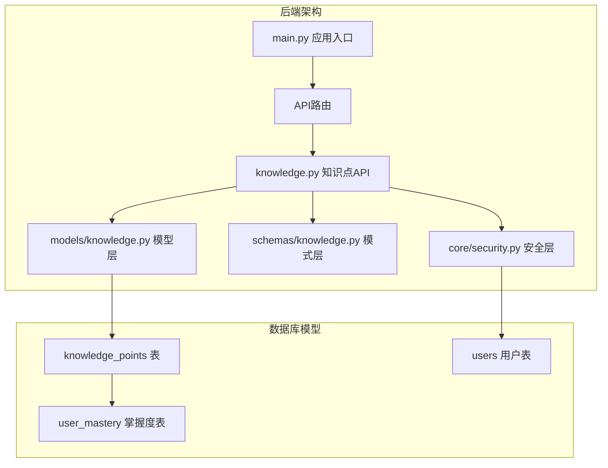
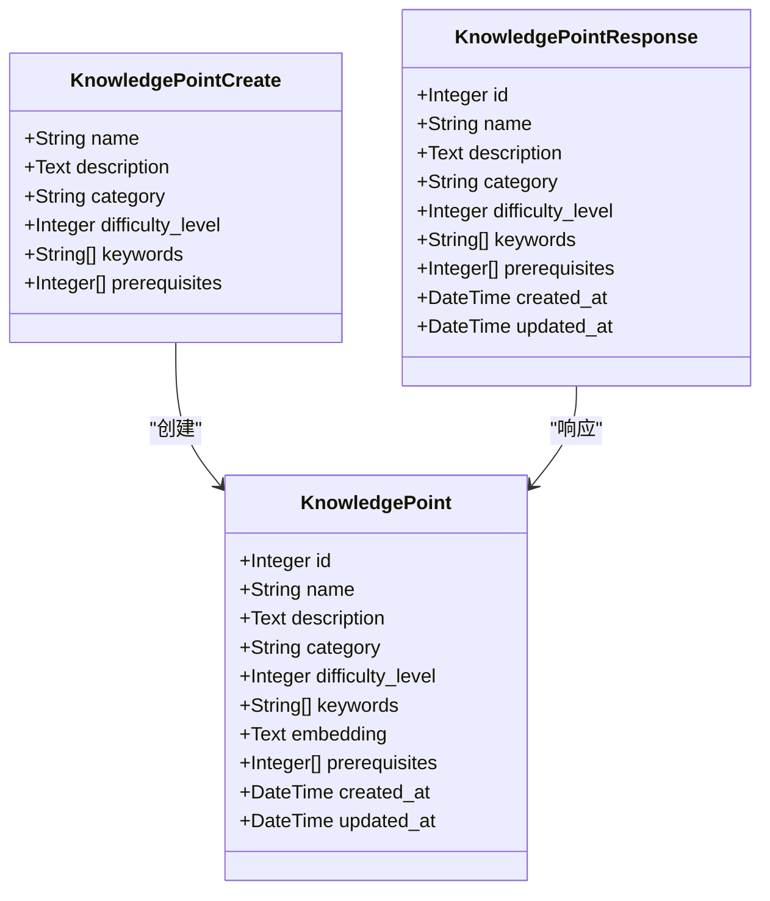
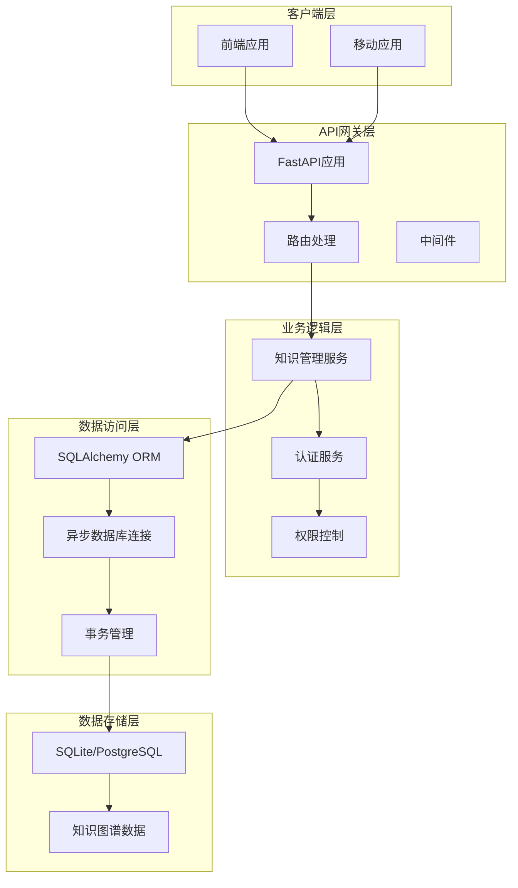
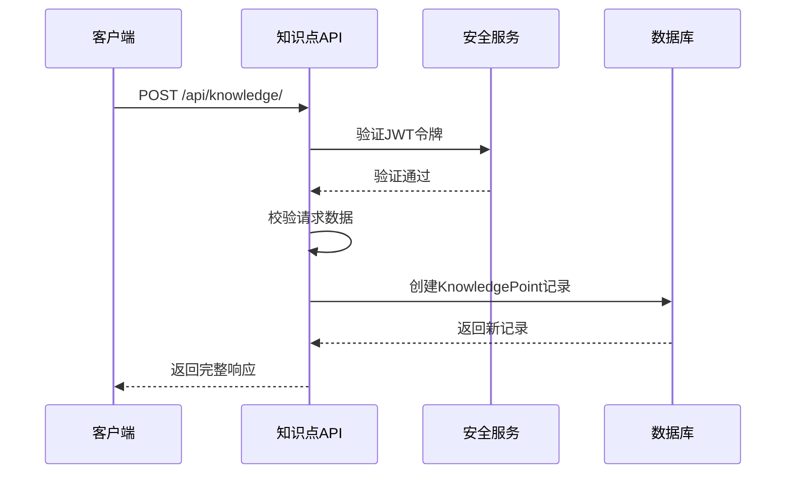
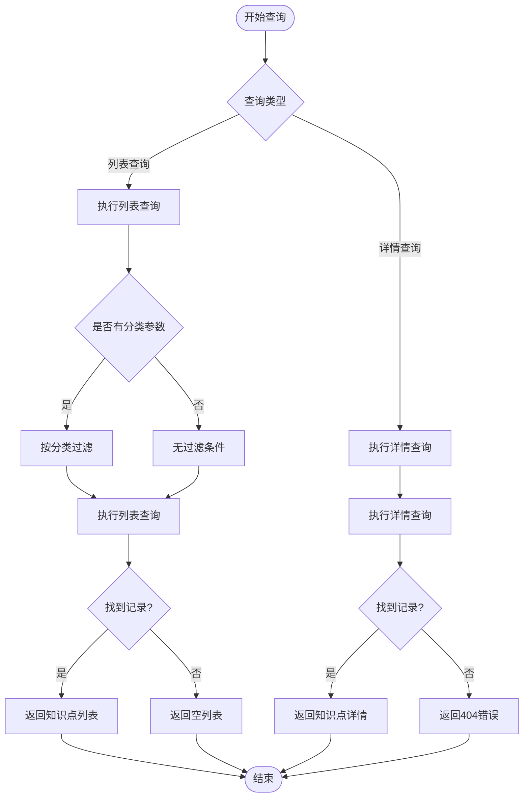
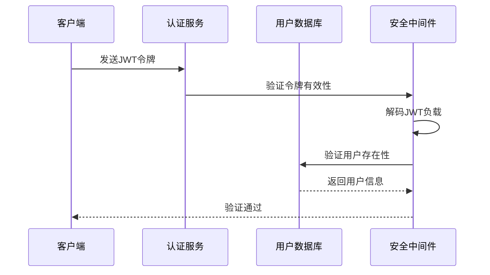
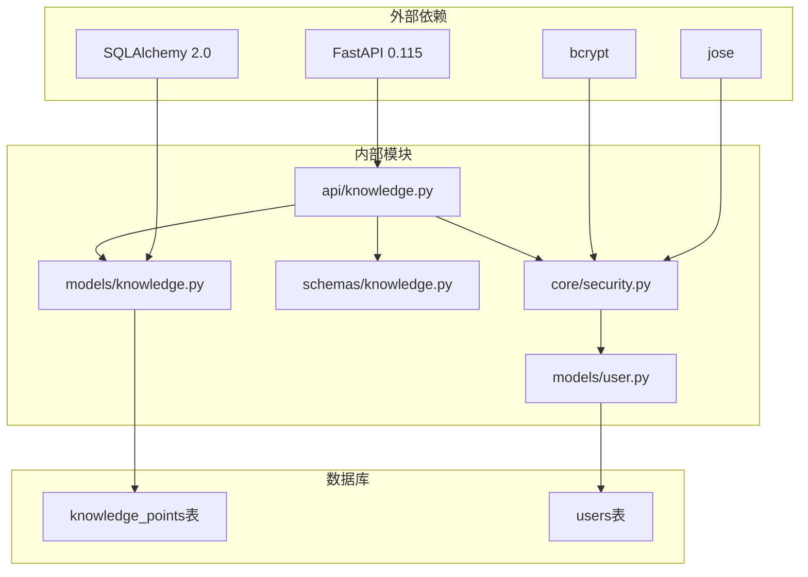
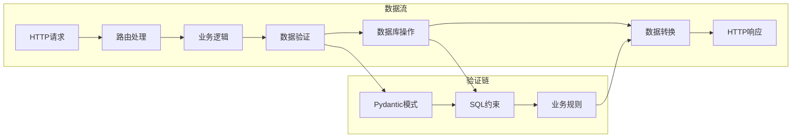

# 知识管理API接口

<cite>
**本文档引用的文件**
- [knowledge.py](file://backend/app/api/knowledge.py)
- [knowledge.py](file://backend/app/models/knowledge.py)
- [knowledge.py](file://backend/app/schemas/knowledge.py)
- [main.py](file://backend/app/main.py)
- [security.py](file://backend/app/core/security.py)
- [user.py](file://backend/app/models/user.py)
- [PROJECT_OVERVIEW.md](file://PROJECT_OVERVIEW.md)
</cite>

## 目录
1. [简介](#简介)
2. [项目结构](#项目结构)
3. [核心组件](#核心组件)
4. [架构概览](#架构概览)
5. [详细组件分析](#详细组件分析)
6. [依赖关系分析](#依赖关系分析)
7. [性能考虑](#性能考虑)
8. [故障排除指南](#故障排除指南)
9. [结论](#结论)

## 简介

Quickly知识管理API接口是Quickly AI学习平台的核心功能模块，负责管理学习过程中的知识点创建、查询、更新和删除操作。该系统基于FastAPI框架构建，采用异步数据库连接和JWT认证机制，为前端应用提供完整的RESTful API服务。

本系统特别关注知识图谱构建、关联关系建立和智能搜索功能，通过JSON字段存储关键词和前置知识关系，为后续的知识图谱扩展奠定基础。

## 项目结构

后端采用标准的FastAPI项目结构，知识管理功能位于`backend/app/api/knowledge.py`文件中，配合相应的模型和模式定义。



**图表来源**
- [main.py:46](file://backend/app/main.py#L46)
- [knowledge.py:10](file://backend/app/api/knowledge.py#L10)
- [knowledge.py:13](file://backend/app/api/knowledge.py#L13)

**章节来源**
- [main.py:10-49](file://backend/app/main.py#L10-L49)
- [PROJECT_OVERVIEW.md:25-57](file://PROJECT_OVERVIEW.md#L25-L57)

## 核心组件

### 知识点模型 (KnowledgePoint)

知识知识点模型定义了学习概念的核心属性，包括内容信息、元数据和关系字段。



**图表来源**
- [knowledge.py:10](file://backend/app/models/knowledge.py#L10-L31)
- [knowledge.py:17](file://backend/app/schemas/knowledge.py#L17-L34)

### API路由结构

系统提供了完整的RESTful API接口，支持知识点的CRUD操作：

- **GET /api/knowledge/** - 获取所有知识点（支持分类过滤）
- **GET /api/knowledge/{id}** - 获取特定知识点详情
- **POST /api/knowledge/** - 创建新知识点
- **PUT /api/knowledge/{id}** - 更新知识点（当前未实现）
- **DELETE /api/knowledge/{id}** - 删除知识点（当前未实现）

**章节来源**
- [knowledge.py:20](file://backend/app/api/knowledge.py#L20-L68)
- [knowledge.py:10](file://backend/app/models/knowledge.py#L10-L31)

## 架构概览

系统采用分层架构设计，确保关注点分离和代码可维护性。



**图表来源**
- [main.py:26](file://backend/app/main.py#L26-L49)
- [security.py:54](file://backend/app/core/security.py#L54-L79)

## 详细组件分析

### 知识点创建接口

#### 接口定义
- **URL**: `POST /api/knowledge/`
- **认证**: 需要JWT令牌
- **权限**: 生产环境中为管理员专用
- **请求体**: KnowledgePointCreate模式

#### 请求参数详解

| 参数 | 类型 | 必填 | 描述 | 默认值 |
|------|------|------|------|--------|
| name | string | 是 | 知识点名称 | - |
| description | string | 否 | 知识点描述 | null |
| category | string | 否 | 知识点分类 | null |
| difficulty_level | integer | 否 | 难度级别 1-5 | 1 |
| keywords | array[string] | 否 | 关键词数组 | [] |
| prerequisites | array[integer] | 否 | 前置知识ID数组 | [] |

#### 响应结构

成功响应返回完整的KnowledgePointResponse对象：

```json
{
  "id": 1,
  "name": "机器学习基础",
  "description": "机器学习的核心概念和原理",
  "category": "机器学习",
  "difficulty_level": 3,
  "keywords": ["ML", "algorithm", "model"],
  "prerequisites": [2, 3],
  "created_at": "2024-01-15T10:30:00Z",
  "updated_at": "2024-01-15T10:30:00Z"
}
```

#### 实现流程



**图表来源**
- [knowledge.py:50](file://backend/app/api/knowledge.py#L50-L68)
- [security.py:54](file://backend/app/core/security.py#L54-L79)

**章节来源**
- [knowledge.py:50](file://backend/app/api/knowledge.py#L50-L68)
- [knowledge.py:17](file://backend/app/schemas/knowledge.py#L17-L21)

### 知识点查询接口

#### 列表查询接口
- **URL**: `GET /api/knowledge/`
- **查询参数**: 
  - `category` (可选): 按分类过滤
- **响应**: 知识点对象数组

#### 详情查询接口
- **URL**: `GET /api/knowledge/{id}`
- **路径参数**: `id` - 知识点ID
- **响应**: 单个知识点对象

#### 查询流程



**图表来源**
- [knowledge.py:20](file://backend/app/api/knowledge.py#L20-L47)

**章节来源**
- [knowledge.py:20](file://backend/app/api/knowledge.py#L20-L47)

### 权限控制机制

系统采用JWT令牌进行身份验证和授权控制：



**图表来源**
- [security.py:54](file://backend/app/core/security.py#L54-L79)

**章节来源**
- [security.py:54](file://backend/app/core/security.py#L54-L79)
- [user.py:11](file://backend/app/models/user.py#L11-L39)

## 依赖关系分析

### 组件依赖图



**图表来源**
- [knowledge.py:5](file://backend/app/api/knowledge.py#L5-L14)
- [security.py:7](file://backend/app/core/security.py#L7-L16)

### 数据流分析

系统遵循标准的MVC架构模式，数据在各层之间清晰传递：



**章节来源**
- [knowledge.py:17](file://backend/app/schemas/knowledge.py#L17-L34)
- [knowledge.py:10](file://backend/app/models/knowledge.py#L10-L31)

## 性能考虑

### 数据库优化策略

1. **索引优化**: 
   - 主键索引用于快速查找
   - 唯一索引确保知识点名称唯一性
   - 分类字段索引支持高效过滤

2. **查询优化**:
   - 使用异步数据库连接减少阻塞
   - 条件查询避免全表扫描
   - 结果集缓存减少重复查询

3. **内存管理**:
   - 异步操作避免线程阻塞
   - 连接池管理数据库连接
   - 及时释放数据库会话

### 缓存策略

系统具备良好的缓存扩展潜力，可通过以下方式实现：

- **查询结果缓存**: 对常用查询结果进行缓存
- **嵌入向量缓存**: 存储向量嵌入以支持相似度搜索
- **会话缓存**: 缓存用户会话信息

## 故障排除指南

### 常见错误及解决方案

| 错误类型 | 状态码 | 描述 | 解决方案 |
|----------|--------|------|----------|
| 认证失败 | 401 | JWT令牌无效或过期 | 重新登录获取新令牌 |
| 权限不足 | 403 | 用户无操作权限 | 检查用户角色和权限 |
| 资源不存在 | 404 | 知识点ID不存在 | 验证知识点ID是否正确 |
| 数据验证错误 | 422 | 请求数据格式不正确 | 检查请求体格式和字段类型 |
| 内部服务器错误 | 500 | 服务器处理异常 | 查看服务器日志和数据库连接 |

### 调试建议

1. **启用调试模式**: 在开发环境中启用详细错误信息
2. **检查数据库连接**: 确保数据库服务正常运行
3. **验证JWT配置**: 检查密钥和算法配置
4. **监控API调用**: 使用API测试工具验证接口行为

**章节来源**
- [knowledge.py:45](file://backend/app/api/knowledge.py#L45-L46)

## 结论

Quickly知识管理API接口提供了完整的学习知识点管理功能，具有以下特点：

1. **完整的CRUD支持**: 支持知识点的创建、查询、更新和删除操作
2. **灵活的查询机制**: 支持按分类过滤和详情查询
3. **强大的数据模型**: 通过JSON字段支持关键词和前置关系管理
4. **安全的权限控制**: 基于JWT的认证和授权机制
5. **可扩展的架构**: 为知识图谱和智能搜索功能预留扩展空间

系统目前处于MVP阶段，后续开发计划包括引入机器学习模型、建立知识依赖关系图、实现SM-2复习算法和添加知识图谱支持。这些功能将大大增强系统的智能化水平和用户体验。