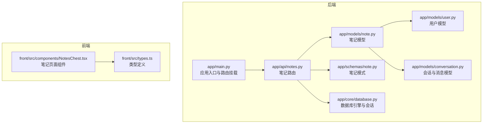
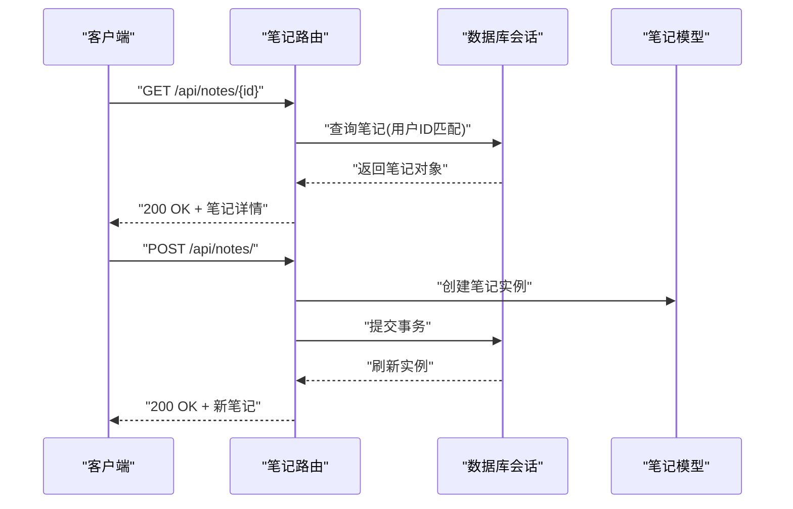
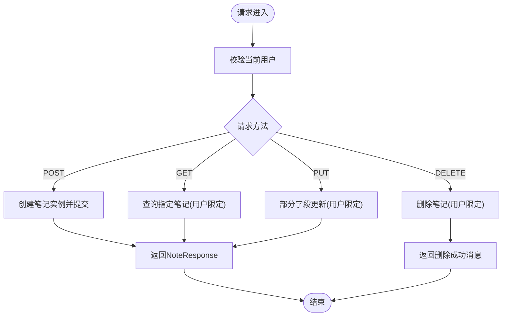
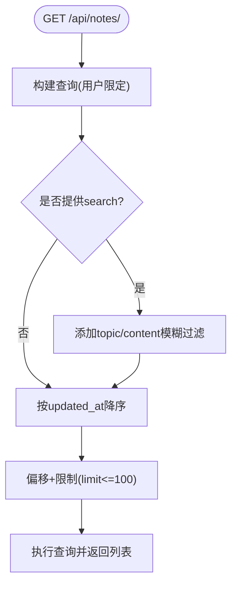
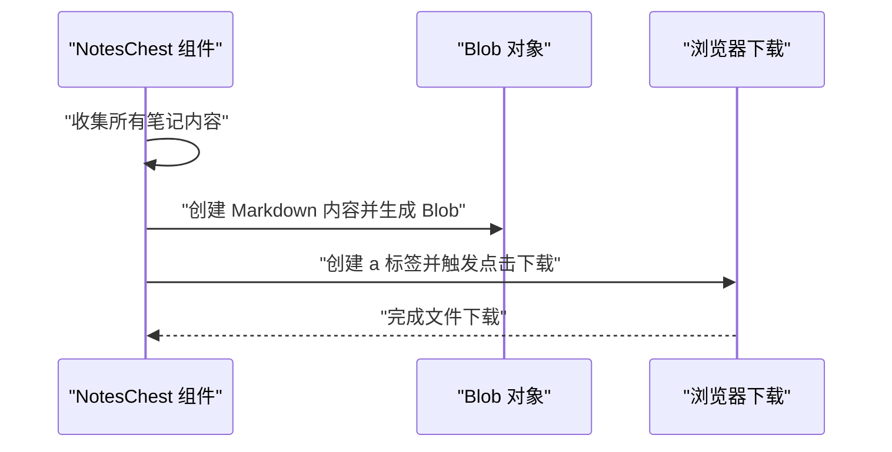
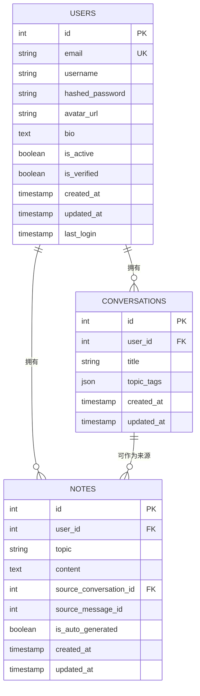
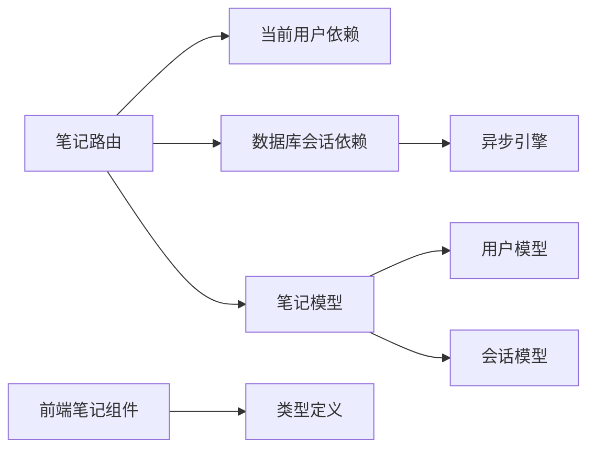

# 笔记API接口

<cite>
**本文档引用的文件**
- [backend/app/api/notes.py](file://backend/app/api/notes.py)
- [backend/app/models/note.py](file://backend/app/models/note.py)
- [backend/app/schemas/note.py](file://backend/app/schemas/note.py)
- [backend/app/main.py](file://backend/app/main.py)
- [backend/app/models/conversation.py](file://backend/app/models/conversation.py)
- [backend/app/models/user.py](file://backend/app/models/user.py)
- [backend/app/core/database.py](file://backend/app/core/database.py)
- [PROJECT_OVERVIEW.md](file://PROJECT_OVERVIEW.md)
- [front/src/components/NotesChest.tsx](file://front/src/components/NotesChest.tsx)
- [front/src/types.ts](file://front/src/types.ts)
</cite>

## 目录
1. [简介](#简介)
2. [项目结构](#项目结构)
3. [核心组件](#核心组件)
4. [架构总览](#架构总览)
5. [详细组件分析](#详细组件分析)
6. [依赖关系分析](#依赖关系分析)
7. [性能考虑](#性能考虑)
8. [故障排除指南](#故障排除指南)
9. [结论](#结论)
10. [附录](#附录)

## 简介
本文件为 QuickLearn 笔记系统的 RESTful API 接口文档，重点覆盖笔记的 CRUD 操作、搜索与列表查询、Markdown 导出、富文本编辑器集成、附件上传与版本控制等能力。根据现有代码，笔记 API 提供了基础的增删改查与全文检索能力，并通过前端组件实现了 Markdown 导出与本地编辑体验。

## 项目结构
后端采用 FastAPI + SQLAlchemy 2.0 异步 ORM 的架构，笔记 API 路由位于 `/api/notes`，并按模块化组织：路由层（API）、模型层（Models）、模式层（Schemas）、核心配置（Core）与入口（Main）。前端使用 React + TypeScript，笔记页面组件负责搜索、编辑与导出。

**图表来源**
- [backend/app/main.py:42-49](file://backend/app/main.py#L42-L49)
- [backend/app/api/notes.py:17-133](file://backend/app/api/notes.py#L17-L133)
- [backend/app/models/note.py:11-35](file://backend/app/models/note.py#L11-L35)
- [backend/app/schemas/note.py:10-40](file://backend/app/schemas/note.py#L10-L40)
- [backend/app/core/database.py:39-46](file://backend/app/core/database.py#L39-L46)
- [backend/app/models/user.py:11-39](file://backend/app/models/user.py#L11-L39)
- [backend/app/models/conversation.py:11-54](file://backend/app/models/conversation.py#L11-L54)
- [front/src/components/NotesChest.tsx:1-181](file://front/src/components/NotesChest.tsx#L1-L181)
- [front/src/types.ts:16-21](file://front/src/types.ts#L16-L21)

**章节来源**
- [backend/app/main.py:42-49](file://backend/app/main.py#L42-L49)
- [PROJECT_OVERVIEW.md:25-58](file://PROJECT_OVERVIEW.md#L25-L58)

## 核心组件
- 笔记路由模块：提供笔记的列表查询、单条查询、创建、更新、删除接口。
- 笔记模型：定义笔记字段、外键关系与时间戳。
- 笔记模式：定义创建、更新、响应的数据结构。
- 数据库会话：异步数据库引擎与依赖注入。
- 前端笔记组件：提供搜索、编辑、Markdown 导出等交互。

**章节来源**
- [backend/app/api/notes.py:17-133](file://backend/app/api/notes.py#L17-L133)
- [backend/app/models/note.py:11-35](file://backend/app/models/note.py#L11-L35)
- [backend/app/schemas/note.py:10-40](file://backend/app/schemas/note.py#L10-L40)
- [backend/app/core/database.py:39-46](file://backend/app/core/database.py#L39-L46)
- [front/src/components/NotesChest.tsx:13-50](file://front/src/components/NotesChest.tsx#L13-L50)

## 架构总览
笔记 API 的调用流程遵循 FastAPI 的依赖注入与 SQLAlchemy 异步会话模式。认证中间件确保每个请求绑定当前用户；路由层校验用户权限并执行数据库操作；模型层映射到数据库表；模式层负责请求/响应的数据验证与序列化。

**图表来源**
- [backend/app/api/notes.py:45-133](file://backend/app/api/notes.py#L45-L133)
- [backend/app/core/database.py:39-46](file://backend/app/core/database.py#L39-L46)
- [backend/app/models/note.py:11-35](file://backend/app/models/note.py#L11-L35)

## 详细组件分析

### 笔记CRUD接口
- 创建笔记
  - 方法与路径：POST /api/notes/
  - 请求体：NoteCreate（topic、content、source_conversation_id、source_message_id、is_auto_generated）
  - 响应：NoteResponse（包含 id、user_id、created_at、updated_at 等）
  - 行为：基于当前用户创建新笔记，自动设置时间戳
- 获取笔记
  - 方法与路径：GET /api/notes/{id}
  - 参数：路径参数 note_id
  - 响应：NoteResponse
  - 行为：仅返回属于当前用户的笔记，否则返回 404
- 更新笔记
  - 方法与路径：PUT /api/notes/{id}
  - 请求体：NoteUpdate（可选字段 topic、content）
  - 响应：NoteResponse
  - 行为：部分字段更新，仅当笔记属于当前用户时生效
- 删除笔记
  - 方法与路径：DELETE /api/notes/{id}
  - 响应：{"message": "Note deleted successfully"}
  - 行为：删除属于当前用户的笔记

**图表来源**
- [backend/app/api/notes.py:64-133](file://backend/app/api/notes.py#L64-L133)
- [backend/app/schemas/note.py:16-39](file://backend/app/schemas/note.py#L16-L39)

**章节来源**
- [backend/app/api/notes.py:64-133](file://backend/app/api/notes.py#L64-L133)
- [backend/app/schemas/note.py:16-39](file://backend/app/schemas/note.py#L16-L39)

### 列表查询与搜索
- 列表接口
  - 方法与路径：GET /api/notes/
  - 查询参数：
    - search：在 topic 或 content 中进行模糊匹配
    - skip：跳过记录数（>=0）
    - limit：每页数量（>=1 且 <=100）
  - 响应：NoteResponse 数组
  - 行为：按 updated_at 降序排列，仅返回当前用户笔记
- 搜索行为
  - 支持全文搜索：对 topic 与 content 执行不区分大小写的模糊匹配
  - 排序：默认按更新时间倒序
  - 分页：通过 skip/limit 控制

**图表来源**
- [backend/app/api/notes.py:20-42](file://backend/app/api/notes.py#L20-L42)

**章节来源**
- [backend/app/api/notes.py:20-42](file://backend/app/api/notes.py#L20-L42)

### Markdown 导出与前端集成
- 前端导出逻辑
  - 组件：NotesChest.tsx
  - 功能：遍历笔记列表，拼接 Markdown 内容，生成 Blob 并触发浏览器下载
  - 文件名：Quickly_AI_ML_Notes_{YYYY-MM-DD}.md
- 导出内容格式
  - 每条笔记以标题（topic + 时间戳）开头，正文为内容，段落间以分隔线分隔
- 富文本编辑器集成
  - 前端提供编辑态切换与保存按钮，编辑内容通过 onUpdate 回调更新
  - 编辑区域为 textarea，支持多行输入与换行保留

**图表来源**
- [front/src/components/NotesChest.tsx:34-50](file://front/src/components/NotesChest.tsx#L34-L50)

**章节来源**
- [front/src/components/NotesChest.tsx:34-50](file://front/src/components/NotesChest.tsx#L34-L50)
- [front/src/types.ts:16-21](file://front/src/types.ts#L16-L21)

### 数据模型与关系
- 笔记模型（Note）
  - 字段：id、user_id、topic、content、source_conversation_id、source_message_id、is_auto_generated、created_at、updated_at
  - 关系：属于一个用户；可关联一次会话（用于来源追踪）
- 用户模型（User）
  - 字段：id、email、username、hashed_password、头像、个人简介、状态与时间戳
  - 关系：拥有多个笔记与会话
- 会话与消息模型（Conversation/Message）
  - 会话包含话题标签与时间戳
  - 消息包含发送者、文本、AI响应元数据（如知识点标签、自动生成笔记内容）

**图表来源**
- [backend/app/models/note.py:11-35](file://backend/app/models/note.py#L11-L35)
- [backend/app/models/user.py:11-39](file://backend/app/models/user.py#L11-L39)
- [backend/app/models/conversation.py:11-54](file://backend/app/models/conversation.py#L11-L54)

**章节来源**
- [backend/app/models/note.py:11-35](file://backend/app/models/note.py#L11-L35)
- [backend/app/models/user.py:11-39](file://backend/app/models/user.py#L11-L39)
- [backend/app/models/conversation.py:11-54](file://backend/app/models/conversation.py#L11-L54)

### 版本控制与数据同步策略
- 版本控制
  - 后端未实现独立的版本表或版本号字段；当前模型包含 created_at 与 updated_at，可用于记录变更时间
  - 如需细粒度版本管理，可在 Note 模型中新增版本号与版本内容字段，并建立版本历史表
- 数据同步
  - 前端 NotesChest 组件维护本地状态（搜索词、编辑态），与后端通过 API 交互
  - 建议在前端引入增量同步策略：基于 updated_at 时间戳拉取增量笔记，减少网络开销

**章节来源**
- [backend/app/models/note.py:29-31](file://backend/app/models/note.py#L29-L31)
- [front/src/components/NotesChest.tsx:14-32](file://front/src/components/NotesChest.tsx#L14-L32)

## 依赖关系分析
- 路由依赖
  - 笔记路由依赖当前用户上下文与数据库会话
  - 数据库会话通过异步工厂创建与关闭
- 模型依赖
  - 笔记模型依赖用户模型与会话模型的关系
- 前端依赖
  - 笔记页面组件依赖类型定义 NoteItem

**图表来源**
- [backend/app/api/notes.py:10-14](file://backend/app/api/notes.py#L10-L14)
- [backend/app/core/database.py:39-46](file://backend/app/core/database.py#L39-L46)
- [backend/app/models/note.py:34-35](file://backend/app/models/note.py#L34-L35)
- [backend/app/models/user.py:34-39](file://backend/app/models/user.py#L34-L39)
- [backend/app/models/conversation.py:28-30](file://backend/app/models/conversation.py#L28-L30)
- [front/src/components/NotesChest.tsx:1-11](file://front/src/components/NotesChest.tsx#L1-L11)
- [front/src/types.ts:16-21](file://front/src/types.ts#L16-L21)

**章节来源**
- [backend/app/api/notes.py:10-14](file://backend/app/api/notes.py#L10-L14)
- [backend/app/core/database.py:39-46](file://backend/app/core/database.py#L39-L46)
- [backend/app/models/note.py:34-35](file://backend/app/models/note.py#L34-L35)
- [backend/app/models/user.py:34-39](file://backend/app/models/user.py#L34-L39)
- [backend/app/models/conversation.py:28-30](file://backend/app/models/conversation.py#L28-L30)
- [front/src/components/NotesChest.tsx:1-11](file://front/src/components/NotesChest.tsx#L1-L11)
- [front/src/types.ts:16-21](file://front/src/types.ts#L16-L21)

## 性能考虑
- 查询性能
  - 使用索引字段（如 user_id、updated_at）进行过滤与排序
  - 搜索使用 ilike 模糊匹配可能影响性能，建议在高频场景下增加全文索引或专用搜索服务
- 分页与限流
  - limit 上限为 100，避免一次性返回过多数据
  - 建议在网关或路由层增加速率限制，防止滥用
- 数据库连接
  - 异步引擎与会话池配置已针对不同数据库方言做了适配，SQLite 与 PostgreSQL 在连接参数上有所区别

**章节来源**
- [backend/app/api/notes.py:23-24](file://backend/app/api/notes.py#L23-L24)
- [backend/app/core/database.py:16-30](file://backend/app/core/database.py#L16-L30)

## 故障排除指南
- 404 未找到
  - 场景：访问不存在的笔记或删除不存在的笔记
  - 处理：检查 note_id 是否正确，确认笔记确实属于当前用户
- 权限错误
  - 场景：跨用户访问笔记
  - 处理：确保认证有效，请求携带正确的用户上下文
- 数据库异常
  - 场景：并发写入冲突或连接超时
  - 处理：检查数据库连接池配置与网络稳定性；必要时重试或降级

**章节来源**
- [backend/app/api/notes.py:59-60](file://backend/app/api/notes.py#L59-L60)
- [backend/app/api/notes.py:100-101](file://backend/app/api/notes.py#L100-L101)
- [backend/app/api/notes.py:127-128](file://backend/app/api/notes.py#L127-L128)

## 结论
QuickLearn 笔记 API 提供了完整的 CRUD 与搜索能力，配合前端组件实现了 Markdown 导出与本地编辑体验。当前版本未包含标签管理、批量操作与附件上传功能，但具备扩展空间：可在模型中增加标签字段与附件表，并在路由层补充相应接口。版本控制与数据同步可通过时间戳与增量拉取策略逐步完善。

## 附录
- API 基础信息
  - 应用名称：Quickly API
  - 描述：Quickly AI 学习平台后端 API
  - 版本：1.0.0
  - CORS：允许指定来源、方法与头部
- 路由挂载
  - 笔记路由前缀：/api/notes
  - 标签：Notes
- 健康检查
  - GET /api/status：返回在线状态与运行模式

**章节来源**
- [backend/app/main.py:26-31](file://backend/app/main.py#L26-L31)
- [backend/app/main.py:42-49](file://backend/app/main.py#L42-L49)
- [backend/app/main.py:58-65](file://backend/app/main.py#L58-L65)