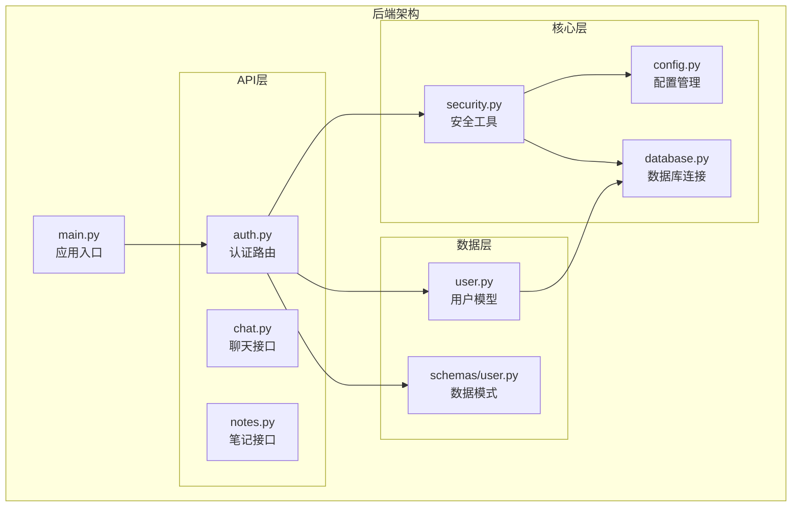
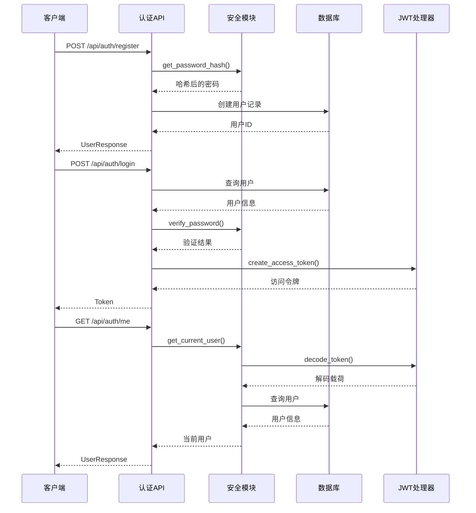
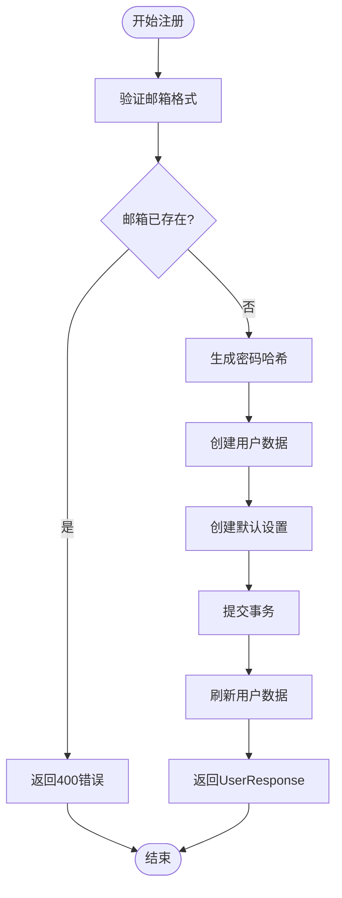
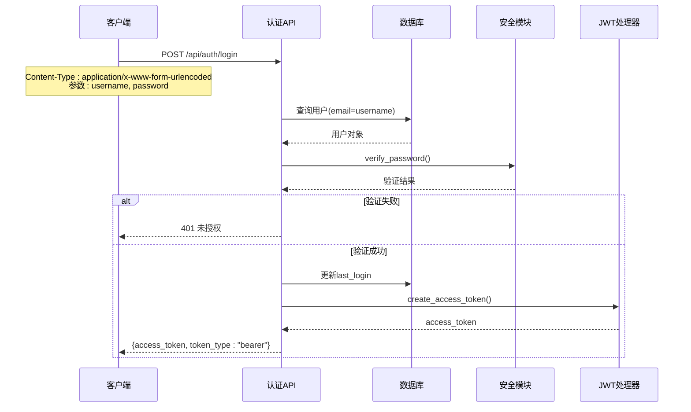
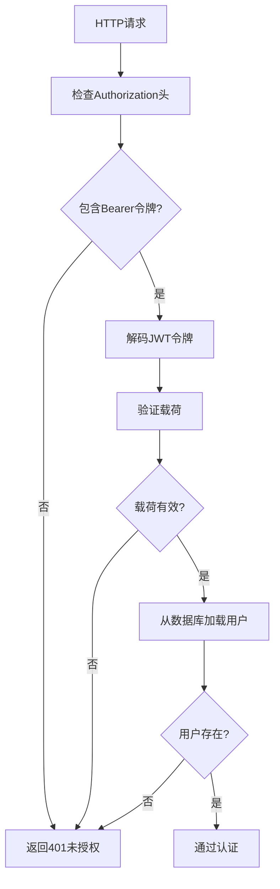
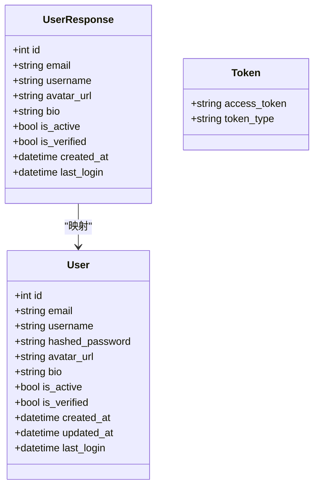
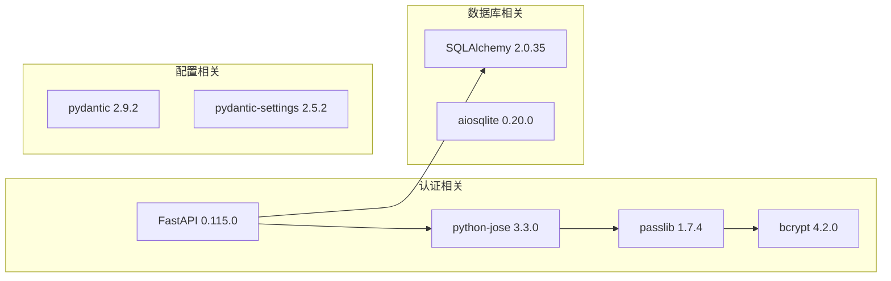
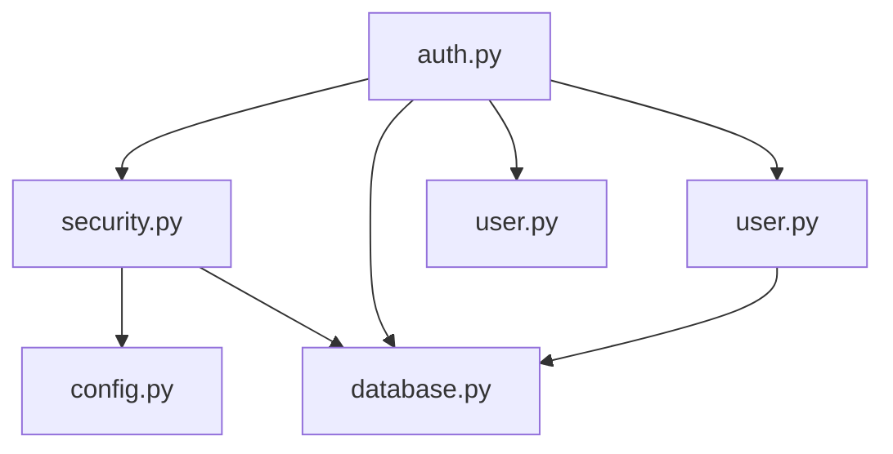

# 认证API接口

<cite>
**本文档引用的文件**
- [backend/app/api/auth.py](file://backend/app/api/auth.py)
- [backend/app/core/security.py](file://backend/app/core/security.py)
- [backend/app/models/user.py](file://backend/app/models/user.py)
- [backend/app/schemas/user.py](file://backend/app/schemas/user.py)
- [backend/app/main.py](file://backend/app/main.py)
- [backend/app/core/config.py](file://backend/app/core/config.py)
- [backend/app/core/database.py](file://backend/app/core/database.py)
- [PROJECT_OVERVIEW.md](file://PROJECT_OVERVIEW.md)
- [backend/requirements.txt](file://backend/requirements.txt)
</cite>

## 目录
1. [简介](#简介)
2. [项目结构](#项目结构)
3. [核心组件](#核心组件)
4. [架构概览](#架构概览)
5. [详细组件分析](#详细组件分析)
6. [依赖分析](#依赖分析)
7. [性能考虑](#性能考虑)
8. [故障排除指南](#故障排除指南)
9. [结论](#结论)

## 简介

Quickly AI 学习平台是一个基于 FastAPI 的现代化学习辅助系统，提供了完整的认证API接口。本项目采用JWT（JSON Web Token）进行身份认证，使用bcrypt进行密码哈希，支持OAuth2密码模式认证流程。认证系统包括用户注册、登录、信息获取和登出等核心功能，为整个学习平台提供安全可靠的身份验证服务。

## 项目结构

后端认证系统采用模块化设计，主要包含以下关键组件：

**图表来源**
- [backend/app/main.py:1-66](file://backend/app/main.py#L1-L66)
- [backend/app/api/auth.py:1-99](file://backend/app/api/auth.py#L1-L99)
- [backend/app/core/security.py:1-80](file://backend/app/core/security.py#L1-L80)

**章节来源**
- [backend/app/main.py:1-66](file://backend/app/main.py#L1-L66)
- [PROJECT_OVERVIEW.md:1-200](file://PROJECT_OVERVIEW.md#L1-L200)

## 核心组件

### 认证路由模块

认证API路由模块位于 `backend/app/api/auth.py`，提供了四个核心认证接口：

- **用户注册** (`POST /api/auth/register`)
- **用户登录** (`POST /api/auth/login`)
- **获取当前用户** (`GET /api/auth/me`)
- **用户登出** (`POST /api/auth/logout`)

每个路由都经过严格的参数验证和错误处理，确保系统的安全性和稳定性。

### 安全工具模块

安全工具模块位于 `backend/app/core/security.py`，实现了以下核心安全功能：

- **密码哈希**：使用bcrypt算法对用户密码进行安全哈希
- **JWT令牌生成**：基于HS256算法创建访问令牌
- **令牌验证**：验证JWT令牌的有效性和完整性
- **用户认证中间件**：提供OAuth2密码模式认证

### 数据模型和模式

用户数据模型和Pydantic模式定义了认证系统中的数据结构：

- **User模型**：数据库用户表结构，包含邮箱、用户名、密码哈希等字段
- **UserCreate模式**：用户注册时的输入验证
- **UserResponse模式**：用户信息的输出格式
- **Token模式**：JWT令牌的响应格式

**章节来源**
- [backend/app/api/auth.py:1-99](file://backend/app/api/auth.py#L1-L99)
- [backend/app/core/security.py:1-80](file://backend/app/core/security.py#L1-L80)
- [backend/app/models/user.py:1-39](file://backend/app/models/user.py#L1-L39)
- [backend/app/schemas/user.py:1-50](file://backend/app/schemas/user.py#L1-L50)

## 架构概览

认证系统采用分层架构设计，确保关注点分离和代码可维护性：

**图表来源**
- [backend/app/api/auth.py:22-99](file://backend/app/api/auth.py#L22-L99)
- [backend/app/core/security.py:23-79](file://backend/app/core/security.py#L23-L79)

## 详细组件分析

### 用户注册接口

#### 接口定义
- **URL**: `POST /api/auth/register`
- **请求体**: `UserCreate` 模式
- **响应体**: `UserResponse` 模式
- **认证要求**: 无需认证

#### 请求参数验证

**图表来源**
- [backend/app/api/auth.py:22-49](file://backend/app/api/auth.py#L22-L49)
- [backend/app/schemas/user.py:16-18](file://backend/app/schemas/user.py#L16-L18)

#### 错误处理

| 错误类型 | HTTP状态码 | 错误详情 | 处理方式 |
|---------|-----------|---------|---------|
| 邮箱重复 | 400 | "Email already registered" | 提示用户更换邮箱 |
| 数据库错误 | 500 | 数据库操作失败 | 检查数据库连接 |
| 参数验证 | 422 | Pydantic验证失败 | 检查请求格式 |

**章节来源**
- [backend/app/api/auth.py:22-49](file://backend/app/api/auth.py#L22-L49)
- [backend/app/schemas/user.py:16-18](file://backend/app/schemas/user.py#L16-L18)

### 用户登录接口

#### OAuth2密码模式认证

登录接口实现了标准的OAuth2密码模式认证流程：

**图表来源**
- [backend/app/api/auth.py:52-86](file://backend/app/api/auth.py#L52-L86)
- [backend/app/core/security.py:33-42](file://backend/app/core/security.py#L33-L42)

#### JWT令牌配置

- **算法**: HS256 (HMAC SHA256)
- **密钥**: 从环境变量读取的随机字符串
- **过期时间**: 7天 (10080分钟)
- **载荷**: 包含用户ID (sub字段)

#### 认证中间件

系统使用FastAPI的OAuth2PasswordBearer中间件自动处理令牌验证：

**图表来源**
- [backend/app/core/security.py:54-79](file://backend/app/core/security.py#L54-L79)

**章节来源**
- [backend/app/api/auth.py:52-86](file://backend/app/api/auth.py#L52-L86)
- [backend/app/core/security.py:54-79](file://backend/app/core/security.py#L54-L79)
- [backend/app/core/config.py:18-21](file://backend/app/core/config.py#L18-L21)

### 用户信息获取接口

#### 接口定义
- **URL**: `GET /api/auth/me`
- **认证要求**: 需要有效的JWT访问令牌
- **响应体**: `UserResponse` 模式

#### 实现细节

该接口使用`get_current_user`依赖注入函数获取当前认证用户：

**图表来源**
- [backend/app/models/user.py:11-39](file://backend/app/models/user.py#L11-L39)
- [backend/app/schemas/user.py:27-39](file://backend/app/schemas/user.py#L27-L39)

**章节来源**
- [backend/app/api/auth.py:89-92](file://backend/app/api/auth.py#L89-L92)
- [backend/app/schemas/user.py:27-39](file://backend/app/schemas/user.py#L27-L39)

### 用户登出接口

#### 接口定义
- **URL**: `POST /api/auth/logout`
- **认证要求**: 需要有效的JWT访问令牌
- **响应体**: 成功消息

#### 实现说明

登出接口采用无状态设计，服务器不维护会话状态。实际的令牌撤销需要客户端在登出时删除本地存储的令牌。

**章节来源**
- [backend/app/api/auth.py:95-98](file://backend/app/api/auth.py#L95-L98)

## 依赖分析

### 外部依赖

认证系统依赖以下关键外部库：

**图表来源**
- [backend/requirements.txt:1-37](file://backend/requirements.txt#L1-L37)

### 内部依赖关系

**图表来源**
- [backend/app/api/auth.py:10-16](file://backend/app/api/auth.py#L10-L16)
- [backend/app/core/security.py:14-16](file://backend/app/core/security.py#L14-L16)

**章节来源**
- [backend/requirements.txt:1-37](file://backend/requirements.txt#L1-L37)
- [backend/app/api/auth.py:10-16](file://backend/app/api/auth.py#L10-L16)
- [backend/app/core/security.py:14-16](file://backend/app/core/security.py#L14-L16)

## 性能考虑

### 数据库优化

- **异步数据库连接**: 使用SQLAlchemy 2.0的异步引擎，提高并发性能
- **连接池配置**: 支持SQLite和PostgreSQL的不同连接池设置
- **事务管理**: 合理的事务边界，避免长时间持有数据库连接

### 缓存策略

- **令牌缓存**: 可选的Redis缓存用于令牌验证
- **用户信息缓存**: 对频繁访问的用户信息进行缓存
- **会话状态**: 采用无状态JWT设计，减少服务器内存占用

### 安全优化

- **密码哈希成本**: bcrypt算法提供可调节的成本参数
- **令牌过期**: 合理的令牌过期时间平衡安全性和用户体验
- **CORS配置**: 精确的跨域资源共享配置

## 故障排除指南

### 常见认证问题

#### 401 未授权错误

**可能原因**:
- 无效的访问令牌
- 令牌格式错误
- 令牌过期
- 用户不存在

**解决方案**:
1. 检查Authorization头格式: `Bearer <token>`
2. 重新登录获取新令牌
3. 验证令牌是否过期
4. 确认用户账户状态

#### 400 参数错误

**可能原因**:
- 邮箱格式不正确
- 密码长度不足
- 用户名不符合要求
- 邮箱已被注册

**解决方案**:
1. 检查邮箱格式是否符合标准
2. 确保密码至少6个字符
3. 验证用户名长度和字符限制
4. 使用不同的邮箱地址

#### 500 服务器内部错误

**可能原因**:
- 数据库连接问题
- 密钥配置错误
- 环境变量缺失

**解决方案**:
1. 检查数据库连接字符串
2. 验证SECRET_KEY配置
3. 确认所有必需的环境变量已设置

### 调试技巧

1. **启用调试模式**: 设置DEBUG=true获取详细错误信息
2. **检查日志**: 查看Uvicorn服务器日志
3. **验证配置**: 确认.env文件中的配置项
4. **测试令牌**: 使用JWT调试工具验证令牌有效性

**章节来源**
- [backend/app/core/security.py:59-77](file://backend/app/core/security.py#L59-L77)
- [backend/app/core/config.py:18-21](file://backend/app/core/config.py#L18-L21)

## 结论

Quickly认证API接口设计遵循现代Web应用的安全最佳实践，提供了完整且健壮的身份验证解决方案。系统采用JWT令牌机制，结合bcrypt密码哈希和OAuth2密码模式，确保了良好的安全性、可扩展性和易用性。

### 主要优势

1. **安全性**: 使用行业标准的JWT和bcrypt加密
2. **标准化**: 遵循OAuth2规范，便于集成第三方客户端
3. **可扩展性**: 模块化设计支持功能扩展和性能优化
4. **易用性**: 清晰的API设计和完整的错误处理

### 后续改进建议

1. **令牌撤销**: 实现黑名单机制支持主动令牌撤销
2. **多因素认证**: 添加TOTP或硬件令牌支持
3. **会话管理**: 实现基于Redis的会话存储
4. **速率限制**: 添加API调用频率限制防止滥用

该认证系统为Quickly AI学习平台奠定了坚实的安全基础，支持平台的持续发展和功能扩展。