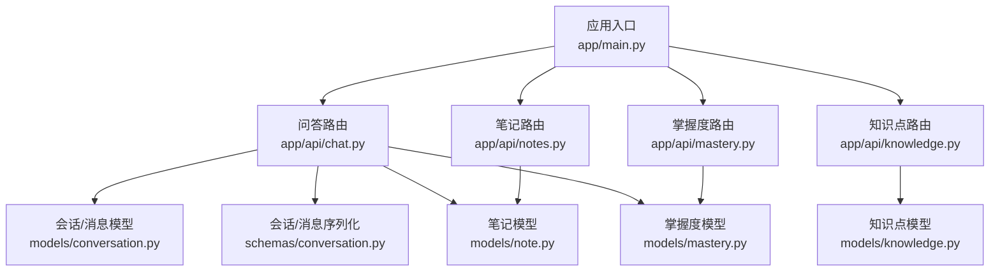
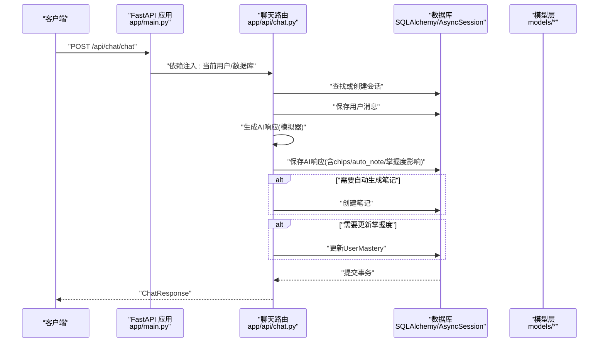
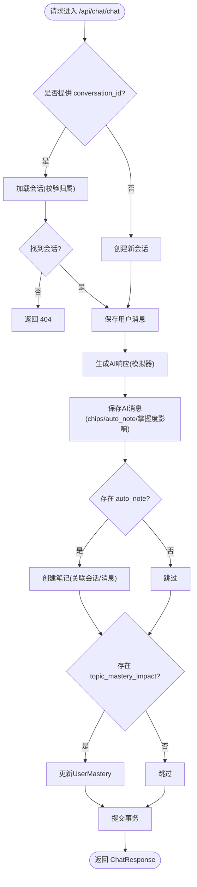
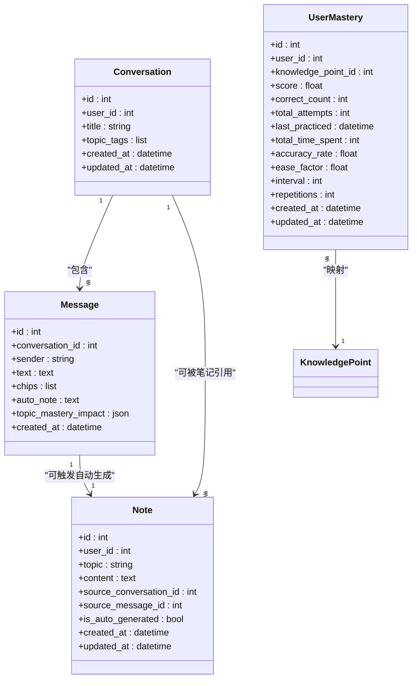
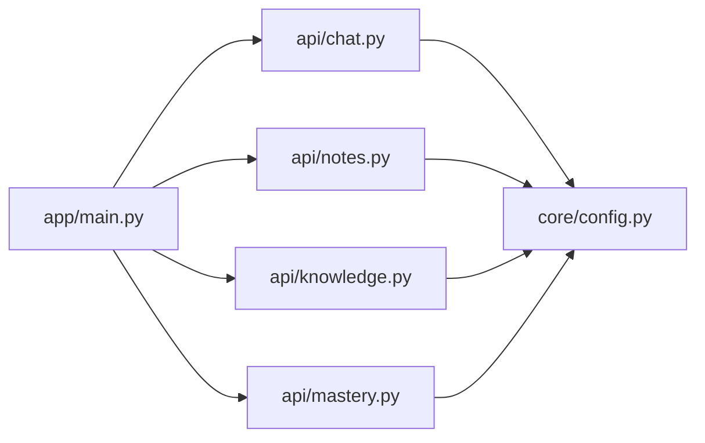

# 问答API接口

<cite>
**本文引用的文件**
- [backend/app/main.py](file://backend/app/main.py)
- [backend/app/api/chat.py](file://backend/app/api/chat.py)
- [backend/app/models/conversation.py](file://backend/app/models/conversation.py)
- [backend/app/schemas/conversation.py](file://backend/app/schemas/conversation.py)
- [backend/app/models/note.py](file://backend/app/models/note.py)
- [backend/app/schemas/note.py](file://backend/app/schemas/note.py)
- [backend/app/api/notes.py](file://backend/app/api/notes.py)
- [backend/app/api/knowledge.py](file://backend/app/api/knowledge.py)
- [backend/app/models/mastery.py](file://backend/app/models/mastery.py)
- [backend/app/api/mastery.py](file://backend/app/api/mastery.py)
- [backend/app/core/config.py](file://backend/app/core/config.py)
- [backend/README.md](file://backend/README.md)
</cite>

## 目录
1. [简介](#简介)
2. [项目结构](#项目结构)
3. [核心组件](#核心组件)
4. [架构总览](#架构总览)
5. [详细组件分析](#详细组件分析)
6. [依赖分析](#依赖分析)
7. [性能考虑](#性能考虑)
8. [故障排查指南](#故障排查指南)
9. [结论](#结论)
10. [附录](#附录)

## 简介
本文件为 QuickLearn 平台的问答与会话管理 API 的全面 RESTful 文档，覆盖以下核心能力：
- 问答消息发送接口：提交问题、生成 AI 响应、维护会话上下文，并可触发自动笔记生成与掌握度评分更新。
- 历史会话查询接口：按用户维度获取会话列表，支持分页与排序。
- 会话消息查询接口：按会话 ID 获取对话消息列表，支持按时间顺序排序。
- 自动笔记生成：基于 AI 响应中的知识点“芯片”自动生成笔记条目。
- 知识点与掌握度体系：提供知识点查询与用户掌握度评分的读取与更新。

同时，文档包含请求/响应示例、错误处理策略、性能优化建议以及与 Gemini API 的集成说明（当前为模拟器模式，生产环境可通过配置启用真实大模型）。

## 项目结构
后端采用 FastAPI 架构，路由按功能模块划分，数据库 ORM 使用 SQLAlchemy，异步数据库连接采用 aiosqlite/AsyncSession。核心模块如下：
- 应用入口与路由挂载：app/main.py
- 问答与会话：app/api/chat.py
- 笔记管理：app/api/notes.py
- 知识点管理：app/api/knowledge.py
- 掌握度管理：app/api/mastery.py
- 数据模型与序列化：models/* 与 schemas/*
- 配置中心：core/config.py

图表来源
- [backend/app/main.py:42-49](file://backend/app/main.py#L42-L49)
- [backend/app/api/chat.py:11-19](file://backend/app/api/chat.py#L11-L19)
- [backend/app/api/notes.py:10-14](file://backend/app/api/notes.py#L10-L14)
- [backend/app/api/knowledge.py:10-14](file://backend/app/api/knowledge.py#L10-L14)
- [backend/app/api/mastery.py:10-14](file://backend/app/api/mastery.py#L10-L14)

章节来源
- [backend/app/main.py:42-49](file://backend/app/main.py#L42-L49)
- [backend/README.md:41-66](file://backend/README.md#L41-L66)

## 核心组件
- 会话与消息模型：Conversation、Message，分别表示一次问答会话与会话内的消息记录；消息中包含 AI 响应元数据（如 chips、auto_note、topic_mastery_impact）。
- 笔记模型：Note，支持关联会话与消息，标记是否自动生成。
- 掌握度模型：UserMastery，记录用户对知识点的掌握分数与练习统计。
- 知识点模型：KnowledgePoint，用于掌握度映射与查询。
- 路由与权限：各路由均依赖 get_current_user 与 get_db，确保用户身份与数据库事务。

章节来源
- [backend/app/models/conversation.py:11-54](file://backend/app/models/conversation.py#L11-L54)
- [backend/app/models/note.py:11-35](file://backend/app/models/note.py#L11-L35)
- [backend/app/models/mastery.py:11-44](file://backend/app/models/mastery.py#L11-L44)

## 架构总览
问答流程从客户端发起，经认证中间件与依赖注入，进入聊天路由处理，持久化用户消息与 AI 响应，必要时创建笔记并更新掌握度评分。最终返回标准化响应。

图表来源
- [backend/app/main.py:42-49](file://backend/app/main.py#L42-L49)
- [backend/app/api/chat.py:78-150](file://backend/app/api/chat.py#L78-L150)
- [backend/app/models/conversation.py:11-54](file://backend/app/models/conversation.py#L11-L54)
- [backend/app/models/note.py:11-35](file://backend/app/models/note.py#L11-L35)
- [backend/app/models/mastery.py:11-44](file://backend/app/models/mastery.py#L11-L44)

## 详细组件分析

### 问答消息发送接口 /api/chat/chat
- 方法与路径：POST /api/chat/chat
- 功能概述：
  - 若请求包含 conversation_id，则复用该会话；否则新建会话。
  - 保存用户消息，生成 AI 响应（当前为模拟器模式，后续可接入 Gemini）。
  - 将 AI 响应保存至消息表，包含 chips、auto_note、topic_mastery_impact 等字段。
  - 如存在 auto_note，自动创建笔记条目，并关联会话与消息。
  - 根据 topic_mastery_impact 更新用户掌握度评分。
- 请求体
  - question: 字符串，必填
  - conversation_id: 整数，可选
- 响应体
  - text: 字符串，AI 响应文本
  - chips: 字符串数组，知识点标签
  - auto_note: 字符串，自动生成的笔记内容
  - topic_mastery_impact: 对应知识点的掌握度影响映射
  - conversation_id: 整数，会话ID
  - message_id: 整数，AI消息ID
- 错误处理
  - 会话不存在：返回 404
  - 数据库异常：返回 500
- 性能与扩展
  - 当前为同步模拟器响应；生产环境建议异步调用 Gemini 并引入缓存与队列。
  - 可增加流式响应与实时推送（WebSocket）以提升交互体验。

图表来源
- [backend/app/api/chat.py:78-150](file://backend/app/api/chat.py#L78-L150)
- [backend/app/models/conversation.py:11-54](file://backend/app/models/conversation.py#L11-L54)
- [backend/app/models/note.py:11-35](file://backend/app/models/note.py#L11-L35)
- [backend/app/models/mastery.py:11-44](file://backend/app/models/mastery.py#L11-L44)

章节来源
- [backend/app/api/chat.py:78-150](file://backend/app/api/chat.py#L78-L150)
- [backend/app/schemas/conversation.py:58-73](file://backend/app/schemas/conversation.py#L58-L73)

### 历史会话查询接口 /api/chat/conversations
- 方法与路径：GET /api/chat/conversations
- 功能概述：返回当前用户的会话列表，按更新时间倒序，限制默认数量。
- 查询参数
  - 无
- 响应体：会话数组，每个元素包含会话基础信息与标签等。
- 分页与过滤
  - 默认限制数量；可结合前端分页策略实现翻页。
- 错误处理
  - 无特殊业务错误，异常统一由框架处理。

章节来源
- [backend/app/api/chat.py:220-232](file://backend/app/api/chat.py#L220-L232)
- [backend/app/schemas/conversation.py:45-56](file://backend/app/schemas/conversation.py#L45-L56)

### 会话消息查询接口 /api/chat/conversations/{conversation_id}/messages
- 方法与路径：GET /api/chat/conversations/{conversation_id}/messages
- 功能概述：返回指定会话的消息列表，按创建时间升序排列。
- 路径参数
  - conversation_id: 整数，必填
- 响应体：消息数组，包含发送者、文本、时间戳及 AI 元数据。
- 错误处理
  - 会话不存在或不属于当前用户：返回 404。
- 性能建议
  - 大会话建议分页查询；可增加游标分页以优化性能。

章节来源
- [backend/app/api/chat.py:235-251](file://backend/app/api/chat.py#L235-L251)
- [backend/app/schemas/conversation.py:31-43](file://backend/app/schemas/conversation.py#L31-L43)

### 自动笔记生成与知识点标签系统
- 触发条件：当 AI 响应包含 auto_note 时，自动创建笔记条目。
- 关联关系：笔记可关联到会话与消息，便于溯源。
- 知识点提取：AI 响应中的 chips 作为知识点标签，用于掌握度评分与笔记主题推断。
- 知识点查询：提供知识点列表与详情接口，支持按分类过滤。
- 掌握度更新：根据 topic_mastery_impact 映射到具体知识点，更新 UserMastery 记录。

图表来源
- [backend/app/models/conversation.py:11-54](file://backend/app/models/conversation.py#L11-L54)
- [backend/app/models/note.py:11-35](file://backend/app/models/note.py#L11-L35)
- [backend/app/models/mastery.py:11-44](file://backend/app/models/mastery.py#L11-L44)

章节来源
- [backend/app/api/chat.py:125-140](file://backend/app/api/chat.py#L125-L140)
- [backend/app/api/notes.py:64-82](file://backend/app/api/notes.py#L64-L82)
- [backend/app/api/knowledge.py:20-31](file://backend/app/api/knowledge.py#L20-L31)
- [backend/app/api/mastery.py:20-60](file://backend/app/api/mastery.py#L20-L60)

### 知识点与掌握度接口
- 知识点查询
  - GET /api/knowledge/?category={分类}：按分类过滤返回知识点列表
  - GET /api/knowledge/{kp_id}：获取单个知识点详情
  - POST /api/knowledge/：创建知识点（管理员）
- 掌握度查询
  - GET /api/mastery/overview：获取掌握度概览（按类别平均分）
  - GET /api/mastery/：获取全部掌握度记录
  - GET /api/mastery/{knowledge_point_id}：获取特定知识点掌握度
  - POST /api/mastery/quiz/{knowledge_point_id}：提交测验结果并更新掌握度

章节来源
- [backend/app/api/knowledge.py:20-68](file://backend/app/api/knowledge.py#L20-L68)
- [backend/app/api/mastery.py:20-139](file://backend/app/api/mastery.py#L20-L139)

## 依赖分析
- 路由挂载：主程序将各模块路由挂载到 /api/{prefix}，统一添加 CORS 中间件。
- 依赖注入：各路由依赖 get_current_user 与 get_db，确保鉴权与数据库事务。
- 配置中心：settings 控制调试模式、CORS、数据库、Redis、Celery、Gemini API Key 等。

图表来源
- [backend/app/main.py:42-49](file://backend/app/main.py#L42-L49)
- [backend/app/core/config.py:10-44](file://backend/app/core/config.py#L10-L44)

章节来源
- [backend/app/main.py:42-49](file://backend/app/main.py#L42-L49)
- [backend/app/core/config.py:10-44](file://backend/app/core/config.py#L10-L44)

## 性能考虑
- 异步数据库：已使用 AsyncSession，建议在高并发场景下合理配置连接池与超时。
- 查询优化：历史会话与消息查询已按时间排序并限制数量，建议在大数据量场景下引入分页与索引。
- 缓存策略：可利用 Redis 缓存热门会话摘要与知识点信息，降低数据库压力。
- 大模型集成：当前为模拟器响应，生产环境建议：
  - 异步调用 Gemini API，避免阻塞主线程
  - 引入任务队列（Celery）处理长耗时任务
  - 实现流式响应与增量渲染
- WebSocket：当前未实现实时推送，可在消息生成后通过 WebSocket 推送增量内容，提升交互体验。

## 故障排查指南
- 认证失败：确认请求头携带有效 JWT Token，且 Token 未过期。
- 会话不存在：检查 conversation_id 是否属于当前用户，或是否传入了错误的会话ID。
- 数据库异常：查看数据库连接配置与权限，确认表结构已初始化。
- Gemini 集成问题：检查 GEMINI_API_KEY 是否正确配置，网络连通性是否正常。
- CORS 跨域：确认前端域名已在 CORS_ORIGINS 中配置。

章节来源
- [backend/app/api/chat.py:94-95](file://backend/app/api/chat.py#L94-L95)
- [backend/app/main.py:58-65](file://backend/app/main.py#L58-L65)
- [backend/app/core/config.py:32-33](file://backend/app/core/config.py#L32-L33)

## 结论
本接口文档覆盖了问答、会话管理、自动笔记与掌握度体系的完整链路。当前实现为模拟器模式，便于开发与演示；生产环境建议接入 Gemini API、引入缓存与队列、实现流式响应与 WebSocket 推送，以获得更佳的用户体验与系统性能。

## 附录

### API 端点一览（节选）
- 问答
  - POST /api/chat/chat
  - GET /api/chat/conversations
  - GET /api/chat/conversations/{conversation_id}/messages
- 笔记
  - GET /api/notes/
  - GET /api/notes/{id}
  - POST /api/notes/
  - PUT /api/notes/{id}
  - DELETE /api/notes/{id}
- 知识点
  - GET /api/knowledge/
  - GET /api/knowledge/{id}
  - POST /api/knowledge/
- 掌握度
  - GET /api/mastery/overview
  - GET /api/mastery/
  - GET /api/mastery/{knowledge_point_id}
  - POST /api/mastery/quiz/{knowledge_point_id}

章节来源
- [backend/README.md:48-66](file://backend/README.md#L48-L66)