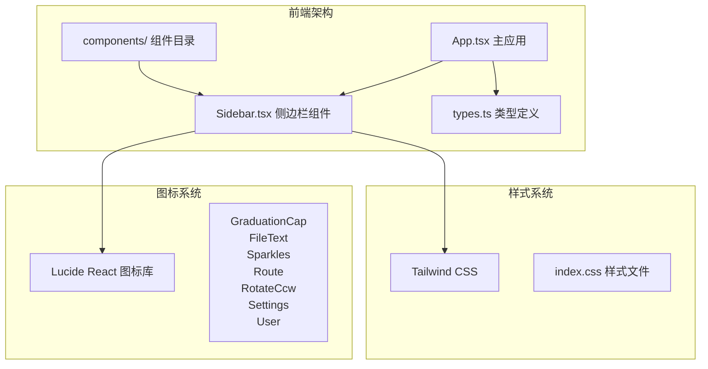
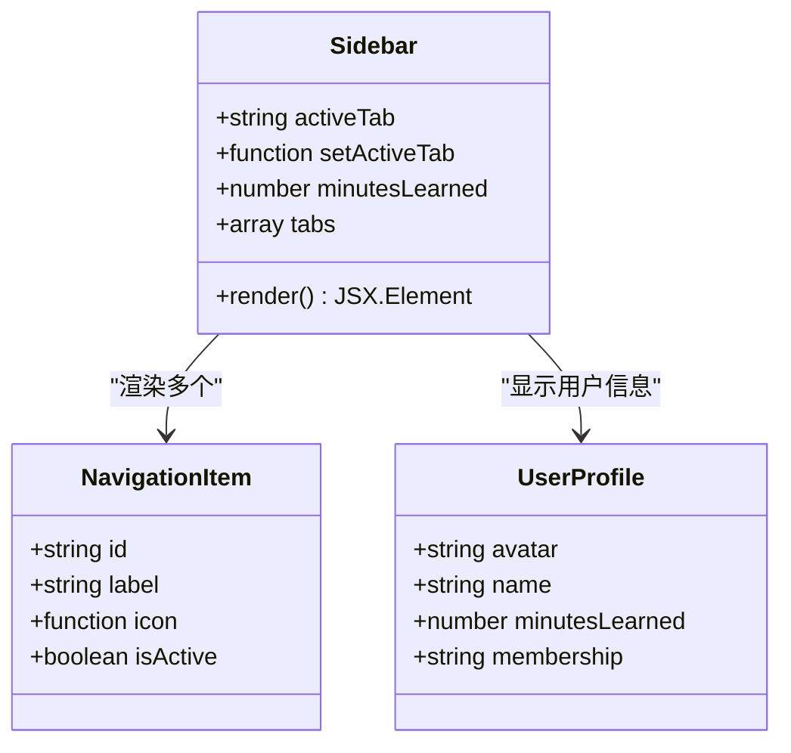
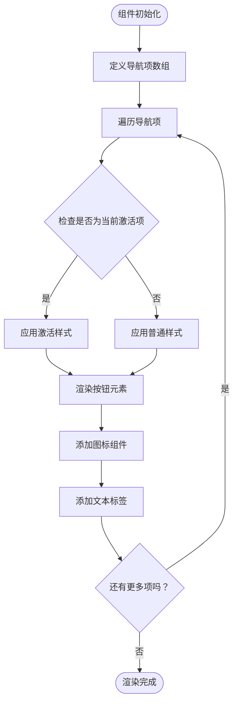
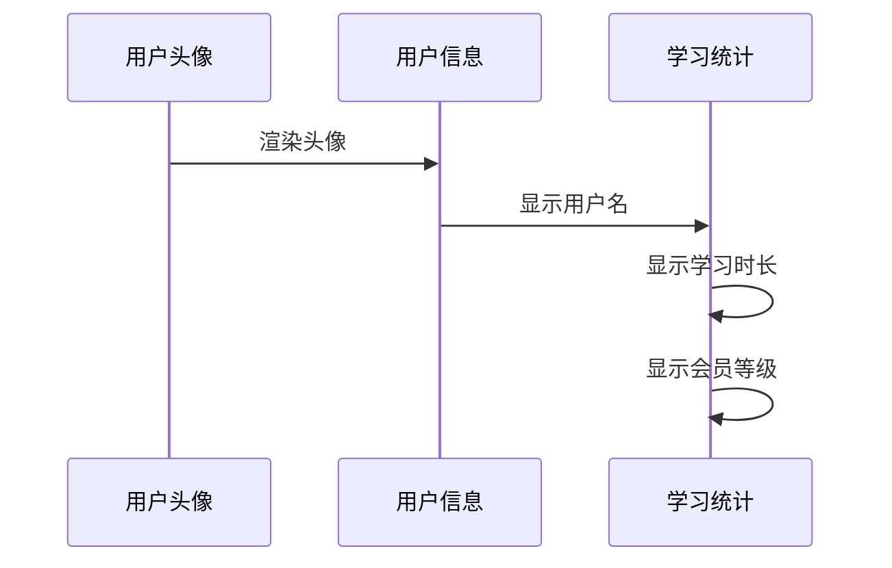
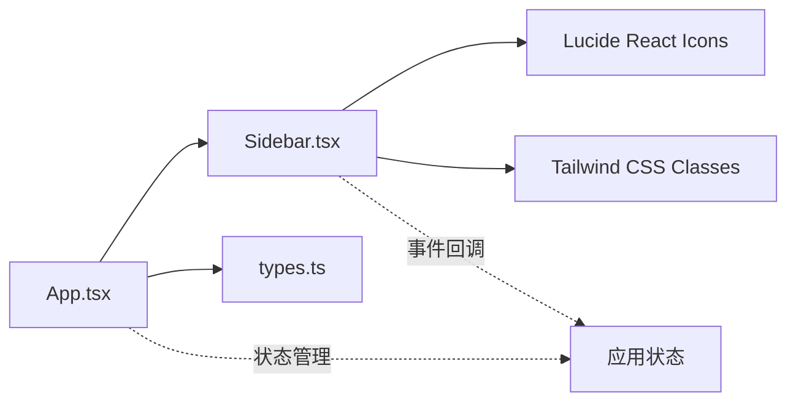

# 侧边栏导航组件

<cite>
**本文档引用的文件**
- [Sidebar.tsx](file://front/src/components/Sidebar.tsx)
- [App.tsx](file://front/src/App.tsx)
- [types.ts](file://front/src/types.ts)
- [package.json](file://front/package.json)
- [vite.config.ts](file://front/vite.config.ts)
</cite>

## 目录
1. [简介](#简介)
2. [项目结构](#项目结构)
3. [核心组件](#核心组件)
4. [架构概览](#架构概览)
5. [详细组件分析](#详细组件分析)
6. [依赖关系分析](#依赖关系分析)
7. [性能考虑](#性能考虑)
8. [故障排除指南](#故障排除指南)
9. [结论](#结论)

## 简介

Quickly侧边栏导航组件是一个功能完整的React组件，提供了学习平台的核心导航功能。该组件实现了现代化的学习管理系统界面，包括标签页切换、学习统计显示和用户个人资料展示。组件采用深色主题设计，符合现代学习应用的视觉规范。

## 项目结构

Quickly项目采用前后端分离架构，前端使用React + TypeScript开发，后端基于Python + FastAPI构建。侧边栏组件位于前端src/components目录下，是整个应用UI的重要组成部分。

**图表来源**
- [Sidebar.tsx:1-10](file://front/src/components/Sidebar.tsx#L1-L10)
- [App.tsx:28-35](file://front/src/App.tsx#L28-L35)
- [package.json:13-24](file://front/package.json#L13-L24)

**章节来源**
- [Sidebar.tsx:1-95](file://front/src/components/Sidebar.tsx#L1-L95)
- [App.tsx:28-35](file://front/src/App.tsx#L28-L35)
- [package.json:13-24](file://front/package.json#L13-L24)

## 核心组件

### Sidebar组件概述

Sidebar组件是一个纯函数式React组件，负责渲染应用的左侧导航栏。组件接收三个主要属性：`activeTab`、`setActiveTab`和`minutesLearned`，并通过这些属性实现完整的导航状态管理。

### Props接口定义

组件的Props接口定义简洁而明确：

| 属性名 | 类型 | 必需 | 描述 |
|--------|------|------|------|
| activeTab | string | 是 | 当前激活的标签页标识符 |
| setActiveTab | (tab: string) => void | 是 | 切换标签页的回调函数 |
| minutesLearned | number | 是 | 用户累计学习分钟数 |

### 导航项配置

组件内置了六个标准导航项，每个导航项都包含以下信息：
- `id`: 唯一标识符（用于路由匹配）
- `label`: 显示文本
- `icon`: 对应的Lucide React图标组件

**章节来源**
- [Sidebar.tsx:12-26](file://front/src/components/Sidebar.tsx#L12-L26)
- [Sidebar.tsx:18-26](file://front/src/components/Sidebar.tsx#L18-L26)

## 架构概览

### 组件层次结构

**图表来源**
- [Sidebar.tsx:18-95](file://front/src/components/Sidebar.tsx#L18-L95)

### 状态管理模式

Sidebar组件采用受控组件模式，所有状态都由父组件App管理，通过props传递给Sidebar组件。这种设计确保了状态的一致性和可预测性。

**章节来源**
- [Sidebar.tsx:18-16](file://front/src/components/Sidebar.tsx#L18-L16)
- [App.tsx:43-47](file://front/src/App.tsx#L43-L47)

## 详细组件分析

### 导航渲染逻辑

Sidebar组件使用map方法动态渲染导航项，实现了高度可配置的导航系统：

**图表来源**
- [Sidebar.tsx:47-69](file://front/src/components/Sidebar.tsx#L47-L69)

### 视觉反馈机制

组件实现了多层次的视觉反馈：

1. **颜色系统**：使用绿色(#b8f600)作为激活状态的颜色标识
2. **边框效果**：激活状态下显示右侧边框强调
3. **背景变化**：悬停时提供微妙的背景色变化
4. **图标动画**：图标具有平滑的过渡动画效果

### 用户徽章显示

底部用户信息区域展示了用户的徽章系统：

**图表来源**
- [Sidebar.tsx:74-91](file://front/src/components/Sidebar.tsx#L74-L91)

**章节来源**
- [Sidebar.tsx:47-91](file://front/src/components/Sidebar.tsx#L47-L91)

### 交互设计特性

组件提供了丰富的交互体验：

- **点击切换**：用户点击任意导航项即可切换到对应标签页
- **悬停效果**：提供流畅的颜色和背景变化
- **激活状态**：当前选中项具有明显的视觉强调
- **缩放反馈**：按钮被点击时有轻微的缩放动画

**章节来源**
- [Sidebar.tsx:51-68](file://front/src/components/Sidebar.tsx#L51-L68)

## 依赖关系分析

### 外部依赖

Sidebar组件依赖于以下关键包：

| 依赖包 | 版本 | 用途 |
|--------|------|------|
| lucide-react | ^0.546.0 | 图标系统 |
| react | ^19.0.1 | 核心框架 |
| motion | ^12.23.24 | 动画支持 |

### 内部依赖关系

**图表来源**
- [App.tsx:28-35](file://front/src/App.tsx#L28-L35)
- [package.json:13-24](file://front/package.json#L13-L24)

**章节来源**
- [package.json:13-24](file://front/package.json#L13-L24)
- [vite.config.ts:1-22](file://front/vite.config.ts#L1-L22)

## 性能考虑

### 渲染优化

- **纯函数组件**：避免不必要的重渲染
- **内联样式**：减少额外的CSS文件依赖
- **条件渲染**：仅渲染必要的DOM元素

### 动画性能

组件使用CSS过渡而非JavaScript动画，确保流畅的用户体验：

- **过渡持续时间**：200ms的平滑切换
- **图标动画**：300ms的缓动效果
- **缩放反馈**：即时响应但不影响整体性能

## 故障排除指南

### 常见问题

1. **图标不显示**
   - 检查lucide-react包是否正确安装
   - 确认图标名称拼写正确

2. **样式异常**
   - 验证Tailwind CSS配置
   - 检查颜色变量是否正确

3. **点击无响应**
   - 确认setActiveTab回调函数正确传递
   - 检查事件处理器绑定

### 调试技巧

- 使用浏览器开发者工具检查元素状态
- 在控制台输出activeTab状态变化
- 验证Props数据类型和格式

**章节来源**
- [Sidebar.tsx:18-95](file://front/src/components/Sidebar.tsx#L18-L95)

## 结论

Quickly侧边栏导航组件是一个设计精良、功能完整的UI组件。它成功地将导航功能、状态管理和视觉设计结合在一起，为用户提供了一致且直观的使用体验。组件的架构清晰，易于维护和扩展，为整个学习平台奠定了坚实的UI基础。

组件的主要优势包括：
- 清晰的职责分离和状态管理
- 优雅的视觉设计和动画效果  
- 良好的可访问性和响应式设计
- 易于定制和扩展的架构