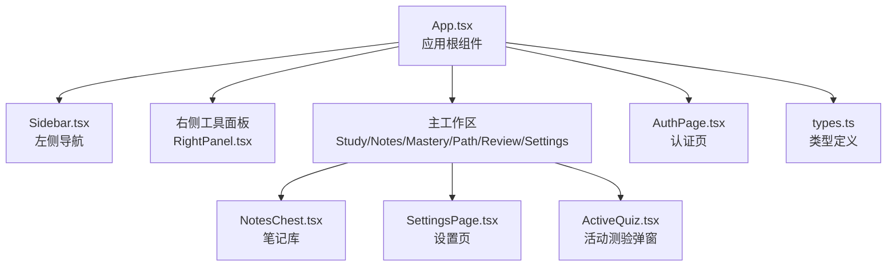
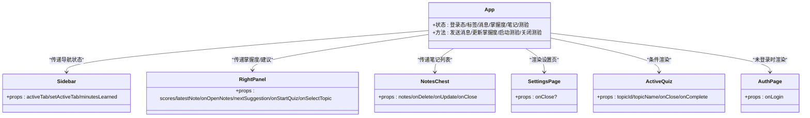
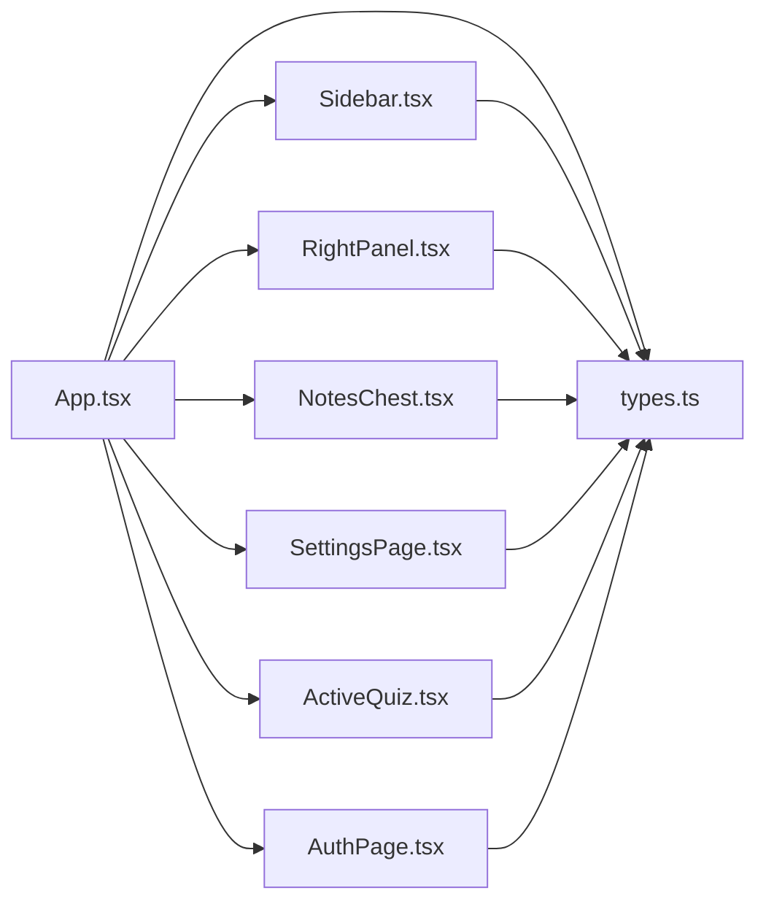
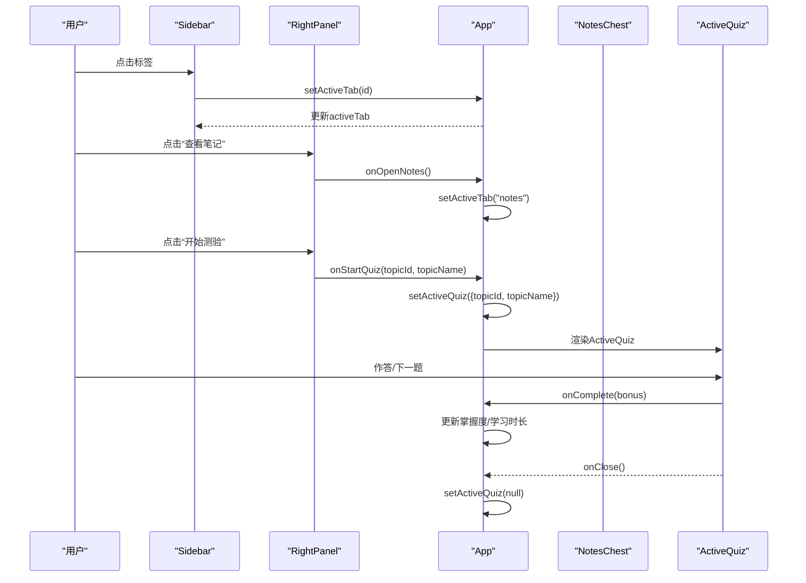

# 前端组件

<cite>
**本文引用的文件列表**
- [App.tsx](file://front/src/App.tsx)
- [AuthPage.tsx](file://front/src/components/AuthPage.tsx)
- [Sidebar.tsx](file://front/src/components/Sidebar.tsx)
- [RightPanel.tsx](file://front/src/components/RightPanel.tsx)
- [NotesChest.tsx](file://front/src/components/NotesChest.tsx)
- [SettingsPage.tsx](file://front/src/components/SettingsPage.tsx)
- [ActiveQuiz.tsx](file://front/src/components/ActiveQuiz.tsx)
- [types.ts](file://front/src/types.ts)
- [package.json](file://front/package.json)
</cite>

## 目录
1. [简介](#简介)
2. [项目结构](#项目结构)
3. [核心组件](#核心组件)
4. [架构总览](#架构总览)
5. [组件详解](#组件详解)
6. [依赖关系分析](#依赖关系分析)
7. [性能与优化](#性能与优化)
8. [故障排查指南](#故障排查指南)
9. [结论](#结论)
10. [附录](#附录)

## 简介
本文件面向Quickly前端组件系统，聚焦React组件架构设计与实现细节，覆盖组件层次结构、状态管理模式、生命周期管理、组件间通信机制、TypeScript类型定义与接口设计、组件复用策略、性能优化技巧与用户体验设计原则，并提供具体使用场景与参考路径，帮助开发者快速理解与扩展系统。

## 项目结构
前端采用Vite + React 19 + TailwindCSS + Motion构建，组件位于front/src/components目录，应用入口在front/src/App.tsx，类型定义集中在front/src/types.ts。项目通过package.json声明依赖，包含React生态、UI图标库、动画库与开发工具链。

图表来源
- [App.tsx:30-838](file://front/src/App.tsx#L30-L838)
- [Sidebar.tsx:18-95](file://front/src/components/Sidebar.tsx#L18-L95)
- [RightPanel.tsx:18-128](file://front/src/components/RightPanel.tsx#L18-L128)
- [NotesChest.tsx:13-181](file://front/src/components/NotesChest.tsx#L13-L181)
- [SettingsPage.tsx:20-378](file://front/src/components/SettingsPage.tsx#L20-L378)
- [ActiveQuiz.tsx:22-331](file://front/src/components/ActiveQuiz.tsx#L22-L331)
- [AuthPage.tsx:19-320](file://front/src/components/AuthPage.tsx#L19-L320)
- [types.ts:1-29](file://front/src/types.ts#L1-L29)

章节来源
- [App.tsx:30-838](file://front/src/App.tsx#L30-L838)
- [package.json:1-36](file://front/package.json#L1-L36)

## 核心组件
- 认证页面：负责用户登录/注册流程，表单校验与加载态展示。
- 侧边栏导航：切换主工作区标签页，显示用户信息与学习时长。
- 右侧面板：展示掌握度快照、自动笔记摘要、下一步建议与快捷操作。
- 笔记管理：提供笔记搜索、编辑、删除与导出Markdown能力。
- 设置页面：集中管理学习目标、提醒、语言、主题与高级选项。
- 活动测验：全屏模态测验，支持计时、音效反馈、逐题作答与结果统计。
- 应用根组件：统一状态管理、路由渲染、模态调度与全局交互。

章节来源
- [AuthPage.tsx:19-320](file://front/src/components/AuthPage.tsx#L19-L320)
- [Sidebar.tsx:18-95](file://front/src/components/Sidebar.tsx#L18-L95)
- [RightPanel.tsx:18-128](file://front/src/components/RightPanel.tsx#L18-L128)
- [NotesChest.tsx:13-181](file://front/src/components/NotesChest.tsx#L13-L181)
- [SettingsPage.tsx:20-378](file://front/src/components/SettingsPage.tsx#L20-L378)
- [ActiveQuiz.tsx:22-331](file://front/src/components/ActiveQuiz.tsx#L22-L331)
- [App.tsx:43-838](file://front/src/App.tsx#L43-L838)

## 架构总览
Quickly前端采用“根组件统一状态 + 组件分层渲染”的架构：
- 根组件App维护全局状态（登录态、当前标签、消息流、掌握度、笔记、测验状态等），并通过props向下传递给子组件。
- 左侧Sidebar与右侧RightPanel作为辅助区域，分别承担导航与辅助功能。
- 主工作区按标签页渲染不同视图（学习、笔记、掌握度、路径、复习、设置）。
- 活动测验以模态形式插入，不影响主工作区布局。
- 类型系统通过types.ts集中定义数据结构，确保跨组件一致性。

图表来源
- [App.tsx:43-838](file://front/src/App.tsx#L43-L838)
- [Sidebar.tsx:18-95](file://front/src/components/Sidebar.tsx#L18-L95)
- [RightPanel.tsx:18-128](file://front/src/components/RightPanel.tsx#L18-L128)
- [NotesChest.tsx:13-181](file://front/src/components/NotesChest.tsx#L13-L181)
- [SettingsPage.tsx:20-378](file://front/src/components/SettingsPage.tsx#L20-L378)
- [ActiveQuiz.tsx:22-331](file://front/src/components/ActiveQuiz.tsx#L22-L331)
- [AuthPage.tsx:19-320](file://front/src/components/AuthPage.tsx#L19-L320)

## 组件详解

### 认证页面（AuthPage）
- 职责：提供登录/注册切换、表单字段管理、实时校验、提交流程与加载态。
- 关键特性：
  - 使用useState管理登录态、密码可见性、表单数据与错误集合。
  - 表单校验规则：邮箱格式、密码长度、用户名必填、确认密码一致性。
  - 提交流程：防重复提交、短暂延迟模拟网络请求、成功回调触发根组件登录。
  - 动画：品牌徽标与卡片入场动画、切换模式时的过渡动画。
- 通信机制：通过onLogin回调向上通知根组件，完成登录态切换。

章节来源
- [AuthPage.tsx:19-320](file://front/src/components/AuthPage.tsx#L19-L320)
- [App.tsx:297-303](file://front/src/App.tsx#L297-L303)

### 侧边栏导航（Sidebar）
- 职责：提供标签页导航、用户信息展示与学习时长统计。
- 关键特性：
  - tabs数组定义导航项，动态高亮当前标签。
  - 点击切换标签，调用父组件传入的setActiveTab。
  - 用户资料区展示头像、昵称与今日学习时长。
- 通信机制：通过activeTab与setActiveTab双向绑定，实现标签页切换。

章节来源
- [Sidebar.tsx:18-95](file://front/src/components/Sidebar.tsx#L18-L95)
- [App.tsx:309-313](file://front/src/App.tsx#L309-L313)

### 右侧面板（RightPanel）
- 职责：展示掌握度快照、自动笔记摘要、下一步建议与快捷操作。
- 关键特性：
  - 计算聚合掌握度（三科平均）。
  - 支持点击各科目跳转至对应话题并发起对话。
  - 支持打开笔记库、启动测验、根据建议执行动作。
- 通信机制：通过onOpenNotes、onStartQuiz、onSelectTopic等回调与根组件交互。

章节来源
- [RightPanel.tsx:18-128](file://front/src/components/RightPanel.tsx#L18-L128)
- [App.tsx:816-823](file://front/src/App.tsx#L816-L823)

### 笔记管理（NotesChest）
- 职责：展示、搜索、编辑、删除与导出笔记。
- 关键特性：
  - 支持按主题/内容关键词过滤。
  - 编辑模式：进入/保存/取消。
  - 导出Markdown：批量生成并下载文件。
  - 动画：卡片入场/退出动画，增强交互反馈。
- 通信机制：通过onDelete、onUpdate回调与根组件同步状态。

章节来源
- [NotesChest.tsx:13-181](file://front/src/components/NotesChest.tsx#L13-L181)
- [App.tsx:287-293](file://front/src/App.tsx#L287-L293)

### 设置页面（SettingsPage）
- 职责：集中管理学习目标、提醒、语言、主题与高级选项。
- 关键特性：
  - 学习目标：每日学习时长选择与进度条展示。
  - 提醒设置：每日提醒时间与时序开关。
  - 语言与主题：多语言选择与深浅色切换。
  - 高级设置：自动保存笔记、音效反馈等。
  - 保存流程：保存中/已保存状态反馈。
- 通信机制：内部状态通过updateSetting更新，保存按钮触发异步保存流程。

章节来源
- [SettingsPage.tsx:20-378](file://front/src/components/SettingsPage.tsx#L20-L378)

### 活动测验（ActiveQuiz）
- 职责：提供全屏测验体验，支持计时、音效反馈、逐题作答与结果统计。
- 关键特性：
  - 加载态：从后端API获取题目。
  - 计时器：实时秒表显示。
  - 音效：Web Audio API生成正确/错误/胜利音效。
  - 结果页：正确率与掌握度上升幅度展示。
- 通信机制：onClose关闭测验，onComplete回传分数加成，根组件据此更新掌握度与学习时长。

章节来源
- [ActiveQuiz.tsx:22-331](file://front/src/components/ActiveQuiz.tsx#L22-L331)
- [App.tsx:826-835](file://front/src/App.tsx#L826-L835)

### 应用根组件（App）
- 职责：统一状态管理、路由渲染、模态调度与全局交互。
- 关键特性：
  - 登录态控制：未登录时渲染AuthPage，登录后进入主工作区。
  - 标签页路由：根据activeTab渲染对应面板（学习/笔记/掌握度/路径/复习/设置）。
  - 全局状态：消息流、掌握度、笔记、下一步建议、测验状态。
  - 交互桥接：将右侧面板与主工作区的交互（如启动测验、打开笔记）与根状态联动。
  - 生命周期：挂载时检查后端状态，滚动消息到底部，处理发送消息与更新掌握度。
- 通信机制：props向下传递，回调向上返回，形成清晰的单向数据流。

章节来源
- [App.tsx:43-838](file://front/src/App.tsx#L43-L838)

## 依赖关系分析
- 组件依赖：
  - App依赖所有子组件（Sidebar、RightPanel、NotesChest、SettingsPage、ActiveQuiz、AuthPage）。
  - 子组件之间无直接依赖，通过App进行协调。
- 外部依赖：
  - React 19、lucide-react（图标）、motion（动画）、TailwindCSS（样式）。
  - 后端API：/api/status、/api/chat、/api/quiz（由组件内fetch调用）。
- 类型依赖：
  - types.ts提供Message、MasteryScores、NoteItem、QuizQuestion等核心类型，被多个组件引用。

图表来源
- [App.tsx:29-34](file://front/src/App.tsx#L29-L34)
- [types.ts:1-29](file://front/src/types.ts#L1-L29)

章节来源
- [package.json:13-34](file://front/package.json#L13-L34)
- [App.tsx:29-34](file://front/src/App.tsx#L29-L34)

## 性能与优化
- 渲染优化
  - 使用React.memo与useMemo避免不必要的重渲染（可在子组件中引入以进一步优化）。
  - 列表渲染使用稳定的key，减少DOM重建。
  - 图标与动画库Motion按需使用，避免全局注入。
- 状态管理
  - 将高频更新状态拆分，避免单一大对象导致的全量重渲染。
  - 对聊天消息、笔记列表等长列表使用虚拟滚动（可选）。
- 网络与I/O
  - API调用增加节流/去抖，避免频繁请求。
  - 加载态与骨架屏提升感知性能。
- 动画与音效
  - 音效仅在用户交互后初始化AudioContext，避免浏览器策略限制。
  - 动画使用Motion的animate属性，避免过度复杂动画影响性能。
- 可访问性与体验
  - 键盘导航与焦点管理（如输入框、按钮）。
  - 颜色对比度与无障碍标签。

## 故障排查指南
- 登录/注册失败
  - 检查表单校验是否触发错误提示，确认邮箱格式与密码长度。
  - 观察提交按钮禁用状态与加载动画。
- 测验无法加载
  - 检查后端/api/quiz接口可用性，确认请求体包含topic字段。
  - 查看控制台是否有fetch错误。
- 掌度更新异常
  - 确认后端返回的topicMasteryImpact字段存在且数值有效。
  - 检查根组件对scores的边界处理（0~100）。
- 音效不生效
  - 确认浏览器允许AudioContext初始化，部分策略会阻止自动播放。
- 笔记导出失败
  - 检查Blob与a.download兼容性，确保在用户手势触发时执行下载。

章节来源
- [AuthPage.tsx:31-70](file://front/src/components/AuthPage.tsx#L31-L70)
- [ActiveQuiz.tsx:74-91](file://front/src/components/ActiveQuiz.tsx#L74-L91)
- [App.tsx:212-236](file://front/src/App.tsx#L212-L236)
- [ActiveQuiz.tsx:32-71](file://front/src/components/ActiveQuiz.tsx#L32-L71)
- [NotesChest.tsx:34-50](file://front/src/components/NotesChest.tsx#L34-L50)

## 结论
Quickly前端组件系统以App为核心，围绕Sidebar、RightPanel、主工作区与模态组件构建完整的交互闭环。通过清晰的props传递与回调机制、统一的类型定义与状态管理，实现了良好的可维护性与扩展性。建议后续引入更细粒度的状态拆分、虚拟滚动与性能监控，持续优化用户体验与开发效率。

## 附录

### TypeScript类型定义规范与接口设计
- Message：消息实体，包含发送者、文本、时间戳、可选标签与思考态。
- MasteryScores：掌握度三元组（逻辑回归、梯度下降、正则化）。
- NoteItem：笔记实体，包含主题、内容与时间戳。
- QuizQuestion：测验题目实体，包含问题、选项、正确索引与解析。

章节来源
- [types.ts:1-29](file://front/src/types.ts#L1-L29)

### 组件通信与数据流示意

图表来源
- [App.tsx:253-285](file://front/src/App.tsx#L253-L285)
- [RightPanel.tsx:84-121](file://front/src/components/RightPanel.tsx#L84-L121)
- [ActiveQuiz.tsx:125-137](file://front/src/components/ActiveQuiz.tsx#L125-L137)