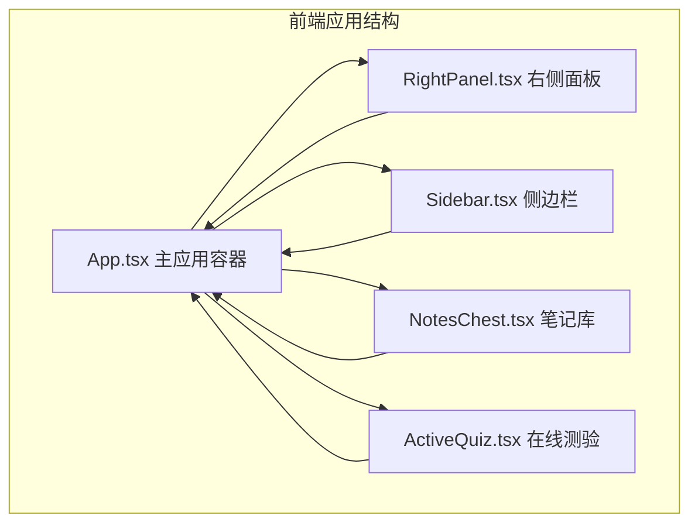
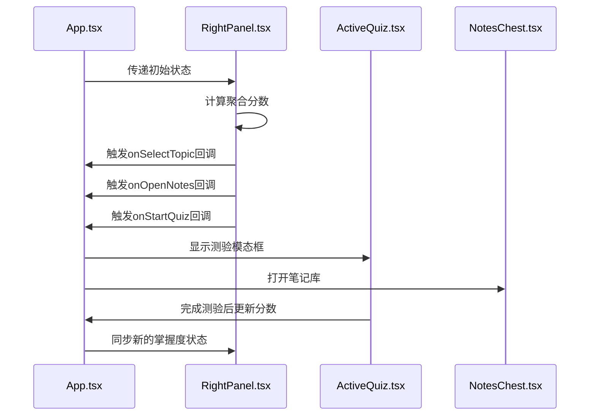
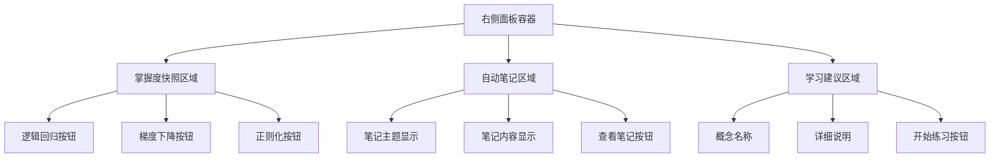
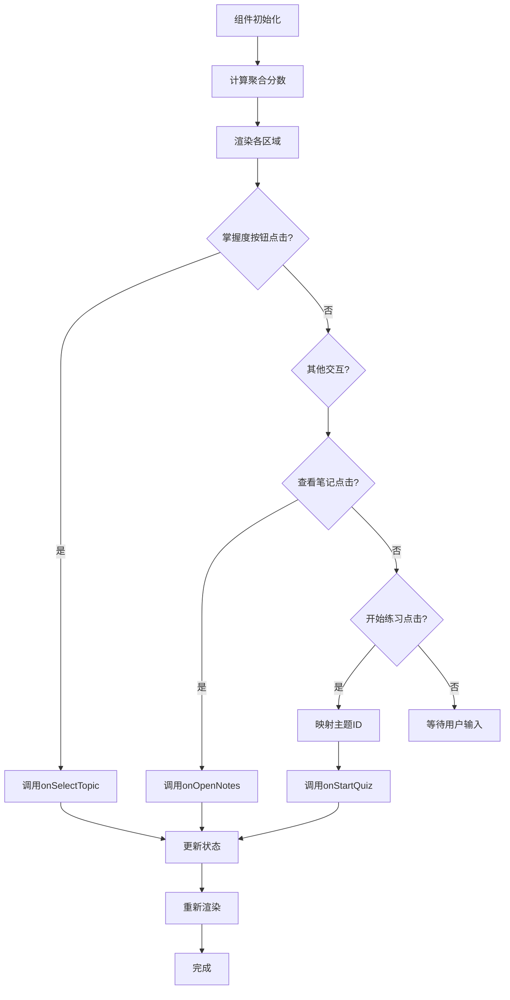
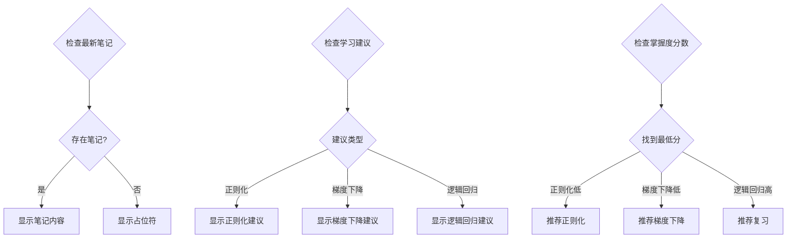
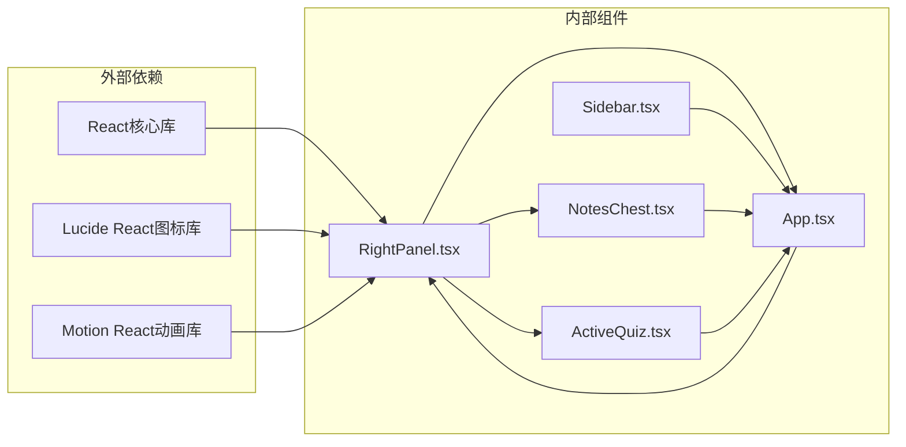
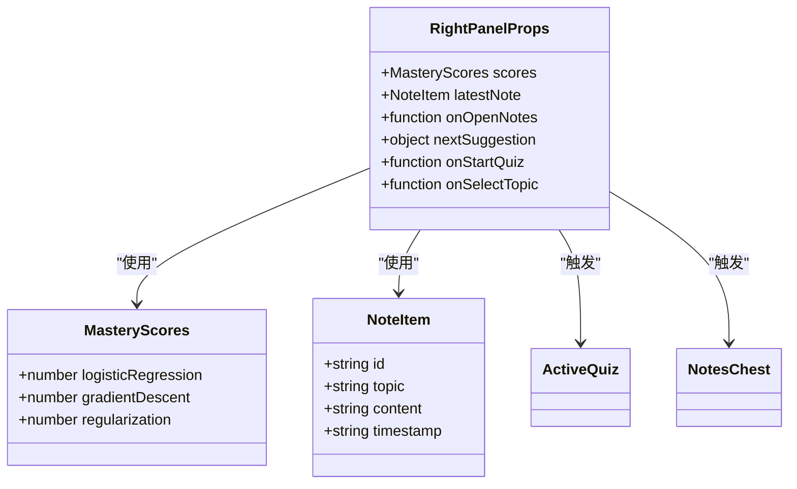

# 右侧面板组件

<cite>
**本文档引用的文件**
- [RightPanel.tsx](file://front/src/components/RightPanel.tsx)
- [App.tsx](file://front/src/App.tsx)
- [types.ts](file://front/src/types.ts)
- [ActiveQuiz.tsx](file://front/src/components/ActiveQuiz.tsx)
- [NotesChest.tsx](file://front/src/components/NotesChest.tsx)
- [Sidebar.tsx](file://front/src/components/Sidebar.tsx)
</cite>

## 目录
1. [简介](#简介)
2. [项目结构](#项目结构)
3. [核心组件](#核心组件)
4. [架构概览](#架构概览)
5. [详细组件分析](#详细组件分析)
6. [依赖关系分析](#依赖关系分析)
7. [性能考虑](#性能考虑)
8. [故障排除指南](#故障排除指南)
9. [结论](#结论)
10. [附录](#附录)

## 简介

Quickly右侧面板组件是一个动态交互的侧边栏面板，负责展示学习进度、自动笔记、学习建议和智能提示。该组件采用React函数式组件设计，结合TypeScript类型系统，实现了完整的数据绑定机制和实时状态同步。

组件的主要功能包括：
- **掌握度快照**：实时显示三个核心概念的掌握分数
- **自动笔记**：展示最新的AI生成学习笔记
- **学习建议**：基于掌握度动态推荐下一步学习内容
- **智能提示**：提供个性化的学习路径指导

## 项目结构

RightPanel组件位于前端项目的组件目录中，与主应用容器、侧边栏、笔记库等其他UI组件协同工作。



**图表来源**
- [RightPanel.tsx:1-128](file://front/src/components/RightPanel.tsx#L1-L128)
- [App.tsx:1-840](file://front/src/App.tsx#L1-L840)

**章节来源**
- [RightPanel.tsx:1-128](file://front/src/components/RightPanel.tsx#L1-L128)
- [App.tsx:1-840](file://front/src/App.tsx#L1-L840)

## 核心组件

RightPanel组件采用函数式组件模式，接收props参数并通过内部状态管理实现动态内容更新。

### Props接口定义

组件的Props接口定义了所有外部传入的数据和回调函数：

```typescript
interface RightPanelProps {
  scores: MasteryScores;                    // 掌握度分数对象
  latestNote: { topic: string; content: string } | null; // 最新笔记
  onOpenNotes: () => void;                   // 打开笔记库回调
  nextSuggestion: { concept: string; detail: string }; // 下一步建议
  onStartQuiz: (topicId: string, topicName: string) => void; // 开始测验回调
  onSelectTopic: (topicId: string) => void;   // 选择主题回调
}
```

### 数据绑定机制

组件实现了双向数据绑定和状态同步机制：

1. **聚合分数计算**：自动计算三个核心概念的平均掌握度
2. **实时状态更新**：通过useEffect监听分数变化动态调整建议
3. **用户交互响应**：处理按钮点击事件并调用父组件回调

**章节来源**
- [RightPanel.tsx:9-25](file://front/src/components/RightPanel.tsx#L9-L25)
- [RightPanel.tsx:27-30](file://front/src/components/RightPanel.tsx#L27-L30)

## 架构概览

RightPanel组件在整个应用架构中扮演着关键角色，连接着主应用容器和各个功能模块。



**图表来源**
- [App.tsx:123-142](file://front/src/App.tsx#L123-L142)
- [RightPanel.tsx:44-66](file://front/src/components/RightPanel.tsx#L44-L66)
- [RightPanel.tsx:108-120](file://front/src/components/RightPanel.tsx#L108-L120)

## 详细组件分析

### 组件结构设计

RightPanel组件采用三段式布局设计，每个部分都有明确的功能定位：



**图表来源**
- [RightPanel.tsx:32-126](file://front/src/components/RightPanel.tsx#L32-L126)

### 数据流处理

组件实现了完整的数据流处理机制：



**图表来源**
- [RightPanel.tsx:18-25](file://front/src/components/RightPanel.tsx#L18-L25)
- [RightPanel.tsx:108-120](file://front/src/components/RightPanel.tsx#L108-L120)

### 条件渲染逻辑

组件实现了智能的条件渲染机制，根据不同的状态显示相应的UI元素：



**图表来源**
- [RightPanel.tsx:76-82](file://front/src/components/RightPanel.tsx#L76-L82)
- [RightPanel.tsx:98-105](file://front/src/components/RightPanel.tsx#L98-L105)
- [RightPanel.tsx:124-142](file://front/src/App.tsx#L124-L142)

### 用户交互响应

组件提供了丰富的用户交互响应机制：

| 交互类型 | 触发事件 | 响应行为 | 回调函数 |
|---------|---------|---------|---------|
| 主题选择 | 点击掌握度按钮 | 导航到对应主题 | onSelectTopic |
| 笔记查看 | 点击查看笔记按钮 | 打开笔记库 | onOpenNotes |
| 开始练习 | 点击开始练习按钮 | 显示测验模态框 | onStartQuiz |
| 分数更新 | 掌握度变化 | 动态调整建议 | 内部状态更新 |

**章节来源**
- [RightPanel.tsx:44-66](file://front/src/components/RightPanel.tsx#L44-L66)
- [RightPanel.tsx:83-89](file://front/src/components/RightPanel.tsx#L83-L89)
- [RightPanel.tsx:108-120](file://front/src/components/RightPanel.tsx#L108-L120)

## 依赖关系分析

RightPanel组件与其他组件之间的依赖关系形成了完整的应用生态系统。



**图表来源**
- [RightPanel.tsx:1-7](file://front/src/components/RightPanel.tsx#L1-L7)
- [App.tsx:28-35](file://front/src/App.tsx#L28-L35)

### 类型系统集成

组件深度集成了TypeScript类型系统，确保类型安全和开发体验：



**图表来源**
- [types.ts:10-21](file://front/src/types.ts#L10-L21)
- [RightPanel.tsx:7](file://front/src/components/RightPanel.tsx#L7)

**章节来源**
- [types.ts:1-29](file://front/src/types.ts#L1-L29)
- [RightPanel.tsx:1-8](file://front/src/components/RightPanel.tsx#L1-L8)

## 性能考虑

RightPanel组件在设计时充分考虑了性能优化和用户体验：

### 渲染优化策略

1. **条件渲染**：仅在必要时重新渲染特定区域
2. **状态分离**：将独立的状态管理避免不必要的重渲染
3. **事件委托**：使用统一的事件处理器减少内存占用

### 动画过渡效果

组件实现了流畅的动画过渡效果：

- **渐变色彩**：按钮悬停时的颜色平滑过渡
- **尺寸变化**：点击反馈的微小缩放动画
- **状态切换**：区域间的平滑过渡效果

### 内存管理

- **事件清理**：及时清理DOM事件监听器
- **状态回收**：合理管理组件生命周期内的状态
- **资源释放**：避免内存泄漏和性能瓶颈

## 故障排除指南

### 常见问题及解决方案

| 问题类型 | 症状描述 | 可能原因 | 解决方案 |
|---------|---------|---------|---------|
| 分数不更新 | 掌握度显示不变 | 状态更新失败 | 检查父组件状态同步 |
| 建议不准确 | 学习建议与实际不符 | 分数计算错误 | 验证最小分数查找逻辑 |
| 交互无响应 | 按钮点击无效 | 回调函数未正确传递 | 确认Props传递完整性 |
| 渲染异常 | 页面布局错乱 | CSS样式冲突 | 检查Tailwind类名使用 |

### 调试技巧

1. **开发者工具**：使用React DevTools检查组件树和状态
2. **控制台日志**：添加必要的console.log语句跟踪数据流
3. **状态检查**：验证props和内部状态的一致性
4. **网络监控**：检查API请求和响应时间

**章节来源**
- [RightPanel.tsx:123-142](file://front/src/App.tsx#L123-L142)

## 结论

RightPanel组件是一个设计精良的动态交互面板，成功实现了以下目标：

1. **完整的功能覆盖**：掌握度展示、自动笔记、学习建议、智能提示四大核心功能
2. **优秀的用户体验**：直观的界面设计和流畅的交互响应
3. **强大的数据绑定**：实时状态同步和条件渲染机制
4. **良好的扩展性**：清晰的架构设计便于功能扩展

组件通过精心设计的Props接口、完善的回调机制和智能的状态管理，为Quickly应用提供了可靠的右侧面板解决方案。

## 附录

### 扩展开发指南

#### 添加新功能区域

要向RightPanel添加新的功能区域，建议遵循以下步骤：

1. **定义数据结构**：在types.ts中添加新的接口定义
2. **更新Props接口**：在RightPanelProps中添加新的属性
3. **实现渲染逻辑**：在组件中添加新的渲染区域
4. **处理用户交互**：添加相应的事件处理函数
5. **集成状态管理**：在App.tsx中更新状态同步逻辑

#### 性能优化建议

1. **虚拟滚动**：对于大量笔记内容，考虑实现虚拟滚动
2. **懒加载**：对图片和重资源进行懒加载
3. **缓存策略**：实现本地缓存减少重复计算
4. **防抖处理**：对频繁触发的事件添加防抖机制

#### 主题定制

组件支持灵活的主题定制：

- **颜色系统**：通过CSS变量实现主题切换
- **字体配置**：支持不同字体样式的配置
- **间距调整**：提供灵活的间距和布局选项
- **动画定制**：允许调整动画速度和效果