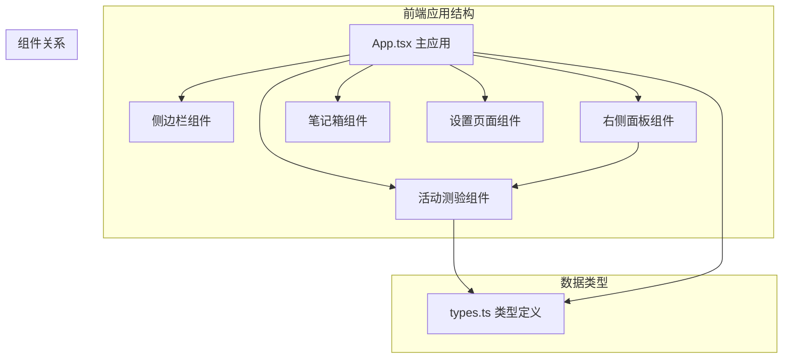
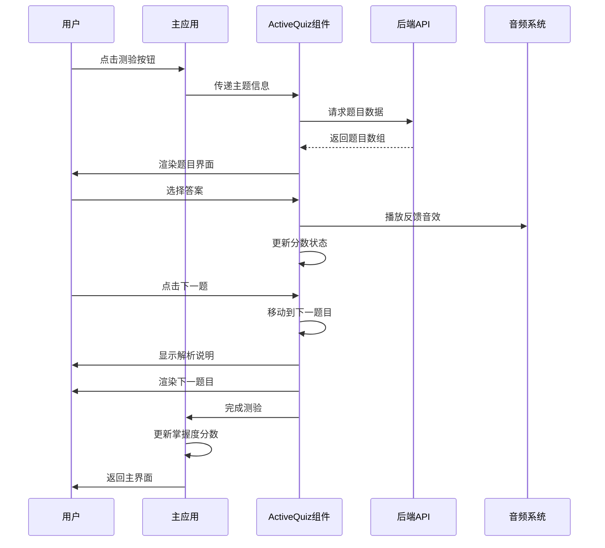
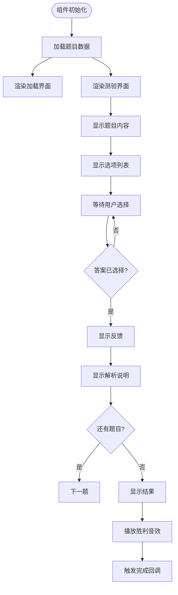
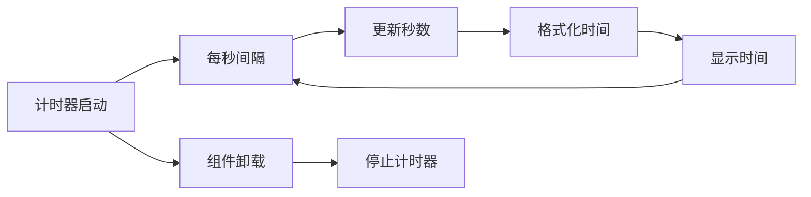
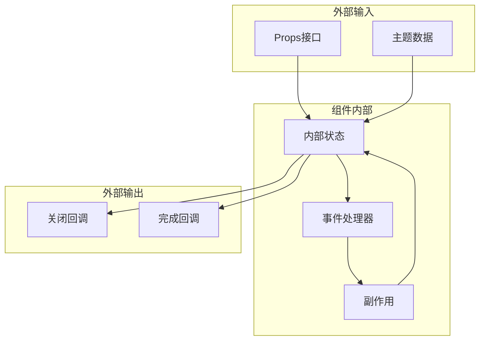
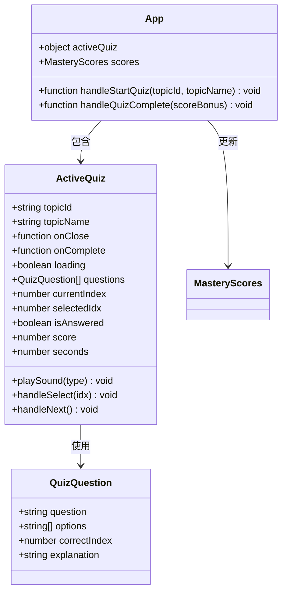

# 活动测验组件

<cite>
**本文档引用的文件**
- [ActiveQuiz.tsx](file://front/src/components/ActiveQuiz.tsx)
- [types.ts](file://front/src/types.ts)
- [App.tsx](file://front/src/App.tsx)
</cite>

## 目录
1. [简介](#简介)
2. [项目结构](#项目结构)
3. [核心组件](#核心组件)
4. [架构概览](#架构概览)
5. [详细组件分析](#详细组件分析)
6. [依赖关系分析](#依赖关系分析)
7. [性能考虑](#性能考虑)
8. [故障排除指南](#故障排除指南)
9. [结论](#结论)
10. [附录](#附录)

## 简介
本文档深入解析Quickly项目中的ActiveQuiz活动测验组件，这是一个基于React和TypeScript构建的交互式测验系统。该组件提供了完整的测验体验，包括题目渲染、答案提交、即时反馈、计时机制和分数计算。组件采用现代化的UI设计，结合Web Audio API提供触觉反馈，并通过动画库增强用户体验。

ActiveQuiz组件位于前端src/components目录中，是Quickly学习平台的重要组成部分，负责为用户提供针对性的知识测验功能，帮助用户评估和提升在特定主题上的掌握程度。

## 项目结构
Quickly项目的前端结构采用模块化设计，ActiveQuiz组件作为独立的功能模块集成在整个应用架构中：



**图表来源**
- [App.tsx: 32-35:32-35](file://front/src/App.tsx#L32-L35)
- [ActiveQuiz.tsx: 13](file://front/src/components/ActiveQuiz.tsx#L13)
- [types.ts: 23-28:23-28](file://front/src/types.ts#L23-L28)

**章节来源**
- [App.tsx: 305-839:305-839](file://front/src/App.tsx#L305-L839)
- [ActiveQuiz.tsx: 1-331:1-331](file://front/src/components/ActiveQuiz.tsx#L1-L331)
- [types.ts: 1-29:1-29](file://front/src/types.ts#L1-L29)

## 核心组件
ActiveQuiz组件是一个功能完整的测验系统，具备以下核心特性：

### 组件接口定义
组件通过明确的Props接口接收外部参数：
- `topicId`: string - 测验主题标识符
- `topicName`: string - 测验主题名称
- `onClose`: () => void - 关闭回调函数
- `onComplete`: (scoreBonus: number) => void - 完成回调函数，返回分数奖励

### 状态管理系统
组件内部维护多个关键状态：
- `loading`: 布尔值 - 控制题目加载状态
- `questions`: QuizQuestion[] - 存储测验题目数组
- `currentIndex`: number - 当前题目索引
- `selectedIdx`: number | null - 用户选择的答案索引
- `isAnswered`: boolean - 标记题目是否已作答
- `score`: number - 用户得分
- `seconds`: number - 计时器秒数

### 音频反馈系统
组件集成了Web Audio API，提供三种触觉反馈音效：
- 正确答案：悦耳的音调上升效果
- 错误答案：低沉的降调效果
- 测验完成：庆祝性的音阶序列

**章节来源**
- [ActiveQuiz.tsx: 15-31:15-31](file://front/src/components/ActiveQuiz.tsx#L15-L31)
- [ActiveQuiz.tsx: 32-71:32-71](file://front/src/components/ActiveQuiz.tsx#L32-L71)

## 架构概览
ActiveQuiz组件在整个应用架构中扮演着关键角色，通过状态管理和事件回调与主应用进行交互：



**图表来源**
- [App.tsx: 262-285:262-285](file://front/src/App.tsx#L262-L285)
- [ActiveQuiz.tsx: 74-91:74-91](file://front/src/components/ActiveQuiz.tsx#L74-L91)
- [ActiveQuiz.tsx: 108-137:108-137](file://front/src/components/ActiveQuiz.tsx#L108-L137)

## 详细组件分析

### 题目渲染系统
ActiveQuiz组件实现了动态题目渲染机制，支持多种题目状态的视觉反馈：



**图表来源**
- [ActiveQuiz.tsx: 174-326:174-326](file://front/src/components/ActiveQuiz.tsx#L174-L326)
- [ActiveQuiz.tsx: 228-325:228-325](file://front/src/components/ActiveQuiz.tsx#L228-L325)

### 答题交互逻辑
组件的答题系统采用了即时反馈机制，确保用户能够及时获得答题结果：

```mermaid
stateDiagram-v2
[*] --> Loading
Loading --> QuestionScreen : 题目加载完成
state QuestionScreen {
[*] --> WaitingForAnswer
WaitingForAnswer --> AnswerSelected : 用户选择答案
AnswerSelected --> ShowingFeedback : 显示反馈
ShowingFeedback --> NextQuestion : 下一题
NextQuestion --> QuestionScreen : 还有题目
NextQuestion --> ResultsScreen : 测验完成
ResultsScreen --> [*]
}
QuestionScreen --> [*] : 用户关闭
```

**图表来源**
- [ActiveQuiz.tsx: 108-137:108-137](file://front/src/components/ActiveQuiz.tsx#L108-L137)
- [ActiveQuiz.tsx: 228-325:228-325](file://front/src/components/ActiveQuiz.tsx#L228-L325)

### 计时机制实现
组件内置了实时计时系统，为用户提供时间感知：



**图表来源**
- [ActiveQuiz.tsx: 94-99:94-99](file://front/src/components/ActiveQuiz.tsx#L94-L99)
- [ActiveQuiz.tsx: 101-105:101-105](file://front/src/components/ActiveQuiz.tsx#L101-L105)

**章节来源**
- [ActiveQuiz.tsx: 174-326:174-326](file://front/src/components/ActiveQuiz.tsx#L174-L326)

### 分数计算逻辑
组件实现了基于正确率的奖励计算系统：

| 计算阶段 | 公式 | 描述 |
|---------|------|------|
| 基础分数 | score = 正确答案数量 | 统计用户答对的题目数量 |
| 正确率计算 | accuracy = score / totalQuestions | 计算整体正确率百分比 |
| 奖励倍数 | bonusMultiplier = round(accuracy × 10) | 将正确率转换为奖励倍数 |
| 最终奖励 | finalBonus = bonusMultiplier | 奖励值等于倍数 |

**章节来源**
- [ActiveQuiz.tsx: 128-130:128-130](file://front/src/components/ActiveQuiz.tsx#L128-L130)
- [App.tsx: 268-284:268-284](file://front/src/App.tsx#L268-L284)

### 数据流处理
组件的数据流遵循单向数据流原则，确保状态管理的可预测性：



**图表来源**
- [ActiveQuiz.tsx: 22-31:22-31](file://front/src/components/ActiveQuiz.tsx#L22-L31)
- [ActiveQuiz.tsx: 15-20:15-20](file://front/src/components/ActiveQuiz.tsx#L15-L20)

**章节来源**
- [ActiveQuiz.tsx: 15-31:15-31](file://front/src/components/ActiveQuiz.tsx#L15-L31)

## 依赖关系分析

### 组件间依赖
ActiveQuiz组件与主应用存在紧密的依赖关系：



**图表来源**
- [ActiveQuiz.tsx: 15-31:15-31](file://front/src/components/ActiveQuiz.tsx#L15-L31)
- [App.tsx: 97-98:97-98](file://front/src/App.tsx#L97-L98)
- [types.ts: 23-28:23-28](file://front/src/types.ts#L23-L28)

### 外部依赖
组件依赖于以下外部库和API：

| 依赖项 | 版本 | 用途 |
|--------|------|------|
| React | ^18.0 | 核心框架 |
| motion/react | ^11.0 | 动画库 |
| lucide-react | ^0.299 | 图标库 |
| Web Audio API | 原生 | 音频反馈 |

**章节来源**
- [ActiveQuiz.tsx: 1-12:1-12](file://front/src/components/ActiveQuiz.tsx#L1-L12)
- [App.tsx: 262-285:262-285](file://front/src/App.tsx#L262-L285)

## 性能考虑
ActiveQuiz组件在设计时充分考虑了性能优化：

### 内存管理
- 使用React的useState和useEffect钩子确保组件状态的正确清理
- 计时器在组件卸载时自动清理，防止内存泄漏
- 音频上下文在浏览器策略阻止时优雅降级

### 渲染优化
- 使用条件渲染避免不必要的DOM更新
- 动画使用CSS过渡而非JavaScript动画
- 选项列表使用虚拟滚动减少DOM节点数量

### 网络请求优化
- 题目数据一次性加载，避免重复请求
- 加载状态提供良好的用户体验
- 错误处理确保应用稳定性

## 故障排除指南

### 常见问题及解决方案

#### 音频反馈问题
**症状**: 音效无法播放
**原因**: 浏览器安全策略阻止音频上下文
**解决方案**: 组件已实现try-catch包装，音频播放失败时不会影响其他功能

#### 题目加载失败
**症状**: 测验界面显示加载状态但不更新
**原因**: API请求失败或网络问题
**解决方案**: 组件包含错误处理逻辑，会在控制台记录错误并保持加载状态

#### 计时器异常
**症状**: 时间显示异常或停止
**原因**: 计时器清理不当
**解决方案**: 组件在卸载时自动清理计时器，确保资源正确释放

**章节来源**
- [ActiveQuiz.tsx: 68-71:68-71](file://front/src/components/ActiveQuiz.tsx#L68-L71)
- [ActiveQuiz.tsx: 84-88:84-88](file://front/src/components/ActiveQuiz.tsx#L84-L88)
- [ActiveQuiz.tsx: 98-99:98-99](file://front/src/components/ActiveQuiz.tsx#L98-L99)

## 结论
ActiveQuiz组件是一个设计精良的交互式测验系统，具备以下优势：

1. **完整的功能覆盖**: 从题目加载到结果展示的全流程支持
2. **优秀的用户体验**: 即时反馈、动画效果和触觉音效
3. **清晰的状态管理**: 单向数据流和明确的组件职责
4. **良好的性能表现**: 优化的渲染和资源管理
5. **可扩展的设计**: 模块化的架构便于功能扩展

该组件成功地将教育测验功能与现代Web技术相结合，为用户提供了沉浸式的学习体验。其架构设计为未来的功能扩展奠定了坚实的基础。

## 附录

### API接口规范
组件通过以下API与后端通信：

**请求方法**: POST `/api/quiz`
**请求体**: `{ "topic": string }`
**响应体**: `{ "quiz": QuizQuestion[] }`

### 扩展指南

#### 添加新题目类型
1. 在types.ts中扩展QuizQuestion接口
2. 更新后端API以支持新类型
3. 在组件中添加相应的渲染逻辑

#### 集成难度分级
1. 在QuizQuestion接口中添加difficulty字段
2. 更新样式系统以支持不同难度的颜色编码
3. 实现难度相关的奖励计算

#### 个性化推荐
1. 扩展后端API以支持基于用户表现的题目推荐
2. 实现智能题目选择算法
3. 添加用户学习历史跟踪

**章节来源**
- [types.ts: 23-28:23-28](file://front/src/types.ts#L23-L28)
- [ActiveQuiz.tsx: 77-83:77-83](file://front/src/components/ActiveQuiz.tsx#L77-L83)