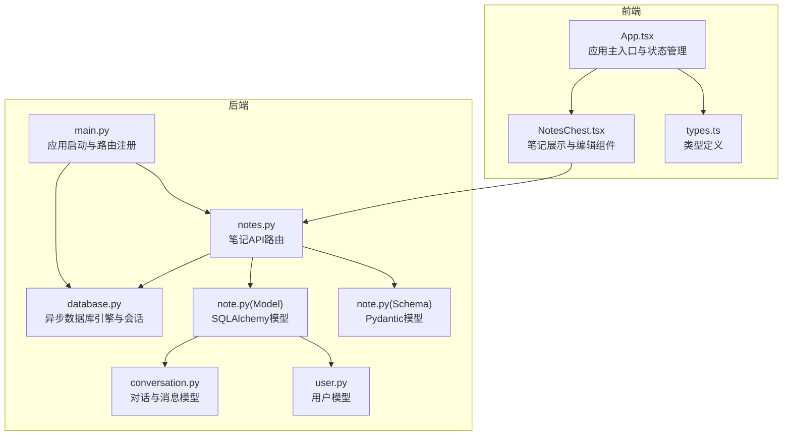
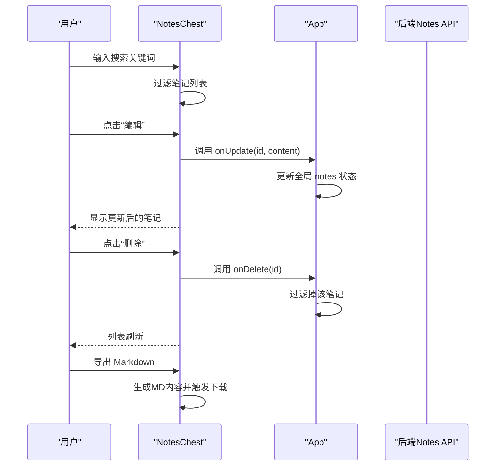
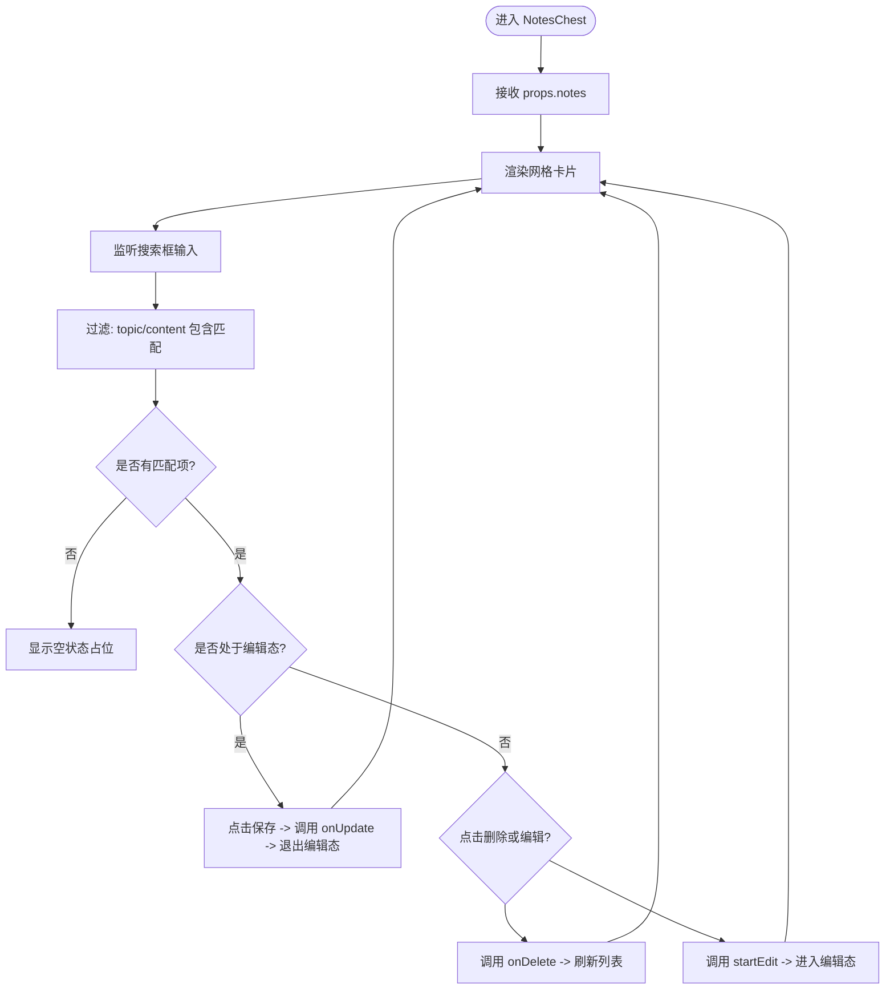
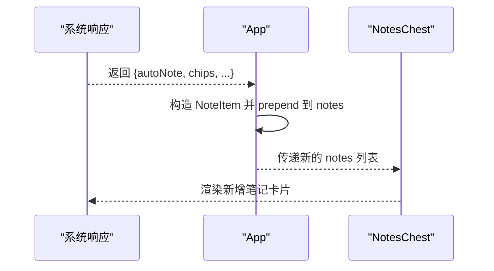
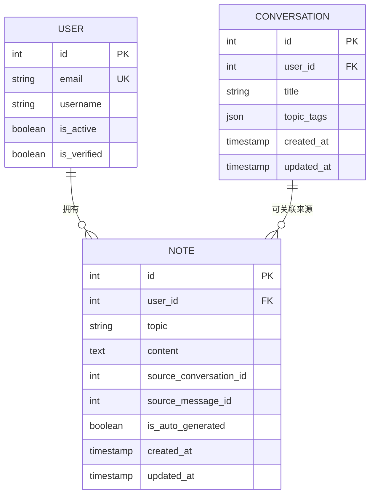
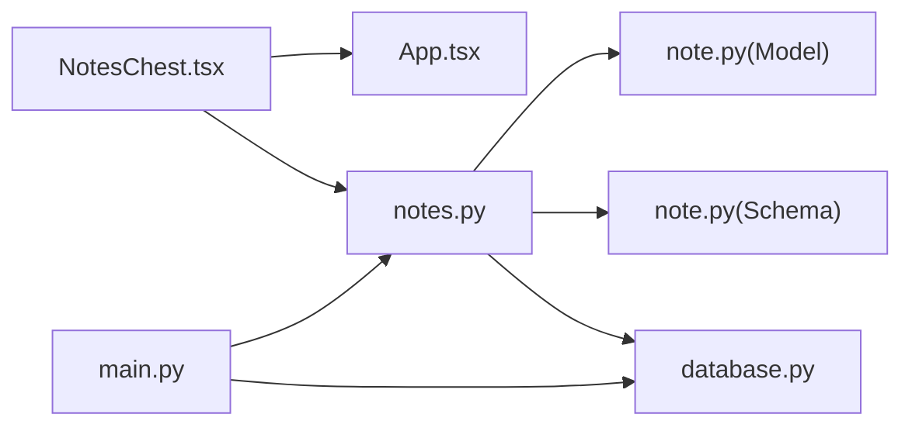

# 笔记管理组件

<cite>
**本文引用的文件**
- [NotesChest.tsx](file://front/src/components/NotesChest.tsx)
- [App.tsx](file://front/src/App.tsx)
- [types.ts](file://front/src/types.ts)
- [notes.py](file://backend/app/api/notes.py)
- [note.py](file://backend/app/models/note.py)
- [note.py](file://backend/app/schemas/note.py)
- [database.py](file://backend/app/core/database.py)
- [main.py](file://backend/app/main.py)
- [conversation.py](file://backend/app/models/conversation.py)
- [user.py](file://backend/app/models/user.py)
</cite>

## 目录
1. [简介](#简介)
2. [项目结构](#项目结构)
3. [核心组件](#核心组件)
4. [架构总览](#架构总览)
5. [详细组件分析](#详细组件分析)
6. [依赖分析](#依赖分析)
7. [性能考虑](#性能考虑)
8. [故障排查指南](#故障排查指南)
9. [结论](#结论)
10. [附录](#附录)

## 简介
本技术文档围绕 Quickly 项目中的笔记管理组件 NotesChest 展开，系统性阐述其笔记展示、搜索过滤、编辑与批量操作能力，以及与后端的 CRUD 数据交互、状态管理与持久化策略。同时覆盖笔记编辑器的集成思路、Markdown 渲染与富文本编辑的扩展方案、组件 Props 接口、事件处理与数据流管理，并补充笔记分类与标签管理、导出功能的实现要点与优化建议。

## 项目结构
NotesChest 组件位于前端 src/components 目录下，作为主应用 App 的一个标签页呈现；后端提供基于 FastAPI 的 Notes API，配合 SQLAlchemy ORM 模型与 Pydantic Schema 实现笔记数据的增删改查与序列化。

图表来源
- [App.tsx](file://front/src/App.tsx)
- [NotesChest.tsx](file://front/src/components/NotesChest.tsx)
- [types.ts](file://front/src/types.ts)
- [main.py](file://backend/app/main.py)
- [database.py](file://backend/app/core/database.py)
- [notes.py](file://backend/app/api/notes.py)
- [note.py](file://backend/app/models/note.py)
- [note.py](file://backend/app/schemas/note.py)
- [conversation.py](file://backend/app/models/conversation.py)
- [user.py](file://backend/app/models/user.py)

章节来源
- [App.tsx](file://front/src/App.tsx)
- [NotesChest.tsx](file://front/src/components/NotesChest.tsx)
- [types.ts](file://front/src/types.ts)
- [main.py](file://backend/app/main.py)
- [database.py](file://backend/app/core/database.py)
- [notes.py](file://backend/app/api/notes.py)
- [note.py](file://backend/app/models/note.py)
- [note.py](file://backend/app/schemas/note.py)
- [conversation.py](file://backend/app/models/conversation.py)
- [user.py](file://backend/app/models/user.py)

## 核心组件
- NotesChest：负责笔记列表渲染、搜索过滤、单条笔记编辑与删除、批量导出 Markdown。
- App：全局状态管理（如 notes 数组）、与后端交互（自动笔记注入）、路由切换到笔记页。
- 类型系统：统一的 NoteItem 接口，确保前后端数据契约一致。
- 后端 Notes API：提供分页、搜索、CRUD 的完整接口；模型与 Schema 定义数据结构与校验规则。

章节来源
- [NotesChest.tsx](file://front/src/components/NotesChest.tsx)
- [App.tsx](file://front/src/App.tsx)
- [types.ts](file://front/src/types.ts)
- [notes.py](file://backend/app/api/notes.py)
- [note.py](file://backend/app/models/note.py)
- [note.py](file://backend/app/schemas/note.py)

## 架构总览
NotesChest 通过 props 接收 notes 列表与回调函数 onDelete/onUpdate，内部维护本地搜索词 searchTerm 与编辑态 editingId/editText。当用户触发编辑或删除时，组件调用父级传入的回调，由 App 更新全局 notes 状态；同时 App 在聊天流程中可自动注入新笔记到 notes 列表顶部。

图表来源
- [NotesChest.tsx](file://front/src/components/NotesChest.tsx)
- [App.tsx](file://front/src/App.tsx)
- [notes.py](file://backend/app/api/notes.py)

## 详细组件分析

### NotesChest 组件
- Props 接口
  - notes: NoteItem[]
  - onDelete: (id: string) => void
  - onUpdate: (id: string, updatedContent: string) => void
  - onClose?: () => void
- 关键状态
  - searchTerm: 本地搜索词，支持主题与内容模糊匹配
  - editingId: 当前编辑的笔记 id
  - editText: 当前编辑的文本内容
- 主要功能
  - 列表渲染：网格布局，卡片式展示主题、时间戳与内容；支持动画进入/退出
  - 搜索过滤：按 topic 与 content 不区分大小写包含匹配
  - 编辑模式：点击编辑按钮进入 textarea 编辑，保存后调用 onUpdate 并退出编辑态
  - 删除操作：点击删除按钮调用 onDelete
  - 导出 Markdown：遍历所有笔记，拼接标题与内容，生成 Blob 并触发浏览器下载
- 事件与数据流
  - 用户输入 -> setSearchTerm -> filteredNotes 变化
  - 编辑/保存/删除 -> onUpdate/onDelete -> App 更新全局 notes
  - 导出 -> 本地生成 MD 文件 -> 浏览器下载

图表来源
- [NotesChest.tsx](file://front/src/components/NotesChest.tsx)

章节来源
- [NotesChest.tsx](file://front/src/components/NotesChest.tsx)

### App.tsx 中的状态与数据流
- 全局 notes 状态：初始包含一条示例笔记，后续通过聊天自动注入新笔记至数组首部
- 删除与更新回调：deleteNote/filter 与 updateNote/map，均在 App 内部维护
- 自动笔记注入：当聊天响应携带 autoNote 字段时，构造 NoteItem 并 prepend 到 notes
- 路由切换：activeTab 控制当前显示 study/notes/mastery/path/review 等面板

图表来源
- [App.tsx](file://front/src/App.tsx)
- [NotesChest.tsx](file://front/src/components/NotesChest.tsx)

章节来源
- [App.tsx](file://front/src/App.tsx)

### 后端 Notes API 与数据模型
- 路由与查询参数
  - GET /api/notes：支持 search、skip、limit 查询；按 updated_at 倒序返回
  - GET /api/notes/{note_id}：按 id 获取单条笔记
  - POST /api/notes：创建笔记（含 topic、content、source_*、is_auto_generated）
  - PUT /api/notes/{note_id}：更新笔记（可选 topic、content）
  - DELETE /api/notes/{note_id}：删除笔记
- 数据模型与字段
  - Note：id、user_id、topic、content、source_conversation_id、source_message_id、is_auto_generated、created_at、updated_at
  - 关系：Note -> User、Note -> Conversation（通过外键）
- 序列化
  - NoteCreate/NoteUpdate/NoteResponse：Pydantic 模型，保证请求与响应格式一致

图表来源
- [note.py](file://backend/app/models/note.py)
- [user.py](file://backend/app/models/user.py)
- [conversation.py](file://backend/app/models/conversation.py)

章节来源
- [notes.py](file://backend/app/api/notes.py)
- [note.py](file://backend/app/models/note.py)
- [note.py](file://backend/app/schemas/note.py)
- [user.py](file://backend/app/models/user.py)
- [conversation.py](file://backend/app/models/conversation.py)

### 类型系统与数据契约
- NoteItem：id、topic、content、timestamp
- 作用：确保前端 NotesChest 与 App 对笔记数据的统一理解，避免类型不一致导致的渲染或逻辑错误

章节来源
- [types.ts](file://front/src/types.ts)

### Markdown 渲染与富文本编辑集成方案
- Markdown 渲染
  - 当前 NotesChest 使用纯文本展示，若需渲染 Markdown，可在组件内引入轻量渲染库（如 react-markdown），将 note.content 作为源进行渲染
  - 注意：为安全考虑，建议结合 DOMPurify 或同等工具清理潜在危险 HTML
- 富文本编辑
  - 可替换为 textarea 为富文本编辑器（如 Draft.js、Slate、TipTap），并在保存时转换为 Markdown 文本存储
  - 若采用富文本，需在 Schema 中增加字段以区分内容格式，并在导出时按格式生成相应内容

说明：以上为扩展建议，当前仓库未包含具体 Markdown 渲染或富文本编辑实现。

## 依赖分析
- 前端
  - NotesChest 依赖 React Hooks（useState、useEffect）、motion/react（动画）、lucide-react（图标）
  - App 提供全局状态与回调，NotesChest 通过 props 与之解耦
- 后端
  - FastAPI 路由依赖 SQLAlchemy 异步会话、Pydantic 校验
  - 数据库引擎按环境动态配置，SQLite 与 PostgreSQL 差异处理

图表来源
- [NotesChest.tsx](file://front/src/components/NotesChest.tsx)
- [App.tsx](file://front/src/App.tsx)
- [notes.py](file://backend/app/api/notes.py)
- [note.py](file://backend/app/models/note.py)
- [note.py](file://backend/app/schemas/note.py)
- [database.py](file://backend/app/core/database.py)
- [main.py](file://backend/app/main.py)

章节来源
- [NotesChest.tsx](file://front/src/components/NotesChest.tsx)
- [App.tsx](file://front/src/App.tsx)
- [notes.py](file://backend/app/api/notes.py)
- [database.py](file://backend/app/core/database.py)
- [main.py](file://backend/app/main.py)

## 性能考虑
- 列表渲染
  - 使用虚拟滚动（如 react-window 或 react-virtualized）处理大量笔记时的渲染性能
  - 仅在 searchTerm 变化时重新过滤，避免每次渲染都执行 filter
- 搜索
  - 前端搜索适合中小规模数据；大规模数据建议后端分页 + 搜索（当前 API 已支持）
  - 可加入防抖（debounce）减少频繁 re-render
- 编辑体验
  - 编辑态仅更新当前卡片，避免整表重绘
  - 保存时调用 onUpdate，App 侧一次性更新状态，减少多次渲染
- 导出
  - 大量笔记导出时注意内存占用，可考虑分块生成或服务端导出
- 数据库
  - 异步会话与连接池配置已在 database.py 中按数据库类型差异化处理，生产环境建议启用连接池参数

## 故障排查指南
- 笔记未显示或为空
  - 检查 App 是否正确将 notes 通过 props 传给 NotesChest
  - 确认搜索词是否过长或包含特殊字符导致匹配失败
- 编辑保存无效
  - 确认 onUpdate 回调是否被正确传入 App，并检查 App 内 updateNote 的实现
- 删除后未生效
  - 确认 onDelete 回调是否被调用，App 内 deleteNote 是否正确过滤
- 导出失败
  - 检查 notes 是否为空；确认浏览器允许下载；尝试更换浏览器或禁用广告拦截
- 后端接口异常
  - 确认 /api/notes 路由已注册（main.py）
  - 检查数据库连接与表结构是否创建（lifespan 初始化）

章节来源
- [NotesChest.tsx](file://front/src/components/NotesChest.tsx)
- [App.tsx](file://front/src/App.tsx)
- [notes.py](file://backend/app/api/notes.py)
- [main.py](file://backend/app/main.py)
- [database.py](file://backend/app/core/database.py)

## 结论
NotesChest 组件以简洁的 Props 接口与本地状态管理实现了笔记的展示、搜索、编辑与删除，并通过 App 的全局状态与后端 Notes API 形成清晰的数据流闭环。当前实现聚焦于基础 CRUD 与 Markdown 导出，为进一步增强可扩展性，建议引入富文本编辑、Markdown 渲染、标签与分类体系、以及服务端分页与搜索优化。

## 附录

### 组件 Props 接口定义
- NotesChestProps
  - notes: NoteItem[]
  - onDelete: (id: string) => void
  - onUpdate: (id: string, updatedContent: string) => void
  - onClose?: () => void

章节来源
- [NotesChest.tsx](file://front/src/components/NotesChest.tsx)
- [types.ts](file://front/src/types.ts)

### 后端 Notes API 端点概览
- GET /api/notes?search=&skip=&limit=
- GET /api/notes/{note_id}
- POST /api/notes
- PUT /api/notes/{note_id}
- DELETE /api/notes/{note_id}

章节来源
- [notes.py](file://backend/app/api/notes.py)