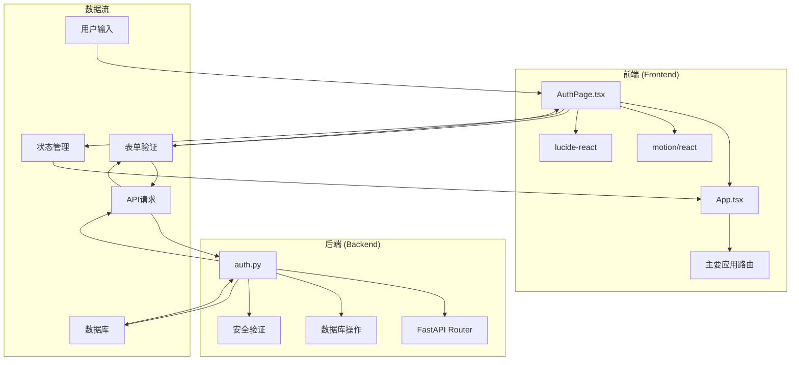
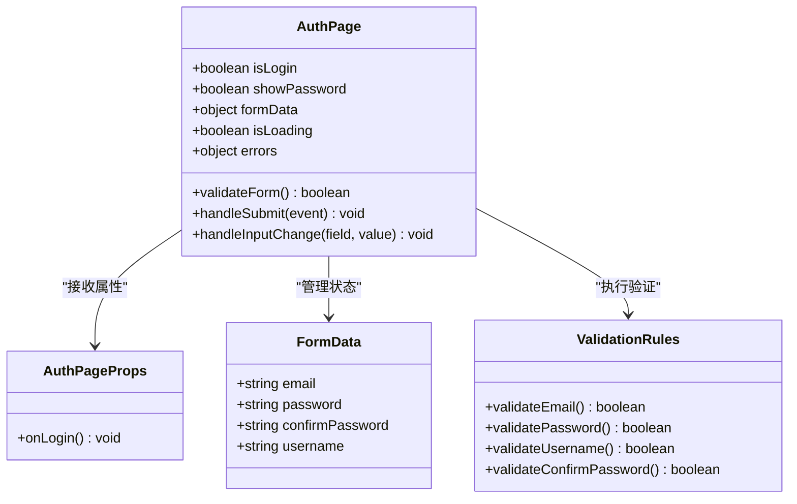
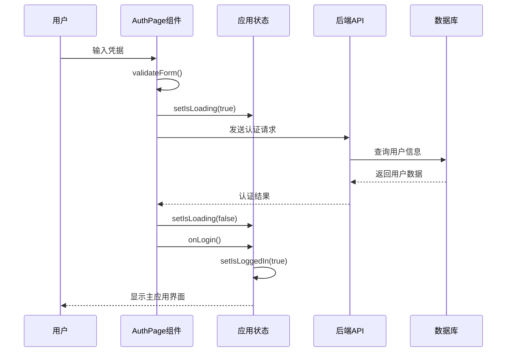
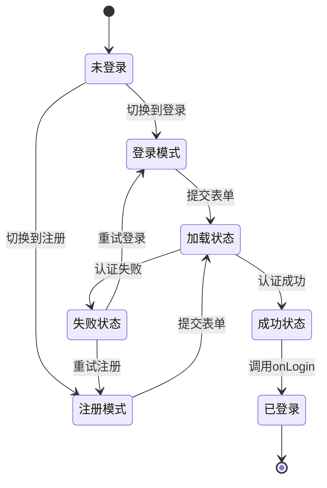
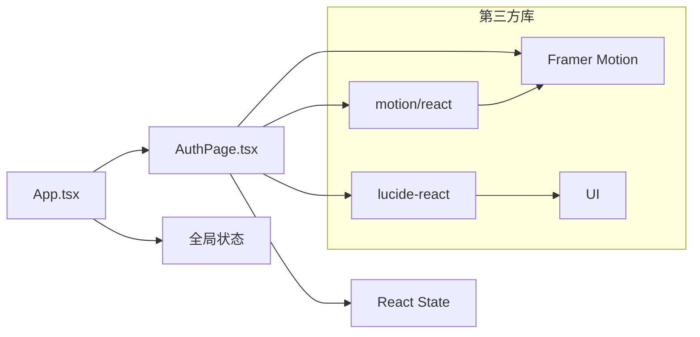

# 认证页面组件

<cite>
**本文档引用的文件**
- [AuthPage.tsx](file://front/src/components/AuthPage.tsx)
- [App.tsx](file://front/src/App.tsx)
- [auth.py](file://backend/app/api/auth.py)
- [user.py](file://backend/app/schemas/user.py)
- [types.ts](file://front/src/types.ts)
</cite>

## 目录
1. [简介](#简介)
2. [项目结构](#项目结构)
3. [核心组件](#核心组件)
4. [架构概览](#架构概览)
5. [详细组件分析](#详细组件分析)
6. [依赖关系分析](#依赖关系分析)
7. [性能考虑](#性能考虑)
8. [故障排除指南](#故障排除指南)
9. [结论](#结论)

## 简介

Quickly认证页面组件是一个现代化的React认证界面，提供了完整的用户登录和注册功能。该组件采用深色主题设计，支持表单验证、动画过渡效果和社交登录集成。本文档将深入分析AuthPage组件的设计架构、实现细节和最佳实践。

## 项目结构

Quickly项目采用前后端分离架构，认证功能由前端React组件和后端FastAPI服务共同实现：



**图表来源**
- [AuthPage.tsx:1-320](file://front/src/components/AuthPage.tsx#L1-L320)
- [App.tsx:297-303](file://front/src/App.tsx#L297-L303)
- [auth.py:19-86](file://backend/app/api/auth.py#L19-L86)

**章节来源**
- [AuthPage.tsx:1-320](file://front/src/components/AuthPage.tsx#L1-L320)
- [App.tsx:1-840](file://front/src/App.tsx#L1-L840)

## 核心组件

AuthPage组件是整个认证系统的核心，负责处理用户的身份验证流程。该组件实现了完整的认证生命周期管理，包括表单渲染、数据验证、状态管理和用户反馈。

### 组件架构设计



**图表来源**
- [AuthPage.tsx:15-77](file://front/src/components/AuthPage.tsx#L15-L77)

### 主要特性

1. **双模式切换**: 支持登录和注册两种模式的无缝切换
2. **实时验证**: 表单字段的即时验证和错误提示
3. **动画效果**: 使用Framer Motion实现流畅的过渡动画
4. **响应式设计**: 适配各种屏幕尺寸的设备
5. **无障碍支持**: 符合WCAG标准的可访问性设计

**章节来源**
- [AuthPage.tsx:19-320](file://front/src/components/AuthPage.tsx#L19-L320)

## 架构概览

认证系统的整体架构采用分层设计，从前端界面到后端服务形成完整的认证链路：



**图表来源**
- [AuthPage.tsx:59-70](file://front/src/components/AuthPage.tsx#L59-L70)
- [App.tsx:297-303](file://front/src/App.tsx#L297-L303)

## 详细组件分析

### Props接口定义

AuthPage组件通过简洁的Props接口实现松耦合设计：

| 属性名 | 类型 | 必需 | 描述 |
|--------|------|------|------|
| onLogin | () => void | 是 | 认证成功后的回调函数 |

**章节来源**
- [AuthPage.tsx:15-17](file://front/src/components/AuthPage.tsx#L15-L17)

### 状态管理机制

组件使用React Hooks实现状态管理，包括本地状态和全局状态：



**图表来源**
- [AuthPage.tsx:20-29](file://front/src/components/AuthPage.tsx#L20-L29)

### 表单验证系统

AuthPage实现了严格的表单验证规则，确保数据的完整性和安全性：

#### 验证规则矩阵

| 字段 | 验证规则 | 错误消息 | 验证时机 |
|------|----------|----------|----------|
| email | 非空检查 | 请输入邮箱地址 | 失去焦点时 |
| email | 格式验证 | 请输入有效的邮箱地址 | 失去焦点时 |
| password | 非空检查 | 请输入密码 | 失去焦点时 |
| password | 长度验证 | 密码至少需要6个字符 | 失去焦点时 |
| username | 非空检查 | 请输入用户名 | 失去焦点时 | 注册模式 |
| confirmPassword | 匹配验证 | 两次输入的密码不一致 | 失去焦点时 | 注册模式 |

**章节来源**
- [AuthPage.tsx:31-57](file://front/src/components/AuthPage.tsx#L31-L57)

### 事件处理机制

组件采用事件驱动的方式处理用户交互：

```mermaid
flowchart TD
A[用户输入] --> B{表单提交?}
B --> |是| C[validateForm()]
B --> |否| D[handleInputChange]
C --> E{验证通过?}
E --> |否| F[显示错误信息]
E --> |是| G[setIsLoading(true)]
G --> H[handleSubmit]
H --> I[模拟API调用]
I --> J[setIsLoading(false)]
J --> K[onLogin()]
D --> L[更新表单数据]
L --> M[清除相关错误]
F --> N[等待修正]
K --> O[认证成功]
```

**图表来源**
- [AuthPage.tsx:59-77](file://front/src/components/AuthPage.tsx#L59-L77)

**章节来源**
- [AuthPage.tsx:72-77](file://front/src/components/AuthPage.tsx#L72-L77)

### 错误处理策略

AuthPage组件实现了多层次的错误处理机制：

1. **表单级错误**: 实时显示字段验证错误
2. **网络级错误**: 处理API调用失败
3. **状态级错误**: 管理认证流程中的异常状态

错误处理遵循以下原则：
- 用户友好的错误消息
- 最小化的错误状态影响
- 清晰的恢复路径

**章节来源**
- [AuthPage.tsx:29](file://front/src/components/AuthPage.tsx#L29)

### UI/UX设计特点

#### 视觉设计系统

| 设计元素 | 颜色值 | 用途 |
|----------|--------|------|
| 主背景 | #121411 | 页面背景 |
| 卡片背景 | #1a1c19 | 认证卡片 |
| 输入框背景 | #222222 | 表单输入区域 |
| 主色调 | #b8f600 | 交互元素 |
| 文本颜色 | #e3e3de | 主要文本 |
| 辅助色 | #c3caac | 次要文本 |

#### 动画系统

组件使用Framer Motion实现流畅的动画效果：
- 页面进入动画：缩放和透明度渐变
- 表单切换动画：高度和透明度变化
- 加载动画：旋转指示器
- 错误反馈：轻微的抖动效果

**章节来源**
- [AuthPage.tsx:84-108](file://front/src/components/AuthPage.tsx#L84-L108)

### 可访问性设计

AuthPage组件遵循WCAG 2.1 AA标准，确保所有用户都能正常使用：

1. **键盘导航**: 完整的键盘操作支持
2. **屏幕阅读器**: 适当的ARIA标签和语义化标记
3. **色彩对比**: 符合对比度要求的颜色方案
4. **焦点管理**: 清晰的焦点指示器

### 响应式布局

组件采用移动优先的设计理念，适配各种设备：

- 移动端：单列布局，触摸友好的按钮尺寸
- 平板端：适度调整间距和字体大小
- 桌面端：最大化内容密度和信息层次

**章节来源**
- [AuthPage.tsx:80-318](file://front/src/components/AuthPage.tsx#L80-L318)

## 依赖关系分析

### 前端依赖关系



**图表来源**
- [AuthPage.tsx:1-13](file://front/src/components/AuthPage.tsx#L1-L13)
- [App.tsx:28-35](file://front/src/App.tsx#L28-L35)

### 后端集成

认证组件与后端API的集成点：

| API端点 | 方法 | 功能 | 状态码 |
|---------|------|------|--------|
| `/api/auth/login` | POST | 用户登录 | 200/401 |
| `/api/auth/register` | POST | 用户注册 | 201/400 |
| `/api/auth/me` | GET | 获取用户信息 | 200/401 |

**章节来源**
- [auth.py:52-86](file://backend/app/api/auth.py#L52-L86)

## 性能考虑

### 渲染优化

1. **条件渲染**: 使用`AnimatePresence`实现高效的元素切换
2. **状态最小化**: 仅在必要时更新组件状态
3. **事件节流**: 防止频繁的表单验证触发

### 加载优化

1. **异步处理**: 使用`setTimeout`模拟API延迟
2. **防重复提交**: 通过`isLoading`状态防止重复提交
3. **内存管理**: 及时清理表单状态和错误信息

## 故障排除指南

### 常见问题及解决方案

| 问题类型 | 症状 | 解决方案 |
|----------|------|----------|
| 表单验证失败 | 错误消息不显示 | 检查`validateForm`函数逻辑 |
| 认证超时 | 加载指示器持续显示 | 验证API连接和服务器状态 |
| 状态同步问题 | UI与状态不一致 | 检查`setIsLoading`调用时机 |
| 动画异常 | 过渡效果不工作 | 确认Framer Motion版本兼容性 |

### 调试技巧

1. **开发者工具**: 使用React DevTools检查组件状态
2. **网络监控**: 查看API请求和响应
3. **控制台日志**: 添加必要的调试信息
4. **状态快照**: 记录关键状态变化

**章节来源**
- [AuthPage.tsx:59-70](file://front/src/components/AuthPage.tsx#L59-L70)

## 结论

Quickly认证页面组件展现了现代Web应用开发的最佳实践。通过精心设计的架构、完善的验证机制和优秀的用户体验，该组件为整个应用提供了可靠的认证基础。

### 主要优势

1. **架构清晰**: 分层设计便于维护和扩展
2. **用户体验优秀**: 流畅的动画和直观的界面
3. **代码质量高**: 类型安全和严格的验证
4. **可访问性强**: 符合无障碍标准

### 改进建议

1. **集成真实API**: 替换模拟的认证逻辑
2. **增强错误处理**: 添加更详细的错误恢复机制
3. **性能监控**: 集成性能指标收集
4. **国际化支持**: 添加多语言支持

该组件为Quickly项目奠定了坚实的认证基础，为后续的功能扩展提供了良好的起点。