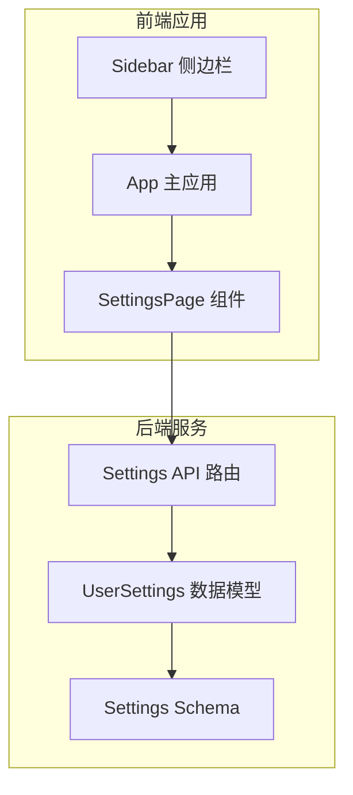
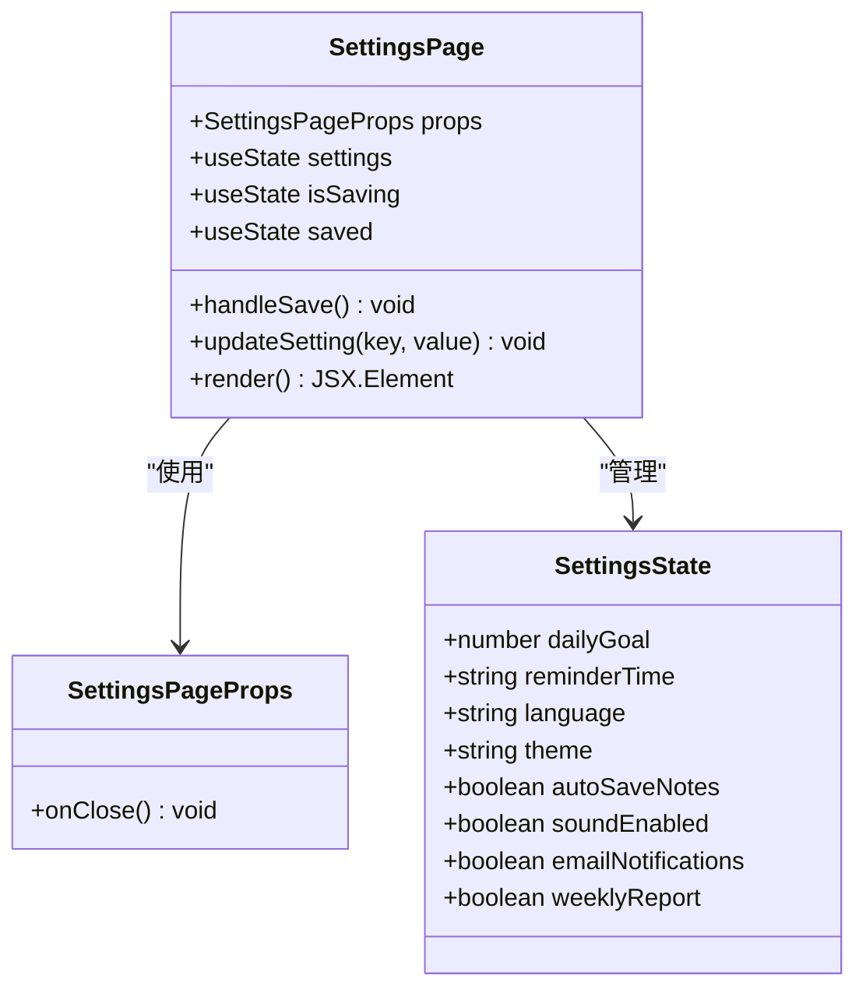
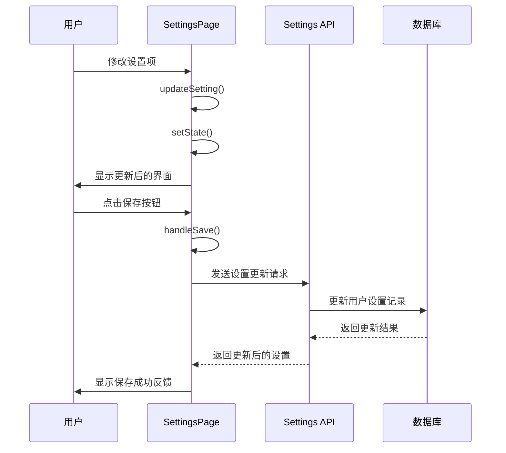
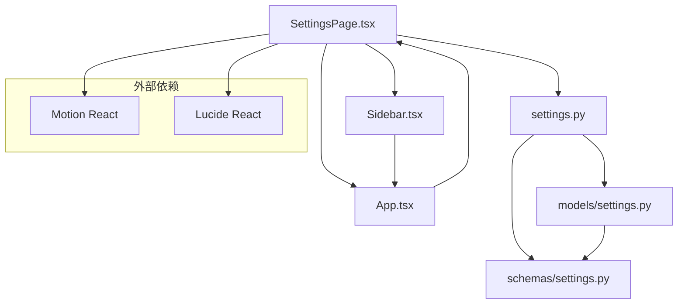

# 设置页面组件

<cite>
**本文档引用的文件**
- [SettingsPage.tsx](file://front/src/components/SettingsPage.tsx)
- [Sidebar.tsx](file://front/src/components/Sidebar.tsx)
- [App.tsx](file://front/src/App.tsx)
- [settings.py](file://backend/app/models/settings.py)
- [settings.py](file://backend/app/schemas/settings.py)
- [settings.py](file://backend/app/api/settings.py)
</cite>

## 目录
1. [简介](#简介)
2. [项目结构](#项目结构)
3. [核心组件](#核心组件)
4. [架构概览](#架构概览)
5. [详细组件分析](#详细组件分析)
6. [依赖关系分析](#依赖关系分析)
7. [性能考虑](#性能考虑)
8. [故障排除指南](#故障排除指南)
9. [结论](#结论)
10. [附录](#附录)

## 简介

Quickly设置页面组件是一个功能完整的用户配置管理界面，提供了全面的个性化设置功能。该组件支持用户偏好设置、主题切换、通知配置等核心功能，采用现代化的React技术栈构建，具备响应式设计和流畅的用户体验。

## 项目结构

Quickly项目采用前后端分离架构，设置页面组件位于前端React应用中，通过API与后端数据库进行数据交互。



**图表来源**
- [SettingsPage.tsx:1-378](file://front/src/components/SettingsPage.tsx#L1-L378)
- [Sidebar.tsx:1-95](file://front/src/components/Sidebar.tsx#L1-L95)
- [App.tsx:1-840](file://front/src/App.tsx#L1-L840)

**章节来源**
- [SettingsPage.tsx:1-378](file://front/src/components/SettingsPage.tsx#L1-L378)
- [Sidebar.tsx:1-95](file://front/src/components/Sidebar.tsx#L1-L95)
- [App.tsx:1-840](file://front/src/App.tsx#L1-L840)

## 核心组件

设置页面组件采用函数式组件设计，使用React Hooks进行状态管理，提供了完整的设置配置功能。

### 组件架构



**图表来源**
- [SettingsPage.tsx:16-45](file://front/src/components/SettingsPage.tsx#L16-L45)

### 设置项分类

组件将设置项分为五个主要类别：

1. **学习目标** - 日常学习时长目标
2. **提醒设置** - 学习提醒和通知配置
3. **语言设置** - 界面语言选择
4. **外观主题** - 深色/浅色主题切换
5. **高级设置** - 其他个性化选项

**章节来源**
- [SettingsPage.tsx:20-30](file://front/src/components/SettingsPage.tsx#L20-L30)
- [SettingsPage.tsx:101-374](file://front/src/components/SettingsPage.tsx#L101-L374)

## 架构概览

设置页面组件采用分层架构设计，从前端UI到后端数据存储形成完整的数据流。



**图表来源**
- [SettingsPage.tsx:35-41](file://front/src/components/SettingsPage.tsx#L35-L41)
- [settings.py:40-64](file://backend/app/api/settings.py#L40-L64)

## 详细组件分析

### Props接口定义

设置页面组件的Props接口简洁明确，只包含一个可选的关闭回调函数：

```typescript
interface SettingsPageProps {
  onClose?: () => void;
}
```

**章节来源**
- [SettingsPage.tsx:16-18](file://front/src/components/SettingsPage.tsx#L16-L18)

### 状态管理策略

组件使用React的useState Hook管理设置状态，采用单一状态对象存储所有设置项：

```typescript
const [settings, setSettings] = useState({
  dailyGoal: 30,
  reminderTime: "09:00",
  language: "zh-CN",
  theme: "dark",
  autoSaveNotes: true,
  soundEnabled: true,
  emailNotifications: true,
  weeklyReport: true
});
```

**章节来源**
- [SettingsPage.tsx:21-30](file://front/src/components/SettingsPage.tsx#L21-L30)

### 数据绑定机制

组件实现了双向数据绑定，通过updateSetting函数动态更新设置状态：

```typescript
const updateSetting = <K extends keyof typeof settings>(key: K, value: typeof settings[K]) => {
  setSettings(prev => ({ ...prev, [key]: value }));
};
```

**章节来源**
- [SettingsPage.tsx:43-45](file://front/src/components/SettingsPage.tsx#L43-L45)

### 表单控件设计

组件提供了多种表单控件类型：

1. **数字选择器** - 学习目标时长选择
2. **时间输入框** - 提醒时间设置
3. **开关控件** - 布尔值设置项
4. **单选按钮** - 主题和语言选择

**章节来源**
- [SettingsPage.tsx:117-151](file://front/src/components/SettingsPage.tsx#L117-L151)
- [SettingsPage.tsx:172-223](file://front/src/components/SettingsPage.tsx#L172-L223)
- [SettingsPage.tsx:243-265](file://front/src/components/SettingsPage.tsx#L243-L265)
- [SettingsPage.tsx:285-315](file://front/src/components/SettingsPage.tsx#L285-L315)

### 交互反馈机制

组件实现了多层次的用户交互反馈：

```typescript
const handleSave = async () => {
  setIsSaving(true);
  await new Promise(resolve => setTimeout(resolve, 1000));
  setIsSaving(false);
  setSaved(true);
  setTimeout(() => setSaved(false), 2000);
};
```

**章节来源**
- [SettingsPage.tsx:35-41](file://front/src/components/SettingsPage.tsx#L35-L41)

### 验证规则

后端设置了严格的验证规则，确保数据完整性：

```python
class SettingsBase(BaseModel):
    daily_goal_minutes: int = Field(default=30, ge=15, le=120)
    language: str = Field(default="zh-CN")
    theme: str = Field(default="dark")
```

**章节来源**
- [settings.py:10-21](file://backend/app/schemas/settings.py#L10-L21)

## 依赖关系分析

设置页面组件与应用其他部分的依赖关系清晰明确。



**图表来源**
- [SettingsPage.tsx:1-14](file://front/src/components/SettingsPage.tsx#L1-L14)
- [Sidebar.tsx:1-10](file://front/src/components/Sidebar.tsx#L1-L10)
- [App.tsx:28-35](file://front/src/App.tsx#L28-L35)

### 组件耦合度

- **低耦合**：设置页面组件独立运行，不依赖特定的父组件
- **松散耦合**：通过Props接口与父组件通信
- **无循环依赖**：组件间依赖关系单向清晰

**章节来源**
- [SettingsPage.tsx:16-18](file://front/src/components/SettingsPage.tsx#L16-L18)
- [Sidebar.tsx:18-26](file://front/src/components/Sidebar.tsx#L18-L26)

## 性能考虑

### 渲染优化

组件采用了多项性能优化策略：

1. **状态局部化**：所有设置状态集中管理，避免不必要的重新渲染
2. **条件渲染**：使用动画库实现流畅的过渡效果
3. **事件处理优化**：使用箭头函数避免重复绑定

### 内存管理

- 使用React Hooks替代类组件，减少内存泄漏风险
- 及时清理定时器和异步操作
- 合理的组件卸载处理

## 故障排除指南

### 常见问题及解决方案

1. **设置保存失败**
   - 检查网络连接状态
   - 验证后端API是否正常运行
   - 查看浏览器开发者工具的网络面板

2. **主题切换无效**
   - 确认CSS变量正确更新
   - 检查全局样式是否被覆盖
   - 验证主题状态同步

3. **语言切换不生效**
   - 确认语言包正确加载
   - 检查国际化配置
   - 验证翻译键值匹配

**章节来源**
- [SettingsPage.tsx:35-41](file://front/src/components/SettingsPage.tsx#L35-L41)

## 结论

Quickly设置页面组件是一个设计精良、功能完整的配置管理界面。组件采用现代化的React技术栈，提供了直观易用的设置界面和可靠的后台数据支持。通过合理的架构设计和状态管理策略，组件能够满足用户的各种个性化需求，同时保持良好的性能和可维护性。

## 附录

### 扩展配置指南

#### 添加新的设置项

1. 在状态对象中添加新字段
2. 创建相应的UI控件
3. 实现更新逻辑
4. 在后端添加相应的数据库字段和验证规则

#### 自定义主题

组件支持主题切换，可以通过以下方式扩展：

1. 定义新的主题变量
2. 更新CSS样式
3. 添加主题预览功能
4. 实现主题持久化

#### 国际化扩展

当前支持四种语言，可通过以下方式扩展：

1. 添加新的语言包
2. 更新语言选择器
3. 实现动态语言切换
4. 配置文本提取工具