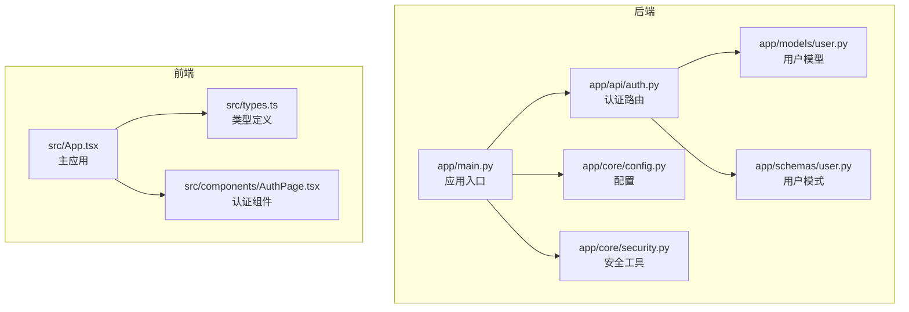
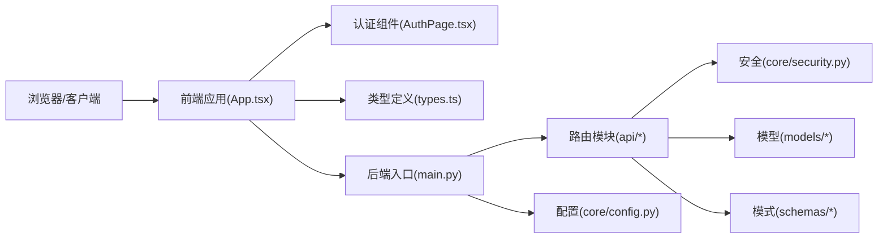
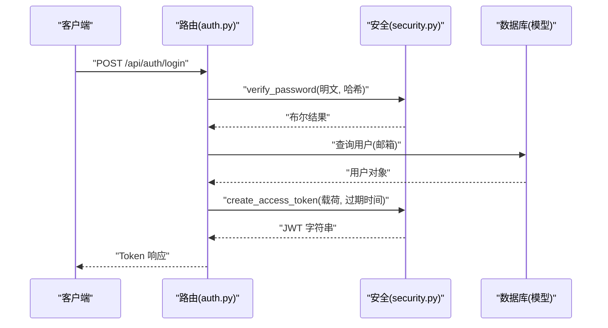
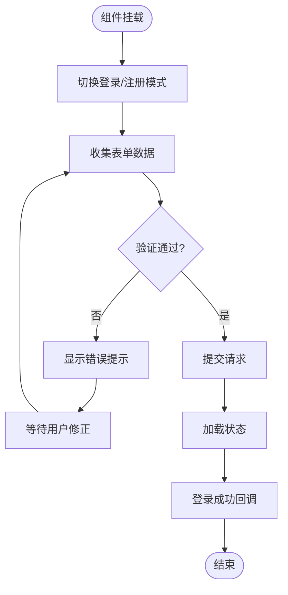

# 代码规范与约定

<cite>
**本文引用的文件**
- [backend/README.md](file://backend/README.md)
- [front/README.md](file://front/README.md)
- [PROJECT_OVERVIEW.md](file://PROJECT_OVERVIEW.md)
- [backend/requirements.txt](file://backend/requirements.txt)
- [front/package.json](file://front/package.json)
- [backend/app/main.py](file://backend/app/main.py)
- [backend/app/api/auth.py](file://backend/app/api/auth.py)
- [backend/app/models/user.py](file://backend/app/models/user.py)
- [backend/app/schemas/user.py](file://backend/app/schemas/user.py)
- [backend/app/core/config.py](file://backend/app/core/config.py)
- [backend/app/core/security.py](file://backend/app/core/security.py)
- [front/src/types.ts](file://front/src/types.ts)
- [front/src/components/AuthPage.tsx](file://front/src/components/AuthPage.tsx)
- [front/src/App.tsx](file://front/src/App.tsx)
</cite>

## 目录
1. [引言](#引言)
2. [项目结构](#项目结构)
3. [核心组件](#核心组件)
4. [架构总览](#架构总览)
5. [详细组件分析](#详细组件分析)
6. [依赖分析](#依赖分析)
7. [性能考虑](#性能考虑)
8. [故障排查指南](#故障排查指南)
9. [结论](#结论)
10. [附录](#附录)

## 引言
本文件为 Quickly 项目的代码规范与约定文档，覆盖后端 Python（FastAPI）与前端 TypeScript（React + Vite）两部分。内容涵盖：
- Python 后端 PEP8 编码风格、类与函数命名、注释与文档字符串要求
- TypeScript 前端接口与类型命名、组件命名、变量命名与类型注解规范
- 文件组织与模块导入规则
- 代码格式化与 Lint 规则（Black、Prettier、TSC）
- Git 提交消息与分支命名约定
- 常见错误示例与正确实践指引

## 项目结构
Quickly 采用前后端分离架构：
- 后端：Python + FastAPI，模块按职责划分为 api、core、models、schemas
- 前端：React + TypeScript + Vite，组件按功能拆分，类型集中于 types.ts

图表来源
- [backend/app/main.py:1-66](file://backend/app/main.py#L1-L66)
- [backend/app/api/auth.py:1-99](file://backend/app/api/auth.py#L1-L99)
- [backend/app/core/config.py:1-45](file://backend/app/core/config.py#L1-L45)
- [backend/app/core/security.py:1-80](file://backend/app/core/security.py#L1-L80)
- [backend/app/models/user.py:1-39](file://backend/app/models/user.py#L1-L39)
- [backend/app/schemas/user.py:1-50](file://backend/app/schemas/user.py#L1-L50)
- [front/src/types.ts:1-29](file://front/src/types.ts#L1-L29)
- [front/src/components/AuthPage.tsx:1-320](file://front/src/components/AuthPage.tsx#L1-L320)
- [front/src/App.tsx:1-840](file://front/src/App.tsx#L1-L840)

章节来源
- [PROJECT_OVERVIEW.md:3-58](file://PROJECT_OVERVIEW.md#L3-L58)
- [backend/README.md:1-75](file://backend/README.md#L1-L75)
- [front/README.md:1-21](file://front/README.md#L1-L21)

## 核心组件
- 后端应用入口负责初始化 FastAPI、注册中间件与路由，并提供健康检查端点
- 认证模块提供注册、登录、获取当前用户等接口
- 安全模块封装密码哈希、JWT 签发与校验、OAuth2 密码流
- 配置模块集中管理应用配置与环境变量
- 类型与模型分别用于数据传输与数据库映射

章节来源
- [backend/app/main.py:1-66](file://backend/app/main.py#L1-L66)
- [backend/app/api/auth.py:1-99](file://backend/app/api/auth.py#L1-L99)
- [backend/app/core/security.py:1-80](file://backend/app/core/security.py#L1-L80)
- [backend/app/core/config.py:1-45](file://backend/app/core/config.py#L1-L45)
- [backend/app/models/user.py:1-39](file://backend/app/models/user.py#L1-L39)
- [backend/app/schemas/user.py:1-50](file://backend/app/schemas/user.py#L1-L50)

## 架构总览
后端采用 FastAPI 的模块化组织方式，路由按功能划分，核心配置与安全工具集中管理；前端以组件为中心，类型定义统一管理。

图表来源
- [backend/app/main.py:1-66](file://backend/app/main.py#L1-L66)
- [backend/app/api/auth.py:1-99](file://backend/app/api/auth.py#L1-L99)
- [backend/app/core/security.py:1-80](file://backend/app/core/security.py#L1-L80)
- [backend/app/core/config.py:1-45](file://backend/app/core/config.py#L1-L45)
- [backend/app/models/user.py:1-39](file://backend/app/models/user.py#L1-L39)
- [backend/app/schemas/user.py:1-50](file://backend/app/schemas/user.py#L1-L50)
- [front/src/App.tsx:1-840](file://front/src/App.tsx#L1-L840)
- [front/src/components/AuthPage.tsx:1-320](file://front/src/components/AuthPage.tsx#L1-L320)
- [front/src/types.ts:1-29](file://front/src/types.ts#L1-L29)

## 详细组件分析

### Python 后端：PEP8 编码规范与约定
- 文件与模块
  - 使用小写下划线命名模块与包，如 app/api/auth.py
  - 模块顶部保留简洁的文档字符串描述用途
- 类命名
  - 使用 PascalCase，如 User、Settings
- 函数与方法命名
  - 使用 snake_case，如 verify_password、create_access_token
  - 私有成员以单下划线前缀，如 _private_func
- 常量
  - 使用大写下划线，如 SECRET_KEY、ALGORITHM
- 变量命名
  - 使用 snake_case，避免缩写除非广泛理解
- 注释与文档字符串
  - 函数/类上方使用三引号文档字符串，简述目的、参数、返回值
  - 行内注释解释复杂逻辑，避免显而易见的注释
- 导入顺序
  - 标准库 → 第三方库 → 项目内相对导入
  - 同组内按字母序排列
- 空行与缩进
  - 使用 4 空格缩进，避免混用制表符
  - 函数间空两行，类内方法间空一行
- 行长度与换行
  - 单行不超过 88 字符（Black 默认），必要时使用括号断行
- 字符串与格式化
  - 优先使用 f-string 或 .format，避免 % 格式化
- 异常处理
  - 明确捕获具体异常，避免裸 pass/raise
- 类型注解
  - 函数参数与返回值尽量添加类型注解，提升可维护性

章节来源
- [backend/app/main.py:1-66](file://backend/app/main.py#L1-L66)
- [backend/app/api/auth.py:1-99](file://backend/app/api/auth.py#L1-L99)
- [backend/app/core/security.py:1-80](file://backend/app/core/security.py#L1-L80)
- [backend/app/core/config.py:1-45](file://backend/app/core/config.py#L1-L45)
- [backend/app/models/user.py:1-39](file://backend/app/models/user.py#L1-L39)
- [backend/app/schemas/user.py:1-50](file://backend/app/schemas/user.py#L1-L50)

### Python 后端：认证流程时序

图表来源
- [backend/app/api/auth.py:52-86](file://backend/app/api/auth.py#L52-L86)
- [backend/app/core/security.py:23-42](file://backend/app/core/security.py#L23-L42)
- [backend/app/models/user.py:1-39](file://backend/app/models/user.py#L1-L39)

### TypeScript 前端：类型与组件规范
- 类型与接口命名
  - 接口使用 PascalCase，如 Message、MasteryScores、NoteItem、QuizQuestion
  - 使用只读属性与可选字段明确数据结构
- 组件命名
  - React 组件使用 PascalCase，如 AuthPage、App、Sidebar
  - 文件以组件名命名，如 AuthPage.tsx
- 变量与函数命名
  - 变量使用 camelCase，如 isLoggedIn、activeTab
  - 函数使用 camelCase，如 handleSendMessage、validateForm
- 类型注解
  - 显式声明 props、状态与回调函数类型
  - 使用联合类型与字面量类型表达有限取值
- 导入与导出
  - 统一使用绝对路径导入，避免相对路径过多
  - 类型定义集中于 types.ts，组件与页面按功能拆分
- JSX 结构
  - 属性值使用双引号，布尔属性避免冗余值
  - 事件处理器使用箭头函数或 useMemo/useCallback 包裹

章节来源
- [front/src/types.ts:1-29](file://front/src/types.ts#L1-L29)
- [front/src/components/AuthPage.tsx:1-320](file://front/src/components/AuthPage.tsx#L1-L320)
- [front/src/App.tsx:1-840](file://front/src/App.tsx#L1-L840)

### TypeScript 前端：认证组件流程

图表来源
- [front/src/components/AuthPage.tsx:31-70](file://front/src/components/AuthPage.tsx#L31-L70)

### 文件组织与模块导入规则
- 后端
  - app/api 下按功能划分路由模块，统一在 main.py 中注册
  - app/core 集中配置与安全工具，app/models 与 app/schemas 分离 ORM 与 Pydantic 模型
- 前端
  - src/components 下按功能拆分组件，App.tsx 作为根组件协调状态
  - types.ts 集中定义全局类型，组件内部少量局部类型

章节来源
- [backend/app/main.py:42-49](file://backend/app/main.py#L42-L49)
- [PROJECT_OVERVIEW.md:8-23](file://PROJECT_OVERVIEW.md#L8-L23)
- [front/src/App.tsx:29-35](file://front/src/App.tsx#L29-L35)

## 依赖分析
- 后端依赖
  - FastAPI、SQLAlchemy、Pydantic、python-jose、passlib 等
- 前端依赖
  - React、Vite、TailwindCSS、Lucide React、Motion 等

章节来源
- [backend/requirements.txt:1-37](file://backend/requirements.txt#L1-L37)
- [front/package.json:1-36](file://front/package.json#L1-L36)

## 性能考虑
- 后端
  - 使用异步数据库连接与 ORM，减少阻塞
  - JWT 令牌签名算法与密钥长度适中，避免过度开销
- 前端
  - 合理使用状态与副作用，避免不必要的重渲染
  - 组件拆分与懒加载，减少初始包体积

## 故障排查指南
- 后端
  - 认证失败：检查密码哈希与 JWT 解码流程
  - 数据库连接：确认引擎初始化与关闭时机
- 前端
  - 表单校验：确保错误键与表单字段一致
  - 状态更新：确认不可变更新与副作用清理

章节来源
- [backend/app/core/security.py:54-79](file://backend/app/core/security.py#L54-L79)
- [backend/app/main.py:15-23](file://backend/app/main.py#L15-L23)
- [front/src/components/AuthPage.tsx:31-70](file://front/src/components/AuthPage.tsx#L31-L70)

## 结论
本规范结合现有代码库实践，形成统一的 Python 与 TypeScript 编码约定，辅以格式化与 Lint 工具配置建议，帮助团队在快速迭代中保持一致性与可维护性。

## 附录

### 代码格式化与 Lint 规则
- Python
  - 格式化：Black（默认行宽 88），与项目现有风格一致
  - Lint：flake8 或 ruff，启用 E501（行过长）、F401（未使用导入）等常用规则
  - 类型检查：mypy（可选）
- TypeScript
  - 格式化：Prettier（单引号、尾逗号、无分号）
  - Lint：ESLint + @typescript-eslint（禁用隐式 any，推荐显式类型）
  - 类型检查：tsc（noEmit）

章节来源
- [backend/README.md:1-75](file://backend/README.md#L1-L75)
- [front/README.md:1-21](file://front/README.md#L1-L21)

### Git 提交消息与分支命名约定
- 提交消息
  - 类型：feat、fix、docs、style、refactor、perf、test、chore
  - 格式：type(scope): subject（subject 首字母小写，不超过 50 字）
  - 示例：feat(auth): add password reset endpoint
- 分支命名
  - 功能分支：feature/模块-描述
  - 修复分支：fix/模块-问题
  - 热修复：hotfix/版本-紧急修复
  - 文档：docs/模块-变更

章节来源
- [PROJECT_OVERVIEW.md:106-125](file://PROJECT_OVERVIEW.md#L106-L125)