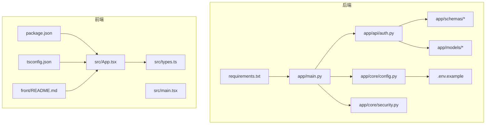
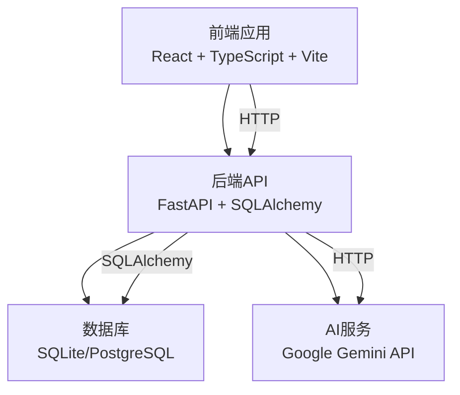
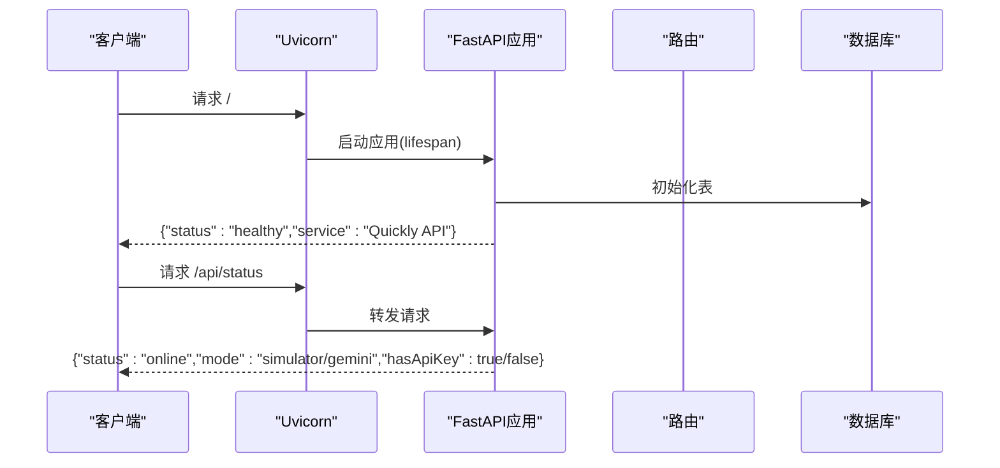
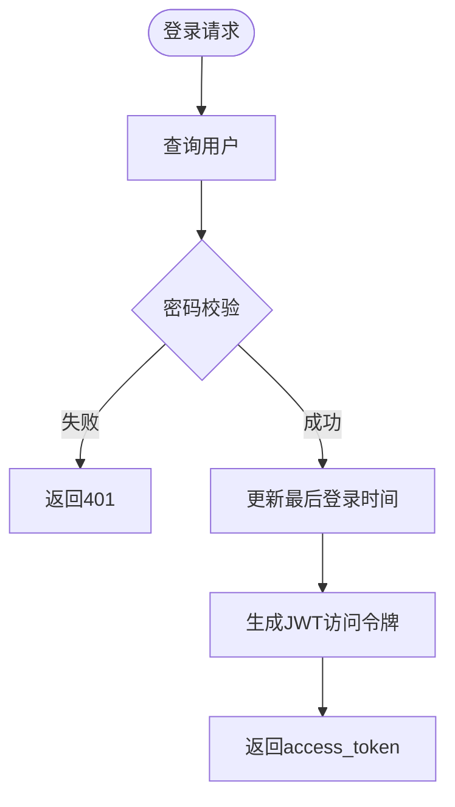
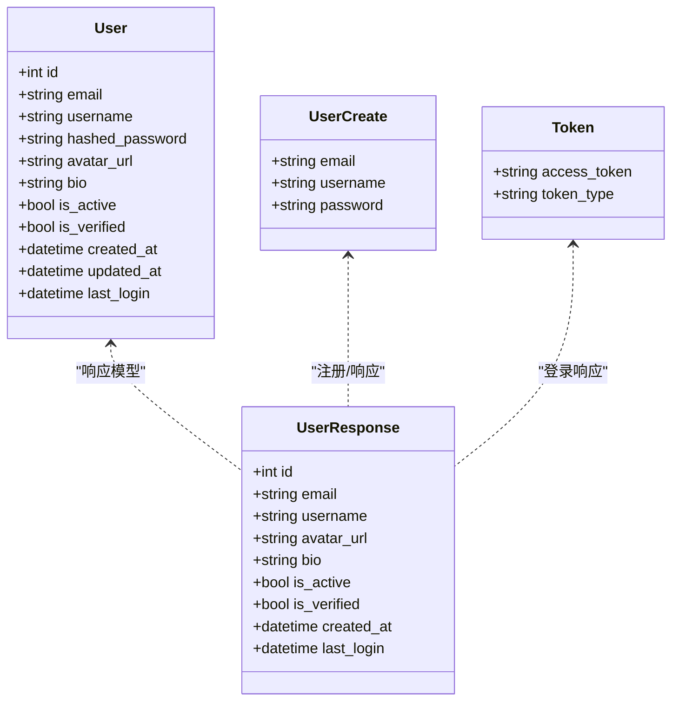
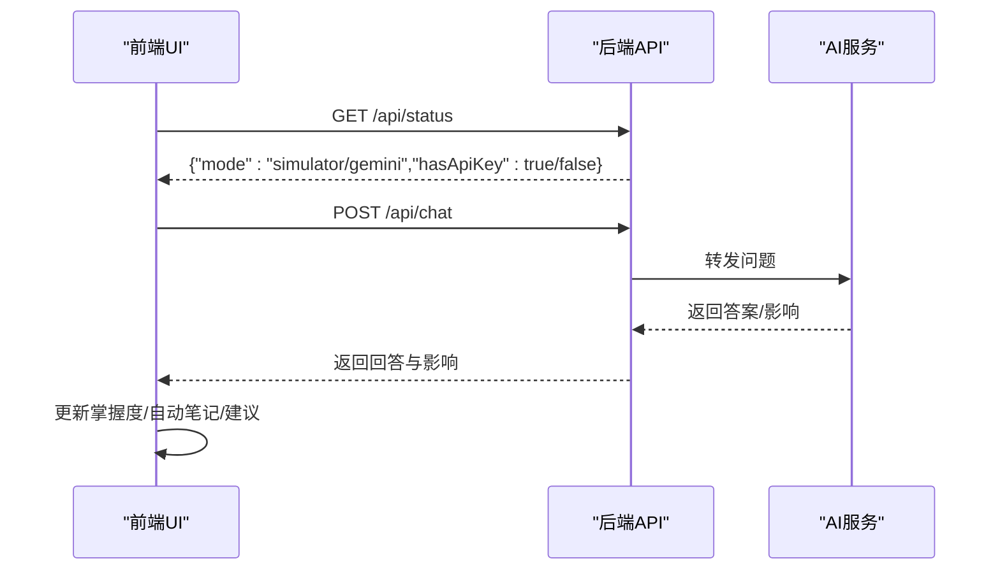
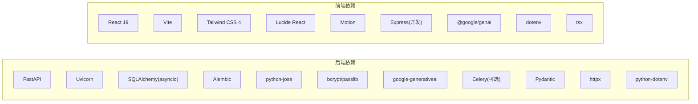

# 开发指南

<cite>
**本文引用的文件**
- [PROJECT_OVERVIEW.md](file://PROJECT_OVERVIEW.md)
- [backend/README.md](file://backend/README.md)
- [front/README.md](file://front/README.md)
- [backend/app/main.py](file://backend/app/main.py)
- [backend/app/core/config.py](file://backend/app/core/config.py)
- [backend/app/api/auth.py](file://backend/app/api/auth.py)
- [backend/app/models/user.py](file://backend/app/models/user.py)
- [backend/app/schemas/user.py](file://backend/app/schemas/user.py)
- [backend/app/core/security.py](file://backend/app/core/security.py)
- [backend/requirements.txt](file://backend/requirements.txt)
- [front/package.json](file://front/package.json)
- [front/tsconfig.json](file://front/tsconfig.json)
- [front/src/App.tsx](file://front/src/App.tsx)
- [front/src/main.tsx](file://front/src/main.tsx)
- [backend/.env.example](file://backend/.env.example)
</cite>

## 目录
1. [引言](#引言)
2. [项目结构](#项目结构)
3. [核心组件](#核心组件)
4. [架构总览](#架构总览)
5. [详细组件分析](#详细组件分析)
6. [依赖分析](#依赖分析)
7. [性能考虑](#性能考虑)
8. [故障排除指南](#故障排除指南)
9. [结论](#结论)
10. [附录](#附录)

## 引言
本开发指南面向Quickly项目的核心开发者与贡献者，旨在提供统一的代码规范、开发工作流、调试与性能优化建议，以及测试与故障排除方法。项目采用前后端分离架构：前端基于React 19 + TypeScript + Vite，后端基于FastAPI + SQLAlchemy 2.0（异步），并通过Google Gemini API提供AI能力。文档同时给出贡献与开源协作规范，帮助团队高效协作。

## 项目结构
Quickly采用“前后端分离”的目录组织方式，便于独立开发与部署：
- backend：FastAPI后端，包含API路由、核心配置、数据库模型与Pydantic Schema
- front：React + TypeScript + Vite前端，包含组件、类型定义与构建配置
- 根目录文档：项目概览、技术栈、环境变量与启动说明

图表来源
- [backend/app/main.py:1-66](file://backend/app/main.py#L1-L66)
- [backend/app/core/config.py:1-45](file://backend/app/core/config.py#L1-L45)
- [backend/app/api/auth.py:1-99](file://backend/app/api/auth.py#L1-L99)
- [backend/app/core/security.py:1-80](file://backend/app/core/security.py#L1-L80)
- [backend/app/schemas/user.py:1-50](file://backend/app/schemas/user.py#L1-L50)
- [backend/app/models/user.py:1-39](file://backend/app/models/user.py#L1-L39)
- [backend/.env.example:1-21](file://backend/.env.example#L1-L21)
- [backend/requirements.txt:1-37](file://backend/requirements.txt#L1-L37)
- [front/src/App.tsx:1-840](file://front/src/App.tsx#L1-L840)
- [front/src/main.tsx:1-11](file://front/src/main.tsx#L1-L11)
- [front/tsconfig.json:1-27](file://front/tsconfig.json#L1-L27)
- [front/package.json:1-36](file://front/package.json#L1-L36)
- [front/README.md:1-21](file://front/README.md#L1-L21)

章节来源
- [PROJECT_OVERVIEW.md:1-200](file://PROJECT_OVERVIEW.md#L1-L200)
- [backend/README.md:1-75](file://backend/README.md#L1-L75)
- [front/README.md:1-21](file://front/README.md#L1-L21)

## 核心组件
- 后端入口与生命周期：FastAPI应用初始化、CORS中间件、路由挂载与健康检查
- 配置中心：集中管理应用名称、调试模式、密钥、数据库、Redis、CORS、AI与Celery等配置
- 安全模块：密码哈希、JWT生成与校验、OAuth2密码流、当前用户解析
- 认证API：注册、登录、获取当前用户、登出
- 数据模型与Schema：用户、笔记、会话、知识点、掌握度、复习任务、设置等
- 前端应用：主界面、状态管理、聊天交互、测验弹窗、侧边栏与右侧面板

章节来源
- [backend/app/main.py:1-66](file://backend/app/main.py#L1-L66)
- [backend/app/core/config.py:1-45](file://backend/app/core/config.py#L1-L45)
- [backend/app/core/security.py:1-80](file://backend/app/core/security.py#L1-L80)
- [backend/app/api/auth.py:1-99](file://backend/app/api/auth.py#L1-L99)
- [backend/app/models/user.py:1-39](file://backend/app/models/user.py#L1-L39)
- [backend/app/schemas/user.py:1-50](file://backend/app/schemas/user.py#L1-L50)
- [front/src/App.tsx:1-840](file://front/src/App.tsx#L1-L840)

## 架构总览
后端通过FastAPI提供REST API，前端通过fetch调用后端接口，实现认证、问答、笔记、掌握度、复习与设置等功能。AI能力通过Gemini API按配置启用，开发阶段默认模拟模式。

图表来源
- [backend/app/main.py:26-66](file://backend/app/main.py#L26-L66)
- [backend/app/core/config.py:32-37](file://backend/app/core/config.py#L32-L37)
- [front/src/App.tsx:108-121](file://front/src/App.tsx#L108-L121)

## 详细组件分析

### 后端入口与路由
- 应用生命周期：启动时创建数据库表，关闭时释放引擎
- CORS策略：允许指定前端地址
- 路由挂载：认证、问答、笔记、知识点、掌握度、复习、设置等模块
- 健康检查：根路径与API状态端点

图表来源
- [backend/app/main.py:15-66](file://backend/app/main.py#L15-L66)

章节来源
- [backend/app/main.py:15-66](file://backend/app/main.py#L15-L66)

### 配置中心
- 关键配置项：应用名、调试、密钥、数据库URL、Redis/Celery、CORS、Gemini API Key
- 环境变量加载：从.env文件读取
- 默认值与安全建议：生产环境务必替换默认密钥与数据库

章节来源
- [backend/app/core/config.py:10-45](file://backend/app/core/config.py#L10-L45)
- [backend/.env.example:1-21](file://backend/.env.example#L1-L21)

### 安全与认证
- 密码处理：bcrypt哈希与校验
- JWT：生成、解码与校验，OAuth2密码流
- 当前用户：从令牌解析用户ID并查询数据库

图表来源
- [backend/app/api/auth.py:52-86](file://backend/app/api/auth.py#L52-L86)
- [backend/app/core/security.py:23-42](file://backend/app/core/security.py#L23-L42)

章节来源
- [backend/app/api/auth.py:1-99](file://backend/app/api/auth.py#L1-L99)
- [backend/app/core/security.py:1-80](file://backend/app/core/security.py#L1-L80)

### 数据模型与Schema
- 用户模型：邮箱唯一、头像、个人简介、激活状态、时间戳与关联关系
- 用户Schema：注册、登录、响应与令牌数据
- 其他模型：笔记、会话、知识点、掌握度、复习任务、设置等（详见项目概览）

图表来源
- [backend/app/models/user.py:11-39](file://backend/app/models/user.py#L11-L39)
- [backend/app/schemas/user.py:10-50](file://backend/app/schemas/user.py#L10-L50)

章节来源
- [backend/app/models/user.py:1-39](file://backend/app/models/user.py#L1-L39)
- [backend/app/schemas/user.py:1-50](file://backend/app/schemas/user.py#L1-L50)

### 前端应用与交互
- 主应用：状态管理、聊天消息、笔记、掌握度分数、侧边栏与右侧面板
- 预设问题与快捷操作：提升交互效率
- API模式检测：根据后端状态决定使用模拟还是Gemini模式

图表来源
- [front/src/App.tsx:108-121](file://front/src/App.tsx#L108-L121)
- [front/src/App.tsx:156-245](file://front/src/App.tsx#L156-L245)
- [backend/app/main.py:58-66](file://backend/app/main.py#L58-L66)

章节来源
- [front/src/App.tsx:1-840](file://front/src/App.tsx#L1-L840)
- [front/src/main.tsx:1-11](file://front/src/main.tsx#L1-L11)

## 依赖分析
- 后端依赖：FastAPI、Uvicorn、SQLAlchemy（异步）、Alembic、Redis（可选）、JWT、bcrypt、Gemini SDK、Celery（可选）、Pydantic、httpx、dotenv等
- 前端依赖：React 19、Vite、Tailwind CSS 4、Lucide React、Motion、Express（开发）、@google/genai、dotenv、tsx等

图表来源
- [backend/requirements.txt:1-37](file://backend/requirements.txt#L1-L37)
- [front/package.json:1-36](file://front/package.json#L1-L36)

章节来源
- [backend/requirements.txt:1-37](file://backend/requirements.txt#L1-L37)
- [front/package.json:1-36](file://front/package.json#L1-L36)

## 性能考虑
- 数据库连接与事务：使用异步SQLAlchemy，避免阻塞；批量写入与flush/commit时机合理规划
- 缓存与队列：Redis可用于热点数据缓存；Celery用于异步任务（如日志、报表）
- 前端渲染：组件拆分与懒加载；避免不必要的重渲染；滚动容器与虚拟化
- API限流与超时：结合中间件与客户端重试策略
- AI调用：批量化请求、错误重试与降级（模拟模式）

[本节为通用指导，无需特定文件引用]

## 故障排除指南
- 启动后端报错：检查虚拟环境、依赖安装与环境变量；确认数据库URL与Redis/Celery可达
- CORS跨域问题：核对CORS_ORIGINS配置是否包含前端地址
- JWT认证失败：确认SECRET_KEY一致、令牌未过期、用户存在且激活
- AI不可用：确认GEMINI_API_KEY已配置；后端状态端点显示是否为gemini模式
- 前端无法连接后端：确认VITE_API_BASE_URL指向正确后端地址

章节来源
- [backend/README.md:1-75](file://backend/README.md#L1-L75)
- [front/README.md:1-21](file://front/README.md#L1-L21)
- [backend/app/core/config.py:29-30](file://backend/app/core/config.py#L29-L30)
- [backend/app/main.py:58-66](file://backend/app/main.py#L58-L66)
- [backend/.env.example:16-17](file://backend/.env.example#L16-L17)

## 结论
本指南提供了Quickly项目的开发规范、架构视图、组件实现要点、依赖关系、性能与故障排除建议。建议在开发过程中严格遵循命名与注释规范，采用统一的分支与合并策略，并结合测试与性能分析工具持续优化。

[本节为总结，无需特定文件引用]

## 附录

### 代码规范与约定

- Python（后端）
  - 命名规范：模块与函数使用下划线命名；类使用帕斯卡命名；常量使用全大写
  - 注释要求：公共函数/类应包含简要说明与参数/返回值说明；复杂逻辑需行内注释
  - 错误处理：使用HTTPException返回明确状态码与消息；捕获异常并记录日志
  - 配置管理：通过pydantic-settings集中管理，环境变量文件示例化
  - 安全：JWT密钥与数据库URL必须在生产环境覆盖默认值；密码使用bcrypt

- TypeScript（前端）
  - 命名规范：组件使用帕斯卡命名；变量与函数使用驼峰命名；常量全大写
  - 类型定义：优先使用interface描述对象结构；可选属性显式声明
  - 组件设计：单一职责；Props与状态清晰；事件回调命名语义化
  - 样式：使用Tailwind原子类；避免内联样式；主题变量集中管理
  - 构建与类型检查：保持tsconfig与Vite配置一致；使用tsc --noEmit进行类型检查

- Git与分支管理
  - 分支策略：main用于发布；develop用于集成；feature/*用于新功能；hotfix/*用于紧急修复
  - 提交规范：简短主题 + 详细描述；引用Issue编号；避免大改动单次提交
  - 合并与审查：PR需至少一名审查者同意；通过CI与本地测试；squash合并保持历史整洁

- 测试策略
  - 单元测试：后端使用pytest；前端使用Vitest/Jest；覆盖核心业务逻辑与边界条件
  - 集成测试：数据库与外部服务（如Gemini）通过mock或测试环境隔离
  - 端到端测试：Playwright/Cypress；覆盖关键用户路径（注册、登录、问答、笔记、测验）

- 调试与性能分析
  - 后端：Uvicorn调试模式；日志级别调整；数据库慢查询分析；Redis/Celery监控
  - 前端：React DevTools；网络面板；性能面板；内存泄漏检测；Vite HMR优化
  - 通用：浏览器性能面板；APDEX与LCP指标；移动端兼容性测试

- 贡献指南与开源协作
  - 行为准则：尊重与包容；聚焦建设性反馈
  - Issue规范：清晰标题与复现步骤；标签与优先级
  - PR规范：描述变更动机与方案；附带测试；更新相关文档
  - 版本与发布：语义化版本；Changelog维护；发布前自检清单

[本节为通用规范，无需特定文件引用]