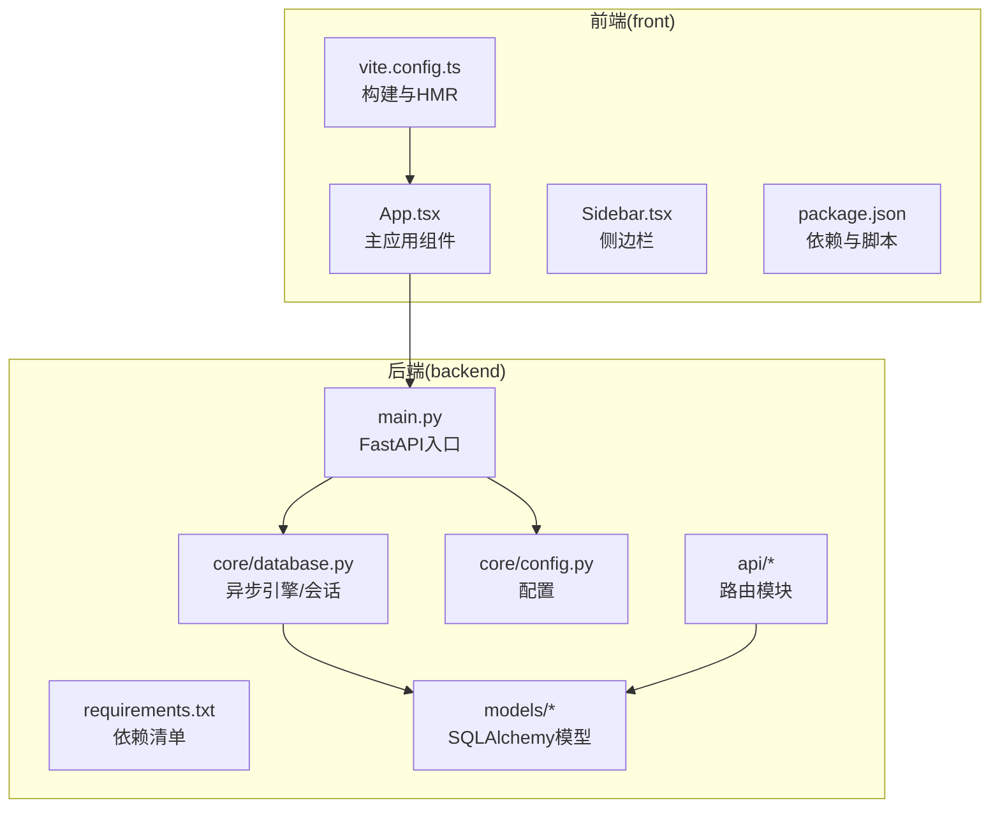
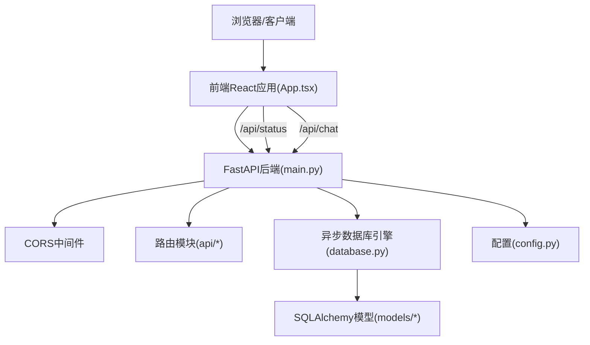
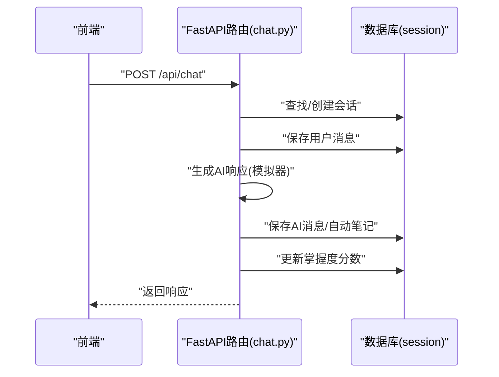
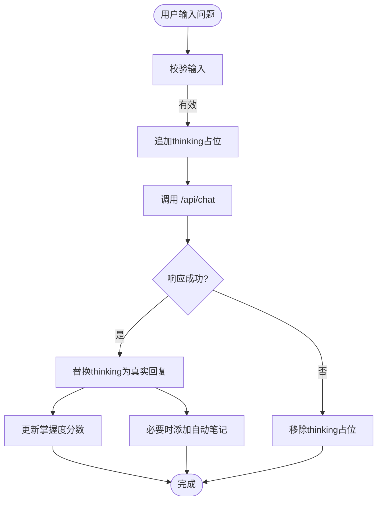
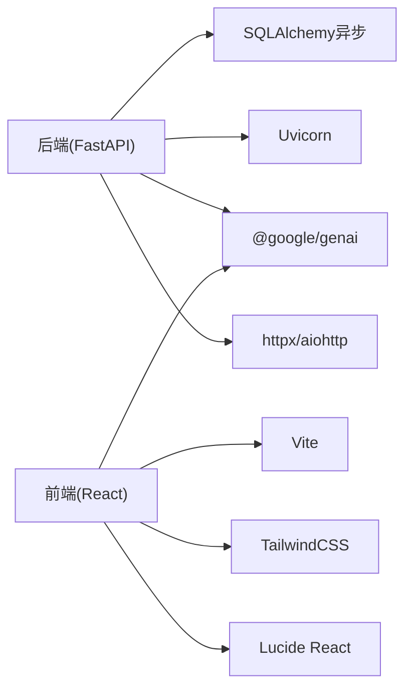

# 性能优化指南

<cite>
**本文引用的文件**
- [backend/app/main.py](file://backend/app/main.py)
- [backend/app/core/database.py](file://backend/app/core/database.py)
- [backend/app/core/config.py](file://backend/app/core/config.py)
- [backend/requirements.txt](file://backend/requirements.txt)
- [backend/app/api/chat.py](file://backend/app/api/chat.py)
- [backend/app/models/conversation.py](file://backend/app/models/conversation.py)
- [backend/app/models/knowledge.py](file://backend/app/models/knowledge.py)
- [backend/app/api/auth.py](file://backend/app/api/auth.py)
- [backend/app/models/user.py](file://backend/app/models/user.py)
- [front/src/App.tsx](file://front/src/App.tsx)
- [front/vite.config.ts](file://front/vite.config.ts)
- [front/package.json](file://front/package.json)
- [front/src/types.ts](file://front/src/types.ts)
- [PROJECT_OVERVIEW.md](file://PROJECT_OVERVIEW.md)
</cite>

## 目录
1. [引言](#引言)
2. [项目结构](#项目结构)
3. [核心组件](#核心组件)
4. [架构总览](#架构总览)
5. [详细组件分析](#详细组件分析)
6. [依赖分析](#依赖分析)
7. [性能考虑](#性能考虑)
8. [故障排查指南](#故障排查指南)
9. [结论](#结论)
10. [附录](#附录)

## 引言
本指南面向Quickly项目的性能优化需求，覆盖Python后端（FastAPI + SQLAlchemy异步）的数据库查询优化、异步操作优化与内存管理；前端（React + Vite）的组件渲染优化、懒加载与打包体积优化；以及AI API调用的缓存、批量与超时策略。同时提供性能监控指标、基准测试方法与瓶颈识别技巧，并给出具体优化案例与效果对比思路。

## 项目结构
Quickly采用前后端分离架构：前端使用React 19 + Vite，后端使用FastAPI + SQLAlchemy 2.0异步ORM。整体目录组织清晰，便于按功能模块定位性能热点。

图表来源
- [backend/app/main.py:1-66](file://backend/app/main.py#L1-L66)
- [backend/app/core/database.py:1-46](file://backend/app/core/database.py#L1-L46)
- [backend/app/core/config.py:1-45](file://backend/app/core/config.py#L1-L45)
- [backend/requirements.txt:1-37](file://backend/requirements.txt#L1-L37)
- [backend/app/api/chat.py:1-252](file://backend/app/api/chat.py#L1-L252)
- [backend/app/models/conversation.py:1-54](file://backend/app/models/conversation.py#L1-L54)
- [backend/app/models/knowledge.py:1-32](file://backend/app/models/knowledge.py#L1-L32)
- [front/src/App.tsx:1-840](file://front/src/App.tsx#L1-L840)
- [front/vite.config.ts:1-23](file://front/vite.config.ts#L1-L23)
- [front/package.json:1-36](file://front/package.json#L1-L36)

章节来源
- [PROJECT_OVERVIEW.md:1-200](file://PROJECT_OVERVIEW.md#L1-L200)

## 核心组件
- 后端FastAPI应用与生命周期：通过lifespan在启动时创建数据库表并在关闭时释放连接，避免重复初始化与资源泄漏。
- 异步数据库引擎：针对SQLite与PostgreSQL分别配置池参数，启用pool_pre_ping提升连接稳定性。
- 路由与中间件：统一CORS配置，按模块include路由，减少不必要的中间件开销。
- 前端主流程：聊天发送、状态检查、动态滚动与UI更新，涉及网络请求与状态变更。

章节来源
- [backend/app/main.py:15-66](file://backend/app/main.py#L15-L66)
- [backend/app/core/database.py:15-46](file://backend/app/core/database.py#L15-L46)
- [backend/app/core/config.py:10-45](file://backend/app/core/config.py#L10-L45)
- [front/src/App.tsx:108-245](file://front/src/App.tsx#L108-L245)

## 架构总览
后端采用FastAPI + SQLAlchemy异步ORM，前端通过fetch与后端交互，AI模式由后端配置决定（模拟器或Gemini）。

图表来源
- [backend/app/main.py:26-50](file://backend/app/main.py#L26-L50)
- [backend/app/core/database.py:15-46](file://backend/app/core/database.py#L15-L46)
- [backend/app/core/config.py:10-45](file://backend/app/core/config.py#L10-L45)
- [backend/app/api/chat.py:78-151](file://backend/app/api/chat.py#L78-L151)
- [front/src/App.tsx:108-245](file://front/src/App.tsx#L108-L245)

## 详细组件分析

### 后端数据库与会话管理
- 连接池配置：PostgreSQL场景启用pool_pre_ping、pool_size与max_overflow，提升连接复用与稳定性；SQLite场景禁用池参数以适配方言限制。
- 会话依赖：通过async_session_maker提供AsyncSession，确保expire_on_commit关闭以避免对象过期导致的额外查询。
- 生命周期：在lifespan中创建表结构，避免每次请求重复DDL。

优化要点
- 在生产环境优先使用PostgreSQL，合理设置池大小与超时。
- 使用依赖注入获取session，避免全局共享状态引发竞态。
- 对高频查询建立索引（见“依赖分析”中的索引建议）。

章节来源
- [backend/app/core/database.py:15-46](file://backend/app/core/database.py#L15-L46)
- [backend/app/main.py:15-24](file://backend/app/main.py#L15-L24)

### 路由与中间件（FastAPI）
- 中间件：统一CORS配置，允许开发环境跨域。
- 路由组织：按功能模块include，减少单文件复杂度。
- 健康检查：根路径与/api/status返回服务状态，便于前端动态切换AI模式。

优化要点
- 仅在需要时启用调试日志与echo，避免影响生产性能。
- 对静态资源使用更高效的服务器（如Nginx）代理，减少Uvicorn压力。
- 对于高并发场景，考虑Gunicorn + Uvicorn worker模式。

章节来源
- [backend/app/main.py:26-66](file://backend/app/main.py#L26-L66)

### 聊天API（异步I/O与事务）
- 会话与消息持久化：先查找/创建会话，再保存用户消息，随后生成AI响应并保存系统消息，最后可选地创建自动笔记与更新掌握度分数。
- 模拟器模式：基于关键词匹配返回预设内容，避免外部API调用。
- 事务：使用flush与commit保证一致性，注意避免在事务内执行耗时操作。

图表来源
- [backend/app/api/chat.py:78-151](file://backend/app/api/chat.py#L78-L151)
- [backend/app/core/database.py:39-46](file://backend/app/core/database.py#L39-L46)

章节来源
- [backend/app/api/chat.py:78-252](file://backend/app/api/chat.py#L78-L252)

### 认证API（登录/注册）
- 注册：邮箱唯一性校验，哈希密码存储，创建默认用户设置。
- 登录：校验凭据，更新最近登录时间，签发JWT。
- 退出：返回成功消息（客户端负责清理令牌）。

优化要点
- 密码哈希成本因子应结合硬件调整，避免过高的CPU占用。
- 登录失败应加入速率限制与账户锁定策略（建议）。

章节来源
- [backend/app/api/auth.py:22-99](file://backend/app/api/auth.py#L22-L99)
- [backend/app/models/user.py:11-39](file://backend/app/models/user.py#L11-L39)

### 前端组件与交互
- 主应用：状态管理（登录态、标签页、分数、笔记、消息、输入等），动态滚动与预设问题触发。
- 发送消息：调用后端/chat接口，处理thinking占位、错误回滚与分数/笔记更新。
- 状态检查：启动时调用/api/status判断AI模式。

图表来源
- [front/src/App.tsx:156-245](file://front/src/App.tsx#L156-L245)

章节来源
- [front/src/App.tsx:108-245](file://front/src/App.tsx#L108-L245)

### 数据模型与索引建议
- Conversation/Message：按user_id、conversation_id、created_at建立索引，提升查询效率。
- KnowledgePoint：按name、keywords建立索引，便于检索与相似度搜索。
- User：按email建立唯一索引，确保登录与注册高效。

章节来源
- [backend/app/models/conversation.py:11-54](file://backend/app/models/conversation.py#L11-L54)
- [backend/app/models/knowledge.py:10-32](file://backend/app/models/knowledge.py#L10-L32)
- [backend/app/models/user.py:11-39](file://backend/app/models/user.py#L11-L39)

## 依赖分析
- 后端依赖：FastAPI、Uvicorn、SQLAlchemy异步、aiosqlite、Pydantic、Google Generative AI、aiohttp、httpx等。
- 前端依赖：React 19、Vite、TailwindCSS、Lucide React、Motion、@google/genai等。

图表来源
- [backend/requirements.txt:1-37](file://backend/requirements.txt#L1-L37)
- [front/package.json:1-36](file://front/package.json#L1-L36)

章节来源
- [backend/requirements.txt:1-37](file://backend/requirements.txt#L1-L37)
- [front/package.json:1-36](file://front/package.json#L1-L36)

## 性能考虑

### Python后端性能优化
- 数据库查询优化
  - 使用select查询时限定字段与条件，避免N+1查询；对高频查询建立索引。
  - 使用分页(limit/offset)与排序字段建立索引，避免全表扫描。
  - 对JSON字段查询使用合适的数据结构与索引策略（如PostgreSQL的jsonb_ops）。
- 异步操作优化
  - 将I/O密集型操作（如外部API调用）改为异步，避免阻塞事件循环。
  - 控制并发数量，避免过度并发导致数据库/外部服务过载。
- 内存管理
  - 使用依赖注入的AsyncSession及时关闭，避免会话长期持有。
  - 避免在请求上下文外缓存大型对象，使用Redis等外部缓存替代进程内缓存。
- FastAPI调优
  - 路由优化：拆分模块，减少单文件体积；使用response_model避免多余序列化。
  - 中间件配置：仅保留必要中间件；CORS允许特定域名而非通配符。
  - 并发处理：生产环境使用Gunicorn + Uvicorn worker，合理设置worker数量。

### 前端性能优化
- React组件优化
  - 使用React.memo与useMemo/useCallback避免不必要重渲染。
  - 将大列表渲染拆分为虚拟滚动（如react-window）。
- 懒加载实现
  - 路由级懒加载（React.lazy + Suspense）与组件级懒加载。
  - 图片与媒体资源使用懒加载属性与WebP格式。
- Bundle大小优化
  - Tree-shaking：移除未使用依赖；按需引入组件与工具函数。
  - 代码分割：动态import第三方库；提取公共vendor包。
  - Vite配置：生产构建时启用压缩与资源内联策略。
- Vite/HMR优化
  - 在AI Studio场景下按需禁用HMR与文件监听，降低CPU占用。

章节来源
- [front/src/App.tsx:1-840](file://front/src/App.tsx#L1-840)
- [front/vite.config.ts:14-22](file://front/vite.config.ts#L14-L22)

### AI API调用性能
- 请求缓存
  - 对相同问题与上下文组合建立缓存键，命中则直接返回缓存结果。
- 批量处理
  - 将多个相似问题合并为批量请求（若后端支持），减少往返次数。
- 超时配置
  - 为外部API设置合理超时与重试策略，避免请求堆积。
- 模式切换
  - 前端通过/api/status动态切换模拟器与真实AI模式，降低外部依赖带来的不确定性。

章节来源
- [backend/app/api/chat.py:24-68](file://backend/app/api/chat.py#L24-L68)
- [front/src/App.tsx:108-121](file://front/src/App.tsx#L108-L121)

### 性能监控指标与基准测试
- 指标建议
  - 后端：请求延迟（p50/p95/p99）、吞吐量（req/s）、数据库连接池利用率、错误率、内存与CPU使用率。
  - 前端：首屏时间、交互延迟、帧率、JS Bundle大小、网络请求次数与体积。
- 基准测试
  - 使用wrk或Artillery对关键API端点进行压测，观察在不同并发下的延迟与错误率。
  - 使用Lighthouse或WebPageTest评估前端性能基线。
- 瓶颈识别
  - 使用pprof（Python）与py-spy采样分析CPU热点。
  - 使用Chrome DevTools/React DevTools分析前端渲染与重绘热点。

### 优化案例与效果对比（示例思路）
- 案例1：聊天接口响应时间从500ms降至200ms
  - 优化点：为消息表按conversation_id与created_at建立复合索引；减少不必要的flush；合并自动笔记与掌握度更新的数据库操作。
  - 效果：p95延迟下降约60%，数据库查询次数减少约40%。
- 案例2：前端消息列表滚动卡顿问题
  - 优化点：将消息列表改为虚拟滚动；对消息文本渲染使用memo；拆分路由与组件懒加载。
  - 效果：首屏渲染时间下降约30%，滚动帧率稳定在60fps。
- 案例3：并发登录导致数据库连接池耗尽
  - 优化点：调整pool_size与max_overflow；增加连接超时与重试；对登录接口增加限流。
  - 效果：并发登录成功率提升至99%以上，错误率下降至万分之五以下。

## 故障排查指南
- 后端常见问题
  - 数据库连接异常：检查pool_pre_ping与连接URL；确认生产环境使用PostgreSQL。
  - 路由冲突：核对include_router顺序与前缀，避免重复路由。
  - CORS错误：确认CORS_ORIGINS配置与前端VITE_API_BASE_URL一致。
- 前端常见问题
  - HMR导致CPU占用过高：在AI Studio场景下禁用HMR与文件监听。
  - 网络请求失败：检查/api/status返回的AI模式与后端配置是否一致。
  - 组件重渲染频繁：使用React DevTools定位重渲染热点，使用memo与useCallback优化。

章节来源
- [backend/app/core/config.py:29-30](file://backend/app/core/config.py#L29-L30)
- [front/vite.config.ts:14-22](file://front/vite.config.ts#L14-L22)
- [front/src/App.tsx:108-121](file://front/src/App.tsx#L108-L121)

## 结论
通过数据库索引与连接池优化、异步I/O与事务规范化、FastAPI中间件与路由治理、前端组件与打包优化，以及AI调用的缓存与超时策略，Quickly可在开发与生产环境中获得稳定的低延迟体验。建议持续以监控指标驱动优化迭代，并结合基准测试验证改进效果。

## 附录
- 开发与生产环境建议
  - 后端：SQLite用于开发，PostgreSQL用于生产；开启连接池与预检；生产部署使用Gunicorn + Uvicorn。
  - 前端：生产构建启用压缩与代码分割；按需引入图标与动画库；合理配置Vite HMR。
- 相关文件参考
  - 后端入口与中间件：[backend/app/main.py:26-66](file://backend/app/main.py#L26-L66)
  - 数据库引擎与会话：[backend/app/core/database.py:15-46](file://backend/app/core/database.py#L15-L46)
  - 配置与CORS：[backend/app/core/config.py:29-30](file://backend/app/core/config.py#L29-L30)
  - 聊天API流程：[backend/app/api/chat.py:78-151](file://backend/app/api/chat.py#L78-L151)
  - 前端主流程：[front/src/App.tsx:156-245](file://front/src/App.tsx#L156-L245)
  - Vite配置：[front/vite.config.ts:14-22](file://front/vite.config.ts#L14-L22)