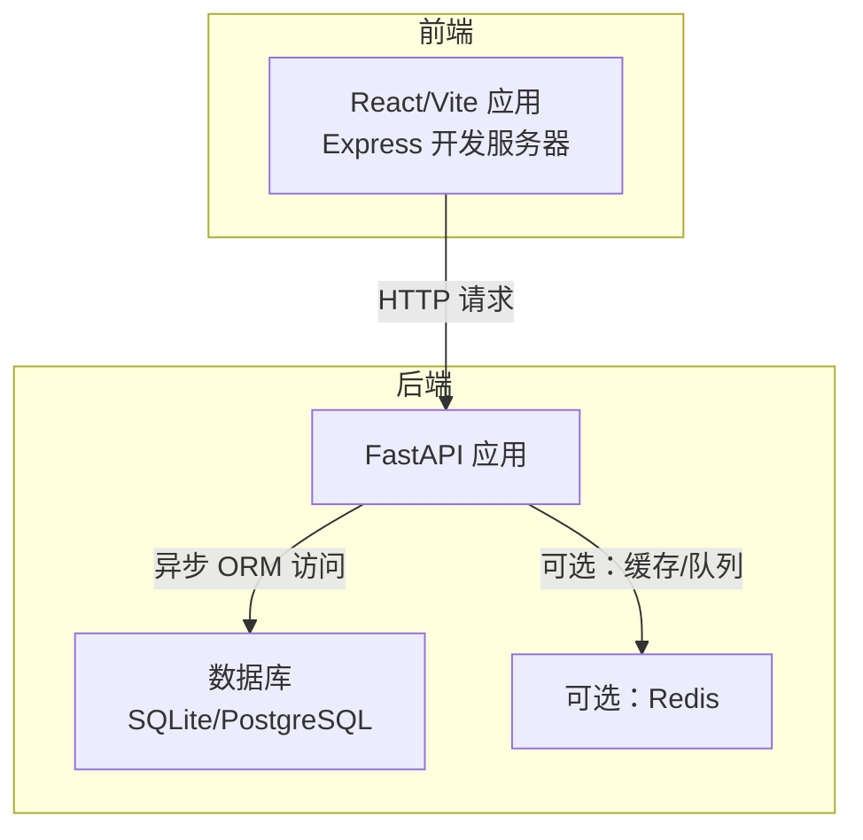
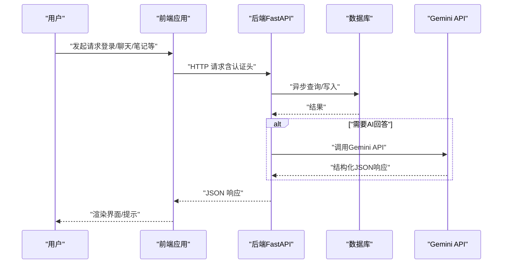
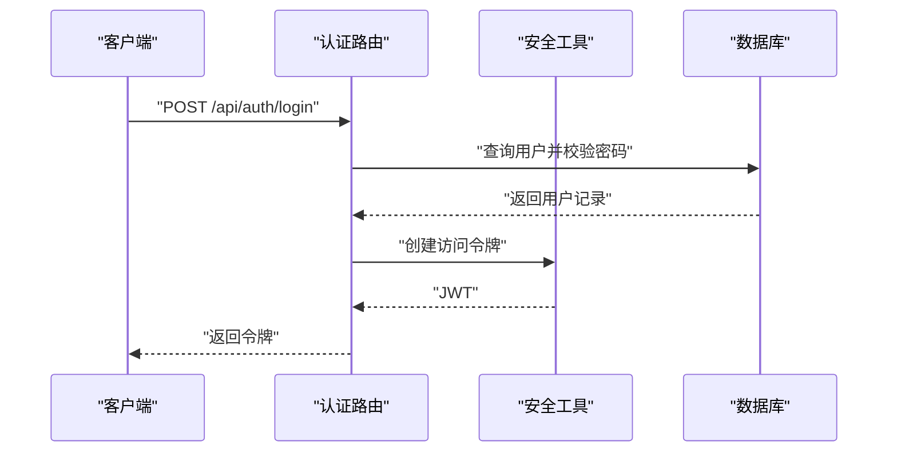
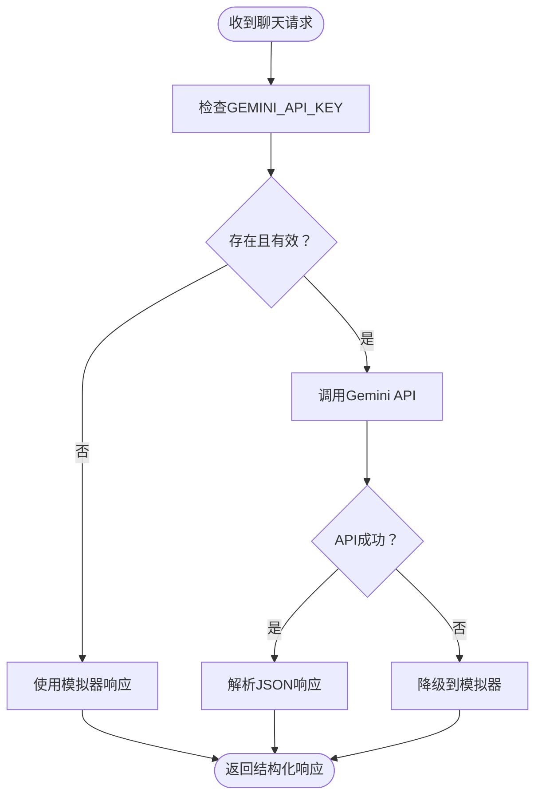
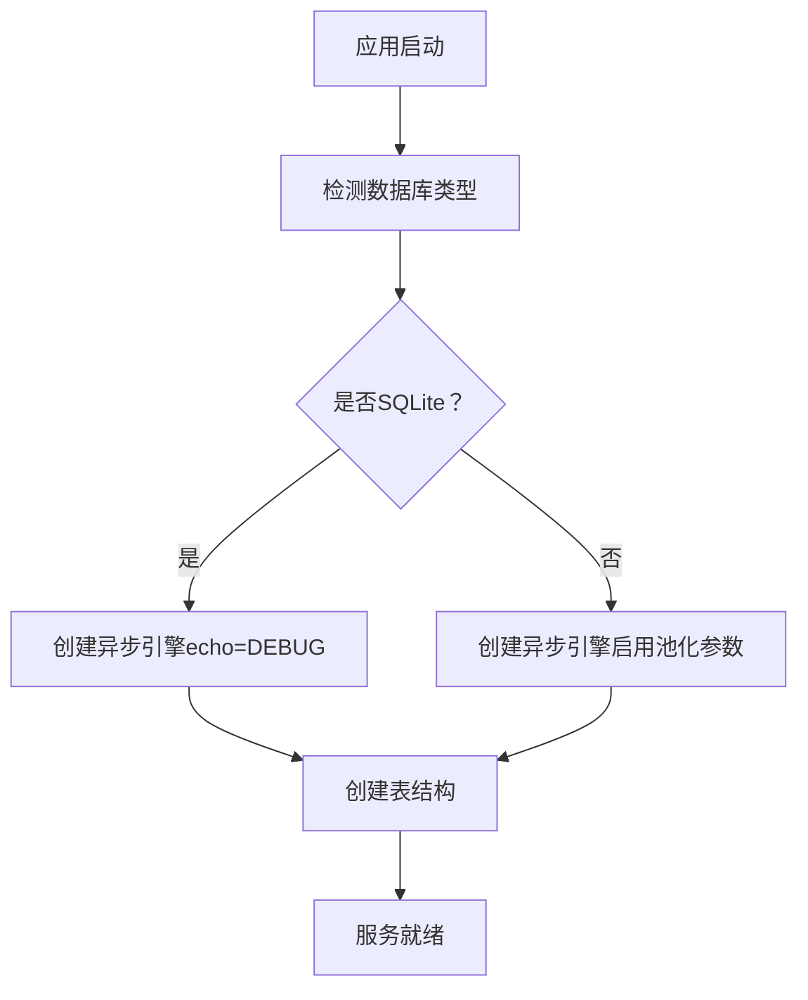
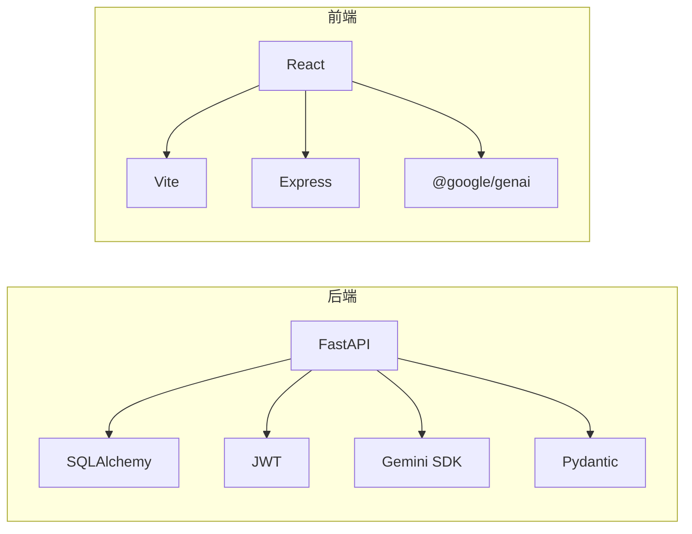

# 故障排除指南

<cite>
**本文引用的文件**
- [PROJECT_OVERVIEW.md](file://PROJECT_OVERVIEW.md)
- [backend/README.md](file://backend/README.md)
- [front/README.md](file://front/README.md)
- [backend/.env.example](file://backend/.env.example)
- [backend/requirements.txt](file://backend/requirements.txt)
- [front/package.json](file://front/package.json)
- [backend/app/main.py](file://backend/app/main.py)
- [backend/app/core/config.py](file://backend/app/core/config.py)
- [backend/app/core/database.py](file://backend/app/core/database.py)
- [backend/app/core/security.py](file://backend/app/core/security.py)
- [backend/app/api/auth.py](file://backend/app/api/auth.py)
- [backend/app/api/chat.py](file://backend/app/api/chat.py)
- [front/vite.config.ts](file://front/vite.config.ts)
- [front/src/types.ts](file://front/src/types.ts)
- [front/server.ts](file://front/server.ts)
</cite>

## 目录
1. [简介](#简介)
2. [项目结构](#项目结构)
3. [核心组件](#核心组件)
4. [架构总览](#架构总览)
5. [详细组件分析](#详细组件分析)
6. [依赖分析](#依赖分析)
7. [性能考虑](#性能考虑)
8. [故障排除指南](#故障排除指南)
9. [结论](#结论)
10. [附录](#附录)

## 简介
本指南面向Quickly项目的开发者与运维人员，聚焦于环境配置、依赖安装、运行时错误、数据库连接、API调用失败、前端构建错误等常见问题的诊断与修复流程，并提供错误日志分析方法、调试信息收集技巧、开发与生产环境差异排查、第三方服务（AI API、Redis）集成问题处理、问题上报模板与社区求助建议，以及预防性维护与监控告警配置建议。

## 项目结构
Quickly采用前后端分离架构：
- 后端：基于FastAPI，使用异步SQLAlchemy、JWT认证、SQLite开发/PostgreSQL生产、可选Redis/Celery。
- 前端：基于React 19 + TypeScript + Vite，内置Express开发服务器，支持Gemini AI集成与模拟器模式。

图表来源
- [backend/app/main.py:26-49](file://backend/app/main.py#L26-L49)
- [backend/app/core/database.py:15-36](file://backend/app/core/database.py#L15-L36)
- [backend/app/core/config.py:23-37](file://backend/app/core/config.py#L23-L37)
- [front/server.ts:157-256](file://front/server.ts#L157-L256)

章节来源
- [PROJECT_OVERVIEW.md:3-58](file://PROJECT_OVERVIEW.md#L3-L58)
- [backend/README.md:1-75](file://backend/README.md#L1-L75)
- [front/README.md:1-21](file://front/README.md#L1-L21)

## 核心组件
- 配置系统：后端通过Pydantic Settings加载.env；前端通过dotenv加载环境变量。
- 数据库：异步引擎按数据库类型启用不同池化参数；SQLite开发默认echo调试。
- 安全：JWT令牌签发与校验、密码哈希与校验。
- API路由：认证、聊天、笔记、知识点、掌握度、复习、设置等模块化路由。
- 前端开发服务器：Vite中间件或静态资源，Express封装Gemini客户端与模拟器。

章节来源
- [backend/app/core/config.py:10-44](file://backend/app/core/config.py#L10-L44)
- [backend/app/core/database.py:15-45](file://backend/app/core/database.py#L15-L45)
- [backend/app/core/security.py:19-79](file://backend/app/core/security.py#L19-L79)
- [backend/app/api/auth.py:22-98](file://backend/app/api/auth.py#L22-L98)
- [backend/app/api/chat.py:78-150](file://backend/app/api/chat.py#L78-L150)
- [front/server.ts:18-40](file://front/server.ts#L18-L40)

## 架构总览

图表来源
- [backend/app/api/chat.py:78-150](file://backend/app/api/chat.py#L78-L150)
- [backend/app/api/auth.py:52-86](file://backend/app/api/auth.py#L52-L86)
- [front/server.ts:167-256](file://front/server.ts#L167-L256)

## 详细组件分析

### 组件A：认证与安全
- 关键点
  - 注册：邮箱唯一性检查、密码哈希、默认设置初始化。
  - 登录：凭据校验、用户状态检查、JWT签发。
  - 令牌解析：OAuth2密码流、JWT解码、用户检索。
- 常见问题
  - 401未授权：令牌缺失/无效/过期。
  - 400错误：邮箱重复、密码错误、用户未激活。
- 诊断步骤
  - 检查Authorization头格式与有效期。
  - 核对JWT密钥与算法配置。
  - 确认用户状态字段与数据库一致性。

图表来源
- [backend/app/api/auth.py:52-86](file://backend/app/api/auth.py#L52-L86)
- [backend/app/core/security.py:54-79](file://backend/app/core/security.py#L54-L79)

章节来源
- [backend/app/api/auth.py:22-98](file://backend/app/api/auth.py#L22-L98)
- [backend/app/core/security.py:23-79](file://backend/app/core/security.py#L23-L79)

### 组件B：聊天与AI集成
- 关键点
  - 模拟器模式：关键词匹配预设响应，自动笔记与掌握度影响。
  - Gemini模式：结构化JSON响应模板，失败时降级回模拟器。
- 常见问题
  - AI API失败：网络/配额/权限/模型不可用。
  - 响应格式错误：空文本、JSON解析失败。
- 诊断步骤
  - 检查GEMINI_API_KEY是否配置且非占位符。
  - 观察后端日志中的API调用错误堆栈。
  - 验证响应schema字段完整性。

图表来源
- [front/server.ts:167-256](file://front/server.ts#L167-L256)

章节来源
- [backend/app/api/chat.py:78-150](file://backend/app/api/chat.py#L78-L150)
- [front/server.ts:18-40](file://front/server.ts#L18-L40)

### 组件C：数据库连接与会话
- 关键点
  - SQLite开发：默认echo调试；不支持池化参数。
  - PostgreSQL生产：启用pool_pre_ping、池大小与溢出。
- 常见问题
  - 连接超时/拒绝：生产库URL错误、防火墙、连接池耗尽。
  - 初始化失败：元数据创建失败、权限不足。
- 诊断步骤
  - 校验DATABASE_URL与驱动可用性。
  - 在DEBUG开启时观察SQL日志。
  - 检查连接池参数与并发负载。

图表来源
- [backend/app/core/database.py:15-36](file://backend/app/core/database.py#L15-L36)
- [backend/app/main.py:15-23](file://backend/app/main.py#L15-L23)

章节来源
- [backend/app/core/database.py:15-45](file://backend/app/core/database.py#L15-L45)
- [backend/app/main.py:15-23](file://backend/app/main.py#L15-L23)

### 组件D：前端开发服务器与构建
- 关键点
  - Vite插件与别名配置；HMR与文件监听策略。
  - Express中间件模式（开发）或静态资源（生产）。
  - Gemini客户端懒初始化与模拟器降级。
- 常见问题
  - 端口占用：3000被占用或CORS限制。
  - 构建失败：依赖缺失、TS类型错误、Vite配置冲突。
- 诊断步骤
  - 更换端口或关闭占用进程。
  - 清理node_modules与lock文件后重装依赖。
  - 使用Vite的lint脚本检查类型问题。

章节来源
- [front/vite.config.ts:6-22](file://front/vite.config.ts#L6-L22)
- [front/server.ts:378-397](file://front/server.ts#L378-L397)
- [front/package.json:1-36](file://front/package.json#L1-L36)

## 依赖分析
- 后端依赖
  - Web框架：FastAPI、Uvicorn
  - 数据库：SQLAlchemy asyncio、Alembic、aiosqlite
  - 安全：python-jose、bcrypt/passlib
  - AI：google-generativeai、aiohttp
  - 验证与序列化：pydantic、pydantic-settings、email-validator
  - 工具：python-dotenv、httpx
- 前端依赖
  - 框架与构建：React 19、Vite、Express
  - AI：@google/genai
  - 样式与动画：TailwindCSS、Lucide React、Motion

图表来源
- [backend/requirements.txt:3-37](file://backend/requirements.txt#L3-L37)
- [front/package.json:13-34](file://front/package.json#L13-L34)

章节来源
- [backend/requirements.txt:1-37](file://backend/requirements.txt#L1-L37)
- [front/package.json:1-36](file://front/package.json#L1-L36)

## 性能考虑
- 数据库
  - 生产环境启用连接池参数，避免高并发下的连接争用。
  - 使用异步ORM减少阻塞。
- AI调用
  - Gemini调用失败时的快速降级，保证用户体验。
  - 对外部API增加超时与重试策略（建议在生产中实现）。
- 前端
  - 开发模式下合理配置HMR与文件监听，避免CPU占用过高。
  - 构建产物优化与缓存策略。

## 故障排除指南

### 环境配置问题
- 症状
  - 后端启动报错找不到环境变量或数据库URL无效。
  - 前端无法访问后端API或CORS报错。
- 诊断步骤
  - 复制示例环境文件并填写必要项：
    - 后端：参考[backend/.env.example:1-21](file://backend/.env.example#L1-L21)。
    - 前端：确保VITE_API_BASE_URL指向后端地址。
  - 校验CORS配置与端口开放。
- 解决方案
  - 在后端设置DEBUG、SECRET_KEY、DATABASE_URL、REDIS_URL、GEMINI_API_KEY。
  - 在前端设置正确的API基础URL。

章节来源
- [PROJECT_OVERVIEW.md:164-186](file://PROJECT_OVERVIEW.md#L164-L186)
- [backend/.env.example:1-21](file://backend/.env.example#L1-L21)
- [backend/app/main.py:33-40](file://backend/app/main.py#L33-L40)

### 依赖安装问题
- 症状
  - pip安装失败、版本冲突、Windows路径问题。
  - npm安装失败、缺少Node.js、包锁定文件冲突。
- 诊断步骤
  - 后端：确认虚拟环境激活、requirements.txt完整。
  - 前端：确认Node.js版本满足要求、清理缓存后重装。
- 解决方案
  - 后端：使用隔离虚拟环境，逐个安装依赖。
  - 前端：删除node_modules与lock文件后重新安装。

章节来源
- [backend/README.md:18-29](file://backend/README.md#L18-L29)
- [front/README.md:16-20](file://front/README.md#L16-L20)
- [backend/requirements.txt:1-37](file://backend/requirements.txt#L1-L37)
- [front/package.json:1-36](file://front/package.json#L1-L36)

### 运行时错误
- 症状
  - 后端500内部错误、数据库连接异常、JWT解码失败。
  - 前端白屏、网络错误、HMR异常。
- 诊断步骤
  - 后端：开启DEBUG查看SQL与异常堆栈；检查生命周期事件与中间件顺序。
  - 前端：查看浏览器控制台与网络面板；确认开发服务器端口与代理。
- 解决方案
  - 后端：修正配置、修复路由与依赖注入；确保数据库迁移执行。
  - 前端：更换端口、禁用HMR或调整watch策略；修复类型与导入路径。

章节来源
- [backend/app/main.py:15-23](file://backend/app/main.py#L15-L23)
- [backend/app/core/config.py:10-44](file://backend/app/core/config.py#L10-L44)
- [front/vite.config.ts:14-22](file://front/vite.config.ts#L14-L22)

### 数据库连接问题
- 症状
  - SQLite：文件权限不足、路径错误。
  - PostgreSQL：连接字符串错误、防火墙、认证失败。
- 诊断步骤
  - 校验DATABASE_URL与驱动可用性。
  - 在DEBUG开启时观察SQL日志与连接参数。
- 解决方案
  - 使用相对/绝对路径确保文件存在。
  - 生产环境使用PostgreSQL并配置连接池参数。

章节来源
- [backend/app/core/database.py:15-36](file://backend/app/core/database.py#L15-L36)
- [backend/app/core/config.py:23-24](file://backend/app/core/config.py#L23-L24)

### API调用失败
- 症状
  - 认证失败、聊天接口返回模拟器、AI响应为空。
- 诊断步骤
  - 检查Authorization头与JWT有效性。
  - 确认GEMINI_API_KEY配置与占位符替换。
  - 查看后端日志中的API调用错误。
- 解决方案
  - 重新登录获取有效令牌。
  - 填写有效的Gemini API Key并重启服务。

章节来源
- [backend/app/api/auth.py:52-86](file://backend/app/api/auth.py#L52-L86)
- [backend/app/api/chat.py:78-150](file://backend/app/api/chat.py#L78-L150)
- [front/server.ts:167-256](file://front/server.ts#L167-L256)

### 前端构建错误
- 症状
  - 构建失败、类型检查错误、Vite热更新异常。
- 诊断步骤
  - 使用lint脚本检查类型问题。
  - 清理构建缓存与node_modules后重装依赖。
  - 检查Vite与Express配置是否冲突。
- 解决方案
  - 修复类型定义与导入路径。
  - 调整HMR与watch配置以适配编辑器。

章节来源
- [front/package.json:6-11](file://front/package.json#L6-L11)
- [front/vite.config.ts:6-22](file://front/vite.config.ts#L6-L22)
- [front/server.ts:378-397](file://front/server.ts#L378-L397)

### 第三方服务集成问题
- AI API调用失败
  - 症状：Gemini返回空响应或抛出异常。
  - 诊断：检查API Key、网络连通性、配额与权限。
  - 方案：降级到模拟器；补充超时与重试；完善日志记录。
- Redis连接问题
  - 症状：缓存/队列不可用、Celery任务失败。
  - 诊断：检查REDIS_URL、端口与认证。
  - 方案：确保Redis服务运行；在生产中启用连接池与健康检查。

章节来源
- [front/server.ts:18-40](file://front/server.ts#L18-L40)
- [backend/.env.example:11-14](file://backend/.env.example#L11-L14)
- [backend/app/core/config.py:26-37](file://backend/app/core/config.py#L26-L37)

### 开发环境与生产环境差异排查
- 环境变量
  - 开发：DEBUG=true、SQLite、本地Redis。
  - 生产：DEBUG=false、PostgreSQL、远端Redis、严格CORS。
- 配置差异
  - 数据库：连接池参数、SSL与超时。
  - 安全：SECRET_KEY、CORS_ORIGINS、HTTPS。
- 排查清单
  - 对照.env与.env.example，逐项核对。
  - 使用相同版本的依赖与Node/Python环境。
  - 在生产中启用日志轮转与健康检查端点。

章节来源
- [PROJECT_OVERVIEW.md:164-186](file://PROJECT_OVERVIEW.md#L164-L186)
- [backend/.env.example:1-21](file://backend/.env.example#L1-L21)
- [backend/app/core/config.py:13-30](file://backend/app/core/config.py#L13-L30)

### 错误日志分析与调试信息收集
- 后端
  - 开启DEBUG查看SQL与请求日志；关注生命周期事件与中间件。
  - 记录JWT解码失败、数据库连接异常、AI调用错误。
- 前端
  - 浏览器控制台与网络面板；Express日志输出。
  - 收集请求/响应体、状态码、错误堆栈。
- 建议
  - 统一日志格式与级别；在生产中接入结构化日志与告警。

章节来源
- [backend/app/main.py:15-23](file://backend/app/main.py#L15-L23)
- [front/server.ts:251-255](file://front/server.ts#L251-L255)

### 问题上报模板与社区求助指南
- 模板建议
  - 环境信息：操作系统、Node/Python版本、依赖版本。
  - 复现步骤：最小可复现操作序列。
  - 期望行为 vs 实际行为。
  - 日志片段与截图。
  - 已尝试的解决措施。
- 提交渠道
  - 参考项目说明中的Issue提交指引。

章节来源
- [PROJECT_OVERVIEW.md:197-200](file://PROJECT_OVERVIEW.md#L197-L200)

### 预防性维护与监控告警配置
- 建议
  - 数据库：定期备份、连接池健康检查、慢查询分析。
  - API：限流与熔断、超时与重试、结构化错误码。
  - 前端：构建质量门禁、类型检查、依赖安全扫描。
  - 监控：关键指标（QPS、P95/P99、错误率、AI调用成功率）。
  - 告警：阈值触发、通知渠道（邮件/IM）、升级策略。

## 结论
通过系统化的环境配置核对、依赖安装验证、运行时错误定位与第三方服务集成排查，可以高效解决Quickly项目在开发与生产环境中遇到的大多数问题。建议建立标准化的日志与监控体系，完善自动化测试与质量门禁，持续改进系统的稳定性与可观测性。

## 附录
- 快速检查清单
  - 环境变量齐全且非占位符。
  - 依赖安装完成且版本兼容。
  - 数据库连接正常、表结构已创建。
  - AI API Key有效或模拟器可用。
  - 前端端口未被占用、CORS配置正确。
  - 生产环境关闭DEBUG并加固安全配置。