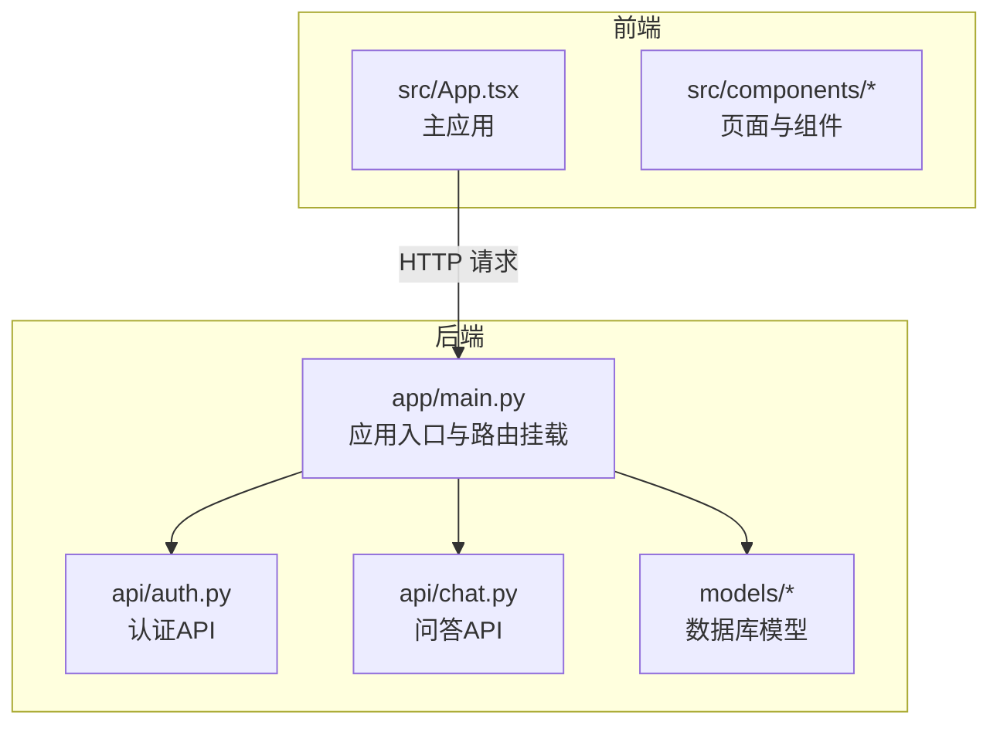
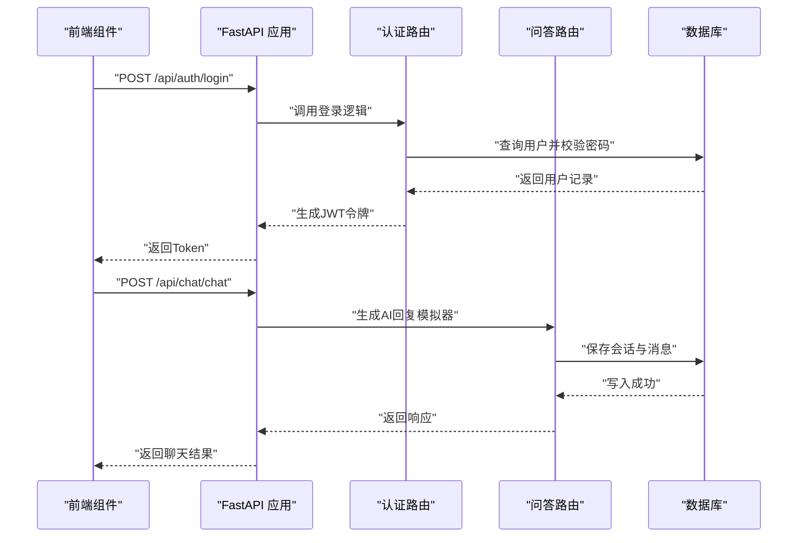
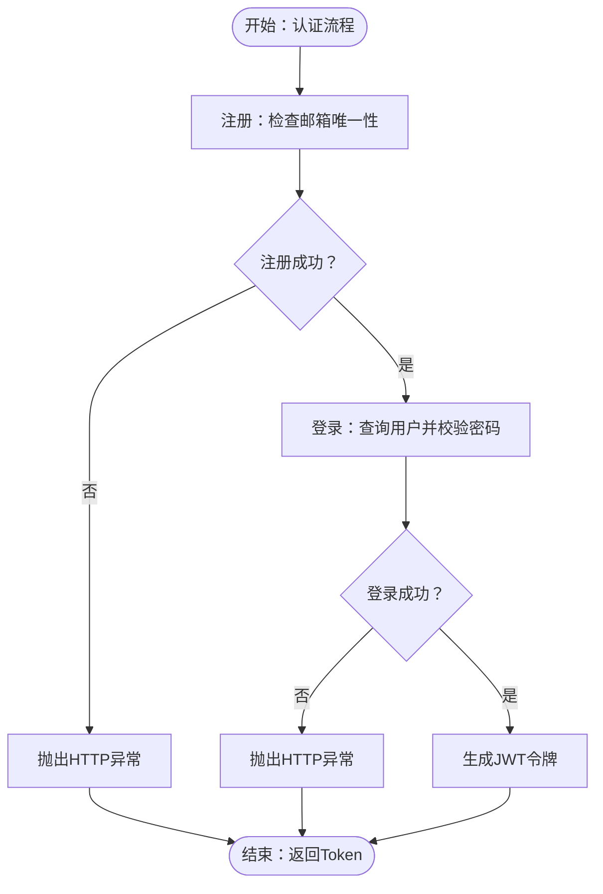
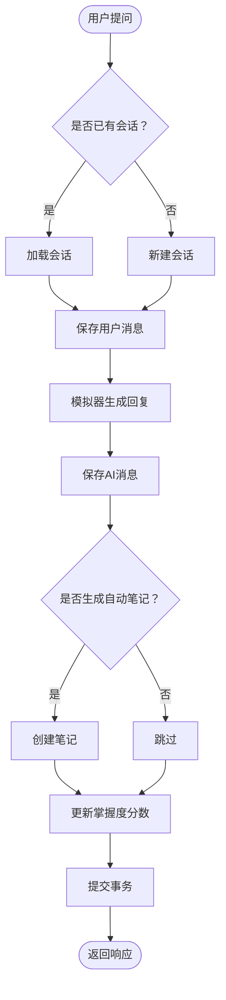

# 测试策略与实践

<cite>
**本文引用的文件**
- [PROJECT_OVERVIEW.md](file://PROJECT_OVERVIEW.md)
- [backend/README.md](file://backend/README.md)
- [front/README.md](file://front/README.md)
- [backend/requirements.txt](file://backend/requirements.txt)
- [front/package.json](file://front/package.json)
- [backend/app/main.py](file://backend/app/main.py)
- [backend/app/api/auth.py](file://backend/app/api/auth.py)
- [backend/app/api/chat.py](file://backend/app/api/chat.py)
- [backend/app/models/user.py](file://backend/app/models/user.py)
- [backend/app/models/note.py](file://backend/app/models/note.py)
</cite>

## 目录
1. [引言](#引言)
2. [项目结构](#项目结构)
3. [核心组件](#核心组件)
4. [架构总览](#架构总览)
5. [详细组件分析](#详细组件分析)
6. [依赖分析](#依赖分析)
7. [性能考虑](#性能考虑)
8. [故障排查指南](#故障排查指南)
9. [结论](#结论)
10. [附录](#附录)

## 引言
本测试策略文档面向Quickly项目，覆盖后端（FastAPI + Pytest）与前端（React + TypeScript + Vite）的测试体系，明确单元测试、集成测试与端到端测试的实施方法，提供Pytest与FastAPI测试客户端的使用指南、Mock对象与数据库测试配置、前端组件测试策略（React Testing Library）、测试数据管理、测试环境配置以及持续集成中的测试执行建议，并给出覆盖率与质量门禁标准及最佳实践。

## 项目结构
Quickly采用前后端分离架构：
- 后端：FastAPI + SQLAlchemy（异步）+ JWT认证 + Gemini AI模拟
- 前端：React 19 + TypeScript + Vite + Tailwind CSS + Motion

图表来源
- [backend/app/main.py:1-66](file://backend/app/main.py#L1-L66)
- [backend/app/api/auth.py:1-99](file://backend/app/api/auth.py#L1-L99)
- [backend/app/api/chat.py:1-252](file://backend/app/api/chat.py#L1-L252)
- [backend/app/models/user.py:1-39](file://backend/app/models/user.py#L1-L39)
- [backend/app/models/note.py:1-35](file://backend/app/models/note.py#L1-L35)

章节来源
- [PROJECT_OVERVIEW.md:1-200](file://PROJECT_OVERVIEW.md#L1-L200)
- [backend/README.md:1-75](file://backend/README.md#L1-L75)
- [front/README.md:1-21](file://front/README.md#L1-L21)

## 核心组件
- 应用入口与生命周期：后端通过 lifespan 在启动时创建数据库表，在关闭时释放连接；挂载认证、聊天、笔记、知识、掌握度、复习、设置等路由。
- 认证API：注册、登录、获取当前用户、登出；依赖数据库与安全工具（JWT、密码哈希）。
- 问答API：支持发送问题、获取会话历史；内置模拟器返回结构化回复、自动笔记与掌握度影响。
- 数据模型：用户、笔记等核心实体，定义字段与关系，支撑认证与问答功能。

章节来源
- [backend/app/main.py:15-66](file://backend/app/main.py#L15-L66)
- [backend/app/api/auth.py:22-99](file://backend/app/api/auth.py#L22-L99)
- [backend/app/api/chat.py:78-252](file://backend/app/api/chat.py#L78-L252)
- [backend/app/models/user.py:11-39](file://backend/app/models/user.py#L11-L39)
- [backend/app/models/note.py:11-35](file://backend/app/models/note.py#L11-L35)

## 架构总览
后端通过FastAPI提供REST API，前端通过HTTP请求与后端交互。测试应覆盖：
- 单元测试：核心业务逻辑（如认证、问答模拟器）
- 集成测试：API路由与数据库交互
- 端到端测试：前端组件渲染与用户交互

图表来源
- [backend/app/main.py:42-49](file://backend/app/main.py#L42-L49)
- [backend/app/api/auth.py:52-87](file://backend/app/api/auth.py#L52-L87)
- [backend/app/api/chat.py:78-151](file://backend/app/api/chat.py#L78-L151)

## 详细组件分析

### 认证模块测试策略
- 单元测试
  - 测试密码哈希与校验、JWT生成与解析、OAuth2表单处理。
  - 使用Mock替换数据库与安全工具，断言异常分支（重复邮箱、错误凭据、非活跃用户）。
- 集成测试
  - 使用FastAPI测试客户端发起注册/登录请求，验证响应结构与状态码。
  - 使用内存数据库（SQLite）或独立测试库，确保事务隔离与回滚。
- 端到端测试
  - 前端登录页组件渲染与表单提交，模拟用户输入与网络请求，断言跳转与提示。

图表来源
- [backend/app/api/auth.py:22-99](file://backend/app/api/auth.py#L22-L99)

章节来源
- [backend/app/api/auth.py:22-99](file://backend/app/api/auth.py#L22-L99)

### 问答模块测试策略
- 单元测试
  - 测试模拟器关键词匹配、默认回复、掌握度影响计算与 Mastery 更新逻辑。
  - Mock数据库会话，断言消息持久化与自动笔记创建。
- 集成测试
  - 使用测试客户端调用“发送问题”端点，断言响应字段（文本、芯片、自动笔记、掌握度影响）。
  - 验证会话历史与消息分页查询。
- 端到端测试
  - 前端聊天组件渲染与交互，模拟用户提问、等待AI回复、查看自动笔记与掌握度变化。

图表来源
- [backend/app/api/chat.py:78-151](file://backend/app/api/chat.py#L78-L151)
- [backend/app/api/chat.py:153-218](file://backend/app/api/chat.py#L153-L218)

章节来源
- [backend/app/api/chat.py:78-252](file://backend/app/api/chat.py#L78-L252)

### 数据模型与数据库测试
- 单元测试
  - 针对模型字段约束与关系进行验证（如外键、唯一索引、级联删除）。
- 集成测试
  - 使用独立测试数据库（例如临时SQLite文件或专用测试库），在每个测试用例前后清理数据。
  - 验证ORM操作（创建、读取、更新、删除）与事务一致性。

章节来源
- [backend/app/models/user.py:11-39](file://backend/app/models/user.py#L11-L39)
- [backend/app/models/note.py:11-35](file://backend/app/models/note.py#L11-L35)

## 依赖分析
- 后端依赖
  - Web框架：FastAPI、Uvicorn
  - 数据库：SQLAlchemy（异步）、Alembic、aiosqlite
  - 安全：python-jose、passlib（bcrypt）
  - AI集成：google-generativeai、aiohttp
  - 工具：pydantic、pydantic-settings、httpx、python-dotenv
- 前端依赖
  - 框架与构建：React 19、TypeScript、Vite、Express（开发服务器）
  - UI与动画：Tailwind CSS、Lucide React、Motion
  - 开发工具：tsx、esbuild、tailwindcss、typescript

章节来源
- [backend/requirements.txt:1-37](file://backend/requirements.txt#L1-L37)
- [front/package.json:1-36](file://front/package.json#L1-L36)

## 性能考虑
- 测试并发与异步：由于后端使用异步SQLAlchemy，测试中应避免阻塞I/O，优先使用异步测试客户端与异步数据库连接。
- Mock策略：对第三方AI服务与外部HTTP调用进行Mock，减少测试时延与外部依赖波动。
- 数据库隔离：每个测试用例使用独立事务或独立数据库实例，保证测试可重复性与隔离性。
- 前端渲染压力：组件测试中避免不必要的DOM渲染，优先使用轻量级渲染器与最小化快照。

## 故障排查指南
- 认证失败
  - 检查邮箱唯一性与密码哈希逻辑；确认JWT过期时间与签名密钥配置。
- 问答无响应
  - 核对模拟器关键词匹配规则与默认回复分支；验证会话与消息持久化。
- 数据库异常
  - 确认测试数据库初始化脚本与迁移配置；检查事务提交与回滚逻辑。
- 前端交互异常
  - 使用React Testing Library调试器定位元素；检查事件触发与状态更新。

## 结论
通过分层测试策略（单元、集成、端到端）与Mock、数据库隔离、覆盖率与质量门禁，Quickly可在快速迭代中保持高质量与稳定性。建议在CI中强制执行单元测试与覆盖率阈值，并对关键API与前端核心组件进行端到端验证。

## 附录

### 测试工具与配置清单
- 后端
  - 测试框架：Pytest
  - HTTP客户端：FastAPI TestClient
  - 异步数据库：SQLAlchemy + aiosqlite
  - Mock：unittest.mock 或 pytest-mock
  - 覆盖率：pytest-cov
- 前端
  - 测试框架：Jest（推荐）或 Vitest
  - 组件测试：React Testing Library
  - Mock：msw（Mock Service Worker）或 jest.mock
  - 覆盖率：Jest内置覆盖率

章节来源
- [backend/requirements.txt:1-37](file://backend/requirements.txt#L1-L37)
- [front/package.json:1-36](file://front/package.json#L1-L36)

### 测试用例编写与最佳实践
- 命名规范
  - 后端：test_*_success/test_*_failure/test_*_exception
  - 前端：should_*_when_* / test_*_renders_* / test_*_handles_* 
- 断言策略
  - 后端：断言状态码、响应体字段、数据库变更、异常类型
  - 前端：断言可见性、可访问性属性、事件回调触发
- Mock最佳实践
  - 对外部服务（AI、HTTP）统一Mock，避免真实调用
  - 对数据库使用事务或测试库隔离，确保可重复性
- 覆盖率与质量门禁
  - 建议：后端语句覆盖率≥80%，分支覆盖率≥70%；前端组件覆盖率≥85%
  - 质量门禁：未达阈值的PR禁止合并

### 数据管理与环境配置
- 测试数据库
  - 使用独立SQLite文件或专用测试库，避免污染开发/生产数据
- 环境变量
  - 后端：设置测试模式下的数据库URL、JWT密钥、禁用AI真实调用
  - 前端：设置API基础URL指向测试后端或Mock服务

### 持续集成中的测试执行
- 触发条件：push到分支/PR时自动运行
- 步骤建议：
  1) 安装依赖（后端虚拟环境、前端Node模块）
  2) 启动测试数据库（如需要）
  3) 运行后端Pytest（含覆盖率）
  4) 运行前端测试（含覆盖率）
  5) 上传覆盖率报告至平台（如Codecov）
  6) 若覆盖率未达标或测试失败，阻断合并