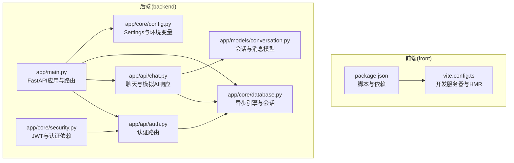
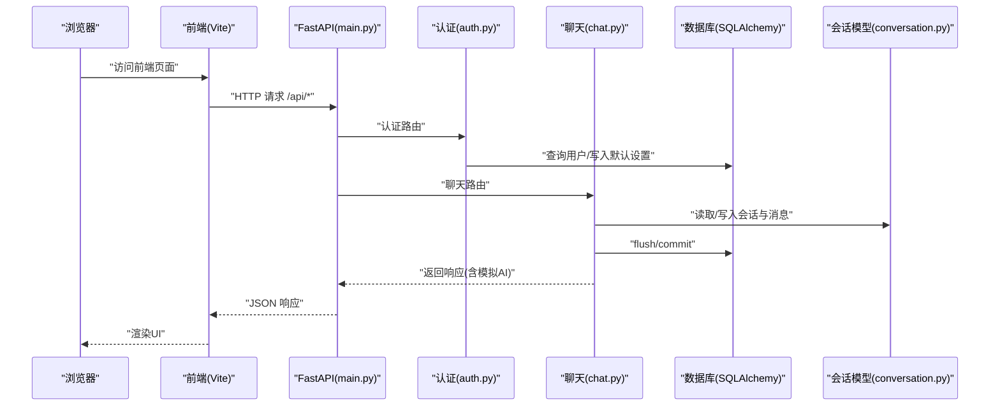
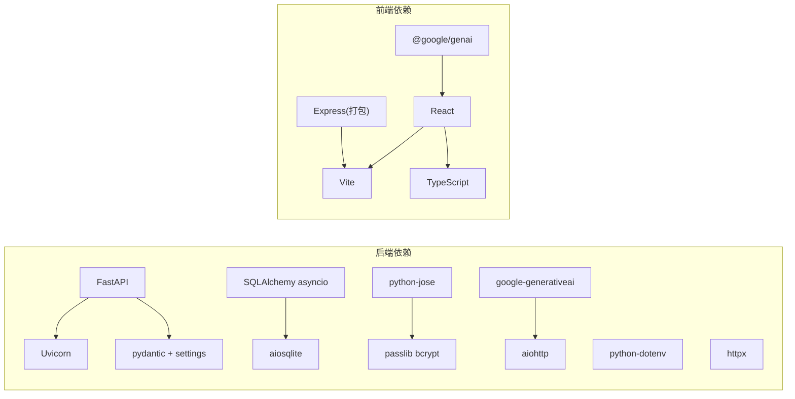

# 调试技巧与工具

<cite>
**本文引用的文件**
- [backend/app/main.py](file://backend/app/main.py)
- [backend/app/core/config.py](file://backend/app/core/config.py)
- [backend/app/core/database.py](file://backend/app/core/database.py)
- [backend/app/core/security.py](file://backend/app/core/security.py)
- [backend/app/api/auth.py](file://backend/app/api/auth.py)
- [backend/app/api/chat.py](file://backend/app/api/chat.py)
- [backend/app/models/conversation.py](file://backend/app/models/conversation.py)
- [backend/requirements.txt](file://backend/requirements.txt)
- [backend/README.md](file://backend/README.md)
- [front/package.json](file://front/package.json)
- [front/vite.config.ts](file://front/vite.config.ts)
- [PROJECT_OVERVIEW.md](file://PROJECT_OVERVIEW.md)
</cite>

## 目录
1. [简介](#简介)
2. [项目结构](#项目结构)
3. [核心组件](#核心组件)
4. [架构总览](#架构总览)
5. [详细组件分析](#详细组件分析)
6. [依赖分析](#依赖分析)
7. [性能考虑](#性能考虑)
8. [故障排查指南](#故障排查指南)
9. [结论](#结论)
10. [附录](#附录)

## 简介
本指南面向Quickly项目的开发者与测试人员，提供从Python后端到前端、数据库、缓存与AI API的全链路调试方法与工具使用建议。内容涵盖：
- Python后端调试：pdb调试器使用、日志与错误追踪、FastAPI开发服务器与中间件调试
- 前端调试：Chrome DevTools、React DevTools、网络请求监控
- 数据库与缓存：SQLAlchemy异步引擎echo、Redis连接调试
- AI API：Gemini集成调试与模拟模式切换
- 常见问题诊断流程与性能分析工具
- IDE配置与断点调试最佳实践

## 项目结构
Quickly采用前后端分离架构：
- 后端：FastAPI + SQLAlchemy 2.0异步 + uvicorn开发服务器
- 前端：React 19 + Vite + TypeScript
- 配置：Pydantic Settings加载.env环境变量；数据库默认SQLite，支持PostgreSQL；Redis用于可选缓存与任务队列

图表来源
- [backend/app/main.py:1-66](file://backend/app/main.py#L1-L66)
- [backend/app/core/config.py:1-45](file://backend/app/core/config.py#L1-L45)
- [backend/app/core/database.py:1-46](file://backend/app/core/database.py#L1-L46)
- [backend/app/core/security.py:1-80](file://backend/app/core/security.py#L1-L80)
- [backend/app/api/auth.py:1-99](file://backend/app/api/auth.py#L1-L99)
- [backend/app/api/chat.py:1-200](file://backend/app/api/chat.py#L1-L200)
- [backend/app/models/conversation.py:1-54](file://backend/app/models/conversation.py#L1-L54)
- [front/package.json:1-36](file://front/package.json#L1-L36)
- [front/vite.config.ts:1-23](file://front/vite.config.ts#L1-L23)

章节来源
- [PROJECT_OVERVIEW.md:1-200](file://PROJECT_OVERVIEW.md#L1-L200)
- [backend/README.md:1-75](file://backend/README.md#L1-L75)

## 核心组件
- FastAPI应用与生命周期：应用启动时自动创建数据库表，关闭时释放连接；根路径与状态端点便于健康检查。
- 配置系统：Settings通过.env文件加载DEBUG、数据库URL、Redis、CORS、AI密钥等；DEBUG开启时SQLAlchemy引擎echo输出SQL。
- 数据库层：异步引擎按数据库类型启用echo与连接池参数；提供get_db依赖注入会话。
- 安全与认证：bcrypt密码哈希、JWT令牌签发与校验、OAuth2密码流、当前用户解析。
- API路由：认证、聊天（含模拟AI响应与自动笔记/掌握度影响）、会话与消息模型。

章节来源
- [backend/app/main.py:15-66](file://backend/app/main.py#L15-L66)
- [backend/app/core/config.py:10-45](file://backend/app/core/config.py#L10-L45)
- [backend/app/core/database.py:15-46](file://backend/app/core/database.py#L15-L46)
- [backend/app/core/security.py:19-80](file://backend/app/core/security.py#L19-L80)
- [backend/app/api/auth.py:22-99](file://backend/app/api/auth.py#L22-L99)
- [backend/app/api/chat.py:78-151](file://backend/app/api/chat.py#L78-L151)
- [backend/app/models/conversation.py:11-54](file://backend/app/models/conversation.py#L11-L54)

## 架构总览
下图展示从浏览器到后端、数据库与AI模拟响应的交互路径，以及关键调试位置。

图表来源
- [backend/app/main.py:42-49](file://backend/app/main.py#L42-L49)
- [backend/app/api/auth.py:22-99](file://backend/app/api/auth.py#L22-L99)
- [backend/app/api/chat.py:78-151](file://backend/app/api/chat.py#L78-L151)
- [backend/app/models/conversation.py:11-54](file://backend/app/models/conversation.py#L11-L54)

## 详细组件分析

### Python后端调试：pdb、日志与错误追踪
- pdb调试器使用
  - 在需要定位的问题代码处插入断点触发器，例如在认证或聊天路由中临时抛出异常以进入调试器。
  - 使用命令行运行后端时，结合IDE断点或在代码中设置断点，逐步执行并观察上下文。
- 日志与错误追踪
  - SQL层：当DEBUG为真时，SQLAlchemy异步引擎echo开启，可在终端看到SQL语句与参数绑定，便于定位ORM问题。
  - 中间件：CORS中间件已配置，若出现跨域问题，优先检查CORS_ORIGINS与前端端口是否匹配。
  - 错误异常：认证与聊天路由中使用HTTPException抛出明确错误码与消息，便于前端与日志定位。
- FastAPI开发服务器与中间件调试
  - 开发服务器：使用uvicorn启动，支持reload热重载；可通过命令行参数调整host/port。
  - 中间件：CORS已在应用初始化时添加，如需调试其他中间件，可在main.py中按需扩展。

章节来源
- [backend/app/core/database.py:18-30](file://backend/app/core/database.py#L18-L30)
- [backend/app/main.py:34-40](file://backend/app/main.py#L34-L40)
- [backend/app/api/auth.py:25-31](file://backend/app/api/auth.py#L25-L31)
- [backend/app/api/chat.py:94-95](file://backend/app/api/chat.py#L94-L95)
- [backend/README.md:31-40](file://backend/README.md#L31-L40)

### FastAPI应用调试配置
- 开发服务器启动参数
  - host与port：通过命令行参数指定，便于多机联调或容器内调试。
  - reload：启用热重载，修改代码后自动重启，提升迭代效率。
- 中间件调试
  - CORS：确保前端开发端口在CORS_ORIGINS白名单中。
  - 如需增加自定义中间件，可在main.py中新增并置于合适顺序，避免覆盖已有中间件行为。

章节来源
- [backend/README.md:31-40](file://backend/README.md#L31-L40)
- [backend/app/main.py:34-40](file://backend/app/main.py#L34-L40)

### 前端调试：Chrome DevTools、React DevTools与网络监控
- Chrome DevTools
  - 打开“网络”面板，过滤XHR/Fetch请求，查看请求头、响应体、状态码与耗时，定位接口失败原因。
  - “元素”面板检查DOM结构与样式，确认UI渲染是否符合预期。
  - “控制台”面板查看JavaScript错误与警告，定位前端逻辑问题。
- React DevTools
  - 安装React DevTools浏览器扩展，查看组件树、Props与State变化，定位状态更新异常。
- 网络请求监控
  - 前端Vite开发服务器默认HMR开启；如遇到编辑器闪烁或CPU占用过高，可参考DISABLE_HMR环境变量调整watch策略。
  - 前端脚本中包含Express服务器打包产物，注意区分静态资源与API代理场景。

章节来源
- [front/package.json:6-12](file://front/package.json#L6-L12)
- [front/vite.config.ts:14-22](file://front/vite.config.ts#L14-L22)

### 数据库查询调试
- 异步引擎与echo
  - 当DEBUG为真时，SQLAlchemy异步引擎echo开启，可直接在终端看到SQL与参数，便于核对ORM查询是否正确。
- 连接池与性能
  - 非SQLite环境下启用pool_pre_ping、pool_size与max_overflow，有助于发现连接泄漏与并发问题。
- 依赖注入会话
  - get_db提供异步会话依赖，确保每个请求的数据库操作在独立事务中执行，并在finally中关闭会话。

章节来源
- [backend/app/core/database.py:18-36](file://backend/app/core/database.py#L18-L36)
- [backend/app/core/database.py:39-46](file://backend/app/core/database.py#L39-L46)

### Redis连接调试
- 配置项
  - REDIS_URL、CELERY_BROKER_URL、CELERY_RESULT_BACKEND均指向本地Redis实例，便于本地开发与任务队列调试。
- 常见问题
  - 连接失败：检查本地Redis服务状态与端口；确认防火墙与容器网络。
  - 性能瓶颈：关注连接池大小与键空间使用情况；必要时拆分数据库或引入哨兵/集群。

章节来源
- [backend/app/core/config.py:26-37](file://backend/app/core/config.py#L26-L37)

### AI API调用调试方法
- 模拟模式与真实模式
  - 状态端点根据是否配置GEMINI_API_KEY返回“simulator”或“gemini”，便于快速切换调试场景。
  - 聊天路由在模拟模式下返回预设响应，便于前端联调与UI验证。
- Gemini集成
  - 配置GEMINI_API_KEY后，后端可切换至真实AI回答；若未配置，仍可通过模拟模式继续开发。
  - aiohttp客户端用于HTTP请求，可结合日志与超时设置进行调试。

章节来源
- [backend/app/main.py:58-65](file://backend/app/main.py#L58-L65)
- [backend/app/api/chat.py:153-173](file://backend/app/api/chat.py#L153-L173)
- [backend/requirements.txt:21-24](file://backend/requirements.txt#L21-L24)

### 认证与安全调试
- 密码哈希与JWT
  - bcrypt密码哈希与verify_password用于验证登录；create_access_token与decode_token用于签发与校验JWT。
- OAuth2密码流
  - OAuth2PasswordBearer用于从Authorization头提取token；get_current_user解析当前用户并校验有效性。
- 常见问题
  - 401未授权：检查token格式、签名与过期时间；确认SECRET_KEY一致。
  - 400错误：邮箱重复注册、密码错误等业务异常，需结合后端日志与前端提示定位。

章节来源
- [backend/app/core/security.py:23-80](file://backend/app/core/security.py#L23-L80)
- [backend/app/api/auth.py:22-99](file://backend/app/api/auth.py#L22-L99)

### 会话与消息模型调试
- 关系映射
  - Conversation与Message通过外键关联，支持一对多与级联删除；调试时可检查外键约束与级联行为。
- 字段与索引
  - JSON字段用于存储chips、auto_note与topic_mastery_impact，便于AI响应元数据追踪；注意序列化与空值处理。

章节来源
- [backend/app/models/conversation.py:11-54](file://backend/app/models/conversation.py#L11-L54)
- [backend/app/api/chat.py:101-141](file://backend/app/api/chat.py#L101-L141)

## 依赖分析
- 后端依赖
  - web框架：FastAPI + uvicorn
  - 数据库：SQLAlchemy asyncio + aiosqlite
  - 认证：python-jose + passlib bcrypt
  - AI：google-generativeai + aiohttp
  - 验证与序列化：pydantic + pydantic-settings
  - 工具：python-dotenv + httpx
- 前端依赖
  - 框架：React + Vite + Express（打包产物）
  - 类型：TypeScript
  - AI：@google/genai

图表来源
- [backend/requirements.txt:1-37](file://backend/requirements.txt#L1-L37)
- [front/package.json:13-34](file://front/package.json#L13-L34)

章节来源
- [backend/requirements.txt:1-37](file://backend/requirements.txt#L1-L37)
- [front/package.json:13-34](file://front/package.json#L13-L34)

## 性能考虑
- 数据库
  - 使用异步引擎与连接池参数，避免阻塞；在DEBUG下观察SQL执行计划与参数绑定，识别慢查询。
- AI调用
  - 模拟模式用于快速开发；真实模式下注意超时与重试策略，避免阻塞请求线程。
- 前端
  - Vite HMR与文件监听在某些场景可能占用CPU，可通过DISABLE_HMR调整watch策略。
- 中间件
  - CORS与自定义中间件应尽量轻量，避免影响请求延迟。

## 故障排查指南
- 后端
  - 401未授权：检查Authorization头、JWT签名与过期；确认SECRET_KEY一致。
  - 400业务错误：如邮箱重复、密码错误，结合HTTPException消息与日志定位。
  - 数据库异常：开启DEBUG观察SQL；检查连接池配置与事务提交/回滚。
- 前端
  - 跨域问题：确认CORS_ORIGINS包含前端开发端口；检查浏览器Network面板。
  - HMR异常：根据DISABLE_HMR调整watch策略；清理node_modules缓存后重装依赖。
- AI集成
  - 未配置API Key：状态端点返回“simulator”，切换至真实模式需配置GEMINI_API_KEY。
  - 网络超时：aiohttp客户端设置合理超时与重试；结合日志定位慢请求。
- Redis
  - 连接失败：检查本地Redis服务；确认端口与防火墙；必要时拆分数据库。

章节来源
- [backend/app/api/auth.py:25-31](file://backend/app/api/auth.py#L25-L31)
- [backend/app/api/chat.py:94-95](file://backend/app/api/chat.py#L94-L95)
- [backend/app/core/database.py:18-30](file://backend/app/core/database.py#L18-L30)
- [backend/app/main.py:58-65](file://backend/app/main.py#L58-L65)
- [front/vite.config.ts:14-22](file://front/vite.config.ts#L14-L22)

## 结论
通过结合DEBUG开关、SQLAlchemy echo、FastAPI中间件与uvicorn热重载，以及Chrome DevTools与React DevTools，可以高效完成Quickly项目的端到端调试。针对数据库、Redis与AI API的专项调试策略，可进一步提升问题定位与修复效率。

## 附录
- 启动与访问
  - 后端：使用uvicorn启动并启用reload；访问文档端点查看API。
  - 前端：安装依赖后启动开发服务器，访问本地端口。
- 环境变量
  - 后端：DEBUG、DATABASE_URL、REDIS_URL、CORS_ORIGINS、GEMINI_API_KEY等。
  - 前端：VITE_API_BASE_URL等。

章节来源
- [backend/README.md:31-40](file://backend/README.md#L31-L40)
- [PROJECT_OVERVIEW.md:164-186](file://PROJECT_OVERVIEW.md#L164-L186)