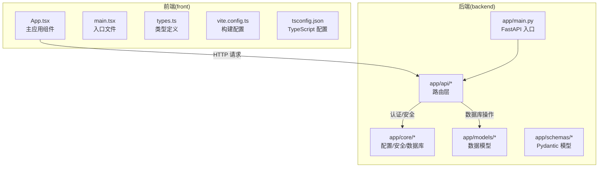
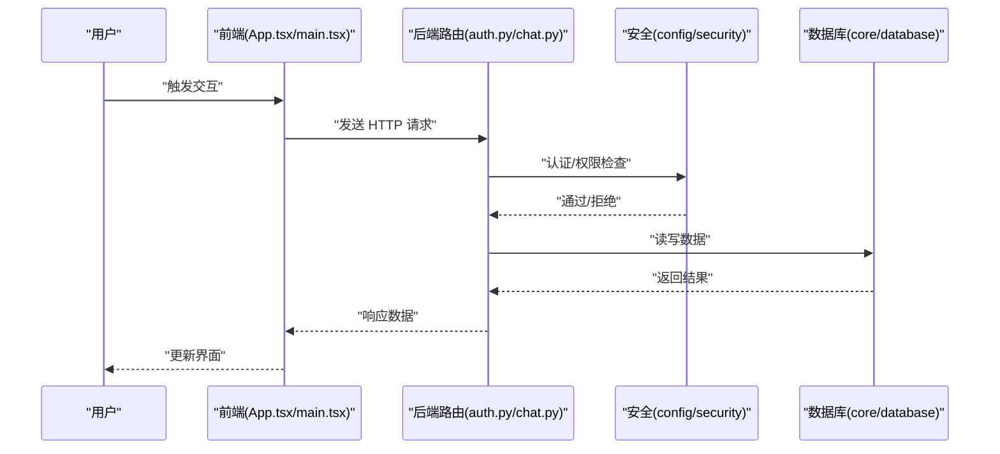
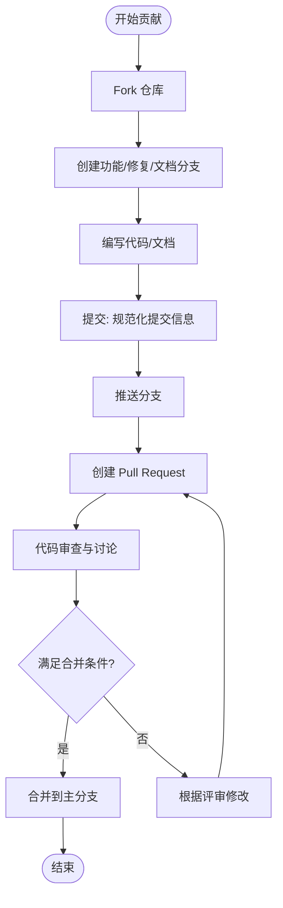
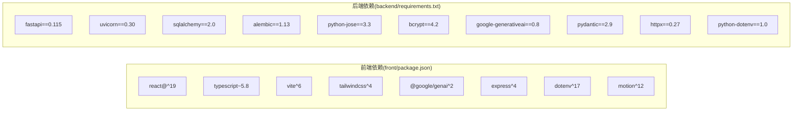

# 贡献指南

<cite>
**本文引用的文件**
- [PROJECT_OVERVIEW.md](file://PROJECT_OVERVIEW.md)
- [backend/README.md](file://backend/README.md)
- [front/README.md](file://front/README.md)
- [backend/requirements.txt](file://backend/requirements.txt)
- [front/package.json](file://front/package.json)
- [backend/app/main.py](file://backend/app/main.py)
- [backend/app/api/auth.py](file://backend/app/api/auth.py)
- [backend/app/api/chat.py](file://backend/app/api/chat.py)
- [backend/app/models/user.py](file://backend/app/models/user.py)
- [backend/app/schemas/user.py](file://backend/app/schemas/user.py)
- [backend/app/core/config.py](file://backend/app/core/config.py)
- [backend/app/core/security.py](file://backend/app/core/security.py)
- [backend/app/core/database.py](file://backend/app/core/database.py)
- [front/src/App.tsx](file://front/src/App.tsx)
- [front/src/main.tsx](file://front/src/main.tsx)
- [front/src/types.ts](file://front/src/types.ts)
- [front/vite.config.ts](file://front/vite.config.ts)
- [front/tsconfig.json](file://front/tsconfig.json)
</cite>

## 目录
1. [引言](#引言)
2. [项目结构](#项目结构)
3. [核心组件](#核心组件)
4. [架构总览](#架构总览)
5. [详细组件分析](#详细组件分析)
6. [依赖分析](#依赖分析)
7. [性能考虑](#性能考虑)
8. [故障排查指南](#故障排查指南)
9. [结论](#结论)
10. [附录](#附录)

## 引言
本贡献指南面向希望参与 Quickly 项目的开发者，提供从 Fork 到提交 Pull Request 的完整流程、代码贡献规范、Issue 与 Feature Request 流程、文档与翻译贡献方式、社区行为准则与沟通指南、新贡献者入门与导师制度、版本发布与变更日志维护要求，以及许可证与法律声明。Quickly 是一个基于前端 React + TypeScript + Vite、后端 Python + FastAPI 的 AI 学习平台，采用 SQLite 开发、PostgreSQL 生产的数据库方案，并集成了 Google Gemini API。

## 项目结构
Quickly 采用前后端分离架构：
- 前端（front）：React 19 + TypeScript + Vite，负责用户界面与交互逻辑。
- 后端（backend）：FastAPI + SQLAlchemy（异步）+ JWT 认证，提供 REST API 与业务逻辑。
- 项目概览文档（PROJECT_OVERVIEW.md）描述了技术栈、模块划分、API 端点与后续开发计划。

**图表来源**
- [PROJECT_OVERVIEW.md: 3-58:3-58](file://PROJECT_OVERVIEW.md#L3-L58)
- [backend/app/main.py](file://backend/app/main.py)
- [front/src/App.tsx](file://front/src/App.tsx)

**章节来源**
- [PROJECT_OVERVIEW.md: 3-58:3-58](file://PROJECT_OVERVIEW.md#L3-L58)
- [backend/README.md: 1-75:1-75](file://backend/README.md#L1-L75)
- [front/README.md: 1-21:1-21](file://front/README.md#L1-L21)

## 核心组件
- 前端核心文件
  - 主应用组件与入口：[front/src/App.tsx](file://front/src/App.tsx)、[front/src/main.tsx](file://front/src/main.tsx)
  - 类型定义：[front/src/types.ts](file://front/src/types.ts)
  - 构建与编译配置：[front/vite.config.ts](file://front/vite.config.ts)、[front/tsconfig.json](file://front/tsconfig.json)
- 后端核心文件
  - FastAPI 入口：[backend/app/main.py](file://backend/app/main.py)
  - 核心模块：配置、安全、数据库（[backend/app/core/config.py](file://backend/app/core/config.py)、[backend/app/core/security.py](file://backend/app/core/security.py)、[backend/app/core/database.py](file://backend/app/core/database.py)）
  - API 层：认证、问答等路由（[backend/app/api/auth.py](file://backend/app/api/auth.py)、[backend/app/api/chat.py](file://backend/app/api/chat.py)）
  - 数据模型与 Pydantic 模型：[backend/app/models/user.py](file://backend/app/models/user.py)、[backend/app/schemas/user.py](file://backend/app/schemas/user.py)

**章节来源**
- [PROJECT_OVERVIEW.md: 62-142:62-142](file://PROJECT_OVERVIEW.md#L62-L142)
- [backend/README.md: 41-75:41-75](file://backend/README.md#L41-L75)
- [front/README.md: 11-21:11-21](file://front/README.md#L11-L21)

## 架构总览
Quickly 的整体交互流程如下：
- 前端通过 HTTP 请求调用后端 API。
- 后端路由处理请求，进行认证与授权校验，访问数据库模型与 Pydantic 模型进行数据转换，返回响应。
- 前端接收响应并更新 UI。

**图表来源**
- [backend/app/api/auth.py](file://backend/app/api/auth.py)
- [backend/app/api/chat.py](file://backend/app/api/chat.py)
- [backend/app/core/security.py](file://backend/app/core/security.py)
- [backend/app/core/database.py](file://backend/app/core/database.py)
- [backend/app/main.py](file://backend/app/main.py)

## 详细组件分析

### 贡献流程总览
- Fork 仓库 → 创建分支 → 编写代码/文档 → 提交与推送 → 创建 PR → 代码审查与讨论 → 合并
- 分支命名建议：feat/xxx、fix/xxx、docs/xxx、refactor/xxx、chore/xxx
- 提交信息格式：类型(作用域): 描述；如 feat(api): 新增认证接口

[此图为概念性流程图，不直接映射具体源码文件，故无“图表来源”]

### 提交信息规范
- 类型限定：feat、fix、docs、style、refactor、perf、test、build、ci、chore、revert
- 作用域：模块名或文件路径（如 api、auth、chat、models、schemas、core、ui、deps）
- 示例：feat(api): 新增用户注册接口；fix(ui): 修复登录按钮点击无效问题；docs(readme): 更新安装说明

[本节为通用规范说明，无需“章节来源”]

### 代码审查要求
- 至少一名维护者同意
- 通过 CI 检查（前端类型检查、后端依赖安装与运行）
- 无重大安全风险与性能退化
- 代码风格统一，注释清晰，测试覆盖（如适用）

[本节为通用规范说明，无需“章节来源”]

### 合并标准
- 通过审查且获得批准
- 无冲突或冲突已解决
- 通过自动化与手动测试
- 变更日志更新（见“变更日志维护”）

[本节为通用规范说明，无需“章节来源”]

### Issue 报告模板与流程
- 模板字段建议
  - 标题：简明描述问题
  - 环境：操作系统、浏览器/Node 版本、Python 版本、依赖版本
  - 复现步骤：最小可复现步骤
  - 预期/实际结果：清晰对比
  - 日志/截图：便于定位问题
- 提交流程
  - 在 GitHub Issues 中新建 Issue
  - 维护者分配标签与优先级
  - 认领与修复后关闭 Issue

[本节为通用规范说明，无需“章节来源”]

### Feature Request 流程
- 在 GitHub Issues 中提交新特性请求，包含背景、需求与预期收益
- 维护者评估技术可行性与优先级
- 通过后分配任务并跟踪进度

[本节为通用规范说明，无需“章节来源”]

### 文档贡献方式
- 文档位置：项目根目录与模块内 README
- 贡献范围：功能说明、API 文档、部署与运维指南、最佳实践
- 格式要求：Markdown，保持一致性与易读性
- 更新策略：与功能同步更新，避免过时文档

**章节来源**
- [PROJECT_OVERVIEW.md: 106-142:106-142](file://PROJECT_OVERVIEW.md#L106-L142)
- [backend/README.md: 37-40:37-40](file://backend/README.md#L37-L40)

### 翻译贡献规范
- 翻译范围：UI 文案、错误提示、帮助文本、文档
- 保留占位符与变量，确保上下文一致
- 提交 PR 时标注语言与影响范围

[本节为通用规范说明，无需“章节来源”]

### 社区行为准则与沟通指南
- 尊重与包容：尊重不同观点与背景
- 建设性反馈：聚焦问题与改进建议
- 积极协作：及时响应与配合审查
- 遵守法律法规：不传播非法内容

[本节为通用规范说明，无需“章节来源”]

### 新贡献者入门与导师制度
- 新人引导
  - 从简单 Issue（good first issue）开始
  - 提供开发环境搭建与运行说明
- 导师制度
  - 指派维护者作为导师，协助审阅与答疑
  - 定期回顾贡献进展与技能提升

[本节为通用规范说明，无需“章节来源”]

### 版本发布流程与变更日志维护
- 版本号：遵循语义化版本（主.次.修订）
- 发布流程
  - 合并目标分支至主干
  - 更新变更日志（changelog），记录新增、修复、破坏性变更
  - 打标签并发布 Release
- 变更日志要求
  - 区分类型：新增、修复、改进、废弃、破坏性变更
  - 提供简要描述与相关 Issue/PR 链接

[本节为通用规范说明，无需“章节来源”]

### 许可证与法律声明
- 项目许可证：MIT（参考依赖许可证）
- 依赖许可证：部分依赖采用 Apache 2.0、BSD 等开源许可证
- 使用须知：遵守各自许可证条款，保留版权与许可声明

**章节来源**
- [backend/requirements.txt: 1-37:1-37](file://backend/requirements.txt#L1-L37)

## 依赖分析
- 前端依赖
  - React 19、TypeScript、Vite、Tailwind CSS、Lucide React、Motion、@google/genai、Express、dotenv 等
  - 构建脚本：dev、build、start、clean、lint
- 后端依赖
  - FastAPI、Uvicorn、SQLAlchemy（异步）、Alembic、Redis（可选）、Celery（可选）、JWT、bcrypt、Google Generative AI、Pydantic、httpx、python-dotenv 等

**图表来源**
- [front/package.json: 13-34:13-34](file://front/package.json#L13-L34)
- [backend/requirements.txt: 3-37:3-37](file://backend/requirements.txt#L3-L37)

**章节来源**
- [front/package.json: 1-36:1-36](file://front/package.json#L1-L36)
- [backend/requirements.txt: 1-37:1-37](file://backend/requirements.txt#L1-L37)

## 性能考虑
- 前端
  - 使用 Vite 构建，启用按需加载与 Tree Shaking
  - 合理拆分组件，避免不必要的重渲染
- 后端
  - 使用异步 SQLAlchemy 减少阻塞
  - 合理缓存与连接池配置（Redis/Celery 可选）
  - 控制并发与超时，避免长事务

[本节为通用指导，无需“章节来源”]

## 故障排查指南
- 环境变量
  - 前端：确认 .env 中 API 基础地址与 Gemini Key
  - 后端：复制 .env.example 并填写必要配置
- 端口占用
  - 前端默认 3000，后端默认 8000；若冲突请调整
- 依赖安装
  - 前端：安装依赖后运行 dev；如报错先清理 node_modules 再重试
  - 后端：虚拟环境中安装 requirements.txt
- API 文档
  - 启动后访问 http://localhost:8000/docs 查看接口

**章节来源**
- [PROJECT_OVERVIEW.md: 164-186:164-186](file://PROJECT_OVERVIEW.md#L164-L186)
- [backend/README.md: 24-39:24-39](file://backend/README.md#L24-L39)
- [front/README.md: 16-21:16-21](file://front/README.md#L16-L21)

## 结论
本指南提供了 QuickLy 项目的贡献路径、规范与流程，旨在帮助新老贡献者高效协作。请在提交前阅读并遵循上述规范，共同维护高质量的开源生态。

## 附录
- 快速开始参考
  - 前端：[front/README.md: 11-21:11-21](file://front/README.md#L11-L21)
  - 后端：[backend/README.md: 7-39:7-39](file://backend/README.md#L7-L39)
- API 端点参考
  - 认证、问答、笔记、掌握度、设置等端点详见：[PROJECT_OVERVIEW.md: 127-142:127-142](file://PROJECT_OVERVIEW.md#L127-L142)