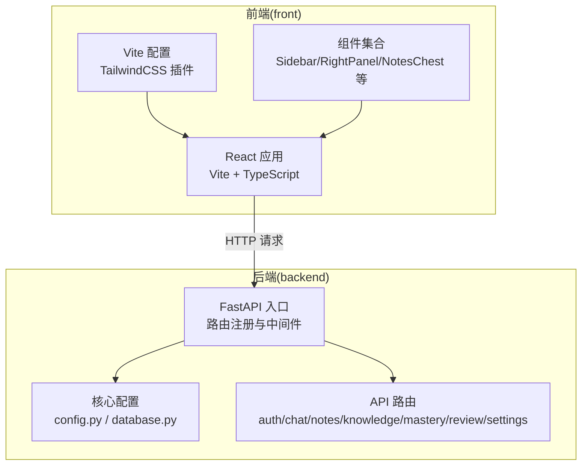
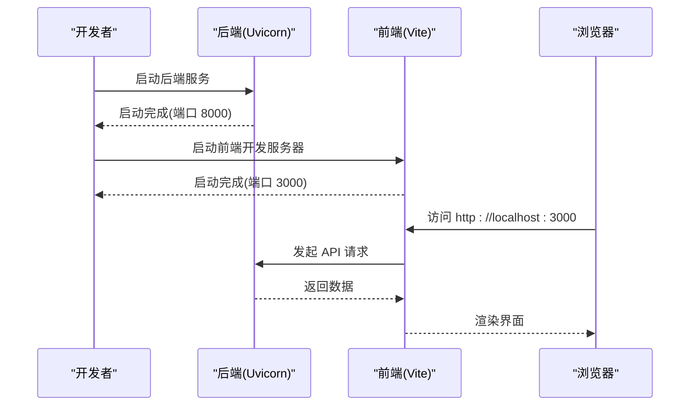
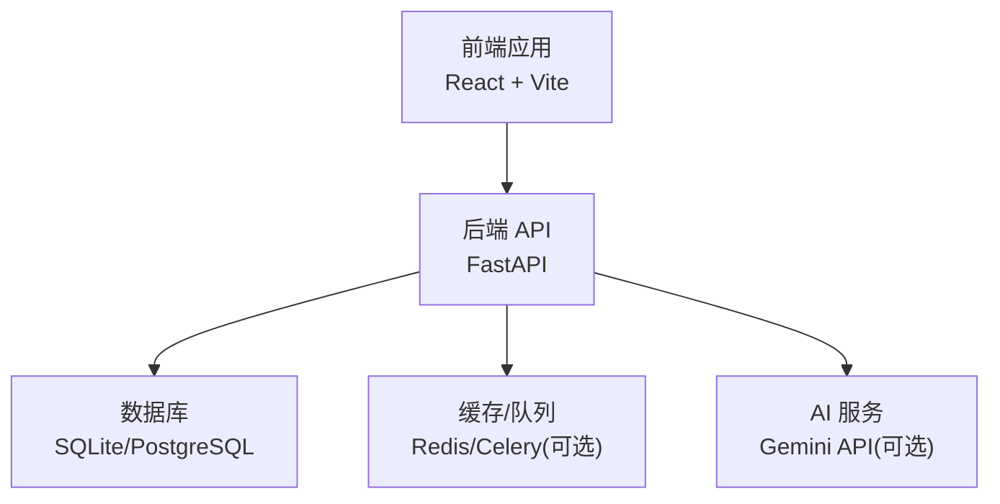

# 快速开始

<cite>
**本文引用的文件**
- [PROJECT_OVERVIEW.md](file://PROJECT_OVERVIEW.md)
- [backend/README.md](file://backend/README.md)
- [front/README.md](file://front/README.md)
- [backend/requirements.txt](file://backend/requirements.txt)
- [front/package.json](file://front/package.json)
- [backend/.env.example](file://backend/.env.example)
- [backend/app/main.py](file://backend/app/main.py)
- [backend/app/core/config.py](file://backend/app/core/config.py)
- [backend/app/core/database.py](file://backend/app/core/database.py)
- [front/vite.config.ts](file://front/vite.config.ts)
- [front/src/App.tsx](file://front/src/App.tsx)
- [front/src/main.tsx](file://front/src/main.tsx)
- [front/src/types.ts](file://front/src/types.ts)
</cite>

## 目录
1. [简介](#简介)
2. [项目结构](#项目结构)
3. [环境要求与前置条件](#环境要求与前置条件)
4. [依赖安装与配置](#依赖安装与配置)
5. [开发环境启动流程](#开发环境启动流程)
6. [常见问题排查](#常见问题排查)
7. [基本使用示例](#基本使用示例)
8. [架构概览](#架构概览)
9. [性能与最佳实践](#性能与最佳实践)
10. [故障排查指南](#故障排查指南)
11. [结语](#结语)

## 简介
Quickly 是一个基于 React + TypeScript + Vite 的前端与 FastAPI + Python 的后端组成的 AI 学习平台。项目提供登录/注册、AI 聊天问答、笔记管理、掌握度统计、学习路径与复习测验等功能。默认使用 SQLite 开发数据库，支持通过环境变量切换到 PostgreSQL，并集成了 Google Gemini API（可选）以提供真实 AI 回答。

## 项目结构
项目采用前后端分离架构，分别位于 backend 与 front 目录：
- 后端：FastAPI 应用，包含 API 路由、核心配置、数据库连接与模型定义。
- 前端：React + TypeScript 应用，使用 Vite 构建，Tailwind CSS 样式，Lucide React 图标与 Framer Motion 动画。

图表来源
- [backend/app/main.py:1-66](file://backend/app/main.py#L1-L66)
- [backend/app/core/config.py:1-45](file://backend/app/core/config.py#L1-L45)
- [backend/app/core/database.py:1-46](file://backend/app/core/database.py#L1-L46)
- [front/vite.config.ts:1-23](file://front/vite.config.ts#L1-L23)
- [front/src/App.tsx:1-840](file://front/src/App.tsx#L1-L840)

章节来源
- [PROJECT_OVERVIEW.md:3-58](file://PROJECT_OVERVIEW.md#L3-L58)
- [PROJECT_OVERVIEW.md:106-125](file://PROJECT_OVERVIEW.md#L106-L125)

## 环境要求与前置条件
- Python 3.x：用于后端开发与部署（推荐使用 Python 3.10+）
- Node.js：用于前端开发与构建（推荐使用 Node.js 18+）
- 数据库：默认使用 SQLite（开发环境），生产环境建议使用 PostgreSQL
- 可选：Redis（用于缓存与任务队列）、Google Gemini API Key（启用真实 AI 回答）

章节来源
- [PROJECT_OVERVIEW.md:60-75](file://PROJECT_OVERVIEW.md#L60-L75)
- [PROJECT_OVERVIEW.md:164-186](file://PROJECT_OVERVIEW.md#L164-L186)
- [backend/requirements.txt:1-37](file://backend/requirements.txt#L1-L37)
- [front/package.json:1-36](file://front/package.json#L1-L36)

## 依赖安装与配置
本节涵盖前后端依赖安装与环境变量配置。

- 后端依赖安装
  - 创建并激活虚拟环境
  - 安装依赖：pip install -r requirements.txt
  - 复制并编辑 .env 示例文件，设置必要配置项
  - 启动 Uvicorn 服务器

- 前端依赖安装
  - 安装依赖：npm install
  - 在 .env.local 中配置 GEMINI_API_KEY（如需真实 AI）
  - 启动开发服务器

- 环境变量配置
  - 后端 .env：包含应用名称、调试模式、密钥、数据库 URL、Redis/Celery 配置、CORS 允许来源、Gemini API Key 等
  - 前端 .env.local：包含 API 基础地址（默认指向后端 8000 端口）

章节来源
- [backend/README.md:7-35](file://backend/README.md#L7-L35)
- [PROJECT_OVERVIEW.md:164-186](file://PROJECT_OVERVIEW.md#L164-L186)
- [backend/.env.example:1-21](file://backend/.env.example#L1-L21)
- [front/README.md:11-21](file://front/README.md#L11-L21)

## 开发环境启动流程
以下为从克隆代码到成功运行应用的完整步骤。

- 克隆仓库并进入根目录
- 启动后端
  - 进入 backend 目录
  - 创建虚拟环境并激活
  - 安装依赖
  - 复制 .env.example 并按需修改
  - 启动 Uvicorn 服务器
  - 访问 http://localhost:8000/docs 查看 API 文档
- 启动前端
  - 进入 front 目录
  - 安装依赖
  - 如需真实 AI，配置 GEMINI_API_KEY
  - 启动开发服务器
  - 访问 http://localhost:3000

图表来源
- [backend/README.md:31-35](file://backend/README.md#L31-L35)
- [PROJECT_OVERVIEW.md:108-125](file://PROJECT_OVERVIEW.md#L108-L125)

章节来源
- [PROJECT_OVERVIEW.md:106-125](file://PROJECT_OVERVIEW.md#L106-L125)
- [backend/README.md:7-35](file://backend/README.md#L7-L35)
- [front/README.md:11-21](file://front/README.md#L11-L21)

## 常见问题排查
- 后端无法启动或端口占用
  - 检查端口是否被占用，调整后端端口或释放占用进程
  - 确认虚拟环境已激活且依赖安装完成
- 前端无法访问后端 API
  - 确认前端 .env.local 中的 API 基础地址指向后端 8000 端口
  - 检查 CORS 配置是否允许前端来源
- 数据库连接失败
  - 确认 DATABASE_URL 是否正确（默认 SQLite 路径）
  - 如切换至 PostgreSQL，确保连接字符串格式正确
- AI 功能不可用
  - 若未配置 GEMINI_API_KEY，后端将以模拟模式运行
  - 配置后端 .env 中的 GEMINI_API_KEY 并重启服务

章节来源
- [PROJECT_OVERVIEW.md:164-186](file://PROJECT_OVERVIEW.md#L164-L186)
- [backend/.env.example:1-21](file://backend/.env.example#L1-L21)
- [backend/app/main.py:52-66](file://backend/app/main.py#L52-L66)

## 基本使用示例
- 登录/注册
  - 前端登录页提供邮箱登录与密码验证
  - 后端提供注册与登录接口，返回 JWT Token
- AI 聊天问答
  - 在学习问答页输入问题，前端调用后端 /api/chat 接口
  - 支持预设问题快捷提问
- 笔记管理
  - 在笔记页查看、编辑与删除笔记
  - 支持 Markdown 内容与自动笔记生成
- 掌握度与复习
  - 掌握度页面展示多维分数
  - 复习页提供测验入口，提交结果可提升对应分数

章节来源
- [PROJECT_OVERVIEW.md:76-95](file://PROJECT_OVERVIEW.md#L76-L95)
- [PROJECT_OVERVIEW.md:127-142](file://PROJECT_OVERVIEW.md#L127-L142)
- [front/src/App.tsx:156-245](file://front/src/App.tsx#L156-L245)

## 架构概览
后端采用 FastAPI + SQLAlchemy 异步 ORM，支持 SQLite/PostgreSQL；前端采用 React + TypeScript + Vite，使用 Tailwind CSS 与 Lucide React 图标。应用通过 CORS 中间件允许前端跨域访问，后端根据是否配置 Gemini API Key 决定运行模式（模拟或真实）。

图表来源
- [PROJECT_OVERVIEW.md:69-75](file://PROJECT_OVERVIEW.md#L69-L75)
- [backend/app/main.py:33-49](file://backend/app/main.py#L33-L49)
- [backend/app/core/config.py:23-37](file://backend/app/core/config.py#L23-L37)
- [backend/requirements.txt:13-27](file://backend/requirements.txt#L13-L27)

章节来源
- [PROJECT_OVERVIEW.md:69-75](file://PROJECT_OVERVIEW.md#L69-L75)
- [backend/app/main.py:33-49](file://backend/app/main.py#L33-L49)
- [backend/app/core/config.py:23-37](file://backend/app/core/config.py#L23-L37)

## 性能与最佳实践
- 使用异步数据库连接（SQLAlchemy asyncio）以提升并发性能
- 在生产环境使用 PostgreSQL 并配置连接池参数
- 合理设置 CORS 允许来源，避免过度放宽容错策略
- 对于 AI 调用，建议增加超时与重试机制，避免阻塞前端请求
- 前端开发时启用 HMR（热模块替换），提高开发效率

章节来源
- [backend/app/core/database.py:15-30](file://backend/app/core/database.py#L15-L30)
- [PROJECT_OVERVIEW.md:179-186](file://PROJECT_OVERVIEW.md#L179-L186)
- [front/vite.config.ts:14-20](file://front/vite.config.ts#L14-L20)

## 故障排查指南
- 启动后端报错
  - 检查虚拟环境是否激活
  - 确认 requirements.txt 中依赖版本兼容
  - 查看 .env 配置项是否缺失或格式错误
- 启动前端报错
  - 检查 Node.js 版本是否满足 package.json 要求
  - 确认 .env.local 中的 GEMINI_API_KEY 格式正确
- 数据库初始化失败
  - 确认 DATABASE_URL 指向正确的数据库类型与路径
  - 如使用 PostgreSQL，检查连接凭据与网络可达性
- API 文档无法访问
  - 确认后端已启动且端口 8000 可用
  - 检查 CORS 配置是否允许浏览器访问

章节来源
- [backend/README.md:7-35](file://backend/README.md#L7-L35)
- [front/README.md:11-21](file://front/README.md#L11-L21)
- [backend/.env.example:1-21](file://backend/.env.example#L1-L21)
- [PROJECT_OVERVIEW.md:127-129](file://PROJECT_OVERVIEW.md#L127-L129)

## 结语
通过以上步骤，您可以快速搭建并运行 Quickly 项目。建议在本地开发完成后，逐步完善生产环境配置（如 PostgreSQL、Redis、Gemini API Key），并根据团队需求扩展功能模块。如遇问题，可参考本文档的“常见问题排查”与“故障排查指南”。