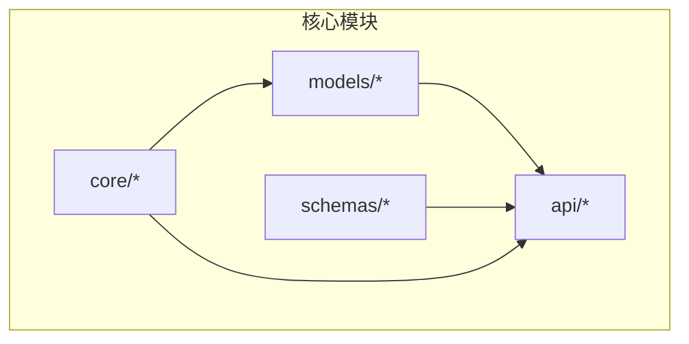
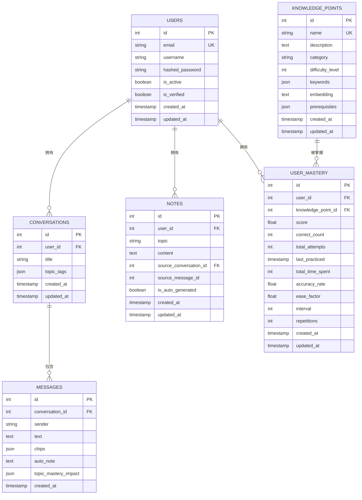
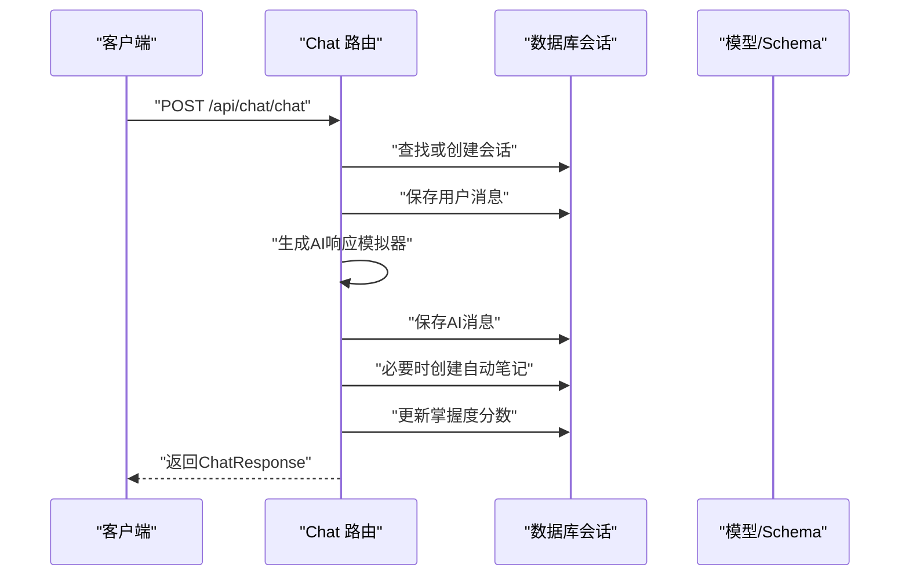
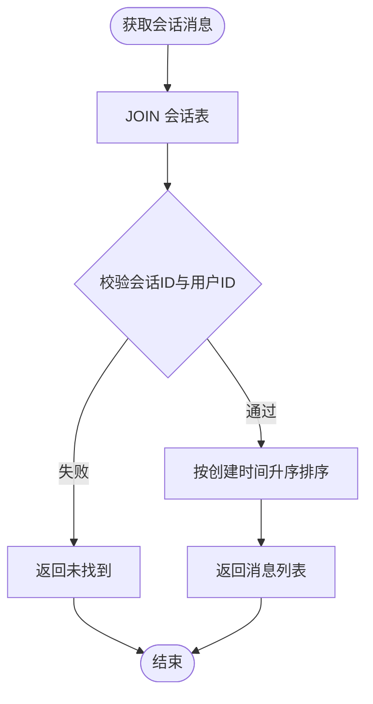
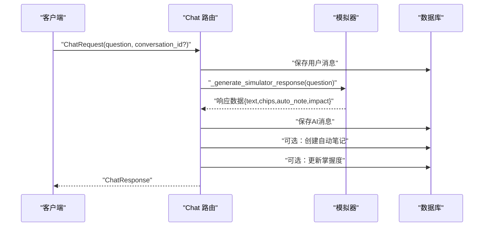
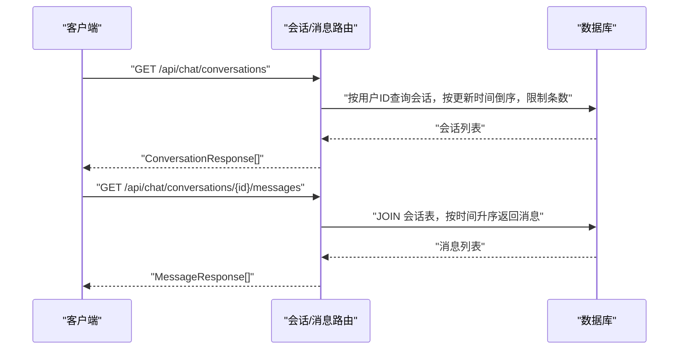
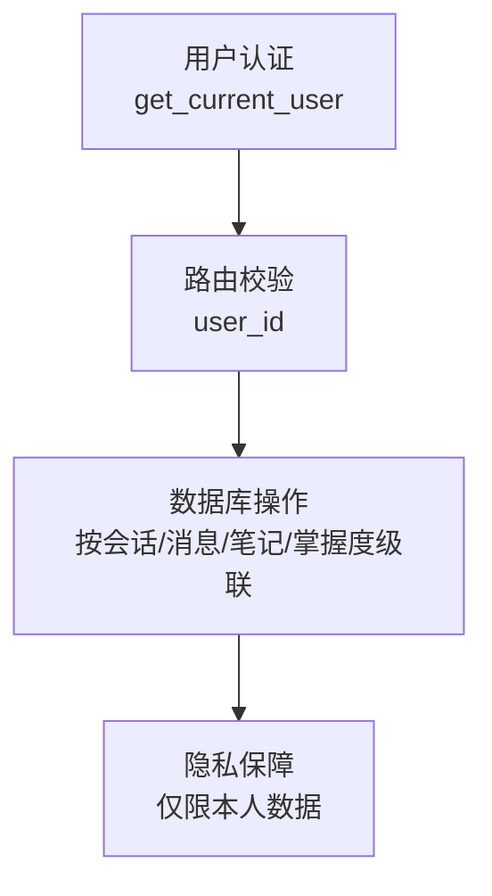
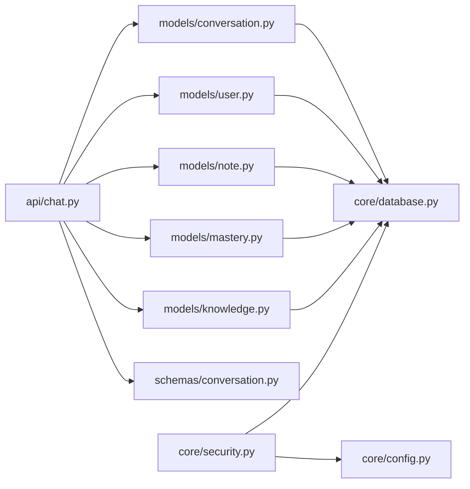

# 会话模型设计

<cite>
**本文引用的文件**
- [conversation.py](file://backend/app/models/conversation.py)
- [conversation.py](file://backend/app/schemas/conversation.py)
- [chat.py](file://backend/app/api/chat.py)
- [database.py](file://backend/app/core/database.py)
- [config.py](file://backend/app/core/config.py)
- [security.py](file://backend/app/core/security.py)
- [user.py](file://backend/app/models/user.py)
- [note.py](file://backend/app/models/note.py)
- [mastery.py](file://backend/app/models/mastery.py)
- [knowledge.py](file://backend/app/models/knowledge.py)
- [README.md](file://backend/README.md)
</cite>

## 目录
1. [引言](#引言)
2. [项目结构](#项目结构)
3. [核心组件](#核心组件)
4. [架构总览](#架构总览)
5. [详细组件分析](#详细组件分析)
6. [依赖分析](#依赖分析)
7. [性能考虑](#性能考虑)
8. [故障排除指南](#故障排除指南)
9. [结论](#结论)
10. [附录](#附录)

## 引言
本文件系统性地阐述 Quickly 项目中的会话模型设计与实现，重点覆盖 Conversation 表与 Message 表的数据结构、会话生命周期管理、消息排序与上下文保持策略、AI 问答交互的数据流、消息类型区分与内容存储格式、会话检索与分页查询、历史记录管理、消息验证规则与内容过滤机制，以及会话数据的隐私保护与删除策略。文档同时提供面向开发与非技术读者的渐进式说明，并辅以可视化图示帮助理解。

## 项目结构
后端采用 FastAPI + SQLAlchemy 异步 ORM 的分层架构：
- 核心模块
  - models：定义数据库实体（Conversation、Message、User、Note、UserMastery、KnowledgePoint）
  - schemas：定义 Pydantic 数据传输对象（DTO），用于请求/响应校验与序列化
  - api：定义路由与业务流程（如聊天接口）
  - core：数据库连接、配置与安全工具
- 前端位于 front 目录，后端通过 REST API 与前端交互

章节来源
- [README.md:41-66](file://backend/README.md#L41-L66)

## 核心组件
本节聚焦 Conversation 与 Message 的数据模型与关系，以及与之配套的 Pydantic Schema。

- Conversation（会话）
  - 关键字段
    - 标识：主键 id
    - 所属用户：外键 user_id
    - 标题：title（可空，最大长度 200）
    - 主题标签：topic_tags（JSON 数组，默认空列表）
    - 时间戳：created_at、updated_at（自动维护）
  - 关系
    - 与 User：多对一
    - 与 Message：一对多（级联删除或孤立孤儿）

- Message（消息）
  - 关键字段
    - 标识：主键 id
    - 所属会话：外键 conversation_id
    - 发送者：sender（字符串，取值 "user" 或 "system"）
    - 内容：text（文本，必填）
    - 知识点标签：chips（JSON 数组，默认空列表）
    - 自动笔记：auto_note（可空文本）
    - 掌握度影响：topic_mastery_impact（JSON 对象，可空）
    - 时间戳：created_at（自动维护）
  - 关系
    - 与 Conversation：多对一

- Schema 映射
  - ConversationCreate/ConversationResponse：与数据库模型字段一一对应，含标题、主题标签、时间戳与消息列表
  - MessageCreate/MessageResponse：与数据库模型字段一一对应，含发送者、文本、知识点标签、自动笔记、掌握度影响与时间戳
  - ChatRequest/ChatResponse：聊天请求/响应 DTO，包含问题、会话 ID、AI 回答、知识点标签、自动笔记、掌握度影响与消息 ID

章节来源
- [conversation.py:11-54](file://backend/app/models/conversation.py#L11-L54)
- [conversation.py:11-73](file://backend/app/schemas/conversation.py#L11-L73)

## 架构总览
下图展示会话模型在系统中的位置与交互关系，包括用户、会话、消息、笔记与掌握度等实体。

图表来源
- [user.py:11-39](file://backend/app/models/user.py#L11-L39)
- [conversation.py:11-54](file://backend/app/models/conversation.py#L11-L54)
- [note.py:11-35](file://backend/app/models/note.py#L11-L35)
- [mastery.py:11-44](file://backend/app/models/mastery.py#L11-L44)
- [knowledge.py:10-32](file://backend/app/models/knowledge.py#L10-L32)

## 详细组件分析

### 会话生命周期管理
- 创建
  - 若未指定 conversation_id，则为当前用户创建新会话；若指定则需校验会话归属（user_id）。
- 更新
  - 会话的 updated_at 字段由 ORM 自动更新。
- 结束
  - 会话与其子消息通过“级联删除或孤立孤儿”策略管理，确保删除会话时子消息同步清理。

图表来源
- [chat.py:78-151](file://backend/app/api/chat.py#L78-L151)
- [conversation.py:11-54](file://backend/app/models/conversation.py#L11-L54)
- [conversation.py:11-73](file://backend/app/schemas/conversation.py#L11-L73)

章节来源
- [chat.py:85-100](file://backend/app/api/chat.py#L85-L100)
- [conversation.py:29-30](file://backend/app/models/conversation.py#L29-L30)

### 消息排序机制与上下文保持
- 消息排序
  - 获取会话消息按 created_at 升序排列，保证对话顺序一致。
- 上下文保持
  - 会话内所有消息构成完整上下文；AI 响应生成基于关键词匹配（模拟器），并可附加知识点标签与掌握度影响，便于后续复习与笔记自动生成。

图表来源
- [chat.py:235-251](file://backend/app/api/chat.py#L235-L251)

章节来源
- [chat.py:242-249](file://backend/app/api/chat.py#L242-L249)

### AI 问答交互的数据流与消息类型
- 请求/响应
  - ChatRequest：包含 question 与可选 conversation_id
  - ChatResponse：包含 text、chips、auto_note、topic_mastery_impact、conversation_id、message_id
- 消息类型
  - 用户消息：sender="user"
  - AI 消息：sender="system"
- 数据生成
  - 模拟器根据问题关键词匹配预设响应，计算掌握度影响并生成知识点标签；必要时创建自动笔记。

图表来源
- [chat.py:58-73](file://backend/app/schemas/conversation.py#L58-L73)
- [chat.py:78-151](file://backend/app/api/chat.py#L78-L151)
- [chat.py:153-174](file://backend/app/api/chat.py#L153-L174)

章节来源
- [conversation.py:41-47](file://backend/app/models/conversation.py#L41-L47)
- [conversation.py:31-40](file://backend/app/schemas/conversation.py#L31-L40)

### 会话检索、分页查询与历史记录管理
- 会话检索
  - 获取当前用户的会话列表，按 updated_at 降序排列，限制返回数量（示例：20 条）。
- 历史记录管理
  - 通过会话 ID 获取该会话的所有消息，按时间升序排列，形成完整历史。

图表来源
- [chat.py:220-232](file://backend/app/api/chat.py#L220-L232)
- [chat.py:235-251](file://backend/app/api/chat.py#L235-L251)

章节来源
- [chat.py:226-232](file://backend/app/api/chat.py#L226-L232)
- [chat.py:242-249](file://backend/app/api/chat.py#L242-L249)

### 消息验证规则、长度限制与内容过滤
- 长度限制
  - 会话标题：最大长度 200
  - 笔记主题：最大长度 200
- 类型约束
  - sender 限定为 "user" 或 "system"
  - chips、topic_mastery_impact 为 JSON 结构
- 内容过滤
  - 当前实现未见显式的敏感词过滤或内容清洗逻辑；模拟器返回内容为预设模板与拼接文本，未见外部输入直接注入的危险内容路径。

章节来源
- [conversation.py:13](file://backend/app/schemas/conversation.py#L13)
- [conversation.py:31-40](file://backend/app/schemas/conversation.py#L31-L40)
- [note.py:12-20](file://backend/app/models/note.py#L12-L20)
- [chat.py:153-174](file://backend/app/api/chat.py#L153-L174)

### 会话数据的隐私保护与删除策略
- 隐私保护
  - 路由层通过 get_current_user 依赖注入获取当前用户，所有读写操作均校验 user_id，避免越权访问。
  - 密码哈希与 JWT 签发/校验由安全模块统一处理。
- 删除策略
  - 会话与其消息采用“级联删除或孤立孤儿”策略，删除会话时子消息同步清理；用户删除时其关联的会话、消息、笔记、掌握度记录亦按级联策略清理。

图表来源
- [security.py:54-80](file://backend/app/core/security.py#L54-L80)
- [chat.py:86-95](file://backend/app/api/chat.py#L86-L95)
- [conversation.py:29-30](file://backend/app/models/conversation.py#L29-L30)
- [user.py:34-39](file://backend/app/models/user.py#L34-L39)

章节来源
- [security.py:54-80](file://backend/app/core/security.py#L54-L80)
- [conversation.py:29-30](file://backend/app/models/conversation.py#L29-L30)
- [user.py:34-39](file://backend/app/models/user.py#L34-L39)

## 依赖分析
- 组件耦合
  - api/chat.py 依赖 models/conversation.py、models/user.py、models/note.py、models/mastery.py、models/knowledge.py 与 schemas/conversation.py
  - models 依赖 core/database.py 的异步引擎与会话管理
  - core/security.py 依赖 core/config.py 的配置项
- 外部依赖
  - 数据库：SQLAlchemy 异步引擎（SQLite/PostgreSQL）
  - 缓存与任务队列：Redis/Celery（配置存在，但与会话模型无直接耦合）

图表来源
- [chat.py:14-19](file://backend/app/api/chat.py#L14-L19)
- [database.py:15-45](file://backend/app/core/database.py#L15-L45)
- [security.py:14-16](file://backend/app/core/security.py#L14-L16)
- [config.py:10-44](file://backend/app/core/config.py#L10-L44)

章节来源
- [chat.py:14-19](file://backend/app/api/chat.py#L14-L19)
- [database.py:15-45](file://backend/app/core/database.py#L15-L45)
- [security.py:14-16](file://backend/app/core/security.py#L14-L16)
- [config.py:10-44](file://backend/app/core/config.py#L10-L44)

## 性能考虑
- 数据库连接池
  - 非 SQLite 场景启用连接池（pool_pre_ping、pool_size、max_overflow），提升并发性能与连接稳定性。
- 查询优化
  - 会话列表按 updated_at 降序并限制数量，减少大结果集扫描。
  - 消息查询按 created_at 升序，避免复杂索引开销。
- 异步 I/O
  - 使用 SQLAlchemy 异步引擎与会话，降低阻塞风险，提升吞吐量。

章节来源
- [database.py:16-36](file://backend/app/core/database.py#L16-L36)
- [chat.py:226-232](file://backend/app/api/chat.py#L226-L232)
- [chat.py:242-249](file://backend/app/api/chat.py#L242-L249)

## 故障排除指南
- 会话不存在
  - 当指定 conversation_id 且不属于当前用户时，返回 404。请确认会话归属与权限。
- 未认证或令牌无效
  - 路由依赖 get_current_user，令牌缺失或解析失败将触发 401。检查 JWT 令牌有效性与签名算法。
- 数据库连接异常
  - 非 SQLite 场景下连接池参数不当可能导致连接泄漏或超时。检查 DATABASE_URL 与连接池配置。
- 模拟器无匹配响应
  - 问题关键词未命中预设模板时返回默认响应。可在模拟器中扩展关键词与响应模板。

章节来源
- [chat.py:94-95](file://backend/app/api/chat.py#L94-L95)
- [security.py:59-79](file://backend/app/core/security.py#L59-L79)
- [database.py:16-30](file://backend/app/core/database.py#L16-L30)
- [chat.py:153-174](file://backend/app/api/chat.py#L153-L174)

## 结论
Quickly 的会话模型以 Conversation 与 Message 为核心，通过明确的消息类型、时间戳与 JSON 元数据字段，实现了清晰的问答交互与上下文保持。路由层严格校验用户身份与会话归属，结合级联删除策略，保障了数据一致性与隐私安全。当前实现采用模拟器生成 AI 响应，具备良好的扩展性，便于接入真实的大模型服务。未来可在内容过滤、分页参数化与缓存策略等方面进一步增强。

## 附录
- API 端点概览（来自 README）
  - 认证：注册、登录、获取当前用户
  - 问答：发送问题获取 AI 回答、获取会话历史
  - 笔记：增删改查
  - 掌握度：概览、列表、提交测验结果
  - 设置：获取与更新

章节来源
- [README.md:41-66](file://backend/README.md#L41-L66)