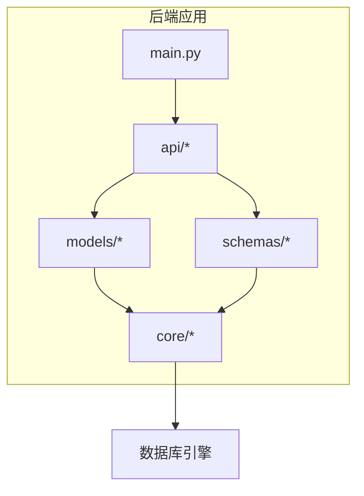
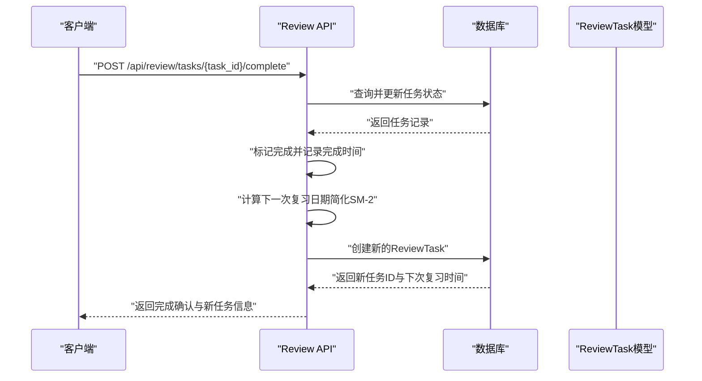
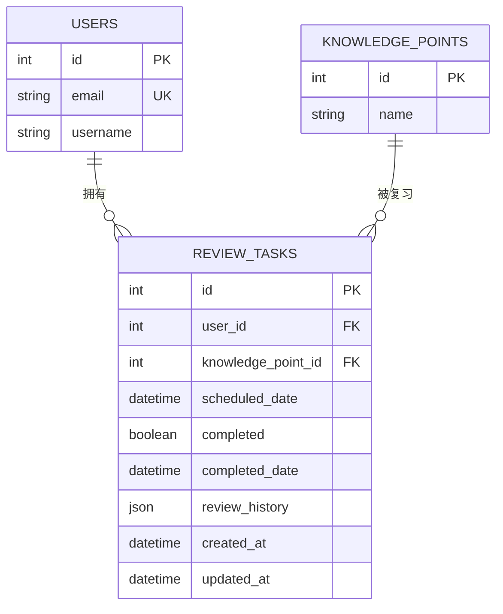
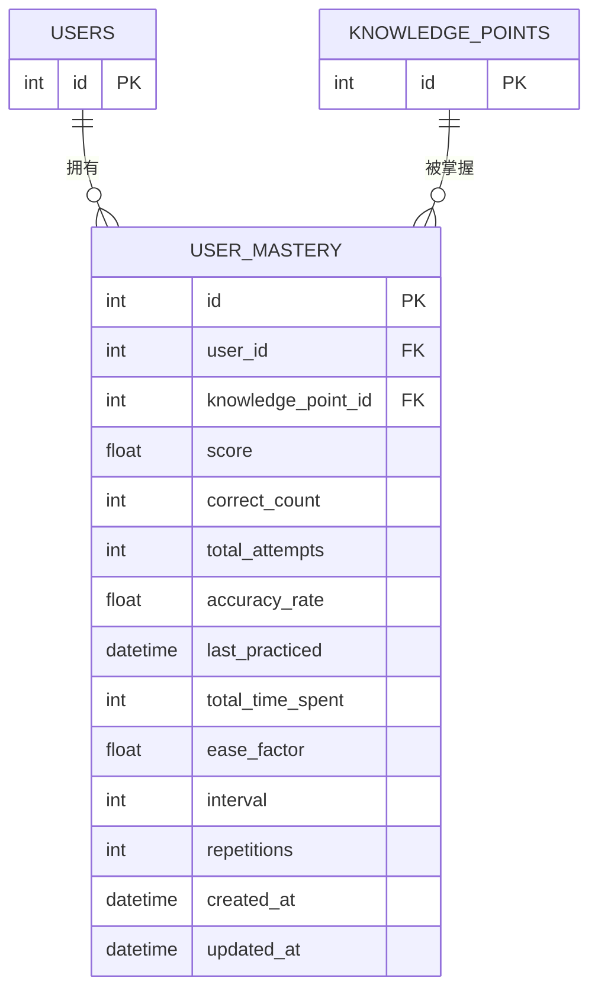
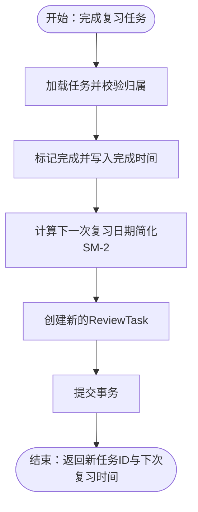
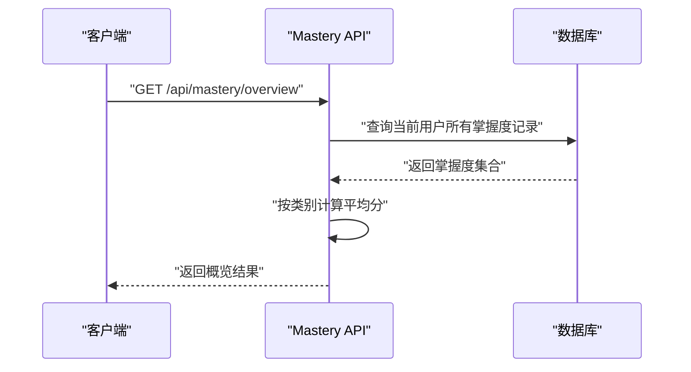
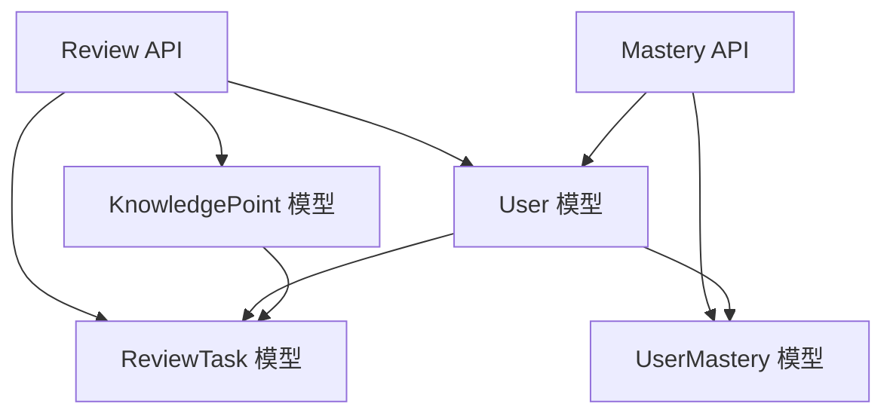

# 复习任务模型设计

<cite>
**本文档引用的文件**
- [backend/app/models/review.py](file://backend/app/models/review.py)
- [backend/app/api/review.py](file://backend/app/api/review.py)
- [backend/app/models/mastery.py](file://backend/app/models/mastery.py)
- [backend/app/schemas/mastery.py](file://backend/app/schemas/mastery.py)
- [backend/app/models/knowledge.py](file://backend/app/models/knowledge.py)
- [backend/app/schemas/knowledge.py](file://backend/app/schemas/knowledge.py)
- [backend/app/models/user.py](file://backend/app/models/user.py)
- [backend/app/schemas/user.py](file://backend/app/schemas/user.py)
- [backend/app/api/mastery.py](file://backend/app/api/mastery.py)
- [backend/app/core/database.py](file://backend/app/core/database.py)
- [backend/app/main.py](file://backend/app/main.py)
- [backend/app/core/config.py](file://backend/app/core/config.py)
- [backend/app/core/security.py](file://backend/app/core/security.py)
- [PROJECT_OVERVIEW.md](file://PROJECT_OVERVIEW.md)
</cite>

## 目录
1. [引言](#引言)
2. [项目结构](#项目结构)
3. [核心组件](#核心组件)
4. [架构总览](#架构总览)
5. [详细组件分析](#详细组件分析)
6. [依赖关系分析](#依赖关系分析)
7. [性能考虑](#性能考虑)
8. [故障排除指南](#故障排除指南)
9. [结论](#结论)
10. [附录](#附录)

## 引言
本文件针对Quickly复习任务模型进行系统性数据模型设计文档化，覆盖以下关键目标：
- 全面描述ReviewTask表的字段设计，包括复习计划、提醒时间、重复周期和完成状态
- 解释基于艾宾浩斯遗忘曲线的复习算法（SM-2）在当前实现中的简化版本及后续演进方向
- 文档化复习提醒机制的实现现状与扩展路径（定时任务调度、通知推送、用户反馈）
- 提供复习进度跟踪的数据统计与学习效果评估方法
- 说明复习任务的自动生成、手动添加与批量管理功能现状与扩展建议
- 解释复习数据的长期保存、趋势分析与个性化优化策略

## 项目结构
后端采用FastAPI + SQLAlchemy异步ORM的分层架构，复习任务相关的核心模块位于：
- models：数据模型层（ReviewTask、UserMastery、User等）
- api：路由层（review.py、mastery.py）
- schemas：Pydantic序列化模型（mastery.py、knowledge.py、user.py）
- core：核心配置与数据库连接（database.py、config.py、security.py）
- main.py：应用入口与路由注册

图表来源
- [backend/app/main.py:10-49](file://backend/app/main.py#L10-L49)
- [backend/app/core/database.py:15-36](file://backend/app/core/database.py#L15-L36)

章节来源
- [PROJECT_OVERVIEW.md:25-57](file://PROJECT_OVERVIEW.md#L25-L57)
- [backend/app/main.py:10-49](file://backend/app/main.py#L10-L49)

## 核心组件
本节聚焦复习任务模型的关键实体及其职责：
- ReviewTask：复习任务实体，负责记录用户的复习计划、提醒时间、完成状态与历史
- UserMastery：用户-知识点掌握度实体，承载SM-2算法所需的间隔、重复次数、难度系数等参数
- KnowledgePoint：知识点实体，作为复习内容的基础单元
- User：用户实体，与复习任务和掌握度建立一对多关系

章节来源
- [backend/app/models/review.py:11-35](file://backend/app/models/review.py#L11-L35)
- [backend/app/models/mastery.py:11-44](file://backend/app/models/mastery.py#L11-L44)
- [backend/app/models/knowledge.py:10-32](file://backend/app/models/knowledge.py#L10-L32)
- [backend/app/models/user.py:11-39](file://backend/app/models/user.py#L11-L39)

## 架构总览
复习任务系统围绕“任务生成—执行—反馈—再调度”的闭环工作流展开。当前实现通过API触发任务完成，并在服务端生成下一次复习任务；SM-2算法以简化的间隔规则替代完整算法。

图表来源
- [backend/app/api/review.py:51-90](file://backend/app/api/review.py#L51-L90)
- [backend/app/models/review.py:11-35](file://backend/app/models/review.py#L11-L35)

## 详细组件分析

### ReviewTask 数据模型
ReviewTask用于存储用户的复习任务计划与历史，字段设计如下：
- 标识与关联
  - id：主键
  - user_id：外键，关联用户
  - knowledge_point_id：外键，关联知识点
- 时间与状态
  - scheduled_date：计划复习时间（用于提醒）
  - completed：布尔值，表示是否已完成
  - completed_date：完成时间（可为空）
- 历史与元数据
  - review_history：JSON数组，记录过往复习结果（便于趋势分析）
  - created_at / updated_at：创建与更新时间戳
- 关系
  - 与User建立一对多关系，支持按用户维度查询任务

图表来源
- [backend/app/models/review.py:15-35](file://backend/app/models/review.py#L15-L35)
- [backend/app/models/user.py:36-37](file://backend/app/models/user.py#L36-L37)
- [backend/app/models/knowledge.py:14-27](file://backend/app/models/knowledge.py#L14-L27)

章节来源
- [backend/app/models/review.py:11-35](file://backend/app/models/review.py#L11-L35)

### UserMastery 数据模型（掌握度与SM-2参数）
UserMastery用于追踪用户对知识点的掌握程度，并为复习调度提供SM-2算法所需参数：
- 标识与关联
  - id、user_id、knowledge_point_id
- 成绩与进度
  - score：掌握分数（0-100）
  - correct_count / total_attempts：正确题数与总尝试次数
  - accuracy_rate：准确率（派生字段）
  - last_practiced：最近练习时间
  - total_time_spent：累计学习时长（分钟）
- SM-2参数
  - ease_factor：难度系数（初始默认值）
  - interval：间隔天数（初始默认值）
  - repetitions：成功复习次数（初始默认值）
- 时间戳
  - created_at / updated_at

图表来源
- [backend/app/models/mastery.py:15-44](file://backend/app/models/mastery.py#L15-L44)

章节来源
- [backend/app/models/mastery.py:11-44](file://backend/app/models/mastery.py#L11-L44)

### 复习API流程（当前实现与扩展建议）
- 查询今日到期任务：按用户过滤，筛选scheduled_date落在当日且未完成的任务
- 完成任务并生成下一次复习：
  - 标记任务为完成并记录完成时间
  - 使用简化的SM-2间隔规则生成下一次复习日期
  - 创建新的ReviewTask并持久化

图表来源
- [backend/app/api/review.py:51-90](file://backend/app/api/review.py#L51-L90)

章节来源
- [backend/app/api/review.py:21-48](file://backend/app/api/review.py#L21-L48)
- [backend/app/api/review.py:51-90](file://backend/app/api/review.py#L51-L90)

### 复习提醒机制实现现状与扩展
- 现状
  - 通过API完成任务并生成下一次复习任务，未实现独立的定时任务调度器或通知推送
- 扩展建议
  - 引入异步任务队列（Celery + Redis），在任务到期前触发提醒
  - 结合前端推送或移动端通知通道，实现跨端提醒
  - 支持用户偏好设置（提醒时间、频率、静默时段）

章节来源
- [backend/app/core/config.py:35-37](file://backend/app/core/config.py#L35-L37)
- [PROJECT_OVERVIEW.md:143-163](file://PROJECT_OVERVIEW.md#L143-L163)

### 复习进度跟踪与学习效果评估
- 掌握度概览：按知识点类别聚合平均分，便于用户了解薄弱环节
- 单个知识点掌握度：提供score、accuracy_rate、last_practiced、repetitions等指标
- 复习历史：ReviewTask.review_history可用于趋势分析与行为模式识别

图表来源
- [backend/app/api/mastery.py:20-60](file://backend/app/api/mastery.py#L20-L60)
- [backend/app/schemas/mastery.py:47-53](file://backend/app/schemas/mastery.py#L47-L53)

章节来源
- [backend/app/api/mastery.py:63-91](file://backend/app/api/mastery.py#L63-L91)
- [backend/app/schemas/mastery.py:28-44](file://backend/app/schemas/mastery.py#L28-L44)

### 复习任务的自动生成、手动添加与批量管理
- 自动生成
  - 当前实现：完成任务后自动创建下一次复习任务
  - 扩展建议：引入基于SM-2的批量任务生成器，在每日/每周初扫描需要调度的任务
- 手动添加
  - 可通过API创建ReviewTask，指定knowledge_point_id与scheduled_date
- 批量管理
  - 扩展建议：提供批量创建、批量完成、批量删除接口，配合前端表格操作

章节来源
- [backend/app/api/review.py:76-82](file://backend/app/api/review.py#L76-L82)

### 复习数据的长期保存、趋势分析与个性化优化
- 长期保存
  - ReviewTask.review_history与UserMastery记录历史数据，便于回溯
- 趋势分析
  - 利用review_history与last_practiced、total_time_spent等字段进行时间序列分析
- 个性化优化
  - 基于ease_factor、interval、repetitions动态调整复习节奏
  - 结合accuracy_rate与score构建学习路径推荐

章节来源
- [backend/app/models/review.py:27](file://backend/app/models/review.py#L27)
- [backend/app/models/mastery.py:34-36](file://backend/app/models/mastery.py#L34-L36)

## 依赖关系分析
复习任务模型与掌握度模型之间的耦合关系体现在：
- ReviewTask依赖UserMastery提供的SM-2参数（简化实现中未直接使用）
- User与ReviewTask、UserMastery建立一对多关系，确保按用户隔离数据
- API层协调模型与数据库交互，保证业务逻辑一致性

图表来源
- [backend/app/models/review.py:16-19](file://backend/app/models/review.py#L16-L19)
- [backend/app/models/mastery.py:16-17](file://backend/app/models/mastery.py#L16-L17)
- [backend/app/models/user.py:36-37](file://backend/app/models/user.py#L36-L37)

章节来源
- [backend/app/models/review.py:11-35](file://backend/app/models/review.py#L11-L35)
- [backend/app/models/mastery.py:11-44](file://backend/app/models/mastery.py#L11-L44)
- [backend/app/models/user.py:11-39](file://backend/app/models/user.py#L11-L39)

## 性能考虑
- 数据库连接
  - 使用异步引擎与连接池配置，提升并发性能
- 查询优化
  - 对user_id、knowledge_point_id、scheduled_date建立索引可显著提升查询效率
- 事务与锁
  - 复习任务创建与更新需在单事务内完成，避免竞态条件
- 缓存策略
  - 对常用查询结果（如今日到期任务）可引入Redis缓存

章节来源
- [backend/app/core/database.py:16-36](file://backend/app/core/database.py#L16-L36)
- [backend/app/api/review.py:26-38](file://backend/app/api/review.py#L26-L38)

## 故障排除指南
- 任务不存在
  - 完成任务时若找不到对应任务，API返回404错误
- 权限校验失败
  - 通过JWT解码与数据库查询校验当前用户身份
- 数据不一致
  - 确保在事务中完成任务状态更新与新任务创建
- 配置问题
  - 检查DATABASE_URL、REDIS_URL、CELERY_BROKER_URL等配置项

章节来源
- [backend/app/api/review.py:65-66](file://backend/app/api/review.py#L65-L66)
- [backend/app/core/security.py:54-80](file://backend/app/core/security.py#L54-L80)
- [backend/app/core/config.py:24-37](file://backend/app/core/config.py#L24-L37)

## 结论
Quickly的复习任务模型已具备基础的实体设计与API实现，能够支撑复习任务的生成与完成流程。当前SM-2算法以简化形式实现，后续应引入完整的SM-2参数与异步调度机制，结合趋势分析与个性化优化策略，进一步提升学习效果与用户体验。

## 附录
- 数据库初始化：应用启动时自动创建所有表
- 路由注册：Review API挂载在/api/review前缀下
- 认证中间件：JWT认证保障接口安全性

章节来源
- [backend/app/main.py:19-23](file://backend/app/main.py#L19-L23)
- [backend/app/main.py:48](file://backend/app/main.py#L48)
- [backend/app/core/security.py:54-80](file://backend/app/core/security.py#L54-L80)