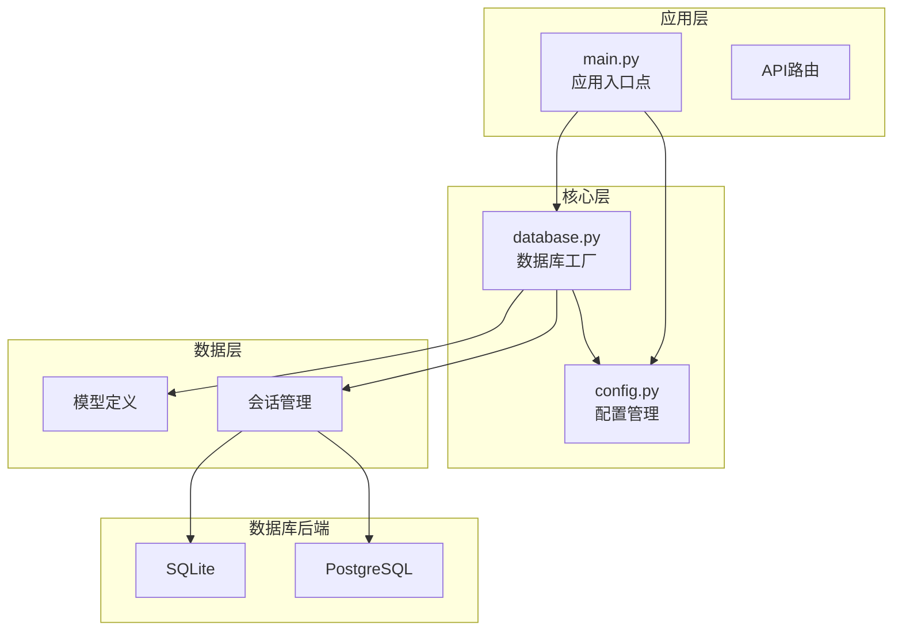
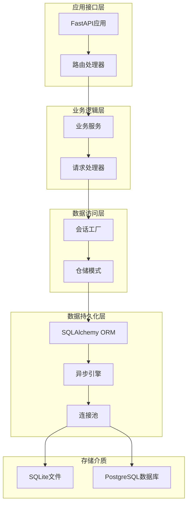
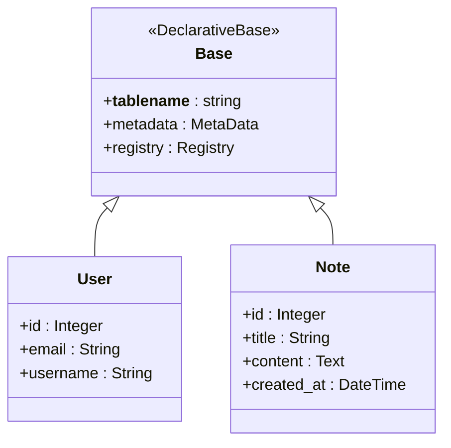
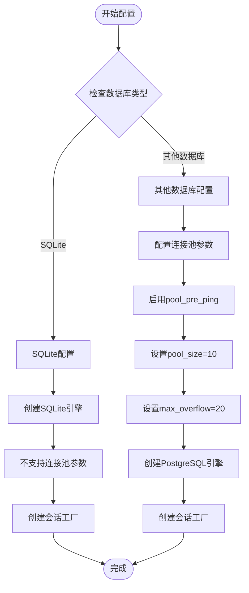
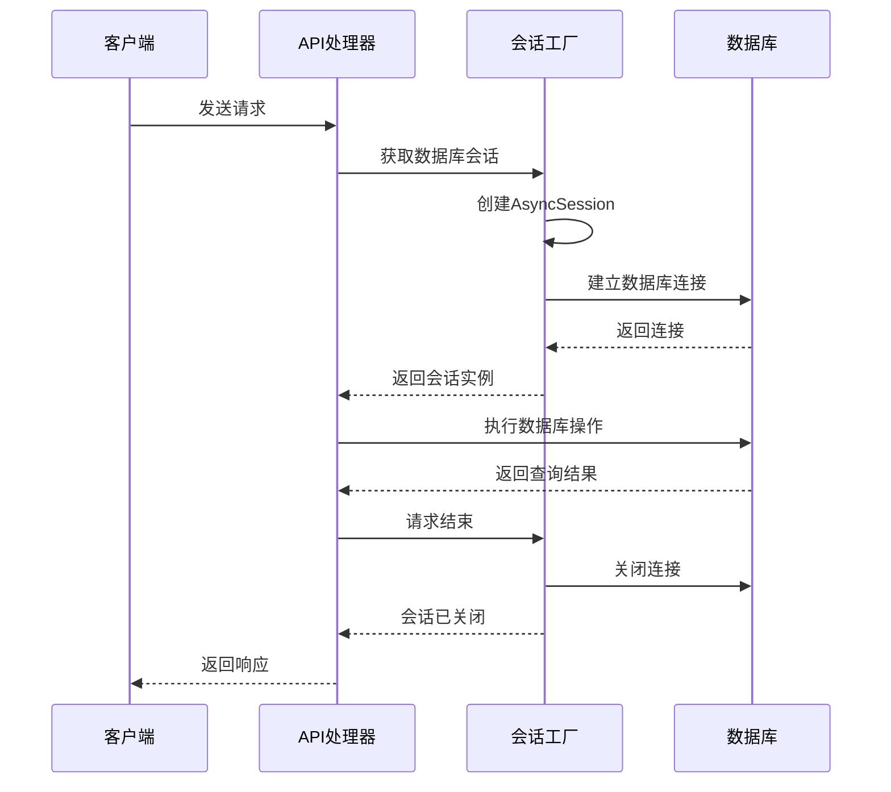
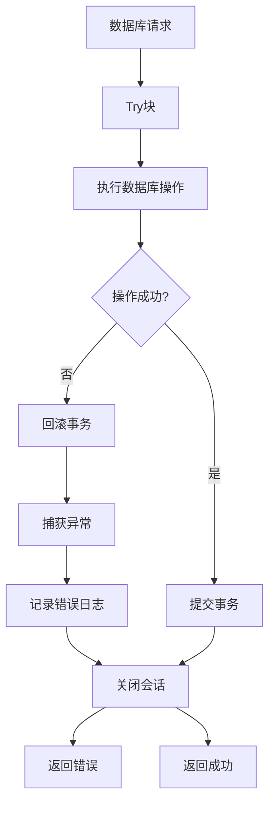
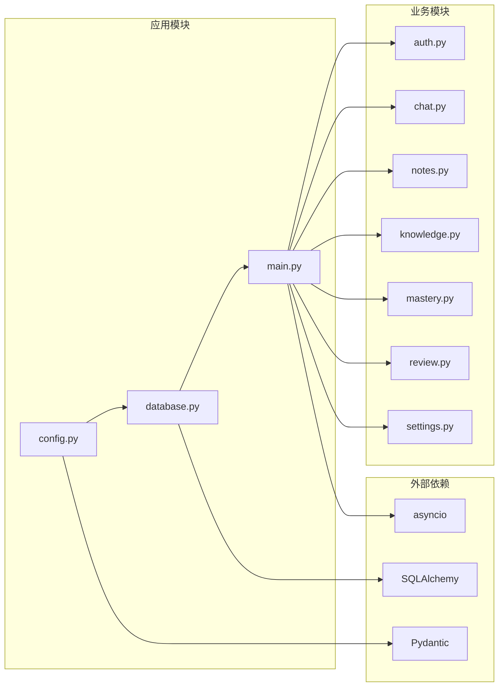
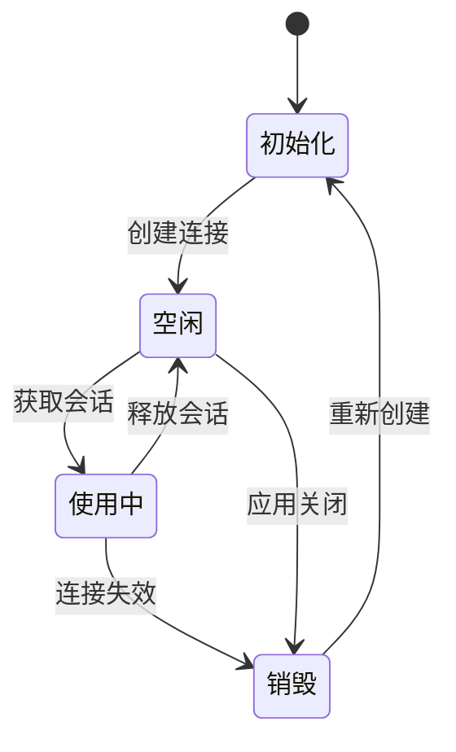

# 数据库架构设计

<cite>
**本文档引用的文件**
- [backend/app/core/database.py](file://backend/app/core/database.py)
- [backend/app/core/config.py](file://backend/app/core/config.py)
- [backend/app/main.py](file://backend/app/main.py)
</cite>

## 目录
1. [简介](#简介)
2. [项目结构](#项目结构)
3. [核心组件](#核心组件)
4. [架构概览](#架构概览)
5. [详细组件分析](#详细组件分析)
6. [依赖关系分析](#依赖关系分析)
7. [性能考虑](#性能考虑)
8. [故障排除指南](#故障排除指南)
9. [结论](#结论)

## 简介

Quickly项目采用异步数据库架构设计，基于SQLAlchemy异步引擎构建。该架构支持SQLite和PostgreSQL两种数据库后端，通过工厂模式实现数据库连接管理，提供完整的连接池配置和会话生命周期控制。

本架构的核心特点包括：
- 异步SQLAlchemy引擎配置
- 条件化的数据库特定优化
- 工厂模式的依赖注入机制
- 完整的连接池管理策略
- 统一的会话生命周期控制

## 项目结构

项目采用分层架构设计，数据库相关代码集中在`backend/app/core/`目录下：

**图表来源**
- [backend/app/main.py:1-66](file://backend/app/main.py#L1-L66)
- [backend/app/core/config.py:1-45](file://backend/app/core/config.py#L1-L45)
- [backend/app/core/database.py:1-46](file://backend/app/core/database.py#L1-L46)

**章节来源**
- [backend/app/main.py:1-66](file://backend/app/main.py#L1-L66)
- [backend/app/core/config.py:1-45](file://backend/app/core/config.py#L1-L45)
- [backend/app/core/database.py:1-46](file://backend/app/core/database.py#L1-L46)

## 核心组件

### 数据库配置管理

系统采用集中式配置管理，通过Settings类统一管理所有数据库相关配置：

- **DATABASE_URL**: 数据库连接字符串，支持SQLite和PostgreSQL
- **DEBUG**: 调试模式，控制SQL语句输出
- **连接池参数**: 针对不同数据库的优化配置

### 异步引擎工厂

数据库工厂模式实现了统一的引擎创建和管理：

- **Base类**: 所有ORM模型的基础类
- **条件化引擎配置**: 根据数据库类型应用不同的优化策略
- **会话工厂**: 提供异步会话创建和管理

### 依赖注入机制

通过异步生成器函数实现依赖注入：

- **get_db函数**: 提供数据库会话依赖
- **自动资源管理**: 确保会话正确关闭
- **异常安全**: 在异常情况下也能正确清理资源

**章节来源**
- [backend/app/core/config.py:23-25](file://backend/app/core/config.py#L23-L25)
- [backend/app/core/database.py:10-46](file://backend/app/core/database.py#L10-L46)

## 架构概览

系统采用分层架构，每层职责明确：

**图表来源**
- [backend/app/main.py:15-31](file://backend/app/main.py#L15-L31)
- [backend/app/core/database.py:32-46](file://backend/app/core/database.py#L32-L46)

## 详细组件分析

### 数据库工厂模式实现

#### Base类设计

Base类作为所有ORM模型的基类，提供了统一的模型定义标准：

**图表来源**
- [backend/app/core/database.py:10-12](file://backend/app/core/database.py#L10-L12)

#### 引擎配置策略

系统实现了差异化的数据库配置策略：

**图表来源**
- [backend/app/core/database.py:16-30](file://backend/app/core/database.py#L16-L30)

#### 会话生命周期管理

异步会话管理确保了资源的正确分配和释放：

**图表来源**
- [backend/app/core/database.py:39-46](file://backend/app/core/database.py#L39-L46)

**章节来源**
- [backend/app/core/database.py:10-46](file://backend/app/core/database.py#L10-L46)

### 配置管理最佳实践

#### 环境变量配置

系统通过环境变量管理配置，支持开发和生产环境的灵活切换：

- **DATABASE_URL**: 数据库连接字符串，支持多种数据库方言
- **DEBUG**: 控制SQL语句的调试输出
- **连接超时**: 默认连接超时时间为60秒

#### 数据库特定优化

针对不同数据库类型的优化策略：

**SQLite优化策略**:
- 简化的连接配置
- 适合单机部署的默认参数
- 最小化内存占用

**PostgreSQL优化策略**:
- 连接池大小配置（pool_size=10）
- 溢出连接限制（max_overflow=20）
- 连接预检查（pool_pre_ping=True）
- 适合高并发场景的配置

**章节来源**
- [backend/app/core/config.py:23-25](file://backend/app/core/config.py#L23-L25)
- [backend/app/core/database.py:16-30](file://backend/app/core/database.py#L16-L30)

### 错误处理策略

系统实现了多层次的错误处理机制：

**图表来源**
- [backend/app/core/database.py:42-45](file://backend/app/core/database.py#L42-L45)

**章节来源**
- [backend/app/core/database.py:39-46](file://backend/app/core/database.py#L39-L46)

## 依赖关系分析

### 组件依赖图

**图表来源**
- [backend/app/core/database.py:5-7](file://backend/app/core/database.py#L5-L7)
- [backend/app/core/config.py:5](file://backend/app/core/config.py#L5)
- [backend/app/main.py:6](file://backend/app/main.py#L6)

### 数据流分析

系统的数据流遵循清晰的层次结构：

1. **请求接收**: FastAPI应用接收HTTP请求
2. **路由分发**: 将请求分发到相应的API处理器
3. **业务处理**: 业务逻辑层处理请求
4. **数据访问**: 通过会话工厂获取数据库连接
5. **数据持久化**: 执行数据库操作并返回结果

**章节来源**
- [backend/app/main.py:10-49](file://backend/app/main.py#L10-L49)
- [backend/app/core/database.py:32-46](file://backend/app/core/database.py#L32-L46)

## 性能考虑

### 连接池优化

系统针对不同数据库类型实施了专门的连接池优化策略：

**SQLite性能特性**:
- 不支持连接池参数配置
- 适合单线程或少量并发场景
- 内存占用最小化

**PostgreSQL性能优化**:
- 连接池大小：10个活跃连接
- 溢出连接：20个额外连接
- 连接预检查：确保连接有效性
- 自动重连：提高系统稳定性

### 资源管理

**图表来源**
- [backend/app/core/database.py:32-36](file://backend/app/core/database.py#L32-L36)

### 监控和调试

系统提供了完善的监控和调试功能：

- **SQL语句输出**: 通过DEBUG配置控制SQL语句显示
- **连接状态监控**: 连接池状态跟踪
- **性能指标**: 连接使用统计信息

**章节来源**
- [backend/app/core/database.py:18-30](file://backend/app/core/database.py#L18-L30)
- [backend/app/core/config.py:15](file://backend/app/core/config.py#L15)

## 故障排除指南

### 常见问题诊断

**连接失败问题**:
1. 检查DATABASE_URL配置是否正确
2. 验证数据库服务是否正常运行
3. 确认网络连接状态

**性能问题**:
1. 监控连接池使用情况
2. 检查是否有连接泄漏
3. 评估数据库负载情况

**会话管理问题**:
1. 确保会话正确关闭
2. 检查异常处理逻辑
3. 验证依赖注入机制

### 调试配置

系统提供了灵活的调试配置选项：

- **DEBUG模式**: 启用详细的SQL语句输出
- **连接池监控**: 实时监控连接使用状态
- **错误日志**: 详细的错误信息记录

**章节来源**
- [backend/app/core/config.py:15](file://backend/app/core/config.py#L15)
- [backend/app/core/database.py:20](file://backend/app/core/database.py#L20)

## 结论

Quickly项目的数据库架构设计体现了现代Python Web应用的最佳实践。通过异步SQLAlchemy引擎、工厂模式和依赖注入机制，系统实现了高效、可扩展的数据库访问层。

### 主要优势

1. **异步性能**: 利用asyncio实现非阻塞数据库操作
2. **配置灵活性**: 支持多种数据库后端的配置
3. **资源管理**: 完善的连接池和会话生命周期管理
4. **错误处理**: 多层次的异常处理和恢复机制

### 技术特色

- **工厂模式**: 统一的数据库连接创建和管理
- **条件化配置**: 针对不同数据库的优化策略
- **依赖注入**: 清晰的组件依赖关系
- **生命周期管理**: 自动化的资源清理机制

该架构为Quickly平台提供了稳定可靠的数据持久化基础，支持从单机部署到生产环境的多种部署场景。