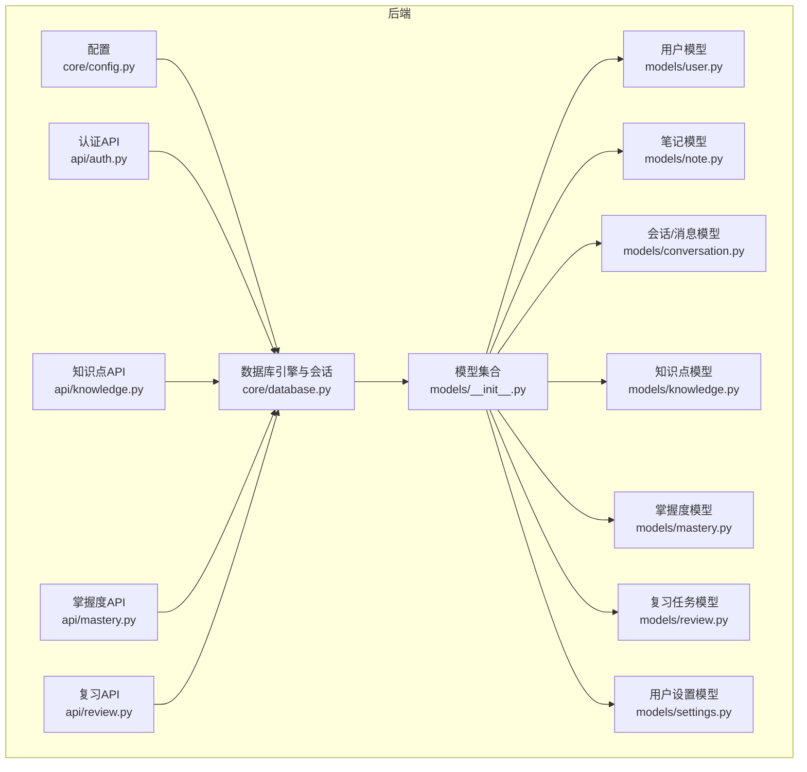
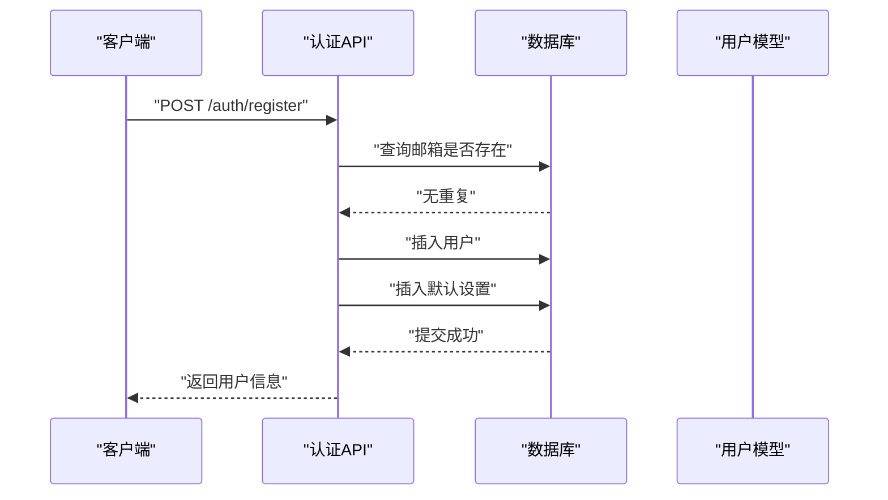
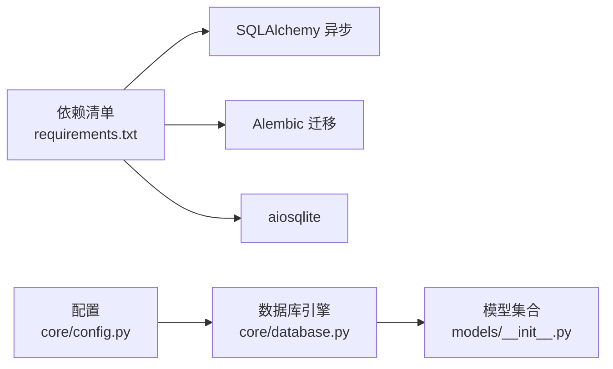

# 数据库设计

<cite>
**本文引用的文件**
- [backend/app/models/__init__.py](file://backend/app/models/__init__.py)
- [backend/app/models/user.py](file://backend/app/models/user.py)
- [backend/app/models/note.py](file://backend/app/models/note.py)
- [backend/app/models/conversation.py](file://backend/app/models/conversation.py)
- [backend/app/models/knowledge.py](file://backend/app/models/knowledge.py)
- [backend/app/models/mastery.py](file://backend/app/models/mastery.py)
- [backend/app/models/review.py](file://backend/app/models/review.py)
- [backend/app/models/settings.py](file://backend/app/models/settings.py)
- [backend/app/core/database.py](file://backend/app/core/database.py)
- [backend/app/core/config.py](file://backend/app/core/config.py)
- [backend/app/api/auth.py](file://backend/app/api/auth.py)
- [backend/app/api/knowledge.py](file://backend/app/api/knowledge.py)
- [backend/app/api/mastery.py](file://backend/app/api/mastery.py)
- [backend/app/api/review.py](file://backend/app/api/review.py)
- [backend/requirements.txt](file://backend/requirements.txt)
</cite>

## 目录
1. [简介](#简介)
2. [项目结构](#项目结构)
3. [核心组件](#核心组件)
4. [架构总览](#架构总览)
5. [详细组件分析](#详细组件分析)
6. [依赖分析](#依赖分析)
7. [性能考虑](#性能考虑)
8. [故障排查指南](#故障排查指南)
9. [结论](#结论)
10. [附录](#附录)

## 简介
本文件为 QuickLearn（简称“Quickly”）数据库设计的权威数据模型文档。内容覆盖表结构、主键/外键、索引与约束、实体关系图（ERD）、字段定义与业务语义、典型数据访问模式、查询优化策略、性能考量、数据迁移与版本管理、备份与恢复方案，以及数据完整性、并发控制与事务处理机制。目标是帮助开发者与运维人员准确理解数据库设计，并在开发与维护中遵循一致的数据规范。

## 项目结构
Quickly 后端采用 FastAPI + SQLAlchemy 2.x 异步 ORM 架构，数据库模型集中于 models 目录，通过统一的 Base 声明式基类进行映射；数据库连接与会话管理由 core/database.py 提供；应用配置位于 core/config.py；API 路由位于 app/api/*，负责数据访问与业务流程编排。



**图表来源**
- [backend/app/core/config.py:1-45](file://backend/app/core/config.py#L1-L45)
- [backend/app/core/database.py:1-46](file://backend/app/core/database.py#L1-L46)
- [backend/app/models/__init__.py:1-23](file://backend/app/models/__init__.py#L1-L23)
- [backend/app/api/auth.py:1-99](file://backend/app/api/auth.py#L1-L99)
- [backend/app/api/knowledge.py:1-69](file://backend/app/api/knowledge.py#L1-L69)
- [backend/app/api/mastery.py:1-140](file://backend/app/api/mastery.py#L1-L140)
- [backend/app/api/review.py:1-91](file://backend/app/api/review.py#L1-L91)

**章节来源**
- [backend/app/core/config.py:1-45](file://backend/app/core/config.py#L1-L45)
- [backend/app/core/database.py:1-46](file://backend/app/core/database.py#L1-L46)
- [backend/app/models/__init__.py:1-23](file://backend/app/models/__init__.py#L1-L23)

## 核心组件
本节概述数据库中的核心实体及其职责：
- 用户：系统使用者，承载基础信息、状态与时间戳，关联笔记、会话、掌握度、复习任务与设置。
- 会话与消息：记录用户与AI的对话历史，支持话题标签、自动笔记生成与掌握度影响标记。
- 笔记：用户的手动或自动生成的学习记录，可回溯到具体会话与消息。
- 知识点：学习主题与概念，支持难度、关键词、前置知识与向量嵌入。
- 掌握度：用户对知识点的掌握分数与学习进度统计，支持SM-2算法参数。
- 复习任务：基于掌握度与SM-2算法生成的复习提醒，带完成状态与历史记录。
- 用户设置：学习目标、提醒、偏好与高级选项。

**章节来源**
- [backend/app/models/user.py:1-39](file://backend/app/models/user.py#L1-L39)
- [backend/app/models/conversation.py:1-54](file://backend/app/models/conversation.py#L1-L54)
- [backend/app/models/note.py:1-35](file://backend/app/models/note.py#L1-L35)
- [backend/app/models/knowledge.py:1-32](file://backend/app/models/knowledge.py#L1-L32)
- [backend/app/models/mastery.py:1-44](file://backend/app/models/mastery.py#L1-L44)
- [backend/app/models/review.py:1-35](file://backend/app/models/review.py#L1-L35)
- [backend/app/models/settings.py:1-41](file://backend/app/models/settings.py#L1-L41)

## 架构总览
下图展示数据库层的实体关系与关键约束：

```mermaid
erDiagram
USERS {
int id PK
string email UK
string username
string hashed_password
string avatar_url
text bio
boolean is_active
boolean is_verified
datetime created_at
datetime updated_at
datetime last_login
}
CONVERSATIONS {
int id PK
int user_id FK
string title
json topic_tags
datetime created_at
datetime updated_at
}
MESSAGES {
int id PK
int conversation_id FK
string sender
text text
json chips
text auto_note
json topic_mastery_impact
datetime created_at
}
NOTES {
int id PK
int user_id FK
string topic
text content
int source_conversation_id FK
int source_message_id
boolean is_auto_generated
datetime created_at
datetime updated_at
}
KNOWLEDGE_POINTS {
int id PK
string name UK
text description
string category
int difficulty_level
json keywords
text embedding
json prerequisites
datetime created_at
datetime updated_at
}
USER_MASTERY {
int id PK
int user_id FK
int knowledge_point_id FK
float score
int correct_count
int total_attempts
datetime last_practiced
int total_time_spent
float accuracy_rate
float ease_factor
int interval
int repetitions
datetime created_at
datetime updated_at
}
REVIEW_TASKS {
int id PK
int user_id FK
int knowledge_point_id FK
datetime scheduled_date
boolean completed
datetime completed_date
json review_history
datetime created_at
datetime updated_at
}
USER_SETTINGS {
int id PK
int user_id FK UK
int daily_goal_minutes
boolean reminder_enabled
time reminder_time
boolean email_notifications
boolean weekly_report
string language
string theme
boolean auto_save_notes
boolean sound_enabled
datetime created_at
datetime updated_at
}
USERS ||--o{ CONVERSATIONS : "拥有"
USERS ||--o{ NOTES : "拥有"
USERS ||--o{ USER_MASTERY : "拥有"
USERS ||--o{ REVIEW_TASKS : "拥有"
USERS ||--o{ USER_SETTINGS : "拥有"
CONVERSATIONS ||--o{ MESSAGES : "包含"
USERS ||--o{ MESSAGES : "参与"
KNOWLEDGE_POINTS ||--o{ USER_MASTERY : "被掌握"
KNOWLEDGE_POINTS ||--o{ REVIEW_TASKS : "被复习"
```

**图表来源**
- [backend/app/models/user.py:11-39](file://backend/app/models/user.py#L11-L39)
- [backend/app/models/conversation.py:11-54](file://backend/app/models/conversation.py#L11-L54)
- [backend/app/models/note.py:11-35](file://backend/app/models/note.py#L11-L35)
- [backend/app/models/knowledge.py:10-32](file://backend/app/models/knowledge.py#L10-L32)
- [backend/app/models/mastery.py:11-44](file://backend/app/models/mastery.py#L11-L44)
- [backend/app/models/review.py:11-35](file://backend/app/models/review.py#L11-L35)
- [backend/app/models/settings.py:11-41](file://backend/app/models/settings.py#L11-L41)

## 详细组件分析

### 用户表（users）
- 主键：id（自增整数）
- 唯一约束：email
- 索引：id、email（模型中声明了 index=True）
- 字段与业务含义：
  - 基础信息：用户名、加密密码
  - 个人资料：头像URL、个人简介
  - 状态：是否激活、是否验证
  - 时间戳：创建时间、更新时间、最近登录
- 关系：
  - 一对多：笔记、会话、掌握度、复习任务
  - 一对一：用户设置（uselist=False）

**章节来源**
- [backend/app/models/user.py:11-39](file://backend/app/models/user.py#L11-L39)

### 会话表（conversations）
- 主键：id
- 外键：user_id → users.id
- 索引：id
- 字段与业务含义：
  - 标题：会话标题（可空）
  - 话题标签：JSON数组，如["逻辑回归","Sigmoid"]
  - 时间戳：创建与更新时间
- 关系：
  - 多对一：用户
  - 一对多：消息

**章节来源**
- [backend/app/models/conversation.py:11-31](file://backend/app/models/conversation.py#L11-L31)

### 消息表（messages）
- 主键：id
- 外键：conversation_id → conversations.id
- 索引：id
- 字段与业务含义：
  - 发送者：用户或系统
  - 文本内容：消息正文
  - 知识点标签：chips（用于标注涉及的知识点）
  - 自动笔记：auto_note（AI生成的摘要）
  - 掌握度影响：topic_mastery_impact（复习/测验影响）
  - 创建时间
- 关系：
  - 多对一：会话

**章节来源**
- [backend/app/models/conversation.py:33-54](file://backend/app/models/conversation.py#L33-L54)

### 笔记表（notes）
- 主键：id
- 外键：user_id → users.id；source_conversation_id → conversations.id
- 索引：id
- 字段与业务含义：
  - 主题与内容：topic、content
  - 来源：source_conversation_id、source_message_id
  - 自动生成标志：is_auto_generated
  - 时间戳：创建与更新时间
- 关系：
  - 多对一：用户

**章节来源**
- [backend/app/models/note.py:11-35](file://backend/app/models/note.py#L11-L35)

### 知识点表（knowledge_points）
- 主键：id
- 唯一约束：name
- 索引：id
- 字段与业务含义：
  - 名称、描述、分类
  - 难度等级：1-5
  - 关键词：JSON数组
  - 向量嵌入：用于相似度检索
  - 前置知识：JSON数组，存储前置知识点ID
  - 时间戳：创建与更新时间
- 关系：
  - 一对多：掌握度、复习任务

**章节来源**
- [backend/app/models/knowledge.py:10-32](file://backend/app/models/knowledge.py#L10-L32)

### 掌握度表（user_mastery）
- 主键：id
- 外键：user_id → users.id；knowledge_point_id → knowledge_points.id
- 索引：id
- 字段与业务含义：
  - 分数：score（0-100）
  - 学习进度：正确次数、总尝试次数、准确率
  - 时间跟踪：最后练习时间、总时长（分钟）
  - SM-2算法参数：ease_factor、interval、repetitions
  - 时间戳：创建与更新时间
- 关系：
  - 多对一：用户、知识点

**章节来源**
- [backend/app/models/mastery.py:11-44](file://backend/app/models/mastery.py#L11-L44)

### 复习任务表（review_tasks）
- 主键：id
- 外键：user_id → users.id；knowledge_point_id → knowledge_points.id
- 索引：id
- 字段与业务含义：
  - 安排日期：scheduled_date
  - 完成状态：completed、completed_date
  - 复习历史：JSON数组
  - 时间戳：创建与更新时间
- 关系：
  - 多对一：用户、知识点

**章节来源**
- [backend/app/models/review.py:11-35](file://backend/app/models/review.py#L11-L35)

### 用户设置表（user_settings）
- 主键：id
- 外键：user_id → users.id（唯一约束）
- 索引：id
- 字段与业务含义：
  - 学习目标：日均学习时长（分钟）
  - 提醒：开关、时间、邮件与周报
  - 偏好：语言、主题
  - 高级设置：自动保存笔记、声音开关
  - 时间戳：创建与更新时间
- 关系：
  - 多对一：用户

**章节来源**
- [backend/app/models/settings.py:11-41](file://backend/app/models/settings.py#L11-L41)

### 数据访问模式与API交互
- 认证API（注册/登录/当前用户）展示了典型的读写流程：查询重复邮箱、插入用户、级联创建默认设置、更新登录时间、签发令牌。
- 知识点API（列表/详情/创建）体现了简单CRUD与条件过滤。
- 掌握度API（概览/列表/单项/测验提交）展示了聚合统计、按知识点查询、以及分数与进度的原子性更新。
- 复习API（今日任务/完成任务）演示了基于日期范围的筛选与基于SM-2的下次复习安排。



**图表来源**
- [backend/app/api/auth.py:22-49](file://backend/app/api/auth.py#L22-L49)

**章节来源**
- [backend/app/api/auth.py:1-99](file://backend/app/api/auth.py#L1-L99)
- [backend/app/api/knowledge.py:1-69](file://backend/app/api/knowledge.py#L1-L69)
- [backend/app/api/mastery.py:1-140](file://backend/app/api/mastery.py#L1-L140)
- [backend/app/api/review.py:1-91](file://backend/app/api/review.py#L1-L91)

### 查询优化策略与复杂度分析
- 索引与查询热点
  - users.email 唯一索引：用于登录与注册校验，避免全表扫描。
  - 所有表的主键 id 均建立索引，确保外键关联与单条查询高效。
- 连接与分页
  - 掌握度概览按用户过滤，建议在 user_id 上保持良好索引；若后续按知识点聚合，可在 knowledge_point_id 上建立复合索引以减少排序成本。
- 写入路径
  - 掌握度测验提交为原子更新，使用 total_attempts/correct_count/score 的同步更新，建议在高并发下结合数据库事务与适当的锁策略，避免竞态。
- JSON字段
  - topic_tags、keywords、prerequisites、review_history 等为JSON类型，适合灵活扩展，但不建议在此类字段上建立复杂索引；可通过向量化或预计算派生列优化相似度检索与过滤。

**章节来源**
- [backend/app/models/user.py:15-16](file://backend/app/models/user.py#L15-L16)
- [backend/app/models/mastery.py:15-17](file://backend/app/models/mastery.py#L15-L17)
- [backend/app/models/review.py:15-19](file://backend/app/models/review.py#L15-L19)

## 依赖分析
- 数据库驱动与异步引擎
  - 使用 SQLAlchemy 2.x 异步引擎与 async_sessionmaker，SQLite 与非 SQLite（如 PostgreSQL）分别配置 echo、pool_size、max_overflow、pool_pre_ping。
- 依赖清单
  - SQLAlchemy 异步、Alembic 迁移、aiosqlite、FastAPI、Pydantic 等。



**图表来源**
- [backend/requirements.txt:1-37](file://backend/requirements.txt#L1-L37)
- [backend/app/core/config.py](file://backend/app/core/config.py#L24)
- [backend/app/core/database.py:15-36](file://backend/app/core/database.py#L15-L36)

**章节来源**
- [backend/requirements.txt:1-37](file://backend/requirements.txt#L1-L37)
- [backend/app/core/database.py:1-46](file://backend/app/core/database.py#L1-L46)
- [backend/app/core/config.py:1-45](file://backend/app/core/config.py#L1-L45)

## 性能考虑
- 连接池与方言差异
  - 非 SQLite 方言启用 pool_pre_ping、pool_size、max_overflow，有助于生产环境稳定性与吞吐。
- 异步I/O
  - 使用异步引擎与依赖注入的会话，降低阻塞，提升并发请求处理能力。
- 写入热点与锁
  - 掌握度更新与复习任务完成应使用事务包裹，必要时引入行级锁或乐观锁策略，避免竞态。
- 索引策略
  - 在高频过滤字段（如 users.email、user_id、knowledge_point_id）上保持索引；对JSON字段避免复杂索引，优先通过向量化或物化视图优化查询。
- 缓存与外部服务
  - 可选 Redis 作为缓存与队列（Celery），减轻数据库压力；注意与数据库一致性策略配合。

**章节来源**
- [backend/app/core/database.py:15-36](file://backend/app/core/database.py#L15-L36)
- [backend/app/api/mastery.py:94-139](file://backend/app/api/mastery.py#L94-L139)
- [backend/app/api/review.py:51-90](file://backend/app/api/review.py#L51-L90)

## 故障排查指南
- 登录失败
  - 检查邮箱是否存在且密码正确；确认用户 is_active 状态；核对 last_login 更新是否成功。
- 注册重复邮箱
  - 注册前先查询 email 是否已存在；若出现重复，需提示用户更换邮箱。
- 掌握度记录缺失
  - 测验提交时若无记录则自动创建；检查 user_id 与 knowledge_point_id 组合是否正确。
- 复习任务未出现
  - 确认 scheduled_date 的时区与本地时间；检查 completed 标志与日期范围过滤逻辑。
- 数据库连接问题
  - 核对 DATABASE_URL；SQLite 与非 SQLite 的连接参数差异；调试阶段可开启 echo 观察 SQL 输出。

**章节来源**
- [backend/app/api/auth.py:52-86](file://backend/app/api/auth.py#L52-L86)
- [backend/app/api/mastery.py:94-139](file://backend/app/api/mastery.py#L94-L139)
- [backend/app/api/review.py:21-48](file://backend/app/api/review.py#L21-L48)
- [backend/app/core/database.py:15-30](file://backend/app/core/database.py#L15-L30)

## 结论
Quickly 的数据库设计围绕“用户—会话—消息—笔记—知识点—掌握度—复习任务—设置”的完整学习闭环展开，采用异步ORM与清晰的外键/索引/约束设计，满足日常学习场景下的数据完整性与可扩展性需求。建议在生产环境中完善索引策略、引入缓存与队列、制定迁移与备份方案，并持续监控与优化查询路径与写入瓶颈。

## 附录

### 示例数据（示意）
- 用户
  - id: 1, email: "alice@example.com", username: "alice", is_active: true, is_verified: false
- 会话
  - id: 1, user_id: 1, title: "线性回归讨论", topic_tags: ["线性回归","损失函数"]
- 消息
  - id: 1, conversation_id: 1, sender: "user", text: "如何选择损失函数？"
- 笔记
  - id: 1, user_id: 1, topic: "损失函数选择", content: "平方损失适用于高斯噪声..."
- 知识点
  - id: 1, name: "线性回归", category: "机器学习", difficulty_level: 3
- 掌握度
  - id: 1, user_id: 1, knowledge_point_id: 1, score: 75.0, correct_count: 15, total_attempts: 20
- 复习任务
  - id: 1, user_id: 1, knowledge_point_id: 1, scheduled_date: "2025-04-05T00:00:00Z", completed: false
- 用户设置
  - id: 1, user_id: 1, daily_goal_minutes: 30, reminder_enabled: true, theme: "dark"

### 数据迁移与版本管理
- 使用 Alembic 进行迁移脚本管理，建议：
  - 新增字段时添加默认值或可空约束，避免破坏现有数据。
  - 对新增索引与唯一约束执行离线或低峰期迁移。
  - 对大表变更采用分批处理与影子表策略，减少锁竞争。

**章节来源**
- [backend/requirements.txt:9-11](file://backend/requirements.txt#L9-L11)

### 备份与恢复方案
- SQLite
  - 直接复制数据库文件进行备份；生产环境建议定期归档与校验。
- PostgreSQL/其他
  - 使用数据库原生命令导出/导入；结合 WAL 日志实现增量备份。
- 恢复流程
  - 先恢复数据，再回放迁移脚本至目标版本；验证关键查询与写入路径。

### 并发控制与事务处理
- 事务边界
  - 注册/登录、测验提交、复习任务完成等关键路径使用事务包裹，确保原子性。
- 锁策略
  - 对易并发冲突的写入（如掌握度分数更新）采用悲观锁或乐观锁，必要时重试。
- 一致性
  - 通过外键约束与唯一约束保障参照完整性；对JSON字段的业务一致性通过应用层校验与迁移脚本共同保证。