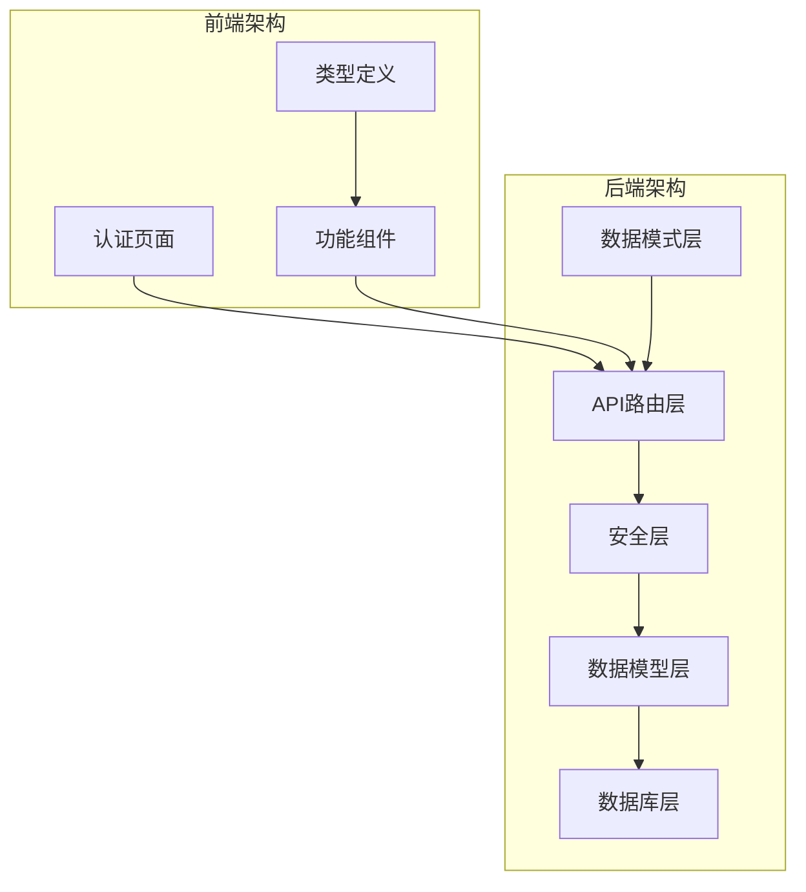
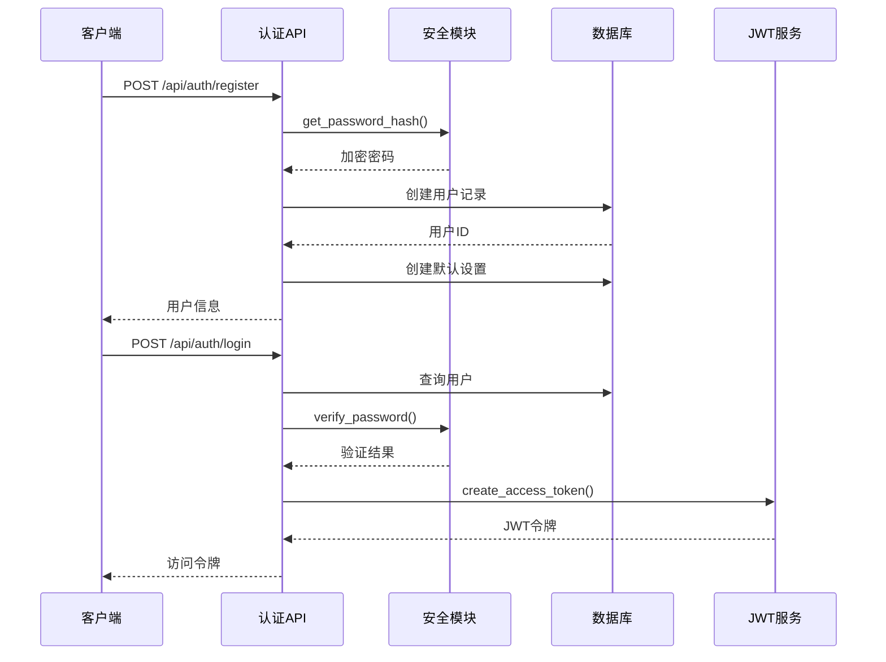
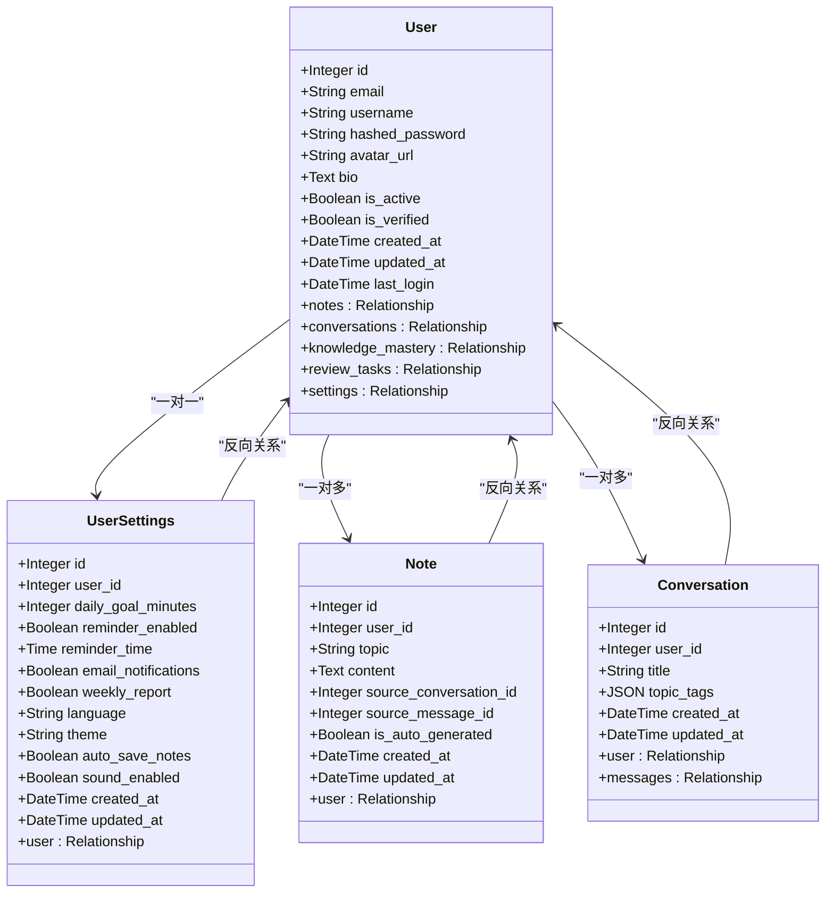
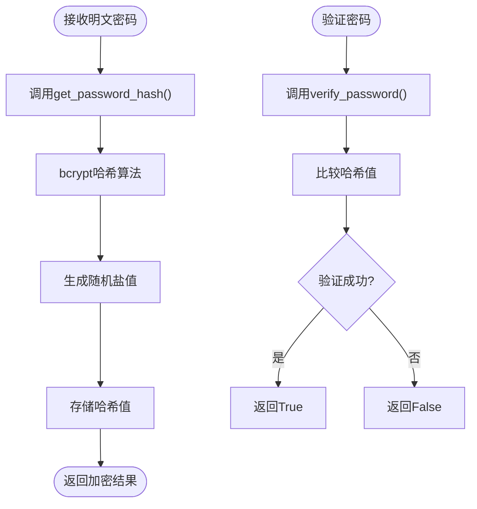
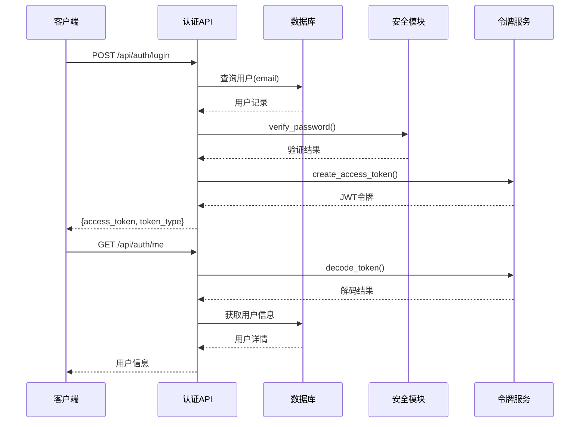
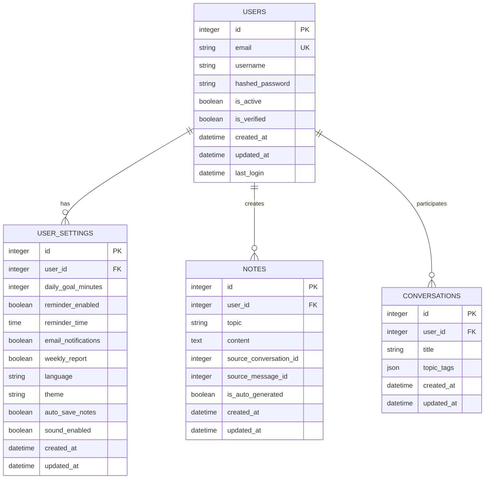
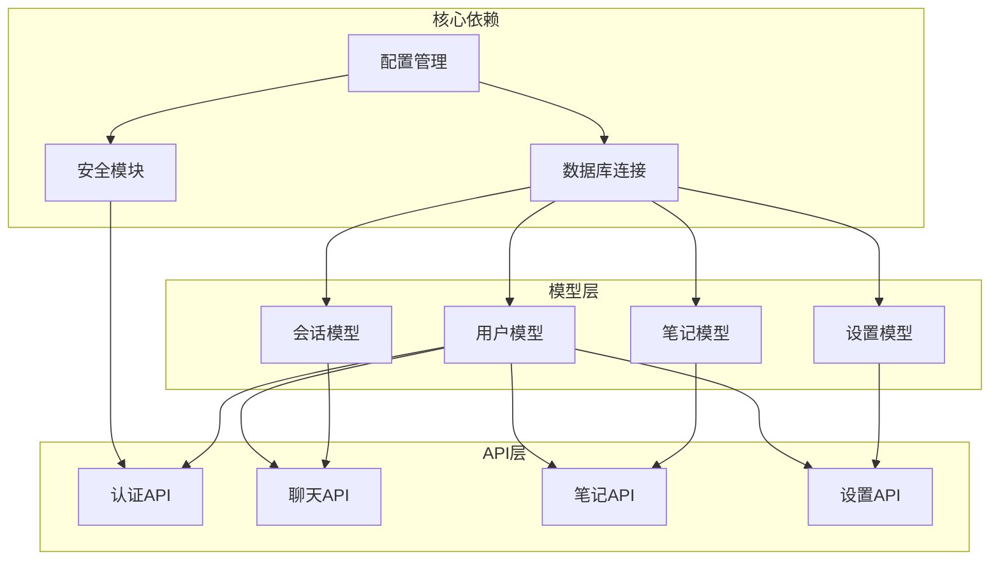
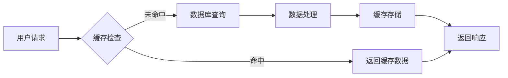

# 用户模型设计

<cite>
**本文档引用的文件**
- [backend/app/models/user.py](file://backend/app/models/user.py)
- [backend/app/schemas/user.py](file://backend/app/schemas/user.py)
- [backend/app/api/auth.py](file://backend/app/api/auth.py)
- [backend/app/core/security.py](file://backend/app/core/security.py)
- [backend/app/core/config.py](file://backend/app/core/config.py)
- [backend/app/models/settings.py](file://backend/app/models/settings.py)
- [backend/app/schemas/settings.py](file://backend/app/schemas/settings.py)
- [backend/app/models/note.py](file://backend/app/models/note.py)
- [backend/app/models/conversation.py](file://backend/app/models/conversation.py)
- [backend/app/core/database.py](file://backend/app/core/database.py)
- [PROJECT_OVERVIEW.md](file://PROJECT_OVERVIEW.md)
</cite>

## 目录
1. [简介](#简介)
2. [项目结构](#项目结构)
3. [核心组件](#核心组件)
4. [架构概览](#架构概览)
5. [详细组件分析](#详细组件分析)
6. [依赖关系分析](#依赖关系分析)
7. [性能考虑](#性能考虑)
8. [故障排除指南](#故障排除指南)
9. [结论](#结论)

## 简介

Quickly是一个AI学习助手平台，用户模型是整个系统的核心数据结构。本文档详细描述了用户模型的设计架构、字段定义、安全机制和业务逻辑，为开发者提供完整的技术参考。

## 项目结构

Quickly采用前后端分离的架构设计，用户模型位于后端Python FastAPI应用中：

**图表来源**
- [PROJECT_OVERVIEW.md:25-57](file://PROJECT_OVERVIEW.md#L25-L57)

**章节来源**
- [PROJECT_OVERVIEW.md:1-200](file://PROJECT_OVERVIEW.md#L1-L200)

## 核心组件

### 用户模型核心字段

用户模型定义在SQLAlchemy中，包含以下关键字段：

| 字段名称 | 数据类型 | 约束条件 | 描述 |
|---------|---------|---------|------|
| id | Integer | 主键, 索引 | 用户唯一标识符 |
| email | String(255) | 唯一, 索引, 非空 | 用户邮箱地址 |
| username | String(100) | 非空 | 用户显示名称 |
| hashed_password | String(255) | 非空 | 加密后的用户密码 |
| avatar_url | String(500) | 可选 | 用户头像URL |
| bio | Text | 可选 | 用户个人简介 |
| is_active | Boolean | 默认True | 账户激活状态 |
| is_verified | Boolean | 默认False | 邮箱验证状态 |
| created_at | DateTime | 默认当前时间 | 账户创建时间 |
| updated_at | DateTime | 默认当前时间, 更新时自动更新 | 账户最后更新时间 |
| last_login | DateTime | 可选 | 最后登录时间 |

### 用户设置模型

每个用户都有对应的设置模型，包含学习偏好和通知配置：

| 设置项 | 数据类型 | 默认值 | 描述 |
|-------|---------|--------|------|
| daily_goal_minutes | Integer | 30 | 每日学习目标（分钟） |
| reminder_enabled | Boolean | True | 是否启用提醒 |
| reminder_time | Time | 可选 | 提醒时间 |
| email_notifications | Boolean | True | 邮件通知开关 |
| weekly_report | Boolean | True | 周报开关 |
| language | String(10) | "zh-CN" | 界面语言 |
| theme | String(10) | "dark" | 界面主题 |
| auto_save_notes | Boolean | True | 自动保存笔记 |
| sound_enabled | Boolean | True | 声音效果 |

**章节来源**
- [backend/app/models/user.py:11-39](file://backend/app/models/user.py#L11-L39)
- [backend/app/models/settings.py:11-41](file://backend/app/models/settings.py#L11-L41)

## 架构概览

Quickly的用户认证架构采用JWT（JSON Web Token）机制，结合bcrypt密码哈希：

**图表来源**
- [backend/app/api/auth.py:22-86](file://backend/app/api/auth.py#L22-L86)
- [backend/app/core/security.py:23-42](file://backend/app/core/security.py#L23-L42)

## 详细组件分析

### 用户模型类图

**图表来源**
- [backend/app/models/user.py:11-39](file://backend/app/models/user.py#L11-L39)
- [backend/app/models/settings.py:11-41](file://backend/app/models/settings.py#L11-L41)
- [backend/app/models/note.py:11-35](file://backend/app/models/note.py#L11-L35)
- [backend/app/models/conversation.py:11-54](file://backend/app/models/conversation.py#L11-L54)

### 密码加密机制

系统采用bcrypt算法进行密码哈希处理：

**图表来源**
- [backend/app/core/security.py:23-30](file://backend/app/core/security.py#L23-L30)

### JWT令牌管理

访问令牌采用HS256算法签名，具有7天有效期：

| 配置项 | 值 | 描述 |
|-------|----|------|
| SECRET_KEY | 随机生成的URL安全密钥 | JWT签名密钥 |
| ACCESS_TOKEN_EXPIRE_MINUTES | 10080 (7天) | 令牌过期时间 |
| ALGORITHM | "HS256" | JWT签名算法 |
| token_type | "bearer" | 令牌类型 |

**章节来源**
- [backend/app/core/security.py:33-42](file://backend/app/core/security.py#L33-L42)
- [backend/app/core/config.py:18-21](file://backend/app/core/config.py#L18-L21)

### 用户认证流程

**图表来源**
- [backend/app/api/auth.py:52-92](file://backend/app/api/auth.py#L52-L92)
- [backend/app/core/security.py:54-79](file://backend/app/core/security.py#L54-L79)

### 数据验证规则

用户数据验证遵循以下规则：

**注册验证规则：**
- 邮箱格式验证（EmailStr）
- 用户名长度：2-100字符
- 密码长度：≥6字符
- 邮箱唯一性检查

**登录验证规则：**
- 邮箱格式验证
- 密码非空检查
- 用户存在性验证
- 密码正确性验证
- 账户激活状态检查

**设置验证规则：**
- daily_goal_minutes：15-120分钟范围
- 语言代码：支持zh-CN, en-US, ja-JP, ko-KR
- 主题：支持dark, light

**章节来源**
- [backend/app/schemas/user.py:10-38](file://backend/app/schemas/user.py#L10-L38)
- [backend/app/schemas/settings.py:10-49](file://backend/app/schemas/settings.py#L10-L49)

### 关系映射分析

用户模型建立了多个重要关系：

**图表来源**
- [backend/app/models/user.py:15-39](file://backend/app/models/user.py#L15-L39)
- [backend/app/models/settings.py:15-41](file://backend/app/models/settings.py#L15-L41)
- [backend/app/models/note.py:15-35](file://backend/app/models/note.py#L15-L35)
- [backend/app/models/conversation.py:15-54](file://backend/app/models/conversation.py#L15-L54)

## 依赖关系分析

### 组件依赖图

**图表来源**
- [backend/app/core/config.py:10-45](file://backend/app/core/config.py#L10-L45)
- [backend/app/core/database.py:15-46](file://backend/app/core/database.py#L15-L46)
- [backend/app/core/security.py:1-80](file://backend/app/core/security.py#L1-L80)

### 外部依赖

系统依赖的关键外部库：

| 依赖库 | 版本 | 用途 |
|-------|------|------|
| fastapi | 0.115 | Web框架 |
| sqlalchemy | 2.0 | ORM框架 |
| passlib | bcrypt | 密码哈希 |
| python-jose | JWT处理 | 令牌签名 |
| aiosqlite | 异步SQLite | 数据库驱动 |
| redis | 缓存和队列 | 性能优化 |

**章节来源**
- [PROJECT_OVERVIEW.md:69-75](file://PROJECT_OVERVIEW.md#L69-L75)

## 性能考虑

### 数据库优化策略

1. **索引优化**
   - 用户邮箱字段建立唯一索引
   - 用户ID字段建立主键索引
   - 时间戳字段建立索引用于查询优化

2. **连接池配置**
   - SQLite：适用于开发环境
   - PostgreSQL：生产环境推荐
   - 连接池参数：pool_size=10, max_overflow=20

3. **查询优化**
   - 使用select()进行精确查询
   - 避免N+1查询问题
   - 合理使用关系加载策略

### 缓存策略

**章节来源**
- [backend/app/core/database.py:16-36](file://backend/app/core/database.py#L16-L36)

## 故障排除指南

### 常见认证问题

**密码验证失败**
- 检查密码是否正确
- 确认用户账户状态为激活
- 验证密码哈希是否正确存储

**令牌过期问题**
- 检查ACCESS_TOKEN_EXPIRE_MINUTES配置
- 确认客户端正确处理令牌刷新
- 验证服务器时间同步

**数据库连接问题**
- 检查DATABASE_URL配置
- 验证数据库服务状态
- 确认连接池参数设置

### 错误处理机制

系统采用HTTP状态码进行错误响应：

| 错误类型 | HTTP状态码 | 错误信息 |
|---------|-----------|----------|
| 邮箱已存在 | 400 | Email already registered |
| 认证失败 | 401 | Incorrect email or password |
| 账户未激活 | 400 | Inactive user |
| 凭据无效 | 401 | Could not validate credentials |

**章节来源**
- [backend/app/api/auth.py:25-73](file://backend/app/api/auth.py#L25-L73)
- [backend/app/core/security.py:59-77](file://backend/app/core/security.py#L59-L77)

## 结论

Quickly的用户模型设计体现了现代Web应用的最佳实践：

1. **安全性**：采用bcrypt密码哈希和JWT令牌机制
2. **可扩展性**：清晰的模型关系和API设计
3. **性能**：合理的数据库索引和连接池配置
4. **用户体验**：完整的认证流程和错误处理

该设计为后续的功能扩展（如角色权限系统、高级安全特性等）提供了良好的基础架构。通过持续的代码审查和性能监控，可以确保系统的稳定性和可靠性。