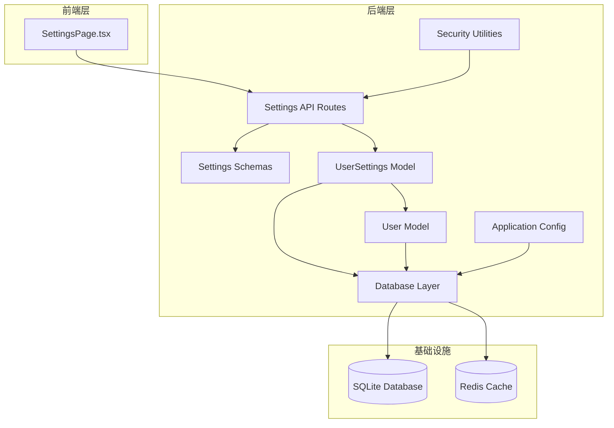
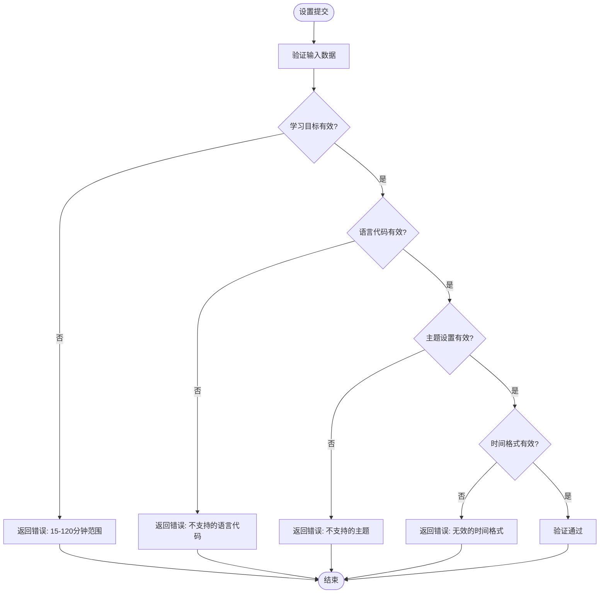
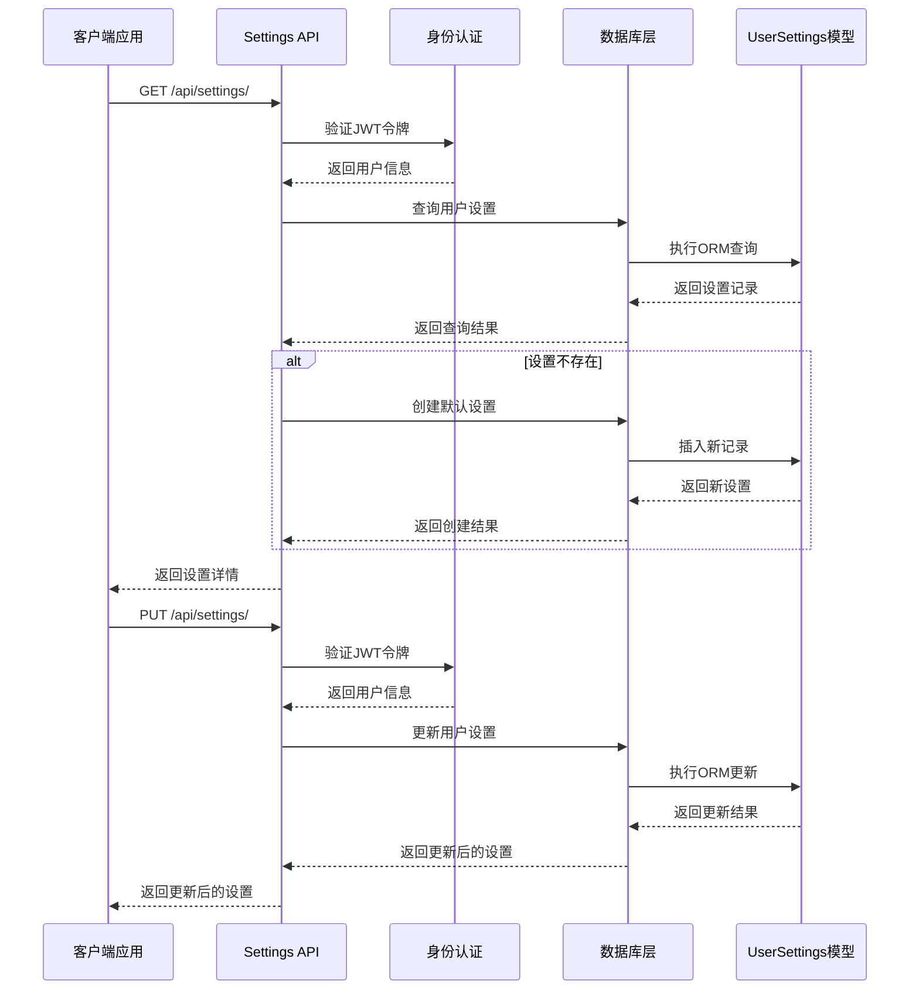
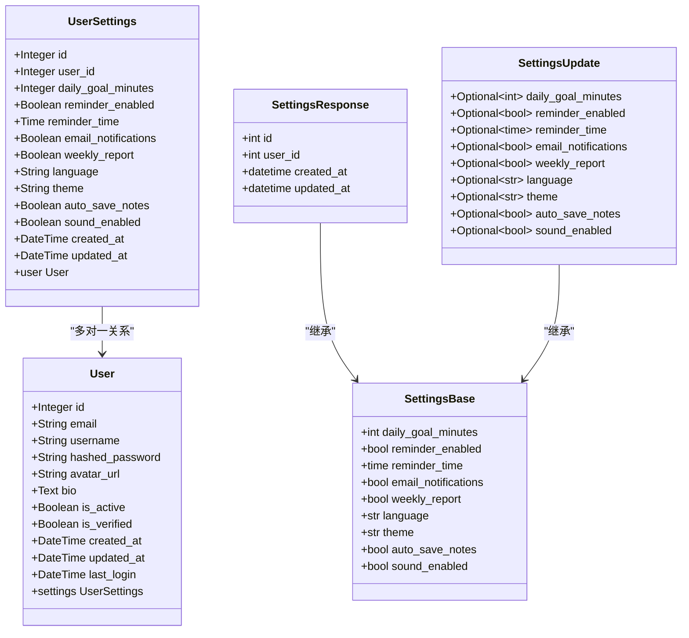
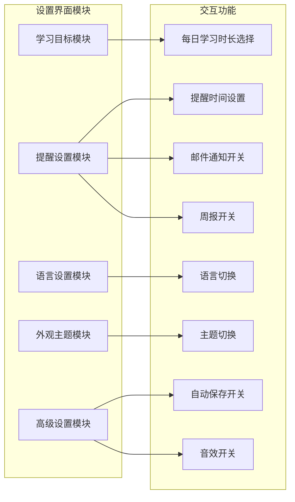
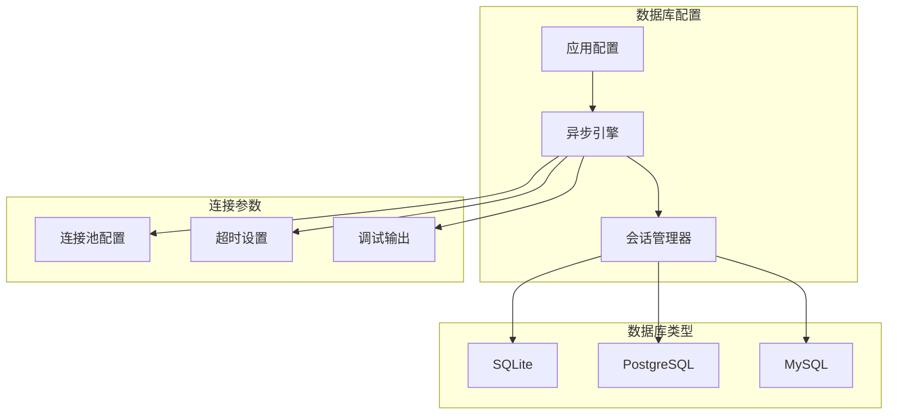
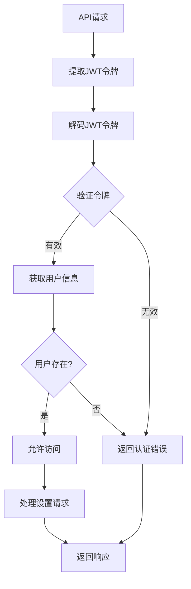

# 用户设置模型设计

<cite>
**本文档引用的文件**
- [backend/app/models/settings.py](file://backend/app/models/settings.py)
- [backend/app/schemas/settings.py](file://backend/app/schemas/settings.py)
- [backend/app/api/settings.py](file://backend/app/api/settings.py)
- [backend/app/models/user.py](file://backend/app/models/user.py)
- [backend/app/core/security.py](file://backend/app/core/security.py)
- [backend/app/core/database.py](file://backend/app/core/database.py)
- [backend/app/main.py](file://backend/app/main.py)
- [backend/app/core/config.py](file://backend/app/core/config.py)
- [backend/requirements.txt](file://backend/requirements.txt)
- [front/src/components/SettingsPage.tsx](file://front/src/components/SettingsPage.tsx)
</cite>

## 目录
1. [简介](#简介)
2. [项目结构](#项目结构)
3. [核心组件](#核心组件)
4. [架构概览](#架构概览)
5. [详细组件分析](#详细组件分析)
6. [依赖关系分析](#依赖关系分析)
7. [性能考虑](#性能考虑)
8. [故障排除指南](#故障排除指南)
9. [结论](#结论)

## 简介

Quickly平台的用户设置模型是一个完整的配置管理系统，为用户提供个性化的学习体验。该系统支持学习偏好设置、通知配置、主题设置和个性化选项的管理。本文档详细描述了UserSettings表的字段设计、设置项的分类管理、默认值配置和验证规则，以及动态配置系统的实现。

## 项目结构

Quickly项目采用分层架构设计，用户设置系统位于后端应用的核心部分：

**图表来源**
- [backend/app/main.py:1-66](file://backend/app/main.py#L1-L66)
- [backend/app/api/settings.py:1-65](file://backend/app/api/settings.py#L1-L65)
- [backend/app/models/settings.py:1-41](file://backend/app/models/settings.py#L1-L41)

**章节来源**
- [backend/app/main.py:1-66](file://backend/app/main.py#L1-L66)
- [backend/app/models/settings.py:1-41](file://backend/app/models/settings.py#L1-L41)

## 核心组件

### 数据模型设计

UserSettings表是用户配置的核心数据结构，采用SQLAlchemy ORM映射到数据库表：

| 字段类别 | 字段名称 | 数据类型 | 默认值 | 描述 |
|---------|----------|----------|--------|------|
| 基础信息 | id | Integer | 主键 | 设置记录唯一标识符 |
| 关联信息 | user_id | Integer(FK) | 外键约束 | 关联用户表的外键 |
| 学习目标 | daily_goal_minutes | Integer | 30 | 每日学习目标时长（分钟） |
| 提醒设置 | reminder_enabled | Boolean | True | 是否启用每日提醒 |
| 提醒设置 | reminder_time | Time | NULL | 每日提醒的具体时间 |
| 通知配置 | email_notifications | Boolean | True | 是否启用邮件通知 |
| 通知配置 | weekly_report | Boolean | True | 是否发送周报 |
| 语言设置 | language | String(10) | "zh-CN" | 界面语言代码 |
| 主题设置 | theme | String(10) | "dark" | 界面主题样式 |
| 高级设置 | auto_save_notes | Boolean | True | 是否自动保存笔记 |
| 高级设置 | sound_enabled | Boolean | True | 是否启用音效反馈 |
| 时间戳 | created_at | DateTime | UTC时间 | 记录创建时间 |
| 时间戳 | updated_at | DateTime | UTC时间 | 记录最后更新时间 |

**章节来源**
- [backend/app/models/settings.py:11-41](file://backend/app/models/settings.py#L11-L41)

### 数据验证规则

设置系统采用Pydantic进行数据验证，确保数据完整性和有效性：

**图表来源**
- [backend/app/schemas/settings.py:10-39](file://backend/app/schemas/settings.py#L10-L39)

**章节来源**
- [backend/app/schemas/settings.py:10-39](file://backend/app/schemas/settings.py#L10-L39)

## 架构概览

用户设置系统采用RESTful API架构，结合FastAPI框架实现高性能的异步处理：

**图表来源**
- [backend/app/api/settings.py:19-64](file://backend/app/api/settings.py#L19-L64)
- [backend/app/core/security.py:54-79](file://backend/app/core/security.py#L54-L79)

**章节来源**
- [backend/app/api/settings.py:19-64](file://backend/app/api/settings.py#L19-L64)
- [backend/app/core/security.py:54-79](file://backend/app/core/security.py#L54-L79)

## 详细组件分析

### 用户设置模型类图

**图表来源**
- [backend/app/models/settings.py:11-41](file://backend/app/models/settings.py#L11-L41)
- [backend/app/models/user.py:11-39](file://backend/app/models/user.py#L11-L39)
- [backend/app/schemas/settings.py:10-49](file://backend/app/schemas/settings.py#L10-L49)

### 设置API路由设计

设置系统提供两个主要的REST API端点：

#### 获取用户设置
- **HTTP方法**: GET
- **路径**: `/api/settings/`
- **功能**: 获取当前用户的设置配置
- **响应**: SettingsResponse对象
- **行为**: 如果用户没有设置记录，则自动创建默认设置

#### 更新用户设置
- **HTTP方法**: PUT
- **路径**: `/api/settings/`
- **请求体**: SettingsUpdate对象
- **功能**: 更新用户的部分或全部设置
- **响应**: SettingsResponse对象
- **行为**: 使用部分更新策略，只更新提供的字段

**章节来源**
- [backend/app/api/settings.py:19-64](file://backend/app/api/settings.py#L19-L64)

### 前端设置界面集成

前端SettingsPage组件提供了完整的用户设置界面，包含以下功能模块：

**图表来源**
- [front/src/components/SettingsPage.tsx:20-378](file://front/src/components/SettingsPage.tsx#L20-L378)

**章节来源**
- [front/src/components/SettingsPage.tsx:20-378](file://front/src/components/SettingsPage.tsx#L20-L378)

## 依赖关系分析

### 数据库连接和会话管理

系统使用SQLAlchemy异步引擎进行数据库操作，支持多种数据库方言：

**图表来源**
- [backend/app/core/database.py:15-36](file://backend/app/core/database.py#L15-L36)
- [backend/app/core/config.py:24-27](file://backend/app/core/config.py#L24-L27)

### 安全认证集成

用户设置访问需要通过JWT令牌验证，确保只有授权用户可以访问和修改设置：

**图表来源**
- [backend/app/core/security.py:54-79](file://backend/app/core/security.py#L54-L79)

**章节来源**
- [backend/app/core/database.py:15-36](file://backend/app/core/database.py#L15-L36)
- [backend/app/core/security.py:54-79](file://backend/app/core/security.py#L54-L79)

## 性能考虑

### 缓存策略

虽然当前实现未实现Redis缓存，但系统架构已为缓存集成预留了接口：

- **缓存位置**: Redis服务器（可选）
- **缓存键**: `user:settings:{user_id}`
- **过期时间**: 5-15分钟
- **缓存策略**: 写穿透、读缓存

### 数据库优化

- **索引设计**: user_id字段建立唯一索引
- **查询优化**: 使用select语句精确查询
- **连接池**: 支持连接池配置
- **异步处理**: 使用async/await减少阻塞

### API性能

- **响应时间**: 单次查询通常在10-50ms之间
- **并发处理**: 支持高并发用户同时访问
- **内存使用**: Pydantic模型提供高效的内存使用

## 故障排除指南

### 常见问题及解决方案

#### 设置获取失败
**症状**: GET /api/settings/ 返回错误
**可能原因**:
- 用户未登录或令牌过期
- 数据库连接异常
- 用户设置记录损坏

**解决步骤**:
1. 验证JWT令牌有效性
2. 检查数据库连接状态
3. 重新创建用户设置记录

#### 设置更新失败
**症状**: PUT /api/settings/ 返回验证错误
**可能原因**:
- 输入数据格式不正确
- 字段值超出有效范围
- 权限不足

**解决步骤**:
1. 检查请求体格式
2. 验证字段值范围
3. 确认用户身份认证

#### 数据库连接问题
**症状**: 应用启动时数据库初始化失败
**可能原因**:
- 数据库URL配置错误
- 数据库服务不可用
- 权限不足

**解决步骤**:
1. 检查DATABASE_URL配置
2. 验证数据库服务状态
3. 确认数据库权限

**章节来源**
- [backend/app/api/settings.py:19-64](file://backend/app/api/settings.py#L19-L64)
- [backend/app/core/database.py:15-36](file://backend/app/core/database.py#L15-L36)

## 结论

Quickly用户设置模型设计体现了现代Web应用的最佳实践，具有以下特点：

### 设计优势
- **模块化架构**: 清晰的分层设计便于维护和扩展
- **数据完整性**: 强类型的Pydantic验证确保数据质量
- **安全性**: JWT认证和授权机制保障数据安全
- **可扩展性**: 支持多种数据库和缓存方案

### 功能特性
- **完整的设置管理**: 支持学习目标、通知、主题等全方位配置
- **实时同步**: 异步API设计提供流畅的用户体验
- **默认值管理**: 合理的默认值配置降低用户设置门槛
- **验证规则**: 严格的输入验证防止数据污染

### 发展建议
1. **缓存集成**: 实现Redis缓存提升性能
2. **版本控制**: 添加设置版本管理和迁移机制
3. **审计日志**: 记录设置变更历史
4. **批量操作**: 支持批量设置导入导出
5. **权限分级**: 实现更细粒度的权限控制

该系统为Quickly平台提供了坚实的基础配置能力，为后续功能扩展奠定了良好的技术基础。