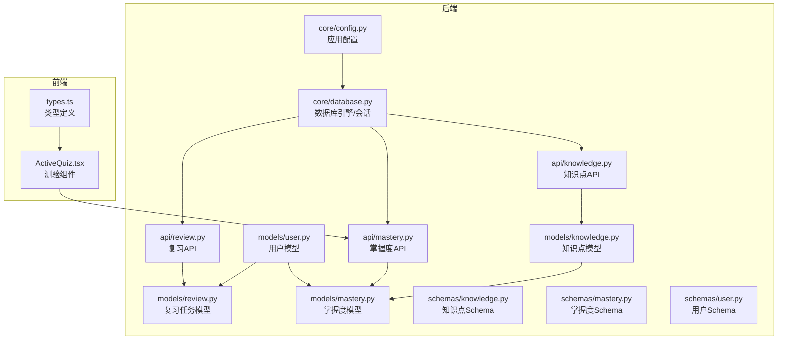
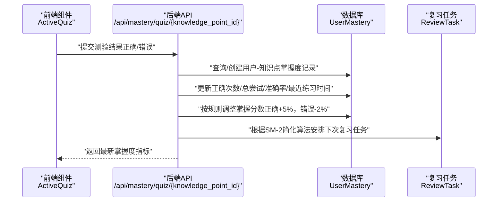
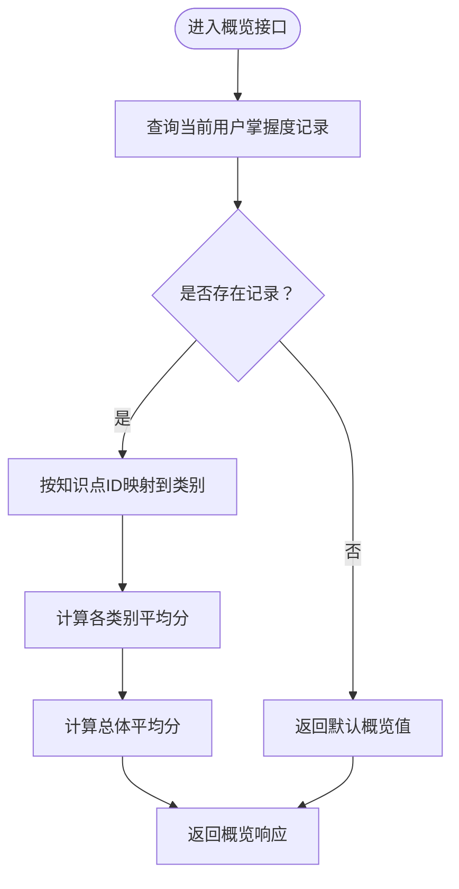
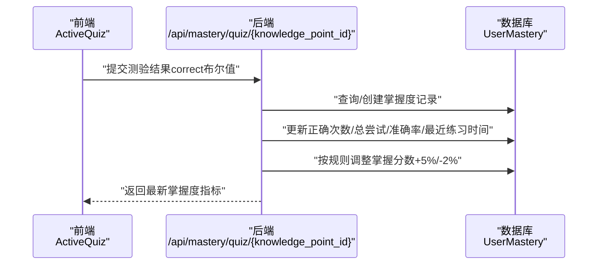
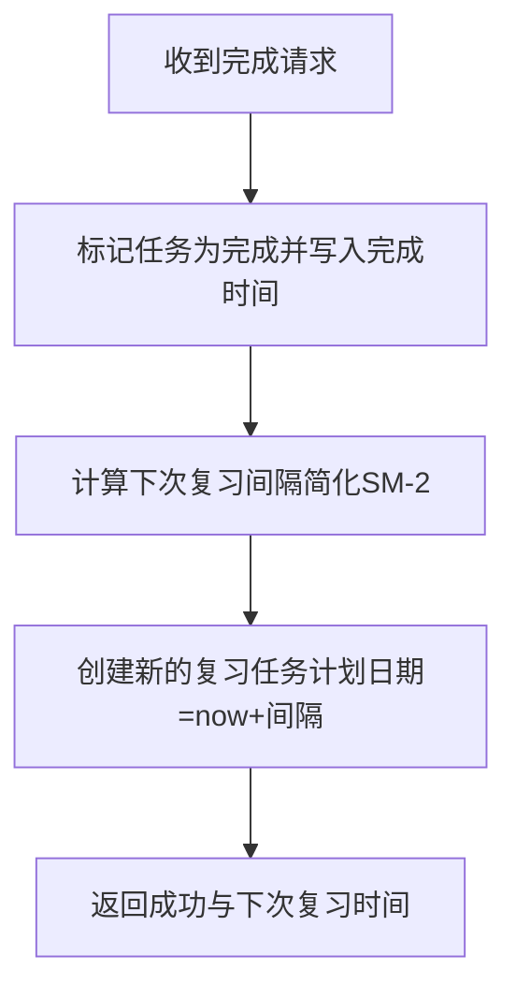
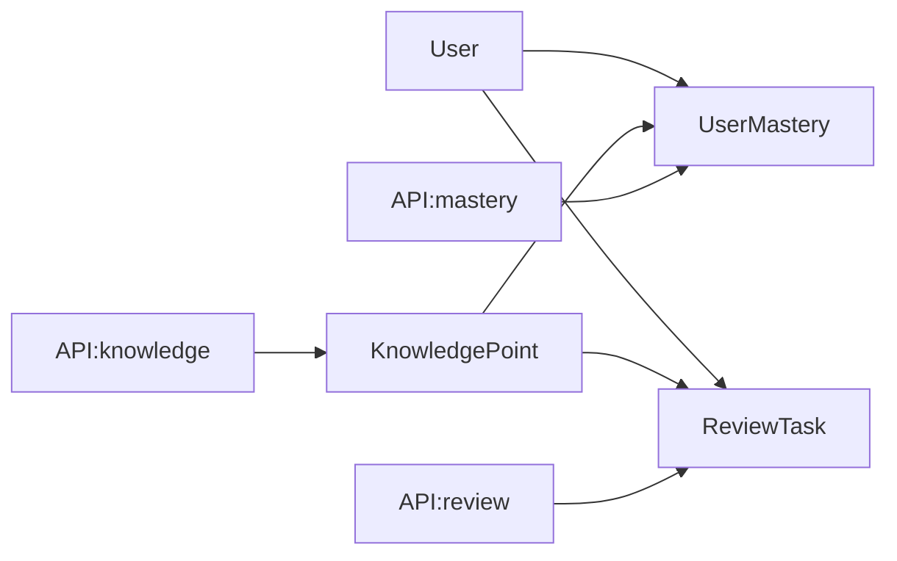
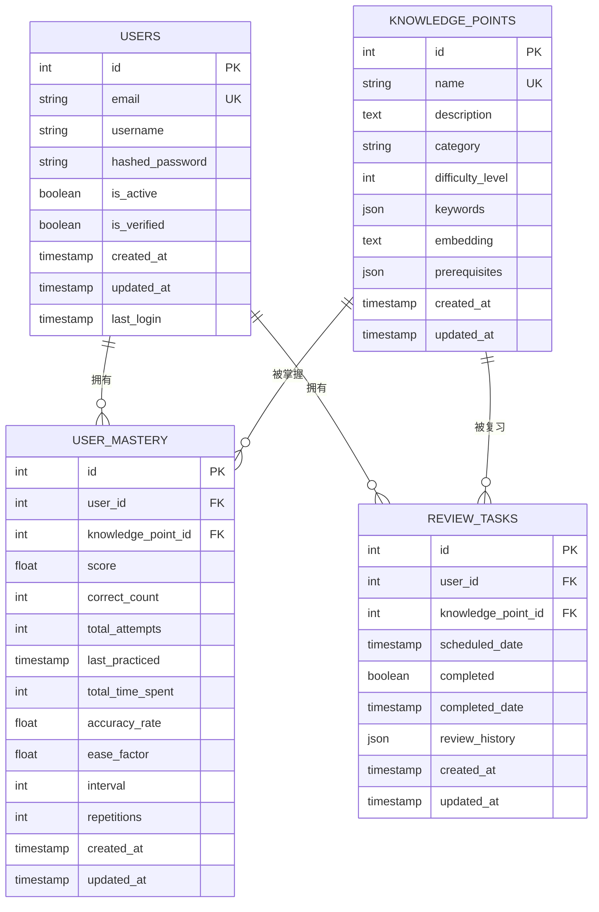

# 知识掌握度模型设计

<cite>
**本文引用的文件**
- [backend/app/models/knowledge.py](file://backend/app/models/knowledge.py)
- [backend/app/models/mastery.py](file://backend/app/models/mastery.py)
- [backend/app/models/review.py](file://backend/app/models/review.py)
- [backend/app/models/user.py](file://backend/app/models/user.py)
- [backend/app/schemas/knowledge.py](file://backend/app/schemas/knowledge.py)
- [backend/app/schemas/mastery.py](file://backend/app/schemas/mastery.py)
- [backend/app/schemas/user.py](file://backend/app/schemas/user.py)
- [backend/app/api/knowledge.py](file://backend/app/api/knowledge.py)
- [backend/app/api/mastery.py](file://backend/app/api/mastery.py)
- [backend/app/api/review.py](file://backend/app/api/review.py)
- [backend/app/core/database.py](file://backend/app/core/database.py)
- [backend/app/core/config.py](file://backend/app/core/config.py)
- [front/src/components/ActiveQuiz.tsx](file://front/src/components/ActiveQuiz.tsx)
- [front/src/types.ts](file://front/src/types.ts)
- [PROJECT_OVERVIEW.md](file://PROJECT_OVERVIEW.md)
</cite>

## 目录
1. [简介](#简介)
2. [项目结构](#项目结构)
3. [核心组件](#核心组件)
4. [架构总览](#架构总览)
5. [详细组件分析](#详细组件分析)
6. [依赖分析](#依赖分析)
7. [性能考虑](#性能考虑)
8. [故障排查指南](#故障排查指南)
9. [结论](#结论)
10. [附录](#附录)

## 简介
本文件面向Quickly知识掌握度模型，系统性梳理数据模型设计、掌握度计算算法、学习与复习调度（含SM-2简化版）、测验功能实现、学习进度统计与个性化推荐思路，并给出数据聚合查询、性能优化与缓存策略建议。文档同时结合后端模型、API与前端组件，形成从概念到落地的完整说明。

## 项目结构
后端采用FastAPI + SQLAlchemy 2.0异步ORM，数据库模型位于models目录，API路由位于api目录，Pydantic Schema用于请求/响应校验；前端使用React + TypeScript，ActiveQuiz组件负责测验交互。

**图表来源**
- [backend/app/models/knowledge.py:10-32](file://backend/app/models/knowledge.py#L10-L32)
- [backend/app/models/mastery.py:11-44](file://backend/app/models/mastery.py#L11-L44)
- [backend/app/models/review.py:11-35](file://backend/app/models/review.py#L11-L35)
- [backend/app/models/user.py:11-39](file://backend/app/models/user.py#L11-L39)
- [backend/app/schemas/knowledge.py:10-35](file://backend/app/schemas/knowledge.py#L10-L35)
- [backend/app/schemas/mastery.py:10-53](file://backend/app/schemas/mastery.py#L10-L53)
- [backend/app/schemas/user.py:10-50](file://backend/app/schemas/user.py#L10-L50)
- [backend/app/api/knowledge.py:17-69](file://backend/app/api/knowledge.py#L17-L69)
- [backend/app/api/mastery.py:17-140](file://backend/app/api/mastery.py#L17-L140)
- [backend/app/api/review.py:18-91](file://backend/app/api/review.py#L18-L91)
- [backend/app/core/database.py:15-46](file://backend/app/core/database.py#L15-L46)
- [backend/app/core/config.py:10-45](file://backend/app/core/config.py#L10-L45)
- [front/src/components/ActiveQuiz.tsx:22-331](file://front/src/components/ActiveQuiz.tsx#L22-L331)
- [front/src/types.ts:10-29](file://front/src/types.ts#L10-L29)

**章节来源**
- [PROJECT_OVERVIEW.md:3-58](file://PROJECT_OVERVIEW.md#L3-L58)
- [backend/app/core/config.py:10-45](file://backend/app/core/config.py#L10-L45)
- [backend/app/core/database.py:15-46](file://backend/app/core/database.py#L15-L46)

## 核心组件
- 知识点模型（KnowledgePoint）：存储知识点名称、描述、分类、难度、关键词、向量嵌入、前置依赖等元数据与时间戳。
- 掌握度模型（UserMastery）：记录用户对知识点的掌握分数、测验正确次数、总尝试次数、准确率、最近练习时间、总耗时、SM-2复习参数（易读因子、间隔、重复次数）以及时间戳。
- 复习任务模型（ReviewTask）：记录用户的复习提醒任务，包括计划日期、完成状态、完成时间、复习历史及时间戳。
- 用户模型（User）：用户基本信息、状态、头像、个人简介、时间戳以及与笔记、对话、掌握度、复习任务、设置的关联关系。
- 知识点Schema：用于创建与响应的知识点数据结构。
- 掌握度Schema：用于创建、更新、响应掌握度数据结构，包含聚合概览字段。
- 复习API：提供复习任务查询与完成接口，包含SM-2简化调度逻辑。
- 掌握度API：提供掌握度概览、查询单个/全部记录、提交测验结果并更新掌握度。
- 知识点API：提供知识点列表、详情与创建接口。
- ActiveQuiz组件：前端测验UI，负责题目加载、计时、答案选择、反馈与完成回调。

**章节来源**
- [backend/app/models/knowledge.py:10-32](file://backend/app/models/knowledge.py#L10-L32)
- [backend/app/models/mastery.py:11-44](file://backend/app/models/mastery.py#L11-L44)
- [backend/app/models/review.py:11-35](file://backend/app/models/review.py#L11-L35)
- [backend/app/models/user.py:11-39](file://backend/app/models/user.py#L11-L39)
- [backend/app/schemas/knowledge.py:10-35](file://backend/app/schemas/knowledge.py#L10-L35)
- [backend/app/schemas/mastery.py:10-53](file://backend/app/schemas/mastery.py#L10-L53)
- [backend/app/api/review.py:18-91](file://backend/app/api/review.py#L18-L91)
- [backend/app/api/mastery.py:17-140](file://backend/app/api/mastery.py#L17-L140)
- [backend/app/api/knowledge.py:17-69](file://backend/app/api/knowledge.py#L17-L69)
- [front/src/components/ActiveQuiz.tsx:22-331](file://front/src/components/ActiveQuiz.tsx#L22-L331)

## 架构总览
系统围绕“用户-知识点-掌握度-复习任务”四元关系展开，后端通过FastAPI提供REST接口，数据库采用异步SQLAlchemy连接池，Redis用于可能的缓存与异步任务队列（配置已提供）。前端通过ActiveQuiz组件触发测验流程，后端API完成掌握度更新与复习任务调度。

**图表来源**
- [backend/app/api/mastery.py:94-140](file://backend/app/api/mastery.py#L94-L140)
- [backend/app/models/mastery.py:11-44](file://backend/app/models/mastery.py#L11-L44)
- [backend/app/models/review.py:11-35](file://backend/app/models/review.py#L11-L35)
- [front/src/components/ActiveQuiz.tsx:74-91](file://front/src/components/ActiveQuiz.tsx#L74-L91)

## 详细组件分析

### 知识点模型（KnowledgePoint）
- 关键字段
  - 标识：自增主键
  - 内容：名称（唯一）、描述、分类
  - 元数据：难度等级（1-5）、关键词列表、向量嵌入（用于相似度检索）
  - 关系：前置依赖（知识点ID列表）
  - 时间戳：创建与更新时间
- 设计要点
  - 使用JSON字段存储关键词与前置依赖，便于灵活扩展
  - 向量嵌入字段预留相似度搜索能力
  - 名称唯一约束避免重复

**章节来源**
- [backend/app/models/knowledge.py:10-32](file://backend/app/models/knowledge.py#L10-L32)
- [backend/app/schemas/knowledge.py:10-35](file://backend/app/schemas/knowledge.py#L10-L35)

### 掌握度模型（UserMastery）
- 关键字段
  - 标识：自增主键
  - 关联：用户ID、知识点ID
  - 掌握分数：0-100分
  - 学习进度：正确次数、总尝试次数、准确率
  - 时间追踪：最近练习时间、总耗时（分钟）
  - 复习参数（SM-2）：易读因子、间隔（天）、重复次数
  - 时间戳：创建与更新时间
- 关系
  - 与User模型双向关联，支持按用户聚合

**章节来源**
- [backend/app/models/mastery.py:11-44](file://backend/app/models/mastery.py#L11-L44)
- [backend/app/schemas/mastery.py:10-53](file://backend/app/schemas/mastery.py#L10-L53)

### 复习任务模型（ReviewTask）
- 关键字段
  - 标识：自增主键
  - 关联：用户ID、知识点ID
  - 调度：计划日期、完成状态、完成时间
  - 历史：复习历史（JSON列表）
  - 时间戳：创建与更新时间
- 设计要点
  - 与User模型双向关联
  - 支持未来扩展为复习计划表

**章节来源**
- [backend/app/models/review.py:11-35](file://backend/app/models/review.py#L11-L35)

### 用户模型（User）
- 关键字段
  - 标识：自增主键
  - 基本信息：邮箱（唯一）、用户名、加密密码
  - 个人资料：头像URL、个人简介
  - 状态：是否活跃、是否已验证
  - 时间戳：创建、更新、最后登录
- 关系
  - 与笔记、对话、掌握度、复习任务、设置存在一对多关系

**章节来源**
- [backend/app/models/user.py:11-39](file://backend/app/models/user.py#L11-L39)
- [backend/app/schemas/user.py:10-50](file://backend/app/schemas/user.py#L10-L50)

### 掌握度概览与聚合
- 掌握度概览API
  - 功能：按类别聚合用户掌握度，返回平均值与总体平均
  - 实现：查询当前用户所有掌握度记录，按知识点ID映射到类别，计算平均值
  - 默认值：若无记录则返回默认值集合
- 数据结构
  - 概览Schema包含四个字段：logisticRegression、gradientDescent、regularization、average

**图表来源**
- [backend/app/api/mastery.py:20-61](file://backend/app/api/mastery.py#L20-L61)
- [backend/app/schemas/mastery.py:47-53](file://backend/app/schemas/mastery.py#L47-L53)

**章节来源**
- [backend/app/api/mastery.py:20-61](file://backend/app/api/mastery.py#L20-L61)
- [backend/app/schemas/mastery.py:47-53](file://backend/app/schemas/mastery.py#L47-L53)

### 测验功能实现
- 题目生成
  - 前端ActiveQuiz组件通过POST请求向后端发起“获取测验”请求，携带topic（知识点ID）参数
  - 后端API负责调用AI生成题目（当前为模拟），返回题目数组
- 答案验证与评分
  - 前端记录用户选择，显示正确/错误反馈与解析
  - 完成后前端回调携带得分加成（基于正确率×10）
- 掌握度更新
  - 后端提供提交测验结果接口，按正确/错误分别调整掌握分数、正确次数、总尝试次数、准确率与最近练习时间
  - 若记录不存在则自动创建新记录

**图表来源**
- [front/src/components/ActiveQuiz.tsx:74-91](file://front/src/components/ActiveQuiz.tsx#L74-L91)
- [backend/app/api/mastery.py:94-140](file://backend/app/api/mastery.py#L94-L140)
- [backend/app/models/mastery.py:11-44](file://backend/app/models/mastery.py#L11-L44)

**章节来源**
- [front/src/components/ActiveQuiz.tsx:22-331](file://front/src/components/ActiveQuiz.tsx#L22-L331)
- [backend/app/api/mastery.py:94-140](file://backend/app/api/mastery.py#L94-L140)

### 复习调度与SM-2应用
- 复习任务API
  - 查询今日未完成的复习任务
  - 完成任务后，记录完成时间，并按简化SM-2算法安排下一次复习任务
- SM-2简化策略
  - 当前实现使用基于任务ID的简单间隔（1-7天），后续可替换为标准SM-2算法（需维护UserMastery中的SM-2参数）

**图表来源**
- [backend/app/api/review.py:51-91](file://backend/app/api/review.py#L51-L91)
- [backend/app/models/review.py:11-35](file://backend/app/models/review.py#L11-L35)
- [backend/app/models/mastery.py:33-37](file://backend/app/models/mastery.py#L33-L37)

**章节来源**
- [backend/app/api/review.py:21-91](file://backend/app/api/review.py#L21-L91)

### 学习进度跟踪与统计
- 熟练度分布
  - 通过掌握度概览接口按类别统计平均分，形成分布视图
- 学习效率分析
  - 准确率与总尝试次数反映学习效率趋势
  - 总耗时与最近练习时间可用于评估投入强度
- 个性化推荐
  - 结合知识点难度、关键词与前置依赖，推荐下一学习路径
  - 利用向量嵌入进行相似知识点检索（模型已预留字段）

**章节来源**
- [backend/app/api/mastery.py:20-61](file://backend/app/api/mastery.py#L20-L61)
- [backend/app/models/mastery.py:22-29](file://backend/app/models/mastery.py#L22-L29)
- [backend/app/models/knowledge.py:16-28](file://backend/app/models/knowledge.py#L16-L28)

### 知识点分类体系、标签管理与内容关联
- 分类与标签
  - 分类字段用于粗粒度归类（如“机器学习”、“深度学习”）
  - 关键词列表用于细粒度检索与匹配
- 内容关联
  - 前置依赖字段记录知识点间的依赖关系，支撑学习路径规划
- 向量嵌入
  - 预留向量字段，便于后续引入语义相似度检索

**章节来源**
- [backend/app/models/knowledge.py:16-28](file://backend/app/models/knowledge.py#L16-L28)
- [backend/app/schemas/knowledge.py:17-22](file://backend/app/schemas/knowledge.py#L17-L22)

## 依赖分析
- 组件耦合
  - UserMastery与User、KnowledgePoint存在外键关联，保证数据一致性
  - ReviewTask与User、KnowledgePoint存在外键关联，支撑复习调度
- 直接依赖
  - API层依赖数据库会话与模型定义
  - Schema层作为输入/输出契约，约束数据格式
- 外部依赖
  - 数据库：SQLite（开发）/PostgreSQL（生产）
  - 缓存/队列：Redis（配置已提供，可用于缓存与Celery异步任务）

**图表来源**
- [backend/app/models/user.py:36-38](file://backend/app/models/user.py#L36-L38)
- [backend/app/models/mastery.py:16-17](file://backend/app/models/mastery.py#L16-L17)
- [backend/app/models/review.py:16-19](file://backend/app/models/review.py#L16-L19)
- [backend/app/api/mastery.py:17-140](file://backend/app/api/mastery.py#L17-L140)
- [backend/app/api/review.py:18-91](file://backend/app/api/review.py#L18-L91)
- [backend/app/api/knowledge.py:17-69](file://backend/app/api/knowledge.py#L17-L69)

**章节来源**
- [backend/app/models/user.py:36-38](file://backend/app/models/user.py#L36-L38)
- [backend/app/models/mastery.py:16-17](file://backend/app/models/mastery.py#L16-L17)
- [backend/app/models/review.py:16-19](file://backend/app/models/review.py#L16-L19)

## 性能考虑
- 数据库连接与会话
  - 异步引擎与连接池：生产环境启用pool_pre_ping、合理设置pool_size与max_overflow
  - SQLite不支持部分池参数，需注意差异
- 查询优化
  - 对用户维度的掌握度查询应确保user_id建立索引
  - 复习任务查询按scheduled_date与completed组合索引可提升性能
- 缓存策略
  - Redis可用于缓存热门知识点详情、用户掌握度概览、近期复习任务
  - 对频繁读取但低频更新的数据（如知识点分类、关键词）可设置TTL
- 异步任务
  - 复习任务创建与SM-2调度可放入Celery队列，降低请求延迟

**章节来源**
- [backend/app/core/database.py:15-46](file://backend/app/core/database.py#L15-L46)
- [backend/app/core/config.py:26-37](file://backend/app/core/config.py#L26-L37)

## 故障排查指南
- 掌握度记录缺失
  - 症状：查询特定知识点掌握度返回404
  - 处理：确认用户与知识点ID组合是否存在，若不存在则先提交一次测验以创建记录
- 复习任务异常
  - 症状：无法找到或完成任务
  - 处理：检查用户ID与任务ID匹配、计划日期范围与完成状态
- 掌握度概览为空
  - 症状：概览返回默认值
  - 处理：确认当前用户是否有掌握度记录，或等待首次测验产生数据
- 测验提交失败
  - 症状：前端无法获取题目或提交后无响应
  - 处理：检查后端AI接口可用性与网络连通性，确认API端点与鉴权有效

**章节来源**
- [backend/app/api/mastery.py:75-91](file://backend/app/api/mastery.py#L75-L91)
- [backend/app/api/review.py:51-67](file://backend/app/api/review.py#L51-L67)
- [backend/app/api/mastery.py:20-39](file://backend/app/api/mastery.py#L20-L39)
- [front/src/components/ActiveQuiz.tsx:74-91](file://front/src/components/ActiveQuiz.tsx#L74-L91)

## 结论
Quickly的知识掌握度模型以简洁的四元关系为核心，结合掌握度分数、准确率与时序指标，辅以SM-2复习调度与测验反馈，形成闭环的学习追踪体系。现有实现为后续引入更复杂的机器学习预测、知识图谱与标准SM-2算法提供了清晰的扩展路径。通过合理的数据库索引、Redis缓存与Celery异步任务，可在保证实时性的前提下持续优化用户体验。

## 附录
- 数据模型ER图

**图表来源**
- [backend/app/models/user.py:11-39](file://backend/app/models/user.py#L11-L39)
- [backend/app/models/knowledge.py:10-32](file://backend/app/models/knowledge.py#L10-L32)
- [backend/app/models/mastery.py:11-44](file://backend/app/models/mastery.py#L11-L44)
- [backend/app/models/review.py:11-35](file://backend/app/models/review.py#L11-L35)