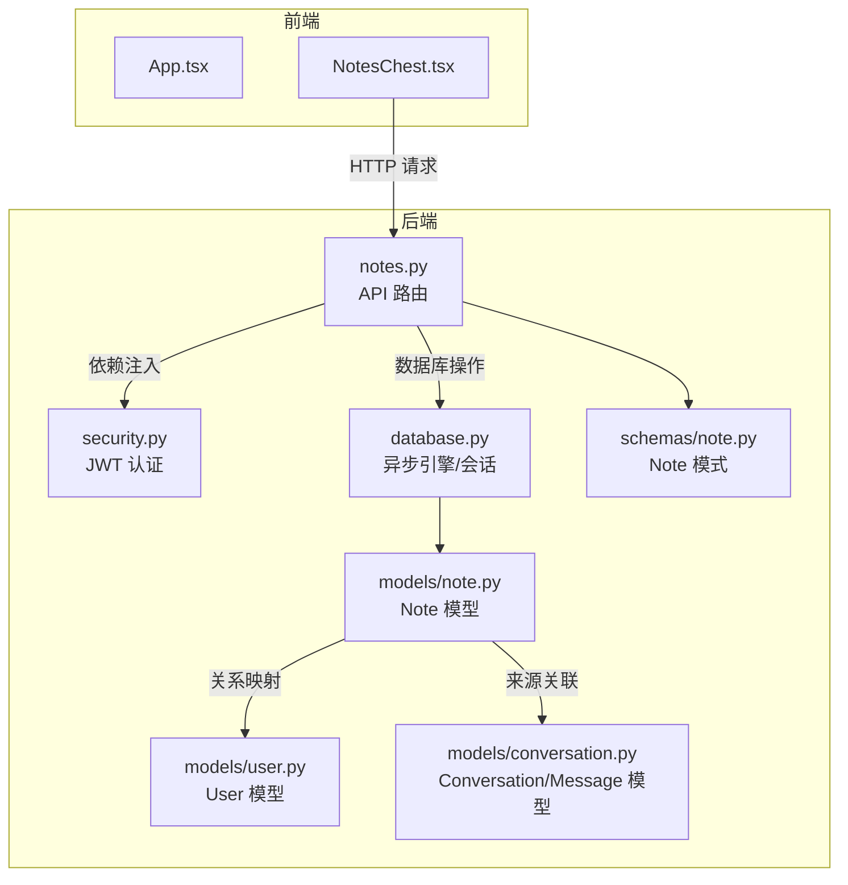
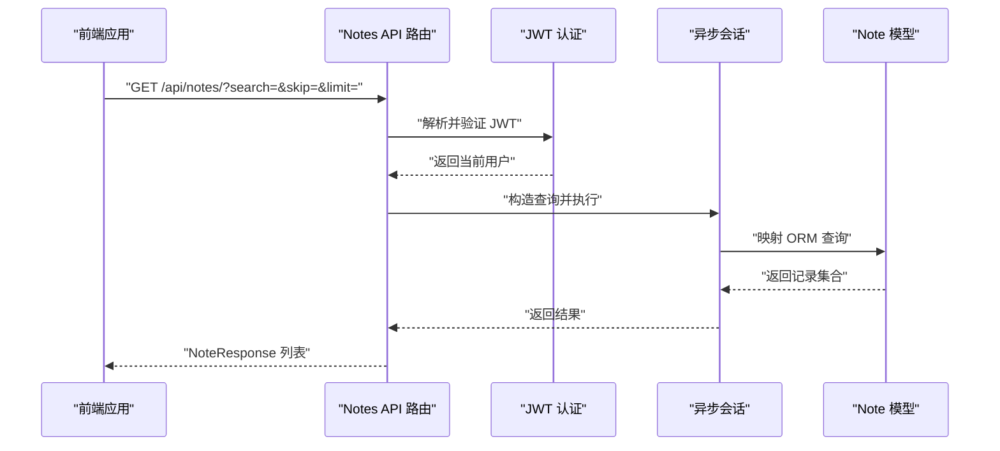
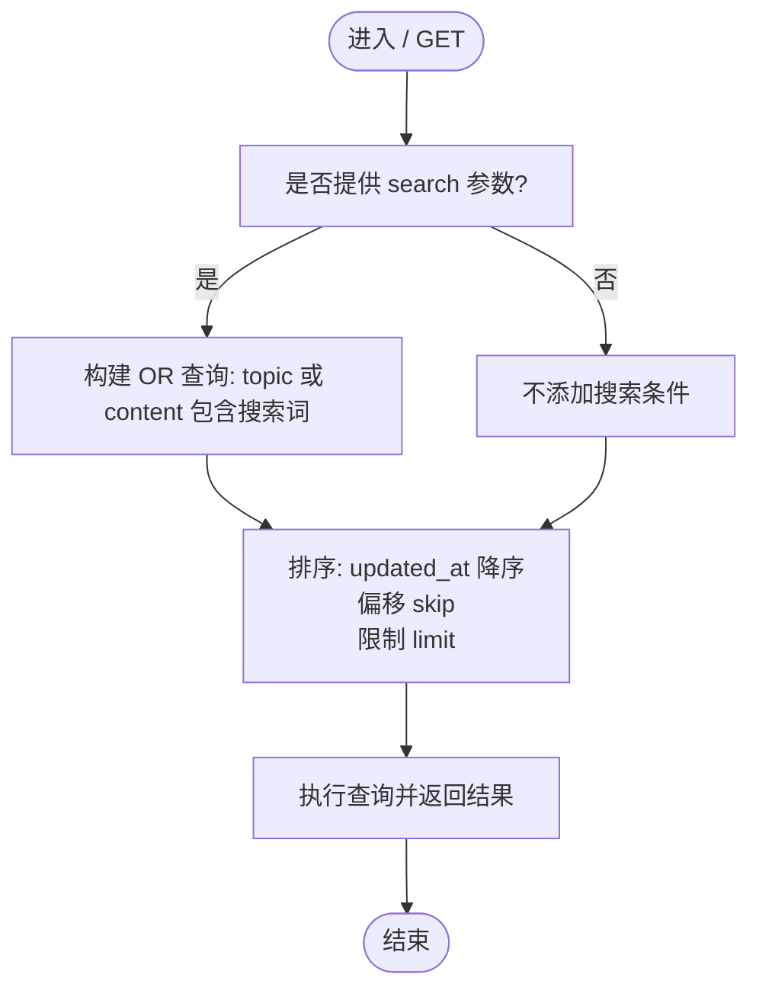
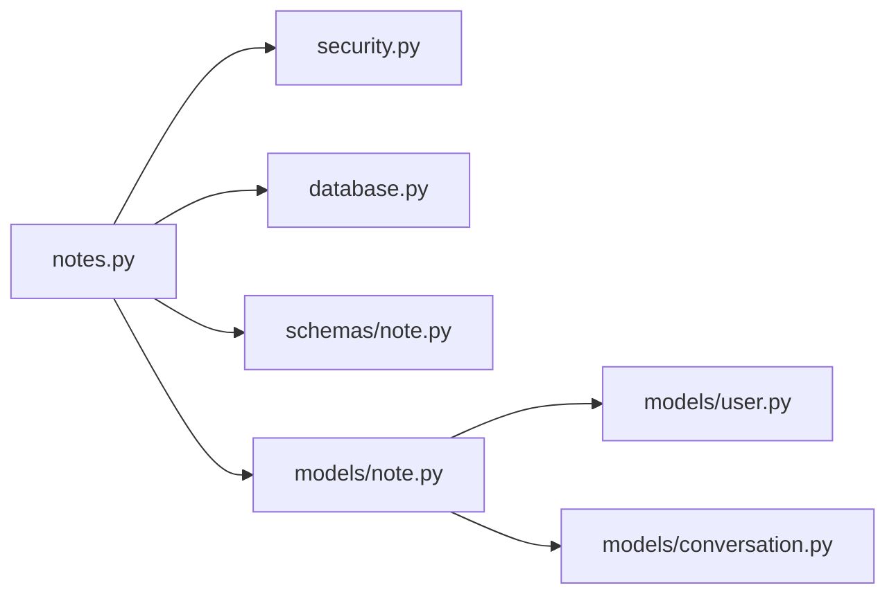

# 笔记模型设计

<cite>
**本文引用的文件**
- [backend/app/models/note.py](file://backend/app/models/note.py)
- [backend/app/schemas/note.py](file://backend/app/schemas/note.py)
- [backend/app/api/notes.py](file://backend/app/api/notes.py)
- [backend/app/core/database.py](file://backend/app/core/database.py)
- [backend/app/core/security.py](file://backend/app/core/security.py)
- [backend/app/models/conversation.py](file://backend/app/models/conversation.py)
- [backend/app/models/user.py](file://backend/app/models/user.py)
- [backend/app/schemas/conversation.py](file://backend/app/schemas/conversation.py)
- [PROJECT_OVERVIEW.md](file://PROJECT_OVERVIEW.md)
</cite>

## 目录
1. [引言](#引言)
2. [项目结构](#项目结构)
3. [核心组件](#核心组件)
4. [架构总览](#架构总览)
5. [详细组件分析](#详细组件分析)
6. [依赖分析](#依赖分析)
7. [性能考虑](#性能考虑)
8. [故障排除指南](#故障排除指南)
9. [结论](#结论)
10. [附录](#附录)

## 引言
本文件为 Quickl笔记模型的详细数据模型文档，聚焦于笔记表的设计、字段语义、Markdown/富文本处理与渲染、全文检索、CRUD与批量操作、导入导出与版本控制、数据组织与权限控制、以及备份恢复与迁移策略。基于后端 FastAPI + SQLAlchemy 异步 ORM 的实现，结合项目概览与现有代码，形成从数据层到 API 层的完整说明。

## 项目结构
Quickly 采用前后端分离架构：前端使用 React + TypeScript + Vite，后端使用 FastAPI + SQLAlchemy 2.0（异步）。笔记模型位于后端 models 与 schemas 目录，并通过 API 路由暴露 CRUD 与搜索能力；数据库连接与会话管理在 core 中实现；安全认证通过 JWT 实现。

图表来源
- [backend/app/api/notes.py:1-133](file://backend/app/api/notes.py#L1-L133)
- [backend/app/core/security.py:54-80](file://backend/app/core/security.py#L54-L80)
- [backend/app/core/database.py:39-46](file://backend/app/core/database.py#L39-L46)
- [backend/app/models/note.py:11-35](file://backend/app/models/note.py#L11-L35)
- [backend/app/models/user.py:11-39](file://backend/app/models/user.py#L11-L39)
- [backend/app/models/conversation.py:11-54](file://backend/app/models/conversation.py#L11-L54)
- [backend/app/schemas/note.py:10-40](file://backend/app/schemas/note.py#L10-L40)

章节来源
- [PROJECT_OVERVIEW.md:1-200](file://PROJECT_OVERVIEW.md#L1-L200)

## 核心组件
- 数据模型 Note：定义笔记的主键、所属用户、标题与内容、来源会话与消息、自动生成标记、时间戳及与用户的关系。
- 模式 Schemas：定义创建、更新、响应的 Pydantic 模式，确保请求/响应数据结构与长度约束。
- API 路由 notes.py：提供笔记列表查询（含全文检索）、单条读取、创建、更新、删除等接口。
- 安全与会话：JWT 认证中间件确保仅返回当前用户可见的笔记；数据库会话管理保证异步事务一致性。
- 关联模型：Conversation/Message 提供自动笔记生成来源，便于追踪笔记来源与上下文。

章节来源
- [backend/app/models/note.py:11-35](file://backend/app/models/note.py#L11-L35)
- [backend/app/schemas/note.py:10-40](file://backend/app/schemas/note.py#L10-L40)
- [backend/app/api/notes.py:20-133](file://backend/app/api/notes.py#L20-L133)
- [backend/app/core/security.py:54-80](file://backend/app/core/security.py#L54-L80)
- [backend/app/core/database.py:39-46](file://backend/app/core/database.py#L39-L46)
- [backend/app/models/conversation.py:11-54](file://backend/app/models/conversation.py#L11-L54)

## 架构总览
下图展示了笔记数据流：前端调用后端 API，API 通过 JWT 获取当前用户，再通过异步会话访问数据库模型，最终返回标准化的响应模式。

图表来源
- [backend/app/api/notes.py:20-42](file://backend/app/api/notes.py#L20-L42)
- [backend/app/core/security.py:54-80](file://backend/app/core/security.py#L54-L80)
- [backend/app/core/database.py:39-46](file://backend/app/core/database.py#L39-L46)

## 详细组件分析

### 数据模型：Note 表字段设计
- 主键与归属
  - id：整型主键，索引优化。
  - user_id：外键关联 users 表，非空，确保笔记归属唯一用户。
- 内容字段
  - topic：字符串，最大长度 200，非空，作为笔记标题。
  - content：文本，非空，存储笔记正文。
- 来源与元数据
  - source_conversation_id：可选外键，指向 conversations 表，用于标识笔记来源于某次会话。
  - source_message_id：可选整型，标识具体消息 ID。
  - is_auto_generated：布尔值，默认 true，表示该笔记由系统自动生成（如 AI 自动生成）。
- 时间戳
  - created_at：默认当前 UTC 时间。
  - updated_at：默认当前 UTC 时间，更新时自动刷新。
- 关系
  - 与 User 的一对多关系，用于级联删除与反向查询。

章节来源
- [backend/app/models/note.py:11-35](file://backend/app/models/note.py#L11-L35)

### 模式定义：Pydantic 模式
- NoteBase：定义公共字段 topic 与 content 的约束。
- NoteCreate：创建时允许指定 source_conversation_id、source_message_id、is_auto_generated。
- NoteUpdate：更新时支持可选字段 topic 与 content。
- NoteResponse：响应模式包含 id、user_id、时间戳、来源与自动生成标记，并启用 from_attributes 以兼容 ORM 对象。

章节来源
- [backend/app/schemas/note.py:10-40](file://backend/app/schemas/note.py#L10-L40)

### API 路由：笔记 CRUD 与搜索
- 列表查询
  - 支持可选搜索参数 search，在 topic 与 content 上进行不区分大小写的模糊匹配。
  - 支持分页 skip 与 limit（默认 50，最小 1，最大 100）。
  - 结果按 updated_at 降序排列。
- 单条读取
  - 根据 note_id 与 user_id 进行双重校验，防止越权访问。
- 创建
  - 使用 NoteCreate 参数，填充 user_id 并持久化。
- 更新
  - 仅当字段非空时更新对应列，避免覆盖。
- 删除
  - 校验所有权后删除并返回成功消息。

图表来源
- [backend/app/api/notes.py:20-42](file://backend/app/api/notes.py#L20-L42)

章节来源
- [backend/app/api/notes.py:20-133](file://backend/app/api/notes.py#L20-L133)

### Markdown/富文本处理与渲染
- 存储策略
  - content 字段为纯文本存储，适合全文检索与轻量处理。
- 渲染策略
  - 前端 NotesChest 组件负责 Markdown 渲染与展示，后端不直接参与富文本解析。
- 富文本扩展
  - 若未来需要富文本能力，可在 content 中嵌入 HTML 或 Markdown，前端统一渲染；或新增字段存储富文本结构（如 JSON），后端提供相应模式与渲染接口。

章节来源
- [PROJECT_OVERVIEW.md:78-86](file://PROJECT_OVERVIEW.md#L78-L86)
- [backend/app/models/note.py:18-21](file://backend/app/models/note.py#L18-L21)

### 笔记搜索实现
- 全文检索
  - 在 topic 与 content 上进行 ilike 模糊匹配，支持关键词检索。
- 标签过滤
  - 当前模型未内置标签字段；若需标签过滤，可在现有 JSON 字段上扩展（如 topic_tags）或新增标签表与关联。
- 时间范围查询
  - 当前 API 未提供时间范围查询参数；可在查询参数中增加 start_time 与 end_time，并在查询中加入日期范围过滤。

章节来源
- [backend/app/api/notes.py:20-42](file://backend/app/api/notes.py#L20-L42)

### 笔记 CRUD 操作与批量操作
- 单条 CRUD
  - 已实现：列表、详情、创建、更新、删除。
- 批量操作
  - 当前未提供批量接口；可通过前端循环调用单条接口实现批量创建/更新/删除，或在后端新增批量路由（例如批量创建、批量删除）。
- 导入导出
  - 当前未提供导入导出接口；可新增导入/导出端点，支持 Markdown 文件批量导入与导出。
- 版本控制
  - 当前未实现版本表；可在 notes 表基础上增加版本号字段或独立版本表，记录每次变更并支持回滚。

章节来源
- [backend/app/api/notes.py:64-133](file://backend/app/api/notes.py#L64-L133)

### 数据组织、权限控制与共享机制
- 数据组织
  - 每条笔记绑定 user_id，确保用户隔离。
  - 来源关联 source_conversation_id 与 source_message_id，便于追踪 AI 自动生成笔记的上下文。
- 权限控制
  - 所有读写操作均通过 get_current_user 中间件获取当前用户，查询时强制 user_id 匹配，防止越权。
- 共享机制
  - 当前未实现笔记共享；可引入共享表（如 shared_notes），包含分享者、被分享者、权限级别与有效期等字段。

章节来源
- [backend/app/api/notes.py:25-26](file://backend/app/api/notes.py#L25-L26)
- [backend/app/api/notes.py:45-61](file://backend/app/api/notes.py#L45-L61)
- [backend/app/api/notes.py:85-110](file://backend/app/api/notes.py#L85-L110)
- [backend/app/core/security.py:54-80](file://backend/app/core/security.py#L54-L80)
- [backend/app/models/note.py:23-24](file://backend/app/models/note.py#L23-L24)

### 备份恢复与迁移策略
- 备份
  - SQLite：直接复制数据库文件；PostgreSQL：使用 pg_dump。
- 恢复
  - 将备份文件还原至相同路径/实例，重启服务后数据可用。
- 迁移
  - 使用 Alembic 进行迁移管理，先生成迁移脚本，再升级/降级版本。
  - 针对字段变更（如新增标签字段、版本控制表），编写迁移脚本并测试。

章节来源
- [PROJECT_OVERVIEW.md:171-177](file://PROJECT_OVERVIEW.md#L171-L177)

## 依赖分析
- 模块耦合
  - API 路由依赖安全中间件与数据库会话。
  - 模型依赖 Base 与关系定义，Note 与 User、Conversation 形成清晰的一对多关系。
- 外部依赖
  - SQLAlchemy 异步引擎与会话管理。
  - JWT 解析与用户校验。
- 潜在环依赖
  - 当前未发现循环导入；注意避免在 schemas 中引入 models 的循环引用。

图表来源
- [backend/app/api/notes.py:1-133](file://backend/app/api/notes.py#L1-L133)
- [backend/app/core/security.py:1-80](file://backend/app/core/security.py#L1-L80)
- [backend/app/core/database.py:1-46](file://backend/app/core/database.py#L1-L46)
- [backend/app/models/note.py:1-35](file://backend/app/models/note.py#L1-L35)
- [backend/app/models/user.py:1-39](file://backend/app/models/user.py#L1-L39)
- [backend/app/models/conversation.py:1-54](file://backend/app/models/conversation.py#L1-L54)
- [backend/app/schemas/note.py:1-40](file://backend/app/schemas/note.py#L1-L40)

## 性能考虑
- 查询优化
  - 为 user_id、topic、content 建立索引，提升搜索与排序性能。
  - 控制分页大小与 skip，避免深层分页导致的性能下降。
- 异步与连接池
  - 使用异步引擎与连接池，合理设置 pool_size 与 max_overflow，避免高并发下的连接瓶颈。
- 缓存策略
  - 对热点笔记列表与常用搜索结果进行缓存，降低数据库压力。

## 故障排除指南
- 404 未找到
  - 当 note_id 不存在或不属于当前用户时，返回 404；检查 user_id 与 note_id 是否正确。
- 401 未授权
  - JWT 解析失败或用户不存在时触发；确认令牌有效且未过期。
- 数据库连接异常
  - 检查 DATABASE_URL 与连接池配置；SQLite 与 PostgreSQL 的差异已在引擎初始化中处理。

章节来源
- [backend/app/api/notes.py:59-61](file://backend/app/api/notes.py#L59-L61)
- [backend/app/api/notes.py:127-129](file://backend/app/api/notes.py#L127-L129)
- [backend/app/core/security.py:59-78](file://backend/app/core/security.py#L59-L78)
- [backend/app/core/database.py:16-30](file://backend/app/core/database.py#L16-L30)

## 结论
Quickly 的笔记模型以简洁高效为核心：使用异步 ORM 管理笔记与用户关系，通过 JWT 实现细粒度权限控制，提供基础的全文检索与 CRUD 能力。后续可在标签体系、批量操作、导入导出、版本控制与共享机制等方面扩展，同时完善数据库迁移与备份策略，以支撑更复杂的业务场景。

## 附录
- 术语
  - ORM：对象关系映射，用于将数据库表映射为 Python 类。
  - JWT：JSON Web Token，用于用户身份验证与授权。
  - 异步引擎：基于 asyncio 的数据库连接，适合高并发场景。
- 参考
  - 项目概览与技术栈说明，包含笔记页面与 API 功能定位。

章节来源
- [PROJECT_OVERVIEW.md:60-142](file://PROJECT_OVERVIEW.md#L60-L142)