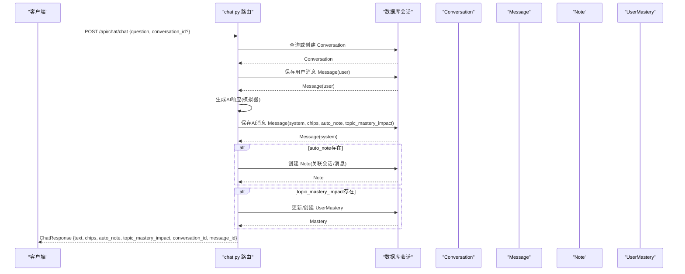
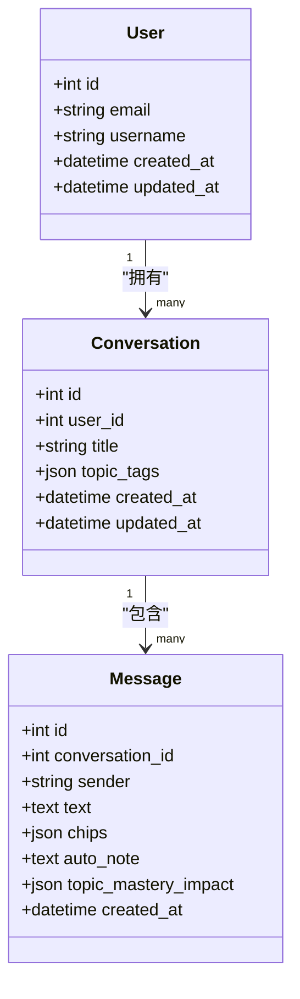
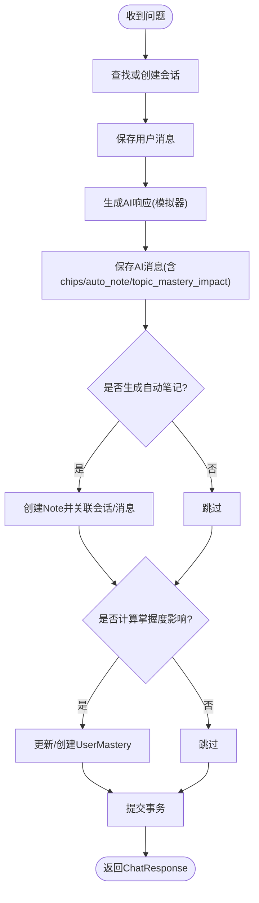
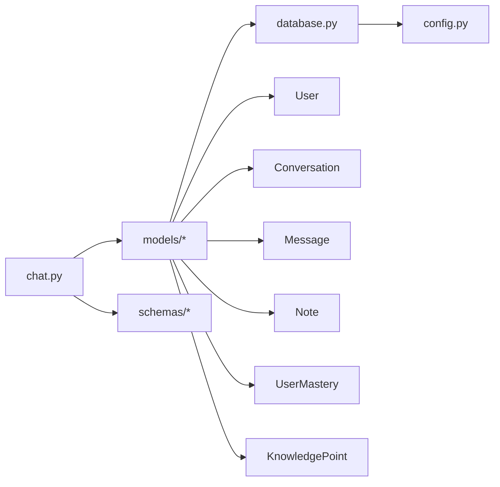

# 会话模型

<cite>
**本文引用的文件**
- [conversation.py](file://backend/app/models/conversation.py)
- [conversation.py](file://backend/app/schemas/conversation.py)
- [user.py](file://backend/app/models/user.py)
- [note.py](file://backend/app/models/note.py)
- [mastery.py](file://backend/app/models/mastery.py)
- [knowledge.py](file://backend/app/models/knowledge.py)
- [chat.py](file://backend/app/api/chat.py)
- [database.py](file://backend/app/core/database.py)
- [config.py](file://backend/app/core/config.py)
- [README.md](file://backend/README.md)
</cite>

## 目录
1. [引言](#引言)
2. [项目结构](#项目结构)
3. [核心组件](#核心组件)
4. [架构总览](#架构总览)
5. [详细组件分析](#详细组件分析)
6. [依赖分析](#依赖分析)
7. [性能考虑](#性能考虑)
8. [故障排查指南](#故障排查指南)
9. [结论](#结论)
10. [附录](#附录)

## 引言
本文件面向Quickly后端的“会话模型”子系统，系统性梳理会话与消息的数据模型、状态管理、序列化存储机制、AI交互记录与自动笔记生成、以及会话与用户的关系映射与级联删除策略。同时给出会话数据的示例格式、查询模式、持久化与内存管理考虑、性能优化方案，以及数据验证规则与业务约束说明，帮助开发者与产品人员快速理解并正确使用会话功能。

## 项目结构
后端采用FastAPI + SQLAlchemy异步ORM的分层架构，会话模型位于models层，配套的Pydantic Schema位于schemas层，API路由位于api层，数据库连接与会话管理位于core层。

```mermaid
graph TB
subgraph "模型层(models)"
U["User<br/>用户"]
C["Conversation<br/>会话"]
M["Message<br/>消息"]
N["Note<br/>笔记"]
UM["UserMastery<br/>用户掌握度"]
KP["KnowledgePoint<br/>知识点"]
end
subgraph "模式层(schemas)"
SC["Conversation schemas<br/>会话Schema"]
SM["Message schemas<br/>消息Schema"]
end
subgraph "接口层(api)"
CHAT["chat.py<br/>聊天API"]
end
subgraph "基础设施(core)"
DB["database.py<br/>数据库引擎/会话"]
CFG["config.py<br/>配置"]
end
U < --> C
C < --> M
U < --> N
U < --> UM
UM < --> KP
CHAT --> C
CHAT --> M
CHAT --> N
CHAT --> UM
DB --> U
DB --> C
DB --> M
DB --> N
DB --> UM
DB --> KP
CFG --> DB
```

图表来源
- [conversation.py:11-54](file://backend/app/models/conversation.py#L11-L54)
- [user.py:11-39](file://backend/app/models/user.py#L11-L39)
- [note.py:11-35](file://backend/app/models/note.py#L11-L35)
- [mastery.py:11-44](file://backend/app/models/mastery.py#L11-L44)
- [knowledge.py:10-32](file://backend/app/models/knowledge.py#L10-L32)
- [chat.py:14-19](file://backend/app/api/chat.py#L14-L19)
- [database.py:10-46](file://backend/app/core/database.py#L10-L46)
- [config.py:10-45](file://backend/app/core/config.py#L10-L45)

章节来源
- [README.md:41-66](file://backend/README.md#L41-L66)

## 核心组件
- 会话实体（Conversation）：代表一次问答会话，包含标题、话题标签、时间戳、与用户及消息的关联。
- 消息实体（Message）：代表会话中的单条消息，包含发送者、文本内容、AI响应元数据（知识芯片、自动生成笔记、掌握度影响）、时间戳。
- 用户实体（User）：与会话、笔记、掌握度等存在一对多关系，并支持级联删除策略。
- 笔记实体（Note）：可与会话和消息关联，用于记录AI交互产生的知识点摘要。
- 掌握度实体（UserMastery）：跟踪用户对知识点的掌握分数与复习计划。
- 知识点实体（KnowledgePoint）：学习主题与概念，支撑掌握度计算。

章节来源
- [conversation.py:11-54](file://backend/app/models/conversation.py#L11-L54)
- [user.py:11-39](file://backend/app/models/user.py#L11-L39)
- [note.py:11-35](file://backend/app/models/note.py#L11-L35)
- [mastery.py:11-44](file://backend/app/models/mastery.py#L11-L44)
- [knowledge.py:10-32](file://backend/app/models/knowledge.py#L10-L32)

## 架构总览
会话模型围绕“用户-会话-消息”的主干关系展开，消息作为AI交互的最小单元，承载知识芯片、自动生成笔记与掌握度影响等元数据。聊天API负责会话生命周期管理、消息持久化、AI响应模拟、自动笔记生成与掌握度更新。



图表来源
- [chat.py:78-151](file://backend/app/api/chat.py#L78-L151)
- [conversation.py:11-54](file://backend/app/models/conversation.py#L11-L54)
- [note.py:11-35](file://backend/app/models/note.py#L11-L35)
- [mastery.py:11-44](file://backend/app/models/mastery.py#L11-L44)

## 详细组件分析

### 会话实体（Conversation）
- 字段定义
  - 标识：自增主键
  - 用户关联：外键指向用户表
  - 内容：标题（可空）
  - 元数据：话题标签（JSON数组，默认空列表）
  - 时间戳：创建时间与更新时间
- 关系映射
  - 与User：一对多，back_populates="conversations"
  - 与Message：一对多，级联策略为“delete-orphan”，即当消息被移除时自动删除孤儿记录
- 状态管理
  - 会话本身不显式状态字段；通过消息数量与最后更新时间间接反映活跃度
- 序列化存储
  - 话题标签以JSON数组形式存储，便于前端展示与检索
- 级联删除策略
  - 用户删除时，会话与其消息按级联策略自动清理（见User模型）



图表来源
- [conversation.py:11-54](file://backend/app/models/conversation.py#L11-L54)
- [user.py:11-39](file://backend/app/models/user.py#L11-L39)

章节来源
- [conversation.py:11-31](file://backend/app/models/conversation.py#L11-L31)

### 消息实体（Message）
- 字段定义
  - 标识：自增主键
  - 会话关联：外键指向会话表
  - 内容：发送者（"user"或"system"）、文本内容
  - AI响应元数据：知识芯片（JSON数组）、自动生成笔记（可空）、掌握度影响（可空）
  - 时间戳：创建时间
- 序列化存储机制
  - JSON字段用于存储结构化元数据，便于前端渲染与后续分析
- AI交互记录实现
  - 用户消息与AI消息分别持久化，形成完整的对话链路
  - 自动笔记与掌握度影响随消息写入，确保交互闭环



图表来源
- [chat.py:78-151](file://backend/app/api/chat.py#L78-L151)
- [conversation.py:33-54](file://backend/app/models/conversation.py#L33-L54)

章节来源
- [conversation.py:33-54](file://backend/app/models/conversation.py#L33-L54)
- [chat.py:153-184](file://backend/app/api/chat.py#L153-L184)

### 用户与会话的关系映射与级联删除
- 用户与会话：一对多，用户删除时，其所有会话与消息按级联策略删除
- 会话与消息：一对多，消息删除时自动清理孤儿记录
- 级联删除策略
  - 在User模型中声明了对多个相关实体的级联删除
  - 在Conversation模型中声明了对消息的“delete-orphan”级联

章节来源
- [user.py](file://backend/app/models/user.py#L35)
- [conversation.py](file://backend/app/models/conversation.py#L30)

### 会话与消息的查询模式
- 获取会话历史（按最近更新排序，限制数量）
- 获取指定会话的消息列表（按时间顺序）
- 查询均通过SQLAlchemy异步查询执行，确保并发安全

章节来源
- [chat.py:220-251](file://backend/app/api/chat.py#L220-L251)

### 数据验证规则与业务约束
- 会话Schema
  - 标题最大长度限制
  - 话题标签默认为空数组
- 消息Schema
  - 文本必填
  - 响应Schema包含必要字段与默认值
- 掌握度Schema
  - 分数范围约束（0-100）
- 知识点Schema
  - 名称唯一、难度级别范围约束

章节来源
- [conversation.py:11-56](file://backend/app/schemas/conversation.py#L11-L56)
- [mastery.py:10-44](file://backend/app/schemas/mastery.py#L10-L44)
- [knowledge.py:10-35](file://backend/app/schemas/knowledge.py#L10-L35)

### 会话数据示例格式
- 会话响应（ConversationResponse）
  - 包含：id、user_id、title、topic_tags、created_at、updated_at、messages[]
- 消息响应（MessageResponse）
  - 包含：id、conversation_id、sender、text、chips、auto_note、topic_mastery_impact、created_at
- 聊天请求（ChatRequest）
  - 包含：question、conversation_id?
- 聊天响应（ChatResponse）
  - 包含：text、chips、auto_note、topic_mastery_impact、next_suggestion?、conversation_id、message_id

章节来源
- [conversation.py:45-73](file://backend/app/schemas/conversation.py#L45-L73)

## 依赖分析
- 模型依赖
  - Conversation依赖User与Message
  - Message依赖Conversation
  - Note依赖User与Conversation
  - UserMastery依赖User与KnowledgePoint
- API依赖
  - chat.py依赖模型与Schema，负责会话生命周期与AI交互流程
- 数据库依赖
  - database.py提供异步引擎与会话工厂，支持SQLite与PostgreSQL
  - config.py提供数据库URL等配置



图表来源
- [chat.py:14-19](file://backend/app/api/chat.py#L14-L19)
- [database.py:10-46](file://backend/app/core/database.py#L10-L46)
- [config.py](file://backend/app/core/config.py#L24)

章节来源
- [chat.py:14-19](file://backend/app/api/chat.py#L14-L19)
- [database.py:15-36](file://backend/app/core/database.py#L15-L36)
- [config.py](file://backend/app/core/config.py#L24)

## 性能考虑
- 数据库连接池
  - 非SQLite场景启用连接池预检查与溢出配置，提升并发稳定性
- 会话查询
  - 会话历史查询限制数量，避免一次性加载过多数据
  - 消息查询按时间排序，保证展示顺序稳定
- 内存管理
  - 使用异步会话逐个flush/commit，减少单次事务持有资源的时间
  - 对于大文本字段（如消息文本、笔记内容），建议在查询时按需加载
- 缓存与队列
  - 项目配置中预留Redis与Celery，可用于缓存热点会话或异步处理耗时任务（如向量化、复习提醒）

章节来源
- [database.py:16-36](file://backend/app/core/database.py#L16-L36)
- [chat.py:220-251](file://backend/app/api/chat.py#L220-L251)

## 故障排查指南
- 会话不存在
  - 当指定conversation_id但不属于当前用户时，返回404
- 数据一致性
  - 所有消息与会话在事务内提交，确保原子性
- 级联删除
  - 删除用户会话与消息自动清理，注意备份与审计日志
- AI响应模拟
  - 若问题未匹配到预设关键词，返回默认响应，可结合日志定位

章节来源
- [chat.py:94-95](file://backend/app/api/chat.py#L94-L95)
- [chat.py:168-173](file://backend/app/api/chat.py#L168-L173)

## 结论
Quickly的会话模型以“用户-会话-消息”为核心，通过JSON字段承载AI交互元数据，结合自动笔记与掌握度影响，实现了从问答到学习闭环的完整路径。级联删除策略保障了数据完整性，异步数据库连接与查询限制提升了性能与稳定性。Schema层的验证规则确保了输入质量，API层的流程设计保证了用户体验的一致性。

## 附录
- API端点参考
  - POST /api/chat/chat：发送问题并获取AI回答
  - GET /api/chat/conversations：获取会话历史
  - GET /api/chat/conversations/{conversation_id}/messages：获取指定会话的消息列表

章节来源
- [README.md:48-51](file://backend/README.md#L48-L51)