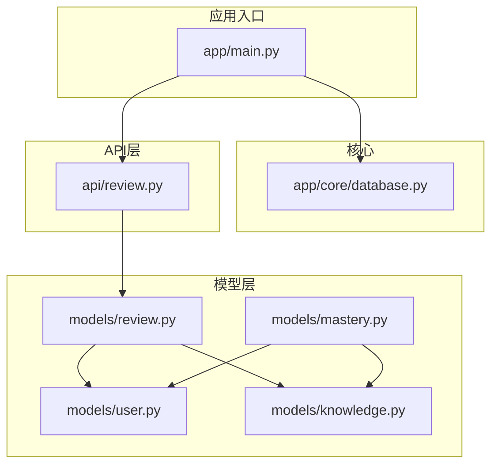
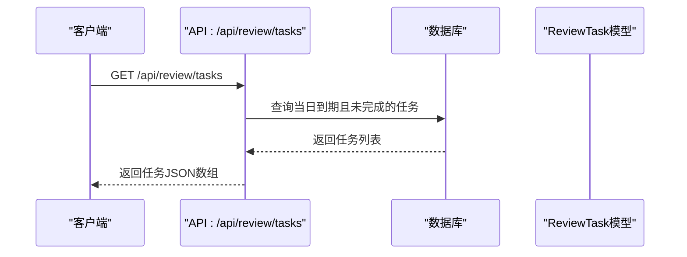
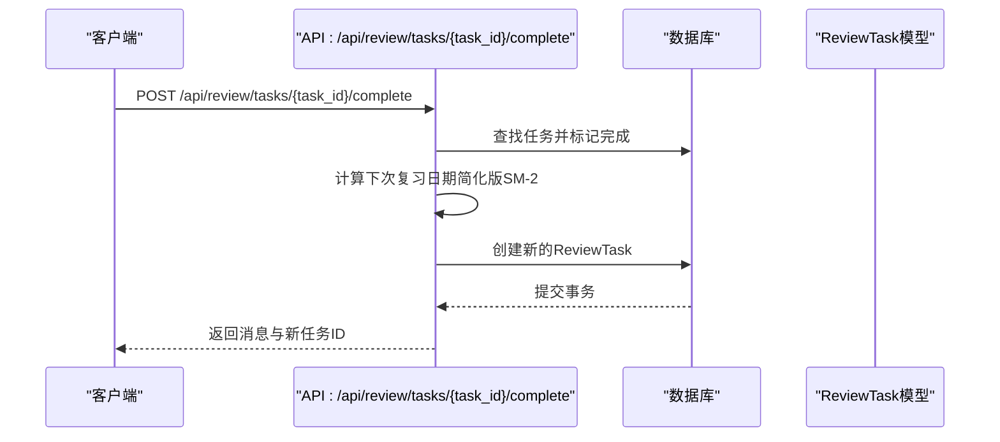
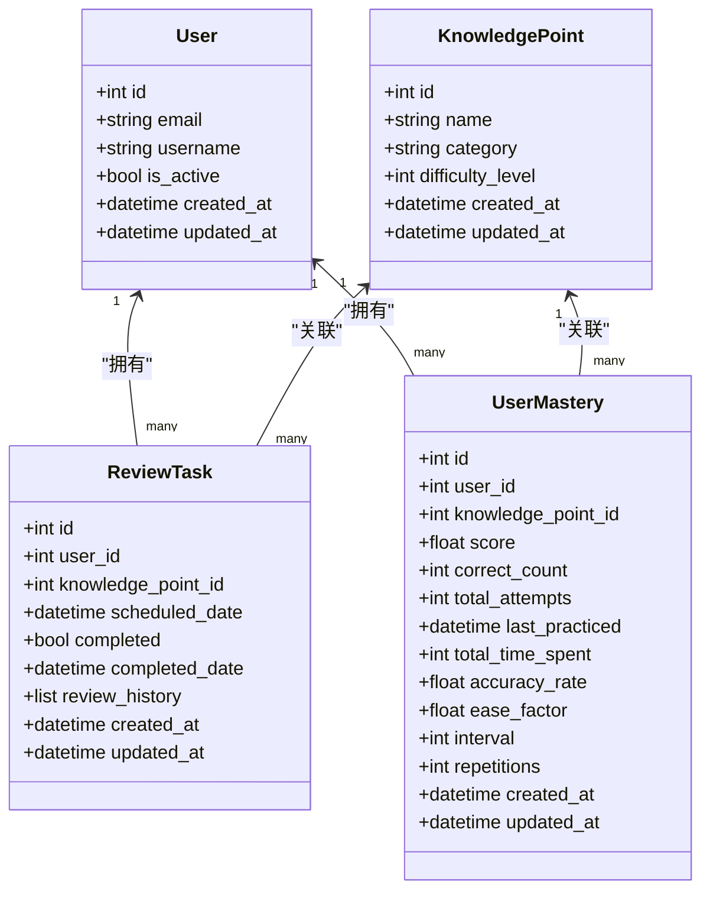

# 复习任务模型

<cite>
**本文引用的文件**
- [backend/app/models/review.py](file://backend/app/models/review.py)
- [backend/app/api/review.py](file://backend/app/api/review.py)
- [backend/app/models/user.py](file://backend/app/models/user.py)
- [backend/app/models/knowledge.py](file://backend/app/models/knowledge.py)
- [backend/app/models/mastery.py](file://backend/app/models/mastery.py)
- [backend/app/schemas/mastery.py](file://backend/app/schemas/mastery.py)
- [backend/app/core/database.py](file://backend/app/core/database.py)
- [backend/app/main.py](file://backend/app/main.py)
</cite>

## 目录
1. [简介](#简介)
2. [项目结构](#项目结构)
3. [核心组件](#核心组件)
4. [架构总览](#架构总览)
5. [详细组件分析](#详细组件分析)
6. [依赖分析](#依赖分析)
7. [性能考虑](#性能考虑)
8. [故障排查指南](#故障排查指南)
9. [结论](#结论)
10. [附录](#附录)

## 简介
本文件面向Quickly平台的“复习任务模型”，系统性地梳理ReviewTask实体的数据结构、字段语义与业务含义；解释复习调度（基于简化版SM-2间隔算法）与提醒机制；阐明复习任务与用户、知识点之间的关联关系及级联删除策略；提供复习任务示例格式、调度查询模式与统计分析方法；说明优先级排序、批量处理与性能优化建议，并给出复习算法参数与业务约束。

## 项目结构
Quickly后端采用FastAPI + SQLAlchemy异步ORM的分层架构：
- 模型层：定义数据库表结构与关系（用户、知识点、掌握度、复习任务）
- API层：暴露REST接口，处理请求与响应
- 核心层：数据库引擎、会话管理与应用生命周期
- 应用入口：注册路由、启动数据库元数据创建

图表来源
- [backend/app/main.py:15-31](file://backend/app/main.py#L15-L31)
- [backend/app/core/database.py:32-45](file://backend/app/core/database.py#L32-L45)
- [backend/app/models/review.py:11-35](file://backend/app/models/review.py#L11-L35)
- [backend/app/models/user.py:11-39](file://backend/app/models/user.py#L11-L39)
- [backend/app/models/knowledge.py:10-32](file://backend/app/models/knowledge.py#L10-L32)
- [backend/app/models/mastery.py:11-44](file://backend/app/models/mastery.py#L11-L44)
- [backend/app/api/review.py:18-90](file://backend/app/api/review.py#L18-L90)

章节来源
- [backend/app/main.py:10-49](file://backend/app/main.py#L10-L49)
- [backend/app/core/database.py:10-45](file://backend/app/core/database.py#L10-L45)

## 核心组件
- ReviewTask（复习任务）：记录用户的复习提醒、完成状态与历史
- User（用户）：与复习任务、掌握度存在一对多关系，并配置了级联删除
- KnowledgePoint（知识点）：与复习任务存在外键关联
- UserMastery（掌握度）：记录用户对知识点的掌握情况，包含SM-2算法所需字段
- API Review（复习接口）：提供今日到期复习任务查询与完成操作

章节来源
- [backend/app/models/review.py:11-35](file://backend/app/models/review.py#L11-L35)
- [backend/app/models/user.py:34-39](file://backend/app/models/user.py#L34-L39)
- [backend/app/models/knowledge.py:10-32](file://backend/app/models/knowledge.py#L10-L32)
- [backend/app/models/mastery.py:11-44](file://backend/app/models/mastery.py#L11-L44)
- [backend/app/api/review.py:21-90](file://backend/app/api/review.py#L21-L90)

## 架构总览
复习任务模型围绕“用户-复习任务-知识点”三者展开，配合掌握度模型中的SM-2参数实现复习调度。API层负责：
- 查询当日到期未完成的复习任务
- 完成某次复习任务并生成下一次复习任务（当前实现为简化版SM-2）

图表来源
- [backend/app/api/review.py:21-48](file://backend/app/api/review.py#L21-L48)
- [backend/app/models/review.py:21-27](file://backend/app/models/review.py#L21-L27)

## 详细组件分析

### ReviewTask 实体与字段定义
ReviewTask用于存储用户的复习提醒与历史，关键字段如下：
- 标识与归属
  - id：主键
  - user_id：外键，指向用户
- 内容关联
  - knowledge_point_id：外键，指向知识点
- 调度控制
  - scheduled_date：计划复习时间（UTC）
  - completed：是否已完成
  - completed_date：完成时间（可空）
- 历史记录
  - review_history：JSON数组，记录过往复习结果
- 时间戳
  - created_at / updated_at：创建与更新时间

关系映射
- 与User：一对多反向关系，支持级联删除
- 与KnowledgePoint：一对一（通过外键约束）

章节来源
- [backend/app/models/review.py:11-35](file://backend/app/models/review.py#L11-L35)

### 用户与复习任务的关系
- 用户模型中定义了review_tasks关系，并配置了级联删除策略
- 当用户被删除时，其所有复习任务将被级联删除

章节来源
- [backend/app/models/user.py:34-39](file://backend/app/models/user.py#L34-L39)

### 知识点与复习任务的关系
- 复习任务通过knowledge_point_id关联到知识点
- 知识点模型包含名称、分类、难度、关键词等元数据，便于复习内容组织

章节来源
- [backend/app/models/knowledge.py:10-32](file://backend/app/models/knowledge.py#L10-L32)
- [backend/app/models/review.py:19](file://backend/app/models/review.py#L19)

### 掌握度与复习算法参数
- UserMastery记录用户对知识点的掌握情况，包含SM-2算法所需字段：
  - ease_factor：难度因子（默认初始值）
  - interval：间隔天数（默认初始值）
  - repetitions：成功复习次数（默认初始值）
- 这些字段为后续完整SM-2算法实现提供基础

章节来源
- [backend/app/models/mastery.py:11-44](file://backend/app/models/mastery.py#L11-L44)

### 复习调度机制与提醒系统
- 任务查询：API提供按日切片查询当日到期且未完成的复习任务
- 提醒系统：前端可轮询或监听该接口以触发提醒
- 完成流程：完成某次复习任务后，系统生成下一次复习任务（当前为简化版SM-2）

图表来源
- [backend/app/api/review.py:51-90](file://backend/app/api/review.py#L51-L90)
- [backend/app/models/review.py:21-27](file://backend/app/models/review.py#L21-L27)

### 复习任务示例格式
- 查询返回的任务对象包含：
  - id：任务ID
  - knowledge_point_id：知识点ID
  - scheduled_date：ISO格式的计划复习时间
  - completed：是否完成

章节来源
- [backend/app/api/review.py:40-48](file://backend/app/api/review.py#L40-L48)

### 调度查询模式
- 按日切片查询：以当日00:00:00为起点，查询到次日00:00:00前的未完成任务
- 条件过滤：用户ID、计划时间范围、完成状态

章节来源
- [backend/app/api/review.py:21-48](file://backend/app/api/review.py#L21-L48)

### 统计分析方法
- 可基于UserMastery中的字段进行统计：
  - 平均间隔天数、平均重复次数、平均难度因子
  - 按知识点/分类/难度维度聚合掌握度分布
  - 复习完成率与时间趋势分析
- 由于当前API未直接暴露统计接口，可在上层服务中结合UserMastery与ReviewTask历史进行聚合

章节来源
- [backend/app/models/mastery.py:19-36](file://backend/app/models/mastery.py#L19-L36)

### 优先级排序与批量处理
- 当前实现未显式定义任务优先级排序规则
- 批量处理建议：
  - 按scheduled_date升序排列，确保先到期先执行
  - 分批拉取（如每批100条），避免一次性加载过多任务
  - 异步并发处理完成操作，减少等待时间

章节来源
- [backend/app/api/review.py:21-48](file://backend/app/api/review.py#L21-L48)

### 复习算法参数与业务约束
- 算法参数（来自UserMastery）：
  - ease_factor：难度因子（SM-2）
  - interval：间隔天数（SM-2）
  - repetitions：成功复习次数（SM-2）
- 业务约束：
  - scheduled_date必须为UTC时间
  - completed为布尔值，completed_date仅在完成时填充
  - review_history为JSON数组，用于记录历史结果
  - 外键约束保证用户与知识点的存在性

章节来源
- [backend/app/models/review.py:21-27](file://backend/app/models/review.py#L21-L27)
- [backend/app/models/mastery.py:33-36](file://backend/app/models/mastery.py#L33-L36)

## 依赖分析
- ReviewTask依赖User与KnowledgePoint作为外键
- User模型中定义了review_tasks关系并启用级联删除
- API层依赖ReviewTask模型进行查询与创建
- 数据库引擎由core/database.py统一管理

图表来源
- [backend/app/models/user.py:11-39](file://backend/app/models/user.py#L11-L39)
- [backend/app/models/knowledge.py:10-32](file://backend/app/models/knowledge.py#L10-L32)
- [backend/app/models/review.py:11-35](file://backend/app/models/review.py#L11-L35)
- [backend/app/models/mastery.py:11-44](file://backend/app/models/mastery.py#L11-L44)

## 性能考虑
- 数据库连接池：根据数据库类型设置合适的pool大小与预检查
- 查询索引：为user_id、knowledge_point_id、scheduled_date建立索引以提升查询效率
- 分页与限流：对任务查询增加分页与速率限制，避免高并发下的抖动
- 异步I/O：使用异步ORM与连接池，减少阻塞
- 缓存：对热点知识点与用户掌握度进行缓存，降低数据库压力

章节来源
- [backend/app/core/database.py:16-30](file://backend/app/core/database.py#L16-L30)

## 故障排查指南
- 任务未出现
  - 检查scheduled_date是否落在当日00:00:00至次日00:00:00之间
  - 确认completed为False
- 完成任务失败
  - 确认task_id与当前用户匹配
  - 检查数据库事务是否提交成功
- 复习历史缺失
  - review_history为JSON数组，需在业务侧追加历史记录
- 级联删除验证
  - 删除用户后确认其复习任务已被清理

章节来源
- [backend/app/api/review.py:21-48](file://backend/app/api/review.py#L21-L48)
- [backend/app/api/review.py:51-90](file://backend/app/api/review.py#L51-L90)
- [backend/app/models/review.py:26](file://backend/app/models/review.py#L26)
- [backend/app/models/user.py:34-39](file://backend/app/models/user.py#L34-L39)

## 结论
Quickly的复习任务模型以ReviewTask为核心，结合User与KnowledgePoint实现清晰的用户-内容关联，并通过UserMastery为SM-2算法预留参数。当前API实现了按日切片的任务查询与完成后的简化调度。建议后续完善：
- 完整SM-2算法实现与参数校验
- 任务优先级排序与批量处理
- 统计接口与可视化报表
- 更完善的错误处理与监控

## 附录
- 应用启动时自动创建数据库表结构
- API路由注册于应用入口，包含认证、聊天、笔记、知识、掌握度与复习模块

章节来源
- [backend/app/main.py:15-31](file://backend/app/main.py#L15-L31)
- [backend/app/main.py:42-49](file://backend/app/main.py#L42-L49)