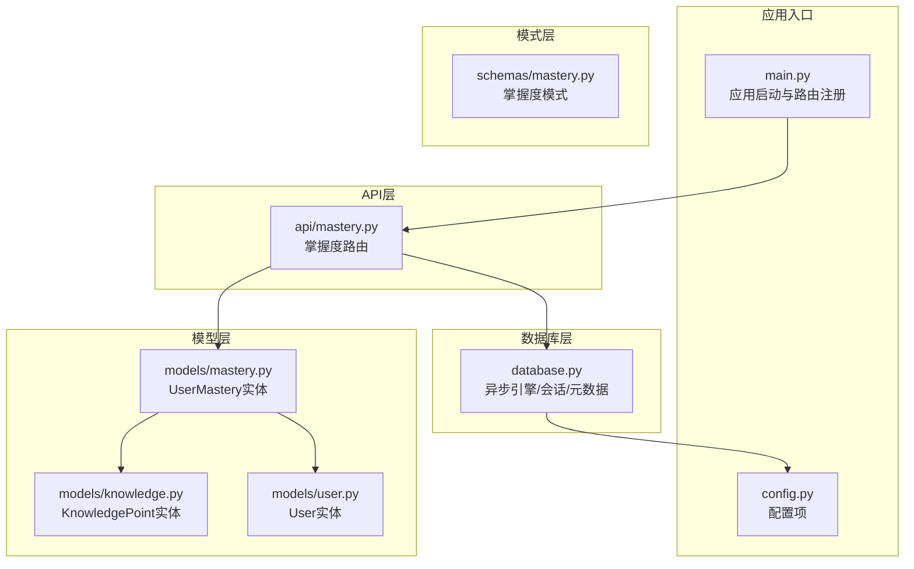
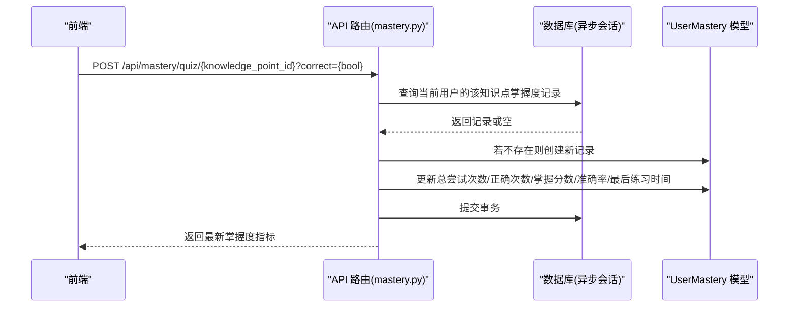
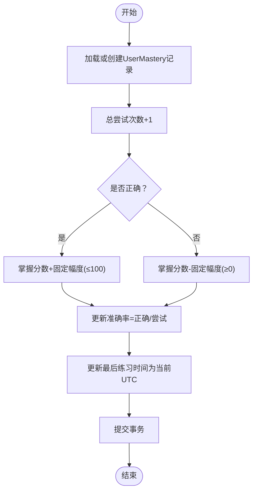
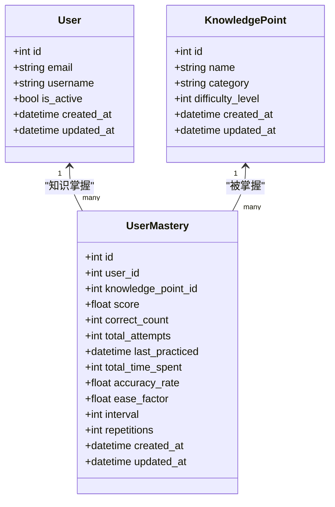
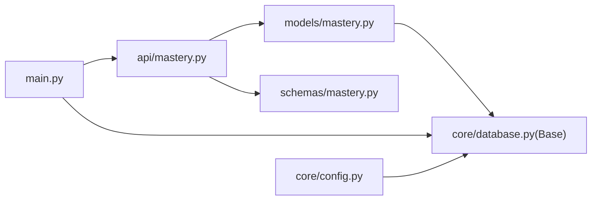

# 掌握度模型

<cite>
**本文引用的文件列表**
- [backend/app/models/mastery.py](file://backend/app/models/mastery.py)
- [backend/app/schemas/mastery.py](file://backend/app/schemas/mastery.py)
- [backend/app/api/mastery.py](file://backend/app/api/mastery.py)
- [backend/app/models/user.py](file://backend/app/models/user.py)
- [backend/app/models/knowledge.py](file://backend/app/models/knowledge.py)
- [backend/app/core/database.py](file://backend/app/core/database.py)
- [backend/app/main.py](file://backend/app/main.py)
- [backend/app/core/config.py](file://backend/app/core/config.py)
</cite>

## 目录
1. [简介](#简介)
2. [项目结构](#项目结构)
3. [核心组件](#核心组件)
4. [架构总览](#架构总览)
5. [详细组件分析](#详细组件分析)
6. [依赖关系分析](#依赖关系分析)
7. [性能考量](#性能考量)
8. [故障排查指南](#故障排查指南)
9. [结论](#结论)
10. [附录](#附录)

## 简介
本文件系统性地梳理Quickly平台的“掌握度模型”，围绕UserMastery实体的字段定义、掌握度计算算法、分数更新机制、学习进度跟踪策略展开，并说明其与用户、知识点的多对多关系映射及级联删除策略。同时提供掌握度数据的示例格式、统计查询模式与趋势分析方法，解释缓存策略、批量更新机制与性能优化考虑，并总结掌握度计算规则与业务逻辑约束。

## 项目结构
掌握度模型位于后端Python应用中，采用FastAPI + SQLAlchemy异步ORM的分层架构：
- 模型层：定义UserMastery、User、KnowledgePoint等实体及其关系
- 模式层（Pydantic）：定义请求/响应数据结构
- API层：暴露掌握度相关的REST接口
- 数据库层：异步连接、会话管理与元数据初始化
- 应用入口：注册路由、中间件与生命周期事件

图表来源
- [backend/app/main.py:1-66](file://backend/app/main.py#L1-L66)
- [backend/app/core/database.py:1-46](file://backend/app/core/database.py#L1-L46)
- [backend/app/models/mastery.py:1-44](file://backend/app/models/mastery.py#L1-L44)
- [backend/app/models/user.py:1-39](file://backend/app/models/user.py#L1-L39)
- [backend/app/models/knowledge.py:1-32](file://backend/app/models/knowledge.py#L1-L32)
- [backend/app/schemas/mastery.py:1-53](file://backend/app/schemas/mastery.py#L1-L53)
- [backend/app/core/config.py:1-45](file://backend/app/core/config.py#L1-L45)

章节来源
- [backend/app/main.py:1-66](file://backend/app/main.py#L1-L66)
- [backend/app/core/database.py:1-46](file://backend/app/core/database.py#L1-L46)
- [backend/app/core/config.py:1-45](file://backend/app/core/config.py#L1-L45)

## 核心组件
- UserMastery（掌握度记录）
  - 关键字段：用户标识、知识点标识、掌握分数、正确计数、总尝试次数、最后练习时间、累计时长、准确率、SM-2复习参数（易度因子、间隔、重复次数）、创建/更新时间戳
  - 关系：与User一对多、与KnowledgePoint一对多
- User（用户）
  - 关系：与UserMastery一对多（级联删除）
- KnowledgePoint（知识点）
  - 关系：与UserMastery一对多
- API端点
  - 获取掌握度概览、获取全部掌握度记录、按知识点获取掌握度、提交测验结果并更新掌握度
- 模式（Pydantic）
  - MasteryBase/MasteryCreate/MasteryUpdate/MasteryResponse/MasteryOverview

章节来源
- [backend/app/models/mastery.py:11-44](file://backend/app/models/mastery.py#L11-L44)
- [backend/app/models/user.py:33-39](file://backend/app/models/user.py#L33-L39)
- [backend/app/models/knowledge.py:10-32](file://backend/app/models/knowledge.py#L10-L32)
- [backend/app/api/mastery.py:1-140](file://backend/app/api/mastery.py#L1-L140)
- [backend/app/schemas/mastery.py:10-53](file://backend/app/schemas/mastery.py#L10-L53)

## 架构总览
掌握度模块通过API接收测验结果，更新UserMastery记录；同时提供聚合查询用于仪表盘展示。数据库使用异步引擎，支持SQLite与PostgreSQL等方言。

图表来源
- [backend/app/api/mastery.py:94-139](file://backend/app/api/mastery.py#L94-L139)
- [backend/app/models/mastery.py:11-44](file://backend/app/models/mastery.py#L11-L44)

## 详细组件分析

### UserMastery 实体与字段定义
- 主键与外键
  - id：自增主键
  - user_id：指向users表
  - knowledge_point_id：指向knowledge_points表
- 掌握度与学习进度
  - score：掌握分数（0-100）
  - correct_count：正确题数
  - total_attempts：总尝试次数
  - accuracy_rate：准确率（由正确数/总尝试数计算）
- 时间与时长
  - last_practiced：最后练习时间
  - total_time_spent：累计分钟数
- 复习参数（SM-2算法）
  - ease_factor：易度因子
  - interval：下次复习间隔（天）
  - repetitions：成功复习次数
- 元信息
  - created_at/updated_at：创建与更新时间戳
- 关系
  - 与User：一对多，back_populates到User.knowledge_mastery
  - 与KnowledgePoint：一对多（当前模型未显式声明反向关系）

章节来源
- [backend/app/models/mastery.py:11-44](file://backend/app/models/mastery.py#L11-L44)

### 掌握度计算算法与分数更新机制
- 基于测验结果的增量更新
  - 总尝试次数+1
  - 正确：正确次数+1，掌握分数上限100，增加固定幅度
  - 错误：掌握分数下限0，减少固定幅度
  - 准确率=正确次数/总尝试次数
  - 最后练习时间更新为当前UTC时间
- SM-2复习参数
  - 字段存在但当前API未实现SM-2算法的完整逻辑（如间隔与重复次数的动态调整），仅保留字段以备后续扩展

图表来源
- [backend/app/api/mastery.py:94-139](file://backend/app/api/mastery.py#L94-L139)

章节来源
- [backend/app/api/mastery.py:94-139](file://backend/app/api/mastery.py#L94-L139)

### 学习进度跟踪策略
- 进度指标
  - 正确计数与总尝试次数直接反映学习表现
  - 准确率作为稳定性指标
  - 最后练习时间用于判断活跃度与复习节奏
- 时间维度
  - total_time_spent字段预留累计时长，当前API未更新该值
- 建议
  - 可在答题流程中累积分钟数，或结合会话时长进行更新

章节来源
- [backend/app/models/mastery.py:22-28](file://backend/app/models/mastery.py#L22-L28)
- [backend/app/api/mastery.py:120-130](file://backend/app/api/mastery.py#L120-L130)

### 多对多关系映射与级联删除策略
- 当前映射
  - UserMastery.user_id -> User.id：一对多
  - UserMastery.knowledge_point_id -> KnowledgePoint.id：一对多
  - User.knowledge_mastery：一对多，级联删除（delete-orphan）
- 关系图

图表来源
- [backend/app/models/user.py:11-39](file://backend/app/models/user.py#L11-L39)
- [backend/app/models/knowledge.py:10-32](file://backend/app/models/knowledge.py#L10-L32)
- [backend/app/models/mastery.py:11-44](file://backend/app/models/mastery.py#L11-L44)

章节来源
- [backend/app/models/user.py:33-39](file://backend/app/models/user.py#L33-L39)
- [backend/app/models/mastery.py:16-17](file://backend/app/models/mastery.py#L16-L17)

### 掌握度数据示例格式
- 单条记录（响应模型）
  - 字段：id、user_id、knowledge_point_id、score、correct_count、total_attempts、accuracy_rate、last_practiced、total_time_spent、ease_factor、interval、repetitions、created_at、updated_at
- 概览（聚合）
  - 字段：logisticRegression、gradientDescent、regularization、average
- 示例（概念性）
  - 用户A对知识点X的掌握度：score=75、correct_count=15、total_attempts=20、accuracy_rate=75、last_practiced=某时刻、total_time_spent=0、ease_factor=2.5、interval=1、repetitions=0

章节来源
- [backend/app/schemas/mastery.py:28-44](file://backend/app/schemas/mastery.py#L28-L44)
- [backend/app/schemas/mastery.py:47-53](file://backend/app/schemas/mastery.py#L47-L53)

### 统计查询模式与趋势分析
- 统计查询
  - 获取当前用户所有掌握度记录
  - 按知识点ID获取特定掌握度记录
  - 获取掌握度概览（按类别聚合平均分）
- 趋势分析
  - 基于last_practiced时间序列分析复习频率
  - 基于accuracy_rate与score变化趋势评估学习稳定性
  - 结合SM-2参数（后续实现）预测复习计划

章节来源
- [backend/app/api/mastery.py:63-91](file://backend/app/api/mastery.py#L63-L91)
- [backend/app/api/mastery.py:20-60](file://backend/app/api/mastery.py#L20-L60)

### 缓存策略、批量更新与性能优化
- 缓存
  - 配置中包含Redis与Celery相关设置，可作为后续扩展点（如缓存掌握度概览、批量更新队列）
- 批量更新
  - 当前API逐条更新；建议引入批量接口或后台任务处理高频更新场景
- 性能优化
  - 异步数据库引擎与连接池配置
  - 适当索引：user_id、knowledge_point_id组合索引
  - 读写分离与只读副本（若规模扩大）

章节来源
- [backend/app/core/config.py:26-37](file://backend/app/core/config.py#L26-L37)
- [backend/app/core/database.py:16-30](file://backend/app/core/database.py#L16-L30)

## 依赖关系分析
- 模块耦合
  - API层依赖模型层与数据库层
  - 模型层依赖数据库基类
  - 应用入口负责生命周期与路由注册
- 外部依赖
  - SQLAlchemy异步引擎
  - FastAPI路由与依赖注入
  - Pydantic模式校验

图表来源
- [backend/app/api/mastery.py:1-140](file://backend/app/api/mastery.py#L1-L140)
- [backend/app/models/mastery.py:1-44](file://backend/app/models/mastery.py#L1-L44)
- [backend/app/schemas/mastery.py:1-53](file://backend/app/schemas/mastery.py#L1-L53)
- [backend/app/core/database.py:1-46](file://backend/app/core/database.py#L1-L46)
- [backend/app/main.py:1-66](file://backend/app/main.py#L1-L66)
- [backend/app/core/config.py:1-45](file://backend/app/core/config.py#L1-L45)

章节来源
- [backend/app/main.py:10-49](file://backend/app/main.py#L10-L49)
- [backend/app/core/database.py:1-46](file://backend/app/core/database.py#L1-L46)

## 性能考量
- 数据库连接与会话
  - 使用异步引擎与连接池，避免阻塞
  - SQLite不启用池参数，其他数据库启用池预检查与溢出
- 写入路径
  - 测验提交为单条写入，建议在高并发场景引入队列或批处理
- 读取路径
  - 概览聚合在服务端完成，建议缓存短期聚合结果
- 索引建议
  - 在user_id与knowledge_point_id上建立复合索引以提升查询效率

章节来源
- [backend/app/core/database.py:16-30](file://backend/app/core/database.py#L16-L30)

## 故障排查指南
- 常见问题
  - 掌握度记录不存在：API返回404；应确保先创建记录再更新
  - 分数越界：当前算法保证上下限，但需关注边界条件
  - 准确率异常：检查total_attempts是否为0
- 定位手段
  - 查看数据库中UserMastery记录状态
  - 检查API返回的最新指标
  - 核对用户与知识点ID是否匹配

章节来源
- [backend/app/api/mastery.py:89-91](file://backend/app/api/mastery.py#L89-L91)
- [backend/app/api/mastery.py:122-130](file://backend/app/api/mastery.py#L122-L130)

## 结论
UserMastery实体提供了完整的掌握度追踪能力，结合测验提交接口实现了即时反馈与分数更新。当前实现聚焦基础分数与进度指标，SM-2复习参数已预留字段以便后续扩展。通过合理的索引、异步数据库与潜在的缓存/批处理策略，可在用户规模增长时保持良好性能。

## 附录

### 掌握度计算规则与业务逻辑约束
- 计算规则
  - 正确：total_attempts+1，correct_count+1，score=min(100, score+Δ)
  - 错误：total_attempts+1，score=max(0, score-Δ)，accuracy_rate=correct_count/total_attempts
  - last_practiced更新为当前UTC时间
- 业务约束
  - score范围：0-100
  - total_attempts与correct_count非负
  - accuracy_rate由上述两字段派生
  - SM-2字段存在但未在当前逻辑中使用

章节来源
- [backend/app/api/mastery.py:122-130](file://backend/app/api/mastery.py#L122-L130)
- [backend/app/models/mastery.py:19-31](file://backend/app/models/mastery.py#L19-L31)