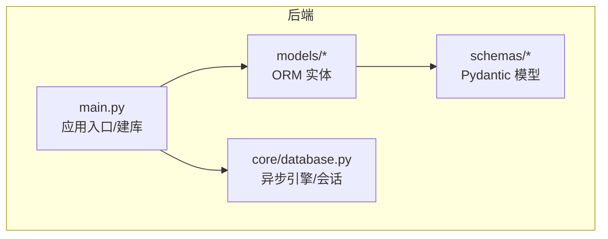
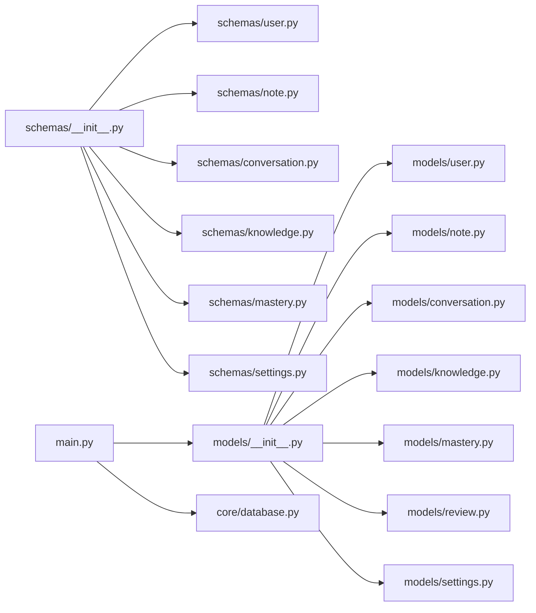

# 数据管理

<cite>
**本文引用的文件**
- [backend/app/models/__init__.py](file://backend/app/models/__init__.py)
- [backend/app/models/user.py](file://backend/app/models/user.py)
- [backend/app/models/note.py](file://backend/app/models/note.py)
- [backend/app/models/conversation.py](file://backend/app/models/conversation.py)
- [backend/app/models/knowledge.py](file://backend/app/models/knowledge.py)
- [backend/app/models/mastery.py](file://backend/app/models/mastery.py)
- [backend/app/models/review.py](file://backend/app/models/review.py)
- [backend/app/models/settings.py](file://backend/app/models/settings.py)
- [backend/app/schemas/__init__.py](file://backend/app/schemas/__init__.py)
- [backend/app/schemas/user.py](file://backend/app/schemas/user.py)
- [backend/app/schemas/note.py](file://backend/app/schemas/note.py)
- [backend/app/schemas/conversation.py](file://backend/app/schemas/conversation.py)
- [backend/app/schemas/knowledge.py](file://backend/app/schemas/knowledge.py)
- [backend/app/schemas/mastery.py](file://backend/app/schemas/mastery.py)
- [backend/app/schemas/settings.py](file://backend/app/schemas/settings.py)
- [backend/app/core/database.py](file://backend/app/core/database.py)
- [backend/app/main.py](file://backend/app/main.py)
</cite>

## 目录
1. [简介](#简介)
2. [项目结构](#项目结构)
3. [核心组件](#核心组件)
4. [架构总览](#架构总览)
5. [详细组件分析](#详细组件分析)
6. [依赖分析](#依赖分析)
7. [性能考虑](#性能考虑)
8. [故障排查指南](#故障排查指南)
9. [结论](#结论)
10. [附录](#附录)

## 简介
本文件为 Quickly 数据管理系统提供系统化的数据模型文档，覆盖用户、会话、消息、笔记、知识点、掌握度、复习任务与设置等核心实体。文档从数据库实体设计、字段定义、约束与索引策略出发，阐明实体间的一对一、一对多与多对多关系映射；并结合后端使用 SQLAlchemy ORM 的实现，给出数据访问模式、缓存策略建议、性能优化要点、数据生命周期与迁移方案、以及数据验证与业务约束说明。

## 项目结构
Quickly 后端采用 FastAPI + SQLAlchemy 异步 ORM 的分层组织方式：
- models 层：定义数据库表结构与关系
- schemas 层：定义 Pydantic 校验模型（请求/响应）
- core 层：数据库连接、会话管理与配置
- api 层：路由与业务接口（在本文件中不展开具体实现）
- main.py：应用入口，负责启动时自动建库与注册路由



**图示来源**
- [backend/app/main.py:1-66](file://backend/app/main.py#L1-L66)
- [backend/app/core/database.py:1-46](file://backend/app/core/database.py#L1-L46)

**章节来源**
- [backend/app/main.py:1-66](file://backend/app/main.py#L1-L66)
- [backend/app/core/database.py:1-46](file://backend/app/core/database.py#L1-L46)

## 核心组件
本节概述各数据模型的职责与关键字段，便于快速建立整体认知。

- 用户（User）：存储用户基本信息、状态与时间戳，并与笔记、会话、掌握度、复习任务、设置形成一对多关系。
- 笔记（Note）：记录用户学习内容，支持来自对话的消息来源追踪。
- 会话（Conversation）与消息（Message）：记录聊天对话与消息明细，支持话题标签与 AI 响应元数据。
- 知识点（KnowledgePoint）：学习主题与概念，支持难度、关键词、前置知识与向量嵌入。
- 掌握度（UserMastery）：记录用户对知识点的掌握分数、答题统计、SM-2 复习参数与时间跟踪。
- 复习任务（ReviewTask）：基于掌握度与 SM-2 计算的复习提醒计划。
- 设置（UserSettings）：用户偏好与提醒配置，一对一绑定到用户。

**章节来源**
- [backend/app/models/user.py:1-39](file://backend/app/models/user.py#L1-L39)
- [backend/app/models/note.py:1-35](file://backend/app/models/note.py#L1-L35)
- [backend/app/models/conversation.py:1-54](file://backend/app/models/conversation.py#L1-L54)
- [backend/app/models/knowledge.py:1-32](file://backend/app/models/knowledge.py#L1-L32)
- [backend/app/models/mastery.py:1-44](file://backend/app/models/mastery.py#L1-L44)
- [backend/app/models/review.py:1-35](file://backend/app/models/review.py#L1-L35)
- [backend/app/models/settings.py:1-41](file://backend/app/models/settings.py#L1-L41)

## 架构总览
下图展示数据模型之间的关系映射，包括主键、外键、一对一与一对多关系，以及典型查询路径（如“用户-设置”一对一、“用户-笔记/会话/掌握度/复习任务”一对多）。

```mermaid
erDiagram
USERS {
int id PK
string email UK
string username
string hashed_password
string avatar_url
text bio
boolean is_active
boolean is_verified
datetime created_at
datetime updated_at
datetime last_login
}
NOTES {
int id PK
int user_id FK
string topic
text content
int source_conversation_id
int source_message_id
boolean is_auto_generated
datetime created_at
datetime updated_at
}
CONVERSATIONS {
int id PK
int user_id FK
string title
json topic_tags
datetime created_at
datetime updated_at
}
MESSAGES {
int id PK
int conversation_id FK
string sender
text text
json chips
text auto_note
json topic_mastery_impact
datetime created_at
}
KNOWLEDGE_POINTS {
int id PK
string name UK
text description
string category
int difficulty_level
json keywords
text embedding
json prerequisites
datetime created_at
datetime updated_at
}
USER_MASTERY {
int id PK
int user_id FK
int knowledge_point_id FK
float score
int correct_count
int total_attempts
datetime last_practiced
int total_time_spent
float accuracy_rate
float ease_factor
int interval
int repetitions
datetime created_at
datetime updated_at
}
REVIEW_TASKS {
int id PK
int user_id FK
int knowledge_point_id FK
datetime scheduled_date
boolean completed
datetime completed_date
json review_history
datetime created_at
datetime updated_at
}
USER_SETTINGS {
int id PK
int user_id FK UK
int daily_goal_minutes
boolean reminder_enabled
time reminder_time
boolean email_notifications
boolean weekly_report
string language
string theme
boolean auto_save_notes
boolean sound_enabled
datetime created_at
datetime updated_at
}
USERS ||--o{ NOTES : "拥有"
USERS ||--o{ CONVERSATIONS : "拥有"
USERS ||--o{ USER_MASTERY : "拥有"
USERS ||--o{ REVIEW_TASKS : "拥有"
USERS ||--o| USER_SETTINGS : "拥有"
CONVERSATIONS ||--o{ MESSAGES : "包含"
KNOWLEDGE_POINTS ||--o{ USER_MASTERY : "被掌握"
USERS ||--o{ USER_MASTERY : "记录掌握度"
USERS ||--o{ REVIEW_TASKS : "触发任务"
KNOWLEDGE_POINTS ||--o{ REVIEW_TASKS : "关联知识点"
```

**图示来源**
- [backend/app/models/user.py:11-39](file://backend/app/models/user.py#L11-L39)
- [backend/app/models/note.py:11-35](file://backend/app/models/note.py#L11-L35)
- [backend/app/models/conversation.py:11-54](file://backend/app/models/conversation.py#L11-L54)
- [backend/app/models/knowledge.py:10-32](file://backend/app/models/knowledge.py#L10-L32)
- [backend/app/models/mastery.py:11-44](file://backend/app/models/mastery.py#L11-L44)
- [backend/app/models/review.py:11-35](file://backend/app/models/review.py#L11-L35)
- [backend/app/models/settings.py:11-41](file://backend/app/models/settings.py#L11-L41)

## 详细组件分析

### 用户（User）
- 表名：users
- 主键：id
- 关键字段与约束
  - 邮箱唯一且必填
  - 用户名必填
  - 密码哈希字符串必填
  - 可选头像与个人简介
  - 状态字段：是否激活、是否已验证
  - 时间戳：创建、更新、最近登录
- 索引策略
  - 主键索引（默认）
  - 邮箱与 id 建有索引（ORM 显式声明）
- 关系
  - 一对多：笔记、会话、掌握度、复习任务
  - 一对一：设置（uselist=False）

**章节来源**
- [backend/app/models/user.py:11-39](file://backend/app/models/user.py#L11-L39)

### 笔记（Note）
- 表名：notes
- 主键：id
- 关键字段与约束
  - 所属用户（外键）
  - 主题与内容必填
  - 来源可选：对话与消息 ID
  - 自动标记
  - 时间戳
- 索引策略
  - 主键索引
  - user_id、source_conversation_id 建有索引（ORM 显式声明）
- 关系
  - 多对一：用户

**章节来源**
- [backend/app/models/note.py:11-35](file://backend/app/models/note.py#L11-L35)

### 会话与消息（Conversation & Message）
- 表名：conversations、messages
- 关键字段与约束
  - 会话：标题可选、话题标签 JSON
  - 消息：发送者（用户/系统）、文本必填、AI 元数据（chips、自动生成笔记、掌握度影响）
- 索引策略
  - 主键索引
  - 外键索引（messages.conversation_id）
- 关系
  - 一对多：会话-消息
  - 多对一：消息-会话
  - 多对一：会话-用户

**章节来源**
- [backend/app/models/conversation.py:11-54](file://backend/app/models/conversation.py#L11-L54)

### 知识点（KnowledgePoint）
- 表名：knowledge_points
- 主键：id
- 关键字段与约束
  - 名称唯一且必填
  - 描述、分类可选
  - 难度等级（1-5）
  - 关键词与前置知识（JSON 列表）
  - 向量嵌入（用于相似检索）
  - 时间戳
- 索引策略
  - 主键索引
  - name 唯一索引（ORM 显式声明）
- 关系
  - 与掌握度、复习任务通过外键关联

**章节来源**
- [backend/app/models/knowledge.py:10-32](file://backend/app/models/knowledge.py#L10-L32)

### 掌握度（UserMastery）
- 表名：user_mastery
- 主键：id
- 关键字段与约束
  - 用户与知识点外键
  - 分数（0-100）、正确次数、总尝试次数
  - 最后练习时间、总耗时（分钟）
  - 准确率（计算字段）
  - SM-2 参数：易学因子、间隔天数、重复次数
  - 时间戳
- 索引策略
  - 主键索引
  - user_id、knowledge_point_id 建有索引（ORM 显式声明）
- 关系
  - 多对一：用户、知识点

**章节来源**
- [backend/app/models/mastery.py:11-44](file://backend/app/models/mastery.py#L11-L44)

### 复习任务（ReviewTask）
- 表名：review_tasks
- 主键：id
- 关键字段与约束
  - 用户与知识点外键
  - 计划复习日期必填
  - 完成状态与完成时间
  - 复习历史（JSON 列表）
  - 时间戳
- 索引策略
  - 主键索引
  - user_id、knowledge_point_id、scheduled_date 建有索引（ORM 显式声明）
- 关系
  - 多对一：用户、知识点

**章节来源**
- [backend/app/models/review.py:11-35](file://backend/app/models/review.py#L11-L35)

### 设置（UserSettings）
- 表名：user_settings
- 主键：id
- 关键字段与约束
  - 用户外键且唯一
  - 日常学习目标（分钟）
  - 提醒开关、提醒时间、邮件通知、周报
  - 语言、主题
  - 高级选项：自动保存笔记、音效
  - 时间戳
- 索引策略
  - 主键索引
  - user_id 唯一索引（ORM 显式声明）
- 关系
  - 一对一：用户

**章节来源**
- [backend/app/models/settings.py:11-41](file://backend/app/models/settings.py#L11-L41)

### 数据访问模式与缓存策略
- 数据访问模式
  - 使用异步会话进行 CRUD 操作，遵循 FastAPI 依赖注入模式
  - 通过关系属性进行关联查询（如 user.notes、conversation.messages）
- 缓存策略建议
  - 对高频读取的用户设置与知识点列表可引入进程内缓存或 Redis 缓存
  - 对 SM-2 计算结果与复习任务可做短期缓存，降低重复计算开销
  - 注意缓存失效策略与一致性（写操作后主动失效相关键）

**章节来源**
- [backend/app/core/database.py:1-46](file://backend/app/core/database.py#L1-L46)

### 示例数据
以下为各表的代表性示例数据（仅示意，非真实值）：
- users：id=1, email="alice@example.com", username="alice", is_active=true, created_at=当前时间
- knowledge_points：id=101, name="线性回归", category="机器学习", difficulty_level=2, keywords=["回归","线性"]
- user_mastery：user_id=1, knowledge_point_id=101, score=65.5, correct_count=12, total_attempts=20
- review_tasks：user_id=1, knowledge_point_id=101, scheduled_date=明天, completed=false
- conversations：id=1001, user_id=1, title="模型训练问题"
- messages：conversation_id=1001, sender="user", text="如何处理过拟合？"
- notes：user_id=1, topic="正则化技巧", content="L1/L2 正则化方法..."
- user_settings：user_id=1, daily_goal_minutes=60, reminder_enabled=true, theme="dark"

（以上示例用于帮助理解字段含义与关系，不作为真实数据）

## 依赖分析
- 模块导入关系
  - models/__init__.py 统一导出所有实体，供 API 与服务层使用
  - schemas/__init__.py 统一导出所有 Pydantic 模型，供路由层校验与序列化
- 运行时依赖
  - main.py 在启动时创建数据库表结构（create_all），并注册各模块路由
  - core/database.py 提供异步引擎与会话工厂，支持 SQLite 与 PostgreSQL



**图示来源**
- [backend/app/models/__init__.py:1-23](file://backend/app/models/__init__.py#L1-L23)
- [backend/app/schemas/__init__.py:1-20](file://backend/app/schemas/__init__.py#L1-L20)
- [backend/app/main.py:1-66](file://backend/app/main.py#L1-L66)
- [backend/app/core/database.py:1-46](file://backend/app/core/database.py#L1-L46)

**章节来源**
- [backend/app/models/__init__.py:1-23](file://backend/app/models/__init__.py#L1-L23)
- [backend/app/schemas/__init__.py:1-20](file://backend/app/schemas/__init__.py#L1-L20)
- [backend/app/main.py:1-66](file://backend/app/main.py#L1-L66)
- [backend/app/core/database.py:1-46](file://backend/app/core/database.py#L1-L46)

## 性能考虑
- 连接池与方言适配
  - 非 SQLite 方言启用连接池预检查与池大小配置，提升并发稳定性
- 索引与查询
  - 为外键与常用过滤字段建立索引（如 user_id、knowledge_point_id、email、name）
  - 对高频排序字段（created_at、updated_at、scheduled_date）建立索引
- 查询优化
  - 使用 select joined 或 explicit join 以减少 N+1 查询
  - 对大列表分页查询，避免一次性加载全部数据
- 写入优化
  - 批量插入/更新，减少事务次数
  - 对 SM-2 计算与复习任务调度采用后台任务队列异步执行

**章节来源**
- [backend/app/core/database.py:15-36](file://backend/app/core/database.py#L15-L36)

## 故障排查指南
- 常见问题
  - 建库失败：确认 DATABASE_URL 配置正确，权限充足
  - 会话关闭异常：确保使用依赖注入的 get_db 会话并在 finally 中关闭
  - 外键约束错误：检查关联对象是否存在，尤其是删除用户时级联策略生效
- 调试建议
  - 开启 SQL 输出（DEBUG）查看生成的 SQL 语句
  - 对复杂查询添加日志与超时控制
  - 对 SM-2 相关计算增加边界检查与默认值保护

**章节来源**
- [backend/app/core/database.py:39-46](file://backend/app/core/database.py#L39-L46)

## 结论
Quickly 的数据模型围绕“用户-知识点-掌握度-复习任务”的学习闭环构建，辅以会话与笔记增强交互体验。通过明确的主外键关系、合理的索引策略与异步 ORM 访问模式，系统具备良好的扩展性与性能基础。建议在生产环境中完善缓存、监控与迁移机制，持续优化查询与写入路径。

## 附录

### 字段与约束速查表
- users
  - 邮箱唯一、必填；用户名必填；密码哈希必填；状态与时间戳
- notes
  - 主题与内容必填；来源对话/消息可空；自动标记
- conversations
  - 标题可空；话题标签 JSON
- messages
  - 发送者枚举（user/system）；文本必填；AI 元数据 JSON
- knowledge_points
  - 名称唯一且必填；难度 1-5；关键词与前置知识 JSON；可选嵌入
- user_mastery
  - 分数 0-100；答题统计与 SM-2 参数；时间跟踪
- review_tasks
  - 计划日期必填；完成状态与历史 JSON
- user_settings
  - 用户唯一；学习目标、提醒、偏好与高级设置

**章节来源**
- [backend/app/models/user.py:11-39](file://backend/app/models/user.py#L11-L39)
- [backend/app/models/note.py:11-35](file://backend/app/models/note.py#L11-L35)
- [backend/app/models/conversation.py:11-54](file://backend/app/models/conversation.py#L11-L54)
- [backend/app/models/knowledge.py:10-32](file://backend/app/models/knowledge.py#L10-L32)
- [backend/app/models/mastery.py:11-44](file://backend/app/models/mastery.py#L11-L44)
- [backend/app/models/review.py:11-35](file://backend/app/models/review.py#L11-L35)
- [backend/app/models/settings.py:11-41](file://backend/app/models/settings.py#L11-L41)

### 数据验证与业务约束
- Pydantic 校验
  - 用户：邮箱格式、用户名长度范围
  - 笔记：主题最大长度限制
  - 知识点：难度范围、关键词与前置知识为列表
  - 掌握度：分数范围、答题统计可为空
  - 设置：学习目标范围、语言与主题枚举值
- 业务约束
  - 用户设置一对一绑定
  - 复习任务基于掌握度与 SM-2 计算
  - 删除用户时级联删除其笔记、会话、掌握度、复习任务与设置

**章节来源**
- [backend/app/schemas/user.py:10-50](file://backend/app/schemas/user.py#L10-L50)
- [backend/app/schemas/note.py:10-40](file://backend/app/schemas/note.py#L10-L40)
- [backend/app/schemas/knowledge.py:10-35](file://backend/app/schemas/knowledge.py#L10-L35)
- [backend/app/schemas/mastery.py:10-53](file://backend/app/schemas/mastery.py#L10-L53)
- [backend/app/schemas/settings.py:10-50](file://backend/app/schemas/settings.py#L10-L50)