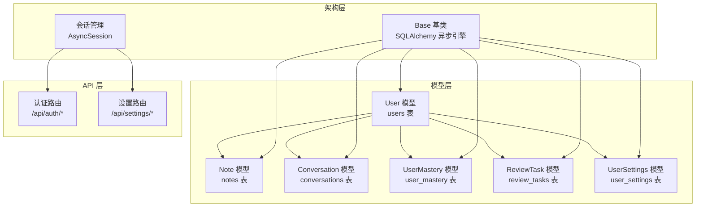
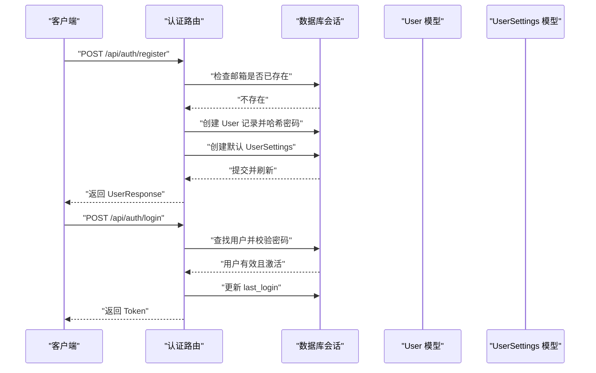
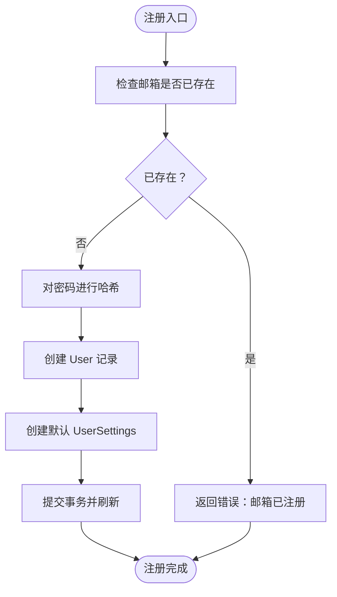
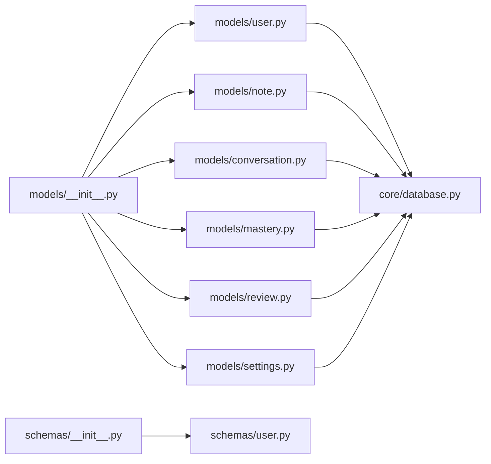

# 用户模型

<cite>
**本文档引用的文件**
- [backend/app/models/user.py](file://backend/app/models/user.py)
- [backend/app/schemas/user.py](file://backend/app/schemas/user.py)
- [backend/app/models/__init__.py](file://backend/app/models/__init__.py)
- [backend/app/schemas/__init__.py](file://backend/app/schemas/__init__.py)
- [backend/app/models/note.py](file://backend/app/models/note.py)
- [backend/app/models/conversation.py](file://backend/app/models/conversation.py)
- [backend/app/models/mastery.py](file://backend/app/models/mastery.py)
- [backend/app/models/review.py](file://backend/app/models/review.py)
- [backend/app/models/settings.py](file://backend/app/models/settings.py)
- [backend/app/core/database.py](file://backend/app/core/database.py)
- [backend/app/api/auth.py](file://backend/app/api/auth.py)
- [backend/app/api/settings.py](file://backend/app/api/settings.py)
- [backend/README.md](file://backend/README.md)
</cite>

## 目录
1. [简介](#简介)
2. [项目结构](#项目结构)
3. [核心组件](#核心组件)
4. [架构总览](#架构总览)
5. [详细组件分析](#详细组件分析)
6. [依赖关系分析](#依赖关系分析)
7. [性能考虑](#性能考虑)
8. [故障排除指南](#故障排除指南)
9. [结论](#结论)

## 简介
本文件为 QuickLearn 平台的用户模型数据模型文档，系统性阐述 User 实体的字段定义、约束条件、时间戳管理机制、与相关实体的关系映射（含级联删除策略）、示例数据与查询模式，以及数据验证规则与业务逻辑约束。该模型基于 SQLAlchemy ORM 和 Pydantic 校验，采用异步数据库连接与 FastAPI 路由层进行交互。

## 项目结构
用户模型位于后端应用的 models 与 schemas 层，并通过 API 层暴露认证与设置接口。核心文件组织如下：
- 模型层：用户模型与关联实体（笔记、对话、掌握度、复习任务、用户设置）
- 架构层：数据库基类、会话管理与依赖注入
- API 层：认证与设置路由，负责用户生命周期的关键操作



图表来源
- [backend/app/models/user.py:11-39](file://backend/app/models/user.py#L11-L39)
- [backend/app/models/note.py:11-35](file://backend/app/models/note.py#L11-L35)
- [backend/app/models/conversation.py:11-54](file://backend/app/models/conversation.py#L11-L54)
- [backend/app/models/mastery.py:11-44](file://backend/app/models/mastery.py#L11-L44)
- [backend/app/models/review.py:11-35](file://backend/app/models/review.py#L11-L35)
- [backend/app/models/settings.py:11-41](file://backend/app/models/settings.py#L11-L41)
- [backend/app/core/database.py:10-46](file://backend/app/core/database.py#L10-L46)
- [backend/app/api/auth.py:22-99](file://backend/app/api/auth.py#L22-L99)
- [backend/app/api/settings.py:19-65](file://backend/app/api/settings.py#L19-L65)

章节来源
- [backend/app/models/__init__.py:5-22](file://backend/app/models/__init__.py#L5-L22)
- [backend/app/schemas/__init__.py:5-19](file://backend/app/schemas/__init__.py#L5-L19)
- [backend/README.md:41-75](file://backend/README.md#L41-L75)

## 核心组件
本节聚焦 User 实体的字段定义、约束与默认值，以及与各关联实体的关系映射。

- 主键与标识
  - id：整数主键，自增，索引启用
  - email：字符串，长度上限 255，唯一且索引，不可为空
  - username：字符串，长度上限 100，不可为空
  - hashed_password：字符串，长度上限 255，不可为空

- 档案字段
  - avatar_url：字符串，长度上限 500，可空
  - bio：文本，可空

- 状态字段
  - is_active：布尔，默认 True
  - is_verified：布尔，默认 False

- 时间戳字段
  - created_at：日期时间，默认当前 UTC 时间
  - updated_at：日期时间，默认当前 UTC 时间，更新时自动刷新
  - last_login：日期时间，可空

- 关系映射与级联策略
  - notes：一对多，级联删除孤儿对象
  - conversations：一对多，级联删除孤儿对象
  - knowledge_mastery：一对多，级联删除孤儿对象
  - review_tasks：一对多，级联删除孤儿对象
  - settings：一对一（uselist=False），级联删除孤儿对象

章节来源
- [backend/app/models/user.py:15-39](file://backend/app/models/user.py#L15-L39)

## 架构总览
用户模型在系统中的位置与交互流程如下：
- 数据库层：继承 Base 基类，使用异步 SQLAlchemy 引擎
- 会话层：通过依赖注入提供 AsyncSession
- API 层：认证路由处理注册、登录、获取当前用户；设置路由处理用户偏好与提醒等设置
- 模式层：Pydantic 模型用于请求/响应校验与序列化



图表来源
- [backend/app/api/auth.py:22-99](file://backend/app/api/auth.py#L22-L99)
- [backend/app/models/user.py:15-39](file://backend/app/models/user.py#L15-L39)
- [backend/app/models/settings.py:15-41](file://backend/app/models/settings.py#L15-L41)

## 详细组件分析

### 字段定义与约束
- 标识与安全
  - email：唯一性约束，防止重复注册；配合索引提升查询效率
  - username：长度限制与非空约束，保证用户名有效性
  - hashed_password：存储经哈希后的密码，不保存明文
- 档案与状态
  - avatar_url/bio：可空，支持用户资料个性化
  - is_active/is_verified：控制账户可用性与验证状态
- 时间戳
  - created_at/updated_at：统一使用 UTC，便于跨时区一致性
  - last_login：登录成功时更新，用于审计与活跃度统计

章节来源
- [backend/app/models/user.py:15-31](file://backend/app/models/user.py#L15-L31)

### 关系映射与级联删除策略
- notes
  - 外键指向 users.id
  - 级联策略：删除用户时，其笔记作为孤儿对象被删除
- conversations
  - 外键指向 users.id
  - 级联策略：删除用户时，其对话会话及消息作为孤儿对象被删除
- knowledge_mastery
  - 外键指向 users.id
  - 级联策略：删除用户时，其掌握度记录作为孤儿对象被删除
- review_tasks
  - 外键指向 users.id
  - 级联策略：删除用户时，其复习任务作为孤儿对象被删除
- settings
  - 外键指向 users.id，且自身唯一约束
  - 级联策略：删除用户时，其设置作为孤儿对象被删除

```mermaid
erDiagram
USERS {
int id PK
string email UK
string username
string hashed_password
string avatar_url
text bio
boolean is_active
boolean is_verified
datetime created_at
datetime updated_at
datetime last_login
}
NOTES {
int id PK
int user_id FK
string topic
text content
int source_conversation_id
int source_message_id
boolean is_auto_generated
datetime created_at
datetime updated_at
}
CONVERSATIONS {
int id PK
int user_id FK
string title
json topic_tags
datetime created_at
datetime updated_at
}
MESSAGES {
int id PK
int conversation_id FK
string sender
text text
json chips
text auto_note
json topic_mastery_impact
datetime created_at
}
USER_MASTERY {
int id PK
int user_id FK
int knowledge_point_id
float score
int correct_count
int total_attempts
datetime last_practiced
int total_time_spent
float accuracy_rate
float ease_factor
int interval
int repetitions
datetime created_at
datetime updated_at
}
REVIEW_TASKS {
int id PK
int user_id FK
int knowledge_point_id
datetime scheduled_date
boolean completed
datetime completed_date
json review_history
datetime created_at
datetime updated_at
}
USER_SETTINGS {
int id PK
int user_id FK UK
int daily_goal_minutes
boolean reminder_enabled
time reminder_time
boolean email_notifications
boolean weekly_report
string language
string theme
boolean auto_save_notes
boolean sound_enabled
datetime created_at
datetime updated_at
}
USERS ||--o{ NOTES : "拥有"
USERS ||--o{ CONVERSATIONS : "拥有"
USERS ||--o{ USER_MASTERY : "拥有"
USERS ||--o{ REVIEW_TASKS : "拥有"
USERS ||--|| USER_SETTINGS : "拥有"
CONVERSATIONS ||--o{ MESSAGES : "包含"
```

图表来源
- [backend/app/models/user.py:15-39](file://backend/app/models/user.py#L15-L39)
- [backend/app/models/note.py:15-35](file://backend/app/models/note.py#L15-L35)
- [backend/app/models/conversation.py:15-54](file://backend/app/models/conversation.py#L15-L54)
- [backend/app/models/mastery.py:15-44](file://backend/app/models/mastery.py#L15-L44)
- [backend/app/models/review.py:15-35](file://backend/app/models/review.py#L15-L35)
- [backend/app/models/settings.py:15-41](file://backend/app/models/settings.py#L15-L41)

### 数据验证规则与业务逻辑约束
- 注册流程
  - 邮箱唯一性检查，避免重复注册
  - 密码长度至少 6 位
  - 注册成功后自动创建默认用户设置
- 登录流程
  - 校验邮箱与密码
  - 仅激活用户可登录
  - 登录成功后更新 last_login
- 响应模型
  - UserResponse 包含必要字段与可空字段，from_attributes 支持 ORM 对象序列化



图表来源
- [backend/app/api/auth.py:22-49](file://backend/app/api/auth.py#L22-L49)
- [backend/app/schemas/user.py:16-18](file://backend/app/schemas/user.py#L16-L18)

章节来源
- [backend/app/api/auth.py:22-99](file://backend/app/api/auth.py#L22-L99)
- [backend/app/schemas/user.py:10-39](file://backend/app/schemas/user.py#L10-L39)

### 示例数据与查询模式
- 示例数据
  - 用户：邮箱唯一，用户名长度 2-100，密码长度 ≥6，初始状态 is_active=True，is_verified=False
  - 设置：每日学习目标默认 30 分钟，提醒开关默认开启，语言默认 zh-CN，主题默认 dark
- 查询模式
  - 获取当前用户：通过认证中间件获取当前用户对象
  - 获取用户设置：按 user_id 查询或创建默认设置
  - 登录更新 last_login：登录成功后写入当前 UTC 时间

章节来源
- [backend/app/api/auth.py:89-92](file://backend/app/api/auth.py#L89-L92)
- [backend/app/api/settings.py:19-65](file://backend/app/api/settings.py#L19-L65)
- [backend/app/models/settings.py:18-34](file://backend/app/models/settings.py#L18-L34)

## 依赖关系分析
- 模型导入
  - models/__init__.py 统一导出 User 及其他实体，便于上层模块引用
  - schemas/__init__.py 统一导出用户相关 Pydantic 模型
- 数据库依赖
  - Base 作为所有模型的基类，确保统一的元数据与表名策略
  - 异步引擎与会话管理，支持 SQLite/PostgreSQL 等多种数据库方言



图表来源
- [backend/app/models/__init__.py:13-22](file://backend/app/models/__init__.py#L13-L22)
- [backend/app/schemas/__init__.py:12-19](file://backend/app/schemas/__init__.py#L12-L19)
- [backend/app/core/database.py:10-46](file://backend/app/core/database.py#L10-L46)

章节来源
- [backend/app/models/__init__.py:13-22](file://backend/app/models/__init__.py#L13-L22)
- [backend/app/schemas/__init__.py:12-19](file://backend/app/schemas/__init__.py#L12-L19)
- [backend/app/core/database.py:10-46](file://backend/app/core/database.py#L10-L46)

## 性能考虑
- 索引优化
  - email 与 id 已建立索引，建议在高频查询场景下保持索引策略
- 时间戳更新
  - updated_at 使用 onupdate 自动刷新，减少手动更新开销
- 异步数据库
  - 使用异步引擎与会话，适合高并发场景；SQLite 不支持连接池参数
- 级联删除
  - 批量删除用户时，级联删除孤儿对象可能产生大量子记录删除，建议在批量操作中评估影响

章节来源
- [backend/app/models/user.py:15-31](file://backend/app/models/user.py#L15-L31)
- [backend/app/core/database.py:16-30](file://backend/app/core/database.py#L16-L30)

## 故障排除指南
- 注册失败：邮箱已被注册
  - 现象：返回 400 错误，提示邮箱已注册
  - 处理：更换邮箱或执行登录流程
- 登录失败：凭据无效或账户未激活
  - 现象：返回 401 错误，提示邮箱或密码错误；或提示账户未激活
  - 处理：确认凭据正确性；联系管理员激活账户
- 获取设置异常：首次访问无设置记录
  - 现象：查询不到设置记录
  - 处理：自动创建默认设置并返回

章节来源
- [backend/app/api/auth.py:25-31](file://backend/app/api/auth.py#L25-L31)
- [backend/app/api/auth.py:62-73](file://backend/app/api/auth.py#L62-L73)
- [backend/app/api/settings.py:30-36](file://backend/app/api/settings.py#L30-L36)

## 结论
用户模型围绕身份标识、档案信息、状态控制与时间戳管理构建，通过明确的约束与级联策略保障数据完整性与一致性。结合 Pydantic 校验与 FastAPI 路由层，实现了从注册、登录到设置管理的完整用户生命周期。建议在生产环境中关注索引策略、异步数据库性能与批量删除的影响，并持续完善数据校验与审计日志。