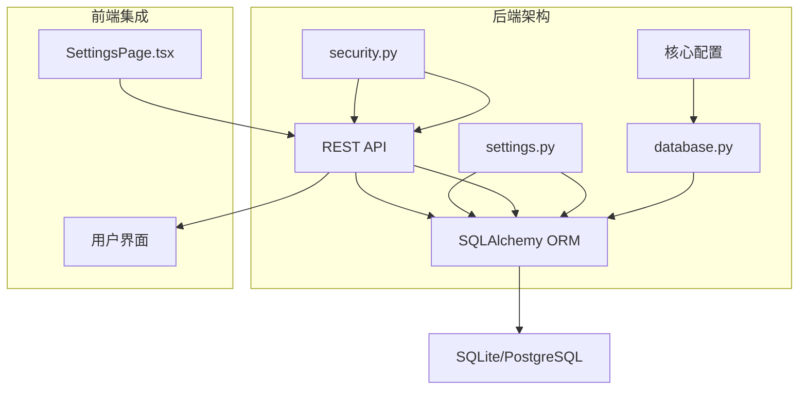
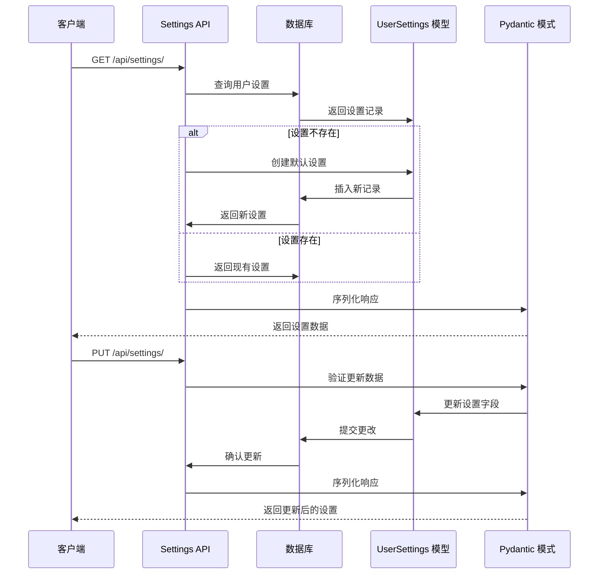
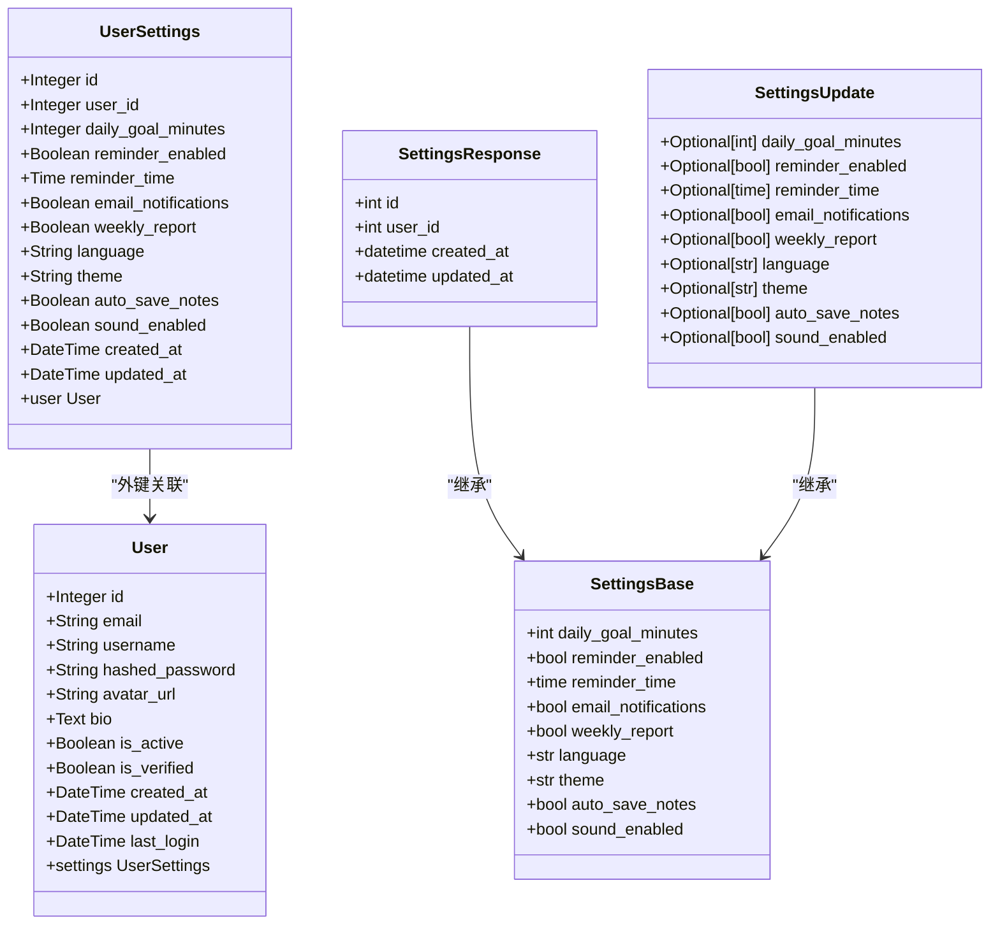
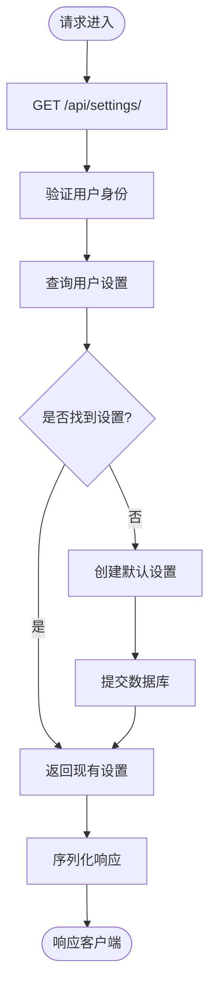
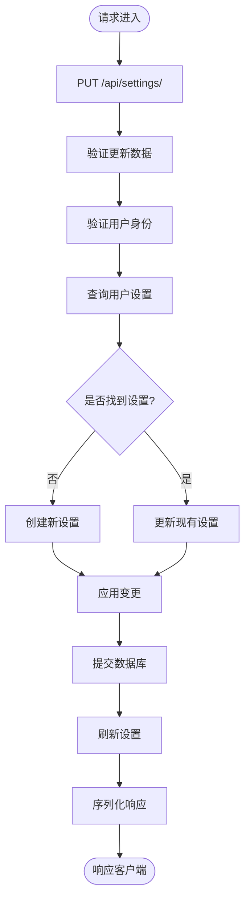
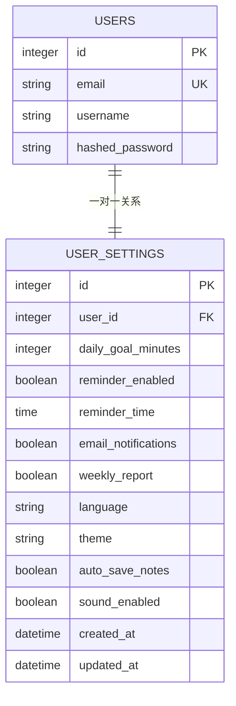
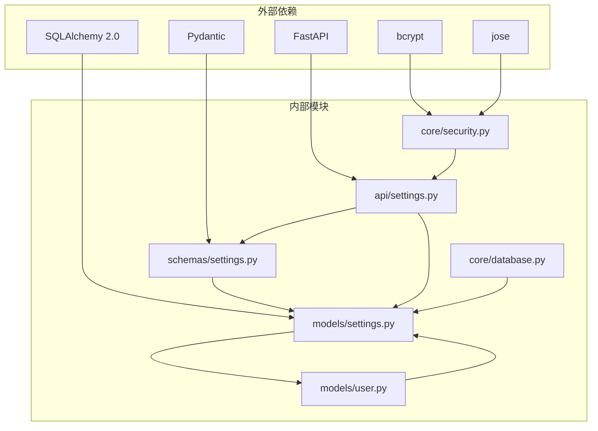
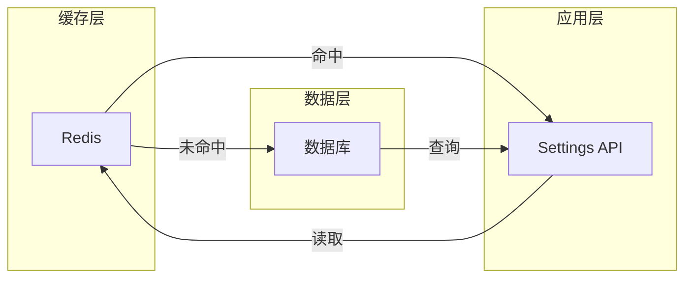

# 用户设置模型

<cite>
**本文档引用的文件**
- [backend/app/models/settings.py](file://backend/app/models/settings.py)
- [backend/app/schemas/settings.py](file://backend/app/schemas/settings.py)
- [backend/app/api/settings.py](file://backend/app/api/settings.py)
- [backend/app/models/user.py](file://backend/app/models/user.py)
- [backend/app/core/database.py](file://backend/app/core/database.py)
- [backend/app/core/security.py](file://backend/app/core/security.py)
- [backend/app/main.py](file://backend/app/main.py)
- [front/src/components/SettingsPage.tsx](file://front/src/components/SettingsPage.tsx)
- [PROJECT_OVERVIEW.md](file://PROJECT_OVERVIEW.md)
</cite>

## 目录
1. [简介](#简介)
2. [项目结构](#项目结构)
3. [核心组件](#核心组件)
4. [架构概览](#架构概览)
5. [详细组件分析](#详细组件分析)
6. [依赖关系分析](#依赖关系分析)
7. [性能考虑](#性能考虑)
8. [故障排除指南](#故障排除指南)
9. [结论](#结论)

## 简介

Quickly AI 学习平台的用户设置模型是整个系统的重要组成部分，负责管理用户的学习偏好、主题配置、通知设置和学习目标等核心配置。该模型采用现代的数据库设计原则，确保数据完整性、一致性和可扩展性。

本模型基于 SQLAlchemy ORM 构建，支持异步数据库操作，并通过 Pydantic 模式提供类型安全的 API 层。系统实现了自动化的设置初始化、灵活的更新机制和完善的验证规则。

## 项目结构

Quickly 项目采用分层架构设计，用户设置模型位于后端应用的核心位置：

**图表来源**
- [backend/app/models/settings.py:1-41](file://backend/app/models/settings.py#L1-L41)
- [backend/app/schemas/settings.py:1-50](file://backend/app/schemas/settings.py#L1-L50)
- [backend/app/api/settings.py:1-65](file://backend/app/api/settings.py#L1-L65)

**章节来源**
- [PROJECT_OVERVIEW.md:1-200](file://PROJECT_OVERVIEW.md#L1-L200)
- [backend/app/main.py:1-66](file://backend/app/main.py#L1-L66)

## 核心组件

### UserSettings 实体模型

UserSettings 是用户设置的核心数据模型，采用单表存储设计，确保设置数据的完整性和一致性。

#### 字段定义与数据类型

| 字段名称 | 数据类型 | 默认值 | 约束条件 | 描述 |
|---------|---------|--------|----------|------|
| id | Integer | - | 主键, 自增 | 设置记录唯一标识符 |
| user_id | Integer | - | 外键(users.id), 唯一, 非空 | 关联用户表的外键 |
| daily_goal_minutes | Integer | 30 | 默认值, 范围: 15-120 | 每日学习目标时长(分钟) |
| reminder_enabled | Boolean | True | 默认值 | 是否启用学习提醒 |
| reminder_time | Time | None | 可空 | 每日提醒时间 |
| email_notifications | Boolean | True | 默认值 | 是否启用邮件通知 |
| weekly_report | Boolean | True | 默认值 | 是否启用周报 |
| language | String(10) | "zh-CN" | 默认值, 枚举: zh-CN/en-US/ja-JP/ko-KR | 界面语言设置 |
| theme | String(10) | "dark" | 默认值, 枚举: dark/light | 界面主题设置 |
| auto_save_notes | Boolean | True | 默认值 | 是否自动保存笔记 |
| sound_enabled | Boolean | True | 默认值 | 是否启用音效 |
| created_at | DateTime | 当前时间 | 默认值 | 创建时间戳 |
| updated_at | DateTime | 当前时间 | 默认值, 更新时自动更新 | 最后更新时间戳 |

#### 关系映射

UserSettings 与 User 模型建立了一对一的关系，通过 user_id 外键字段实现关联。这种设计确保每个用户只能有一个设置记录，避免了重复设置的问题。

**章节来源**
- [backend/app/models/settings.py:11-41](file://backend/app/models/settings.py#L11-L41)

### 设置模式层

设置模式层采用 Pydantic 构建，提供类型安全的数据验证和序列化功能。

#### SettingsBase 基础模式

基础模式定义了所有设置项的标准格式，包含以下核心字段：

- **学习目标**: daily_goal_minutes (15-120 分钟，默认 30 分钟)
- **提醒设置**: reminder_enabled (布尔值), reminder_time (时间)
- **通知配置**: email_notifications (布尔值), weekly_report (布尔值)
- **界面设置**: language (枚举值), theme (枚举值)
- **高级功能**: auto_save_notes (布尔值), sound_enabled (布尔值)

#### SettingsUpdate 更新模式

更新模式允许部分字段更新，所有字段都是可选的，支持选择性更新用户设置。

#### SettingsResponse 响应模式

响应模式在基础模式基础上添加了标识符和时间戳信息，用于 API 响应。

**章节来源**
- [backend/app/schemas/settings.py:10-50](file://backend/app/schemas/settings.py#L10-L50)

## 架构概览

用户设置系统的整体架构采用分层设计，确保关注点分离和代码的可维护性。

**图表来源**
- [backend/app/api/settings.py:19-65](file://backend/app/api/settings.py#L19-L65)
- [backend/app/schemas/settings.py:23-50](file://backend/app/schemas/settings.py#L23-L50)

## 详细组件分析

### 数据模型类图

**图表来源**
- [backend/app/models/settings.py:11-41](file://backend/app/models/settings.py#L11-L41)
- [backend/app/models/user.py:11-39](file://backend/app/models/user.py#L11-L39)
- [backend/app/schemas/settings.py:10-50](file://backend/app/schemas/settings.py#L10-L50)

### API 路由流程

#### 获取设置流程

**图表来源**
- [backend/app/api/settings.py:19-38](file://backend/app/api/settings.py#L19-L38)

#### 更新设置流程

**图表来源**
- [backend/app/api/settings.py:40-65](file://backend/app/api/settings.py#L40-L65)

### 数据验证机制

系统实现了多层次的数据验证机制，确保数据的完整性和一致性：

#### 后端验证规则

1. **范围验证**: daily_goal_minutes 必须在 15-120 分钟范围内
2. **类型验证**: 所有字段都经过严格的类型检查
3. **约束验证**: user_id 必须唯一且非空
4. **枚举验证**: language 和 theme 字段必须是预定义的枚举值

#### 前端验证机制

前端设置了相应的输入限制：
- 学习目标: 仅允许 15、30、45、60、90、120 分钟的选择
- 时间输入: 使用 HTML5 time 输入控件
- 开关控制: 使用动画开关组件确保布尔值的有效性

**章节来源**
- [backend/app/schemas/settings.py:12-38](file://backend/app/schemas/settings.py#L12-L38)
- [front/src/components/SettingsPage.tsx:47-54](file://front/src/components/SettingsPage.tsx#L47-L54)

### 级联删除策略

用户设置模型采用了完善的级联删除策略，确保数据的一致性：

**图表来源**
- [backend/app/models/user.py:38](file://backend/app/models/user.py#L38)
- [backend/app/models/settings.py:16](file://backend/app/models/settings.py#L16)

#### 级联策略说明

1. **用户删除**: 当用户被删除时，相关的设置记录也会被自动删除
2. **设置删除**: 设置记录的删除不会影响用户记录
3. **数据一致性**: 通过外键约束确保引用完整性

**章节来源**
- [backend/app/models/user.py:38](file://backend/app/models/user.py#L38)
- [backend/app/models/settings.py:16](file://backend/app/models/settings.py#L16)

## 依赖关系分析

### 组件依赖图

**图表来源**
- [backend/app/models/settings.py:6](file://backend/app/models/settings.py#L6)
- [backend/app/schemas/settings.py:5](file://backend/app/schemas/settings.py#L5)
- [backend/app/api/settings.py:5](file://backend/app/api/settings.py#L5)

### 数据流分析

用户设置的数据流遵循标准的 MVC 模式：

1. **请求处理**: API 层接收并验证用户请求
2. **业务逻辑**: 模型层执行数据操作和业务规则
3. **数据持久化**: 数据库层负责数据的存储和检索
4. **响应生成**: 模式层提供类型安全的响应数据

**章节来源**
- [backend/app/api/settings.py:19-65](file://backend/app/api/settings.py#L19-L65)
- [backend/app/models/settings.py:11-41](file://backend/app/models/settings.py#L11-L41)

## 性能考虑

### 数据库优化

1. **索引设计**: user_id 字段建立了唯一索引，确保查询效率
2. **连接池**: 使用异步连接池提高并发处理能力
3. **事务管理**: 合理的事务边界减少锁竞争

### 缓存策略

虽然当前版本没有实现缓存，但系统设计支持后续添加缓存层：

### 异步处理

系统采用异步编程模型，提高了 I/O 密集型操作的性能：

- **数据库操作**: 使用 SQLAlchemy AsyncIO
- **API 调用**: 支持异步请求处理
- **资源管理**: 自动连接管理和生命周期控制

## 故障排除指南

### 常见问题及解决方案

#### 设置初始化失败

**问题**: 新用户无法获取默认设置
**原因**: 数据库连接问题或元数据创建失败
**解决方案**: 
1. 检查数据库连接字符串配置
2. 确认数据库服务正常运行
3. 验证用户表结构完整性

#### 数据验证错误

**问题**: 更新设置时报验证错误
**原因**: 提供的数据不符合验证规则
**解决方案**:
1. 检查数据类型和范围限制
2. 确认必填字段已提供
3. 验证枚举值的有效性

#### 权限验证失败

**问题**: API 调用返回 401 错误
**原因**: JWT 令牌无效或过期
**解决方案**:
1. 检查访问令牌格式
2. 验证令牌签名和有效期
3. 确认用户账户状态有效

**章节来源**
- [backend/app/api/settings.py:54-79](file://backend/app/core/security.py#L54-L79)
- [backend/app/schemas/settings.py:12-38](file://backend/app/schemas/settings.py#L12-L38)

### 调试技巧

1. **启用调试模式**: 设置 DEBUG=True 查看详细的错误信息
2. **检查数据库日志**: 监控 SQL 查询执行情况
3. **验证 API 请求**: 使用 Swagger UI 测试 API 端点
4. **监控性能指标**: 关注数据库连接池使用情况

## 结论

Quickly 用户设置模型展现了现代 Web 应用的最佳实践，通过精心设计的数据模型、严格的验证机制和完善的错误处理，为用户提供了一个稳定可靠的学习配置系统。

### 主要优势

1. **数据完整性**: 通过外键约束和唯一性约束确保数据一致性
2. **类型安全**: Pydantic 模式提供编译时类型检查
3. **扩展性**: 模块化设计支持功能的平滑扩展
4. **性能优化**: 异步处理和连接池提升系统性能
5. **用户体验**: 前后端协同提供直观的设置界面

### 未来改进方向

1. **缓存机制**: 添加 Redis 缓存提升高并发场景下的性能
2. **审计日志**: 记录设置变更历史便于追踪和回滚
3. **配置模板**: 支持预设配置模板满足不同用户群体需求
4. **批量操作**: 提供批量设置更新功能提升管理效率

该用户设置模型为 Quickly 平台提供了坚实的基础，支持平台的持续发展和功能扩展。