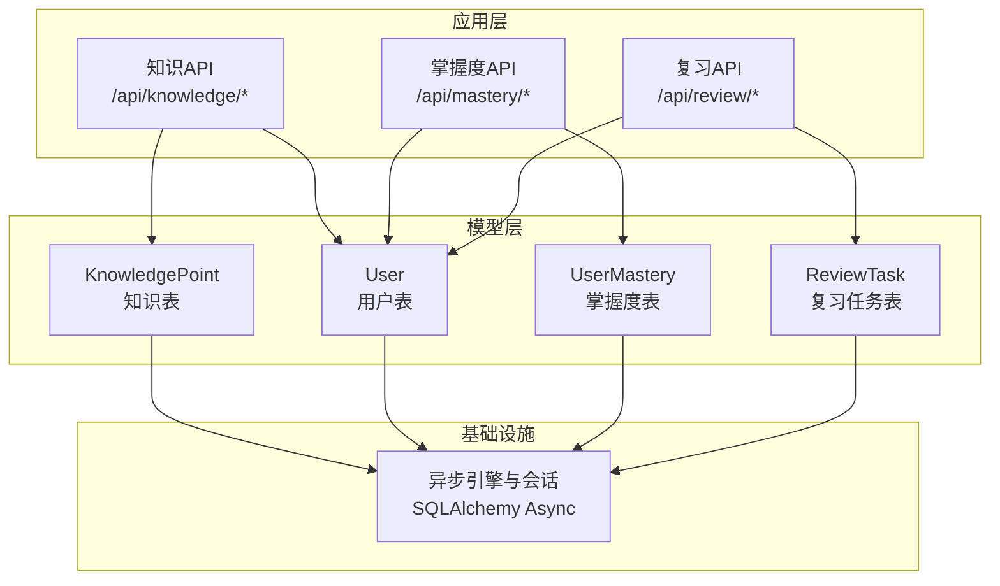
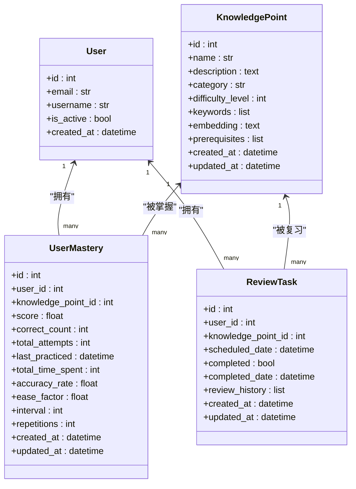
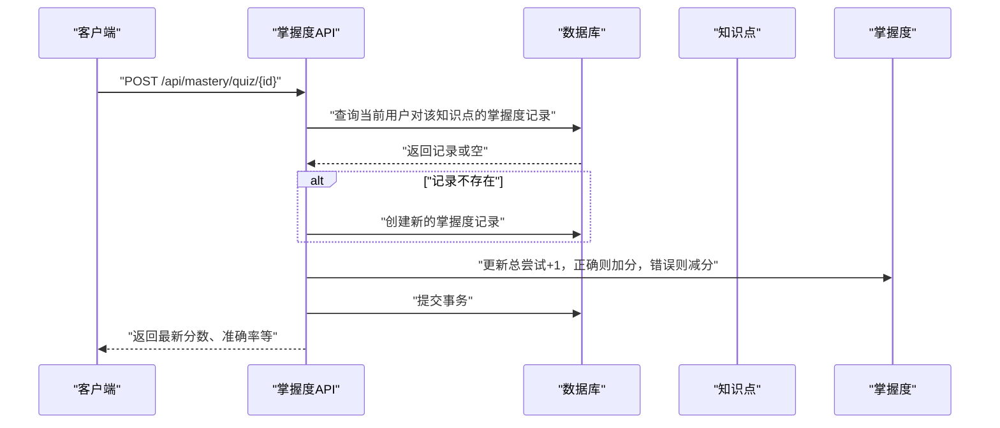
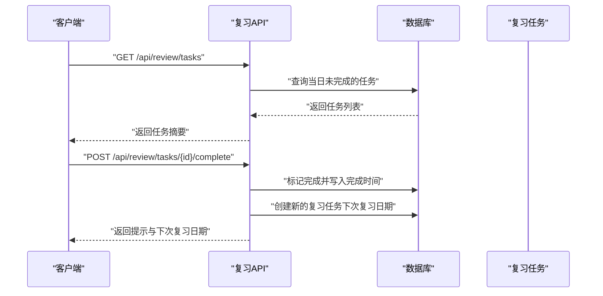
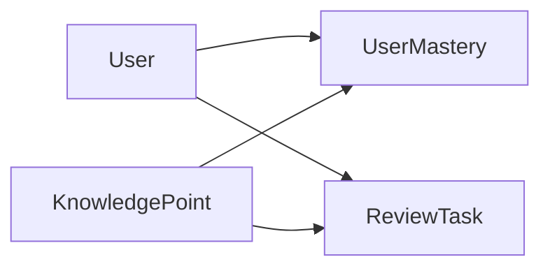
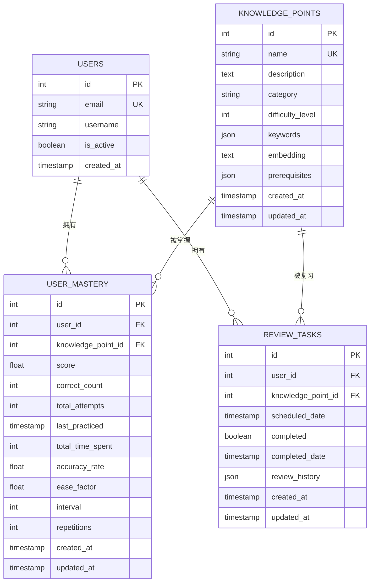

# 知识点模型

<cite>
**本文引用的文件**
- [knowledge.py（模型）](file://backend/app/models/knowledge.py)
- [knowledge.py（模式）](file://backend/app/schemas/knowledge.py)
- [knowledge.py（API）](file://backend/app/api/knowledge.py)
- [mastery.py（模型）](file://backend/app/models/mastery.py)
- [mastery.py（模式）](file://backend/app/schemas/mastery.py)
- [mastery.py（API）](file://backend/app/api/mastery.py)
- [review.py（模型）](file://backend/app/models/review.py)
- [review.py（API）](file://backend/app/api/review.py)
- [user.py（模型）](file://backend/app/models/user.py)
- [database.py](file://backend/app/core/database.py)
- [main.py](file://backend/app/main.py)
- [README.md](file://backend/README.md)
</cite>

## 目录
1. [简介](#简介)
2. [项目结构](#项目结构)
3. [核心组件](#核心组件)
4. [架构总览](#架构总览)
5. [详细组件分析](#详细组件分析)
6. [依赖分析](#依赖分析)
7. [性能考虑](#性能考虑)
8. [故障排查指南](#故障排查指南)
9. [结论](#结论)
10. [附录](#附录)

## 简介
本文件为 Quickly 平台的知识点模型数据模型文档，聚焦“知识点”实体的字段定义、分类与标签体系、关联关系管理，以及与用户掌握度、复习任务的映射。文档还涵盖数据示例格式、查询模式、索引策略、动态更新机制、内容聚合策略与性能优化方案，并给出数据验证规则与业务约束说明。

## 项目结构
后端采用 FastAPI + SQLAlchemy 异步 ORM 架构，数据库初始化在应用生命周期内自动完成。知识、掌握度与复习相关模块分别位于 models、schemas、api 三层目录中，通过依赖注入与路由组织对外提供接口。

图表来源
- [main.py:15-23](file://backend/app/main.py#L15-L23)
- [database.py:15-36](file://backend/app/core/database.py#L15-L36)
- [knowledge.py（API）:17-69](file://backend/app/api/knowledge.py#L17-L69)
- [mastery.py（API）:17-140](file://backend/app/api/mastery.py#L17-L140)
- [review.py（API）:18-91](file://backend/app/api/review.py#L18-L91)

章节来源
- [main.py:15-23](file://backend/app/main.py#L15-L23)
- [database.py:15-36](file://backend/app/core/database.py#L15-L36)
- [README.md:41-66](file://backend/README.md#L41-L66)

## 核心组件
本节从数据模型、模式校验、API 行为三个维度梳理“知识点”相关的核心组件。

- 知识点模型（KnowledgePoint）
  - 字段：主键、名称（唯一）、描述、类别、难度等级、关键词数组、向量嵌入、先修 ID 列表、时间戳
  - 关系：与用户掌握度、复习任务通过外键关联
- 知识点模式（Pydantic）
  - 基础、创建、响应模式，含长度与范围约束
- 知识点 API
  - 查询全部/按类别过滤、按 ID 查询、创建（管理员在生产中限制）
- 掌握度模型（UserMastery）
  - 用户对知识点的掌握分数、答题统计、SM-2 复习参数、时间追踪
- 复习任务模型（ReviewTask）
  - 用户的复习计划、到期日、完成状态、历史记录
- 用户模型（User）
  - 用户基础信息与上述关系反向绑定

章节来源
- [knowledge.py（模型）:10-32](file://backend/app/models/knowledge.py#L10-L32)
- [knowledge.py（模式）:10-35](file://backend/app/schemas/knowledge.py#L10-L35)
- [knowledge.py（API）:20-69](file://backend/app/api/knowledge.py#L20-L69)
- [mastery.py（模型）:11-44](file://backend/app/models/mastery.py#L11-L44)
- [mastery.py（模式）:10-53](file://backend/app/schemas/mastery.py#L10-L53)
- [mastery.py（API）:20-140](file://backend/app/api/mastery.py#L20-L140)
- [review.py（模型）:11-35](file://backend/app/models/review.py#L11-L35)
- [review.py（API）:21-91](file://backend/app/api/review.py#L21-L91)
- [user.py:11-39](file://backend/app/models/user.py#L11-L39)

## 架构总览
下图展示知识点模型在系统中的位置与关键交互：

图表来源
- [user.py:11-39](file://backend/app/models/user.py#L11-L39)
- [knowledge.py（模型）:10-32](file://backend/app/models/knowledge.py#L10-L32)
- [mastery.py（模型）:11-44](file://backend/app/models/mastery.py#L11-L44)
- [review.py（模型）:11-35](file://backend/app/models/review.py#L11-L35)

## 详细组件分析

### 知识点实体（KnowledgePoint）数据模型
- 字段定义与约束
  - 主键与索引：自增整数主键，具备数据库索引
  - 名称：字符串，最大长度限制，唯一性约束
  - 描述：文本字段，可空
  - 类别：字符串，用于分组（如“机器学习”、“深度学习”）
  - 难度等级：整数，默认值，范围约束（1-5）
  - 关键词：JSON 数组，用于检索
  - 向量嵌入：文本字段，支持相似度搜索
  - 先修 ID：JSON 数组，存储前置知识点 ID 列表
  - 时间戳：创建与更新时间，自动维护
- 关联关系
  - 与 UserMastery：一对多（一个知识点可被多个用户的掌握度记录引用）
  - 与 ReviewTask：一对多（一个知识点可对应多个复习任务）
- 数据示例格式
  - 基本结构：包含 id、name、description、category、difficulty_level、keywords、prerequisites、created_at、updated_at
  - 示例字段取值：name 为非空字符串；keywords 为字符串数组；prerequisites 为整型数组；difficulty_level 在 1..5 范围内
- 查询模式
  - 按 ID 查询：精确匹配
  - 全量查询：可选按类别过滤
- 索引策略建议
  - 对 name（唯一）、category、difficulty_level 建立索引以提升查询效率
  - 对 keywords 使用 GIN/BTree 索引以支持 JSON 检索（视数据库方言而定）

章节来源
- [knowledge.py（模型）:10-32](file://backend/app/models/knowledge.py#L10-L32)
- [knowledge.py（模式）:10-35](file://backend/app/schemas/knowledge.py#L10-L35)
- [knowledge.py（API）:20-69](file://backend/app/api/knowledge.py#L20-L69)

### 知识点分类体系与标签系统
- 分类体系
  - 通过 category 字段进行粗粒度分类（如“机器学习”、“深度学习”、“数学基础”等）
  - 可结合前端或外部工具进行二级/三级分类映射
- 标签系统
  - keywords 字段为字符串数组，支持多关键词检索
  - 支持基于关键词的模糊匹配与精确匹配查询
- 关联关系管理
  - prerequisites 字段保存前置知识点 ID 列表，用于构建知识点依赖图
  - 可用于路径规划、学习顺序推荐与进度检查

章节来源
- [knowledge.py（模型）:16-28](file://backend/app/models/knowledge.py#L16-L28)
- [knowledge.py（模式）:17-22](file://backend/app/schemas/knowledge.py#L17-L22)

### 知识点与用户掌握度的关联映射
- 映射关系
  - UserMastery.knowledge_point_id 指向 KnowledgePoint.id
  - 一个知识点可对应多个用户的掌握度记录
- 掌握度指标
  - 分数：0-100 的浮点数
  - 答题统计：正确次数、总尝试次数、准确率
  - 时间追踪：最近练习时间、总耗时（分钟）
  - 复习参数：SM-2 算法相关字段（简化实现）
- API 行为
  - 提交测验结果时，若无记录则创建新记录；否则更新现有记录
  - 提供掌握度概览接口，按类别聚合平均分

图表来源
- [mastery.py（API）:94-140](file://backend/app/api/mastery.py#L94-L140)
- [mastery.py（模型）:11-44](file://backend/app/models/mastery.py#L11-L44)

章节来源
- [mastery.py（模型）:11-44](file://backend/app/models/mastery.py#L11-L44)
- [mastery.py（模式）:16-44](file://backend/app/schemas/mastery.py#L16-L44)
- [mastery.py（API）:20-140](file://backend/app/api/mastery.py#L20-L140)

### 知识点与复习任务的关联映射
- 映射关系
  - ReviewTask.knowledge_point_id 指向 KnowledgePoint.id
  - 一个知识点可对应多个复习任务（不同用户、不同到期日）
- 复习调度
  - 通过 scheduled_date 控制到期日
  - completed 标记完成状态
  - review_history 记录历史复习结果
- API 行为
  - 查询当日未完成的复习任务
  - 完成任务后生成下一次复习任务（简化 SM-2）

图表来源
- [review.py（API）:21-91](file://backend/app/api/review.py#L21-L91)
- [review.py（模型）:11-35](file://backend/app/models/review.py#L11-L35)

章节来源
- [review.py（模型）:11-35](file://backend/app/models/review.py#L11-L35)
- [review.py（API）:21-91](file://backend/app/api/review.py#L21-L91)

### 动态更新机制与内容聚合策略
- 动态更新
  - 知识点：创建时由管理员负责；运行期可通过 API 更新描述、类别、难度、关键词与先修关系
  - 掌握度：实时更新分数与统计；SM-2 参数在复习完成后调整
  - 复习任务：完成即生成下一次任务，形成闭环
- 内容聚合
  - 掌握度概览：按类别聚合平均分，便于用户了解薄弱环节
  - 复习任务：按日期与完成状态聚合，支持每日提醒
- 性能优化
  - 使用异步会话与连接池
  - 为高频查询字段建立索引
  - 将向量嵌入与关键词检索分离到专用索引或搜索引擎（建议）

章节来源
- [mastery.py（API）:20-61](file://backend/app/api/mastery.py#L20-L61)
- [review.py（API）:21-91](file://backend/app/api/review.py#L21-L91)
- [database.py:15-36](file://backend/app/core/database.py#L15-L36)

## 依赖分析
- 组件耦合
  - KnowledgePoint 与 UserMastery、ReviewTask 通过外键耦合，形成“知识点-用户-任务”的核心闭环
  - User 作为上游主体，承载笔记、对话、掌握度与复习任务的关系
- 外部依赖
  - 数据库：SQLAlchemy 异步引擎与会话管理
  - 应用：FastAPI 路由与依赖注入
- 循环依赖
  - 当前模型未见循环导入；关系通过外键单向指向

图表来源
- [user.py:33-39](file://backend/app/models/user.py#L33-L39)
- [mastery.py（模型）:42-44](file://backend/app/models/mastery.py#L42-L44)
- [review.py（模型）:33-35](file://backend/app/models/review.py#L33-L35)
- [knowledge.py（模型）:26-28](file://backend/app/models/knowledge.py#L26-L28)

章节来源
- [user.py:33-39](file://backend/app/models/user.py#L33-L39)
- [mastery.py（模型）:42-44](file://backend/app/models/mastery.py#L42-L44)
- [review.py（模型）:33-35](file://backend/app/models/review.py#L33-L35)
- [knowledge.py（模型）:26-28](file://backend/app/models/knowledge.py#L26-L28)

## 性能考虑
- 数据库层
  - 为 name（唯一）、category、difficulty_level 建立索引
  - keywords 使用适合 JSON 的索引类型（如 PostgreSQL 的 GIN）
  - embedding 字段可配合向量扩展（如 pgvector）建立索引
- 会话与连接
  - 使用异步会话与连接池，避免阻塞
  - SQLite 场景禁用连接池参数，其他数据库启用池化
- 查询优化
  - 精确 ID 查询优先
  - 类别过滤与分页结合
  - 掌握度概览与复习任务应缓存热点数据
- 缓存与队列
  - 推荐引入 Redis 缓存热门知识点与用户掌握度
  - 复习任务调度可接入 Celery 异步队列

章节来源
- [database.py:15-36](file://backend/app/core/database.py#L15-L36)
- [README.md:67-75](file://backend/README.md#L67-L75)

## 故障排查指南
- 知识点不存在
  - 现象：按 ID 查询返回 404
  - 处理：确认 ID 是否正确，或检查是否已创建
- 掌握度记录缺失
  - 现象：提交测验时报记录不存在
  - 处理：首次测验会自动创建记录；若失败，检查用户上下文与事务提交
- 复习任务异常
  - 现象：无法完成任务或未生成下一次任务
  - 处理：确认任务属于当前用户且未完成；检查时间计算逻辑
- 数据一致性
  - 现象：分数与统计不一致
  - 处理：核对测验提交流程与事务提交顺序

章节来源
- [knowledge.py（API）:40-47](file://backend/app/api/knowledge.py#L40-L47)
- [mastery.py（API）:88-91](file://backend/app/api/mastery.py#L88-L91)
- [review.py（API）:64-66](file://backend/app/api/review.py#L64-L66)

## 结论
本数据模型围绕“知识点”为核心，通过“掌握度”与“复习任务”两条主线实现学习闭环。模型具备清晰的字段定义、严格的模式校验与完善的 API 行为，满足日常学习场景下的查询、更新与调度需求。建议在生产环境中进一步完善索引、缓存与向量检索能力，并在权限层面强化知识点创建的管理员控制。

## 附录

### 数据模型 ER 图

图表来源
- [user.py:11-39](file://backend/app/models/user.py#L11-L39)
- [knowledge.py（模型）:10-32](file://backend/app/models/knowledge.py#L10-L32)
- [mastery.py（模型）:11-44](file://backend/app/models/mastery.py#L11-L44)
- [review.py（模型）:11-35](file://backend/app/models/review.py#L11-L35)

### 查询与索引建议
- 查询建议
  - 按 ID：直接主键查询
  - 按类别：带索引的 category 过滤
  - 按关键词：使用 JSON 索引或全文检索
- 索引建议
  - name（唯一）
  - category
  - difficulty_level
  - keywords（GIN/BTree）
  - embedding（向量索引，如可用）

章节来源
- [knowledge.py（API）:20-31](file://backend/app/api/knowledge.py#L20-L31)
- [knowledge.py（模型）:16-24](file://backend/app/models/knowledge.py#L16-L24)