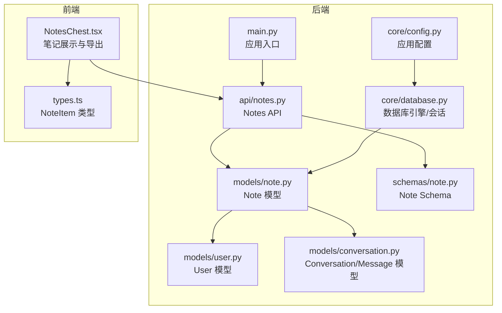
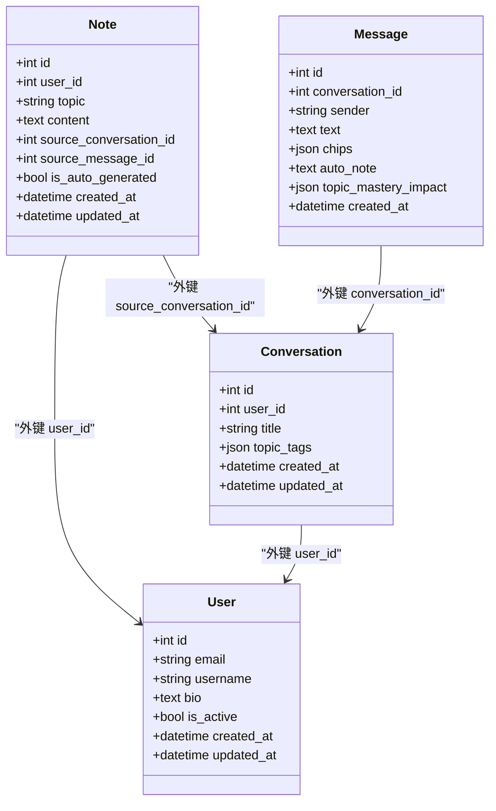
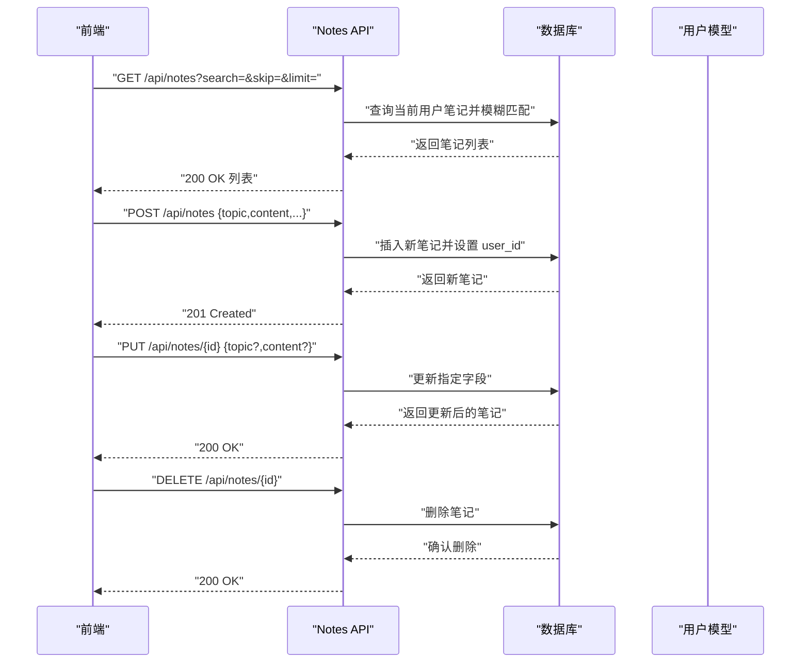
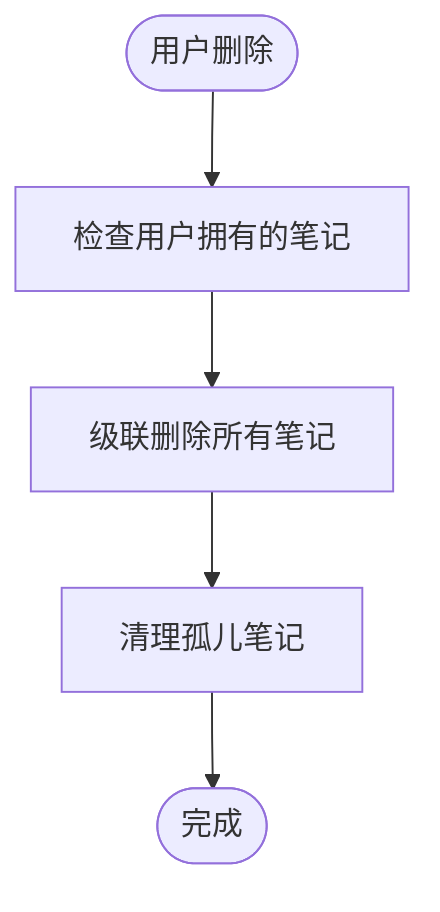
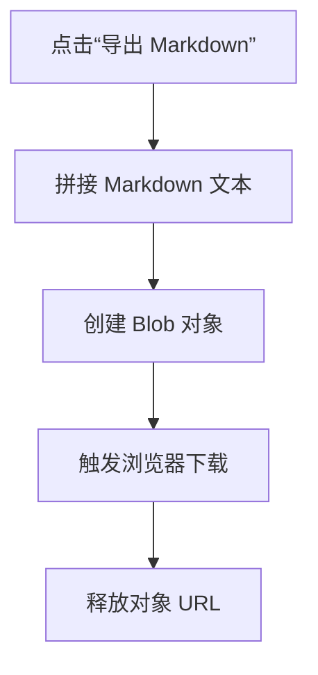
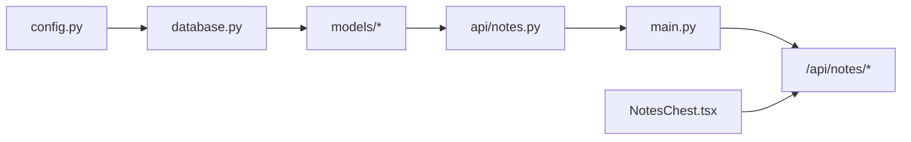

# 笔记模型

<cite>
**本文引用的文件**
- [backend/app/models/note.py](file://backend/app/models/note.py)
- [backend/app/schemas/note.py](file://backend/app/schemas/note.py)
- [backend/app/api/notes.py](file://backend/app/api/notes.py)
- [backend/app/models/user.py](file://backend/app/models/user.py)
- [backend/app/models/conversation.py](file://backend/app/models/conversation.py)
- [backend/app/schemas/conversation.py](file://backend/app/schemas/conversation.py)
- [backend/app/core/database.py](file://backend/app/core/database.py)
- [backend/app/core/config.py](file://backend/app/core/config.py)
- [backend/app/main.py](file://backend/app/main.py)
- [front/src/components/NotesChest.tsx](file://front/src/components/NotesChest.tsx)
- [front/src/types.ts](file://front/src/types.ts)
</cite>

## 目录
1. [简介](#简介)
2. [项目结构](#项目结构)
3. [核心组件](#核心组件)
4. [架构总览](#架构总览)
5. [详细组件分析](#详细组件分析)
6. [依赖分析](#依赖分析)
7. [性能考虑](#性能考虑)
8. [故障排查指南](#故障排查指南)
9. [结论](#结论)
10. [附录](#附录)

## 简介
本文件为 QuickLy 笔记模型的详细数据模型文档，聚焦后端 SQLAlchemy 模型、Pydantic Schema、API 路由以及前端导出能力，系统性说明笔记实体的字段定义、与用户的关联关系、搜索与分页机制、Markdown 导出流程、内容存储与验证规则，并给出查询模式与性能优化建议。文档同时涵盖与对话模型的来源关联，帮助读者理解从聊天到笔记的完整数据流。

## 项目结构
QuickLy 后端采用 FastAPI + SQLAlchemy 异步 ORM 的架构，笔记模型位于 models 层，配合 schemas 进行请求/响应校验，API 路由提供 CRUD 与搜索接口；前端 NotesChest 组件负责展示与导出 Markdown。

图表来源
- [backend/app/models/note.py:11-35](file://backend/app/models/note.py#L11-L35)
- [backend/app/schemas/note.py:10-39](file://backend/app/schemas/note.py#L10-L39)
- [backend/app/api/notes.py:17-133](file://backend/app/api/notes.py#L17-L133)
- [backend/app/models/user.py:11-39](file://backend/app/models/user.py#L11-L39)
- [backend/app/models/conversation.py:11-54](file://backend/app/models/conversation.py#L11-L54)
- [backend/app/core/database.py:15-46](file://backend/app/core/database.py#L15-L46)
- [backend/app/core/config.py:10-45](file://backend/app/core/config.py#L10-L45)
- [backend/app/main.py:15-66](file://backend/app/main.py#L15-L66)
- [front/src/components/NotesChest.tsx:1-163](file://front/src/components/NotesChest.tsx#L1-L163)
- [front/src/types.ts:16-21](file://front/src/types.ts#L16-L21)

章节来源
- [backend/app/main.py:15-66](file://backend/app/main.py#L15-L66)
- [backend/app/core/database.py:15-46](file://backend/app/core/database.py#L15-L46)
- [backend/app/core/config.py:10-45](file://backend/app/core/config.py#L10-L45)

## 核心组件
- Note 模型：定义笔记的主键、用户外键、标题与内容、来源对话与消息、自动生成标记、时间戳以及与 User 的关系。
- Note Schema：定义创建、更新、响应的 Pydantic 模型，含字段长度与可空性约束。
- Notes API：提供分页、搜索、CRUD 接口，按用户隔离数据。
- User 模型：定义用户与笔记的多对一关系，含级联删除策略。
- Conversation/Message 模型：定义对话与消息，Note 可通过 source_conversation_id 与 source_message_id 关联来源。
- 前端导出：NotesChest 组件将笔记列表导出为 Markdown 文件。

章节来源
- [backend/app/models/note.py:11-35](file://backend/app/models/note.py#L11-L35)
- [backend/app/schemas/note.py:10-39](file://backend/app/schemas/note.py#L10-L39)
- [backend/app/api/notes.py:17-133](file://backend/app/api/notes.py#L17-L133)
- [backend/app/models/user.py:11-39](file://backend/app/models/user.py#L11-L39)
- [backend/app/models/conversation.py:11-54](file://backend/app/models/conversation.py#L11-L54)
- [front/src/components/NotesChest.tsx:34-50](file://front/src/components/NotesChest.tsx#L34-L50)

## 架构总览
下图展示了笔记模型在系统中的位置与交互关系，包括与用户、对话、数据库引擎、API 路由的关系。

图表来源
- [backend/app/models/note.py:11-35](file://backend/app/models/note.py#L11-L35)
- [backend/app/models/user.py:11-39](file://backend/app/models/user.py#L11-L39)
- [backend/app/models/conversation.py:11-54](file://backend/app/models/conversation.py#L11-L54)

## 详细组件分析

### Note 数据模型
- 字段定义
  - 主键与索引：整型主键，启用索引。
  - 用户关联：外键指向 users.id，非空。
  - 内容：标题（字符串，最大长度 200）、正文（文本）。
  - 来源元数据：source_conversation_id 外键指向 conversations.id，source_message_id 整型。
  - 状态：is_auto_generated 布尔，默认 true。
  - 时间戳：created_at 默认当前 UTC 时间，updated_at 更新时自动刷新。
- 关系：与 User 的 back_populates 关系，用于反向访问用户的所有笔记。
- 存储：使用 SQLAlchemy Text 列存储大文本内容，适配 Markdown/富文本。

章节来源
- [backend/app/models/note.py:11-35](file://backend/app/models/note.py#L11-L35)

### Note Schema（Pydantic）
- NoteBase：topic 最大长度 200，content 必填。
- NoteCreate：创建时允许指定 source_conversation_id、source_message_id、is_auto_generated。
- NoteUpdate：topic 可选且最大长度 200，content 可选。
- NoteResponse：返回 id、user_id、来源信息、状态与时间戳，from_attributes 支持 ORM 对象转换。

章节来源
- [backend/app/schemas/note.py:10-39](file://backend/app/schemas/note.py#L10-L39)

### Notes API 路由
- GET /api/notes
  - 查询参数：search（模糊匹配 topic 或 content）、skip（≥0）、limit（1-100）。
  - 返回当前用户笔记列表，按更新时间倒序分页。
- GET /api/notes/{note_id}
  - 获取单条笔记，严格按 user_id 验证归属。
- POST /api/notes
  - 创建笔记，填充 user_id、topic、content、来源与自动生成标记。
- PUT /api/notes/{note_id}
  - 更新 topic/content，未提供的字段保持不变。
- DELETE /api/notes/{note_id}
  - 删除笔记并返回成功消息。

图表来源
- [backend/app/api/notes.py:20-133](file://backend/app/api/notes.py#L20-L133)

章节来源
- [backend/app/api/notes.py:20-133](file://backend/app/api/notes.py#L20-L133)

### 用户与笔记的关联关系与级联删除
- User 模型中定义了与 Note 的关系，并配置了 cascade="all, delete-orphan"，确保：
  - 删除用户时，其所有笔记被级联删除；
  - 若笔记不再属于任何用户，将被视为孤立对象并被清理。
- Note 与 Conversation 的来源关联：
  - Note 的 source_conversation_id 外键指向 conversations.id；
  - Note 的 source_message_id 用于记录来源消息 ID（便于溯源）。

图表来源
- [backend/app/models/user.py:34](file://backend/app/models/user.py#L34)
- [backend/app/models/note.py:23](file://backend/app/models/note.py#L23)

章节来源
- [backend/app/models/user.py:34](file://backend/app/models/user.py#L34)
- [backend/app/models/note.py:23](file://backend/app/models/note.py#L23)

### 搜索索引与分类标签系统
- 搜索索引
  - 后端：提供基于 topic 与 content 的模糊搜索（ilike），支持分页与排序。
  - 前端：本地过滤（topic/content 包含匹配），提升交互体验。
- 分类标签系统
  - 当前笔记模型未直接定义标签字段；对话模型包含 topic_tags（JSON 数组），可用于后续扩展笔记标签体系。
  - 建议：可在 Note 模型新增 tags JSON 字段，结合前端 Chips/标签 UI 实现标签管理。

章节来源
- [backend/app/api/notes.py:20-42](file://backend/app/api/notes.py#L20-L42)
- [front/src/components/NotesChest.tsx:18-22](file://front/src/components/NotesChest.tsx#L18-L22)
- [backend/app/models/conversation.py:22](file://backend/app/models/conversation.py#L22)

### 导出功能实现细节
- 前端导出
  - NotesChest 组件将笔记列表拼接为 Markdown 格式（标题、时间戳、内容分隔线），生成 Blob 并触发下载。
  - 导出文件名包含日期，便于归档。
- 后端导出
  - 当前后端未提供直接的导出接口；如需服务端导出，可在 API 中增加导出路由，复用现有笔记查询与序列化逻辑。

图表来源
- [front/src/components/NotesChest.tsx:34-50](file://front/src/components/NotesChest.tsx#L34-L50)

章节来源
- [front/src/components/NotesChest.tsx:34-50](file://front/src/components/NotesChest.tsx#L34-L50)

### 内容存储机制与富文本/Markdown 支持
- 存储方式
  - Note.content 使用 Text 列，适合存储长文本；前端以 monospace 字体渲染，便于保留格式。
- Markdown 支持
  - 前端 NotesChest 将笔记内容原样输出，未进行额外解析；若需要富文本渲染，可在前端引入 Markdown 解析器并在展示区域渲染。
  - 后端未对内容做特殊转义或安全过滤，建议在写入前进行输入校验与最小化 HTML 白名单处理（如启用富文本编辑器时）。

章节来源
- [backend/app/models/note.py:20](file://backend/app/models/note.py#L20)
- [front/src/components/NotesChest.tsx:135-138](file://front/src/components/NotesChest.tsx#L135-L138)

### 笔记数据示例格式与查询模式
- 示例格式（NoteResponse）
  - 字段：id、user_id、topic、content、source_conversation_id、is_auto_generated、created_at、updated_at。
- 查询模式
  - 分页：skip、limit（1-100）。
  - 搜索：topic 或 content 模糊匹配。
  - 排序：按 updated_at 倒序。
- 前端示例（NoteItem）
  - 字段：id、topic、content、timestamp。

章节来源
- [backend/app/schemas/note.py:29-39](file://backend/app/schemas/note.py#L29-L39)
- [backend/app/api/notes.py:20-42](file://backend/app/api/notes.py#L20-L42)
- [front/src/types.ts:16-21](file://front/src/types.ts#L16-L21)

### 验证规则、大小限制与业务逻辑约束
- 验证规则
  - topic 最大长度 200；content 必填。
  - NoteCreate 默认 is_auto_generated=true；可显式覆盖。
- 大小限制
  - topic 长度限制；content 使用 Text，理论上受数据库限制。
- 业务逻辑约束
  - 所有读写操作均按 user_id 进行用户隔离，防止越权访问。
  - 删除操作严格校验归属，不存在则返回 404。

章节来源
- [backend/app/schemas/note.py:12-13](file://backend/app/schemas/note.py#L12-L13)
- [backend/app/schemas/note.py:16-21](file://backend/app/schemas/note.py#L16-L21)
- [backend/app/api/notes.py:46-61](file://backend/app/api/notes.py#L46-L61)
- [backend/app/api/notes.py:113-132](file://backend/app/api/notes.py#L113-L132)

## 依赖分析
- 数据库层
  - 异步引擎与会话：根据配置选择 SQLite/PostgreSQL，设置连接池参数与预检。
- 应用层
  - 注册路由：Notes API 路由挂载于 /api/notes。
  - 生命周期：启动时创建所有表，关闭时释放连接。
- 前端层
  - 类型定义：NoteItem 与后端 NoteResponse 字段一致，便于前后端契约稳定。

图表来源
- [backend/app/core/config.py:24](file://backend/app/core/config.py#L24)
- [backend/app/core/database.py:15-46](file://backend/app/core/database.py#L15-L46)
- [backend/app/main.py:45](file://backend/app/main.py#L45)

章节来源
- [backend/app/core/config.py:24](file://backend/app/core/config.py#L24)
- [backend/app/core/database.py:15-46](file://backend/app/core/database.py#L15-L46)
- [backend/app/main.py:45](file://backend/app/main.py#L45)

## 性能考虑
- 查询优化
  - 使用索引列（id、user_id、updated_at）进行过滤与排序。
  - 搜索使用 ilike，建议在高基数场景下考虑全文检索（如 PostgreSQL 全文搜索）。
- 分页与限流
  - limit 上限为 100，避免一次性返回过多数据。
- 连接池
  - 非 SQLite 场景启用连接池与预检，减少连接开销。
- 导出性能
  - 前端导出在浏览器端拼接，适合中小规模笔记；大规模导出建议服务端异步任务队列处理。

章节来源
- [backend/app/api/notes.py:24](file://backend/app/api/notes.py#L24)
- [backend/app/core/database.py:22-30](file://backend/app/core/database.py#L22-L30)

## 故障排查指南
- 404 未找到
  - 访问不存在的笔记或越权访问会返回 404。
- 跨域问题
  - 确认 CORS_ORIGINS 配置正确，允许前端域名。
- 数据库连接失败
  - 检查 DATABASE_URL 与连接池参数；SQLite 无需池参数。
- 导出为空
  - 确认笔记列表非空；前端导出按钮禁用状态需检查数据加载。

章节来源
- [backend/app/api/notes.py:59](file://backend/app/api/notes.py#L59)
- [backend/app/core/config.py:30](file://backend/app/core/config.py#L30)
- [backend/app/core/database.py:16-30](file://backend/app/core/database.py#L16-L30)
- [front/src/components/NotesChest.tsx:70](file://front/src/components/NotesChest.tsx#L70)

## 结论
QuickLy 的笔记模型以简洁清晰的方式实现了用户隔离、来源追踪与基本搜索能力。通过与对话模型的关联，笔记具备了从聊天自动抽取的能力。前端提供了便捷的 Markdown 导出体验。建议后续增强标签系统、全文检索与富文本安全处理，以进一步提升可用性与安全性。

## 附录
- 数据库初始化
  - 应用启动时自动创建所有表。
- 配置项
  - DATABASE_URL、CORS_ORIGINS、GEMINI_API_KEY 等影响运行行为。

章节来源
- [backend/app/main.py:19-20](file://backend/app/main.py#L19-L20)
- [backend/app/core/config.py:24](file://backend/app/core/config.py#L24)