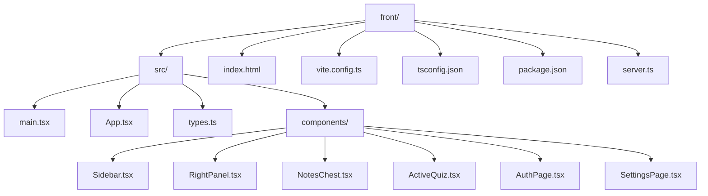
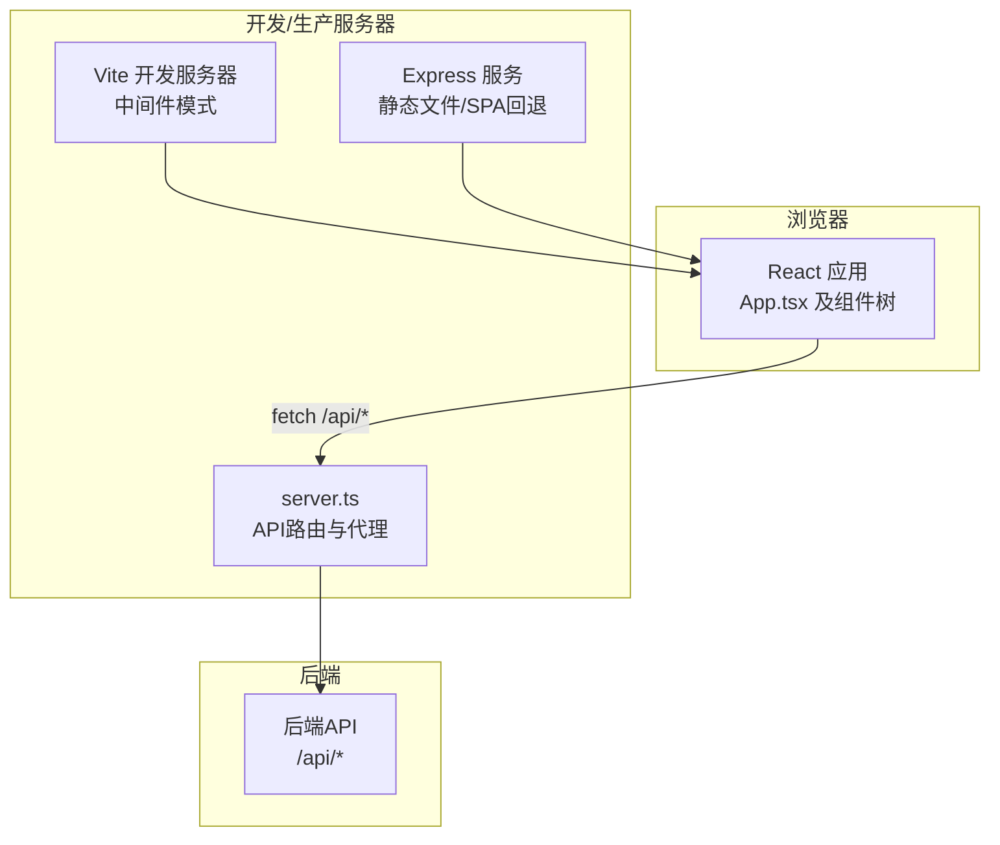
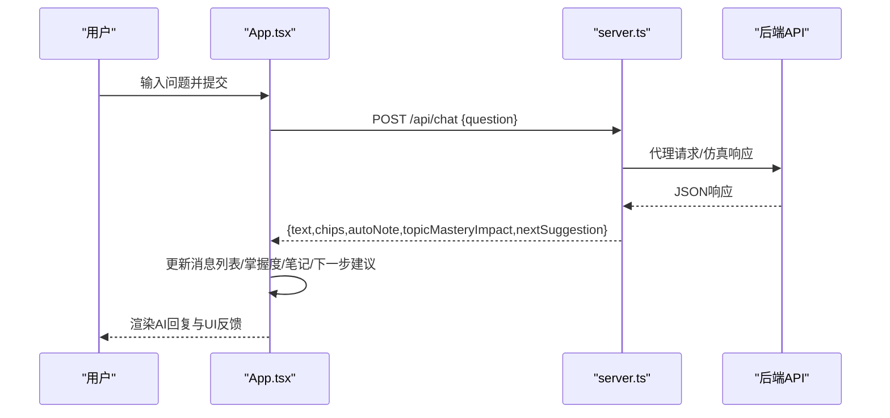
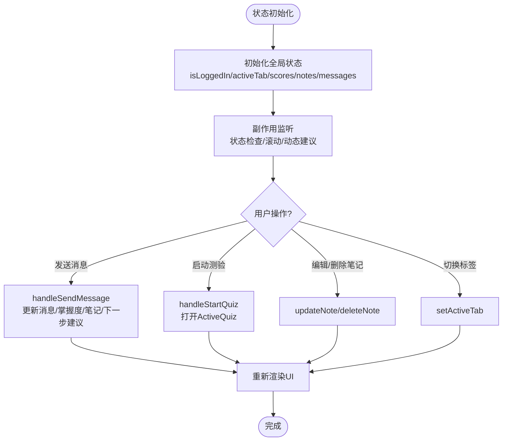
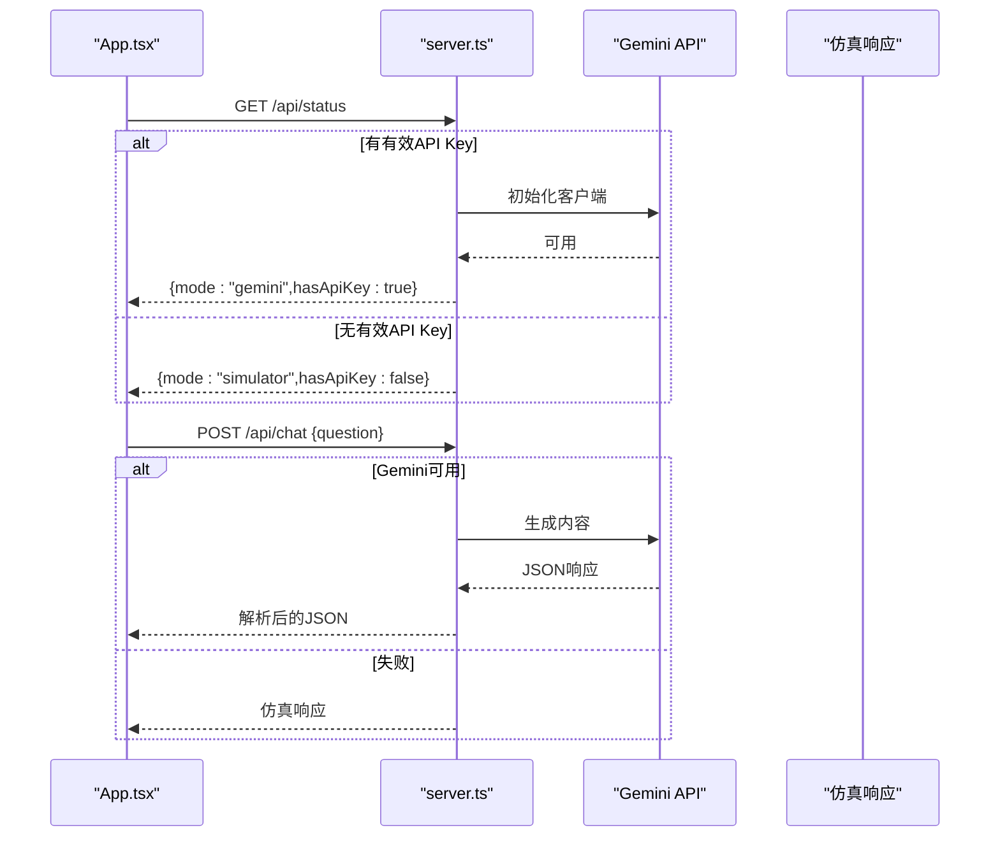
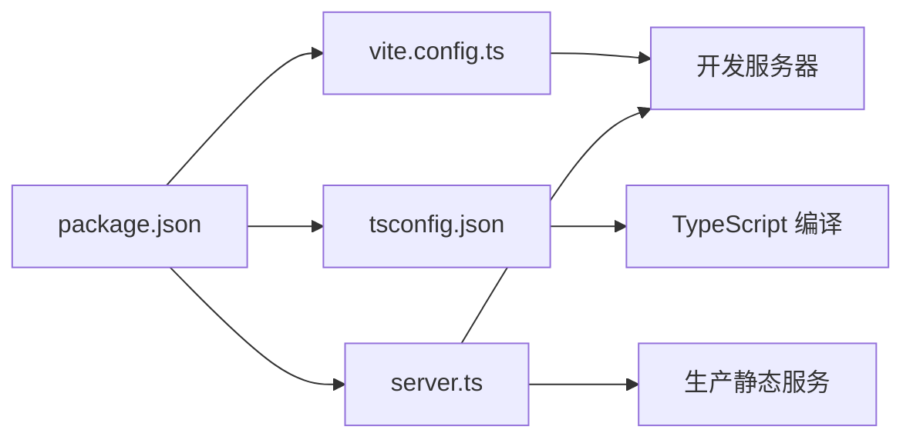

# 前端架构设计

<cite>
**本文档引用的文件**
- [main.tsx](file://front/src/main.tsx)
- [App.tsx](file://front/src/App.tsx)
- [vite.config.ts](file://front/vite.config.ts)
- [tsconfig.json](file://front/tsconfig.json)
- [package.json](file://front/package.json)
- [types.ts](file://front/src/types.ts)
- [Sidebar.tsx](file://front/src/components/Sidebar.tsx)
- [RightPanel.tsx](file://front/src/components/RightPanel.tsx)
- [NotesChest.tsx](file://front/src/components/NotesChest.tsx)
- [ActiveQuiz.tsx](file://front/src/components/ActiveQuiz.tsx)
- [AuthPage.tsx](file://front/src/components/AuthPage.tsx)
- [SettingsPage.tsx](file://front/src/components/SettingsPage.tsx)
- [index.html](file://front/index.html)
- [server.ts](file://front/server.ts)
</cite>

## 目录
1. [引言](#引言)
2. [项目结构](#项目结构)
3. [核心组件](#核心组件)
4. [架构总览](#架构总览)
5. [详细组件分析](#详细组件分析)
6. [依赖关系分析](#依赖关系分析)
7. [性能考虑](#性能考虑)
8. [故障排除指南](#故障排除指南)
9. [结论](#结论)

## 引言
本文件为Quickly项目的前端架构设计文档，聚焦于React应用的整体架构模式、组件化设计原则、状态管理模式、类型系统设计，以及Vite构建工具的配置与优化策略。同时涵盖TypeScript类型系统的应用、组件层次结构设计、前端与后端的通信架构、性能优化策略与代码分割实现等关键主题。文档旨在帮助开发者快速理解并高效扩展该前端系统。

## 项目结构
Quickly前端采用基于功能模块的目录组织方式，核心入口位于src目录，静态资源与构建产物分离，开发与生产环境通过Vite与Express服务协同提供。



**图表来源**
- [main.tsx:1-11](file://front/src/main.tsx#L1-L11)
- [App.tsx:1-50](file://front/src/App.tsx#L1-L50)
- [vite.config.ts:1-23](file://front/vite.config.ts#L1-L23)
- [tsconfig.json:1-27](file://front/tsconfig.json#L1-L27)
- [package.json:1-36](file://front/package.json#L1-L36)
- [server.ts:1-402](file://front/server.ts#L1-L402)

**章节来源**
- [main.tsx:1-11](file://front/src/main.tsx#L1-L11)
- [index.html:1-14](file://front/index.html#L1-L14)
- [vite.config.ts:1-23](file://front/vite.config.ts#L1-L23)
- [tsconfig.json:1-27](file://front/tsconfig.json#L1-L27)
- [package.json:1-36](file://front/package.json#L1-L36)

## 核心组件
- 应用根组件App.tsx：负责全局状态管理、路由切换、聊天交互、笔记管理、掌握度统计与复习测验流程的协调。
- 组件层：Sidebar、RightPanel、NotesChest、ActiveQuiz、AuthPage、SettingsPage等，分别承担导航、侧栏信息展示、笔记管理、测验交互、认证与设置等功能。
- 类型系统：types.ts定义了消息、掌握度、笔记条目与测验题目等核心数据结构，确保前后端数据契约一致。

**章节来源**
- [App.tsx:1-300](file://front/src/App.tsx#L1-L300)
- [types.ts:1-29](file://front/src/types.ts#L1-L29)

## 架构总览
Quickly前端采用“单页应用(SPA)”架构，由React负责UI渲染与状态管理，Vite提供开发与构建支持，Express作为开发服务器中间件或生产静态服务。应用通过fetch与后端API通信，实现聊天、测验与状态查询等核心功能。



**图表来源**
- [server.ts:378-397](file://front/server.ts#L378-L397)
- [vite.config.ts:1-23](file://front/vite.config.ts#L1-L23)
- [App.tsx:156-245](file://front/src/App.tsx#L156-L245)

## 详细组件分析

### 根组件App.tsx设计
- 职责与职责边界
  - 全局状态：登录态、活动标签页、学习时长、AI模式、API密钥可用性、掌握度分数、笔记列表、消息历史、输入文本、发送状态、上传附件、测验弹窗状态、下一步建议等。
  - 生命周期：挂载时检查后端状态，动态设置AI模式与密钥可用性；监听掌握度变化，动态生成下一步建议；滚动消息视口至底部。
  - 交互流程：发送消息、模拟文件上传、选择右侧主题、启动测验、完成测验、删除/更新笔记、登录成功回调。
- 状态管理模式
  - 使用React Hooks集中管理本地UI状态与业务状态，避免跨组件重复传递props。
  - 通过副作用与事件处理器组合，形成清晰的用户操作-状态变更-视图更新闭环。
- 路由与视图切换
  - 通过activeTab控制主工作区的视图切换（学习、笔记、掌握度、路径、复习）。
- 错误处理与降级
  - 当后端不可用时，App.tsx内部逻辑保持运行，后端通过server.ts提供仿真响应，保证用户体验连续性。



**图表来源**
- [App.tsx:156-245](file://front/src/App.tsx#L156-L245)
- [server.ts:166-256](file://front/server.ts#L166-L256)

**章节来源**
- [App.tsx:43-300](file://front/src/App.tsx#L43-L300)

### 组件层次结构设计
- 根组件App.tsx
  - 管理全局状态与路由，协调各功能区域。
- 左侧导航Sidebar
  - 提供标签页导航与用户信息展示，触发activeTab切换。
- 右侧面板RightPanel
  - 展示掌握度聚合、最新笔记摘要、下一步建议，并提供快捷入口。
- 主工作区
  - 学习面板：消息视口、预设问题、输入框与发送按钮。
  - 笔记面板：搜索、编辑、删除、导出Markdown。
  - 掌度面板：三科掌握度可视化与雷达图。
  - 路径面板：学习里程碑进度。
  - 复习面板：测验入口。
- 弹窗组件ActiveQuiz
  - 在全屏遮罩中提供限时测验，包含音效反馈与解释说明。
- 认证与设置
  - AuthPage：登录/注册表单与社交登录入口。
  - SettingsPage：学习目标、提醒、语言、主题与高级设置。

```mermaid
classDiagram
class App {
+isLoggedIn : boolean
+activeTab : string
+minutesLearned : number
+statusMode : "simulator"|"gemini"
+hasApiKey : boolean
+scores : MasteryScores
+notes : NoteItem[]
+messages : Message[]
+inputText : string
+isSending : boolean
+uploadAttached : string|null
+activeQuiz : {topicId,topicName}|null
+nextSuggestion : {concept,detail}
+handleSendMessage(text)
+handleStartQuiz(topicId,topicName)
+handleQuizComplete(scoreBonus)
+deleteNote(id)
+updateNote(id,updatedContent)
}
class Sidebar {
+activeTab : string
+setActiveTab(tab)
+minutesLearned : number
}
class RightPanel {
+scores : MasteryScores
+latestNote : {topic,content}|null
+onOpenNotes()
+nextSuggestion : {concept,detail}
+onStartQuiz(topicId,topicName)
+onSelectTopic(topicId)
}
class NotesChest {
+notes : NoteItem[]
+onDelete(id)
+onUpdate(id,updatedContent)
+onClose?()
}
class ActiveQuiz {
+topicId : string
+topicName : string
+onClose()
+onComplete(scoreBonus)
}
class AuthPage {
+onLogin()
}
class SettingsPage {
+onClose?()
}
App --> Sidebar : "传入activeTab/setActiveTab/minutesLearned"
App --> RightPanel : "传入scores/latestNote/nextSuggestion"
App --> NotesChest : "传入notes/onDelete/onUpdate"
App --> ActiveQuiz : "传入topicId/topicName/onComplete"
App --> AuthPage : "未登录时渲染"
App --> SettingsPage : "设置标签页"
```

**图表来源**
- [App.tsx:28-300](file://front/src/App.tsx#L28-L300)
- [Sidebar.tsx:12-95](file://front/src/components/Sidebar.tsx#L12-L95)
- [RightPanel.tsx:9-128](file://front/src/components/RightPanel.tsx#L9-L128)
- [NotesChest.tsx:6-181](file://front/src/components/NotesChest.tsx#L6-L181)
- [ActiveQuiz.tsx:15-331](file://front/src/components/ActiveQuiz.tsx#L15-L331)
- [AuthPage.tsx:15-320](file://front/src/components/AuthPage.tsx#L15-L320)
- [SettingsPage.tsx:16-378](file://front/src/components/SettingsPage.tsx#L16-L378)

**章节来源**
- [Sidebar.tsx:18-95](file://front/src/components/Sidebar.tsx#L18-L95)
- [RightPanel.tsx:18-128](file://front/src/components/RightPanel.tsx#L18-L128)
- [NotesChest.tsx:13-181](file://front/src/components/NotesChest.tsx#L13-L181)
- [ActiveQuiz.tsx:22-331](file://front/src/components/ActiveQuiz.tsx#L22-L331)
- [AuthPage.tsx:19-320](file://front/src/components/AuthPage.tsx#L19-L320)
- [SettingsPage.tsx:20-378](file://front/src/components/SettingsPage.tsx#L20-L378)

### 状态管理模式与类型系统
- 状态管理
  - 使用useState集中管理UI与业务状态，useEffect处理副作用（状态检查、滚动、动态建议）。
  - 通过回调函数在子组件间传递状态变更，避免深层props传递。
- 类型系统
  - types.ts定义Message、MasteryScores、NoteItem、QuizQuestion等接口，确保组件间数据一致性。
  - 编译配置启用严格类型检查与JSX转换，配合路径别名与模块解析规则，提升开发体验与可维护性。



**图表来源**
- [App.tsx:43-300](file://front/src/App.tsx#L43-L300)
- [types.ts:1-29](file://front/src/types.ts#L1-L29)

**章节来源**
- [App.tsx:43-300](file://front/src/App.tsx#L43-L300)
- [types.ts:1-29](file://front/src/types.ts#L1-L29)

### 前端与后端通信架构
- API客户端设计
  - App.tsx通过fetch调用后端API：/api/status（状态检查）、/api/chat（聊天）、/api/quiz（测验）。
  - server.ts作为代理与仿真层：当GEMINI_API_KEY有效时转发请求至后端；否则返回仿真响应，保证开发体验。
- 错误处理与降级
  - 后端失败时优雅降级为仿真响应；前端捕获异常并清理占位消息。
- 重试机制
  - 当前实现未内置自动重试，但可通过扩展fetch包装器或引入重试策略增强鲁棒性。



**图表来源**
- [App.tsx:108-121](file://front/src/App.tsx#L108-L121)
- [server.ts:157-256](file://front/server.ts#L157-L256)

**章节来源**
- [App.tsx:108-121](file://front/src/App.tsx#L108-L121)
- [server.ts:157-256](file://front/server.ts#L157-L256)

## 依赖关系分析
- 构建与开发工具
  - Vite提供开发服务器与构建能力，插件包括@vitejs/plugin-react与@tailwindcss/vite。
  - tsconfig.json启用bundler模块解析、路径别名与严格类型检查。
  - package.json定义开发脚本：dev（tsx server.ts）、build（vite build + esbuild打包server.ts）、start（node dist/server.cjs）。
- 运行时依赖
  - React 19、lucide-react图标库、motion动画库、@google/genai用于AI集成。
- 服务器中间件
  - server.ts在开发模式下以中间件形式接入Vite，生产模式提供静态文件与SPA回退。



**图表来源**
- [package.json:1-36](file://front/package.json#L1-L36)
- [vite.config.ts:1-23](file://front/vite.config.ts#L1-L23)
- [tsconfig.json:1-27](file://front/tsconfig.json#L1-L27)
- [server.ts:378-397](file://front/server.ts#L378-L397)

**章节来源**
- [package.json:1-36](file://front/package.json#L1-L36)
- [vite.config.ts:1-23](file://front/vite.config.ts#L1-L23)
- [tsconfig.json:1-27](file://front/tsconfig.json#L1-L27)
- [server.ts:378-397](file://front/server.ts#L378-L397)

## 性能考虑
- 代码分割与懒加载
  - 当前组件按功能模块拆分，未见动态import懒加载实现。建议对大型组件（如NotesChest、ActiveQuiz）采用动态导入以减少首屏体积。
- 构建优化
  - Vite默认启用现代打包与Tree-shaking；可在生产构建中进一步启用压缩与资源内联策略。
- 状态与渲染优化
  - 使用React.memo与useMemo/useCallback减少不必要的重渲染；合理拆分状态，避免大对象频繁更新。
- 图标与动画
  - lucide-react按需引入，motion动画库按需使用，避免全局注入造成体积膨胀。
- 网络与缓存
  - 对API响应进行轻量缓存（如最近消息与测验题目），减少重复请求；对静态资源启用CDN与HTTP缓存头。

[本节为通用性能指导，无需特定文件引用]

## 故障排除指南
- 开发服务器无法访问
  - 检查DISABLE_HMR环境变量与文件监控设置，确认端口占用与网络权限。
- API调用失败
  - 确认GEMINI_API_KEY是否配置有效；查看后端日志与网络错误；必要时启用重试与超时策略。
- TypeScript编译错误
  - 检查tsconfig.json的模块解析与路径别名配置；确保所有组件接口与类型定义完整。
- 生产构建异常
  - 确认server.ts打包命令与输出路径；检查静态资源引用与SPA回退逻辑。

**章节来源**
- [vite.config.ts:14-20](file://front/vite.config.ts#L14-L20)
- [server.ts:157-256](file://front/server.ts#L157-L256)
- [tsconfig.json:18-22](file://front/tsconfig.json#L18-L22)
- [package.json:6-11](file://front/package.json#L6-L11)

## 结论
Quickly前端采用清晰的组件化架构与严格的类型系统，结合Vite与Express提供的开发与构建能力，实现了从认证、学习交互到测验与笔记管理的完整学习体验。通过合理的状态管理与API通信设计，系统具备良好的可扩展性与可维护性。后续可在代码分割、懒加载、网络重试与缓存策略等方面进一步优化，以提升性能与用户体验。